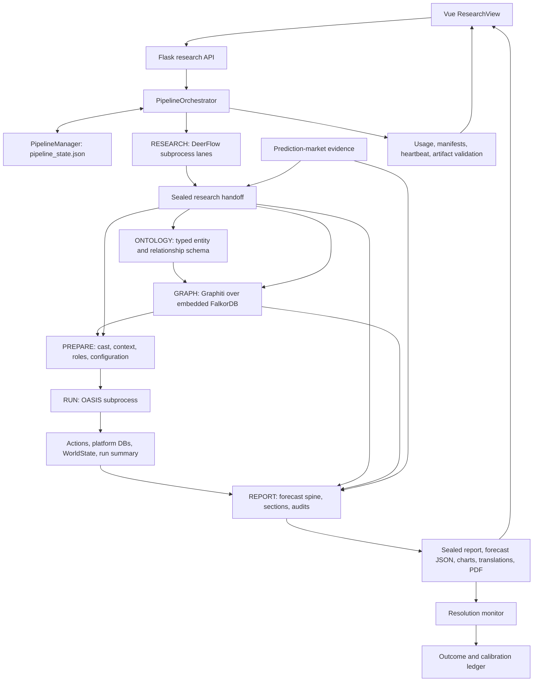

# ASTRA recommendations for DeepResearchForecast

**Review date:** 2026-09-07. **Source baseline:** `main` at `4be3ce4`, including the pre-existing uncommitted frontend cleanup visible during this review. **Scope:** architecture, workflow throughput, token efficiency, recoverability, observability, and operational cost. This report proposes changes; it does not claim they have been implemented or benchmarked.

**Implementation tracking:** The user subsequently authorized implementation. Current status and verification are recorded in [astra-improvement-state.json](astra-improvement-state.json) and [the optimization handoff](docs/handoff/astra-optimization/handoff.md). The findings and source anchors below describe the original audit baseline; they are not a claim that every issue remains open after later commits. Historical links into saved uploads, the assembled DeerFlow runtime and the original cleanup script refer to the original checkout at `/Users/rogerlin/Downloads/DeepResearchForecast`; those ignored or separately owned files are not duplicated in the implementation worktree. The active user priority is the [application context audit](docs/research/astra-integration-verification.md); accounting work resumes after its dependency-ordered repairs. Latest verified accounting slice: [ASTRA-04b5b3b1 recorded price coverage](docs/research/astra-cost-coverage-verification.md); full budget enforcement remains in progress.

The largest remaining opportunity is to preserve completed work and evidence across component boundaries. The system already has substantial concurrency, caching, retry limits, artifact validation, and recovery logic. Increasing concurrency or shortening research prompts indiscriminately would risk amplifying provider pressure, losing evidence, and creating more expensive retries. The next improvements should make compaction safe, make spending and launch admission durable, checkpoint expensive sub-operations, and remove repeated reads and polling.

The strongest immediate findings are:

1. Research compaction can replace discarded evidence with an error message, and downstream synthesis collectors do not recognize the compaction summary as evidence.
2. Pipeline creation has no durable launch-intent idempotency key; a lost successful response can lead to a second expensive run.
3. Research and simulation usage now reach the parent meter, but primarily at attempt/stage boundaries. A process-local meter is still insufficient for a live, cumulative run budget.
4. Concurrent report sections are retained in memory until the whole generation group returns; a crash or rejected report can require substantial regeneration.
5. Graph pagination repeatedly scans the complete edge set. Graph recovery and timeouts also operate at a coarser level than the expensive extraction work.
6. Calendar simulation invokes synchronous decision-model work from an async platform loop, and partial simulation recovery does not restore the complete evolving WorldState.

## 1. Evidence and limits

This review combined current source inspection, three parallel specialist investigations, the current handoff and Git history, recent Codex task summaries, older architecture/recovery notes, and saved run artifacts. Important findings from the specialist investigations were checked against their cited source. An independent document review checked the frontend/operations recommendations against current source. A separate forward test of the forensic skill reproduced the arithmetic from raw artifacts without reading this report; the primary review reconciled the remaining research, graph, simulation, and report findings.

The historical records are useful for prioritization, not proof of current speed. The 32 saved pipeline state files found under `backend/uploads/pipelines/` have creation dates from June 8 through July 15, 2026. They predate the August 17–18 optimization commits. No newer saved end-to-end benchmark was found in that directory. Source defaults are described as defaults; this audit did not inspect private `.env` values or assume those defaults equal a running process's configuration.

The evidence snapshot in [astra-evidence.json](docs/research/astra-evidence.json) records the selected aggregate measurements, source hashes, and line-reference checks. It excludes research prompts, article contents, credentials, and raw conversations.

Labels used below:

- **Confirmed:** directly supported by the inspected source or a saved artifact. This does not mean a new runtime reproduction was performed.
- **Conditional:** applies only to an enabled path, a failure/recovery scenario, or a larger workload.
- **Measurement needed:** the mechanism is visible, but its current runtime cost or the proposed gain has not been measured.

No application changes, paid requests, pipeline starts/resumes, saved-run edits, cleanup operations, or service restarts were performed for this report. Application test/build gates were not rerun for a documentation-only audit; old green gates are not represented as fresh verification.

## 2. How the system connects

### 2.1 The operating model

DeepResearchForecast is a modular application with a Flask control layer, a Vue interface, an embedded graph engine, and separately executed research/simulation runtimes. Its active pipeline remains `backend/app` plus `backend/scripts` and `deerflow_bridge`. The separate [`drf2` tree](drf2/README.md#L1) explicitly identifies itself as a scaffold before cutover. It should not be presented as the production orchestrator or used to justify a rewrite before the existing path is measured.

The arrows represent data/control dependencies, not an assertion that all optional paths run on every invocation. Simulation-to-observation-graph feedback is omitted from the main path because it is safety-policy controlled and normally disabled. Optional ensemble seeds add another PREPARE → RUN → REPORT branch.

### 2.2 Component and interface map

| Component | Responsibilities and connections | Main source |
|---|---|---|
| Vue application | Starts or resumes work through the research API; displays durable pipeline status, research logs/dossier, graph, simulation, and final report. Child panels also own polling. | [ResearchView](frontend/src/views/ResearchView.vue#L194), [research API](backend/app/api/research.py#L48) |
| Flask application | Registers API surfaces and serves the built SPA. Research, graph, simulation, report, settings, and SDK routes expose the underlying services. | [application factory](backend/app/__init__.py#L1), [API package](backend/app/api/__init__.py#L1) |
| PipelineOrchestrator | Owns the six-stage sequence, admission, cancellation, resume/fork, stage health, reuse checks, manifests, and telemetry lifecycle. | [start](backend/app/services/pipeline_orchestrator.py#L7539), [stage execution](backend/app/services/pipeline_orchestrator.py#L11498) |
| PipelineManager and TaskManager | PipelineManager persists the authoritative pipeline state. TaskManager provides task/progress integration; it is not a replacement for durable pipeline ownership. | [state writes](backend/app/services/pipeline_orchestrator.py#L899), [task model](backend/app/models/task.py#L1) |
| DeerFlow bridge | Starts isolated research lanes, drives the embedded DeerFlow client, gathers evidence, performs synthesis and actor research, and exports the file handoff. Tracked overlays reproduce changes in the assembled `deer-flow/` runtime. | [bridge integration](deerflow_bridge/README.md#L1), [research runner](backend/app/services/pipeline_orchestrator.py#L1957), [parallel research](backend/app/services/pipeline_orchestrator.py#L10680) |
| Research contracts | Bind reports, actors, sources, lane/attempt lineage, and actor-evidence receipts. They let later stages reuse a coherent artifact set rather than infer completion from file existence alone. | [research reuse gate](backend/app/services/pipeline_orchestrator.py#L11518), [actor context](backend/app/services/actor_context.py#L1) |
| Ontology and graph | Generate the entity/relationship schema, seed known actors, extract additional facts from research chunks, resolve/prune entities, derive graph priors, and expose search/temporal relationships. | [ontology stage](backend/app/services/pipeline_orchestrator.py#L11916), [graph stage](backend/app/services/pipeline_orchestrator.py#L11998), [Graphiti runtime](backend/app/services/graphiti_client/runtime.py#L1) |
| Graph compatibility layer | Existing `zep_*` names provide compatibility-facing graph readers/search/tools over the local Graphiti runtime. Names alone should not be interpreted as proof of an active hosted Zep dependency. | [graph client](backend/app/services/graphiti_client/client.py#L1), [ZepToolsService](backend/app/services/zep_tools.py#L1) |
| Simulation preparation | Selects the cast, builds bounded actor context and canonical roles, prepares platform profiles/calendar/configuration, and seals exact inputs. This joins source evidence and graph structure to executable personas. | [simulation manager](backend/app/services/simulation_manager.py#L1), [actor roles](backend/app/services/actor_role_prompt.py#L1), [PREPARE stage](backend/app/services/pipeline_orchestrator.py#L12342) |
| Simulation runner | Starts and monitors OASIS processes; records platform status, actions, health, checkpoints, and summaries. The parallel script executes Twitter/Reddit loops, calendar events, and shared world evolution. | [runner admission](backend/app/services/simulation_runner.py#L450), [parallel runner](backend/scripts/run_parallel_simulation.py#L1) |
| Decision channel and WorldState | Converts actor actions into structured commitments and evolves scenario shares under explicit round-status semantics. Failed/missing decisions must not be mistaken for abstention or equilibrium. | [decision elicitation](backend/app/services/decision_channel.py#L224), [world evolution](backend/scripts/run_parallel_simulation.py#L3273), [WorldState](backend/app/services/worldstate.py#L1) |
| Report pipeline | Builds structured forecasts, searches graph/simulation evidence, generates concurrent body sections and dependent summaries, audits/repairs output, applies market provenance rules, and publishes report artifacts. | [report tools](backend/app/services/report_agent.py#L8695), [section generation](backend/app/services/report_agent.py#L9206), [forecast extraction](backend/app/services/forecast_extractor.py#L1) |
| Presentation artifacts | Visualization produces chart files and a manifest; APIs deliver sandboxed charts, report text, forecast JSON, translations, and cached PDFs. The UI consumes these rather than recomputing forecast authority. | [visualizer](backend/app/services/report_visualizer.py#L1), [chart delivery](backend/app/utils/chart_html.py#L1), [report UI](frontend/src/components/research/ForecastReport.vue#L233) |
| Markets and calibration | Public market evidence enters research and forecast comparison. Contract equivalence/confidence constrain influence. Later resolution monitoring writes outcome evidence for calibration/backtesting. | [market influence gate](backend/app/services/forecast_extractor.py#L1845), [resolution monitor](backend/scripts/resolution_monitor.py#L183), [forecast ledger](backend/app/services/forecast_ledger.py#L1) |
| MCP and DRF2 adapters | Expose selected graph/simulation capabilities to external agent clients; they reuse engines and are distinct from the current Flask orchestrator. | [graph MCP](backend/app/mcp/kg_server.py#L317), [simulation MCP](backend/app/mcp/sim_server.py#L200), [DRF2 status](drf2/README.md#L1) |

### 2.3 The four boundaries that determine efficiency

**Control and ownership.** `/api/research/run` creates a new pipeline, records its state, and launches a background thread. `pipeline_state.json` remains the recovery authority. Per-pipeline locks and atomic writes protect threads in the current process, but those locks are not durable admission transactions across processes. This matters if retries, multiple tabs, or future web workers create competing owners. [Admission](backend/app/api/research.py#L48), [thread launch](backend/app/services/pipeline_orchestrator.py#L7539), [locking](backend/app/services/pipeline_orchestrator.py#L899).

**Evidence and artifacts.** Research hands off reports, actor/source structures, receipts, and manifests. Ontology/graph/PREPARE consume those artifacts; PREPARE binds exact role/configuration bytes to the child simulation. Reports combine source evidence and simulation diagnostics under publish gates. Faster reuse must remain keyed to source, schema, configuration, time horizon, and policy. File existence, a plausible persona, or a process exit code alone is insufficient. [Research reuse](backend/app/services/pipeline_orchestrator.py#L11518), [configuration seal](backend/app/services/simulation_manager.py#L52), [run completion gate](backend/app/services/pipeline_orchestrator.py#L9678).

**Provider execution and accounting.** The backend LLM wrapper, Graphiti adapter, DeerFlow model middleware, and OASIS/CAMEL path are different call surfaces. Research already uses shared SQLite leases at the provider boundary; a generic recommendation to add a research semaphore would duplicate existing work. The unresolved issue is consistent run/attempt/operation attribution and budget authority across these surfaces. [Research lease](deerflow_bridge/patches/middlewares/model_concurrency_middleware.py#L26), [backend meter](backend/app/utils/telemetry.py#L230), [OASIS integration](backend/app/utils/oasis_llm.py#L1).

**Observation and user interaction.** The browser reads status and artifacts; it does not own pipeline execution. Polling should follow visibility and artifact revision, while usage shown in the UI must distinguish unavailable data from zero. A hidden panel should not keep rereading static profiles or full reports. [Parent polling](frontend/src/views/ResearchView.vue#L600), [status response](backend/app/api/research.py#L304).

## 3. Historical performance baseline, recomputed

Reference: `pipe_f23527f7d903`, created July 9, 2026 at 08:12:33 UTC and last updated at 22:10:12 UTC. The saved state and telemetry establish approximately **13h57m39s** elapsed. Stage wall times total **12h26m26s**, leaving **1h31m13s outside those recorded main-stage intervals**. The saved ensemble artifact identifies two additional seeds; do not assign every unclassified second to a sub-operation without a trace.

| Main stage | Recorded wall time | Recorded tokens | Interpretation |
|---|---:|---:|---|
| RESEARCH | 2h37m53s | 79,749,778 | 96.10% of recorded main-run tokens; dominant recorded token consumer |
| ONTOLOGY | 45s | 44,760 | Small contribution in this run |
| GRAPH | 8h37m31s | Raw meter entry absent | 61.78% of total elapsed; provider usage is unquantified |
| PREPARE | 4m51s | 20,858 | Excludes any historically unattributed work |
| RUN | 9m51s | Raw meter entry absent | Separate health artifact records 221 platform LLM calls |
| REPORT | 55m37s | 3,168,343 | Parent stage meter; report-local total is 3,168,162 |
| **Main-run meter** | **Stage sum: 12h26m26s** | **82,983,739** | A recorded aggregate with known missing coverage |

Precision correction from the September 7 refresh: the compact stage telemetry projects zero values for GRAPH and RUN, while the raw run meter omits both stage entries. Their usage is therefore unquantified. See [the refreshed verification](docs/research/astra-unresolved-verification.json).

Two additional report artifacts record **2,007,374** and **4,349,252** tokens, totaling **6,356,626**. Adding these distinct report records produces **89,340,365 tokens of reconciled recorded coverage**. It still does not reconstruct all historical graph/simulation/failed-request usage. Without request-level history, the large synthetic research aggregate also cannot be independently proven free of upstream cumulative-snapshot overcount. Consequently this is not a mathematically established lower bound on actual provider consumption.

The research subtotal is already included in 82,983,739. Adding 79,749,778 again yields 162,733,517 and double-counts the same work. The 181-token difference between the parent report stage meter and report-local meter also demonstrates why independent summaries should be reconciled rather than silently substituted or added.

Sources: [pipeline stage telemetry](backend/uploads/pipelines/pipe_f23527f7d903/telemetry.json), [raw run meter](backend/uploads/pipelines/pipe_f23527f7d903/run_telemetry.json), [saved state](backend/uploads/pipelines/pipe_f23527f7d903/pipeline_state.json), [ensemble lineage](backend/uploads/pipelines/pipe_f23527f7d903/handoff/ensemble_forecast.json), [seed report 1](backend/uploads/reports/report_c80ca48e67d1/telemetry.json), [seed report 2](backend/uploads/reports/report_cf220c2cb963/telemetry.json). These local runtime artifacts are not promised to exist in a fresh clone; the sanitized evidence snapshot preserves the selected aggregates.

**Measurement rule:** stage wall time, request latency, CPU time, provider wait time, and total billed usage are different quantities. Summed concurrent request durations can exceed elapsed time. A timeout count multiplied by its configured limit is not automatically critical-path delay. Future measurements should record operation start/end and parent/child relationships, following the span model described by [OpenTelemetry](https://opentelemetry.io/docs/specs/otel/overview/).

## 4. Existing improvements to retain and validate

These are present in current source and should not be recreated as new optimizations:

| Already present | Remaining acceptance question |
|---|---|
| Claude prompt-cache markers and an override to bound summarizer input | Are cache reads/writes visible and economically useful on the actual provider/auth path? Is compaction lossless enough? [Provider patch](deerflow_bridge/patches/models/claude_provider.py#L1), [trim handling](deerflow_bridge/patches/middlewares/summarization_middleware.py#L159) |
| Delta-aware same-message usage overlay; failed research attempt accounting | Can every child delta and failure be reconciled durably and before a budget is exceeded? [Overlay](deerflow_bridge/patches/apply_subagent_overlays.py#L1), [failure meter](backend/app/services/pipeline_orchestrator.py#L1900) |
| Cast-based graph chunk filtering and bounded per-chunk retry attempts | Do individual episode deadlines and durable checkpoints retain successful work? [Filter](backend/app/services/graph_builder.py#L2300), [attempt budget](backend/app/services/graphiti_client/runtime.py#L666) |
| Incremental parent telemetry flush and simulation subprocess usage import | Do counters survive the import/persist crash window and reflect live child usage? [Parent flush](backend/app/services/pipeline_orchestrator.py#L7176), [simulation import](backend/app/services/pipeline_orchestrator.py#L10092) |
| Completed-simulation reuse and exact artifact/completion checks | Can a partially completed calendar simulation restore its world state correctly? [Reuse](backend/app/services/pipeline_orchestrator.py#L9595) |
| Report section concurrency of six, context propagation, and bounded purity escalation | Can successful sections be persisted immediately and resumed independently? [Current concurrent path](backend/app/services/report_agent.py#L10427) |
| Shared Plotly bundle on disk with sandbox-preserving serve-time inlining | Can transfer/parse cost be reduced without weakening isolation? [Delivery](backend/app/utils/chart_html.py#L1) |
| Forecast-market confidence gate, persistent influence trace, and restoration after anchor rejection | Are these preserved in every optimization and new calibration record? [Gate](backend/app/services/forecast_extractor.py#L1845), [restoration](backend/app/services/forecast_extractor.py#L2359) |
| Resolution-monitor manual trigger and default-off scheduler | What cadence and report population should actually be monitored? [Scheduler](backend/app/services/resolution_autorun.py#L1) |
| Root research UI, adaptive parent polling, live run vitals, binary forecast table, bounded console rendering | Do child panels follow the same lifecycle and visibility rules? [Root view](frontend/src/views/ResearchView.vue#L194), [report UI](frontend/src/components/research/ForecastReport.vue#L1) |
| Persistent embedding cache and a bounded embedding executor | Measure cache misses/model loading before changing embedding hardware or adding another cache. [Embedder](backend/app/services/graphiti_client/embedder.py#L1) |

The user-owned `reclaim_report_space.py` and its tests also exist as untracked files. They are a current cleanup candidate, not an accepted implementation owned by this audit. Likewise, the deleted legacy frontend tree is an in-progress change, not an invitation to recreate it or claim its browser acceptance.

## 5. Prioritized recommendation register

Priorities are relative to this workflow. **P1** should precede broader tuning because it prevents evidence loss, duplicated spending, or expensive rework. **P2** improves throughput or operating reliability after those boundaries are sound. **P3** reduces maintenance cost. Effort is a rough planning estimate for one engineer, including focused validation: S = roughly 1–2 days, M = several days, L = more than a week. These are not delivery commitments.

| ID | Priority | Recommendation | Principal benefit | Confidence / effort |
|---|---|---|---|---|
| ASTRA-01 | P1 | Make compaction failure non-destructive | Avoid lost evidence and repeated research | Confirmed / S–M |
| ASTRA-02 | P1 | Carry typed compaction evidence into every synthesis consumer | Avoid silently discarded prior research | Confirmed / M |
| ASTRA-03 | P1 | Add durable launch-intent idempotency | Prevent duplicate expensive pipelines | Confirmed / M |
| ASTRA-04 | P1 | Unify durable usage and cumulative budget enforcement | Bound spend across processes and resumes | Confirmed / L |
| ASTRA-05 | P1 | Checkpoint report sections and repair phases | Preserve completed report work | Confirmed / M–L |
| ASTRA-06 | P1 | Checkpoint graph episodes and use individual deadlines | Preserve extraction work across failure | Confirmed mechanism; gain unmeasured / M–L |
| ASTRA-07 | P1 | Seal full WorldState before enabling partial calendar resume | Correct and economical simulation recovery | Conditional / L |
| ASTRA-08 | P2 | Move decision-model waits off the simulation event loop | Keep async platform/IPC work responsive | Confirmed / M |
| ASTRA-09 | P2 | Read graph edges once per snapshot | Remove repeated complete graph scans | Confirmed / S–M |
| ASTRA-10 | P2 | Read only the required research checkpoint; balance actor context | Reduce local history work and truncation bias | Confirmed / M |
| ASTRA-11 | P2 | Measure cache economics and marginal evidence yield | Tune tokens without sacrificing evidence | Measurement needed / M |
| ASTRA-12 | P2 | Bound report tool results consistently and attribute operations | Reduce context replay and locate slow phases | Confirmed / M |
| ASTRA-13 | P2 | Make all UI polling lifecycle- and revision-aware | Reduce repeated requests and stale updates | Confirmed / S–M |
| ASTRA-14 | P2 | Reduce chart transfer/parse cost and harden bundle reads | Improve report loading and predictable memory use | Confirmed / M |
| ASTRA-15 | P2 | Produce forecast vectors per ensemble seed, then one report | Avoid multiplying narrative-generation cost | Conditional / M–L |
| ASTRA-16 | P2 | Validate reproducible CI and current frontend acceptance | Catch integration regressions earlier | Confirmed configuration gaps / M |
| ASTRA-17 | P2 | Build dependency-aware retention around the existing cleanup work | Avoid disk exhaustion without breaking lineage | Confirmed need; policy pending / M |
| ASTRA-18 | P2 | Avoid reparsing every successful JSON response | Reduce server CPU and temporary allocations | Confirmed / S |
| ASTRA-19 | P2 | Share backend port configuration and probe through the UI origin | Prevent healthy-looking but disconnected startup | Confirmed / S |
| ASTRA-20 | P3 | Extract a few stable stage interfaces and shorten continuity reads | Reduce change/review overhead | Confirmed scale; benefit unmeasured / incremental |

### ASTRA-01 — Make compaction failure non-destructive

**Evidence.** The middleware catches summary-model errors and returns `Error generating summary: ...` as ordinary text. Both sync and async paths then build a summary message and return `RemoveMessage(id=REMOVE_ALL_MESSAGES)` plus preserved recent messages. The older segment can therefore be removed even though no useful summary was produced. Empty/invalid model output also lacks a clear success contract at this boundary. [Summary calls](deerflow_bridge/patches/middlewares/summarization_middleware.py#L202), [replacement](deerflow_bridge/patches/middlewares/summarization_middleware.py#L265).

**Change.** Return a typed successful summary or a typed failure. Replace messages only after successful validation and durable evidence/checkpoint capture. On failure, preserve the pre-compaction state and use bounded retry or a resumable stop if the context cannot safely fit. Repeatedly calling the model with an over-limit unchanged context is not a useful fallback.

**Acceptance.** Inject timeout, rate limit, empty output, and malformed summary into both paths. Verify the original evidence remains available, no error text becomes research evidence, retry count is bounded, and a subsequent successful compaction preserves cited claims/numbers/receipt references. Measure avoided re-research and judge-repair calls rather than claiming an immediate fixed speedup.

### ASTRA-02 — Preserve typed compaction evidence through synthesis

**Evidence.** Compaction emits a `HumanMessage(name='summary')`. The shared synthesis collector accepts tool/AI messages and one special parallel-evidence human prefix; it does not accept the compaction summary. Track-B synthesis accepts only tool/AI messages. The assembled client's HumanMessage serializer also needs attention because summary identity is not preserved in its simple human-message projection. [Summary producer](deerflow_bridge/patches/middlewares/summarization_middleware.py#L317), [shared consumer](deerflow_bridge/deerflow_research.py#L6804), [actor consumer](deerflow_bridge/deerflow_research.py#L13725), [runtime serializer](deer-flow/backend/packages/harness/deerflow/client.py#L341).

**Change.** Add producer-owned summary metadata and provenance, preserve it through serialization, and have both synthesis consumers use one evidence collector. Mark summaries as derived evidence with links to original receipts. Do not admit arbitrary human messages merely because they contain the word “summary,” and do not promote a generated paraphrase to a fetched-source receipt.

**Acceptance.** A source fact present only in the compacted segment reaches global synthesis and actor synthesis with its evidence identity intact. An original user instruction and a spoofed summary remain excluded. Cover ordinary execution, checkpoint reload, shared worker notes, and Track B. This is a prerequisite to lowering the summarization threshold or input cap.

### ASTRA-03 — Add durable launch-intent idempotency

**Evidence.** Every successful `/run` request calls `PipelineOrchestrator.start`, which generates a new UUID, saves a running record, and starts a thread. The API has no request idempotency key or persistent intent lookup. Frontend button suppression cannot cover a response lost after server admission. [API](backend/app/api/research.py#L48), [creation](backend/app/services/pipeline_orchestrator.py#L7539).

**Change.** Generate a launch-intent ID in the client and persist an atomic mapping from that ID plus a canonical request hash to one pipeline ID. A repeated identical request returns that pipeline; reuse of a key for changed input returns a conflict. Persist an admitted/queued state before dispatch, and make recovery reconcile that same admitted job after a crash. Keep intentional repeat forecasts possible through a new intent ID; prompt-text equality alone is not idempotency.

**Acceptance.** Test double-clicks, two tabs sharing an intent, lost responses, simultaneous requests, and crashes between admission and dispatch. Exactly one pipeline and one launch result must exist for the same intent. A different key must still allow an intentional repeat. This is likely among the best savings per unit of implementation effort because it prevents an entire redundant workflow.

### ASTRA-04 — Make usage and budgets durable across processes and attempts

**Evidence.** `check_budget` reads an in-memory run meter after calls. The parent captures previous-attempt totals for file rollups but does not make that persisted cumulative total the budget authority. Research usage is imported as a synthetic record; simulation snapshots are imported at boundaries. Simulation import writes an attempt-token marker before recording in the memory meter, explicitly accepting a crash undercount; later snapshots with the same token are skipped. The status API turns absent live spend into a zero-spent budget. [Budget check](backend/app/utils/telemetry.py#L402), [attempt base](backend/app/services/pipeline_orchestrator.py#L7176), [research import](backend/app/services/pipeline_orchestrator.py#L10049), [simulation import](backend/app/services/pipeline_orchestrator.py#L10092), [UI budget payload](backend/app/api/research.py#L316).

**Change.** Extend the existing metering path into a durable operation ledger shared by parent and children. Record run, attempt, operation/request identity, provider/model, source of usage, cumulative snapshot version, cache read/write/uncached tokens, actual-or-estimated billing basis, and status. Commit deduplication and counter updates together. For a growing same-ID cumulative snapshot, apply only positive deltas; repeated identical snapshots are zero. Use the durable cumulative run total on resume. Add conservative pre-call reservations and settle them against reported usage, with explicit treatment of requests whose outcome is unknown. Reuse the existing research permit infrastructure where suitable; avoid a second competing admission mechanism.

**Acceptance.** Multiple child processes, duplicate delivery, same-ID growth, cancellation, parent restart, and a crash between write steps reconcile to one total. A resumed run retains previous spend. Budget overshoot is bounded by admitted outstanding reservations, not by a whole research stage. Unknown usage remains unknown in the UI. Provider invoices/subscription capacity and estimated API prices remain separately labeled.

**Tradeoff.** A local SQLite ledger is a plausible narrow fit, but transactions should be short and its failure behavior deliberate. WAL allows concurrent readers with a writer, but does not create multiple simultaneous writers. Benchmark contention and checkpoint behavior before expanding deployment topology. [SQLite WAL](https://www.sqlite.org/wal.html), [SQLite isolation](https://www.sqlite.org/isolation.html).

### ASTRA-05 — Persist report work when it finishes

**Evidence.** Concurrent generation collects completed sections into an in-memory dictionary; tail sections run before that dictionary returns. The outer generation loop then saves sections. A failed publication/reuse check can discard the report candidate and mint a new report ID. Existing complete-report reuse and same-attempt repair do not supply durable per-section recovery. [Concurrent generation](backend/app/services/report_agent.py#L9206), [outer loop](backend/app/services/report_agent.py#L10427), [rebuild decision](backend/app/services/pipeline_orchestrator.py#L12818).

**Change.** Persist each completed section immediately under an attempt manifest keyed to outline, forecast spine, input artifacts, language, relevant policy, and model/prompt version. Persist expensive forecast extraction, audits, repairs, and translation as separate phases. Resume only valid completed phases; regenerate dependent summaries when a body section changes. Preserve prior candidates as provenance rather than overwriting accepted artifacts.

**Acceptance.** Kill a stubbed report after several sections complete and during final audit. Resume generates only missing/invalid work, retains stable section order, and still reruns every affected publication gate. Altering a source, forecast spine, language, or policy invalidates the correct dependents. Concurrent section completion becomes visible before the slowest section finishes.

### ASTRA-06 — Give graph episodes durable identities and deadlines

**Evidence.** The synchronous Graphiti bridge applies one operation deadline to the submitted coroutine. Concurrent ingestion gathers a batch under a graph lock and returns results after the batch completes. A whole-operation timeout cancels the coroutine, which correctly releases locks but may prevent delivery of already successful episode results. The orchestrator's reuse path is for a completed GRAPH stage; incomplete work enters reconstruction. [Operation timeout](backend/app/services/graphiti_client/runtime.py#L224), [batch](backend/app/services/graphiti_client/runtime.py#L1071), [reuse](backend/app/services/pipeline_orchestrator.py#L11998).

**Change.** Give each chunk a stable content/ontology/source-time/policy identity. Persist extraction state and committed episode identity as each operation completes. Place deadlines around individual expensive episodes, with a bounded batch deadline as a final safeguard. Resume verified completed episodes and retry only known incomplete ones. Reconcile ambiguous provider/DB completion before repeating writes. Retain the existing retry cap and actor-seed readback invariants.

**Acceptance.** In a batch with fast successes and one hung episode, successful results become durable and remain reusable after timeout/restart. Resume makes no extraction calls for verified committed chunks. Changed ontology or source time invalidates reuse. Duplicate/replayed results cannot inflate nodes or relationships. Measure calls per accepted chunk, skipped-chunk reasons, lock wait, and actual graph-stage wall time.

### ASTRA-07 — Couple partial simulation checkpoints to WorldState

**Evidence.** Platform checkpoints contain completed round, DB cursor, action counts, configuration hash, and optional RNG state. `_InbandWorldEvolution` initializes from the original seed and explicitly documents that after a process restart its trajectory covers only resumed rounds. Full world trajectory and decisions are written on finalization. Partial resume is controlled by `SIM_RESUME`, whose runner default is off; this differs from the already-implemented completed-simulation reuse. [Runner resume selection](backend/app/services/simulation_runner.py#L761), [checkpoint](backend/scripts/run_parallel_simulation.py#L3709), [WorldState initialization](backend/scripts/run_parallel_simulation.py#L3273), [finalization](backend/scripts/run_parallel_simulation.py#L3415).

**Change.** Before treating partial calendar recovery as equivalent to an uninterrupted simulation, seal a coordinated checkpoint containing platform watermarks/DB cursors, WorldState and convergence state, decision history identity, pending round coordination, RNG state, calendar position, and exact input/policy hashes. Restore only a mutually consistent checkpoint. Incremental trajectory persistence can also support truthful live visualization; clearly mark provisional data.

**Acceptance.** With deterministic model stubs, interrupt at several platform/round boundaries and compare resumed versus uninterrupted decisions, world shares, trajectory sequence, and final summary. Reject mismatched platform checkpoints and tampered configuration. Preserve explicit incomplete/degraded labels when exact recovery is unavailable. Never silently expose a reconstructed partial trajectory as a continuous authoritative forecast.

### ASTRA-08 — Keep blocking decision calls off the async loop

**Evidence.** The async calendar platform loop calls synchronous `_inband_evo.deliver`. Its advancement invokes `decision_channel.elicit_round`, ultimately making synchronous `llm.chat_json` calls. Provider latency therefore occupies the shared event-loop thread at that point. [Caller](backend/scripts/run_parallel_simulation.py#L4420), [advancement](backend/scripts/run_parallel_simulation.py#L3519), [model call](backend/app/services/decision_channel.py#L247).

**Change.** Use one ordered async world-evolution coordinator, with an async model path or bounded executor for the blocking call. Preserve the rule that both platform contributions are combined once and rounds advance in order. Do not call `to_thread(deliver)` independently for both platforms without serializing state transitions; that would introduce races in the shared WorldState.

**Acceptance.** A deliberately slow decision-model stub does not stall an event-loop heartbeat or unrelated IPC. Decisions occur once per joint round in order, cancellation cleans up pending work, and the next round sees the correct qualitative world update. Expect better responsiveness; end-to-end speedup depends on what independent work can safely overlap.

### ASTRA-09 — Stop rescanning all edges for each page

**Evidence.** Graph-builder information/raw-graph paths call `fetch_all_edges`. Every runtime `_list_edges` page calls `_fetch_edges_unfiltered`, parses the complete edge set, sorts it, and then takes a page. The no-WHERE strategy is a documented workaround for local FalkorDB edge-predicate loss and should be preserved. A warm UI cache does not remove cold report/validation/read costs. [Callers](backend/app/services/graph_builder.py#L2456), [raw graph](backend/app/services/graph_builder.py#L2597), [scan](backend/app/services/graphiti_client/runtime.py#L1741), [pagination](backend/app/services/graphiti_client/runtime.py#L1829).

**Change.** Offer a bulk snapshot read for internal callers, or capture one immutable bounded snapshot per cursor session and slice it without another DB scan. Invalidate by graph revision and bound memory/lifetime. Preserve graph isolation, stable ordering, deduplication, and the no-WHERE workaround.

**Acceptance.** For E edges and P pages, a complete read performs one complete scan rather than approximately P scans. Mutations cannot create missing/duplicated cursor results. Record database query count, rows parsed, cold/warm latency, and peak memory at realistic and larger graph sizes. The cost mechanism is confirmed; a seconds-saved claim awaits measurement.

### ASTRA-10 — Read the needed checkpoint and distribute actor context fairly

**Evidence.** The assembled `DeerFlowClient.get_thread` enumerates and serializes every checkpoint, then sorts the complete history. Bridge consumers subsequently search backward for the latest checkpoint containing messages. Track-B synthesis concatenates evidence and takes its first N characters when over budget, favoring early material. [Runtime history API](deer-flow/backend/packages/harness/deerflow/client.py#L472), [shared reader](deerflow_bridge/deerflow_research.py#L6865), [Track B](deerflow_bridge/deerflow_research.py#L13712), [head truncation](deerflow_bridge/deerflow_research.py#L13764).

**Change.** Add a latest-relevant-state accessor through the tracked overlay mechanism, respecting checkpoint namespace/lineage; retain full-history access for deliberate forensic use. Partition actor evidence by stable actor ID, decision-critical family, recency, and source identity before applying the synthesis budget. Reuse a common evidence collector after ASTRA-02 instead of adding another special-case projection.

**Acceptance.** Deep threads load the required state without serializing all prior snapshots. Subgraph/root namespace cases return the intended lineage. A late actor or late contradictory source still appears in bounded synthesis input. Output cannot exceed its budget, and every summary preserves source identity and explicit evidence gaps.

### ASTRA-11 — Tune research using measured cache economics and evidence yield

**Evidence.** The bridge already enables summarization with an 80,000-token trigger and 16,000-token retained tail in its tracked config, exposes a summarizer-input override, and supplies Claude cache markers. Historical uncached usage therefore cannot be projected onto today's path. [Config](deerflow_bridge/config.yaml#L1298), [override](deerflow_bridge/patches/middlewares/summarization_middleware.py#L159), [cache implementation](deerflow_bridge/patches/models/claude_provider.py#L1).

**Change.** After ASTRA-01/02, compare a small fixed evidence fixture across a few context/track settings. Record new unique supported claims, closed decision-critical gaps, contradictory evidence retained, fetched-source reuse, cached/uncached tokens, judge repair calls, and wall time. Preserve source fetch receipts and time cutoffs when sharing cached public evidence across lanes; keep lane-specific interpretation independent. Evaluate expensive enrichment only where a typed coverage gap remains.

**Acceptance.** A candidate setting reduces measured tokens or latency while meeting the same actor coverage, citation, market-contract, and contradiction checks. Include cold-cache, warm-cache, long-pause, and mixed-provider cases. Do not equate a lower displayed input-token total with lower billing, and do not assume API cache discounts apply identically to a subscription/OAuth route. [Anthropic caching documentation](https://platform.claude.com/docs/en/build-with-claude/prompt-caching) explains separate cache accounting; actual provider usage must establish this deployment's result.

### ASTRA-12 — Bound report tool context consistently and trace each operation

**Evidence.** The native-tool path truncates individual tool results to 8,000 characters before appending them. The ReAct path appends the returned result into its observation template without an equivalent boundary at that call site. Earlier observations remain in the evolving message list. Also, the default concurrent path explicitly skips per-section meter-difference accounting because a shared aggregate cannot be assigned to concurrent sections. [Native path](backend/app/services/report_agent.py#L9749), [ReAct observation](backend/app/services/report_agent.py#L10104), [telemetry limitation](backend/app/services/report_agent.py#L10468).

**Change.** Normalize both paths through one token-aware tool-result adapter. Return concise source-linked facts plus stable artifact handles; retrieve expanded text only when needed. Deduplicate identical reads against immutable graph/simulation/artifact versions. Do not cache live interviews or mutable searches as though they were pure functions. Add operation IDs and spans at outline, forecast-spine, section, tool, audit, translation, and visualization boundaries; meter inside each worker rather than subtracting global counters.

**Acceptance.** A large tool response stays within the agreed token budget in both paths and retains requested facts/source identifiers. Repeated immutable queries reuse results; changed artifacts invalidate them. Concurrent operation totals reconcile to the report total without overlapping-duration arithmetic. Measure input tokens per accepted section and repair rate, not just tool-call counts.

### ASTRA-13 — Apply polling policy to every child panel

**Evidence.** ResearchView uses `v-show` for simulation/report tabs, so hidden panels stay mounted. SimulationView makes five requests per refresh, including profiles, and schedules another refresh after completion while the runner is active. Its unmount handler clears an existing timer, but an outstanding request can later schedule a new one. ForecastReport polls partial sections and full report every three seconds until report/translation termination. Parent visibility-aware polling does not govern these child loops. [Mounting](frontend/src/views/ResearchView.vue#L217), [simulation requests](frontend/src/components/research/SimulationView.vue#L513), [scheduling](frontend/src/components/research/SimulationView.vue#L592), [report polling](frontend/src/components/research/ForecastReport.vue#L844).

**Change.** Pass an explicit active/visible state to panels or use a shared polling coordinator. Use cancellation plus a generation/unmounted guard before both state updates and timer scheduling. Give observation GETs short deadlines rather than inheriting the shared five-minute request timeout in [the API client](frontend/src/api/index.js#L8); retain explicit separate treatment of operation POSTs. Cache profiles by simulation/platform/artifact revision. Poll a small status/revision response and fetch only changed sections/body; stop or strongly back off hidden content and reconcile once when shown. The [partial-section endpoint](backend/app/api/report.py#L1481) currently returns all section bodies, so the change needs a backend revision contract as well as a frontend timer adjustment.

**Acceptance.** A hidden tab or background document produces no unnecessary content requests. Changing run/platform cannot apply stale responses. Unmounting during an in-flight call creates no new timer. At negligible response latency, current loops imply up to about 30 simulation requests/minute and 40 report requests/minute while active; these are cadence-derived upper approximations, not observed traffic. Record actual request count/bytes before and after a realistic long-run replay.

### ASTRA-14 — Optimize chart delivery without weakening isolation

**Evidence.** Shared Plotly files reduce disk duplication, but the API helper reinserts the full sibling bundle into each chart response. Its cache avoids repeated bundle disk reads, not repeated network bytes or browser parsing. `_read_bundle` follows `os.stat`/`open` on the sibling and checks for `</script`, but lacks its own regular-file, size, symlink, and trusted-root validation. [Inlining](backend/app/utils/chart_html.py#L31), [bundle read](backend/app/utils/chart_html.py#L54).

**Change.** First add bounded regular-file/containment checks and use a trusted renderer bundle identity. Then measure lazy chart loading, compressed HTTP responses, immutable response validators, or static previews with click-to-load interactivity. The [transformed HTML response](backend/app/api/report.py#L1091) needs an ETag derived from both chart and bundle identity; repeat delivery can return 304, but only after current publication authorization/integrity checks. A later option is a separately isolated chart document/runtime that safely reuses a trusted bundle. Do not broadly permit scripts or same-origin access for generated chart HTML merely to enable caching.

**Acceptance.** Sibling symlink, oversized bundle, non-file input, missing bundle, and untrusted identity fail safely. The existing opaque sandbox and blocked arbitrary external resources remain intact. A chart-heavy report loads only visible/selected interactive charts and shows materially lower transferred bytes/parse work. Keep portable exported HTML/PDF behavior explicit and test both local and served use.

### ASTRA-15 — Generate one narrative for an ensemble

**Evidence.** `_run_one_seed` repeats simulation preparation, execution, and full report generation for each extra seed. The historical two extra reports alone consumed 6.36 million recorded tokens. This is an optional path, and current safety policy must remain authoritative. [Seed execution](backend/app/services/pipeline_orchestrator.py#L8381), [ensemble coordination](backend/app/services/pipeline_orchestrator.py#L8148).

**Change.** If multi-seed evaluation is needed, have each seed produce a sealed structured forecast vector, diagnostic summary, and evidence references under the same scenario/question contract. Aggregate those vectors, then generate one report. Reuse immutable prepared actor/context artifacts where the exact inputs match, while keeping each simulation's mutable state independent.

**Acceptance.** All seeds use identical scenario IDs and resolution semantics, failures are explicit, and the number of long-form report generations stays one as seed count rises. Track whether additional seeds improve held-out calibration or merely produce correlated text. Agreement alone is not forecast accuracy; retain diagnostic-only simulation boundaries unless a separately validated policy permits influence.

### ASTRA-16 — Make CI match the codebase it claims to validate

**Evidence.** CI runs backend lint, a backend test job, and byte compilation. It has no frontend test/build job. Its unit job creates a light environment and then executes `uv run pytest` inside the backend project; the comment about a light-only suite should be checked against actual dependency resolution and collected tests. The inspected working tree includes active frontend deletions, making current route/import acceptance particularly relevant. [CI](.github/workflows/ci.yml#L1), [backend project](backend/pyproject.toml#L1), [frontend scripts](frontend/package.json#L1).

**Change.** Define an explicit offline unit group with pinned/locked dependencies, a separately provisioned integration group, and frontend unit/build gates. Record whether each test group needs the assembled DeerFlow runtime, graph libraries, or external binaries. Add a bounded browser acceptance job for root/aliases, direct load/refresh/history, hidden polling, missing API/assets, responsive layout, and keyboard behavior. Test the supported launcher against a stable health/identity contract rather than UI prose.

**Acceptance.** A clean clone can reproduce the documented groups. Offline tests issue no provider requests. Frontend removals cause no stale imports/routes; launcher readiness and cleanup are tested through the real script. Report actual CI outcomes before classifying a configured job as broken—this audit inspected the workflow, not a new hosted run.

### ASTRA-17 — Retain artifacts by dependency, then reclaim space

**Evidence.** Forks may share a base handoff; stage reuse, report publication, charts, PDFs, and calibration refer to earlier artifacts. A user-owned dry-run cleanup script already targets backup directories and historical inline Plotly duplication. Blind age-based deletion would conflict with those references. [Shared handoff resolution](backend/app/services/pipeline_orchestrator.py#L859), [fork dependencies](backend/app/services/pipeline_orchestrator.py#L7638), [existing cleanup candidate](backend/scripts/reclaim_report_space.py#L1).

**Change.** Extend and validate that candidate rather than create a competing cleaner. First fix its concrete planning boundaries: [bundle compatibility currently compares byte length](backend/scripts/reclaim_report_space.py#L140), not content identity; net savings must subtract newly created shared bundles; dry-run should simulate those writes; and ancestry containment must cover symlinked report/chart parents. Build a retention plan from active runs, retained reports, scenario forks, manifests, and calibration references. Separate reproducible caches from irreplaceable evidence. Preview reclaimable bytes and broken-reference risk, stage recoverable cleanup, and reseal any intentionally transformed artifact whose hash is part of a reuse/publication contract. Protect active writes and shared files. The existing [disk inventory script](backend/scripts/disk_usage_report.py#L17) can supply the initial area totals.

**Acceptance.** A dry run mutates nothing and accounts for all proposed bytes. Applying a fixture plan preserves retained report/chart/PDF access and fork/resume validation. Interrupted cleanup is recoverable. Canonical evidence and live run artifacts are never deleted by a generic age threshold. No cleanup was applied during this audit.

### ASTRA-18 — Avoid reparsing successful JSON responses

**Evidence.** The global production response hook calls `response.get_json()` for JSON responses to remove a possible `traceback` field. This reparses already serialized successful graph, dossier, report, and status payloads even when no traceback exists. [Response hook](backend/app/__init__.py#L138).

**Change.** Remove traceback fields before error serialization through a shared error response helper, or restrict this sanitization pass to responses that can contain them. Preserve existing production error redaction. Do not turn a performance cleanup into a broader response-format change.

**Acceptance.** Successful JSON is semantically unchanged and avoids the second parse; production error responses expose no traceback. Compare CPU time and peak allocations with a representative large graph/report fixture. This is a small local improvement; it should not be advertised as a major end-to-end speedup.

### ASTRA-19 — Validate the frontend-to-backend connection at startup

**Evidence.** The launcher honors `FLASK_PORT`, while the Vite proxy targets `http://localhost:5001`. Independently checking backend health and frontend HTML does not prove the UI proxy reaches the configured backend. An alternate backend port can therefore leave two healthy services that do not communicate correctly. [Launcher port](scripts/start.sh#L41), [proxy](frontend/vite.config.js#L13), [readiness checks](scripts/start.sh#L309).

**Change.** Derive the proxy target from the same resolved launch configuration and add one provider-free API identity probe through the frontend origin. Preserve PID/cwd/listener ownership checks and the normal Flask-served production SPA path.

**Acceptance.** Both default and alternate-port startup pass direct health and UI-origin API probes against the intended application. A wrong or unavailable proxy target fails readiness clearly and cleans up only launcher-owned processes. Include the fixture in ASTRA-16's launcher gate.

### ASTRA-20 — Extract stable interfaces and reduce repeated context loading

**Evidence.** The current orchestrator is 13,100 lines, bridge driver 16,988, report agent 13,472, and parallel simulation runner 5,366. These sizes are maintenance signals, not proof of CPU slowness. The handoff also mixes long historical records, superseded defects, and current status; this review had to resolve those contradictions manually.

**Change.** Extract small interfaces while implementing the preceding findings: usage events, stage input/output manifests, research evidence collection, report phase checkpoints, and simulation checkpoint state. Keep PipelineOrchestrator as coordinator during that work. Generate a concise current-state index linking to the append-only history and source. Consolidate duplicated projections/collectors only after contract tests establish equivalent behavior. Do not launch a wholesale microservice or DRF2 migration as a performance fix.

**Acceptance.** Each extraction preserves stage outputs and negative lineage/tamper tests. A reviewer can identify the authority and consumers of a changed contract without reading every large file. The current-state index identifies implemented, unvalidated, superseded, and open work with dates; no historical evidence is erased.

## 6. Implementation order and measurement plan

Work one coherent slice at a time. The recommended dependency order is:

1. **Protect existing evidence:** ASTRA-01 and ASTRA-02 together. These are prerequisites for more aggressive research compaction.
2. **Prevent unbounded duplicate work:** ASTRA-03; then ASTRA-04 in incremental parent/child ledger slices. Fix the UI's unknown-versus-zero representation with the ledger contract.
3. **Preserve expensive completed work:** ASTRA-05 and ASTRA-06. Each can be delivered independently with crash/restart fixtures.
4. **Correct partial simulation recovery:** ASTRA-07 before enabling or relying on that mode. ASTRA-08 can follow as a separate scheduling change with identical round semantics.
5. **Remove deterministic repeated overhead:** ASTRA-09, ASTRA-10, ASTRA-12, ASTRA-13, and ASTRA-14, prioritized using measured query/request/token costs.
6. **Tune workload size and optional features:** ASTRA-11 and ASTRA-15 only after instrumentation and quality gates support comparison. Fold ASTRA-16/17/18/19/20 into the relevant slices.

| Metric | Collection point | Decision it supports |
|---|---|---|
| Cumulative tokens by run/attempt/operation; known/unknown usage | Durable parent/child ledger | Budget enforcement and honest total cost |
| Uncached input, cache write/read, output, provider billing basis | Exact provider boundaries | Whether cache/compaction tuning saves actual cost |
| Stage elapsed plus operation spans, queue/lock/provider waits | Orchestrator and workers | Actual critical path and useful concurrency |
| Accepted source claims and closed critical gaps per incremental token | Research evidence/judge output | Whether another pass or lane is worthwhile |
| Submitted/accepted/reused/failed graph chunks and DB rows scanned | Graph ingestion/read paths | Extraction yield and redundant graph work |
| Accepted section tokens, time to first durable section, regenerated sections | Report phase manifest | Checkpoint and context-budget effectiveness |
| Event-loop lag, completed joint rounds, replay equivalence | Simulation coordinator | Responsiveness and correct recovery |
| Requests, response bytes, stale updates, chart parse/load time | Browser replay | Hidden polling and visualization cost |
| Retained/reclaimable bytes and reference validation | Retention dry run | Disk safety without evidence loss |

Use deterministic provider stubs and retained artifact fixtures for correctness. Run a few representative small/medium/large replays for local overhead. A later explicitly authorized controlled provider run can measure real latency/cache economics; compare identical questions, input artifacts, provider/model, date cutoffs, and policy, changing one lever at a time. Report medians and tails only with a sufficient sample; a single successful run is a case study.

Release a performance change only when its intended metric improves and its paired quality/recovery checks remain satisfied. No percentage speedup is promised by this report.

## 7. Repeated workflows worth packaging

The requested recent-history window is August 9–September 7, 2026. Recent Codex task summaries were inspected first; the detailed task **“Audit and optimize forecast workflow”** and August 16–18 repository records provide the strongest prior evidence. Older memory/rollout records were used for orientation and existing-asset discovery, not counted as additional occurrences inside the window. Chronicle was not available among the enabled tools. Local automation metadata contained no installed automations. Personal research, writing, translation, and administration appeared in recent task titles, but titles alone do not establish stable procedures or adequate recurrence.

| Repeated workflow | Supporting evidence and dates | Frequency / confidence | Form and decision |
|---|---|---|---|
| Reconcile saved run cost/time, retries, missing usage, and reused artifacts | August 16 Codex audit; August 17–18 handoff corrections; September 7 source review | At least two separate audit occasions; high | **Create one narrow skill:** `drf-run-cost-forensics`. The arithmetic, lineage, and current-vs-historical rules are costly and error-prone to rediscover. |
| Map architecture and trace producer/consumer contracts | August audit and September review; older July atlas supports existing coverage | Repeated; high | **Reuse/extend when needed:** existing `source-command-research-codebase` workflow and architecture atlas. No second generic architecture skill or specialist role. |
| Inspect pipeline liveness, provider gates, and resume lineage | Existing recovery playbook and current recovery contracts; older repeated incidents | High confidence in coverage; recent new recurrence limited | **Reuse:** `deepresearchforecast-recovery-audit`. Cost forensics complements it and grants no recovery authorization. |
| Monitor market resolution | August 18 scheduler/manual trigger now implemented | Recurring capability; cadence unspecified | **Skip a new automation:** the application already provides the mechanism. A schedule would duplicate it or invent a user preference. |
| Clean report/chart storage | August disk findings and current untracked cleanup candidate | Likely recurring and costly; implementation already present | **Extend existing code after validation:** ASTRA-17. No deletion automation or overlapping cleanup skill. |
| Package investing research, writing, communication, or personal administration | Several recent task titles, little confirmed procedural evidence | Insufficient | **Skip:** require repeated inputs, an agreed output standard, and source-level examples before packaging. |

The created [drf-run-cost-forensics skill](docs/workflows/drf-run-cost-forensics/SKILL.md) is a read-only playbook for saved-run cost/time reconciliation, also installed in the user skill directory for discovery. It does not start/resume jobs, change provider settings, delete artifacts, or schedule monitoring. It requires explicit accounting scope, artifact lineage, disjoint totals, uncertainty labels, and current-source reconciliation before recommendations. Existing custom agent roles already cover bounded code exploration/review; no new broad custom subagent was justified.

## 8. Delivery status

This report delivers a current architecture map, recomputed historical baseline, 20 prioritized recommendations with concrete acceptance criteria, an implementation sequence, and the requested compact recurring-work shortlist. The companion evidence JSON and narrow forensic skill support reproduction.

The recommendations remain open implementation work, indexed by `ASTRA-01` through `ASTRA-20`; they are not marked as passing features. No remote issue or speculative automation was opened for each suggestion. Existing application work in the dirty checkout remains user-owned. The continuity record links this audit to the next session without changing the project's feature specification.

## Implementation progress — 2026-09-07

ASTRA-01/02/03 are implemented and verified offline on the isolated optimization branch. ASTRA-04a now adds durable usage accounting, idempotent growing child imports, correct nested-call/persona attribution, and cumulative status with explicit unknown coverage. Full ASTRA-04 remains in progress because reservation and live-child coverage are pending. See [the implementation ledger](astra-improvement-state.json), [accounting runbook](docs/research/astra-usage-verification.md), and [new saved-run analysis](docs/research/astra-iteration-04-run-evidence.json). The hourly improvement loop continues; these changes do not establish global or production Pareto optimality.

- 2026-09-07T19:29:32.165379+00:00: ASTRA-04b1/04b2 now cover checkpoint-relative research observations and backend API attempts before response validation. The latest offline comparison reduces nested retries from nine to three transports and stops further calls after an empty response crosses the recorded budget. The final affected gate passed 741 tests; one deployment-only check skipped. Added accounting has a measured local overhead, and detached-child/reservation coverage remains incomplete. See [API attempt runbook](docs/research/astra-api-attempt-verification.md), [comparison](docs/research/astra-api-attempt-comparison.json), and [saved-run/log refresh](docs/research/astra-api-run-evidence.json).

- 2026-09-07T20:26:09.611959+00:00: ASTRA-04b3 adds visible unresolved API operations, indexed/transactional admission between owners, durable recoverable accounting errors and consistent completion/status projections.782 backend tests passed with one deployment-only skip. The [runbook](docs/research/astra-unresolved-verification.md) records the availability/uncertainty tradeoff and local read overhead. [Refreshed historical evidence](docs/research/astra-unresolved-run-evidence.json) explicitly distinguishes missing RUN entries from measured zero. Detached simulation attempt transport and reservations remain open.

- 2026-09-07T21:36:44.479039+00:00: ASTRA-04b4 now carries explicitly launched child usage directly into the parent ledger and captures each native nonstreaming SDK send before parsing. Launch-scoped completion permits active siblings; parent completion remains strict.960 affected tests passed with one deployment-only skip; independent69-case review clear. [The runbook](docs/research/astra-simulation-verification.md) records3calls/180tokens before childJSON, crash persistence, diagnostic replay protection, and local overhead. [Saved-run evidence](docs/research/astra-simulation-run-evidence.json) confirms43 simulation directories without historical token telemetry. Reservations, CLI physical provenance and deployment proof remain open.

- 2026-09-07T22:25:48.747239+00:00: ASTRA-04b5a replaces full usage projections on enabled budget checks with narrow cumulative reads, retaining cost rounding, exact threshold/recovery behavior and existing storage authority.998 affected tests passed with one deployment-only skip. The [runbook](docs/research/astra-budget-verification.md) records an83.01% token-only and27.92% cost-enabled local check-time reduction at10,000 synthetic rows; these are stress measurements, not historical row counts or whole-pipeline speedups. Default-disabled guards are unchanged. [Saved evidence](docs/research/astra-budget-run-evidence.json) calibrates observed aggregate counts separately. Reservations04b5b remain pending.

- 2026-09-07T23:33:46.182071+00:00: ASTRA-04b5b1 verified offline. Atomic API token holds and precise settlement prevent same-remainder concurrency and unheld retries. 1072 tests pass with one deployment-only skip; independent74-case review clear. Fixture dispatches2→1 and3→2, with a0.0710ms local successful-call median overhead. Full04 remains partial; explicit native factory output-cap configuration, monetary policy and broader coverage remain open. See the reservation verification runbook and receipt for limits.

- 2026-09-08T00:36:08.402049+00:00: ASTRA-04b5b2 now exposes explicit native output limits through the factory and detached-child launch without changing uncapped defaults or shrinking agent context. New launch receipts bind the policy and budgets; persisted same-simulation relaunch rejects policy drift, and actor/config seals remain intact. The final gate passed 1,165 tests with one deployment-only skip, plus independent review of all 67 new cases. [The runbook](docs/research/astra-native-cap-verification.md) and [comparison](docs/research/astra-native-cap-comparison.json) document deterministic capped admission and unchanged defaults. [Saved evidence](docs/research/astra-native-cap-run-evidence.json) leaves historical cap settings unknown. Monetary policy, broader coverage and the remaining recommendations stay open; the hourly loop continues.

- 2026-09-08T01:41:49.138035+00:00: ASTRA-04b5b3a adds captured API price estimates with strict configuration, model attribution and durable replay consistency. Dollar-enabled missing-price requests stop before dispatch; explicit zero remains distinct from unknown. The final gate passed1,266 tests with one deployment-only skip, and all101 new cases passed independent review. [The runbook](docs/research/astra-api-cost-verification.md) and [comparison](docs/research/astra-api-cost-comparison.json) show corrected synthetic admission and replay without a savings claim. [Saved evidence](docs/research/astra-monetary-run-evidence.json) distinguishes rough historical estimates from invoice proof. Monetary holds and run-wide price/coverage policy remain pending; the hourly loop continues.

- 2026-09-09T14:26:59.714746+00:00: ASTRA-04b5b3b1 now rejects dollar-enabled durable API dispatch against historical price gaps and exposes run-wide recorded coverage. Fresh 1,363 tests pass with one existing deployment-only skip; independent review passed all 97 new cases. Indexed coverage reads at 10,000 synthetic operations measure2.310521ms versus 338.115958 ms without the index; this is local feature overhead, not production latency or savings. See [verification and limits](docs/research/astra-cost-coverage-verification.md), [paired comparison](docs/research/astra-cost-coverage-comparison.json), and [saved-run/log evidence](docs/research/astra-cost-coverage-run-evidence.json). Dollar reservations and run-wide policy remain pending; graph/report recovery stays queued.

### Application context audit: September 11 continuation

The six-stage contract audit found additional context-loss and reuse defects, recorded as ASTRA-INTEGRATION issues in the existing ledger. Issue01 now resolves explicit actor-access denials across participating validated packs before globally broadcasting a claim; duplicate public copies cannot reintroduce the same normalized denied knowledge. A paired offline comparison improves 4/16 to16/16 passing actor scenarios and reduces denied case/channel observations71→0 while preserving24/24 positive marker observations and exact context packs. Independent review accepted this narrow repair. See [the source-linked boundary map, comparison and limits](docs/research/astra-integration-verification.md).

The broader request remains open. Next fix ontology sanitation-before-sampling (five reproduced strict-xfail scenarios), then ontology reuse/input binding and dependent invalidation. Subsequent confirmed gaps concern structured research artifacts across report entry points, report-chat context, and coalition action-history completeness. Twitter final-context attestation and repeated actor/action/graph preprocessing are explicitly tracked candidates. These additions carry falsifiable acceptance criteria in the integration handoff; they do not imply every component is verified in production. The canonical actor feature is deliberately passes=false until its remaining cross-stage criteria are met. No global or Pareto optimality claim is made.

- September 13: ASTRA-INTEGRATION-02 is verified offline. The shared sanitizer now retains complete safe documents for ontology sampling and graph splitting while preserving default/capped behavior. Five former ontology expected failures now pass. The full backend gate reports 3,905 passes, one known scaffold-path failure, 17 skips and 11 pre-existing xfails; independent review passed 69 cases. Exact-baseline comparison retains all tested late ontology/graph markers and preserves 56 capped/default sanitizer outputs byte-for-byte. Correct graph coverage increases episode count in expansion stress cases, so no speedup or savings is claimed. See [verification, comparative evidence and tradeoffs](docs/research/astra-ontology-context-verification.md). Next is ontology reuse/input binding and dependent invalidation (issue03), followed by report context closure.

- September13: ASTRA-INTEGRATION-03a verifies cached ontology artifact/project consistency before reuse and preserves the original registration. Shared scenario handoffs check both available owner and child proofs. Four invalid real-state-machine fixtures that previously completed now stop in ONTOLOGY; downstream stage entries16→0. Final backend gate3,923pass/1known scaffold failure/17skip/11existingxfail, with82independent passes. A tiny warm-storage guard fixture has0.205ms median validation cost; this is not a production speedup. The [integrity report](docs/research/astra-ontology-reuse-integrity.md) explicitly leaves the parent03 recommendation partial: input binding, strict new-generation publication and safe downstream invalidation/ownership remain to be implemented. Validation opt-out and legacy compatibility do not establish input freshness.

### September16: every successful run and product experience audit

The expanded [successful-run audit](docs/research/astra-successful-runs-audit-20260916.md) covers all26completed pipelines, all156stage rows,254runtime logs and597source receipts. It provides per-run counters, timings, retries, errors and coverage gaps. The saved inventory endsJuly15, so it cannot settle a claim about a newer150M-token run. In the best-recorded reference, research contributes96.10%of parent-recorded tokens; GRAPH is the largest saved interval and omits278/466chunks. Graph/RUN metering gaps and overlapping snapshots prohibit a complete cost or critical-path claim. The original checkout remains behind the isolatedASTRA implementation.

Current-code reproduction confirms that a timed-out concurrent graph batch discards the successful sibling receipt; replay duplicates that extraction. Prioritize durable graph episode receipts/deadlines (ASTRA06) after the direct-entry UI slice, preserving exact input identity, actor seeds and recovery correctness. The [visualization/Polymarket audit](docs/research/astra-viz-market-audit-20260916.md) additionally reproduces quote-provenance loss, positional token misalignment, invalid resolution acceptance and missing-value probability coercion. UI source reproduces false readiness, stale graph responses and unnecessary hidden-panel polling. These are separate evidence-backed repair slices, not a license to lower research quality or truncate context blindly.

- September16 direct-entry slice is verified offline: root/brand navigation, professional accessible workspace, truthful readiness and shared launcher/proxy port selection are implemented. A dev-only routing proof prevents reusing a frontend pointed at another healthy DRF backend. Final gate3,957backend passes/1known scaffoldfailure/17skip/11existingxfail;131frontend passes. See [verification and deployment limits](docs/research/astra-workspace-verification.md). Browser automation is stopped per the user's latest instruction; subsequent iterations focus on source review and code regressions. The next workflow slice is graph receipt preservation06a, with durable checkpoints still a separate boundary.

- September16 source-only workflow repair: ASTRA-06a now preserves acknowledged graph input-index/UUID receipts across the real synchronous batch timeout and accounts for started/unacknowledged versus never-started work. Unconfirmed async cleanup stops the stage. A review-found delivery race is corrected so final failure reasons are counted once. All21 new scenarios pass, with144focused and109independent passes; final backend3,978pass/1known scaffoldfailure/17skip/11existingxfail. The [verification](docs/research/astra-graph-receipt-verification.md) compares zero→one returned successful receipt in both timeout input orders while preserving core call counts and normal-path data. This is corrected receipt/accounting behavior, not measured token savings. FullASTRA06 remains partial for durable recovery and per-episode deadlines. Browser automation remains stopped.
