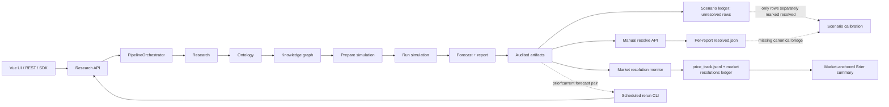
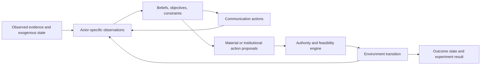
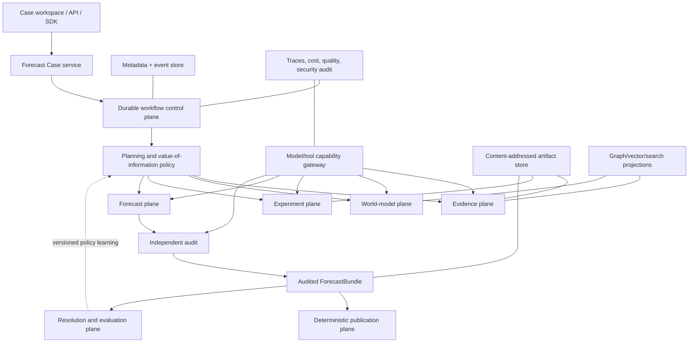

# CODEX_FOGLAMP.md

## A first-principles architecture for decision-grade forecasting

**Status:** Proposed target architecture

**Current-state snapshot:** 2026-07-17 at base commit `e58c928becc7f89036a7a2d9b0b5c3636b3f716a`, with a dirty working tree inspected directly

**Scope:** `frontend/`, `backend/app/`, `backend/scripts/`, and `deerflow_bridge/`

**Audience:** Product, forecasting, research, ML, platform, and operations engineers
**Implementation plan:** [`EXECPLAN_FOGLAMP.md`](EXECPLAN_FOGLAMP.md)

This document has two deliberately separate jobs:

1. describe how the live workflow works today, including what each stage passes to the next; and
2. propose a better system from first principles, without treating current module boundaries as constraints.

Statements under **Observed** describe the repository as it exists at the snapshot date. Statements under **Proposed** describe a future architecture. The pre-cutover `drf2/` tree is comparative design material, not the live implementation.

Source references name the owning symbol/file first; line numbers are snapshot conveniences and will drift as this dirty worktree evolves. Generated contract/lineage maps should become the long-term drift detector.

---

## 1. Executive thesis

The workflow should not be optimized to produce a long report. It should be optimized to produce a **resolvable, calibrated, auditable decision object** under explicit time and cost constraints.

The current system is impressive in breadth. It researches a question, extracts actors and facts, designs an ontology, builds a temporal knowledge graph, creates grounded personas, runs social simulations, writes and audits a report, extracts structured forecasts, monitors prediction markets, and accumulates partially disconnected calibration evidence. It also contains many hard-won safety mechanisms: atomic file writes, resumable stages, manifests and hashes, provider preflight, role contracts, publication gates, budget ledgers, heartbeats, and final audits.

Its deepest limitation is not a missing feature. It is that the workflow accumulated as a sequence of intelligent subsystems joined primarily by files and conventions. As a result:

- the prompt, research report, graph, simulation world state, report, `forecast.json`, and forecast ledgers each hold a different partial version of the truth;
- a file path often acts simultaneously as persistence, API, identity, cache key, and recovery signal;
- stage completion is easier to measure than epistemic progress;
- simulation output can influence a probability without a complete, inspectable chain from prior to evidence to adjustment;
- forecasting is still substantially owned by the report-generation stage; and
- the learning loop is present, but it is not yet the architectural center of the product.

The proposed architecture makes five inversions:

| Current center of gravity | Proposed center of gravity |
|---|---|
| Report as the product | `ForecastBundle` as the product; reports are projections |
| Knowledge graph as accumulated world state | Evidence and claim ledger as truth; graphs are rebuildable views |
| Simulation as a mandatory pipeline stage | Simulation as an optional, pre-registered experiment selected by value of information |
| Directory state plus in-process tasks | Durable case/run/attempt/event control plane |
| More generation to improve quality | Independent estimates, explicit uncertainty, resolution, scoring, and policy learning |

The long-term north star is:

> Given a precisely specified question and a budget, construct the smallest sufficient evidence and experiment program that produces an independently audited probability distribution, publish it without semantic drift, and learn from its eventual resolution.

### 1.1 Decision register: commitments versus hypotheses

This document is a target architecture, not one giant approved implementation plan. The distinctions below should remain explicit in future ADRs.

**Adopted architectural invariants**

- `ForecastBundle`, not report prose, is the authoritative semantic product.
- Evidence/source/claim records are the epistemic source of truth; graph/vector/search are versioned projections.
- Observed facts, inferences, causal hypotheses, simulated events, forecasts, and resolved outcomes never silently merge.
- One and only one mechanism owns workflow history, timers, attempts, retries, and state transitions.
- Simulation is a pre-registered, optional experiment selected by an explicit information-value/cost gate.
- All LLM-authored narrative and localization is audited before sealing; post-seal publication is deterministic.
- Forecasts remain live through revision, resolution, proper scoring, and versioned policy learning.

**Choices requiring an ADR or benchmark**

- Temporal-class workflow engine versus a transactional database state machine plus outbox.
- SQLite/filesystem timing versus PostgreSQL/object-store adoption.
- JSON Schema/Pydantic versus another language-neutral contract system.
- Aggregation baseline, calibration weights, minimum sample sizes, and scoring rules by target type.
- Graph/vector/search projection technologies and consistency SLOs.
- Which current model/provider routes are approved for each capability and sensitivity class.
- The empirical threshold and proxy used by the early information-value gate.

**Deferred research hypotheses**

- Whether OASIS signals improve held-out forecast skill in any specific domain.
- Whether learned task selection beats simple active-research heuristics.
- Whether domain-specific simulation-to-likelihood mappings can be calibrated.
- Whether causal discovery adds out-of-sample value beyond explicit expert/LLM hypotheses.
- Whether complex stacking or hierarchical calibration beats simple pools at available sample sizes.

---

## 2. What the system is actually trying to achieve

The visible user journey is “enter a research question and receive a forecast report.” The deeper job is more demanding:

1. **Specify the decision.** Convert an ambiguous prompt into resolvable propositions, outcomes, horizons, sources of truth, and decision context.
2. **Establish the outside view.** Find base rates, reference classes, historical analogues, and market priors before rich case-specific evidence creates anchoring.
3. **Build an evidence model.** Gather timely sources, normalize claims, record contradictions, identify gaps, and preserve provenance.
4. **Model mechanisms.** Represent actors, incentives, constraints, causal pathways, temporal dependencies, and signposts.
5. **Run useful experiments.** Test counterfactuals or interaction effects only when they are likely to change the decision.
6. **Make probabilistic judgments.** Produce committed binary, categorical, continuous, time-to-event, conditional, or multi-horizon distributions with explicit priors, adjustments, uncertainty diagnostics, and resolution criteria.
7. **Challenge the judgment.** Search for missing alternatives, correlated errors, leakage, circular use of market data, and unsupported certainty.
8. **Publish without mutation.** Render narrative, charts, translations, and exports from the same audited semantic object.
9. **Resolve and learn.** Track outcomes, score predictions, diagnose error, calibrate future estimates, and version the policy that changed.

This implies that report length, number of agents, number of sources, graph size, simulation action count, and token volume are **process telemetry**, not success metrics. The primary product metrics are resolution coverage, proper scoring performance, calibration, decision usefulness, traceability, timeliness, and marginal cost.

---

## 3. Observed architecture: how the live workflow fits together

### 3.1 System topology

The canonical runtime is a Flask backend and Vue frontend around a file-backed orchestration layer. The main path is:



The nominal stages are `RESEARCH → ONTOLOGY → GRAPH → PREPARE → RUN → REPORT`. The implementation lives primarily in `backend/app/services/pipeline_orchestrator.py`, with entry routes in `backend/app/api/research.py`.

### 3.2 Entry, state, and execution ownership

**Observed.** `POST /api/research/run` accepts a JSON body containing a free-text prompt plus mode, project name, depth, maximum rounds, language, and model overrides (`backend/app/api/research.py:43`). It runs environment/provider preflight, then starts `PipelineOrchestrator`.

The run is represented in two overlapping ways:

- persistent `PipelineState` in `uploads/pipelines/<pipeline_id>/pipeline_state.json`, including stage state, IDs, heartbeat ownership, options, and an artifact-path map (`backend/app/services/pipeline_orchestrator.py:213`); and
- a process-local singleton `TaskManager`, whose task dictionary disappears on process restart (`backend/app/models/task.py:54`).

`PipelineManager` wraps the file-backed state, schema migration, atomic writes, and process-local write locks (`backend/app/services/pipeline_orchestrator.py:295`). `PipelineOrchestrator._run` owns the end-to-end state machine, telemetry context, run manifest, heartbeat, stage reuse, cancellation, health enforcement, and terminal task updates (`backend/app/services/pipeline_orchestrator.py:7823`).

This arrangement is carefully defended against known races, but the orchestration authority is still split among a Python thread, a singleton task map, a state file, subprocess state, and the presence or integrity of artifacts.

### 3.3 Exact producer → handoff → consumer map

| Step | Main producer | Inputs | Durable outputs / state | Primary consumers |
|---|---|---|---|---|
| Intake | Research API + `PipelineOrchestrator.start` | Prompt, mode, depth, research model/language overrides, maximum rounds | `pipeline_state.json`, `run.json`, pipeline/task IDs, initial manifest plus later stage-entry snapshots; later graph/simulation/report policy can still resolve from mutable global configuration | Orchestrator, UI polling, resume/fork logic |
| Research | `DeerFlowResearchRunner` + `deerflow_bridge/deerflow_research.py` | Prompt, depth, language, provider/model, budget, prior checkpoints | Required `research_report.md`; optional `actor_dossier.md`, actors/sources/timeline/quantitative/contested/market/judge/chart sidecars when produced; manifests hash optional files only when present, and `actor_dossier_judge.json` has no promoted downstream consumer | Ontology, graph ingestion, persona/config generation, report, UI dossier, resume validation |
| Ontology | `OntologyGenerator` | `actor_dossier.md` when present, `research_report.md`, structured actors/context, forecast question | Project ontology and `handoff/ontology.json`; GraphBuilder currently consumes entity and edge type definitions, while richer fields are largely inert | Graph extraction; future downstream interpretation after ports exist |
| Graph | `GraphBuilderService` + Graphiti runtime | Dossier/report chunks, structured actor/relationship seeds, ontology, source-validated as-of time, embeddings | Graph ID, temporal entities/edges, `communities.json`, graph priors/statistics and ingest diagnostics; chunk ingestion preserves reference time but drops exact source/citation IDs and spans | Persona builder, simulation preparation, report tools, causal/coalition analysis |
| Prepare | `SimulationConfigGenerator`, `OASISProfileGenerator`, simulation manager | Prompt/report text, actors, broad graph context, graph priors, research horizon, optional scenario overlay; generator provider/model policy is read from global configuration rather than one immutable intake policy | `simulation_config.json`, Twitter/Reddit profiles, actor-cast and actor-role manifests, world seed, simulation metadata | OASIS simulation runners and resume checks |
| Run | `SimulationRunner` + `backend/scripts/run_parallel_simulation.py` | Simulation config, profiles, event schedule, tool/model policy, graph/world seed | Simulation SQLite/action logs, per-platform output, world-state trajectory, `run_summary.json`, simulation health and telemetry | Report tools consume selected action/statistic/trajectory fields; health, LLM degradation, agent-dynamics, and organic-ratio warnings do not currently steer forecast construction before publication |
| Forecast/report | `ReportAgent` + `forecast_extractor.py` + visualizers/exporters | Report prose sees actors, sources, full research report, quantitative/contested/timeline artifacts, graph priors/queries, simulation and market signals; the production forecast-spine call receives narrower truncated text and currently omits its supported `quantitative_facts` and `base_distribution` arguments | Structured forecast spine, binary forecasts, report sections, citations, `forecast.json`, audits, visual manifests/assets, Markdown/PDF/translations, telemetry | UI/export, scheduled reruns, resolution monitor, forecast ledger |
| Manual scenario resolution | SDK resolve API + `backtest.score_forecast` | Report ID, selected scenario outcome, stored forecast | Per-report `resolved.json` with the forecast snapshot and score | Manual resolution path; separate `forecast_tools.py` supports offline/read-only backtesting, and this endpoint does **not** update the shared scenario ledger automatically |
| Market resolution monitor | `resolution_monitor.py` + `forecast_ledger.py` | Market-anchored binary forecasts and current Polymarket state | Per-report `price_track.jsonl`, shared market `resolutions.jsonl`, Brier summary, `monitor_report.md`, manual-resolution candidates | Operator monitoring and market Brier reporting; it is separate from scenario-ledger calibration |

Structured-forecast finalization appends scenario-ledger entries as `resolved=false` before citation stabilization and the authoritative final audit. The append is non-idempotent, so a later-rejected attempt or retry can leave stale/duplicate draft rows. `calibration_summary()` reads only ledger entries already marked resolved, while `POST /api/v1/resolve/<report_id>` writes a separate `resolved.json` (`backend/app/api/sdk.py:283`). Therefore the scenario resolution → shared calibration → future forecast loop is only partially wired today; `resolution_monitor.py` is a different market-anchored binary ledger rather than the missing bridge. Migration must bind imports to a publishable audit and exact forecast hash, deduplicate by stable claim/revision, and quarantine unverifiable draft rows.

### 3.4 The research handoff is the de facto data bus

The research contract explicitly names a core group of files in `_RESEARCH_CONTRACT_FILES` (`backend/app/services/pipeline_orchestrator.py:1989`). A separate stage artifact registry maps user-visible/reusable names to paths (`backend/app/services/pipeline_orchestrator.py:5848`). These registries improve integrity and resume behavior, but they do not cover every downstream-consumed artifact equally:

- research can register a rich dossier, but the core contract can validate with only `research_report.md`; actor dossier and judge sidecars are optional and unevenly consumed;
- ontology registers `ontology.json`;
- graph formally registers mainly `communities.json`, while the actual graph lives behind a graph ID and graph backend;
- prepare registers config/profile/role files in a different simulation directory;
- run formally registers `run_summary.json`, while significant action/world-state data lives elsewhere; and
- report formally registers a visualization manifest while the report manager owns many additional files.

Consequently, consumers mix explicit artifact lookup, reconstructed paths, manager APIs, graph IDs, report IDs, and directory scans. The system has an artifact list, but not yet a universal artifact catalog.

The reverse lookup is concrete: `ReportAgent` is not always given a pipeline ID or handoff root. For market, timeline, and market-price-history inputs it can scan pipelines and match a `simulation_id` back to a handoff directory (`backend/app/services/report_agent.py:2466`, `backend/app/services/report_agent.py:7862`). This is an identity lookup implemented through storage traversal.

### 3.5 What enters the report stage

The report stage illustrates both the richness and the coupling of the workflow. The orchestrator constructs `ReportAgent` with:

- graph ID and simulation ID;
- the original forecast requirement;
- an actor situation brief and structured actors;
- sources and the complete research report;
- scenario label and base simulation ID for what-if comparison; and
- quantitative facts, contested claims, timeline events, and graph priors when supported (`backend/app/services/pipeline_orchestrator.py:8999`).

The report agent can then query knowledge-graph and simulation tools, derive a forecast spine before prose, extract independent binary forecasts, compare market anchors, write sections, repair citations, render visuals, produce translations/PDFs, run final audits, and append forecast information to the ledger. However, evidence available somewhere inside `ReportAgent` is not equivalent to evidence delivered to the probability generator:

| Input/state | Available to prose/tool orchestration | Delivered structurally to the production spine | Persisted disposition lineage |
|---|---:|---:|---:|
| Research report and actor forecast inputs | Yes | Yes, truncated text | Partial |
| Simulation signal pack | Yes | Yes, truncated text | Partial |
| Quantitative facts | Yes | No, although the spine supports the argument | No exact selected/omitted trace |
| WorldState `base_distribution` | Yes as implicit trajectory text | No typed argument in the production call | No typed adjustment record |
| Research `forecast_confidence_penalty` | Written to sidecars | No policy effect by design | Write-only |
| Simulation health/LLM/organic warnings | Stored in `run_summary.json` | Not consumed before forecast | Pipeline health evaluates after report |

The target `ForecastEvidencePack` must record included evidence, omitted evidence and reason, truncation/budget decisions, quality-signal disposition, and exact source/experiment IDs. A contract test should fail whenever an enabled input is silently absent.

The most important simulation-to-probability handoff is the current **decision channel**:

1. research injects or reconstructs `actors.forecast_inputs.scenarios` before sealing `actors.json` (`PipelineOrchestrator._run`, around `backend/app/services/pipeline_orchestrator.py:8118`);
2. PREPARE turns those scenarios into `simulation_config.json.world_state_seed` (around `pipeline_orchestrator.py:8644`);
3. simulation may emit `world_state_trajectory.json`;
4. `ReportAgent` reads that trajectory into its signal pack (`backend/app/services/report_agent.py:2375`); and
5. the report stage passes the original forecast-input block plus simulation signal pack to `derive_forecast_spine()` (`report_agent.py:2755`; `forecast_extractor.py:2949`).

This is how simulation can move a published probability. It also exposes a critical invariant: if `forecast_inputs` is missing, malformed, or semantically disconnected from the simulation world state, a costly simulation can be operationally successful yet epistemically inert.

This is powerful, but it makes one stage responsible for analysis, judgment, narrative, visualization, packaging, and part of evaluation. `report_agent.py` and `deerflow_research.py` have consequently grown into very large orchestration-plus-domain modules.

### 3.6 Branches and feedback loops

The workflow is not purely linear:

- **Resume:** completed stage artifacts can be reused after integrity/quality checks.
- **Research-only continuation:** a completed research dossier can later continue through the full workflow.
- **Scenario fork + simulation feedback + seed ensemble:** forks copy the base graph and exact handoff; extra seeds also share the graph. A read-only immutable shared baseline is legitimate, but feedback/interview or other mutable shared-state writes lack run/scenario/seed epistemic scope, and report graph tools do not require a matching experiment namespace. When such writes occur, these features form one P0 contamination chain rather than three independent conveniences (`PipelineOrchestrator.fork`, `backend/app/services/pipeline_orchestrator.py:4695`; `_maybe_run_seed_ensemble`, `:4889`; `ZepGraphMemoryUpdater`, `backend/app/services/zep_graph_memory_updater.py:405`).
- **Seed-ensemble publication:** aggregation writes `ensemble_forecast.json` as a post-seal sidecar. The code deliberately does not mutate the audited report or main forecast after sealing (`pipeline_orchestrator.py:5074-5099`, especially `:5080-5084`). Ensemble agreement therefore does not currently become the authoritative published probability/confidence even though older comments describe it that way.
- **Scheduled rerun:** a daemon/cron can start due prompts and compare forecast drift.
- **Resolution monitoring:** market outcomes and manual-resolution candidates are tracked, and market Brier is reported. Historical scenario calibration can influence later reports, but the normal manual resolve endpoint does not currently update that shared scenario ledger.
- **Human dossier edit:** a research-only or pre-graph failed run can atomically replace the report or actor file (`backend/app/api/research.py:638`), but the endpoint does not rebuild the research contract/artifact manifest. Re-entry can reject the now checksum-invalid contract and trigger synthesis recovery or research replay, so edit → authoritative continuation is an incomplete handoff rather than a fully closed loop.

These are valuable capabilities. The architectural problem is that each loop has its own idempotency, lineage, and mutation conventions rather than sharing one run/attempt/event model.

### 3.7 Hard-won strengths that should be preserved

The redesign should retain, generalize, and make easier to reason about:

1. fail-fast provider and environment preflight;
2. stage-level resume rather than replaying expensive completed work;
3. atomic writes and schema-version refusal for forward-incompatible state;
4. checksummed manifests and exact-byte audit evidence;
5. process ownership, heartbeat, orphan reconciliation, and cancellation;
6. deterministic actor-role contracts and runtime hash validation;
7. explicit budget/watchdog controls for long-running research;
8. bounded progress hydration instead of unbounded polling reads;
9. final deliverable health gates before a pipeline is marked complete, while recognizing that current pipeline-health timing is after report generation and therefore cannot yet steer evidence selection or forecast construction;
10. prediction-market data treated as an anchor rather than automatic truth;
11. auditable translation/PDF/visualization production; and
12. an emerging resolution and calibration loop.

The goal is not to discard these mechanisms. It is to move them from scattered, stage-specific defenses into shared platform invariants.

---

## 4. Structural diagnosis

### 4.1 Multiple partial sources of truth

The prompt defines intent, the research report defines narrative evidence, JSON sidecars define structured facts, the graph defines entities/relations, simulation world state defines generated trajectories, the report defines interpretation, `forecast.json` defines probabilities, and JSONL ledgers define eventual scoring. No single typed lineage object states exactly which evidence, graph snapshot, experiment result, model/prompt/tool version, and judgment revision produced each published probability.

This is the root cause behind many smaller problems: reverse path lookup, compatibility fallbacks, path scans, schema drift, repeated quality gates, and difficulty replaying a decision.

### 4.2 A prompt is not a forecast specification

A free-text prompt does not reliably identify:

- the exact proposition or mutually exclusive outcome space;
- the information cut-off and forecast horizon;
- objective resolution source and tie/boundary rules;
- the decision the forecast supports;
- allowed evidence freshness and geographic scope;
- whether markets may be used as priors, comparisons, or neither;
- privacy/sensitivity constraints;
- budget, deadline, uncertainty-reporting contract, and decision-loss tolerance; or
- whether simulation is justified.

The current workflow spends substantial downstream intelligence compensating for ambiguity that should be resolved before expensive research begins.

### 4.3 Stage completion is not epistemic progress

Progress percentages primarily describe work execution. A research stage can be 90% complete while the most decision-relevant uncertainty remains unanswered. A graph can be large yet omit a base rate. A simulation can produce many actions without discriminating among scenarios. A report can satisfy length and citation checks while its probabilities are weakly grounded.

The controller needs measures such as claim coverage, source independence, contradiction closure, forecast stability, uncertainty reduction, expected value of information, and remaining resolution risk.

The timing is as important as the metric. The current research `forecast_confidence_penalty` is persisted but deliberately does not change forecast policy (`backend/app/services/pipeline_orchestrator.py:6707-6798`), while full pipeline-health enforcement runs after report generation (`:9034-9059`). A quality signal that arrives after the probability has been constructed can block completion, but it cannot prevent weak evidence or degraded simulation from shaping that probability.

### 4.4 The graph is asked to play too many roles

The graph acts as extraction output, actor context, temporal memory, report search index, causal exploration surface, and optional sink for simulated activity. This risks collapsing distinct epistemic categories:

- observed source claims;
- normalized or inferred facts;
- causal hypotheses;
- forecasts;
- simulated events; and
- resolved outcomes.

These categories need different confidence, validity intervals, provenance, and mutation rules. Today graph chunk ingestion preserves an as-of reference time but not exact source/citation IDs and spans; simulation feedback receives a shared graph ID without run/scenario/seed epistemic scope; and report queries do not require a scope filter. A graph can index all of these categories, but it should not erase their boundaries or be the authoritative store for their content.

### 4.5 Simulation is mandatory before its value is established

Agent-based social simulation can generate structured hypotheses about interaction effects, coordination pathways, narrative cascades, and sensitive actors; whether it reveals real predictive structure is an empirical question. It cannot by itself establish calibrated real-world frequencies. Its value depends on a pre-registered hypothesis, justified parameters, isolated seeds, controls, sensitivity analysis, and outcome-blind prospective validation.

Today, simulation is a default stage in a full pipeline. A better controller asks first: **which uncertainty would this experiment reduce, how would its result update a forecast, and is that reduction worth the cost?**

### 4.6 The report stage owns too much semantic work

The code already contains an important improvement: derive a structured forecast spine before prose when possible (`backend/app/services/forecast_extractor.py:2949`). Yet the spine, binary forecasts, red-team passes, report sections, citations, charts, audits, translations, export, and ledger append remain part of one broad reporting subsystem.

The probability object should exist and pass audit independently before any narrative renderer runs. Otherwise a formatting or translation concern can share failure and retry semantics with a forecasting judgment. The current narrative subsystem also sees more evidence than the probability generator: quantitative facts and WorldState are available to `ReportAgent`, but the sole production spine call omits the supported `quantitative_facts` and `base_distribution` arguments and relies on shorter prose blocks instead.

### 4.7 Durability is implemented as recovery around mutable files

The workflow has sophisticated protections against file and thread failure, but no transactional concept of:

- a stable forecast case;
- an immutable run specification;
- multiple attempts for one logical task;
- a unique command/idempotency key;
- an append-only state-transition event;
- an artifact identity independent of its path; or
- a compare-and-set claim on work.

Those primitives would eliminate entire classes of special-case recovery logic.

### 4.8 Model and tool policy is distributed

Research, graph extraction, simulation actors, forecast structuring, report writing, translation, and fallback probes can resolve providers differently. Intake-level research model/language overrides do not pin every later capability: graph, simulation configuration, report language, provider, and model choices can still resolve from mutable global or stage-entry configuration. Routing, retry, fallback, reasoning effort, prompt versions, tool permissions, and cost ceilings should be governed by one immutable per-run policy plus a versioned capability service and recorded per invocation.

### 4.9 Observability is fragmented by subsystem

Pipeline stage timing, research progress, LLM token meters, report telemetry, simulation health, action logs, artifact audits, and budget files are useful but separate. A single trace cannot yet answer:

> Which exact command caused this published probability, which evidence and experiment results were in context, which model/tool attempts occurred, what did each cost, and where did uncertainty change?

### 4.10 The evaluation loop is narrower than the forecast object

The scenario ledger stores scenario probabilities; a separate market-resolution ledger stores binary market outcomes; and manual scenario resolution writes a third per-report `resolved.json`. Normal scenario entries are appended unresolved, but the manual resolve API does not update that shared ledger, so historical `calibration_summary()` cannot automatically learn from the ordinary resolution path. Scheduled rerun diffing compares scenarios, actors, and coalitions but not the independent binary forecasts. No stable forecast-claim ID spans publication, monitoring, drift comparison, resolution, and scoring. The richer binary forecast set, revisions, provenance, manual adjudication, late/ambiguous resolutions, and policy version are not yet one transactional record. Read-before-append idempotency in JSONL is also unsafe under concurrent resolution writers.

### 4.11 Architectural scale is concentrated in giant modules

Several core files combine orchestration, policy, I/O, validation, recovery, prompts, domain logic, and compatibility behavior. This makes a locally safe edit difficult to reason about globally. The issue is not file length by itself; it is the absence of bounded contexts and stable ports between them.

### 4.12 Current code permits generated simulation facts to contaminate the observed graph

**Observed.** `AgentActivity.to_episode_text()` explicitly omits a simulation prefix and returns an ordinary factual-looking sentence (`backend/app/services/zep_graph_memory_updater.py:34-61`). When enabled, `_send_batch_activities()` writes that text into the same `graph_id` used by the research graph (`:405-436`). Typed action edges and end-of-simulation interview statements can also be written into that graph (`:532-586`). `SIM_GRAPH_FEEDBACK` and `SIM_TYPED_FEEDBACK_EDGES` fall back to true in code (`backend/app/config.py:1279-1282`), and the main pipeline can start the updater (`backend/app/services/pipeline_orchestrator.py:8717-8730`). At the inspected snapshot, root `.env` explicitly sets `SIM_GRAPH_FEEDBACK=false`; it does not override the typed-edge fallback, and the end-of-simulation interview path remains separately unguarded. Report search does not require an epistemic-status or simulation-scope filter (`backend/app/services/report_agent.py:8426-8459`; `backend/app/services/zep_tools.py:1803-1849`). Therefore the code path and defaults are unsafe, but this document does not claim that every current graph or completed run is already contaminated.

**Consequence.** A generated post, relationship, or interview can be retrieved later with the same interface as observed research. This does not prove every report currently treats every generated fact as independent evidence, but it makes that error possible and makes a clean epistemic audit impossible.

**Required invariant.** The observed evidence snapshot is immutable. Simulation output is written only to an overlay identified by `simulation_id`, `seed`, `scenario_id`, `epistemic_status=simulated`, valid time, recorded time, and parent experiment. Every query declares whether it reads observed evidence, one named overlay, or an explicit union. Unqualified graph queries fail closed.

**Immediate containment.** Default both feedback flags to false for the observed graph. The interview path also constructs a graph updater and calls `write_interview_fact()` independently of those flags (`backend/app/services/zep_tools.py:2151-2164`), so gate that write separately or preserve interviews only as run-scoped artifacts until overlays exist. Do not re-enable any activity/interview graph write until overlay isolation, scope-qualified retrieval, migration tests, and publication lineage tests pass.

### 4.13 Multi-seed and fork independence is not guaranteed

**Observed.** Extra forecast seeds rerun `prepare → run → report` against “the same graph” (`backend/app/services/pipeline_orchestrator.py:4889-4896`). The concurrent implementation explicitly shares `graph_id` and relies on the graph service to handle concurrent writes (`:4978-4982`). Each seed can start graph feedback against that shared graph (`:5119-5163`). Scenario forks copy the base `graph_id` and exact research handoff directory (`:4695-4722`). A shared immutable baseline is not itself contamination; independence fails when an arm can write generated state or mutable handoff data that another arm can read. Code fallbacks are `N_FORECAST_SEEDS=3` and seed concurrency two (`backend/app/config.py:280-293`), while the inspected root `.env` currently sets `N_FORECAST_SEEDS=1`. Implementation and operational audits must report code fallback, example configuration, loaded configuration, and per-run pinned value separately.

**Consequence.** When feedback, interview writes, or other mutable shared-state writes occur, a later or concurrent seed/fork can observe another arm's generated traces. Execution order and timing can then affect output. Agreement, spread, or treatment effects from such runs cannot be assumed to represent independent uncertainty. With one seed and an immutable read-only base this specific cross-seed mechanism is inactive, but the architecture does not enforce that invariant.

**Required experimental contract.**

1. Seal one immutable observed snapshot and actor/world-model version.
2. Create one private overlay, artifact namespace, checkpoint stream, and RNG state per seed/fork.
3. Pre-register the treatment, control, estimand, update rule, stopping rule, and validity limits.
4. Use paired common random numbers for treatment/control comparisons where the executor permits it.
5. Aggregate only structured seed-level `ExperimentResult` and `Estimate` records.
6. Generate one report after aggregation; do not pay for or compare full narrative reports per seed.

Until those conditions hold, keep `N_FORECAST_SEEDS=1` and describe same-model redraw spread as generation instability, not calibrated uncertainty.

### 4.14 The research probability can be counted twice

**Observed.** Research scenario probabilities are parsed into `actors.forecast_inputs` (`backend/app/services/pipeline_orchestrator.py:8118-8136`). WorldState seed construction prioritizes those scenario values or probability-band midpoints (`backend/app/utils/actors.py:1948-2013`), and the orchestrator injects that seed into simulation (`pipeline_orchestrator.py:8636-8677`). The same forecast inputs are passed directly to forecast-spine generation, while the WorldState/simulation signal returns through `signal_pack` (`backend/app/services/report_agent.py:2753-2790`; `backend/app/services/forecast_extractor.py:2985-2990`).

```text
research probability ───────────────────────────────► forecast spine
        └──► WorldState seed ─► simulation signal ─► forecast spine
```

The typed `REPORT_SPINE_ANCHOR_WORLDSTATE` path defaults on in configuration, but the production call currently omits `base_distribution`; that explicit anchor is dormant (`backend/app/config.py:324-326`; `report_agent.py:2782-2790`; `forecast_extractor.py:3004-3012`). WorldState can still influence the forecast implicitly through prompt text. That distinction must remain explicit in tests and documentation.

Repository-level operational configuration currently sets `N_FORECAST_SEEDS=1` and `SIM_GRAPH_FEEDBACK=false`, while leaving `REPORT_SPINE_SELFCONSISTENCY_K`, `REPORT_SPINE_ANCHOR_WORLDSTATE`, `SIM_DECISION_CHANNEL`, and `SIM_TYPED_FEEDBACK_EDGES` to code fallbacks of 5, true, true, and true respectively (`.env:94,132`; `backend/app/config.py:312,326,1006,1279-1282,1373`). External process configuration can still override these values, so an implementation audit must record the **effective per-run** policy rather than infer it from either source alone.

**Consequence.** Research and simulation outputs are not independent when simulation starts from the research posterior. Agreement between the direct and indirect paths can be circular corroboration.

**Observed completed-run instance.** In `pipe_0e1b84d2682a`, the research handoff seeded scenario shares at 30/25/20/25. The associated trajectory begins at exactly those values and ends near 17/47/32/4 (`backend/uploads/simulations/sim_9fc88d28ccb1/world_state_trajectory.json:18-33,2-15`). The published forecast then names `world-state outcome shares` as the source for several binary adjustments and cites those 17/47/32/4 values directly (`backend/uploads/reports/report_54f0a34a90b6/forecast.json:743-762,845-846`). This confirms that the circular route was active in at least one completed run. It does **not** by itself measure predictive harm; that requires the paired ablations and prospective evaluation described below.

**Required update protocol.** Produce an outside-view prior before the full dossier, derive a research posterior from observed evidence, and blind the experiment executor to that final posterior. Simulation receives evidence, actors, constraints, initial state, and scenario assumptions—not the answer probability. It emits a pre-registered likelihood ratio, effect estimate, sensitivity, failure mode, or bounded delta. A deterministic update policy applies that result once and records the lineage cluster that prevents the underlying evidence from being counted again.

### 4.15 Social narrative is being translated into institutional outcome without a material-action layer

**Observed.** OASIS produces platform actions such as posting, liking, reposting, following, commenting, and voting on content (`backend/scripts/run_twitter_simulation.py:692-703`; `backend/scripts/run_reddit_simulation.py:692-710`). A separate, centrally prompted LLM infers decisions such as votes, orders, side-taking, or allocations from the active roster, stance, incentives, and current posts (`backend/app/services/decision_channel.py:164-255`). The decision roster retains only a small subset of the richer actor-role contract (`:339-351`), discarding documented objectives, constraints, resources, vulnerabilities, relationships, likely actions, and red lines (`backend/app/services/actor_role_prompt.py:290-423`). Dedicated authority, jurisdiction, decision-right, and dependency fields are absent rather than safely carried forward; some may be inferable from prose, but inference is not a feasibility contract. Actors that do not produce a social action in a round can disappear from the decisive roster. WorldState then converts the elicited commitments into outcome shares, and report construction injects the WorldState block first into shared forecast/section prompt context (`backend/app/services/worldstate.py:109-175`; `backend/app/services/report_agent.py:2290-2308,2758-2790,10063-10067`).

The report prompt strengthens the laundering risk: it tells the model to translate internal simulation output into judgments about real-world actors, power, coalitions, vulnerabilities, agenda-setting, and outcome probabilities while forbidding the report from naming action counts, rounds, post/like/comment mechanics, or the simulation itself (`backend/app/services/report_agent.py:2359-2372`). The reader can therefore receive a confident real-world claim after the provenance cues that would identify it as model-generated have been intentionally suppressed.

**Consequence.** A plausible discourse narrative can become a quantitative outcome without proving that any institutionally feasible action occurred. Silent but powerful actors can be omitted, while visible actors can dominate.

**Required five-layer realism model.**



Communication may change beliefs or mobilization; it does not directly change the outcome. Each consequential action must be typed and evaluated before transition:

| Field | Meaning |
|---|---|
| `actor_id`, `action_type`, `target_id` | Who attempts what against whom/what |
| `authority_basis`, `jurisdiction` | Why the actor is permitted to act |
| `resources_required`, `resources_committed` | Whether execution capacity exists |
| `preconditions`, `dependencies`, `quorum` | What must already be true |
| `delay_distribution`, `duration`, `reversibility` | Temporal mechanics |
| `success_probability` and provenance | Empirical/model basis, not rhetorical confidence |
| `state_effects` | Deterministic or sampled changes if executed |
| `failure_reason` | Infeasible, blocked, delayed, rejected, or execution failure |

The environment transition consumes only validated `ExecutedAction` records plus exogenous events. The central LLM may propose or interpret; it must not be the hidden transition function.

### 4.16 Visibility is not institutional power

**Observed.** Simulation configuration describes `influence_weight` as the chance a post is seen (`backend/app/services/simulation_config_generator.py:198-207`). Decision elicitation uses that value as `outcome_power` when no explicit outcome value exists (`backend/app/services/decision_channel.py:321-351`). No production producer currently establishes a separately evidenced `outcome_power`. Fork `influence_overrides` can therefore alter both activation/visibility and outcome weighting (`backend/app/services/pipeline_orchestrator.py:4762-4785`).

**Required actor-power vector.** Replace the scalar with evidenced, action-specific capacities:

- `attention_power` and `agenda_setting_power`;
- `legal_authority` and `jurisdiction`;
- `resource_capacity` and `implementation_capacity`;
- `veto_power` and `coalition_power`;
- `mobilization_power` and `network_brokerage`; and
- `information_access` and `information_quality`.

An action type declares which dimensions it uses. A scenario fork must name the dimension it changes; changing attention must not silently change legal or resource power.

### 4.17 Failure, silence, and abstention can appear as convergence

**Observed.** A failed decision-channel call returns an empty list (`backend/app/services/decision_channel.py:222-239`). With no commitments, WorldState shares remain unchanged while the EWMA delta can decay, eventually satisfying the convergence condition (`backend/app/services/worldstate.py:139-175`).

**Consequence.** Model failure or an inactive channel can be misreported as stable agreement.

**Required state machine.** Treat `failed`, `missing`, `silent`, `abstained`, `infeasible`, `no_material_change`, and `converged` as separate states. Convergence requires minimum successful elicitation coverage, minimum effective actor/authority mass, enough valid transitions, no unresolved infrastructure error, and stability across those valid transitions. Forced-failure, all-abstention, silent-powerful-actor, and genuine-equilibrium fixtures must produce distinct outcomes.

### 4.18 Prediction markets are a lineage source, not a reusable universal anchor

**Observed.** A research-time `prediction_markets.json` snapshot can be included in the shared world brief and shown to simulated actors (`backend/app/services/simulation_config_generator.py:1183-1311`; `backend/scripts/run_parallel_simulation.py:593-619`). Report generation can later re-quote the same market source family rather than necessarily using the identical observation, price, or timestamp (`backend/app/services/report_agent.py:2466-2617`), and the resulting market block enters the final forecast spine (`backend/app/services/forecast_extractor.py:2991-2999`). Market monitoring stores market prices and model outcomes, but the summary reports model Brier rather than paired skill over the frozen market baseline (`backend/scripts/resolution_monitor.py:183-194,260-294`; `backend/app/services/forecast_ledger.py:348-361`).

**Consequence.** Observations descended from the same market source family can shape simulated narratives, WorldState, and final aggregation even when their quotes or timestamps differ. Influence accounting must cluster the common source family while preserving each observation ID, quote, capture time, and transformation; otherwise related observations can look like independent confirmations or one stale price can be mistaken for another.

**Required policy.** Each target assigns every market observation exactly one declared role: `prior`, `feature`, `comparator`, or `resolution_source`. A market-blind lane must exist. Resolution reports paired model-minus-market and model-minus-base-rate skill using the market snapshot that was actually available at forecast time.

### 4.19 The current golden evaluation path cannot enforce a clean information cutoff

**Observed.** `backend/scripts/golden_eval.py:19-45` instructs an operator to run an as-of forecast and then scores output; the harness does not run the pipeline, freeze tools, or enforce the cutoff. The dataset contains resolved outcomes in the same file and some resolution-criteria strings state the answer explicitly—for example “they won 53,” “They lost the majority,” and “won 411” (`backend/tests/eval/golden_questions.json:29-65`). A current model can also know historical outcomes from training even if the prompt requests an earlier viewpoint. The optional `--to-ledger` path appends already-resolved rows with `golden=true` into the same ledger as production forecasts (`backend/app/services/forecast_ledger.py:84-143`). Neither `calibration_summary()` nor `recalibration_param()` excludes those rows (`:193-204,230-245`), so characterization data can affect reported production calibration and, when enabled, the fitted recalibrator.

**Consequence.** A lower historical Brier score can reflect leakage or memorization rather than better forecasting, and answer-bearing characterization rows can make production calibration look better or worse—or change a fitted recalibration parameter—without representing live forecasting performance.

**Required benchmark.** Maintain a prospective cohort of unresolved questions. Freeze the `QuestionSpec`, source snapshots, tool policy, market snapshot, model/prompt version, and information cutoff before resolution. Keep labels in a separate inaccessible store. The evaluation runner—not an operator prompt—must own network/tool cutoff enforcement. Historical backtests remain useful for plumbing and ablations, but they cannot be the sole promotion evidence for predictive policy. Golden/characterization rows MUST use a separate evaluation ledger or carry an enforced cohort type that production calibration, recalibration, monitoring, and policy promotion exclude by default.

### 4.20 Exact context-loss matrix

| Boundary | Current carrier | Context lost or weakened | Downstream failure | Required contract |
|---|---|---|---|---|
| Intake → research | `PipelineState.prompt` plus a few options (`pipeline_orchestrator.py:212-248,4357-4399`) | Stable target ID, exact outcome space, resolution source/date, decision/action, utility/loss, evidence cutoff, conditional assumptions | Agents can answer subtly different questions; scoring semantics are reconstructed late | `ForecastCase`, `QuestionSpec`, `TargetSpec`, `DecisionSpec`, immutable `RunSpec` |
| Research → evidence/graph | Dossier prose and chunks (`pipeline_orchestrator.py:8211-8215,8294-8367`) | Claim-to-evidence-to-source links, exact locators, support/refute status, independence clusters, contradiction state, epistemic type | The graph can show a fact without explaining why it should be believed | `SourceSnapshot`, `EvidenceItem`, `Claim`, `ClaimEvidenceLink`; graph as projection |
| Evidence/world model → actors | Shared question, situation brief, actor-role text | Actor-specific access, private signals, source trust, release times, belief revision | Implausible omniscience and synchronized knowledge | `ActorObservationPolicy`, `ObservationEvent`, `BeliefState` |
| Actor role → decision | Small roster fields plus social action (`decision_channel.py:164-255,339-351`) | Authority, resources, constraints, red lines, dependencies, institutional procedures | Narrative is mistaken for feasible action | Full `ActorState`, `ActionProposal`, `FeasibilityResult`, `ExecutedAction` |
| Research/simulation → forecast | Truncated prose blocks; structured arguments supported but omitted (`forecast_extractor.py:2949-3007`; `report_agent.py:2782-2790`) | Stable evidence IDs, quantitative-fact set, explicit base distribution, experiment lineage, quality state | Report prose can see facts the probability-setting step did not; enabled inputs can be silently absent | Deterministic `ForecastEvidencePack` followed by `ForecastBundle` |
| Forecast → ledger | Scenario subset only (`forecast_ledger.py:37-70`) | Independent binaries, priors, adjustments, evidence/experiment IDs, model/prompt/tool policy | Main deliverables cannot be reproduced, monitored, or calibrated coherently | Transactional `ForecastClaim` and append-only `ForecastRevision` |
| Resolution → calibration | Per-report `resolved.json` (`backend/app/api/sdk.py:283-353`) versus separate unresolved JSONL rows | Canonical claim/revision linkage and idempotent event | Ordinary manual resolutions do not reliably feed the same calibration cohort | One `Target → Revision → ResolutionEvent → ScoreRecord` lifecycle |
| Quality → forecast | Research penalty sidecar and `run_summary.json`; pipeline health after report (`pipeline_orchestrator.py:6707-6798,9034-9059`) | Research degradation, low organic activity, LLM failures, invalid convergence, incomplete context | Degraded input can still produce polished probabilities | Typed `RunQualityAssessment` gate before forecast and prose |
| Human dossier edit → continuation | Direct overwrite of report or actors (`backend/app/api/research.py:638-696`) | New generation identity, editor provenance, dependency invalidation, resealed manifest | Continue/resume may reuse, reject, or overwrite a human-approved revision | Versioned `ResearchGeneration` with new hashes and selective invalidation |
| Resume → simulation trajectory | Recreated WorldState from seed (`backend/scripts/run_parallel_simulation.py:2855-2858`) | WorldState history, actor beliefs/dynamics, RNG state, pending buffers/actions, overlay watermark | A “resumed” run can be a new trajectory with an old identity | `SimulationCheckpoint` plus previous-trajectory hash |
| Report → lineage | Reverse directory scan by `simulation_id` (`report_agent.py:2466-2501`) | Immutable pipeline/artifact identity | O(N) lookup and potential misbinding | Constructor receives `case_id`, `run_id`, `pipeline_id`, and artifact-catalog references |

### 4.21 Measured critical path and attribution limits

The completed local run `backend/uploads/pipelines/pipe_0e1b84d2682a/telemetry.json` records 11,638.7 seconds—3.23 hours—of active-stage wall time:

| Stage | Seconds | Minutes | Share |
|---|---:|---:|---:|
| Research | 3,509.0 | 58.5 | 30.1% |
| Graph | 3,238.2 | 54.0 | 27.8% |
| Prepare | 2,920.7 | 48.7 | 25.1% |
| Report | 1,239.7 | 20.7 | 10.7% |
| Run | 670.9 | 11.2 | 5.8% |
| Ontology | 60.2 | 1.0 | 0.5% |

The dominant latency is therefore research + graph + prepare, not the simulation loop. The same telemetry attributes 252 report calls, 2,679,956 input tokens, and 260,706 output tokens to the report stage. Zero calls in other stages are not evidence that those stages used no models: child-process and subsystem meters are incomplete. This file is a measured case study, not a universal benchmark.

### 4.22 Concrete performance and reliability bottlenecks

1. **Prepare performs a broad graph scan.** `SimulationManager.prepare_simulation()` reads and filters graph entities (`backend/app/services/simulation_manager.py:562-625`); `ZepEntityReader` retrieves all nodes and all edges before actor filtering (`backend/app/services/zep_entity_reader.py:367-372`). The sealed actor dossier should construct the cast directly, with targeted graph projections only for selected actors. Full enumeration should be repair-only. Initial target: prepare P95 under 3–5 minutes for the current cast scale.
2. **Graph ingestion should be deterministic-first.** Actor identities, researched relationships, timeline facts, and claim links already exist as typed artifacts. Materialize them directly; use LLM extraction only for residual prose. Add content-hash caches, pre-ingest deduplication, uniqueness/upsert constraints, changed-chunk ingestion, and projection-watermark checks. Initial target: graph P95 under 15 minutes for roughly 20 actors/100 material claims and final skipped-chunk rate below 5%.
3. **Report generation amplifies calls.** Defaults include at least four tool calls per section, six-way section concurrency, retries/reflection/repair, and five forecast-spine draws (`backend/app/config.py:309-315,1397-1414`). Build one bounded forecast/evidence/citation/narrative intermediate representation, render sections from it, and repair only invalid spans. Start with one authoritative draw; any additional draw is diagnostic-only and unpooled until an empirical sampling-value and promotion gate passes. Initial target: report P95 under 10 minutes, fewer than 80 calls, and fewer than 750k prompt tokens for a standard report.
4. **Each ensemble seed pays for another report.** Extra seeds currently run `prepare → run → report`; aggregation happens after the main report is already sealed. Produce cheap structured seed results, aggregate first, and generate one final report. Add sequential stopping when the estimand is stable.
5. **Research uses fixed fan-out beyond marginal value.** Normalize query/URL/content caches across lanes; score unresolved information gaps; stop after repeated searches do not change coverage or forecast sensitivity; synthesize structured evidence packets instead of replaying enormous raw contexts. A useful first target is research P95 below 10–15 million total tokens for a substantial case, with repeated normalized query rate below 2%.
6. **Platform simulations duplicate underlying reasoning.** Compute one platform-neutral actor belief/action state, then render Twitter/Reddit variants deterministically. Advance simulated time around material events and aggregate quiet periods. Validate output-distribution parity before reducing calls.
7. **Workflow authority is process-local.** `_threads`, `_cancel_events`, and lifecycle locks live in process memory (`pipeline_orchestrator.py:3964-3973`), while file locks do not provide a multi-worker state machine. Introduce durable commands, leases/fencing, compare-and-set transitions, idempotent activities, and durable cancellation. Acceptance: 100 duplicate commands cause one business effect; process restart restores an eligible task within 60 seconds without duplicating a side effect.
8. **Artifact registration is incomplete and permissive.** Stage specifications register selected sidecars, and missing manifests can fall back to reuse. Register every forecast, audit, seal, graph snapshot, trajectory, checkpoint, report, and translation with hashes and declared dependencies. Missing lineage must block authoritative reuse.
9. **Hot-path directory scans replace lineage.** Report construction scans pipeline directories to rediscover the market handoff. Pass immutable IDs and use an indexed artifact catalog.
10. **Telemetry does not cover the whole invocation tree.** Persist one invocation event per model/tool call with case/run/task/attempt, actor, stage, provider/model, prompt and input artifact hashes, token/USD usage, cache status, retry, latency, and result. Stage budgets should default to finite values. Initial target: at least 99.9% run/stage attribution and less than 2% variance versus provider invoices for billable API calls.

### 4.23 Promotion gates: no component earns authority by sounding realistic

Every expensive or generative capability begins as diagnostic. It may alter a published probability only after a held-out, leakage-controlled evaluation demonstrates incremental value over the simpler system it replaces.

| Capability | Diagnostic phase | Promotion evidence | Authority after promotion |
|---|---|---|---|
| Simulation | Mechanism exploration and scenario generation | Positive paired Brier/log-score lift over research-only on a prospective cohort; effect survives placebo, no-op, dose-response, and seed-isolation tests | May apply only its pre-registered update type in validated domains |
| Prediction market | Frozen comparator or separately labeled prior | Paired skill and calibration by target class; no circular lineage | Exactly one target-specific role |
| Ensemble/extremization | Preserve component estimates and instability | Outcome-blind diagnostics plus prospective paired improvement over identity, arithmetic/log pools, and the best frozen simple lane with cluster-aware uncertainty bounds | Versioned aggregation policy for eligible cohorts |
| Learned calibration | Report-only shadow recommendation | Minimum sample, temporal holdout, cohort stability, and rollback threshold | Versioned calibrator for matching targets only |
| Graph-derived causal signal | Analyst hypothesis | Edge precision, temporal-order, lag-unit, shock-direction, and ablation evidence | Bounded feature or experiment hypothesis, never observation by default |
| Adaptive research policy | Shadow task ranking | Same or better score/coverage at lower cost on held-out cases | May stop or schedule evidence tasks within declared budgets |

The reference benchmark uses four matched forecasting arms: `R` = research only, `RM` = research plus the frozen market observation, `RS` = research plus blinded isolated simulation, and `RMS` = research plus the frozen market observation plus blinded isolated simulation. It must also report market-only and base-rate comparators. Report Brier/log loss, calibration error, sharpness, resolution coverage, paired skill differences with uncertainty, latency, tokens, and dollars. If a component does not add held-out skill, keep it as explanation or exploration rather than probability evidence.

---

## 5. Proposed first-principles requirements and invariants

These are the proposed required architecture fitness rules. They become adopted constraints when the corresponding ADR is approved; until then, deviations must be surfaced as explicit decisions rather than silently implemented.

### 5.1 Product invariants

1. Every published target MUST declare its type (binary, categorical, continuous, time-to-event, conditional, or multi-horizon), support/outcome semantics, horizon, resolution source, boundary/tie policy, and compatible scoring contract.
2. Probabilities MUST be the primary semantic artifact, not values reconstructed from prose.
3. Every committed forecast distribution MUST expose its prior, material revisions, uncertainty diagnostics, and supporting/refuting evidence links.
4. Every distribution MUST satisfy its target support and normalization rules; scenario probabilities MUST obey their declared outcome-space constraints, and independent binaries MUST never be normalized as if mutually exclusive.
5. Simulation frequencies MUST NOT be presented as calibrated real-world probabilities without a validated mapping.
6. Markets MUST be labeled by role: prior, comparator, feature, or resolution source. Circular use MUST be detectable.
7. Publication variants MUST be semantically equivalent projections of one audited forecast version.
8. Every forecast MUST enter a resolution lifecycle unless explicitly marked non-resolvable with a reason.
9. `ExecutorEvent`, `ActorIntentInference`, `FeasibleAction`, `OutcomeMechanism`, and `ModeledOutcomeState` MUST remain separate typed layers. A social-platform action MUST NOT become an institutional action or outcome effect without a versioned, validated mapping.
10. Failed, missing, silent, abstained, infeasible, no-material-change, and converged experiment states MUST remain distinct. A failed or zero-valid round yields `forecastEffect=no_update` and cannot converge.
11. Visibility, activity, follower count, or activation influence MUST NOT default to outcome power. Missing authority or power is unknown and excludes the actor from quantitative state transitions.
12. A committed predictive distribution is the scored object. Model-sample spread, forecaster disagreement, scenario spread, parameter sensitivity, and an empirically calibrated second-order interval MUST be labeled as different diagnostics.

### 5.2 Data and lineage invariants

1. Every durable record MUST have a stable ID and schema version.
2. Every derived record MUST identify input IDs/hashes, producer version, policy version, and creation time.
3. Artifact bytes MUST be immutable once registered; a correction creates a new version.
4. Paths MUST be locations, never identities.
5. Source snapshots, observed claims, inferences, causal hypotheses, simulated events, forecasts, and outcomes MUST remain distinguishable.
6. Graph, vector, and search indexes MUST be rebuildable from authoritative records.
7. No stage may consume an undeclared artifact or infer correctness from file existence alone.
8. Secrets MUST be referenced by secret IDs and MUST never enter run specs, events, artifacts, prompts, or logs.
9. Every forecast-affecting input MUST carry `originId`, `sourceFamilyId`, `influenceClusterId`, `availableAt`, and `epistemicType`.
10. A source family and its summaries, embeddings, graph projections, model inferences, simulation seeds/trajectories, and narrative restatements count as one influence cluster. Transformation MUST NOT create independent evidentiary weight.
11. Every experiment projection write MUST carry run, simulation, scenario, seed, epistemic type, and snapshot/watermark identity. Every read MUST declare allowed namespaces and minimum watermark.
12. Every human research edit MUST create a new immutable research-generation identity, hashes, manifest, editor provenance, and downstream invalidation decision; it MUST NOT overwrite the authoritative generation in place.
13. For each target revision, an `InfluenceConsumption` record MUST bind one influence cluster to one declared update operation and consumed contribution. A second update from the same cluster fails deterministically unless it references a pre-registered contrast whose incremental information is independently identified. Registration identity and incremental-information identity have separate uniqueness guards, so neither a new hash under the same registration nor a new registration alias for the same information can replay a contribution. Cluster merge/split requires reviewer evidence, creates a new lineage version, and never rewrites prior revisions.

### 5.3 Execution invariants

1. Every externally initiated command MUST have an idempotency key.
2. One logical task may have many attempts, but only one attempt may hold the active lease.
3. Under database authority, a state transition and its outbox event MUST commit atomically; under workflow-engine authority, engine history owns the transition and domain-record outboxes MUST NOT form a second state machine.
4. Retries MUST create inspectable attempt history; they MUST NOT silently overwrite prior failures.
5. A worker MUST be stateless with respect to workflow authority.
6. Cancellation, deadline, budget, and pause-for-review MUST be first-class workflow states.
7. A run MUST be replayable from an immutable run spec and registered inputs, subject to declared provider nondeterminism.
8. Progress MUST describe both execution and epistemic coverage.

### 5.4 Learning invariants

1. Outcome resolution MUST never mutate the historical forecast that preceded it.
2. Scoring MUST record the rule, policy version, adjudicator/source, and ambiguity treatment.
3. Policy changes MUST be versioned and tested first with outcome-blind time-capsule diagnostics, then confirmed on a prospective pre-resolution cohort before production promotion.
4. Self-generated simulations or prose MUST NOT be treated as ground truth training labels.
5. Performance MUST be segmented by domain, horizon, source quality, forecast type, and policy/model version.
6. The evaluation denominator MUST include every eligible published target, not only resolved rows. Resolution state and missingness reason MUST be reported by policy arm and segment.
7. Market-aware candidates MUST be scored against the frozen market probability available at the same cutoff as well as the outcome and base-rate baseline.
8. Promotion studies MUST pre-register the primary score, frozen control, event-family split, sample/stopping rule, non-inferiority margins, multiplicity handling, coverage threshold, and cost/latency caps before observing confirmation outcomes.

---

## 6. Proposed target architecture

### 6.1 Logical planes



The planes are logical ownership boundaries. They do not require a microservice per box. A local deployment can run them in one process with durable interfaces; a scaled deployment can move capability workers independently.

### 6.2 Control plane

The control plane owns **intent and state**, not domain content. Its authoritative objects are forecast cases, immutable run specs, commands, attempts, stage/task states, leases, events, budgets, deadlines, review holds, and lineage pointers.

Choose exactly one of two mutually exclusive authority models in an ADR:

1. **Workflow-engine authority:** Temporal (or equivalent) owns workflow history, timers, task/activity attempts, retries, and signals. The application database owns domain records and may cache workflow projections, but those projections are never used to decide the next transition.
2. **Database authority:** a transactional database state machine plus outbox owns workflow history, timers, task attempts, retries, and transitions. Workers consume at-least-once outbox deliveries. No external workflow engine independently advances the same run.

Never let both mechanisms be authoritative. The required semantics are more important than the product choice:

- deterministic state transitions;
- durable timers and schedules;
- idempotent commands and activities;
- heartbeats and leases;
- explicit retry/cancellation policies;
- signals for human review and resolution;
- child workflows for evidence lanes and experiments; and
- full attempt history.

The AI planner may recommend tasks, gaps, and stopping decisions, but it MUST NOT be the workflow authority. A schema-validated policy layer decides whether a recommended transition is allowed, and the selected authority records that decision once.

### 6.3 Evidence plane

The evidence plane is the epistemic system of record. It stores immutable source snapshots, normalized claims, claim-to-source spans, freshness, credibility, independence clusters, contradictions, and evidence-to-proposition relevance.

Research prose becomes a useful projection, not the canonical handoff. Every downstream component can ask:

- What claim is this?
- Which exact source span supports or contradicts it?
- Was the source available before the as-of cut-off?
- Is it primary, secondary, market-derived, or model-derived?
- Is it independent of the other cited evidence?
- What entity/time/geography does it concern?
- Which forecast proposition or causal link could it change?

### 6.4 World-model plane

The world model represents entities, identities, roles, incentives, temporal states, causal hypotheses, mechanisms, scenario assumptions, actor-specific observation policies, and actor action/authority contracts. It is built from evidence records but keeps observation, belief, assumption, hypothesis, and generated state explicit.

Graphiti/FalkorDB, a vector index, and full-text search become materialized projections. They accelerate exploration; they do not own the underlying evidence or causal assertion. Every consuming task pins an evidence snapshot plus projection version/watermark and rejects a projection that has not caught up; “rebuildable” does not make a stale read consistent. Simulated events occupy a separate namespace and cannot silently merge into observed history.

A graph path is associative evidence unless every edge is a typed causal hypothesis with temporal order, intervention semantics, mechanism, lag units, scope, boundary conditions, evidence grade, and a registered estimand. A generic relationship or fallback path may retrieve and organize hypotheses; it MUST NOT authorize a forecast adjustment or causal attribution.

### 6.5 Experiment plane

The experiment plane treats simulations, counterfactual analyses, interviews, and sensitivity sweeps as pre-registered experiments:

- hypothesis and forecast uncertainty being tested;
- treatment/control and scenario assumptions;
- parameter provenance;
- seeds and stopping rule;
- expected update rule;
- validity limitations; and
- result with uncertainty and sensitivity.

Experiment records keep executor events, inferred actor intent, feasible actions, outcome mechanisms, and modeled outcome state separate. Every round accounts for attempted, valid, abstained, invalid, timed-out, and failed decisions by error class. Actor prompts are generated from `ActorObservationPolicy`; a common world brief cannot silently reveal private or market information to every actor. Counterfactual arms share immutable inputs and, where possible, common random numbers, but have isolated graph/state namespaces and exactly one declared intervention difference.

OASIS becomes one experiment executor among several, not an obligatory stage or the owner of forecast semantics. An invalid or inconclusive experiment produces no forecast update.

### 6.6 Forecast plane

The forecast plane owns probabilistic judgment. It receives evidence and experiment references, independent priors, market comparisons, and causal/scenario models. It produces versioned estimates and a final `ForecastBundle` containing:

- committed predictive distributions for all declared target types;
- mutually exclusive scenario distributions and independent binaries where appropriate;
- priors/base rates and explicit adjustments;
- a committed distribution plus separately labeled disagreement, model-sample dispersion, parameter sensitivity, and any empirically calibrated intervals;
- resolution specifications;
- evidence and experiment lineage;
- disagreement across independent forecasters/models;
- audit policy requirements and pre-seal review references; and
- monitoring/signpost rules.

### 6.7 Publication plane

The publication plane is deterministic with respect to sealed content. Before audit, an LLM may produce a typed `NarrativeIR` and localized semantic fields whose facts, numbers, propositions, evidence references, and headings point back to an immutable `ForecastBundle` candidate. External `AuditRecord` objects evaluate the candidate forecast and narrative hashes. `PublicationSeal` then binds the accepted forecast hash, accepted `NarrativeIR` hashes, and audit-record hashes without modifying any candidate.

After sealing, only deterministic layout, chart, reference, Markdown, HTML, PDF, and export renderers may run. No renderer or translator may generate or change probabilities, dates, proposition wording, scenario membership, evidence IDs, resolution criteria, or explanatory claims. Localization operates on typed semantic fields before audit, never on already formatted Markdown after the seal.

### 6.8 Evaluation plane

The evaluation plane owns the full lifecycle from forecast publication to resolution, adjudication, scoring, decomposition of error, calibration reporting, and policy experimentation. It treats forecasts as positions that remain live until resolved, withdrawn, superseded, or declared unresolvable.

It is the architectural feedback center, not an auxiliary JSONL append at the end of reporting.

### 6.9 Capability gateway

All model and external-tool calls go through a versioned capability gateway. A capability request states the task class, required schema, data sensitivity, maximum cost/latency, allowed providers/tools, reasoning level, fallback policy, and determinism needs.

The gateway records a `ModelInvocation` or `ToolInvocation` with request hash, prompt/template version, model/provider, parameters, tool permissions, timestamps, tokens/cost, retries, response artifact, validation result, and trace IDs. Provider-specific clients remain adapters behind this contract.

### 6.10 Authoritative storage

Use two coordinated data authorities:

1. a transactional metadata/event store for domain identities, lineage, schemas, permissions, resolutions, and scores; it owns workflow state only under the database-authority option above; and
2. a content-addressed object store for immutable bytes.

For a workstation deployment this can be SQLite in WAL mode plus a filesystem content-addressed store. For team or production deployment it can be PostgreSQL plus S3/MinIO. The domain APIs and schemas remain identical. Graph, vector, cache, and search stores are projections that can be deleted and rebuilt. If workflow-engine authority is selected, workflow history is a third specialized authority with a strict boundary: it references domain IDs and artifacts but does not duplicate their content.

Content addressing does not mean indefinite retention or a cross-tenant hash oracle. Define `contentHash` as SHA-256 over canonical plaintext bytes inside one tenant/security domain, compute it only after authorization, and keep it in protected metadata. Use a tenant-keyed HMAC or ciphertext digest as the physical object key; never expose a global plaintext digest as an existence probe. Encrypt payloads with tenant-scoped envelope keys, keep reference counts and legal holds transactionally, and make deletion create an auditable tombstone, remove derived projections/caches, and crypto-shred payload keys after retention/legal-hold checks. Minimal non-sensitive lineage—record type, deletion time, authority, and prior hash commitment—may remain when policy permits, but deleted payloads and recoverable content must not. The current single-owner deployment may leave `tenantId` optional, but the storage contract must not claim cross-tenant isolation until authentication, authorization, and tenant-key tests exist.

---

## 7. Canonical domain and data model

The current system has many good artifact schemas but no shared envelope. The target model should use a small set of stable records. The table below names logical records, not necessarily one database table per row.

| Record | Purpose | Minimum important fields |
|---|---|---|
| `ForecastCase` | Stable business identity for one forecasting problem across reruns/revisions | `case_id`, owner/tenant, title, status, sensitivity, created time |
| `QuestionSpec` | Resolvable semantic contract | propositions/outcome space, as-of time, horizon, resolution source, criteria, boundary/tie rules, decision context |
| `DecisionSpec` | Optional decision-utility contract | available actions, utility/loss model or explicit absence, decision deadline, materiality threshold, approver |
| `TargetSpec` | Forecast target and scoring semantics | binary, categorical, continuous, time-to-event, conditional, or multi-horizon type; domain/support; conditioning event; scoring contract |
| `RunSpec` | Immutable execution intent | case/question version, budget/deadline, policy versions, allowed providers/tools, evidence cut-off, experiment policy, publication locales |
| `Run` | One logical execution of a run spec | `run_id`, parent/baseline IDs, mode, state, timestamps, active attempt |
| `Task` | One planned unit of work | type, required capabilities, declared inputs/outputs, dependency IDs, evidence snapshot, required projection watermark, epistemic objective, stop rule |
| `TaskAttempt` | Inspectable execution attempt | worker lease, attempt number, state, heartbeat, timestamps, error taxonomy, invocation/artifact IDs |
| `ArtifactRecord` | Identity and lineage for immutable bytes | artifact ID, content hash, media type, schema, size, storage URI, producer, input IDs, confidentiality |
| `ResearchGeneration` | One immutable research handoff revision | handoff/generation IDs, parent generation, editor/producer, artifact hashes, manifest, validation, downstream invalidation |
| `EvidenceSnapshot` | Frozen eligible evidence universe for one as-of lane | snapshot ID/hash, case/target, cutoff, source/evidence IDs, market observations, inclusion policy, projection watermark |
| `SourceSnapshot` | Exact source material available as of research time | canonical URL/source ID, fetched/published times, content artifact, publisher, license, trust and injection flags |
| `EvidenceItem` | Relevant span/table/image/market observation | source snapshot, locator, normalized content, extraction method, freshness, quality |
| `Claim` | Normalized assertion with epistemic type | subject/predicate/object or proposition, validity interval, geography, claim type, status |
| `ClaimEvidenceLink` | Support/refutation and strength | claim/evidence IDs, relation, directness, independence cluster, confidence, extractor/reviewer |
| `InfluenceLineage` | Prevent direct/derived double counting | origin, source family, influence cluster, available time, epistemic type, transformations, allowed contribution role |
| `InfluenceConsumption` | Enforce one target update per correlated lineage | target/revision, influence-cluster/version, update-operation ID/type, contribution, contrast registration, incremental-information hash, adjudication |
| `ForecastEvidencePack` | Exact context admitted to one forecaster/context-policy lane | forecaster/lane and target IDs, evidence-snapshot ID, complete eligible universe, selected/omitted IDs with reasons, ordered rendered context, transformations/templates, byte/token spans, markets, experiments, quality assessment, final context hash |
| `RunQualityAssessment` | Pre-forecast validity gate | research/simulation/graph health, coverage, warnings/penalties, validity, required action, policy/version |
| `EntityIdentity` | Stable actor/entity resolution | canonical entity ID, names/aliases, entity type, merge/split history, evidence IDs |
| `CausalHypothesis` | Explicit, challengeable mechanism | cause/effect IDs, sign, lag, mechanism, scope, confidence, evidence links, alternatives |
| `ActorObservationPolicy` | Actor-specific information boundary | public/private evidence IDs, availability/release times, trust, tools, channels, prompt allowlist |
| `ObservationEvent` | One fact or signal delivered to an actor | actor/policy, evidence or generated-event ID, available/delivered time, channel, trust, visibility, provenance |
| `BeliefState` | Actor beliefs after an observation boundary | actor, simulated time, proposition distributions, uncertainty, parent state, admitted observation IDs |
| `ActorState` | Complete decision-time actor state | identity/role, belief state, objectives, constraints, resources, authority, jurisdiction, dependencies, active commitments |
| `ActorActionContract` | Actor capability and power model | authority, jurisdiction, resources, veto/control rights, feasible actions, preconditions, effects, uncertainty |
| `ActionOntologyMapping` | Versioned promotion from observed executor event to modeled action | source/target action types, preconditions, mapping policy, validation evidence, failure semantics |
| `ActionProposal` | Actor-authored attempted communication or material action | actor/state, typed action, target, requested resources, timing, rationale, confidence, provenance |
| `FeasibilityResult` | Independent validation of an action proposal | proposal, authority/jurisdiction/resource/quorum/dependency checks, mechanism, delay, validity, failure reason |
| `ExecutedAction` | Feasible action actually applied to the environment | proposal/feasibility IDs, execution time, sampled result, resources consumed, mechanism and state-effect IDs |
| `ScenarioSet` | Versioned partition or non-exhaustive scenario collection | scenario IDs, exclusivity/exhaustiveness rules, assumptions, derivation, version |
| `ExperimentPlan` | Pre-registration for simulation/counterfactual work | target uncertainty, hypothesis, treatment/control, parameters, seeds, budget, update rule |
| `SimulationCheckpoint` | Complete resumable transition state | experiment/arm/seed, round/time, actor/belief/world states, RNG state, pending actions/buffers, overlay watermark, trajectory parent/hash |
| `ExperimentResult` | Result that cannot masquerade as observation | plan ID, executor/version, typed event/intent/action/mechanism/state layers, round accounting, seed-level effects/sensitivity, validity, artifacts |
| `Estimate` | One independent probabilistic judgment | forecaster/model identity, proposition/scenario, prior, posterior, interval, context policy, rationale links |
| `ForecastDistribution` | Committed scored predictive object | target ID/type, probability mass/density/quantiles/hazard, normalization, scoring eligibility and version |
| `ForecastClaim` | Stable identity for one resolvable target proposition | claim/target/spec IDs, exact proposition, horizon, resolution contract, status, publication lineage |
| `ForecastRevision` | Explicit change to a committed forecast distribution | old/new distribution or parameters, scalar/quantile/hazard delta summary, reason type, evidence/experiment IDs, author, time |
| `ForecastBundle` | Candidate semantic forecast product | question/target specs, distributions, estimates, uncertainty, lineage, monitoring, schema/conformance version; publishable only through a seal |
| `NarrativeIR` | Pre-audit explanatory/localization semantics | candidate forecast hash, locale, typed sections/claims/numbers/evidence refs, generator/version |
| `AuditRecord` | External assessment of immutable candidates | candidate forecast/narrative hashes, policy, invariant/red-team findings, dispositions, reviewer, verdict |
| `PublicationSeal` | Non-circular publication authorization | accepted forecast hash, narrative/localization hashes, audit-record hashes, approver/policy, sealed time |
| `PublicationBundle` | Deterministic rendered projection | publication-seal ID/hash, locale/format, renderer version, artifact IDs, semantic-equivalence result |
| `ResolutionEvent` | Immutable outcome adjudication or supersession | forecast-claim ID, outcome, source/evidence, resolved time, adjudicator, ambiguity, appeal/supersession |
| `ScoreRecord` | Proper scoring result | forecast version, resolution, scoring rule/version, score, decomposition, eligibility |
| `EvaluationCase` | Leakage-controlled benchmark unit | case/snapshot hashes, hidden outcome reference, cutoff, event-family cluster, eligible arms, frozen baselines |
| `PromotionStudy` | Pre-registered comparison of candidate policy and control | arms, primary score, power/sample/stopping rule, cluster split, margins, multiplicity, coverage/cost caps, preregistration hash |
| `PromotionDecision` | Immutable activate/reject/shadow decision | study/results hashes, paired metrics and intervals, exclusions/coverage, segment gates, approver, activated policy/version |
| `ReviewDecision` | Human/auditor approval, edit, override, or adjudication | actor/role/authorization, old/new hashes, requested change, reason/evidence, disposition, time |
| `PolicyVersion` | Reproducible workflow/model/tool policy | version, rules/config, evaluation evidence, activation/retirement times |
| `ModelInvocation` | Auditable model execution | task/attempt, provider/model, prompt/template, parameters, context artifact IDs, tokens/cost/latency, output |
| `ToolInvocation` | Auditable external/internal tool execution | task/attempt, tool/version, permission scope, request/response artifacts, timing/cost/error |

### 7.1 Scope-aware record envelopes

Every event and derived domain record should share a small base envelope, but scope is explicit rather than falsely mandatory. Global policy records, pre-run question specifications, reusable source snapshots, and cross-case identities may not have a run or attempt:

```json
{
  "id": "stable-id",
  "type": "record-or-event-type",
  "schemaVersion": 1,
  "scope": {
    "tenantId": "tenant-id-if-applicable",
    "caseId": "case-id-if-applicable",
    "runId": "run-id-if-applicable",
    "taskId": "task-id-if-applicable",
    "attemptId": "attempt-id-if-applicable"
  },
  "occurredAt": "ISO-8601",
  "producer": {"name": "component", "version": "git-or-package-version"},
  "policyVersion": "policy-id-if-applicable",
  "inputIds": ["record-or-artifact-id"],
  "correlationId": "end-to-end-trace-id",
  "payload": {}
}
```

Commands and events extend the base with `causationId` and `idempotencyKey`; ordinary immutable records do not pretend to be commands. Each record type declares its legal scope and required parent IDs. The envelope makes lineage and replay uniform without coupling reusable data to one run. Domain payloads remain separately versioned and validated with JSON Schema, Pydantic, Protocol Buffers, or an equivalent language-neutral contract.

### 7.2 `ForecastBundle v2`

`ForecastBundle` should be the central API and audit boundary. A useful v2 shape includes:

- `questionSpec`: proposition/outcome semantics and resolution contract;
- `decisionSpec`: action/utility/deadline context when known, or an explicit declaration that only epistemic quality/cost can be optimized;
- `targets`: binary, categorical, continuous, time-to-event, conditional, or multi-horizon target specifications and scoring contracts;
- `asOf` and `evidenceCutoff`;
- `forecastDistributions`: the sole committed probability authority, with exactly one scored distribution per target;
- `scenarioSetRefs`: references and partition metadata for categorical scenario targets, never a second probability field;
- `binaryTargetRefs`: references and exact resolution metadata for independent binary targets, never duplicated probabilities;
- `estimates`: component and aggregate estimates;
- `priorsByTarget`: base-rate, market, historical, or explicitly uninformative prior for each target;
- `revisionsByTarget`: ordered evidence/experiment revisions for each target distribution;
- `uncertainty`: aleatoric, data, model, scenario, and structural components;
- `evidenceMap`: supporting/refuting claim and evidence IDs;
- `experimentMap`: experiment IDs and bounded interpretation;
- `disagreement`: dispersion, clusters, and correlated-context warning;
- `monitoringPlan`: signposts, thresholds, next update, and resolution checks;
- `auditPolicy`: required deterministic and adversarial checks, without embedding the later audit result in the candidate it evaluates;
- `reviewDecisionRefs`: authorized pre-candidate edits/overrides and their old/new hashes;
- `lineage`: run spec, policy, code, prompt, model/tool, and artifact versions;
- `provenanceCompleteness`: conformance profile and known lineage limitations; and
- `supersedes`: the prior immutable bundle ID, if any. Reverse `supersededBy` links are derived by the catalog and never mutate the old bundle.

All probability mass, densities, quantiles, and hazards live only in the target-owned `ForecastDistribution`. Scenario and binary collections are semantic indexes over those targets. This prevents the bundle, report, and legacy projection from becoming three competing probability authorities.

The current `forecast.json` can be projected into this shape during migration, but v2 should never be generated by reverse-parsing final prose.

Two migration conformance profiles make the authority switch honest:

- **`legacy-artifact`:** every adjustment references registered legacy evidence artifacts and source locators; `provenanceCompleteness` names missing claim-level links. The UI/publication must disclose that limitation and cannot claim full claim-to-probability lineage.
- **`claim-complete`:** every material adjustment references normalized supporting/refuting claim/evidence IDs from a sealed evidence snapshot.

A candidate bundle is publishable only through `PublicationSeal`: hash immutable forecast and `NarrativeIR` candidates, produce external `AuditRecord` objects that reference those hashes, resolve findings through new candidates/reviews, then seal the accepted hashes plus audit hashes. This avoids a self-referential object whose hash contains the audit of that same hash.

### 7.3 Identity and time semantics

Forecasting systems fail subtly when identity and time are implicit. The target must distinguish:

- case ID vs run ID vs attempt ID vs publication ID;
- entity identity vs actor role vs simulation persona;
- source publication time vs retrieval time vs valid-from/valid-to time;
- as-of evidence cut-off vs forecast creation time vs horizon vs resolution time;
- event time vs ingestion time;
- baseline run vs scenario fork vs forecast revision; and
- correction vs supersession vs retraction.

All comparisons and graph queries should be as-of aware. A future source must not leak into a historical backtest, and a revised actor profile must not silently change an old run.

---

## 8. Proposed adaptive workflow

The six current stages become reusable capabilities inside a dynamic, bounded workflow. The default path is below; policy may skip, repeat, or parallelize steps based on explicit gates.

### Step 0 — Case and resolution design

Convert the prompt into a draft `QuestionSpec`. Validate:

- outcome space and logical relationships;
- horizon and information cut-off;
- objective resolution criteria/source;
- measurable thresholds, units, and tie cases;
- available actions, utility/loss assumptions, decision deadline, materiality threshold, and approver when a real decision is in scope;
- market-use policy;
- sensitivity/privacy class; and
- budget/deadline.

If the question is not resolvable, pause for human correction or publish a research assessment explicitly labeled non-forecast. Do not spend a deep-research budget to discover this at the end.

If no defensible `DecisionSpec` is available, record that absence. The controller may then optimize epistemic uncertainty reduction, cost, and timeliness, but must not claim to optimize decision value.

### Step 1 — Independent outside-view priors

Before exposing forecasters to the full case dossier, run one or more bounded lanes for:

- reference-class frequency;
- historical analogues;
- simple statistical/time-series baseline where applicable;
- prediction-market prior, clearly labeled;
- domain baseline; and
- an explicit uninformative prior when no defensible base rate exists.

Keep these outputs blind to later case-specific narratives to reduce anchoring and hindsight reconstruction.

This step produces **priors**, not final forecasters. It may use statistics, markets, historical retrieval, or cheap models selected by policy; it is not a mandatory set of frontier-model calls.

### Step 2 — Research plan and uncertainty map

The planner converts the question and priors into key information questions, decision-relevant claims, actor/mechanism gaps, freshness requirements, and expected value of information. Each task declares the uncertainty it might reduce and the evidence type needed.

### Step 3 — Active evidence collection

Research lanes execute in parallel where independent. Search and fetch are separated:

1. discover candidates;
2. fetch immutable snapshots;
3. run source-safety/prompt-injection classification;
4. extract evidence spans/tables with exact locators;
5. normalize claims;
6. cluster syndicated/derivative sources;
7. assess support/refutation and freshness; and
8. update coverage and uncertainty.

New search tasks are selected by marginal expected information value rather than fixed fan-out or target report length.

### Step 4 — Evidence synthesis and challenge

Build a claim/evidence ledger and contradiction map. A verifier with a separate context and incentive reviews high-impact claims, unsupported quantitative assertions, circular citations, source independence, and temporal leakage.

The output is a sealed evidence snapshot plus known gaps—not merely a polished research report.

### Step 5 — World and causal model

Resolve entities and actor roles, then construct:

- actor incentives, constraints, resources, and relationships;
- actor observation policies, private/public information, trust, and release schedules;
- authority, jurisdiction, veto/control rights, feasible actions, and action preconditions;
- causal hypotheses with lags and boundary conditions;
- temporal states and signposts;
- a scenario set with explicit exclusivity/exhaustiveness semantics; and
- uncertainty links showing which claims or mechanisms could move which probabilities.

The graph is generated from these records as an index. A human or audit agent can inspect every causal edge's evidence and hypothesis status.

### Step 6 — Experiment selection gate

For each unresolved uncertainty, use expected value of sample information (EVSI) when a credible `DecisionSpec` and utility model exist. Early versions should use an auditable ordinal proxy—estimated probability the result changes the chosen action, materiality band, expected uncertainty reduction, validity, cost, latency, and risk—rather than a spuriously precise equation.

Run no simulation when:

- ordinary evidence is likely to answer the question more cheaply;
- the result cannot map to a forecast adjustment;
- key parameters are unconstrained;
- the phenomenon is outside the executor's validated domain; or
- the forecast is already stable enough for the decision.

### Step 7 — Pre-registered experiments

When justified, run OASIS or another executor from an `ExperimentPlan`. Use isolated seeds, paired treatment/control variants, common random numbers where available, parameter sweeps, explicit exogenous events, and sensitivity analysis. Separate:

- observed inputs;
- modeling assumptions;
- generated actions/events;
- computed signals; and
- analyst interpretation.

The result should be an effect, likelihood ratio, sensitivity, failure mode, or qualitative mechanism—not “the simulation says the real-world probability is 63%.”

### Step 8 — Independent forecasting

Use multiple forecasters with deliberately controlled context diets:

- outside-view-only forecaster;
- evidence-plus-causal-model forecaster;
- experiment-aware forecaster;
- market-aware forecaster; and
- adversarial/contrarian forecaster.

This does not require five expensive frontier calls for every case. Policy can select cheap/statistical forecasters, reuse calibrated specialists, and reserve frontier models for high-value judgments. Independence matters more than agent count.

Unlike Step 1's blind prior lanes, these are **posterior judgments** under named evidence/experiment context policies. The listed lanes are a menu selected by run policy, not five mandatory calls.

Each estimate records prior, adjustments, interval, and evidence/experiment links. Forecasters do not see each other's probabilities before submitting.

The `ForecastDistribution` is the committed object used for proper scoring. An interval around a probability, forecaster dispersion, or “confidence in the probability” is second-order diagnostic metadata unless the target and scoring contract explicitly define a distribution over that assessment. It must not become a hedge that makes the scored commitment ambiguous.

### Step 9 — Correlation-aware aggregation

Aggregate estimates with a policy that accounts for shared models, prompts, sources, priors, and influence clusters. Identity/no-adjustment, arithmetic mean/median, log pool, and applicable market/base-rate baselines should be pre-registered candidates. A weighted log-odds pool is a simple candidate baseline, not an architectural truth. Extremization, shrinkage, stacking, or non-identity coefficients remain at identity defaults until they improve outcome-blind held-out diagnostics and a prospective confirmation cohort. Preserve component estimates and disagreement; do not collapse them into a falsely precise number.

### Step 10 — Adversarial audit and bounded repair

Run deterministic invariants first, then an independent audit for:

- outcome-space defects;
- resolution ambiguity;
- evidence leakage or unsupported claims;
- ignored base rates;
- market circularity;
- double-counted sources;
- scenario/binary inconsistency;
- simulated-as-observed contamination;
- unjustified precision;
- missing alternatives;
- stale evidence; and
- semantic mismatch between probability and rationale.

Findings have severity, owner, disposition, and repair budget. A failed audit may trigger a bounded return to evidence, world modeling, experiment, or forecast—not an unconstrained rewrite loop.

### Step 11 — Seal and publish

Generate immutable typed `NarrativeIR` and locale candidates, then create external `AuditRecord` objects for their claims, numbers, propositions, and evidence links against the candidate `ForecastBundle`. Resolve findings by creating new candidate versions. Finally create `PublicationSeal` over the accepted candidate and audit hashes. After that boundary, render all outputs deterministically; no LLM call is permitted in the publication path.

### Step 12 — Monitor, revise, resolve, and learn

Schedule signpost checks, evidence refresh, forecast revision, and resolution as durable timers. A revision creates a new bundle linked to its predecessor. At resolution:

- preserve the original forecast;
- record the outcome and ambiguity;
- compute the target's declared eligible score—such as Brier/log/spherical for discrete outcomes, CRPS for continuous distributions, or a declared survival/time-to-event score;
- produce a diagnostic error decomposition across prior, evidence, model, scenario, experiment, and aggregation; label causal attribution only when supported by ablation, matched comparison, or outcome evidence;
- update calibration reports; and
- test candidate policy changes on outcome-blind time-capsule diagnostics and confirm them on a prospective pre-resolution cohort before activation.

### 8.1 Bounded feedback loops

Only four loops should exist, and each must have a stop rule:

| Loop | Trigger | Return point | Stop rule |
|---|---|---|---|
| Evidence gap | High-impact unsupported/contradicted claim | Active research | Marginal information value below threshold, budget/deadline, or source exhaustion |
| Model/scenario repair | Audit finds missing/overlapping outcome or causal gap | World model | Valid partition/mechanism coverage or bounded attempts exhausted |
| Experiment refinement | Sensitivity reveals unstable informative region | Experiment plan | Pre-registered maximum seeds/sweeps or decision-insensitive result |
| Forecast repair | Invariant/audit failure | Independent estimates/aggregation | All hard findings closed or publication blocked |

### 8.2 Stopping policy

The controller should stop acquiring information when all hard contracts pass and one of the following is true:

- expected value of further information is below its cost;
- the deadline or budget is reached;
- key probabilities are stable across the last two evidence/model revisions;
- remaining gaps are explicitly bounded and unlikely to change the decision; or
- no safe, credible source or experiment can reduce the residual uncertainty.

“Reached N sources,” “ran N agents,” “filled the context window,” and “wrote the target word count” are not valid epistemic stop rules.

---

## 9. Agent, model, and tool architecture

### 9.1 Role design

| Role | Owns | Must not own |
|---|---|---|
| Workflow policy | Valid transitions, budgets, retries, stop rules | Free-form research or forecast content |
| Planner | Proposed tasks, gap map, expected information value | Durable state transitions |
| Evidence collector | Source discovery, snapshots, span extraction | Final credibility or probability judgment |
| Evidence verifier | Source independence, contradiction, temporal validity | Rewriting evidence to fit a thesis |
| Entity/causal modeler | Identities, mechanisms, scenario assumptions | Treating hypotheses as observed facts |
| Experiment designer | Pre-registration, parameters, treatments, update rule | Editing results after seeing them |
| Experiment executor | Reproducible runs and raw outputs | Real-world probability claims |
| Forecaster | Independent estimates and revisions | Publication formatting |
| Aggregator | Correlation-aware pooled estimate | Hiding component disagreement |
| Red-team auditor | Findings and repair requests | Quietly modifying the forecast |
| Publisher | Deterministic semantic projections | Changing audited semantics |
| Resolver/evaluator | Outcome adjudication and scoring | Retrofitting the original forecast |

### 9.2 Context is a policy-controlled input

Giving every agent the entire dossier is convenient but creates correlated errors, prompt-injection blast radius, and expensive context. Define named context policies:

- `outside-view-only`;
- `primary-sources-only`;
- `evidence-ledger-without-market`;
- `market-comparator`;
- `experiment-blinded`;
- `full-audit`; and
- `publication-safe-summary`.

Record the policy and exact artifact IDs on every invocation. This makes independence measurable rather than rhetorical. Build one `ForecastEvidencePack` **per forecaster/context-policy/target lane**, never one global pack shared by supposedly independent forecasters. Each pack binds the frozen `EvidenceSnapshot`, the complete eligible universe, every selected and omitted ID with reason, the exact ordered rendered context, transformation and template versions, byte/token spans, quality dispositions, and the final context hash. Two lanes are independent only to the degree demonstrated by the overlap and influence-lineage metadata of their actual packs.

Simulated actors need a stricter variant of the same rule. Each `ActorObservationPolicy` allowlists public/private evidence, market visibility, availability time, release schedule, tool access, and communication channel. Prompt snapshots are audited against that allowlist so one common brief cannot erase information asymmetry.

### 9.3 Structured output before prose

Every agent-to-agent handoff must be a schema-validated record. Narrative can accompany it as an artifact, but must not be the only machine-readable contract. Invalid output causes a bounded repair attempt or a typed failure, never a silent fallback to guessed fields.

### 9.4 Capability selection

Route by task requirements, not a global preferred model:

- cheap deterministic extraction for spans and tables;
- strong structured reasoning for causal/scenario design;
- models whose calibration is documented out of sample for the eligible cohort; otherwise treat them as uncalibrated forecast components;
- independent model families for audit when cost permits;
- local/private models for sensitive content;
- specialized non-LLM code for arithmetic, probability normalization, scoring, time parsing, rendering, and validation.

The gateway should reject fallback when the fallback violates sensitivity, context-window, schema, tool, or quality requirements. “Any provider that returns text” is not a valid resilience policy.

### 9.5 Tool safety and least privilege

Tools are capability grants scoped per task:

- search may return URLs but not read local secrets;
- fetch may access an allowlisted network surface and immutable cache;
- browser-like tools run in a sandbox with egress and download policy;
- graph query is read-only for research/report roles;
- graph projection writes are performed only by the projection service;
- simulation actors cannot call administrative or arbitrary network tools;
- publication renderers are network-free; and
- resolution writers use transactional unique keys.

Source content is untrusted data. It must be isolated from system instructions and tagged through summarization, extraction, and citation flows so prompt injection cannot inherit tool privileges.

---

## 10. Architectural enhancement catalog

Priorities mean:

- **P0:** a correctness gate before the relevant plane can become authoritative; it does **not** mean every P0 starts simultaneously—the global dependency order is in Section 15.1;
- **P1:** high-leverage product/quality improvement after the foundation;
- **P2:** scale, optimization, or advanced usability;
- **P3:** research-stage capability that needs empirical validation.

### 10.1 Intake and forecast specification

| Priority | Enhancement | Architectural effect |
|---|---|---|
| P0 | Introduce `ForecastCase` and versioned `QuestionSpec` | Gives reruns, scenario forks, revisions, and resolutions one stable identity |
| P0 | Add `DecisionSpec` and typed `TargetSpec` with scoring contract | Supports utility-aware work when known and binary/categorical/continuous/time-to-event targets without current-shape lock-in |
| P0 | Make as-of time, horizon, resolution source, criteria, and tie policy required | Prevents unresolvable outputs and temporal leakage |
| P0 | Add proposition/outcome-space validator | Detects overlap, gaps, dependent binaries, and invalid probability constraints before research |
| P0 | Separate user intent from immutable `RunSpec` | Eliminates hidden environment/config drift within a run |
| P1 | Add interactive clarification, utility elicitation, and sensitivity UI | Lets humans fix ambiguity, define `DecisionSpec`, and inspect cost/data/tool implications before launch |
| P1 | Add evidence cut-off/freshness and geographic/domain constraints | Makes source eligibility deterministic |
| P1 | Add explicit market-use policy | Prevents circular probability generation and scoring contamination |
| P1 | Add privacy/sensitivity classification | Drives provider, storage, retention, and tool policy |
| P2 | Add reusable question templates by forecast type | Improves specification quality without hard-coding domains |

### 10.2 Workflow control and durability

| Priority | Enhancement | Architectural effect |
|---|---|---|
| P0 | Replace process-local task authority with durable task/attempt records | Survives restart and multi-worker execution without dual truth |
| P0 | Add command-level idempotency keys and database uniqueness constraints | Makes start, resume, fork, resolve, and publish safely retryable |
| P0 | Record immutable attempt history instead of overwriting stage state | Preserves failures, retries, costs, and provenance |
| P0 | Enforce the selected authority's atomic event rule | DB authority commits transition + outbox atomically; engine authority records transitions only in engine history |
| P0 | Introduce artifact IDs and a universal artifact catalog | Ends path inference and incomplete per-stage registries |
| P0 | Content-address all durable artifacts | Enables deduplication, integrity, immutable reuse, and exact replay |
| P0 | Make human research edits create a sealed `ResearchGeneration` revision | Regenerates manifest/hash identity and atomically declares downstream invalidation instead of overwriting a handoff |
| P0 | Express forks as immutable base snapshot + isolated overlay lineage | Prevents one fork or seed from mutating or reading another experiment's generated state |
| P0 | Model cancellation, pause, review, deadline, and budget as states | Removes exception-driven and flag-driven control ambiguity |
| P1 | Use durable timers for scheduled rerun and resolution | Unifies cron behavior with case/run state and observability |
| P1 | Use leases/compare-and-set for worker ownership | Makes multi-process and distributed execution safe |
| P1 | Add per-task retry/error taxonomy | Distinguishes provider outage, validation failure, deterministic bug, timeout, and user cancellation |
| P1 | Add workflow versioning and migration | Lets in-flight runs finish on their original semantics |
| P2 | Add backpressure and tenant/global concurrency budgets | Prevents one deep run from starving all others |
| P2 | Add event-driven UI updates using SSE/WebSocket | Replaces polling as the primary progress channel while preserving hydration |
| P2 | Add chaos/recovery tests for every state transition | Proves durability under kill, retry, duplicate delivery, and partial writes |

### 10.3 Evidence and research

| Priority | Enhancement | Architectural effect |
|---|---|---|
| P0 | Make immutable source snapshots first-class | Preserves exact evidence available at forecast time |
| P0 | Introduce normalized claim/evidence records with source-span locators | Replaces prose-only handoff with auditable evidence |
| P0 | Separate support, refutation, context, and mere mention | Prevents citation presence from being mistaken for evidentiary support |
| P0 | Track source publication/retrieval/validity times | Blocks future leakage and stale evidence |
| P0 | Cluster syndicated, copied, and common-origin sources | Prevents double-counting apparent source independence |
| P0 | Run source content through an untrusted-content boundary | Limits prompt injection and exfiltration |
| P0 | Build and hash a deterministic `ForecastEvidencePack` | Records selected/omitted evidence, reasons, source locators, truncation/budget trace, influence clusters, and the exact quality assessment seen by the probability engine |
| P1 | Build a contradiction register with disposition states | Makes contested claims a workflow object, not a sidecar list |
| P1 | Score evidence relevance to propositions and causal links | Directs research toward probability-changing information |
| P1 | Add active-search/value-of-information scheduling | Stops fixed fan-out and unnecessary research |
| P1 | Separate extraction confidence from claim truth confidence | Prevents parser certainty from becoming epistemic certainty |
| P1 | Add primary-source and data-table lanes | Improves quantitative grounding and reduces narrative-source dependence |
| P1 | Add evidence coverage metrics by key information question | Makes epistemic progress observable |
| P1 | Preserve licensing, robots, retention, and quotation metadata | Makes publication and dataset reuse governable |
| P2 | Add temporal change detection on critical sources | Supports cheap forecast refresh without full rerun |
| P2 | Add source-reliability calibration from resolved claims | Learns which source classes are predictive without hard-coding prestige |
| P3 | Learn research task selection from held-out outcome and ablation evidence | Optimizes acquisition only after enough unbiased data exists |

### 10.4 Identity, ontology, graph, and causal modeling

| Priority | Enhancement | Architectural effect |
|---|---|---|
| P0 | Create a durable entity-identity service with merge/split history | Stabilizes actors across research, graph, simulation, and reruns |
| P0 | Separate observed claim edges, inferred edges, causal hypotheses, simulated edges, and outcome edges | Preserves epistemic category and prevents contamination |
| P0 | Make graph/vector/search stores rebuildable projections | Removes graph backend from the system-of-record role |
| P0 | Version graph snapshots and ontology schemas | Makes every query and simulation input reproducible |
| P0 | Require observed snapshot + run/scenario/seed-scoped experiment overlays | Every read/write declares namespace and watermark; shared-graph contamination fails closed |
| P1 | Use a small domain-agnostic core ontology plus run-specific extensions | Avoids both rigid universal schemas and unconstrained per-run types |
| P1 | Give every causal edge mechanism, sign, lag, scope, confidence, and evidence | Turns “related to” graphs into inspectable forecasting models |
| P1 | Add validity intervals and as-of graph queries | Preserves temporal truth and backtest integrity |
| P1 | Add causal alternatives and contradiction edges | Supports red-team analysis instead of a single coherent story |
| P1 | Store scenario assumptions separately from factual state | Makes counterfactual changes explicit |
| P1 | Add projection conformance checks | Proves the graph index faithfully represents canonical evidence/model records |
| P2 | Add graph diff between forecast revisions | Shows what changed in actors, mechanisms, and evidence |
| P2 | Add causal sensitivity and minimal-cut analysis | Identifies mechanisms whose failure most changes the forecast |
| P3 | Evaluate causal discovery/structural models only on domains with sufficient data | Prevents decorative causal sophistication without validation |

### 10.5 Simulation and experiment design

| Priority | Enhancement | Architectural effect |
|---|---|---|
| P0 | Make simulation optional behind an experiment-value gate | Cuts cost and prevents ritual simulation |
| P0 | Require an `ExperimentPlan` before execution | Links every run to a testable uncertainty and update rule |
| P0 | Isolate simulated events from observed graph state | Prevents generated activity from becoming evidence |
| P0 | Record parameter provenance and assumption status | Makes the simulation inspectable and challengeable |
| P0 | Emit seed-level results and uncertainty, never only an aggregate narrative | Exposes instability and stochastic variation |
| P0 | Require `ActorObservationPolicy`, `ActorActionContract`, and typed action mapping | Preserves information asymmetry and prevents visibility/social activity from becoming institutional power |
| P0 | Make failed/invalid/inconclusive experiments produce `no_update` | Prevents infrastructure failure, silence, or abstention from becoming convergence evidence |
| P1 | Add treatment/control and scenario-matched experiments | Enables causal comparison rather than one trajectory |
| P1 | Add multi-seed ensembles with sequential stopping | Runs enough seeds for stability without fixed over-compute |
| P1 | Add parameter sweeps and sensitivity surfaces | Reveals whether conclusions depend on arbitrary configuration |
| P1 | Define an explicit mapping from experiment signal to forecast adjustment | Prevents rhetorical post-hoc use of simulation |
| P1 | Backtest executors against historical cases with evidence cut-offs | Establishes where OASIS signals have predictive value |
| P1 | Separate actor profile evidence, assumptions, and generated traits | Avoids false grounding in personas |
| P1 | Validate paired forks with immutable inputs, isolated overlays, one intervention, common random numbers, and a declared estimand | Makes counterfactual comparisons meaningful and testable with no-op/placebo/known-effect fixtures |
| P2 | Add surrogate/cheap simulations for initial screening | Reserves expensive agents for informative regions |
| P2 | Add experiment-result registry reusable across compatible cases | Avoids rerunning identical sensitivity work |
| P3 | Learn domain-specific likelihood mappings from validated historical experiments | Allows simulation to inform probability quantitatively only where earned |

### 10.6 Forecast construction and aggregation

| Priority | Enhancement | Architectural effect |
|---|---|---|
| P0 | Make `ForecastBundle v2` the stage boundary before prose | Decouples probabilistic judgment from report generation |
| P0 | Record prior and ordered `ForecastRevision` objects | Makes scalar, quantile, distribution, and hazard changes auditable |
| P0 | Store every target distribution transactionally as a first-class record | Aligns monitoring, resolution, and scoring with the main deliverable |
| P0 | Validate scenario exclusivity/exhaustiveness and binary dependencies | Prevents invalid distributions |
| P0 | Preserve exact proposition wording across forecast, monitor, and resolution | Prevents semantic drift during scoring |
| P0 | Require `ForecastEvidencePack` and pre-forecast `RunQualityAssessment` | Makes the probability engine acknowledge every admitted input and warning before prose |
| P0 | Enforce `InfluenceLineage` on every revision input | A source and all direct/derived descendants contribute through one influence cluster unless a pre-registered contrast adds new information |
| P1 | Run blind outside-view and inside-view estimates | Reduces correlated anchoring |
| P1 | Aggregate with context/model/source correlation metadata | Avoids false ensemble confidence |
| P1 | Separate committed forecast distributions from second-order intervals/disagreement | Preserves a clear scored commitment while exposing diagnostic uncertainty |
| P1 | Decompose uncertainty into data, model, scenario, structural, and aleatoric components | Directs future information gathering |
| P1 | Add explicit market role and divergence rationale | Uses markets without circularity or deference |
| P1 | Add forecast coherence checks across related propositions | Detects Dutch-book-like inconsistencies and impossible joint beliefs |
| P1 | Preserve component forecasts and rationale links after aggregation | Makes disagreement inspectable |
| P1 | Use historical calibration weights only after minimum sample and held-out validation | Prevents overfit recalibration |
| P2 | Add hierarchical/domain-specific calibration | Improves estimates when enough resolved data exists |
| P2 | Support conditional forecasts and probability trees | Represents dependencies without forcing flat binaries |
| P3 | Evaluate Bayesian model combination or stacking against simple pools | Adopts complexity only when out-of-sample scoring improves |

### 10.7 Audit, publication, and visualization

| Priority | Enhancement | Architectural effect |
|---|---|---|
| P0 | Seal the semantic bundle before rendering | Prevents post-audit probability/date/proposition mutation |
| P0 | Make every format a projection of the bundle hash | Guarantees web/Markdown/PDF/API consistency |
| P0 | Replace prose translation with typed semantic localization | Preserves names, numbers, citations, and resolution semantics |
| P0 | Use deterministic renderers for numbers, tables, charts, and references | Removes unnecessary LLM mutation and improves reproducibility |
| P0 | Record audit finding → disposition → repaired version | Makes quality gates explainable instead of opaque |
| P0 | Record every human edit/override/approval as `ReviewDecision` plus a new immutable generation/bundle | Preserves authorization, old/new hashes, regenerated contract, invalidation plan, evidence, and disposition |
| P1 | Separate forecast audit from prose/style audit | Prevents cosmetic failures from sharing judgment retry semantics |
| P1 | Generate charts from canonical data records | Eliminates narrative-number drift |
| P1 | Add accessibility, alt text, data tables, and color-safe chart rules | Makes publication usable and compliant |
| P1 | Embed bundle/artifact hashes and provenance manifest in exports | Supports offline verification |
| P1 | Add semantic parity tests across locales and formats | Detects renderer/translation corruption |
| P2 | Add audience-specific narrative projections | Reuses one forecast for executive, analyst, and technical views |
| P2 | Add interactive probability revision and evidence views | Lets readers inspect why the number moved |

### 10.8 Resolution, scoring, and learning

| Priority | Enhancement | Architectural effect |
|---|---|---|
| P0 | Replace JSONL read-before-append with transactional unique resolution records | Makes concurrent monitoring idempotent |
| P0 | Put every published `TargetSpec` into one resolution lifecycle | Closes the gap between all forecast types and evaluation |
| P0 | Assign stable `ForecastClaim` IDs to scenario and binary targets | Makes publication, rerun diffing, monitoring, resolution, scoring, and calibration operate over the same identity |
| P0 | Store immutable resolution evidence and adjudication policy | Makes outcomes auditable and appealable |
| P0 | Distinguish resolved, ambiguous, invalid, cancelled, superseded, and unresolvable | Prevents biased deletion or forced labels |
| P0 | Compute multiple proper scores with eligibility rules | Supports binary, multiclass, and distribution forecasts correctly |
| P1 | Track forecast revisions and time-weighted scoring | Rewards timely updates without erasing original performance |
| P1 | Segment calibration by horizon/domain/policy/model/source regime | Reveals where the system is actually reliable |
| P1 | Add diagnostic error decomposition and controlled ablations | Separates likely failure sources without claiming unsupported causal attribution |
| P1 | Maintain outcome-blind time-capsule diagnostics plus prospective pre-resolution cohorts | Prevents famous-outcome memorization and answer-bearing fixtures from promoting policy |
| P1 | Add policy experiments and promotion gates | Prevents an apparent retrospective win from silently changing production |
| P1 | Monitor resolution coverage and adjudication latency | Prevents convenient forecasts from being scored while difficult ones disappear |
| P1 | Report all-target denominators and missing-resolution bounds by arm | Blocks selection-biased skill claims when difficult forecasts remain unresolved |
| P2 | Add decision-weighted scoring where user utility is known | Optimizes usefulness in addition to statistical accuracy |
| P2 | Publish calibration cards by system version | Makes reliability transparent to users |
| P3 | Learn routing/research/aggregation policies from resolved cases | Closes the loop only after bias and leakage controls are mature |

### 10.9 Observability, cost, and operations

| Priority | Enhancement | Architectural effect |
|---|---|---|
| P0 | Propagate one trace/correlation ID through API, workflow, model, tool, subprocess, artifact, and publication | Enables end-to-end causal diagnosis |
| P0 | Record per-invocation cost, latency, model/tool version, retries, and validation | Creates a complete cost and quality ledger |
| P0 | Unify run, task, attempt, and stage status semantics | Eliminates contradictory status surfaces |
| P0 | Emit structured events instead of parsing human logs for state | Makes progress and recovery reliable |
| P1 | Add epistemic metrics: coverage, contradiction risk, stability, estimated information value | Observes useful proxies without equating movement with information gain |
| P1 | Add budget reservation and admission control | Prevents a run starting when it cannot finish |
| P1 | Allocate direct/shared cost with a declared accounting rule | Estimates which propositions/artifacts justify spend without false precision |
| P1 | Add SLOs for queue, stage, provider, publication, and resolution latency | Makes operational quality explicit |
| P1 | Add replay from registered inputs with network disabled where possible | Reproduces deterministic stages and audits |
| P1 | Add artifact/state consistency reconciler | Detects orphaned bytes, missing references, and invalid projections |
| P2 | Add anomaly detection for token explosions, stalled progress, and tool loops | Catches runaway agents early |
| P2 | Add capacity-aware routing across local and remote workers | Improves throughput without changing semantics |
| P2 | Add per-tenant quotas, retention, and deletion workflows | Supports multi-user operation safely |

### 10.10 Security, privacy, and governance

| Priority | Enhancement | Architectural effect |
|---|---|---|
| P0 | Centralize secret references and redact at structured boundaries | Prevents secrets entering manifests, prompts, artifacts, or logs |
| P0 | Sandbox all untrusted fetch/render/parse execution | Contains malicious documents, HTML, SVG, and archives |
| P0 | Enforce egress allowlists, DNS/IP rebinding checks, size/time limits, and content-type validation | Hardens SSRF and retrieval |
| P0 | Treat source text as tainted through model/tool calls | Prevents prompt injection from gaining authority |
| P0 | Sign/version prompts, skills, tool schemas, and runtime packages | Makes behavior and supply chain auditable |
| P0 | Enforce least-privilege tool scopes per task/agent | Limits blast radius |
| P0 | Add tenant/owner authorization to every case, artifact, event, graph projection, and export | Prevents cross-case leakage |
| P1 | Encrypt sensitive artifacts and invocation payloads with scoped keys | Protects data at rest |
| P1 | Add retention, legal hold, deletion, and source-license policies | Makes lifecycle governance explicit |
| P1 | Add provider data-handling policy and private-model routing | Prevents sensitive data crossing disallowed providers |
| P1 | Maintain immutable security/audit events | Supports incident reconstruction |
| P1 | Red-team model/tool boundary attacks in a regression suite | Tests prompt injection, exfiltration, path traversal, and malicious render payloads |
| P2 | Add policy-as-code review for new tools/providers | Prevents ad hoc capability expansion |
| P2 | Generate a per-publication data/provenance disclosure card | Makes external use transparent |

### 10.11 API, schema, and developer architecture

| Priority | Enhancement | Architectural effect |
|---|---|---|
| P0 | Publish versioned OpenAPI and JSON Schemas for all public/domain contracts | Replaces implicit dict/file contracts |
| P0 | Generate frontend/SDK clients from the API schema | Ends duplicated request/response assumptions |
| P0 | Use contract tests at every bounded-context port | Catches producer/consumer drift before long runs |
| P0 | Split orchestration from domain services and adapters | Shrinks change blast radius in giant modules |
| P1 | Establish ports for evidence, graph projection, experiment, forecast, publication, and evaluation | Makes backends replaceable without changing domain semantics |
| P1 | Add artifact fixtures and golden replay cases | Enables deterministic regression testing of expensive workflows |
| P1 | Add property tests for probability, idempotency, lineage, time, and state-machine invariants | Finds edge cases example tests miss |
| P1 | Add schema compatibility policy and migration tooling | Makes upgrades deliberate |
| P1 | Package prompt/tool/model policy as immutable releases | Eliminates request-time skill synchronization drift |
| P1 | Add architectural dependency checks | Prevents domain services importing orchestration or reconstructing storage paths |
| P2 | Add a local developer stack with synthetic providers and fixture stores | Makes failure/recovery work reproducible without live spend |
| P2 | Add performance budgets and representative load/replay benchmarks | Detects throughput and cost regressions |
| P2 | Add generated lineage and contract documentation | Keeps diagrams and handoff maps current from metadata |

---

## 11. What to remove, collapse, or demote

A better architecture is not only additive. These simplifications remove more risk than another quality pass would.

| Current pattern | Target simplification |
|---|---|
| `pipeline_state.json` plus in-memory `TaskManager` plus subprocess state | One durable run/task/attempt state model; worker/process state is observational |
| Paths and filenames as cross-stage APIs | Artifact IDs resolved through the catalog; paths remain storage details |
| Several partial manifests and stage-specific artifact lists | Universal artifact records plus optional publication bundles |
| Mutable global environment/config read throughout execution | Immutable `RunSpec` and versioned capability policy resolved at start |
| Multiple provider/fallback implementations | One capability gateway with task-class policies and provider adapters |
| Research report as primary downstream evidence input | Claim/evidence snapshot; research report is a human-readable projection |
| Graph as evidence, memory, hypothesis, and simulation sink | Canonical records plus separated graph projections/namespaces |
| Mandatory graph construction for every forecast | Build only projections/capabilities required by the run plan |
| Mandatory simulation in full mode | Optional experiment selected by value-of-information policy |
| Simulation world-state shares used as an implicit prior | Explicit experiment result and declared forecast adjustment |
| Report subsystem creates/repairs/structures/publishes/scores | Separate forecast, audit, publication, and evaluation boundaries |
| Post-hoc forecast extraction from prose as a normal path | Only a migration/recovery adapter; new runs are bundle-first |
| LLM translation of formatted Markdown | Typed localization plus deterministic rendering |
| JSONL forecast and market-resolution ledgers | Transactional forecast/revision/resolution/score records |
| Read-before-append idempotency | Unique constraints and idempotent commands |
| Reverse scans to discover report/simulation ownership | Explicit lineage IDs |
| Request-time synchronization of skills/patch overlays | Immutable, signed capability packages built and promoted ahead of runs |
| Repeated hand-written frontend API clients | Generated clients from OpenAPI |
| A second pre-cutover implementation evolving indefinitely | Freeze, harvest tested ideas, and retire `drf2/` after migration decisions |
| A “super-agent” as the system spine | Durable workflow as spine; agents are bounded capability workers |

### 11.1 Do not prematurely split into microservices

The bounded contexts should first exist as modules/packages with typed ports and independent tests. Split a process only when there is a demonstrated need for independent scaling, isolation, deployment cadence, or technology. A distributed monolith with the same hidden contracts would be worse than the current repository.

### 11.2 Do not add agents as a default quality strategy

Additional agents can increase diversity, but identical models with the same context and incentives mostly multiply cost and correlated error. Prefer:

1. better question specification;
2. independent priors;
3. evidence/source diversity;
4. controlled context diets;
5. deterministic validation;
6. outcome-based calibration; and only then
7. extra model/agent samples where measured value justifies them.

---

## 12. Deployment and runtime architecture

### 12.1 Same contracts, two deployment profiles

#### Workstation / single-user profile

- Flask/FastAPI-compatible application service;
- SQLite WAL metadata/event store;
- filesystem content-addressed object store;
- the selected workflow authority: embedded database state-machine runner, or a workflow-engine client/dev service;
- local FalkorDB/Kuzu/vector projections;
- one or more isolated capability worker subprocesses;
- OpenTelemetry-compatible local trace export; and
- OS keychain or local secret manager references.

This profile must survive process restart and duplicate commands without relying on a distributed queue.

#### Team / production profile

- stateless API replicas behind an authenticated gateway;
- PostgreSQL metadata/event store;
- S3/MinIO object store with versioning and retention policy;
- the selected workflow authority: Temporal/equivalent cluster, or PostgreSQL state machine plus outbox—not both;
- independently scaled research, graph-projection, experiment, forecast, render, and resolution workers;
- managed graph/vector/search projections;
- central secret manager and workload identity;
- OpenTelemetry collector, metrics/log/trace backend; and
- per-tenant quotas, encryption, retention, and audit.

No domain record or API changes between profiles. Only adapters and deployment policy differ.

### 12.2 Worker contract

A worker receives:

- task/attempt ID and lease;
- immutable run and capability policy references;
- declared input record/artifact IDs;
- output schema and artifact rules;
- budget/deadline/cancellation token;
- trace context; and
- least-privilege secret/tool grants.

It returns schema-validated outputs and invocation/artifact records. It does not update arbitrary workflow fields or infer storage directories.

### 12.3 Transaction and event model

Under **database authority**, one metadata transaction:

1. validate current state and idempotency key;
2. append state-transition event;
3. update the materialized run/task state;
4. register any metadata for already-persisted content-addressed artifacts;
5. write an outbox row.

An outbox dispatcher delivers work/events at least once. Consumers are idempotent by event/command ID. Exactly-once business effects come from transactional uniqueness, not from assuming exactly-once delivery.

Under **workflow-engine authority**, the engine history is the only transition/timer/attempt authority. An activity transaction may register domain records/artifacts and its domain outbox, keyed idempotently by workflow/activity attempt, but it does not independently advance a database state machine. API/UI status uses workflow history or a clearly labeled disposable projection. The two models must never be combined for “extra safety.”

### 12.4 Artifact write protocol

1. Worker writes bytes to a temporary location while hashing.
2. Validate size, media type, schema, safety class, and expected hash if known.
3. Move/put encrypted bytes under the tenant-keyed physical object key while recording the protected canonical-plaintext `contentHash`.
4. Transactionally register `ArtifactRecord` and output relation.
5. Only after registration may a task attempt complete.

Orphaned temporary/content objects are safe to collect because no durable record references them. A registered artifact is immutable.

### 12.5 Backup and disaster recovery

Define RPO/RTO by deployment profile and test them:

- workstation: atomic metadata backup plus referenced artifact/key inventory, with a documented restore to a new directory;
- production: transactionally consistent metadata snapshots/WAL recovery, object-store versioning/replication, workflow-history backup according to the selected authority, and tenant-key recovery under dual control;
- backup manifests bind metadata snapshot, object versions, workflow watermark, and encryption-key version;
- restore drills verify domain records, object hashes, authorization, active timers, and projection rebuilds—not merely that files can be copied;
- graph/vector/search projections are rebuilt from the restored canonical snapshot and must reach its recorded watermark before serving; and
- legal-hold and crypto-shredding state is preserved across backup/restore so recovery cannot resurrect deleted payloads.

---

## 13. Product and operator experience

The frontend should evolve from a pipeline progress screen into a **Forecast Case workspace**.

### 13.1 Before launch

- question/resolution composer with validation;
- as-of/horizon timeline;
- forecast type and outcome-space editor;
- evidence/market/privacy policy;
- cost/deadline estimate with capability/provider plan;
- simulation value hypothesis and optionality;
- preflight readiness and data-retention disclosure.

### 13.2 During execution

- workflow DAG with run/task/attempt distinction;
- execution progress and epistemic coverage shown separately;
- live evidence-gap and contradiction view;
- budget, cost, tokens, latency, and deadline projection;
- model/tool/provider attempt details without exposing secrets;
- pause/cancel/retry/review controls with clear effect;
- immutable artifact/lineage explorer;
- base run and scenario-fork comparison.

### 13.3 Forecast review

- prior → adjustments → posterior waterfall;
- scenario and binary coherence view;
- uncertainty decomposition;
- independent-estimate disagreement;
- evidence supporting and refuting each material adjustment;
- simulation sensitivity with assumptions clearly separated;
- market comparison labeled as `prior`, `feature`, `comparator`, or `resolution_source`;
- audit findings and dispositions;
- human approval/revision with authored probability movement.

### 13.4 After publication

- live signposts and market/evidence drift;
- forecast revision timeline without overwriting history;
- resolution status and manual adjudication queue;
- Brier/log/CRPS/survival-score and calibration performance by eligible cohort;
- system/model/policy version cards;
- cost versus accuracy/decision-value analysis; and
- export verification using bundle and artifact hashes.

---

## 14. Migration strategy: improve the live system without a big-bang rewrite

The safest path is to wrap the existing capabilities behind new contracts, prove parity, then change authority one seam at a time.

### Phase 0 — Freeze the truth and build characterization evidence

**Work**

- Inventory every current producer, consumer, artifact, path, schema, ID, side effect, and resume gate.
- Select representative completed, failed, resumed, research-only, scenario-fork, scheduled-rerun, and resolved cases.
- Capture exact hashes and expected semantic outputs.
- Add explicit characterization fixtures for shared-graph cross-seed/fork leakage, direct-plus-WorldState prior reuse, market reuse, social-to-institutional relabeling, all-failure false convergence, visibility-to-power fallback, edit→continue manifest invalidation, write-only quality penalties, post-report health timing, quantitative-to-spine omission, dormant typed WorldState anchoring, and missing binary resolution/rerun coverage.
- Mark the existing outcome-bearing golden set as characterization-only; add a deliberate leakage canary that must fail once the outcome-blind evaluator exists.
- Define vocabulary for case/run/task/attempt/artifact/forecast/publication/resolution.
- Freeze `drf2/` except for harvesting explicitly approved designs.

**Exit gate**

- A generated contract map accounts for every artifact read by the canonical workflow.
- Golden replay fixtures cover critical paths.
- No proposed migration relies on an undocumented path scan.

**Rollback**

- No runtime behavior changes.

### Phase 1 — Introduce identity, schemas, and an artifact catalog beside the files

**Work**

- Add `ForecastCase`, `QuestionSpec`, `DecisionSpec`, `TargetSpec`, `RunSpec`, `Run`, `TaskAttempt`, and `ArtifactRecord` schemas.
- Add `research_generation_id`/`handoff_id`, stable claim IDs, `InfluenceLineage`, and immutable per-run capability policy.
- Create metadata database and content-addressed store adapters.
- Register run-root artifacts and the planned `ForecastBundle v2` inputs/outputs first while preserving legacy paths. During shadow mode, legacy producer/path pointers and some attempt lineage may be explicitly provisional.
- Add command idempotency for start/resume/fork/cancel/publish/resolve.
- Generate OpenAPI clients and contract tests.
- Prohibit reverse directory scans for identity on new runs; compatibility adapters may scan only legacy records and must emit a diagnostic.

**Exit gate**

- Every new run has stable case/run/attempt IDs.
- Every input/output that will cross the bundle-first boundary is registered with hash, producer, inputs, and schema; full historical/stage backfill is deferred to the workflow-authority slice.
- The old UI and recovery flow still work.
- Duplicate command admissions create one durable command/response; end-to-end one-business-effect semantics arrive with the durable outbox/activity gates in Phase 4.

**Rollback**

- Continue using legacy paths as primary while catalog writes are shadow-only.

### Phase 2 — Make `ForecastBundle v2` authoritative

**Work**

- Build v2 directly from priors, registered legacy evidence/source locators, graph/causal records, and independent forecast steps. Unpromoted simulation/WorldState material may be registered and shown only as diagnostic analysis; it cannot enter a probability distribution or adjustment.
- Build and persist the exact `ForecastEvidencePack` plus a pre-report `RunQualityAssessment`; every included, omitted, truncated, penalized, or ignored input receives a disposition.
- Adapt current `forecast.json` and report generation to read/project v2.
- Move target distributions, resolution criteria, forecasts, audit policy, and monitoring plan out of report-owned state; write external `AuditRecord` and `PublicationSeal` objects.
- Require every bundle to declare `provenanceCompleteness=legacy-artifact|claim-complete`; Phase 2 may publish the former only with registered source locators and an explicit limitation.
- Add semantic parity tests for Markdown/PDF/translations/charts.

**Exit gate**

- No new forecast probability is reverse-parsed from final prose.
- The probability engine consumes a hash-bound `ForecastEvidencePack`; an enabled input omitted without a declared reason fails the run.
- Every forecast-affecting input carries influence lineage, and one source-family/cluster may be consumed by at most one declared target update. A direct input and its graph, summary, WorldState, simulation-seed, or narrative descendant cannot apply a second update without a pre-registered de-correlated contrast.
- Invalid research/simulation quality produces block, caveat, or `no_update` according to a versioned policy before narrative generation.
- Every adjustment has at least registered artifact/source-locator provenance, and no `legacy-artifact` bundle claims claim-level completeness.
- All publication formats match the `PublicationSeal` candidate hashes.
- Existing report quality and final audits still pass.

**Rollback**

- Persist both v1 and v2; compare and retain the current renderer until parity is demonstrated.

### Phase 3 — Introduce the evidence/claim ledger and projection model

**Work**

- Convert DeerFlow results into source snapshots, evidence items, claims, contradiction records, and identity records.
- Generate research Markdown/JSON sidecars as projections for compatibility.
- Build graph/vector/search indexes from canonical records.
- Separate observed, inferred, causal, simulated, forecast, and outcome namespaces.

**Exit gate**

- Material forecast adjustments trace to exact evidence/source spans.
- New authoritative bundles use `provenanceCompleteness=claim-complete`; legacy-artifact profiles remain readable only for historical compatibility.
- Graph projection can be rebuilt and compared from canonical records.
- Source independence and as-of leakage checks run automatically.

**Rollback**

- Keep current dossier and graph ingestion path available; compare projection results in shadow mode.

### Phase 4 — Move orchestration authority to the durable control plane

**Work**

- Wrap each current stage as an idempotent activity using declared inputs/outputs.
- Complete artifact-catalog backfill and introduce full task/attempt history for every stage before switching authority.
- Shadow current state transitions into the new event model.
- Reconcile state and artifact outcomes until parity is stable.
- Move schedules, heartbeats, retries, cancellation, and review holds.
- Retire process-local `TaskManager` authority and direct stage-path mutation.

**Exit gate**

- Kill/restart, duplicate delivery, stale worker, cancel/resume, and partial artifact chaos tests pass.
- One durable state surface drives API and UI.
- Existing stage reuse works from artifact identities.

**Rollback**

- Route new cases back to the legacy controller; immutable artifacts and run specs remain valid.

### Phase 5 — Turn simulation into an experiment service

**Work**

- Introduce `ExperimentPlan`/`ExperimentResult`.
- Wrap OASIS execution with pre-registration, seed-level outputs, treatment/control, sensitivity, and validity metadata.
- Add the value-of-information gate.
- Remove direct simulated-event writes into observed graph projections.
- Add actor observation/action contracts, typed round accounting, institutional-action feasibility, isolated run/scenario/seed overlays, paired common-random-number forks where possible, and `no_update` semantics for invalid experiments.

**Exit gate**

- Every simulation result identifies the uncertainty tested and forecast update rule.
- Concurrent seeds/forks cannot read or mutate one another's overlay; the observed projection remains byte-equivalent before and after experiments.
- Failure, all-abstention, no-op, placebo, and known-effect fixtures satisfy their pre-registered validity/effect expectations.
- Skipping simulation is a normal successful path.
- Outcome-blind diagnostics and a prospective paired cohort identify the domains and mapping versions where simulation adds signal; until then its result remains diagnostic-only.

**Rollback**

- Policy may select the legacy OASIS executor only in `diagnostic_only/no_update` mode while preserving new records. Rollback must never restore shared observed-graph writes or unvalidated probability influence.

### Phase 6 — Complete transactional resolution and learning

**Work**

- Import scenario ledgers, independent binary forecasts, per-report `resolved.json`, `price_track.jsonl`, and market resolution ledgers into forecast/revision/resolution/score tables without inventing missing lineage.
- Give every published `TargetSpec` a compatible resolution state and scoring contract.
- Implement eligible scoring adapters for discrete, continuous, conditional, multi-horizon, and time-to-event targets rather than forcing all outcomes into scenario names.
- Add ambiguity, appeal, supersession, and manual adjudication workflows.
- Build an outcome-blind case registry, hidden outcome store, frozen as-of bundles, event-family group splits, paired `R`/`RM`/`RS`/`RMS` evaluation as defined in §4.23, all-target resolution denominators, and versioned promotion decisions.

**Exit gate**

- Resolution writes are transactionally idempotent.
- Resolution coverage, adjudication latency, differential arm coverage, unresolved bounds, and scoring cohorts are measurable over every eligible target.
- No production policy changes solely from in-sample or famous-outcome retrospective performance; prospective promotion gates must pass.

**Rollback**

- Keep JSONL as an export, not the write authority.

### Phase 7 — Simplify and delete compatibility architecture

**Work**

- Remove reverse directory scans, duplicate state, legacy forecast extraction, redundant manifests, request-time skill sync, hand-written API clients, and dead provider paths.
- Split giant modules along the established ports.
- Decide explicitly which `drf2/` ideas were absorbed, then archive/remove the rest.

**Exit gate**

- No production consumer reads unregistered artifacts.
- No runtime source of truth remains only in process memory.
- Dependency checks enforce bounded contexts.
- Documentation and Foglamp architecture are generated or validated from current contracts.

---

## 15. Recommended delivery order

### 15.1 Dependency-ordered backbone gates

The enhancement catalog is deliberately exhaustive. Delivery should follow only these eight backbone gates; plane-specific P0 items become active when their gate is reached:

1. **Characterize:** freeze current contracts, golden cases, hashes, and current-state failures.
2. **Identify and persist safely:** introduce `ForecastCase`, `QuestionSpec`, `DecisionSpec`, `TargetSpec`, immutable `RunSpec`, the metadata/artifact stores, and shadow command/outbox admission.
3. **Freeze the forecast context:** add the minimal source/evidence/snapshot identity, influence lineage/consumption, lane-specific evidence packs, and pre-forecast quality gate in shadow.
4. **Make the product authoritative:** build `ForecastBundle v2 + NarrativeIR`, independent audit, seal, and deterministic publication.
5. **Make evidence claim-complete:** add normalized claim/link/identity records and versioned graph/vector/search projections with watermarks.
6. **Make execution authoritative:** select exactly one workflow authority, add full task/attempt/event history, complete artifact backfill, and pass chaos/recovery gates.
7. **Make experiments conditional:** put OASIS behind `ExperimentPlan/Result`, sensitivity, durable experiment activities, and the information-value/cost gate; keep probability effect diagnostic until promoted.
8. **Make learning complete:** transactionally connect revision, resolution, scoring, calibration, policy evaluation, and promotion.

No later gate becomes authoritative until its predecessor's compatibility and rollback criteria pass. Evidence work and execution shadowing may proceed in parallel, but authority switches remain ordered.

### 15.2 The first three vertical slices

#### Slice A — Forecast identity and resolution contract

Build `ForecastCase + QuestionSpec + DecisionSpec + TargetSpec + RunSpec`, idempotent start, immutable run identity, and the minimal registry for run roots and future bundle inputs/outputs while leaving existing stages unchanged. Shadow records may retain explicitly provisional legacy-path and producer fields until full task/attempt lineage exists.

#### Slice B — Bundle-first forecast and deterministic publication

Create `ForecastBundle v2`, adapt the current report pipeline to consume it, and enforce cross-format semantic parity. This puts the actual product behind a stable boundary and immediately improves auditability.

#### Slice C — Artifact catalog and attempt history

Backfill every current artifact, introduce task attempts/events, select one workflow authority, and shadow the existing controller. This creates the seam required for durable orchestration and evidence lineage without a rewrite.

### 15.3 Priority matrix

| Initiative | Impact | Effort | Risk | Start |
|---|---:|---:|---:|---|
| Resolvable `QuestionSpec` and case identity | Very high | Medium | Low | Now |
| `ForecastBundle v2` before prose | Very high | Medium | Medium | Now |
| Universal artifact catalog/content hashes | Very high | Medium | Low | Now |
| Transactional command idempotency and resolution | Very high | Medium | Low | Now |
| End-to-end invocation/lineage tracing | High | Medium | Low | Now |
| Evidence/claim ledger | Very high | High | Medium | Next |
| Durable workflow authority | Very high | High | Medium | Next |
| Model/tool capability gateway | High | Medium | Medium | Next |
| Deterministic publication/localization | High | Medium | Low | Next |
| Graph as rebuildable projection | High | High | Medium | Next |
| Independent priors/forecasts and correlation-aware pool | High | Medium | Medium | Next |
| Simulation experiment gate and pre-registration | High | Medium | Medium | Next |
| Full resolution/scoring/policy loop | Very high | High | Medium | Next |
| Forecast Case workspace | High | High | Low | Later |
| Learned research/routing/calibration policy | Potentially high | High | High | After sufficient resolved data |

### 15.4 Immediate containment before any authority migration

These changes reduce correctness risk while the larger contracts are built. They should be small, independently revertible commits with failing-before tests:

1. Default `SIM_GRAPH_FEEDBACK=false` and `SIM_TYPED_FEEDBACK_EDGES=false` for the observed graph, and separately disable the unguarded end-of-simulation interview write in `zep_tools.py`. Preserve generated activities/interviews in run-scoped artifacts; do not delete them.
2. Keep `N_FORECAST_SEEDS=1` and set `REPORT_SPINE_SELFCONSISTENCY_K=1` until isolation and empirical sampling-value gates pass. Set extremization identity `A=1` unless a promoted policy explicitly overrides it.
3. Make decision-channel failure, zero-valid rounds, and insufficient coverage produce `validity=invalid|inconclusive`, `forecastEffect=no_update`, and never `converged=true`.
4. Label current WorldState output as an **elicited model projection**, not authoritative evidence or calibrated probability. Default its forecast effect to diagnostic/no-update: it may appear in analysis, but it MUST NOT enter `derive_forecast_spine()` or any probability adjustment until a promoted experiment mapping permits it.
5. Require every market observation to declare one role and one influence cluster; expose a market-blind path.
6. As soon as canonical `ForecastClaim` and revision identity exists, make manual resolution idempotently update that ledger in shadow first, while retaining `resolved.json` as a compatibility projection. Until then, do not pretend the current disconnected files are one cohort.
7. Mark `golden_questions.json` as characterization-only, reject `--to-ledger` against the production ledger (or redirect it to an isolated evaluation ledger), and make production calibration/recalibration exclude all historical `golden` or `characterization_only` rows.

These containment changes do not establish predictive validity. They merely stop known paths from overstating independence, convergence, or calibration while the target architecture is implemented.

---

## 16. Architecture fitness functions and acceptance criteria

These checks turn the proposal into a falsifiable engineering program.

### 16.1 Contract and lineage

- 100% of task inputs and outputs reference registered record/artifact IDs.
- 100% of published probabilities trace to a prior and at least one explicit adjustment or a declared no-adjustment decision.
- 100% of `ForecastRevision` inputs carry origin/source-family/influence-cluster/availability/epistemic lineage; a direct input and its WorldState or narrative descendant still count as one cluster.
- 100% of `ForecastEvidencePack` candidates record both selected and omitted eligible evidence with reason, locator, quality disposition, and truncation/budget trace.
- 100% of artifact bytes are hash-verified before task completion.
- No consumer opens a producer-owned path except through a storage adapter.
- Schema compatibility tests cover current and previous supported versions.
- Graph/vector/search projections rebuild from canonical records with declared equivalence checks.
- A task cannot read graph/vector/search results until the projection watermark covers its pinned evidence snapshot.
- Isolation tests prove a seed/fork cannot read or mutate another overlay and experiment execution leaves the observed evidence projection byte-equivalent.

### 16.2 Durability and recovery

- Duplicate start/resume/fork/publish/resolve commands produce one logical effect.
- Process kill at every state transition yields either a completed transaction or a recoverable pending task, never ambiguous completion.
- Stale worker output cannot commit after its lease expires.
- Retry preserves prior attempt evidence and does not overwrite successful outputs.
- Edit → new research generation → continue regenerates manifests, preserves editor provenance, and invalidates exactly the declared downstream dependencies.
- Simulation resume restores WorldState, actor belief/dynamics, RNG states, pending buffers/actions, overlay watermark, and trajectory hash; a resumed fixture matches uninterrupted execution within the declared nondeterminism tolerance.
- Cancellation reaches all subprocess/model/tool activities within a defined SLO.
- A workflow version upgrade does not change the semantics of an in-flight run.
- Workstation and production restore drills meet their declared RPO/RTO and reproduce the metadata/object/workflow watermark consistently.
- Encryption-key recovery and crypto-shredding behavior are exercised; a restore cannot resurrect deleted tenant payloads.

### 16.3 Forecast quality

- Every forecast passes resolvability and outcome-space checks.
- Published discrete distributions, scenario sums, binary/scenario memberships, continuous support, conditional semantics, and time-to-event rules are exact under their declared contracts.
- Calibration, Brier/log/spherical/CRPS/survival scores, sharpness, and resolution coverage are reported only for eligible target/version cohorts.
- Forecast revisions preserve history and summarize the scalar, quantile, distribution, or hazard change.
- Every authoritative forecast consumes the hash-bound `ForecastEvidencePack` and pre-report `RunQualityAssessment`; no enabled input or penalty is silently ignored.
- Scenario and independent-binary claims share stable IDs across publication, rerun diff, monitoring, resolution, and scoring.
- Injected provider failure, all-abstention, no-action, and insufficient-coverage simulations yield invalid/inconclusive `no_update`, never convergence or hard-evidence wording.
- Influential-but-unauthorized and low-visibility-but-authorized synthetic actors affect only the action types their `ActorActionContract` permits.
- Ensemble/aggregation gains are measured prospectively against frozen identity, simple-pool, base-rate, and applicable market baselines; non-identity extremization defaults off until promoted.
- Simulation-informed forecasts are evaluated in paired R versus RS and, where markets are allowed, RM versus RMS arms on identical snapshots.
- Any second-order interval meets a pre-registered empirical coverage tolerance; otherwise the UI/API labels it dispersion or sensitivity range.

### 16.4 Publication integrity

- Web, API, Markdown, PDF, chart data, and translations contain the same forecast-bundle and accepted narrative/localization hashes.
- Extracted propositions, probabilities, dates, and resolution criteria are byte- or semantic-equivalent across formats.
- Renderers are network-free and deterministic for a fixed bundle/renderer version.
- No post-seal LLM call is permitted; render/export is deterministic.
- Every citation resolves to an evidence/source locator available under publication policy.

### 16.5 Security and governance

- Secret scanners find no secret material in artifacts, events, prompts, telemetry, or exports.
- Prompt-injection regression fixtures cannot invoke ungranted tools or alter workflow policy.
- SSRF/path traversal/symlink/malicious SVG/HTML tests pass.
- Every artifact and case access is tenant/owner authorized.
- Provider routing respects sensitivity and retention policy under fallback.
- Deletion/retention jobs produce auditable completion records.
- Content addressing cannot reveal cross-tenant object existence; deletion removes projections/caches and crypto-shreds payloads subject to legal hold.

### 16.6 Cost and operational quality

- Direct cost and latency are attributable to tasks; shared cost is allocated to propositions/publications by a declared, reproducible accounting rule.
- At least 99.9% of model/tool invocations are attributed to run/task/attempt/stage, and billable API cost differs from provider invoices by less than 2% over a reconciliation window.
- Representative targets are prepare P95 below five minutes, graph P95 below fifteen minutes, report P95 below ten minutes, fewer than 80 report calls, and fewer than 750k report prompt tokens; changes to these numbers require a versioned benchmark decision.
- Every performance result pins machine/CPU/RAM, OS/runtime/dependency lock, provider/model/reasoning policy, fixture/input/output hashes, cache and network state, concurrency/workers, budget, warmup, iteration count, percentile estimator/window, and semantic/audit acceptance thresholds. Cold- and warm-cache lanes are reported separately; changing the evidence snapshot, provider, output contract, or quality gate defines a different experiment.
- Runs that exceed forecasted budget require an explicit policy event.
- Forecast movement and the controller's estimated information-value proxy are observable separately; neither is called realized information gain without outcome or controlled-comparison evidence.
- Queue, provider, task, publication, and resolution SLOs have alerts and error budgets.
- A representative replay suite runs without live network/model calls for deterministic components.

### 16.7 Outcome-blind evaluation and policy promotion

- Evaluation cases used for promotion are prospective, or true time capsules with immutable pre-resolution source snapshots and model/tool knowledge cutoffs. Candidate-visible prompts, rubrics, bundles, filenames, and metadata contain no outcome, winner/loser text, post-resolution fact, or answer-derived feature.
- Outcomes live in a physically separate store unavailable during inference. Network access is disabled or restricted to the frozen bundle. A deliberate outcome-text canary must fail closed.
- Event families and near-duplicates are group-split before tuning. Baseline selection occurs on development data and is frozen before the confirmation cohort.
- For matched targets define `Δ = mean(loss_candidate − loss_control)`; lower is better. Before outcomes, freeze the primary proper score, control, event-family clusters, minimum detectable effect, sample/stopping rule, eligible segments, non-inferiority margins, multiplicity plan, resolution SLO, and cost/latency caps.
- Target the pre-registered sample size for at least 80% power at family-wise `α=0.05`. Estimate uncertainty with a 10,000-resample event-family-cluster bootstrap unless an ADR selects and justifies another method. Sequential looks use alpha spending; multiple candidates use family-wise or FDR control.
- Promotion requires the upper bound of the two-sided 95% confidence interval for primary `Δ` to be below zero, every safety-critical segment to stay inside its non-inferiority margin, resolution/adjudication coverage to meet the versioned policy target (initial recommendation: at least 90%), arm coverage difference to remain within its limit (initial recommendation: five percentage points), and cost/latency caps to pass.
- Report worst-case or pre-registered missingness-adjusted score bounds for unresolved eligible targets. Difficult unresolved forecasts cannot silently leave the denominator.
- `PromotionDecision` records preregistration, dataset/snapshot, code/model/prompt/policy, arm assignment, metric, exclusion, coverage, cost, and approver hashes. Failure of any gate leaves the candidate shadow/diagnostic-only.
- Simulation is promoted per domain and update-mapping version only after R→RS and, when applicable, RM→RMS prospective improvement passes together with structural-validity, seed, actor, parameter, time-window, and source-family sensitivity gates. An aggregate cross-domain win cannot promote a domain that failed its own gate.

---

## 17. Risks, trade-offs, and non-goals

### 17.1 Risks

**Schema bureaucracy.** Too many records can slow iteration. Mitigate with a small core envelope, code generation, permissive extension fields, and schemas only at durable boundaries.

**False precision in value of information.** Early VOI estimates will be rough. Use ordinal bands and conservative rules before attempting learned optimization.

**Premature calibration claims.** Small or selectively resolved samples can mislead. Require pre-registered minimum samples, prospective confirmation, uncertainty bounds, all-target denominators, cohort visibility, and explicit missingness treatment.

**Operational complexity.** A workflow engine, database, object store, and tracing stack add moving parts. Preserve a fully supported workstation profile and introduce infrastructure only behind ports.

**Loss of useful generative flexibility.** Strict schemas can reject novel insights. Allow narrative/rationale artifacts and schema extensions, but require explicit promotion into canonical claims or forecast revisions.

**Migration double-write drift.** Shadow records may diverge from files. Add reconciliation reports and do not switch authority until parity gates pass.

**Human bottlenecks.** Resolution design and adjudication may require review. Provide defaults, queues, escalation, and explicit “unresolvable” states rather than bypassing review.

### 17.2 Non-goals

- Replacing every current library or provider.
- Turning every logical plane into a network service.
- Treating the knowledge graph as obsolete.
- Claiming agent simulation is generally useless.
- Automating away human judgment in ambiguous or high-stakes resolution.
- Training a proprietary forecasting model before the system has clean, leakage-controlled resolved data.
- Optimizing for maximum agent count, report length, token throughput, or graph size.

---

## 18. Final recommendation

The codebase does not need another layer of orchestration patches around the same sequence. It needs a new center of gravity.

Build the system around a stable **Forecast Case**, an immutable **Run Specification**, a canonical **Evidence and Claim Ledger**, pre-registered **Experiments**, and an audited **ForecastBundle**. Let a durable workflow control attempts, budgets, timers, and recovery. Let models and tools act as replaceable, least-privilege capabilities. Let graph, vector, and search systems be powerful projections. Let reports, charts, PDFs, and translations be deterministic views. Let resolution and proper scoring—not report completion—close the loop.

The single most important implementation decision is therefore:

> Move forecast construction and lineage out of the report stage, make `ForecastBundle v2` the authoritative product, and force every upstream capability and downstream renderer to speak through it.

That boundary creates leverage for nearly every other improvement in this document: better evidence provenance, optional experiments, independent forecasts, deterministic publication, durable orchestration, transactional resolution, calibration, cost attribution, and a substantially simpler codebase.
