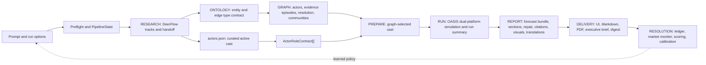
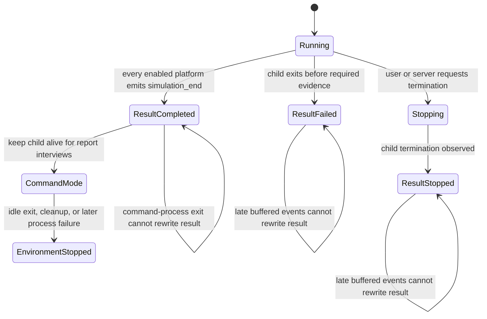

# CODEX_LOOP_ENGINEERING.md — Continuous Workflow Refinement Playbook

**Created:** 2026-07-10  
**Last updated (UTC):** 2026-07-11T11:49:46Z  
**Applies to:** DeepResearchForecast / DeepAgentForecast  
**Control plan:** `PLANS.md`  
**Continuity record:** `handoff.md`  
**Candidate backlog:** `CODEX_RECOMMENDATIONS.md`  
**Evidence vault:** `docs/loop_evidence/2026-07-10/`  
**Active iteration:** LOOP-010/011 complete for deterministic scope — exact-byte publication/research/scenario contracts and ontology-connected OASIS roles; only explicitly authorized live performance/runtime proof remains  
**Current baseline revision:** `6746de3c11d5a1a8dd62532acf1fc20266252c98` plus the uncommitted LOOP-001…011 refinement set  
**Ownership snapshot:** Wave 9 is committed at the baseline above; current dirty files are inventoried in `handoff.md` and the evidence vault. No commit, push, deployment, or paid live run was performed by this program.

## 0. Current truth — LOOP-010/011

This section supersedes status/test/artifact claims in the append-only historical entries below.

- Policy v3 publishes one sealed bundle: completed/nonpartial metadata, exact Markdown SHA, exact `forecast.json` SHA, structured and 2–5-scenario contracts, citation artifacts, semantic support/concentration checks, lint/quote/proposition/market checks, and the professional gate. Report detail/list, exports, translations, PDF, briefs, digests, chat/interview, and SDK forecast/resolution paths share this barrier.
- Research fan-in uses manifest-v2 lane/source bytes and hashes, consumes every declared lane through fair stratified context, and promotes postprocessed report/actors/sources only after all sanctioned rewrites succeed.
- DeerFlow `actors.json` now feeds `actor-role/v1`: eligible actors missing from the graph receive deterministic stand-ins; short/ambiguous names fail closed; every selected actor gets a bounded role with identity, goals, incentives, constraints, resources, vulnerabilities, relationships, stance, known context, likely actions, boundaries, uncertainty, and source references. Persona generation sees only the allowlisted contract inside an explicit untrusted-evidence boundary; dossier values/keys plus prompt-facing names, types, and usernames are sanitized. Role/profile/cast manifests and prepared-state seals are validated again at the OASIS runner boundary.
- The three legacy bundles are **not publishable**. Transactional policy-v3 replay restored every original live byte and recorded three failures: 2% quantitative citation coverage plus extreme statistics; two mechanics-leakage flags; and one binary/scenario proposition contradiction. Historical 9/8/9 chart sets remain migration evidence only.
- Current deterministic gates include a 536-test report/forecast/citation family, a 178-test actor/runner/orchestrator/publication family, 384 bridge/research contracts, the independent 204-test actor/ontology seam review, 14/14 frontend unit contracts, and a 699-module Vite build. Counts overlap and are not summed. The full backend suite is still not claimed green because interpreter teardown emits closed-stream logging errors/hangs in prior unbounded runs.
- Measured bottlenecks remain: graph is the largest cross-run wall-time share (about 48.5%); deep research is the token sink (reproducible high-water mark about 79.75M tokens). In `pipe_f23527f7d903`, 1,428 of 3,391 searches returned no result within 4,974 total tool calls. The historical 82.71M claim for `pipe_a8986bffd918` does not reconcile with current telemetry rows (48,837,873) and is not treated as a current measurement.
- Plotly does not load on the initial report page—PNG previews are lazy and interactive HTML opens on demand—but repeated inline runtimes cost about 4.84 MB per chart and about 1.27 GiB across retained last-three backups. A shared content-addressed local runtime plus missing PNG fallbacks is the next bounded visualization optimization; CDN mode remains prohibited.

## 1. Mission

This document is the operating system for an engineering agent that repeatedly improves the complete forecasting workflow. It is not a static roadmap and it is not permission to make broad speculative changes. Its purpose is to make every refinement:

- driven by real run evidence;
- limited to one coherent defect or capability at a time;
- measurable before and after;
- safe in a dirty or concurrently edited repository;
- verified at the stage boundary and in the user-visible deliverable;
- recorded so a future session can resume without rediscovery.

The loop is:

> **Observe → Reconstruct → Diagnose → Rank → Plan → Reproduce → Change → Verify → Compare → Review → Record → Repeat or Stop**

The agent MUST optimize the forecasting product, not merely its code metrics. Faster research that loses decisive evidence is a regression. A larger graph that makes the UI unusable is a regression. A polished report with invented provenance is a regression. A passing test suite that still presents a degraded run as healthy is incomplete.

## 2. Non-negotiable invariants

1. **One iteration, one hypothesis.** Each implementation iteration has one primary defect hypothesis and one objective acceptance scenario.
2. **Evidence before edits.** A candidate cannot enter implementation until the agent can point to the failing code path and at least one run, artifact, test, or deterministic reproduction.
3. **Final deliverable is the truth.** Stage success is insufficient if the served report, visualization, graph, or status is wrong.
4. **No silent degradation.** Optional degradation is allowed only when it is recorded in `StageResult`, surfaced to the user, and excluded from healthy success.
5. **Immutable run semantics.** A run's question, cutoff, horizon, provider/model, budgets, graph scope, simulation configuration, and report options must not drift after acceptance.
6. **Provenance is preserved.** Every claim, citation, artifact, probability, transformation, and resolution must be traceable to its source and producing stage.
7. **Artifacts are transaction-safe.** Frozen evidence snapshots are immutable. Explicit repair may update a live artifact only after a complete backup; any failed replay restores every touched file and records a failure artifact. Every successful repair receives a new hash ledger.
8. **Dirty work belongs to its owner.** Existing changes are inspected and preserved; the loop does not overwrite or reformat unrelated files.
9. **Tests do not authorize paid work.** No paid/full live pipeline is launched merely because local gates pass.
10. **No false green.** Pre-existing failing gates are reported precisely; they are not hidden, relabeled, or excluded without explanation.

### Severity language

- **P0:** a delivered answer can be materially false, misattributed, unsafe, lost, or irrecoverably corrupted; or the defect causes uncontrolled material spend. P0 can override numeric ranking once ownership and verification gates are satisfied.
- **P1:** major reliability, latency, cost, usability, or quality failure with a recoverable output or workaround.
- **P2:** bounded quality, maintainability, or operator-friction problem that does not invalidate the core deliverable.

Priority describes harm. It does not grant permission to edit an actively owned file or skip deterministic reproduction.

## 3. The workflow the loop is optimizing

### 3.1 End-to-end flow



### 3.2 Current control and persistence paths

| Layer | Current responsibility | Principal code/artifacts | Loop concern |
|---|---|---|---|
| Intake/API | Validate prompt/mode/depth/language/model, preflight, start/resume/cancel/fork | `backend/app/api/research.py`; `PipelineOrchestrator.start/resume/fork` | Request schema, budget visibility, provider snapshot, idempotency |
| Pipeline state | Persist stage progress, IDs, owner heartbeat, artifacts, health | `PipelineState` and `PipelineManager` in `backend/app/services/pipeline_orchestrator.py`; `pipeline_state.json`, `run.json` | Atomic state, terminal truth, schema migration, recovery |
| Research runner | Sync bridge, spawn DeerFlow, capture progress and handoff | `DeerFlowResearchRunner`; `deerflow_bridge/deerflow_research.py`; handoff report/actors/sources/timeline | Cost, convergence, duplication, checkpoint/resume, source integrity |
| Ontology | Select/generate/validate Graphiti-compatible entity and edge types | `backend/app/services/ontology_generator.py`; `ontology.json` | Schema fit, reserved names, edge endpoint validity, actor coverage |
| Graph | Create graph, seed actors, ingest text, resolve aliases, build communities, serve data | `graph_builder.py`, Graphiti runtime, FalkorDB, graph APIs | Scope, chunk failures, telemetry, deduplication, ordering, payload/LOD |
| Prepare | Select/reconcile cast, compile tailored roles, create personas, initial posts, config, world-state seed | `simulation_manager.py`, `actor_role_prompt.py`, `oasis_profile_generator.py`, `simulation_config_generator.py`; `actor_cast_manifest.json`, `*_profiles_roles.json` | Zero-entity failure, full eligible-dossier coverage, exact runtime-field hashes, config lineage, progress |
| Run | Start/monitor OASIS, enforce bounds/watchdog, summarize outcomes, optional graph feedback | `simulation_runner.py`, scripts under `backend/scripts`, `run_summary.json` | Stalls, LLM error rate, organic action floor, result integrity, cost |
| Report | Build outline/sections, tools, structured forecast, ensemble, repair, citations, visuals, translation, persistence | `report_agent.py`, `forecast_extractor.py`, `ensemble.py`, `report_visualizer.py`, `report_lint.py` | Outcome focus, prior wiring, final-audit order, provenance, completeness |
| Product UI | Display timeline, dossier, graph, simulation, report, history, settings | `frontend/src/views/ResearchView.vue`, research components and APIs | Health truth, progressive delivery, safety, responsiveness, accessibility |
| Resolution | Persist forecasts, requote/resolve, evaluate calibration | `forecast_ledger.py`, `scripts/resolution_monitor.py`, `scripts/golden_eval.py` | Binary coverage, idempotency, authoritative resolution, feedback loop |

### 3.3 Required stage boundary

Every stage should be treated as this conceptual contract even where the current code has not yet adopted it:

```text
StageResult {
  execution_status,
  deliverable_health,
  input_artifact_ids_and_hashes,
  output_artifact_ids_and_hashes,
  resolved_run_config_hash,
  metrics,
  typed_issues,
  retryability,
  started_at,
  finished_at
}
```

A stage may be technically finished but degraded. The pipeline may be completed but not healthy. The UI and automation must preserve that distinction.

Until `StageResult` is implemented as a first-class schema, the loop uses this compatibility mapping:

| Conceptual field | Current source of truth | Compatibility rule |
|---|---|---|
| `execution_status` | `pipeline_state.json.stages[*].status` and runner status | Never infer health from completion alone |
| `deliverable_health` | `options.pipeline_health.stages`, report `quality`, run summary health | Missing health is `unknown`, never healthy by default |
| input/output artifact IDs | pipeline IDs plus `handoff/manifest.json`, report folder, graph/simulation IDs | Record relative path and hash in loop evidence |
| resolved config hash | run/options/provider snapshot where present | If absent, add a typed provenance gap; do not synthesize a hash from mutable live config |
| metrics | stage/run/report telemetry and artifact-derived counts | Reconcile totals; explicitly label unattributed work |
| typed issues/retryability | stage error, health issues, warnings, reconcile history | Normalize in loop evidence without rewriting the source artifact |
| start/finish | stage timestamps, progress events, artifact mtimes as last resort | Artifact mtime cannot override an explicit persisted timestamp |

This mapping lets the loop enforce truthful boundaries now without pretending the migration is already complete.

### 3.4 Critical lifecycle expansions

The simulation stage has two lifecycles and one environment state:



`run_state.json` records the simulation result. `env_status.json` records whether interview IPC is available. They are related but not interchangeable.

The report stage is a publication pipeline, not one atomic call:

```mermaid
flowchart LR
    A["Persist report ID"] --> B["Progressive section writes"]
    B --> C["Draft assembly"]
    C --> D["Structured forecasts"]
    D --> E["Citations and visuals"]
    E --> F["Translation, lint, and final mutations"]
    F --> G["Immutable final audit"]
    G --> H["Persist report and artifact manifest"]
    H --> I["Optional ensemble/checkpoint"]
    I --> J["Salvage/reconcile"]
    J --> K["Pipeline terminal status and health"]
```



The current implementation does not yet follow every arrow: the pipeline report ID can be published late, final audit can precede later mutations, and ensemble interruption can reach reconciliation after a complete primary report. Those deviations are explicit candidates, not hidden inside the generic Report → Delivery edge.

## 4. Loop state machine

| State | Entry condition | Required work | Exit evidence |
|---|---|---|---|
| `BOOTSTRAP` | New session or resumed task | Read `handoff.md`, `PLANS.md`, this file, git status/history, active processes/agents, and latest run inventory | Current ownership, revision, dirty-file quarantine, and active iteration are known |
| `OBSERVE` | Control plane understood | Select latest completed, degraded, failed, and comparison runs; collect state/log/telemetry/artifact metrics | Evidence snapshot with run IDs and timestamps |
| `RECONSTRUCT` | Evidence snapshot exists | Rebuild the actual stage timeline and artifact lineage, including post-terminal work and orphan recovery | One factual run narrative per selected run |
| `DIAGNOSE` | Timeline is factual | Identify root cause, downstream consequence, recurrence, and current-code path; distinguish original behavior from already-uncommitted fixes | Candidate records with confidence and ownership |
| `RANK` | Candidate set deduplicated | Score impact, recurrence, confidence, leverage, effort, risk, overlap, and verification cost | One selected candidate; rejected/deferred reasons recorded |
| `PLAN` | Candidate selected | Define scope, invariant, failure taxonomy, files, rollback, focused check, scenario check, and expected metric delta | A reviewable iteration brief |
| `REPRODUCE` | Plan accepted | Run the smallest deterministic failing check or characterize a baseline artifact | Failure evidence captured before change |
| `IMPLEMENT` | Reproduction confirmed | Make the smallest cohesive change; update tests/contracts/docs with it | Narrow diff linked to hypothesis |
| `VERIFY` | Implementation complete | Run focused, integration, scenario, and proportional system gates | Fresh command outputs and artifact comparison |
| `COMPARE` | Gates pass or reveal degradation | Compare specified before/after metrics; check adjacent stage effects | Outcome table with regressions and uncertainty |
| `REVIEW` | Comparison exists | Self-review and independent review for correctness, scope, edge cases, and evidence | Critical/important comments resolved or explicitly blocking |
| `RECORD` | Review resolved | Update this document's register, `handoff.md`, plan, tests, and next-candidate queue | Cold-start continuation is possible |
| `REPEAT` | Previous slice verified and another safe candidate exists | Return to `OBSERVE` with the new baseline | New iteration ID |
| `STOP` | Blocker, paid-run gate, owner conflict, regression, or no evidence-backed candidate | Preserve evidence, state why, specify unblocking action | Honest terminal handoff |

State transitions are monotonic within an iteration. If implementation invalidates the diagnosis, return to `DIAGNOSE`; do not patch around the failed hypothesis.

### 4.1 Cadence and triggers

Run `BOOTSTRAP → OBSERVE` when any of these occurs:

- a full or research-only pipeline reaches a terminal state;
- a release, dependency, model/provider, prompt, schema, or workflow wave lands;
- an operator reports false output, latency/cost regression, UI lag, or recovery failure;
- an active loop session resumes after context/process restart;
- at least three new comparable runs accumulate, even without an incident.

Do not run an empty calendar ritual. If no new code, run, incident, or metric exists, record “no new evidence” and stop.

### 4.2 Baseline promotion and regression budget

An iteration becomes the new baseline only when all applicable conditions hold:

1. focused failure-before/pass-after evidence exists;
2. producer/consumer contract and user scenario pass on copied artifacts;
3. independent review has no unresolved critical or important finding;
4. protected metrics remain within budget;
5. proportional system gates terminate cleanly;
6. evidence, hashes, commands, ownership, and rollback are persisted.

Protected budgets:

- correctness, provenance, security, terminal-state truth, and required artifacts: **zero tolerated regression**;
- schema/API compatibility: no breaking change without versioning and a migration/rollback path;
- deterministic coverage/retention metrics: no decrease unless the iteration explicitly removes low-quality material and records why;
- wall time, token/cost, storage, and UI payload/render time: no greater than 5% regression on comparable replay unless a predeclared quality gain justifies it;
- stochastic LLM quality: one run may create a candidate but cannot alone promote a baseline; use deterministic extraction checks plus at least two comparable run/artifact samples when live proof is needed.

If a protected metric exceeds budget, return to `DIAGNOSE` or roll back the iteration. Passing unit tests cannot waive the budget.

### 4.3 Resolution-to-policy feedback

Resolution does not mutate production prompts/config automatically. The feedback path is:

1. create a versioned policy/config proposal from a resolved cohort;
2. evaluate calibration, sharpness, subgroup error, and failure modes offline against the previous version;
3. record expected gains and protected regressions;
4. canary the version on an explicit opt-in subset;
5. promote only after the baseline gate above;
6. retain the previous version and one-command rollback.

This turns the Resolution → Intake arrow into a controlled learning mechanism rather than self-modifying behavior.

## 5. Session bootstrap protocol

At the start of every loop session, the agent MUST:

1. Read the newest entry in `handoff.md`, then `PLANS.md`, then the active iteration in this file.
2. Run `git status --short --untracked-files=all` and `git log --oneline -20`.
3. Record the base revision and dirty-file ownership. Never assume a dirty diff is generated by the current session.
4. Check for live backend/frontend/research/OASIS processes and active subagents before cleanup or port reuse.
5. Discover runs by `pipeline_state.json.created_at`, not directory mtime alone; regenerated reports can have newer mtimes than their pipeline.
6. Read the selected runs' `pipeline_state.json`, `run.json`, `telemetry.json`, `run_telemetry.json`, artifact manifest, and relevant stage logs.
7. Confirm the configured provider/profile without printing credentials.
8. Run the cheapest truthful smoke relevant to the active iteration.

If any expected continuity file contradicts persisted state, current artifacts and source code win; record the contradiction.

## 6. Parallel forensic protocol

Use parallel agents only for independent read-only lanes or disjoint implementation ownership. The coordinator owns synthesis and final truth.

### 6.1 Standard forensic lanes

| Lane | Scope | Required output |
|---|---|---|
| Run/stage | State transitions, progress, heartbeat, cancellation, resume/reconcile, retries, wall-time, cost, telemetry | Per-run timeline and failure root cause |
| Research/graph | Tool/search behavior, coverage/gaps, source quality, dossier merge, ontology, chunk ingestion, entities/edges/communities, graph storage/UI | Quality/cost/sprawl table and artifact replay |
| Simulation/report/product | Persona/config, run health, outcome signal, report integrity, citations, visuals, bilingual, UI delivery, ledger | Deliverable-quality table and scenario replay |

### 6.2 Agent response schema

Every forensic agent should return:

```text
Finding ID:
Run(s) and date(s):
Observed symptom:
Root cause and exact code path:
Artifact/log evidence:
Recurrence/confidence:
User/cost/correctness impact:
Current dirty-diff coverage: addressed | partial | unaddressed | unknown
Smallest deterministic acceptance replay:
Suggested owner/file boundary:
```

Agents MUST distinguish source-backed observations from inference. The coordinator rechecks high-priority claims before acting.

### 6.3 Implementation ownership

- Do not assign two agents to the same file.
- Shared contracts are changed by one owner first; dependent agents begin only after the contract is stable.
- Review-only agents never edit.
- A completed agent report is not completion evidence; the coordinator inspects the diff and reruns gates.

## 7. Evidence snapshot

For each selected run, capture the following without modifying the run:

### 7.1 Identity and state

- pipeline/project/graph/simulation/report IDs;
- created/updated timestamps;
- mode, prompt hash, provider/model/profile, resolved config hash;
- top-level execution status and deliverable health;
- stage start/finish/progress/error;
- base/fork lineage;
- reconciliation/resume history.

### 7.2 Cost and latency

- wall time and critical-path time by stage;
- LLM calls, input/output tokens, cached tokens, retries, and cost by stage/provider/model;
- subprocess/tool calls and queue time;
- unattributed/global telemetry;
- graph/database/embedding time;
- storage growth by artifact family.

### 7.3 Quality and integrity

- required artifacts, schemas, hashes, and sizes;
- warnings, skipped/failed items, placeholder/fallback counts;
- source, claim, actor, driver, and outcome coverage;
- graph duplicate/isolated/low-degree/community metrics;
- simulation organic-action and LLM-error metrics;
- forecast horizon/resolution validity, probability consistency, and ledger coverage;
- citation validity, source resolution, language purity, visualization delivery, and final-report lint;
- UI status truth and recovery action availability.

### 7.4 Durable evidence vault

Persist evidence under:

```text
docs/loop_evidence/<YYYY-MM-DD>/
  worktree-ownership.md
  latest-three-runs.md
  metrics.json
  LOOP-NNN/
    baseline.md
    result.md
    commands.md
    metrics.json
    samples/
```

`metrics.json` is append-by-snapshot: never rewrite historical run values to match newer code. Large source artifacts stay under `backend/uploads`; evidence files reference their relative path and SHA-256 rather than copying sensitive or bulky content. `commands.md` records command, workdir, UTC time, exit/timeout status, and output artifact. A loop without durable evidence remains provisional and cannot be promoted.

## 8. Stage scorecard

Metrics are signals, not vanity targets. A threshold can be tightened only after comparison across representative runs.

| Stage | Core efficiency metrics | Core quality metrics | Failure indicators |
|---|---|---|---|
| Intake | preflight latency, rejected-before-spend rate | requirement completeness, horizon/resolution clarity, config provenance | expensive failure discoverable at intake; mutable run options |
| Research | wall/cost/tokens, prompt:completion ratio, searches/fetches, cache hit rate, passes to convergence | unique valid sources, primary-source share, claim coverage, contradictions resolved, actor/driver completeness | empty queries/fetches, repeated gaps, full resynthesis for local top-up, duplicate track prose |
| Ontology | calls/retries/latency | type budget, actor coverage, endpoint validity, reserved-field safety, schema version | fallback schema, dangling endpoints, truncation, domain-mismatch |
| Graph | wall/cost per successful episode, attempted/succeeded/skipped chunks, DB growth, payload size | core actor/driver retention, duplicate rate, isolated/low-degree share, causal/temporal edge coverage, valid communities | high skip rate, zero telemetry, sprawl, stale/dead graphs, UI frame stalls |
| Prepare | wall/calls per persona, profile completion rate | cast alignment, persona evidence, config validity, initial-post coverage | zero entities marked complete, partial profiles hidden, provider drift |
| Run | wall/cost per round, LLM error/retry rate, stall time | organic posts/comments/likes, actor participation, outcome trajectory, seed sensitivity | completed with error, empty assistant storm, zero/near-zero interactions, truncated run hidden |
| Report | wall/cost/section, repair iterations, time to first section | complete forecast bundle, citation resolution, numeric consistency, outcome focus, language purity, delivered visuals | placeholders/stubs, synthetic evidence leakage, dangling citations, post-audit mutations, orphan charts |
| Delivery/UI | initial payload, polling volume, render/frame latency | accurate health/status, progressive content, accessible recovery, source traceability | false green, neutral failure, destructive navigation, hidden artifacts |
| Resolution | open/resolved count, monitor cost | criteria validity, authoritative sources, Brier/log/ECE/sharpness by cohort | headline binaries absent, duplicate resolutions, unresolved overdue forecasts |

## 9. Candidate register and ranking

### 9.1 Required candidate fields

```text
id, title, stage, runs, evidence, root_cause, impact,
recurrence, confidence, current_diff_coverage, owner,
files, rollback, focused_check, scenario_check, expected_delta
```

### 9.2 Scoring model

Score each dimension from 0 to 5:

- `H`: user/security/correctness harm;
- `R`: recurrence across independent runs;
- `C`: confidence in root cause;
- `L`: cross-stage leverage;
- `T`: runtime/cost impact;
- `E`: implementation effort;
- `B`: blast radius/regression risk;
- `O`: overlap/concurrency risk;
- `V`: verification cost or dependence on paid live work.

Use this prioritization value:

```text
priority = (2H + R + C + L + T) / max(1, E + B + O + V)
```

Security/data-loss defects may override the numeric rank. Candidates without a deterministic check do not enter implementation even if their product value is high.

### 9.3 Selection rules

Prefer the candidate that is:

1. severe and repeatedly observed;
2. rooted in a specific boundary rather than a symptom;
3. small enough for one reviewed slice;
4. testable using existing artifacts;
5. outside concurrently owned files;
6. likely to eliminate multiple downstream failures without broad refactoring.

## 10. Iteration brief template

Before editing code, add an entry to the iteration register:

```markdown
### LOOP-NNN — <title>

- Status: planned | reproducing | implementing | verifying | complete | blocked
- Hypothesis:
- Evidence/run IDs:
- Invariant:
- In scope:
- Explicit non-goals:
- Files/owner:
- Baseline and reproduction:
- Change design:
- Rollback boundary:
- Focused check:
- Integration/scenario check:
- Expected metric delta:
- Actual result:
- Review findings:
- Residual risk and next candidate:
```

## 11. Implementation rhythm

For each slice:

1. **Freeze the hypothesis.** Write the expected mechanism and outcome before editing.
2. **Reproduce.** Prefer a pure helper, fixture, recorded artifact, or local Flask/Vue scenario. Never mutate the source run.
3. **Make failure explicit.** Add a targeted regression check or capture a deterministic baseline.
4. **Implement locally.** Change the smallest number of modules; keep interfaces explicit and errors typed.
5. **Check immediately.** Run the focused test after each coherent edit.
6. **Integrate.** Exercise the adjacent stage boundary using a fixture or copied artifact.
7. **Validate the user scenario.** Inspect the actual report/status/graph/output that the user would receive.
8. **Compare.** Record before/after numbers and any tradeoff.
9. **Review.** Read the diff as a reviewer and obtain independent review for significant changes.
10. **Record.** Update the iteration entry and handoff immediately.

Do not combine opportunistic cleanup, lint sweeps, dependency upgrades, or unrelated refactors with the slice.

## 12. Verification ladder

Run only the levels relevant to the slice, but never skip the user scenario.

### Level 0 — Structural

- parse/compile affected Python;
- validate JSON/YAML/config schemas;
- verify source/deployed bridge hashes when bridge code changes;
- frontend production build for Vue changes.

### Level 1 — Focused

- exact regression test for the defect;
- boundary values and failure paths;
- failure-before/pass-after evidence where feasible.

### Level 2 — Contract/integration

- producer and consumer agree on schema/IDs/hash/status;
- resume/retry/idempotency where relevant;
- copied real artifact is accepted or rejected correctly.

### Level 3 — Scenario replay

- run the affected transformation against a copy of a latest-run artifact;
- compare output and health metrics;
- verify either no live-artifact mutation or a complete transactional backup/restore/new-hash ledger for an explicitly authorized repair.

### Level 4 — System gates

Use the correct interpreter and report exact results:

```bash
cd backend && uv run python -m pytest -q
cd backend && uv run python -m compileall -q app scripts
cd frontend && npm run build
uvx ruff check backend/app backend/scripts deerflow_bridge
```

The root `package.json` command is `cd backend && uv run pytest`, but `backend/.venv/bin/pytest` currently has a stale absolute shebang pointing to an older checkout. Until the environment is rebuilt, the authoritative form is `cd backend && .venv/bin/python -m pytest` (or an equivalent explicit interpreter/module invocation). Relocatability remains a real gate.

The current full suite can hang after printing 100%. Run it through a bounded subprocess, retain its log, and treat timeout as failure:

```bash
cd backend
mkdir -p ../docs/loop_evidence/2026-07-10/LOOP-003
uv run python - <<'PY'
import os
import subprocess
import sys

evidence = "../docs/loop_evidence/2026-07-10/LOOP-003"
log_path = os.path.join(evidence, "full-pytest.log")
with open(log_path, "wb") as log:
    proc = subprocess.Popen(
        [sys.executable, "-m", "pytest", "-q"],
        stdout=log,
        stderr=subprocess.STDOUT,
    )
    try:
        rc = proc.wait(timeout=900)
    except subprocess.TimeoutExpired:
        sample = "/usr/bin/sample"
        if os.path.exists(sample):
            subprocess.run(
                [sample, str(proc.pid), "5", "-file", os.path.join(evidence, "pytest.sample.txt")],
                check=False,
            )
        proc.terminate()
        try:
            proc.wait(timeout=10)
        except subprocess.TimeoutExpired:
            proc.kill()
            proc.wait(timeout=10)
        raise SystemExit(124)
raise SystemExit(rc)
PY
```

On timeout, also record the smallest hanging module set and live thread/resource owners. Do not repeatedly kill unscoped Python processes; terminate only the captured child PID.

### Level 5 — Controlled live run

Only when artifact replay cannot validate the change:

- obtain a decision for material API cost;
- choose a bounded question/config/profile;
- record budget and stop conditions before launch;
- monitor stage heartbeat, cost, and health;
- abort on budget/stall thresholds;
- retain the run as a named comparison fixture.

## 13. Review gate

The reviewer checks:

- Does the diff implement the recorded hypothesis?
- Is the root cause fixed at the correct boundary?
- Are failure and degraded states explicit?
- Are identifiers, paths, content, secrets, and external data handled safely?
- Does the new behavior preserve resume, fork, and old-artifact compatibility?
- Are metrics and quality assessed on the final delivered artifact?
- Are tests realistic, deterministic, and capable of failing before the fix?
- Did the change touch any file owned by a concurrent effort?

Critical and important findings block the next iteration. Minor findings are either fixed or recorded with a reason.

## 14. Stop, rollback, and recovery rules

Stop the current iteration when:

- the hypothesis is falsified;
- a concurrent owner appears in the same files;
- the fix requires a materially broader schema or product decision;
- verification reveals an unrelated baseline break that prevents attribution;
- a paid/live run is the only remaining proof and has not been authorized;
- security or data integrity cannot be guaranteed;
- three consecutive attempts reproduce the same external blocker.

Rollback by reverting only the current iteration's known patch, never the whole dirty worktree. Record the failed approach, evidence, and guardrail in `handoff.md` before selecting another candidate.

## 15. Recording and continuity

After every meaningful change, update:

1. the active iteration below;
2. `handoff.md` with decision/evidence/current focus;
3. `PLANS.md` if sequencing or scope changed;
4. tests and relevant operator/user documentation;
5. the next-candidate queue.

The next session must be able to answer without rediscovery:

- What was observed?
- Which hypothesis was selected and why?
- What changed and where?
- What evidence proves or disproves improvement?
- What is still risky or unverified?
- What exact command and artifact should be used next?

## 16. Current baseline and active program

### 16.1 Repository state and ownership

- Base revision: `6746de3c11d5a1a8dd62532acf1fc20266252c98` on `main`; it contains the previously concurrent Wave 9 implementation.
- At loop creation, Wave 9 was still a dirty, actively edited diff. The program quarantined overlapping files until the Wave 9 owner committed them, then re-inventoried the new base before taking bounded LOOP-003…008 slices.
- The current refinement set spans simulation terminal truth, graph bounds/UI payloads, report focus/citations, visualization delivery/static fallbacks, research budgets/dossier compaction, and live progress. Parallel agents used disjoint tasks and the shared tree was reviewed after each handoff.
- Generated last-three live report paths were deliberately updated during historical policy-v1 repair only after timestamped backups. Frozen evidence captures remain immutable; policy-v3 failed replays restored every touched live byte and wrote failure diagnostics.
- `CODEX_RECOMMENDATIONS.md` remains the broad source audit. This file is the execution control plane: it ranks current run evidence and records only bounded, verified iterations.

### 16.2 Representative run set

| Pipeline | Created (UTC) | Persisted result | Evidence that matters to the loop |
|---|---|---|---|
| `pipe_f23527f7d903` | 2026-07-09 08:12 | completed, degraded | Research took about 2.63 h and 79.75M tokens; graph took about 8.63 h while attributing zero graph calls; 278/466 chunks were skipped; ensemble agreement was 0.0 |
| `pipe_0f2bee7bd649` | 2026-07-08 10:55 | failed after restart | Research took about 5.58 h and graph about 1.63 h; a complete primary report exists, but about 13.64 h of post-report/orphan time ended in a false failed terminal result |
| `pipe_a8986bffd918` | 2026-07-07 18:36 | failed after restart | Research took about 4.07 h, graph 7.23 h, and report 4.64 h; disk preflight rejected the simulation at 1.61 GB free, yet 0/36 rounds and 0 actions were persisted as completed and fed into a 5.99M-token report |

### 16.3 Fresh parallel forensic synthesis and resolution status

The following table is the frozen baseline from three independent read-only lanes. LOOP-003…008 subsequently resolved several rows deterministically; the `Current coverage` cells and the per-loop result files record that distinction. “Complete in code” never means that an unperformed paid live latency/cost comparison occurred.

The normalized lane reports, exact artifact paths, hashes, source symbols, metrics, and deterministic replay proposals are persisted in `docs/loop_evidence/2026-07-10/latest-three-runs.md` and `docs/loop_evidence/2026-07-10/metrics.json`.

| Priority | Stage/boundary | Finding and evidence | Current coverage | Loop decision |
|---|---|---|---|---|
| P0 | Run → report | Exit-zero preflight refusal produced a completed 0-round/0-action simulation and then a 4.64 h report | Unaddressed at baseline | Resolved in LOOP-001 |
| P1 | Run lifecycle | Shutdown cleanup rewrote a genuinely completed simulation to stopped because its command-mode interview child was still alive | Unaddressed at baseline | LOOP-002, isolated in same owned files |
| P0 | Research merge → citations | Every track finalizes local `[S1]…` identifiers, but merged tracks are not globally remapped; identical IDs can denote different sources | Complete in code: URL-identity remap + one global References ledger | LOOP-004; live semantic quality remains monitored |
| P0 | Report forecast contract | `report_1b70ace5c9e8` has equivalent binary/scenario probabilities differing by more than 20 points, such as 53% versus about 75–76% | Resolved in LOOP-010: proposition identity, scenario contract, exact forecast SHA, and final publication barrier | Legacy bundle remains quarantined until remediated |
| P0 | Visualization → API → UI | Visualizer writes a schema-v2 object and HTML fallbacks, while the API/UI path historically expected a list/path and discarded `png_path`; chart inputs are also incomplete | Complete contract replay in code across producer/API/UI/PDF, with runtime containment | LOOP-005 and LOOP-006 |
| P0 | Graph ingestion | `pipe_f23527f7d903` skipped 278/466 chunks; failure taxonomy and accounting have a 44-item discrepancy, while stage telemetry attributes zero graph calls | Partial | Build a single attempted/succeeded/skipped ledger before tuning throughput |
| P1 | Research convergence | One run repeated the same 20 gaps for six passes; 1,428 of 3,391 searches returned no results within 4,974 total tool calls, and 442 calls had `{}` arguments | Gap advance plus shared budget/negative-result control plane complete in code | LOOP-007; live useful-result-yield delta pending |
| P1 | Research source integrity | Nine truncated hosts were persisted as reachable, and failed/empty fetches can still distort coverage | Unaddressed/partial | Validate full URL reachability and claim-bearing content before source credit |
| P1 | Graph semantics | Generic actor types do not match the generated ontology, encouraging duplicate domain nodes; communities are built before entity resolution and can remain zero | Unaddressed | Repair ontology→actor contract and reorder resolution/community work |
| P1 | Report citations | Numeric backfill added 111, 139, and 233 markers in the three reports; marker presence was treated as grounding even when the source did not support the claim | LOOP-010 adds source-specific text/number anchors, concentration and unverifiable-ratio gates; unsupported tags are stripped | Fail-closed bounded support is implemented; no general entailment claim |
| P1 | Report finalization | Quality audit historically ran before late report/forecast mutations | LOOP-010 seals exact Markdown and forecast bytes under policy v3; multi-seed output stays a sidecar rather than mutating the sealed forecast | Move ensemble aggregation before final rendering in a future architecture slice |
| P1 | Progressive delivery | A report ID is persisted only after blocking generation returns, making partial-section endpoints unavailable during the long report stage | Active report ID is persisted before generation and stale attempt pointers are cleared | LOOP-005 |
| P1 | Research UI observability | Parallel track logs were invisible and tool-count progress jumped to 90% during the opening burst | Complete in code and last-three replay | LOOP-008; one live browser observation pending |
| P1 | Product health | Completed/degraded runs are labeled as ordinary success and cannot be resumed; stage and final messages can disagree | Unaddressed | Surface typed health reasons and recovery actions |
| P1 | Resolution ledger | `_year_end` selects the first year in a multi-year horizon, and the ledger stores scenarios but no binary forecasts | Unaddressed | Explicit resolution dates and binary-ledger coverage |
| P1 | System verification | The full backend suite reached its printed 100% test progress but did not exit; sampling showed the main thread in `Py_FinalizeEx`, one event-loop thread in `kevent`, and another in `os.read` | Unresolved; likely background-resource leak, exact owner unknown | Isolate by module before editing; full suite is not green |

### 16.4 Wave 9 coverage classification

| Classification | Current items | Required proof before closure |
|---|---|---|
| Addressed and deterministically gated | Simulation terminal truth, global citation identity, exact-byte publication, proposition/scenario contracts, research fan-in, tailored actor roles, visualization delivery, live research logs/progress | Controlled live run only where runtime/cost/browser behavior—not correctness—requires observation |
| Addressed in code, live metric pending | Research budget/negative cache, compact dossier, actor-centered graph cap/UI payload, actor-role production artifact | Compare wall time, tokens, graph bytes, useful-result yield, frame latency, and one live OASIS role manifest on a newly authorized run |
| Partial | Source-content validity beyond bounded support checks, graph attempt telemetry, Graphiti ontology-type alignment, degraded-state recovery | One candidate per iteration with an explicit invariant |
| Unaddressed/global gate | Full-suite interpreter teardown, resource-ID containment inventory, retained legacy unsafe renderers, resolution dates/binary ledger | Return through `RANK`; do not dilute with adjacent feature work |

## 17. Iteration register

### LOOP-000 — Establish the loop and validate Wave 9

- **Status:** complete.
- **Hypothesis:** Classifying current Wave 9 work against fresh run evidence before adding fixes prevents duplicate or conflicting remediation.
- **Evidence/run IDs:** `pipe_f23527f7d903`, `pipe_0f2bee7bd649`, `pipe_a8986bffd918`.
- **Invariant:** No Wave 9 source file is modified until ownership, intended behavior, and current evidence are understood.
- **In scope:** three parallel read-only forensic lanes, workflow/diff/test mapping, focused Wave 9 gates, candidate scoring, and this control document.
- **Non-goals:** paid live run, commit/push, deployment, destructive cleanup, and broad refactoring.
- **Baseline:** 170 targeted Wave 9 tests passed. An initial full-suite run exposed three failures: two bridge/deployed-skill drift checks and one visualization-injection regression. Concurrent Wave 9 edits then changed that baseline; the next run printed 100% progress but hung during interpreter shutdown.
- **Actual result:** all three lanes completed and independently found cross-stage defects. LOOP-001 was selected because it was P0, reproduced in a latest run, deterministic offline, outside the active Wave 9 ownership set, and capable of preventing hours of downstream waste. Concurrent mutations were detected and quarantined rather than overwritten.
- **Residual risk:** Wave 9 “addressed” items still need artifact-level comparison, and the full-suite shutdown leak prevents a truthful global green gate.

### LOOP-001 — Reject exit-zero simulations without completion evidence

- **Status:** complete.
- **Hypothesis:** `_monitor_simulation` accepted child exit code 0 as completion even when enabled platforms never emitted `simulation_end`; requiring all enabled end events prevents empty simulations from entering report and ensemble stages.
- **Evidence/run IDs:** `pipe_a8986bffd918` / `sim_cbbacd1a27a9`. Disk preflight refused at 1.61 GB free, state recorded 0/36 rounds and 0 actions, and the pipeline then spent about 4.64 h and 5.99M report tokens.
- **Invariant:** A child exit is process evidence, not simulation-completion evidence. Every enabled platform must emit `simulation_end`. Those events complete the simulation lifecycle immediately even though the child intentionally remains in command mode for report interviews.
- **Files/owner:** `backend/app/services/simulation_runner.py` and `backend/tests/test_audit_fixes_runner.py`, owned by the root agent for this loop.
- **Baseline/reproduction:** the partial-platform exit-zero regression failed against the old behavior because the state became `COMPLETED`; the frozen preflight-log shape made the failure deterministic without launching OASIS.
- **Change:** exit zero plus all required events remains `COMPLETED`; exit zero with missing events becomes `FAILED` and names the missing platforms; unexpected nonzero exit before completion evidence is `FAILED`; failed transitions clear `completed_at`; diagnostic capture reads only a bounded binary log tail.
- **Verification:** focused lifecycle tests cover single and dual platform success, partial exit-zero failure, unexpected nonzero failure before completion, immediate event-driven completion, and bounded diagnostic tails. The final combined runner/throttle/DRF-2 set passes 81 tests.
- **Review:** independent code review found no critical, important, or minor issue after verifying the two-lifecycle command-mode contract in `run_parallel_simulation.py`.
- **Observed delta:** accepted hollow exit-zero simulations in the deterministic reproduced class: 1 → 0.
- **Inferred downstream effect:** the orchestrator's existing failure branch should prevent REPORT/ensemble work for this class, but that adjacent boundary was not modified or replayed because `pipeline_orchestrator.py` has an active external owner. The avoided 4.64 h/5.99M-token report is an evidence-backed expectation, not a measured post-change live result.
- **Residual risk:** organic-action quality is a separate health dimension; valid end events can still describe a low-signal run and must remain governed by the health gate.

### LOOP-002 — Preserve terminal simulation truth during shutdown cleanup

- **Status:** complete.
- **Hypothesis:** `cleanup_all_simulations` conflates the command-mode process lifecycle with the already-finished simulation-result lifecycle and rewrites a valid `COMPLETED` state to `STOPPED` during backend shutdown.
- **Evidence/run IDs:** `sim_47f0e9eaccb3` was observed completed before cleanup and stopped afterward. The source path unconditionally assigned `STOPPED` for every live child.
- **Invariant:** Cleanup MUST terminate live resources and mark `env_status` stopped, but MUST NOT change an existing terminal result (`COMPLETED`, `FAILED`, or `STOPPED`). Only a nonterminal simulation becomes `STOPPED` with an operator-shutdown reason.
- **Files/owner:** the same two isolated simulation-runner files; no Wave 9 overlap.
- **Baseline/reproduction:** fake-live-process tests were added first. Against the old code, a completed result became stopped. Independent review then exposed two races absent from the first tests: the real monitor could overwrite cleanup after signal exit, and a final buffered `simulation_end` could promote STOPPING/FAILED back to COMPLETED.
- **Change:** preserve terminal status, timestamp, and error across command-process exit; publish `STOPPING` before terminating an active child and converge it to `STOPPED`; promote completion events only from STARTING/RUNNING; record late platform completion flags without changing STOPPING/STOPPED/FAILED or refreshing an existing COMPLETED timestamp; synchronize `state.json`; mark only the IPC environment stopped.
- **Rollback boundary:** monitor terminal classification, cleanup transition ordering, action-log completion guard, and their lifecycle tests in the two owned files.
- **Scenario result:** ordered lifecycle probes now run cleanup and then the real monitor classification. Completed and failed results remain unchanged, active cleanup remains stopped, late completion during stop converges stopped, and late completion after failure preserves the failure diagnostic.
- **Verification:** `uv run python -m pytest -q tests/test_audit_fixes_runner.py tests/test_simulation_runner_throttle.py tests/test_drf2_simulation.py` passes all 81 collected tests; compileall and scoped `git diff --check` pass.
- **Review:** the first independent review blocked on the monitor race; the second blocked on late-event promotion; the final re-review found no critical, important, or minor issue.
- **Residual risk/next transition:** the full-suite shutdown leak remains the next enabling iteration. No paid/live simulation was required for this state-machine fix.

### LOOP-003 — Constrain the graph around the forecast-relevant actor cast

- **Status:** complete in code; live performance delta pending.
- **Hypothesis:** unconstrained two-hop retention and full default payloads caused graph-stage cost and browser lag without improving forecast relevance.
- **Change:** verified physical pruning defaults to 400 entities and 150/type, retains every protected actor even when the core itself exceeds the nominal cap, bounds related expansion, verifies the delete postcondition, and records degradation on failure. API/frontend overview payloads independently cap at 400 nodes, deduplicate IDs, and remove orphan edges.
- **Evidence:** large/core-overflow/low-core/partial-delete regressions plus frontend payload tests pass. See `docs/loop_evidence/2026-07-10/LOOP-003/result.md`.
- **Residual:** only a comparable live run can establish graph wall-time, database-size, and browser frame deltas.

### LOOP-004 — Make reports outcome-first and citations globally honest

- **Status:** complete for deterministic generation; the last-three policy-v1 replay is historical and the current bundles are quarantined.
- **Hypothesis:** track-local source IDs, numeric-coincidence repair, and simulation-process narration polluted otherwise strong reports.
- **Change:** global URL-identity citation remap; one References ledger; conservative unique numeric-plus-lexical repair; outcome-share scenario comparison; mechanics scrub/lint; leakage degrades report health; duplicate track summaries are removed after unified reconciliation.
- **Evidence:** historical focused counts are retained in `LOOP-004/result.md`; LOOP-010's current 536-test family exercises source-specific support and exact publication. Current diagnostics still find two mechanics flags in `report_1c312b400d33`, so no legacy-cleanliness claim is made.
- **Residual:** bounded support validation is fail-closed but is not a claim of general semantic entailment; unsupported or ambiguous claims stay uncited.

### LOOP-005 — Carry one visualization manifest through every delivery surface

- **Status:** complete in code and artifact replay.
- **Hypothesis:** chart production was not useful if report placement, API serving, frontend galleries, and PDF export consumed incompatible shapes or unsafe paths.
- **Change:** one schema-v2 HTML/PNG manifest; deterministic placement; request-time containment/symlink checks; HTML/SVG CSP sandbox; stale-asset reuse rejection; early active report ID and attempt cleanup; frontend normalization and one-link behavior.
- **Evidence:** producer/API/PDF/frontend contracts and production build pass; the last three report bundles resolve every manifest asset. See `LOOP-005/result.md`.
- **Residual:** retain browser E2E as a live delivery gate; do not add chart families without data and narrative placement.

### LOOP-006 — Replace broken text diagrams with readable Plotly and static charts

- **Status:** complete after direct PNG inspection and two readability refinements.
- **Hypothesis:** Mermaid files were not delivered, and dense inline labels made otherwise valid charts unreadable.
- **Change:** Plotly timeline/actor diagrams with inspected PNG fallbacks; verified CJK glyph handling; numbered timeline markers and keyed descriptions; collision-planned labels for the 16 highest-priority actors; canonical forecast scenarios with identity-matched ensemble uncertainty only.
- **Evidence:** the focused visualizer suite passed 133 tests before final additions; final scenario/timeline/actor subsets pass. The semiconductor scenario chart now contains three bars totaling 100%, not eleven incompatible rows. See `LOOP-006/result.md`.
- **Residual:** responsive print/browser observation across additional viewports remains useful, but no broken text artifact is referenced.

### LOOP-007 — Bound research spend and compact the graph handoff

- **Status:** complete in the control plane; paid/live delta pending.
- **Hypothesis:** repeated no-result search/fetch loops and K-way dossier concatenation caused multi-hour research and explosive graph input.
- **Change:** shared cross-process SQLite budgets (attempt/search/fetch global and per lane), negative-result TTL/retry, formal budget telemetry and confidence penalty; canonical 20-actor/80,000-character dossier with bounded one-hop relationships and one-best fallback.
- **Evidence:** 97 focused budget tests include multiprocess races; combined merge/compaction/budget contracts pass. See `LOOP-007/result.md`.
- **Residual:** denial is returned to the tool loop so synthesis can continue from gathered evidence; it does not kill the stream at the exact denied call.

### LOOP-008 — Stream parallel research logs and make percentage phase-bounded

- **Status:** complete in code, last-three replay, and independent review; new live browser observation pending.
- **Hypothesis:** the API tailed the wrong file, tool-count progress reached 90% during opening search, and a length-only rolling-tail fingerprint suppressed active updates.
- **Change:** bounded chronological merge of root/`track_N` logs; milestone-bounded per-track estimator; monotonic equal-weight survivor aggregate capped at 95 until merge; content-revision polling/autoscroll; failure isolation between status and log requests; no-cache responses and stale-request identity guards.
- **Evidence:** opening phases stayed at or below 16%, aggregates were monotonic, and `pipe_f23527f7d903` produced 88 visible aggregate changes. Focused backend/frontend/build gates are recorded in `LOOP-008/result.md`.
- **Residual:** no paid pipeline was launched; observe one newly running deep-research case in the browser before promoting the runtime baseline.

### LOOP-009 — Turn DeerFlow scale into durable evidence and delivered artifacts

- **Status:** complete in code and skill validation; its policy-v1 report-repair observations are historical and currently quarantined by LOOP-010.
- **Hypothesis:** the harness was already capable; nested breadth planes, repeated context/search, and lossy stage handoffs caused the apparent under-performance. More unconstrained agents would increase token replay while still losing markets/charts at delivery seams.
- **Measured baseline:** `pipe_f23527f7d903` research consumed about 79.75M measured tokens in 2.63 h while its graph took 8.63 h. The historical 82.71M observation for `pipe_a8986bffd918` is not reproducible from current telemetry rows, which sum to 48,837,873. Across the representative three, graph was roughly 48.5% of active wall time, research 34.1%, and report 16%. Research is the measured token sink; graph is often the wall-time sink and still has a token-attribution blind spot.
- **Root causes:** three outer processes could each open five harness subagents while legacy fan-out and parallel phases covered overlapping KIQs; 120K working contexts were replayed across many turns; `pipe_f23527f7d903` contains roughly 1,075 exact repeat instances and 1,428 no-result searches; market results existed only in conversation state; track merge selected one market snapshot; research charts stayed stranded below `track_N`; report fallback admitted broad lexical market matches.
- **Changes:** one breadth plane by default; a nine-worker global envelope divided across outer tracks; 80K forecast-evidence-ledger compaction and 12K fetched-page externalization; deterministic skill activation and scoped market-tool access; no final dossier maximum; persistent market ledger/cache/status/union/history; relevance-scored fail-closed report recovery; market dossier UI; market/source research charts; stable Plotly; no Mermaid; internal telemetry removal; circular market-contract forecast rejection.
- **Historical artifact result:** policy-v1 replay produced 9/8/9 chart sets and a browser showed nine loaded images. These results prove chart delivery only; they do not prove report publication quality. Policy v3 now withholds all three bundles and transactional replay restored their live bytes after substantive failures.
- **Skills:** `actor-ontology-research`, `deep-research`, `prediction-markets`, and `forecast-visuals` validate successfully and were synchronized into the active DeerFlow runtime. The actor skill now emits every field consumed by `actor-role/v1` and forbids imperative/model-control prose in those data fields. The cached Ralph loop is a Claude stop-hook, not a callable Codex command; this document carries its genuine-completion behavior without installing misleading hook state.
- **Verification:** focused backend market/merge/report/lint/visual/API/bridge suites pass; 14/14 frontend contracts and the 699-module production build pass; real Plotly/PNG render smokes and skill validation pass; final independent review is recorded in the evidence file.
- **Residual:** no paid run was launched, so no post-change token/wall claim is made. Graph attempt/token attribution, full-suite interpreter teardown, typed degraded-state recovery, and security containment remain ranked work.

### LOOP-010 — Publish only one exact, current-policy forecast bundle

- **Status:** complete in deterministic code and artifact replay; no legacy bundle passed the new gate.
- **Hypothesis:** late Markdown/forecast mutations, permissive citation repair, and incomplete scenario/proposition checks allowed internally inconsistent reports to appear completed.
- **Change:** policy-v3 final audit seals exact Markdown and exact `forecast.json`; central publication status gates every customer/SDK/export surface; source-specific citation support/concentration and quote/leakage checks fail closed; 2–5 mutually exclusive scenarios require finite probabilities, criteria, a residual bin, bounded non-overlap, and current critique/allocation numbers; binary propositions and market anchors reconcile by explicit identity. Research fan-in is manifest-v2, fair, immutable, and promoted manifest-last after postprocessing. Multi-seed results remain a separately fingerprinted sensitivity sidecar rather than mutating an audited report.
- **Artifact result:** each requested legacy replay created a complete backup, failed for a substantive reason, restored all touched bytes, and wrote `replay_failure.json` with `restored: true`. Current live Markdown hashes are recorded in the latest-three evidence appendix; all three publication statuses are false.
- **Verification:** 536 report/forecast/citation tests and 384 research/bridge contracts pass in the current root run. Full backend green is not claimed.

### LOOP-011 — Compile the DeerFlow actor dossier into roles OASIS actually plays

- **Status:** complete in deterministic code and runner-boundary verification; a newly paid/live OASIS artifact is pending authorization.
- **Hypothesis:** a generic LLM persona can ignore the researched actor ontology, while partial graph ingestion can silently delete or misassign key actors.
- **Change:** `actors.json` is the authoritative behavioral handoff. Missing eligible graph actors receive deterministic stand-ins; ambiguous/short fuzzy identity fails closed; preparation records every selected/context decision. `actor-role/v1` compiles after LLM/rule/fallback generation, reserves complete `BEGIN/END` evidence boundaries plus actions/red-lines/safety under prompt caps, and carries identity, goals, incentives, constraints, resources, vulnerabilities, relationships, stance, memory, risk, likely actions, and provenance. Persona generation receives only this allowlisted JSON contract, never the legacy free-form dossier; recursive sanitization covers values, keys, prompt-facing names/types, and persisted usernames. Reddit `persona` and Twitter `user_char` contain the exact prompt. Version-2 role manifests seal the profile file, cast, roster, role fragment, and full runtime field; prepared state seals each manifest; unsupported platforms, missing/zero state, and paired profile/manifest tampering fail before OASIS launch.
- **Verification:** the current actor/prepare/runner/orchestrator/publication family passes 178 tests. An independent 204-test actor/ontology seam matrix found no remaining P0/P1/P2 issue after adversarial Unicode/control-text, dense prompt, graph-omission, identity, sidecar, state, and runtime-field probes. No fake role is created for an unmatched concept when no dossier identity exists.
- **Residual:** the legacy manual project path has no DeerFlow dossier to consume; when a dossier exists, the orchestrated workflow is authoritative. A production `*_profiles_roles.json` from a newly authorized run is still needed as live proof.

## 18. Ranked next-candidate queue

The queue is re-scored after every iteration. Completed LOOP-003…008 items have been removed rather than left as misleading “next” work.

| Rank | Candidate | Priority | First deterministic check | Promotion condition |
|---:|---|---|---|---|
| 1 | Isolate the full-suite interpreter-shutdown hang | P1 global gate | Bounded module bisection with captured child PID, thread inventory, and `/usr/bin/sample` for the smallest hanging set | Eligible now; no paid work |
| 2 | Enforce resource-ID validation and filesystem containment across every resource family | P0 security | Parameterized service/route corpus covering traversal, absolute paths, malformed prefixes, encoding, and symlink escape | Take one resource family per slice; preserve valid IDs |
| 3 | Retire retained legacy unsafe HTML/Markdown renderers and destructive route-mount behavior | P0 security/data loss | Shared XSS corpus plus navigation test proving zero mutation on mount/refresh/history | Migrate one reachable surface at a time |
| 4 | Create a graph ingestion attempt/cost ledger | P0 cost/truth | Every chunk has exactly one typed terminal result and totals reconcile with telemetry | Measure without broad graph refactor |
| 5 | Share one content-addressed local Plotly runtime and complete PNG fallbacks | P1 storage/export | Stable div IDs, one verified JS runtime per chart directory, bounded payload, no external requests, unchanged PDF image count | Preserve CSP/offline behavior; no CDN |
| 6 | Fix explicit resolution dates and binary-ledger coverage | P1 calibration | Multi-year horizon resolves to its explicit final date; scenarios and binaries store idempotently | No live run required |
| 7 | Align generated Graphiti ontology types with actor ingestion | P1 graph semantics | Every actor maps to a generated type or one explicit fallback before graph ingestion | Separate from completed actors.json behavioral roles |
| 8 | Surface typed degraded-state recovery in the primary UI | P1 product | Completed+degraded fixture shows causes and safe recovery actions without relabeling healthy | Coordinate with canonical health schema |

The next live comparison is a **validation activity**, not a code candidate. It requires explicit budget/authorization and must record research wall/tokens/yield, graph wall/bytes, UI frame behavior, live log cadence, and final report gates before promoting a new baseline.

## 19. Deferred register — retained, not forgotten

| Candidate | Why deferred | Promotion trigger |
|---|---|---|
| Split state truth and stale terminal messages | Crosses runner, manager, pipeline, summary, and UI schemas | StageResult compatibility test and owner map ready |
| Crash/thread telemetry loss | Needs one attribution ledger across subprocesses and executors | Smallest missing-call replay isolated |
| Graph cap tuning | The physical/UI cap now exists; its default may still need evidence-based adjustment | Comparable live recall/latency measurement shows a change is warranted |
| Ensemble semantic mismatch | Wave 9 semantic alignment exists but latest agreement was 0.0 | Recorded scenario-spine replay available |
| English purity/bilingual parity fail-open | Current warnings can still ship and UI hides degradation | Final-artifact language/parity fixture ready |
| Sparse/noisy simulation evidence | Healthy runs still have many empty rounds/top-post entries | Minimum useful-signal contract agreed |
| Source-content validity | Truncated/empty content can receive reachability credit | Canonical URL + claim-bearing-content validator fixture ready |
| Final audit breadth | Delivered lint/asset checks are present, but proposition-identity consistency remains open | Binary/scenario identity fixture ready |
| Research useful-result yield | Budgets stop runaway work, but a live before/after yield metric is still absent | Authorized comparable run with formal budget ledger |
| Entity resolution/community ordering | Communities can be zero or stale when built before resolution | Graph artifact replay with expected community invariants |
| Product degraded-state recovery | Completed/degraded remains visually ordinary | Frontend owner handoff and mounted state fixture |

Deferred means retained with evidence, not accepted as healthy. Each item returns through `RANK`; none may be silently dropped because a neighboring Wave 9 test passes.
