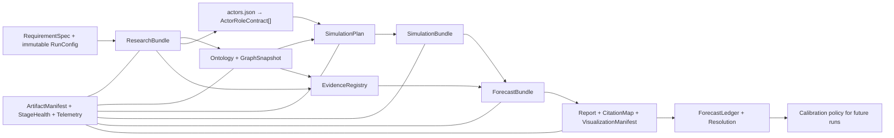

# CODEX_RECOMMENDATIONS.md — Codebase Audit and Product Roadmap

**Audit date:** 2026-07-10; implementation update 2026-07-11 (Asia/Shanghai)  
**Audited revision:** initial audit `27b785a`; current implementation base `6746de3` (`main`) plus the documented dirty refinement set  
**Scope:** Vue frontend, Flask APIs, six-stage pipeline, DeerFlow research bridge, ontology and graph construction, OASIS simulation, report generation, forecast evaluation, persistence, configuration, setup, CI, tests, and representative generated artifacts.  
**Nature of this file:** Living audit, recommendation backlog, and implementation-status record. The initial findings remain as historical evidence; the update below identifies which workflow defects were subsequently changed and verified.

## 1. Executive assessment

DeepResearchForecast is already much more than a research demo. It has a serious forecasting substrate: multi-track research, source grading, market comparisons, a typed knowledge graph, persona and simulation generation, structured forecasts, report repair, bilingual output, visual artifacts, telemetry, scenario forks, and resolution/evaluation tooling. The main problem is no longer missing capability. It is that the capabilities do not yet share one authoritative set of contracts.

The recurring failure pattern is **locally sophisticated components connected by permissive, duplicated, or partially enforced boundaries**:

- Research produces evidence, but report citations use multiple incompatible identifiers.
- The pipeline records stage health, but the top-level status and UI can still show a degraded deliverable as fully successful.
- Structured calibration inputs exist, but the production report path does not pass them to the forecast spine.
- Progressive reports, stage artifacts, forks, executive briefs, telemetry, and interactive charts exist, but important parts are unreachable or hidden in the primary UI.
- The graph and simulation stages can consume huge amounts of time, yet run configuration and telemetry are not sufficiently immutable or complete to explain and reproduce that cost.
- Final report validation happens before several later mutations, so the metadata can describe a cleaner draft than the report the user actually reads.
- Two application journeys and a partial DRF-2 migration duplicate concepts, APIs, state models, and presentation logic.

The recommended direction is therefore not “add more agents” or “generate more prose.” It is to make a single **Forecast Case** the backbone of the system: one immutable run contract, one evidence registry, one artifact manifest, one health model, one citation map, and one forecast/resolution ledger shared by every stage and UI surface.

### Highest-priority actions

| Order | Action | Why it comes first |
|---:|---|---|
| 1 | Enforce resource-ID validation and filesystem containment | Current project/report ID handling can escape its intended directory and reaches recursive deletion paths. |
| 2 | Replace all unsafe HTML/Markdown rendering and remove destructive route-mount behavior | These are directly reachable security and data-loss risks in retained frontend routes. |
| 3 | Establish one canonical citation/source contract | Current tiered citations are incompatible with the auditor and repair code, undermining the core evidence promise. |
| 4 | Separate research cutoff, forecast horizon, and resolution date; audit the exact final report | Current horizon wiring and validation order can publish internally inconsistent forecasts. |
| 5 | Snapshot immutable per-run configuration and enforce stage completion invariants | Concurrent or long-running runs can drift between providers, and PREPARE can be marked complete after failing. |
| 6 | Make degraded completion a first-class product state | A recent “completed” run skipped about 60% of graph chunks and had report-quality warnings, yet the UI presents it as healthy. |
| 7 | Put hard budgets and semantic deduplication around research and graph construction | The latest completed run spent roughly 2.6 hours and 79.7M tokens in research, then roughly 8.6 hours in graph construction. |
| 8 | Reframe simulation as sensitivity evidence, not future truth | Current prompts and generated reports overstate synthetic behavior and dilute outcome-focused forecasting. |

## Implementation update — 2026-07-11

The initial audit correctly identified that the product's largest quality losses occurred at stage boundaries. The follow-on loop therefore concentrated on shared contracts rather than adding more report prose or more graph breadth. This table supersedes older “unaddressed” labels elsewhere in this document when the same item appears below.

| Area | Implemented refinement | Verified result | Remaining proof |
|---|---|---|---|
| Simulation terminal truth | Exit code zero no longer means success without every enabled platform's `simulation_end`; cleanup preserves a genuine terminal result while terminating its command-mode child | Focused runner lifecycle matrix passes; the exact 0-round disk-refusal class is rejected | A newly authorized live simulation is not required for the deterministic state-machine contract |
| Research repetition/cost | Shared SQLite attempt/search/fetch budgets across outer tracks and descendants; negative-result cache; formal `research_budget.json` telemetry | 97 focused budget tests, including multiprocess races | Measure live wall/token/useful-result deltas on a comparable paid run |
| Research handoff size | Canonical actor dossier is regenerated from `actors.json`, limited to 20 key actors/80,000 characters and bounded one-hop relationships; raw track dossiers remain auditable | Compact/fallback/relationship-scope regressions pass | Tune caps only from future graph-recall evidence |
| Multi-track citations | Local `[S#]` namespaces are remapped through URL identity into one global ledger; unresolved markers are stripped; duplicate local executive summaries are removed after unified reconciliation | Merge/citation contracts pass; dossiers now get shared hoverable source links | Full semantic entailment remains intentionally conservative |
| Knowledge-graph sprawl | Actor-centered physical hard cap (default 400 entities, 150/type), post-delete verification, bounded default API/UI payload, orphan-edge filtering, and LOD metadata | Large/core-overflow/partial-delete/API/frontend fixtures pass | Measure new graph wall time, database bytes, and frame latency live |
| Forecast focus | Report prompts, scenario comparison, lint, and health now emphasize predicted outcomes, probability deltas, drivers, disconfirmers, and signposts; agent/round/action/platform mechanics are removed or rewritten | Deterministic generation/lint contracts pass | The legacy bundles are not proof of cleanliness: policy v3 currently finds two leakage flags in `report_1c312b400d33` and quarantines it |
| Citation integrity | Repair needs a discriminative numeric anchor, two lexical anchors, and one unique best source; source-specific semantic support, material-number binding, source-concentration, and unverifiable-ratio checks now fail closed | Focused report/citation and exact-byte publication gates pass | Successfully regenerate/replay evidence-complete legacy reports; do not infer general semantic entailment from this bounded verifier |
| Publication barrier | A report is visible/exportable/interviewable only when it is nonpartial and its exact Markdown SHA passes the current audit policy, hard integrity gate, publish gate, structured forecast, and citation-artifact contracts | Detail/list/sections/download/translation/PDF/brief/digest/chat paths share the barrier; API/render suites pass | All three legacy bundles are intentionally withheld pending a successful current-policy replay or regeneration |
| Research contract finalization | Manifest-v2 fingerprints every lane pack/source ledger and global sources; fair stratified fan-in consumes every declared lane; postprocessing completes before manifest-last atomic promotion with rollback | Research fan-in/finalization/orchestrator suites pass | A paid live run is needed only for cost/latency deltas, not contract correctness |
| Scenario contract | Scenario rows require names, finite probabilities, a `1±0.015` partition, objective criteria, an explicit residual bin, non-overlapping comparable ranges, and critique/allocation consistency | Extractor plus final publication audit blocks malformed English/Chinese contracts | Expand bounded grammars only from observed false positives/negatives |
| Ontology-connected actor roles | Every dossier-backed actor selected into the cast gets an `actor-role/v1` contract compiled after LLM/rule generation from identity, objectives, incentives, constraints, resources, vulnerabilities, relationships, stance, likely actions, boundaries, and evidence state | Persona generation consumes only the allowlisted contract inside an explicit untrusted-data boundary; the exact tailored prompt reaches Reddit `persona` and Twitter `user_char`; sparse fallback, adversarial ontology fields, balanced prompt bounds, distinct hashes, and exact runtime-field fingerprints pass | A newly authorized live OASIS run should produce the first production `*_roles.json` under this contract |
| Visualization contract | One schema-v2 manifest carries HTML/PNG pairs through report, research API, frontend, and PDF; runtime containment and CSP guard served assets | Producer/API/PDF/frontend gates pass | Browser E2E on a new run remains useful |
| Visualization quality | Professional Plotly scenario, binary, market, timeline, actor, source, quantitative, driver, and contested-claim charts; static fallbacks replace Mermaid | Historical policy-v1 repair produced 9/8/9 chart sets and directly inspected PNGs | Asset validity does not imply report publishability; add missing static fallbacks and a shared local Plotly runtime before calling export complete |
| Scenario-chart correctness | Published forecast scenarios are canonical; ensemble rows can add uncertainty only after exact normalized identity matching | Semiconductor report now shows 3 bars totaling 100%, not 11 incompatible rows | Upstream ensemble taxonomy alignment remains separately auditable |
| Live research observability | API merges bounded live `track_N` logs; progress is milestone-bounded and aggregated monotonically; frontend polling/autoscroll fingerprints newest content; status survives optional log errors and stale pipeline responses are discarded | Last-three replay: opening ≤16%, aggregate ≤95 before merge, 88 monotonic changes on `pipe_f23527f7d903`; 209 backend tests, 14 frontend tests, production build pass | Observe once in a newly running browser session |
| Harness scale/value per token | Exactly one KIQ breadth plane is active by default; three outer tracks share a nine-worker harness envelope instead of multiplying to 15 streams; exact market queries use a single-flight cache; long fetches externalize at 12K and forecast-specific compaction begins at 80K | Deterministic allocation/cache/config contracts pass; deployed bridge/config/skills are synchronized | Measure token/wall/useful-evidence deltas on a comparable authorized run |
| Research deliverable depth | Final dossier prompts now use evidence-density floors with no final word/character maximum; multipart section planning remains bounded per call for model safety; the research skill and fallback prompt no longer describe the dossier as simulation ground truth | Prompt/outline/parser/skill validation passes; deep floor is 10,000 prose words and fallback asks for ≥15,000 without a ceiling | Tune floors from report usefulness, never raw length alone |
| Prediction-market evidence lane | In-loop tool results persist to an append-only per-track ledger; refresh and tool discoveries receive one relevance gate; markets/status/price history union across tracks; report fallback is LLM-relevance-scored and fail-closed; dossier API/UI exposes signals even without an exact binary match | Tests cover cache, ledger, no-query survival, transport-vs-empty status, union/freshest quote, price history, API/UI build, and circular-forecast rejection | A live run must demonstrate a real anchor/comparison end to end |
| Harness skill integration | `/deep-research` and `/actor-ontology-research` activate deterministically; scoped researchers can call the market tool; configured skills are narrowed to workflow-relevant entries; actor-ontology-research, deep-research, prediction-markets, and forecast-visuals contracts are synchronized and validated | All four workflow skills pass the official validator; runtime copies were hash-synchronized | Keep code/PDF/media skills demand-loaded rather than injecting unrelated instructions into every research turn |
| Visualization breadth | Research renderer adds market-implied probability and source-quality/freshness figures to actor/timeline/quantitative charts; deterministic Plotly IDs and Matplotlib fallbacks replace Mermaid; final report visual families remain question/data-aware | Renderer suite, real 2400×1500 PNG/HTML smoke, and browser report inspection pass | Do not manufacture a chart where the structured input is absent |
| Legacy report disposition | Earlier policy-v1 repairs created 9/8/9 chart sets and removed substantial legacy junk, but policy-v3 replays now run transactionally and restore every touched byte on failure | All three replays failed for substantive reasons and recorded `restored: true`: 2% citation coverage/extreme stats; mechanics leakage; proposition contradiction | Keep every report, translation, PDF, brief, digest, and interview surface quarantined until a current-policy replay actually passes |

The implementation deliberately did **not** launch a paid end-to-end run, deploy, commit, push, or delete historical artifacts. Deterministic artifact replay proves contracts and output repair; it does not manufacture before/after latency or cost claims.

### Repeated-workflow packaging shortlist

| Repeated workflow | Evidence and dates | Confidence/frequency | Recommended form | Disposition |
|---|---|---|---|---|
| Transactionally replay and re-audit recent report bundles | Three July 7–9 bundles, followed by repeated July 10–11 repair/audit passes | High; every policy or renderer change | Extend existing backfill/publication gate | Implemented: backup, apply, exact-byte audit, rollback, and `replay_failure.json` are one fail-closed path |
| Keep the editable DeerFlow bridge and configured runtime byte-identical | Drift checks and resynchronization recurred across the July 10–11 research/skill iterations | High; every bridge/skill edit | Extend existing sync guard | Implemented and covered by the bridge parity contract; no second overlapping skill was created |
| Convert a researched actor dossier into the exact role OASIS consumes | Required on every prepare/run and repeatedly debugged at graph, persona, artifact, and runner seams on July 11 | High; every dossier-backed simulation | Extend the prepare/runner contract | Implemented as `actor-role/v1`, cast/role manifests, pre-LLM boundaries, and runner verification rather than a broad standalone skill |
| Generate charts and export-safe static twins from research evidence | Recurred across all three recent reports and the July 10–11 visual repair passes | High; every report | Extend existing `forecast-visuals` skill | Implemented for the current chart families; shared Plotly runtime and missing static fallbacks remain a bounded next slice |
| Capture a comparable live performance benchmark on a schedule | Three historical runs expose the need, but a post-change run would consume paid models and external services | Medium; costly and authorization-dependent | Skip automation for now | Needs explicit budget/authorization and one stable benchmark protocol before packaging |
| Auto-migrate retained historical Plotly bundles | Large repeated-runtime storage was measured, but backups are provenance artifacts | Medium; risky destructive mutation | Skip | Apply the shared-runtime format only to new output first; any legacy migration must be opt-in and separately verified |

## 2. Observed baseline (initial audit; historical)

This is the historical initial-audit baseline. Current implementation and publication truth is recorded in the update above; older artifact observations must not override it.

| Check | Observed result | Implication |
|---|---|---|
| Backend tests, correct interpreter | The initial audit's `cd backend && uv run python -m pytest -q` passed **1310/1310**; a later, larger dirty suite printed 100% but hung during interpreter shutdown | The initial count is historical. Current focused gates are green, but the unbounded full suite is explicitly not claimed green until its teardown leak is isolated. |
| Root test command | `npm test` failed because `backend/.venv/bin/pytest` contains a shebang to an older checkout | The advertised root gate is not relocatable. Invoke pytest as a module and rebuild stale virtual environments. |
| Backend lint | CI's `uvx ruff check backend/app backend/scripts deerflow_bridge` reported **101 findings** | The current CI lint job is red. Most findings are mechanical, but CI cannot presently serve as a trustworthy merge gate. |
| Frontend build | Passed; emitted a single roughly **469 kB** JS bundle, about **155 kB gzip** | The frontend compiles, but all routes are eagerly bundled and no frontend lint/test gate exists. |
| Frontend automated quality | No frontend test script existed at the initial audit; the refinement set now adds pure Node contract tests (`npm run test:unit`) | Contract coverage now protects manifest, graph-payload, and live-log revision helpers; component, accessibility, and browser E2E coverage remain open. |
| Clean-checkout CI rehearsal | Failed on a hard-coded local DRF-2 skill path | CI is not machine-independent even after resolving lint. |
| Shutdown behavior | Passing backend suite emitted three `ValueError: I/O operation on closed file` logging errors | Atexit cleanup logs through pytest-captured streams after they are closed. |
| Documentation counts | README claims 1074 tests; current suite has 1310 | Generated/current capability documentation is drifting. |

### Representative production-artifact evidence

The latest completed pipeline reviewed, `pipe_f23527f7d903`, provides a useful stress case:

- Research recorded about **79.75M tokens**, **4,974 tool calls**, **9,472 seconds** of wall time, and **$25.20** of estimated cost.
- Graph construction recorded about **31,051 seconds** of wall time, while its telemetry attributed **zero LLM calls, tokens, or cost** to the graph stage.
- The pipeline's top-level status was `completed`, but `options.pipeline_health.status` was `degraded`.
- Graph health reported **278 of 466 chunks skipped** (about 59.7%).
- The graph database was about **74 MB**.
- The final report was about **26,890 words** and still contained many lines narrating simulation mechanics as if they were evidence.
- The report's citation repair inserted many references, while one early source ID was reused unusually often—consistent with the unsafe numeric-match backfill described below.
- English report variants still contained visible Chinese text despite a language-purity pass.

These numbers should not be treated as universal benchmarks, but they demonstrate that the current safety, health, cost, and provenance gaps are reachable in real runs.

## 3. Critical issues to fix before expanding the product

### P0.1 — Resource IDs can escape storage roots and reach recursive deletion

**Evidence**

- `backend/app/models/project.py:113-130` joins a caller-supplied `project_id` directly beneath the projects directory.
- `backend/app/models/project.py:226-242` recursively deletes the resulting path.
- `backend/app/services/report_agent.py:6084-6103` does the same for report folders, and `backend/app/services/report_agent.py:7243-7252` deletes them recursively.
- Public delete routes pass URL identifiers into these managers at `backend/app/api/graph.py:69-74` and `backend/app/api/report.py:754-758`.
- Simulation paths have the same trust-boundary problem: `backend/app/services/simulation_manager.py:344-348` joins and creates a caller-supplied simulation ID, the public config-download route passes its URL ID into that helper at `backend/app/api/simulation.py:1293-1299`, and `backend/app/services/simulation_runner.py:318-326` and `:447-452` also join simulation IDs for reads/execution.
- Direct inspection confirmed that the ID `..` resolves to `backend/uploads`, outside both intended resource roots.

**Impact**

A malformed identifier can make a read, write, export, or delete target a parent or otherwise unintended path. Reverse-proxy URL normalization is not a backend security boundary.

**Recommendation**

Create a shared resource-identity module that:

1. validates each public ID against its exact prefix and fixed character set;
2. resolves the final path;
3. verifies `commonpath(root, resolved) == root`;
4. rejects symlink escape;
5. is called in the manager/service layer, not only in routes.

Inventory every resource family—project, report, simulation, pipeline, graph, chart, and artifact—even where the current route is read-only. Use one parameterized service-level containment suite so a newly added route cannot bypass the boundary.

**Acceptance check**

Dot paths, separators, percent-decoded traversal, absolute paths, malformed prefixes, and symlink escapes return a client error before filesystem access. Valid IDs always resolve beneath the expected canonical root.

### P0.2 — Retained report, chat, and dossier surfaces permit DOM XSS

**Evidence**

- `frontend/src/components/Step4Report.vue:51` injects report output with `v-html`; its regex renderer at `frontend/src/components/Step4Report.vue:1869-1971` does not escape arbitrary HTML first.
- `frontend/src/components/Step5Interaction.vue:51`, `:273`, and `:403` inject report, chat, and survey output with `v-html`; user chat content reaches the same renderer at `:642-653`.
- `frontend/src/components/research/DossierViewer.vue:160-167` binds source URLs directly, and `:400-404` can treat arbitrary source text as a link target.

**Impact**

Model output, research content, source metadata, or user-entered text can execute markup or dangerous URL protocols in the application origin.

**Recommendation**

Use one rendering service for every report/chat/dossier surface:

- standards-based CommonMark/GFM parsing;
- raw HTML disabled;
- defense-in-depth DOM sanitization;
- explicit `http:`/`https:` protocol allowlist;
- source titles without valid URLs rendered as text;
- one regression fixture shared by old and new surfaces.

Retire the duplicate regex-based legacy renderers instead of trying to harden each independently.

**Acceptance check**

Event-handler images, SVG handlers, `javascript:` Markdown links, dangerous dossier URLs, malformed tags, and encoded variants execute nothing. Normal tables, code, safe images, citations, and links still render.

### P0.3 — Viewing a live legacy simulation can stop it

**Evidence**

- The route remains reachable at `frontend/src/router/index.js:28-31`, including from history at `frontend/src/components/HistoryDatabase.vue:415-423`.
- `frontend/src/views/SimulationView.vue:179-235` closes the environment or sends a forced stop when it finds a live simulation.
- That mutation is invoked unconditionally during mount at `frontend/src/views/SimulationView.vue:289-296`.

**Impact**

Navigation, refresh, or viewing a history item can destroy in-flight work and spend without an explicit user action.

**Recommendation**

Make all route mounting and data loading read-only. Put stop/close behind one explicit, confirmed command with idempotency and visible ownership. If cleanup is required when intentionally leaving a run, represent that intent as a command rather than inferring it from navigation.

**Acceptance check**

Opening, refreshing, deep-linking to, and returning from history to a live simulation performs zero mutation requests. An explicit Stop command performs exactly one mutation after confirmation.

### P0.4 — The citation format used by the writer is incompatible with auditing and repair

**Evidence**

- The evidence grader tells the report writer to use tiered IDs such as `[S1-a]` and `[S2-b]` at `backend/app/utils/actors.py:1145-1179`.
- Report generation enables that tiered index by default at `backend/app/services/report_agent.py:1766-1780`.
- Quantitative citation audit accepts only `[S` followed by digits and `]` at `backend/app/services/forecast_extractor.py:1622-1663`.
- Quote provenance has the same legacy restriction at `backend/app/services/report_agent.py:2793-2797`.
- Backfill skips any line already containing an `[S...` token, including a valid tiered citation, but emits positional legacy IDs such as `[S1]` at `backend/app/services/report_agent.py:2595-2624`.
- A direct probe showed `[S1-a]` scoring as uncited while `[S1]` scored as cited.

**Impact**

Valid citations can be reported as missing, valid quotes can be demoted, repair can refuse the affected line, and a repair-generated ID may not exist in the rendered source index. This compromises the report's most important trust mechanism.

**Recommendation**

Define a canonical `CitationRef` and immutable `CitationMap`:

```text
CitationRef {
  id, claim_id, source_id, source_locator, evidence_tier,
  title, url, publisher, published_at, retrieved_at
}
```

Every research output, prompt, audit, repair pass, translation, API response, UI marker, export, and resolution record must consume the same parser and registry. Keep source IDs distinct from scenario IDs so `[S1]` cannot mean two different things.

Do not create citations by matching a number against arbitrary source metadata. A citation must originate from an explicit claim-to-source relation. If provenance is missing, flag or remove the claim rather than inventing attribution.

**Acceptance check**

Legacy, tiered, and full-width citation syntax resolve consistently; every emitted reference exists in the map; placeholders do not count; translations retain identities; clicking a citation reveals the exact supporting claim and source; unknown IDs fail the quality gate.

### P0.5 — Research cutoff, forecast horizon, and resolution date are conflated

**Evidence**

- `backend/app/services/report_agent.py:2220-2227` passes `actors["as_of_date"]` into the forecast extractor's `horizon` argument.
- `backend/app/services/forecast_extractor.py:1171-1207` labels that value as the prediction time range.
- A real horizon-consistency routine exists at `backend/app/services/forecast_extractor.py:1000-1057`, but repository search found no production caller.
- The publish gate at `backend/app/services/report_agent.py:3739-3807` does not inspect horizon mismatch.

**Impact**

A report requested for one horizon can publish binaries resolving in another while retaining a clean-looking quality status. The evidence cutoff is also semantically corrupted.

**Recommendation**

Make the temporal contract explicit:

- `as_of`: the latest evidence the forecast may use;
- `forecast_horizon`: the requested outcome window;
- `resolution_date` and `resolution_rule`: per binary forecast;
- `valid_from`/`valid_to`: graph facts where applicable.

Run horizon consistency after all binary forecasts are attached and make mismatch a publish/health issue.

**Acceptance check**

A forecast with a 2026 horizon and only 2028 resolution dates is visibly degraded or blocked, while its independent research cutoff remains unchanged.

### P0.6 — Quality is audited before the report reaches its final visible form

**Evidence**

- `_finalize_structured_forecast` runs citation, quote, numeric, repair, and publish checks at `backend/app/services/report_agent.py:2313-2448` and is called at `:5740-5748`.
- Binary tables, market comparison, visualizations, a new LLM-generated Part 2, resolution text, and language rewriting occur afterward at `backend/app/services/report_agent.py:5749-5786`.
- Telemetry is appended to `full_report.md` after report metadata has already captured older Markdown at `backend/app/services/pipeline_orchestrator.py:5017-5027`; `get_report` can prefer the stale metadata copy at `backend/app/services/report_agent.py:7120-7136`.

**Impact**

The user-visible report can introduce uncited quantities, probability conflicts, placeholders, mixed-language text, or missing appendices after its quality record was calculated. API and downloaded content can also differ.

**Recommendation**

Use one finalization transaction:

1. generate and assemble every section;
2. insert deterministic forecast tables, market comparison, visuals, resolution rules, translations, and telemetry;
3. audit the exact canonical Markdown for each language;
4. persist immutable content hashes and quality results;
5. derive API responses and exports from the canonical files, not embedded duplicates.

**Acceptance check**

An issue introduced by the last generated section or a language rewrite appears in `forecast.json` and health status. API detail, Markdown download, PDF input, and canonical file have matching hashes.

### P0.7 — Runtime provider changes can alter an in-flight pipeline

**Evidence**

- `backend/app/api/settings.py:1-9` says switching affects only new pipelines.
- `backend/app/config.py:699-730` mutates global class attributes and `os.environ`.
- Later stages instantiate clients from the then-current globals, including PREPARE at `backend/app/services/pipeline_orchestrator.py:4564-4567` and report creation at `backend/app/services/report_agent.py:1394`.
- Stage telemetry records the current provider when a stage starts rather than enforcing the provider chosen when the pipeline was created.
- `load_dotenv(..., override=True)` at `backend/app/config.py:10-18` also lets a local file override externally injected deployment values.

**Impact**

A long run can silently mix providers, models, credentials, prices, retry behavior, or context limits. Concurrent pipelines are not isolated, and a settings update can claim persistence even if writing `.env` fails.

**Recommendation**

Resolve an immutable `RunConfig` when the run is accepted. Store non-secret configuration values and credential references, inject the snapshot into every stage/client/child process, and record value provenance. Global settings should affect future snapshots only. Provider persistence must be transactional and report failure.

**Acceptance check**

Two concurrent pipelines created under different configurations remain pinned through all stages while global settings change. Process-injected environment values win in deployment mode. Failed persistence never reports durable success.

### P0.8 — PREPARE can fail and still be recorded as complete

**Evidence**

- When there are zero usable entities, `backend/app/services/simulation_manager.py:524-528` marks the simulation failed and returns normally.
- `backend/app/services/pipeline_orchestrator.py:4585-4596` ignores the returned state and unconditionally completes PREPARE.

**Impact**

The pipeline and UI can claim the environment is ready, then fail RUN for a downstream missing artifact. Resume logic trusts the wrong stage boundary, and the root cause is obscured.

**Recommendation**

Every stage needs an explicit output contract. PREPARE should return a typed result or raise a typed error, and the orchestrator should verify required artifacts and invariants before writing the completion marker.

**Acceptance check**

An empty graph leaves PREPARE failed with a specific no-entities error, RUN pending, and no completed PREPARE manifest.

### P0.9 — User-controlled chunk settings can hang graph construction

**Evidence**

- `backend/app/api/graph.py:338-345` accepts `chunk_size` and `chunk_overlap` without type or range validation.
- `backend/app/utils/file_parser.py:166-190` advances with `end - overlap`; when overlap is at least the chunk size, the cursor does not advance or moves backward.

**Impact**

A malformed request can indefinitely occupy a graph worker and strand the project in a building state.

**Recommendation**

Validate at both the API and utility boundaries: integer only, `chunk_size > 0`, `0 <= overlap < chunk_size`, and reasonable maximums. Assert loop progress inside the splitter.

**Acceptance check**

Zero, negative, string, equal-overlap, greater-overlap, and excessive values fail promptly; every accepted input provably advances.

## 4. High-impact correctness and integration issues

### P1.1 — “Completed” and “healthy” are incorrectly treated as the same state

The orchestrator records degraded stage health at `backend/app/services/pipeline_orchestrator.py:2920-3138` and then assigns top-level `completed` at `:4908-4914`. The UI labels every completed full run “Done · forecast ready” at `frontend/src/views/ResearchView.vue:341-345` and does not copy `options.pipeline_health` at `:500-508`.

**Improve it:** Separate `execution_status` from `deliverable_health`, or add `completed_with_warnings`. Every list, timeline, API, automation, and export should display the same health status, issue list, affected artifacts, and allowed recovery command. Make forced regeneration reachable for degraded completed runs.

**Done when:** A fixture with 60% skipped graph chunks appears amber, names the affected graph/report quality issues, and never renders an all-green timeline.

### P1.2 — Research scale is static, expensive, and semantically duplicative

Current defaults combine multiple research tracks, wide fan-out, and subagents. `merge_track_reports` at `backend/app/services/pipeline_orchestrator.py:1295-1309` concatenates full reports; the combined corpus becomes canonical at `:3910-3952` and is chunked into the graph at `:4317-4340`.

This creates a harmful loop: more tracks produce repeated claims and actor descriptions; repeated prose produces more graph episodes; more episodes produce more extraction cost and more duplicate facts. The representative run's 79.7M research tokens and 466 graph chunks show the magnitude.

**Improve it:**

- Preserve raw track reports for auditability.
- Merge into a canonical claim/evidence matrix keyed by normalized claim and entity.
- Deduplicate semantically before ontology and graph stages.
- Introduce a run preflight that estimates time/tokens/cost from requested depth, track count, fan-out, graph scope, seed count, and report size.
- Stop adaptively when coverage, source diversity, recency, contradiction resolution, and actor/driver completeness stabilize.
- Offer named profiles such as `quick`, `standard`, `deep`, and `audit-grade`, with resolved values recorded in the run manifest.

**Done when:** Three tracks repeating one fact yield one canonical claim and approximately one graph fact while all raw track artifacts remain inspectable.

### P1.3 — Research resume validates length, not the structured handoff

`backend/app/services/pipeline_orchestrator.py:4069-4075` accepts a research report once it reaches 400 characters. `_load_research_handoff` tolerates missing structured artifacts at `:1210-1240`, even though a manifest validator exists at `:3245-3294`.

**Improve it:** Define required and optional RESEARCH outputs with schemas and content hashes. If prose is valid but actors/sources/quantitative facts are missing, use the existing extract-only salvage path; otherwise fail the stage with a precise artifact error.

**Done when:** A valid report plus corrupt `actors.json` triggers deterministic salvage or a RESEARCH failure, never silent completion.

### P1.4 — Scenario forks do not consistently resolve shared research artifacts

Fork state records its base handoff at `backend/app/services/pipeline_orchestrator.py:2397-2424`, but dossier and extraction-progress endpoints read the fork's own directory at `backend/app/api/research.py:342-370` and `:460-474`.

**Improve it:** Centralize `resolve_handoff(pipeline_or_state)` with containment validation. Use it in the orchestrator, APIs, SDK, artifact viewer, exports, and comparisons. Represent base/fork lineage explicitly in history.

**Done when:** A fork exposes the shared base dossier and sources while keeping its own simulation/report outputs distinct.

### P1.5 — Graph scope, health, and post-processing are not controlled as one contract

Several issues combine here:

- Default graph input can include both dossier and report, repeating content.
- The latest run skipped nearly 60% of graph chunks but proceeded.
- Communities are persisted before entity resolution at `backend/app/services/pipeline_orchestrator.py:4413-4448`, so they can reference merged/removed nodes.
- The detail API serializes the full graph at `backend/app/api/graph.py:564-582`; `backend/app/services/graph_builder.py:939-1014` fetches all nodes and edges.
- `frontend/src/components/GraphPanel.vue:397-887` materializes and force-simulates the complete graph, creates edge labels, calls geometry methods on every tick, and rerenders on resize.

**Improve it:**

1. Build a **forecast-relevant graph**, not a prose mirror: key actors, institutions, drivers, outcome variables, causal relations, dependencies, and bounded evidence neighborhoods.
2. Resolve entities before community detection and bind every downstream artifact to a `graph_snapshot_id` and hash.
3. Gate graph completion on attempted/succeeded/skipped chunks, coverage, duplicate rate, unresolved aliases, and required actor/driver presence.
4. Add summary, search, filters, cursor pagination, ego neighborhoods, degree/type/time caps, and progressive level-of-detail APIs.
5. Default the UI to the researched cast plus a one/two-hop causal neighborhood; use label culling, worker layout, and Canvas/WebGL for large expansions.

**Done when:** A 10k-node fixture opens with a bounded response and responsive initial view; users expand deliberately; every community member maps to one canonical node in the same graph snapshot.

### P1.6 — Structured priors exist but are not wired into the production forecast spine

`backend/app/services/forecast_extractor.py:1171-1194` and `:1223-1234` support quantitative facts and a WorldState base distribution. The production caller at `backend/app/services/report_agent.py:2223-2230` supplies neither.

**Improve it:** Pass S-tier quantitative facts, base rates, market snapshots, and final WorldState shares as typed, provenance-bearing inputs. Record the prior, adjustments, final probability, and reasons for divergence.

**Done when:** `forecast.json` contains each prior input, its source/snapshot hash, and an auditable adjustment path to the final probability.

### P1.7 — Report prompts overstate simulation output as evidence

The planning prompt describes simulation output as predicted future facts at `backend/app/services/report_agent.py:703-723`; section prompts say simulation results are the future and request synthetic-agent quotations at `:727-768`. Generated reports consequently narrate “simulation dynamics” and agent reasoning throughout the outcome forecast.

**Improve it:** Enforce an evidence hierarchy:

1. observed facts and official data;
2. base rates and analogous cases;
3. prediction-market or other external probability signals;
4. causal graph and structured model judgments;
5. simulation only as a sensitivity test, mechanism-discovery tool, or scenario stress test.

The executive summary and headline forecasts should describe outcomes, drivers, signposts, uncertainty, and resolution criteria—not the simulation process. Synthetic interactions belong in a clearly labeled methodology appendix and should never be quoted as real-world evidence.

**Done when:** Executive/forecast sections contain no synthetic quotes or simulation-process narration; any simulation-driven adjustment identifies a mechanism and reports sensitivity across seeds/configurations.

### P1.8 — Bilingual output lacks a deterministic final language contract

The language-purity pass limits the number and length of rewritten segments and can preserve the original language inline for quote-like text. Current English artifacts still contain a measurable amount of Chinese text.

**Improve it:** Validate language at finalization, classify proper nouns/quotes/code separately, and store original-language text as metadata or a revealable source excerpt rather than inline duplication. Translation must preserve numeric facts, citation IDs, headings, tables, and content hashes.

**Done when:** A language-specific quality gate reports allowed exceptions and blocks unintended mixed-language prose; EN and ZH citation identities remain identical.

### P1.9 — Progressive report delivery exists but the pipeline publishes the ID too late

`ReportAgent` creates pending metadata and partial sections early at `backend/app/services/report_agent.py:5438-5457`, while the orchestrator assigns `state.report_id` only after `generate_report` returns at `backend/app/services/pipeline_orchestrator.py:4852-4891`. The frontend cannot open the report tab until it receives that ID, although `frontend/src/components/research/ForecastReport.vue:344-398` already knows how to poll partial sections.

**Improve it:** Allocate and persist the report ID before generation starts, publish a pending manifest atomically, and model initializing/generating/partial/completed/failed states explicitly.

**Done when:** A user sees section 1 before the full report exists, and a failed report shows the actual error and recovery action rather than an empty “will appear” message.

### P1.10 — Generated visualizations are not connected to generation inputs or delivery surfaces

The visualizer can produce Mermaid, PNG, and large self-contained Plotly HTML files, but:

- report injection handles only some Mermaid/PNG blocks at `backend/app/services/report_agent.py:3704-3721`;
- the frontend gallery filters out HTML at `frontend/src/components/research/ForecastReport.vue:328-341`;
- Mermaid fences render as ordinary code at `frontend/src/utils/markdown.js:114-123`;
- several supported chart families never receive their required inputs in the main collection path;
- artifact lookup reverse-scans directories by simulation ID instead of using direct lineage.

**Improve it:** Produce a typed `VisualizationManifest` from the `ForecastBundle`, with input hashes, renderer, language, MIME type, accessibility text, delivery status, and owning section. Render Mermaid server-side to SVG/PNG or through a safe client renderer. Serve Plotly only through a sandboxed route/iframe. Do not generate assets with no reachable delivery path.

**Done when:** Every manifest item is reachable and rendered; no raw Mermaid appears by default; no orphan HTML is generated; a failed renderer is visible in report health.

### P1.11 — Citation traceability stops at plain text in the UI

Report metadata does not return the source map (`backend/app/services/report_agent.py:531-579`), and the Markdown renderer only activates already-linked Markdown links (`frontend/src/utils/markdown.js:58-66`). Plain `[S…]` markers therefore remain inert.

**Improve it:** Add the immutable citation map to the report API. Render citation tokens as accessible controls with title, publisher, date, tier, source excerpt, URL, and deep link to the dossier claim. Add a source/evidence rail and visibly flag unresolved IDs.

**Done when:** Every inline citation resolves to the same source in report, dossier, export, and both languages.

### P1.12 — Simulation polling is stale when useful and wasteful when hidden

The backend exposes persona generation progress at `backend/app/api/simulation.py:1114-1125`, but `frontend/src/components/research/SimulationView.vue:519-524` discards it. Polling continues only for runner `starting`/`running` at `:584-590`, while the component remains mounted under `v-show` and can continue multi-request refreshes on other tabs.

**Improve it:** Drive subscriptions from pipeline stage, artifact status, and tab visibility. Use one event stream or a coordinated poller with cancellation/backoff. Preserve per-resource errors instead of treating partial failures as valid empty data.

**Done when:** Personas appear during PREPARE, idle-to-running is observed, hidden tabs stop network work, returning triggers one refresh, and partial endpoint failures are visible.

### P1.13 — Forecast resolution tracks the wrong primary object and is race-prone

`backend/app/services/forecast_ledger.py:37-70` creates ledger records for mutually exclusive scenarios but not the headline independent `binary_forecasts`. Resolution append at `:288-331` is a read/check/plain-append sequence without an interprocess uniqueness constraint.

**Improve it:** Introduce ledger v2:

- one immutable prediction row per binary forecast;
- separate scenario-set records;
- statement, probability, as-of, resolution date/rule/source, model/config/version, citation/evidence snapshot, and bundle ID;
- transactional resolution with a unique key;
- recalibration versions derived from resolved history rather than mutating old forecasts.

**Done when:** Ten binary forecasts create ten resolvable records, and concurrent monitors can write only one resolution per key.

### P1.14 — Telemetry loses attribution across threads and omits expensive graph work

Pipeline/stage ContextVars are set at `backend/app/services/pipeline_orchestrator.py:2796-2803`, but graph and persona executor submissions do not copy them (`backend/app/services/graphiti_client/llm_adapter.py:148-169`, `backend/app/services/oasis_profile_generator.py:1769-1774`). A correct `copy_context` example exists in report generation at `backend/app/services/report_agent.py:4593-4600`. Child-process simulation counts are also not merged into the stage rollup.

**Improve it:** Propagate context to every executor and child process. Instrument queue wait, provider latency, retry count, chunk outcomes, embedding/database time, and post-build passes. Reconcile stage totals with pipeline totals without double-counting and label estimated versus measured cost.

**Done when:** A graph fixture produces nonzero call/latency counters, attempted = succeeded + skipped + failed, and `_global` remains unchanged during a scoped run.

### P1.15 — Long-running job durability is split between persistent pipelines and in-memory tasks

Unified pipeline state is file-backed, while `TaskManager` is a process-local dictionary at `backend/app/models/task.py:54-104`. Legacy graph build, report generation, and simulation preparation run in daemon threads and expose task IDs that disappear after restart.

**Improve it:** Use one durable job abstraction or derive task state from persistent pipeline/domain state. Reconcile every in-progress job on startup and make command execution idempotent.

**Done when:** Restarting during each long-running operation produces a resumable or precise terminal state, never a missing task plus a permanently “busy” resource.

### P1.16 — Configuration and dependency sources disagree

- `backend/pyproject.toml` and `backend/requirements.txt` specify different Python/dependency products; visualization packages advertised by the README are not consistently part of the locked install.
- DRF-2 configuration contains absolute paths tied to this workstation.
- `.env` values can silently override newer defaults; strict drift is only a warning.
- A clean archived checkout fails tests because of a hard-coded skills path.

**Improve it:** Make `pyproject.toml` plus `uv.lock` authoritative; generate or remove `requirements.txt`. Resolve paths relative to the repo/config, not the developer's home. Record named configuration profile and provenance in every run. Treat required environment drift as a preflight decision, not an ignorable warning.

**Done when:** A clean checkout in another absolute path installs, tests, and runs with no local-path edits; every advertised default feature imports under the locked environment.

### P1.17 — Runtime storage has no complete lifecycle

The workspace currently contains substantial accumulated pipelines, reports, simulations, projects, graphs, charts, telemetry, and logs. Cleanup focuses on selected failed/cancelled pipelines, not a dependency-aware retention policy.

**Improve it:** Add inventory, export/archive, pin, dry-run prune, and apply prune. Use age and size quotas, protect base/fork dependencies, and show storage use in an operator panel. Store large graph databases and generated assets behind a lifecycle-aware artifact registry.

**Done when:** Dry-run and apply select the same candidates; pinned and referenced base artifacts survive; quota policy has deterministic tests.

## 5. Important product and engineering improvements

### P2.1 — Consolidate the two frontend products

The legacy upload journey is still `/`, while the unified research journey is `/research` (`frontend/src/router/index.js:12-31`). They have different histories, simulation behaviors, report renderers, status models, safety properties, branding, and stale scale/cost claims.

Make the unified journey the canonical shell. Add upload-seeded research as another input mode inside it, merge history/settings/graph/interaction/deliverables, and retire or explicitly quarantine the legacy surfaces. This consolidation removes duplicate renderers, duplicated API assumptions, and many lifecycle bugs at once.

### P2.2 — Turn the stage timeline into an artifact and recovery navigator

The backend already exposes stage artifacts and scenario forks, and frontend API helpers exist, but the timeline is display-only. Each completed stage should expose:

- its typed input/output manifest;
- key metrics and health issues;
- “view artifact” links;
- lineage and content hashes;
- allowed rerun/resume/fork actions;
- explanation of what the next stage consumed.

This is the most intuitive way to tie the six stages together for users and operators.

### P2.3 — Add a Run Composer and preflight

Before accepting an expensive full run, show:

- forecast question, as-of, horizon, and resolution criteria;
- selected profile and resolved provider/model;
- expected research tracks, sources, graph scope, simulation seeds/rounds, report size/languages;
- rough time, token, cost, storage, and uncertainty ranges;
- missing credentials or unsupported capabilities;
- explicit overrides and their provenance.

The preflight should generate the immutable `RunConfig` used by the pipeline.

### P2.4 — Add an Evidence Explorer

Present the canonical claim/evidence matrix before the graph/report stages:

- claims, supporting and contradicting sources;
- source independence, recency, region, and tier;
- quantitative fact reconciliation;
- actor/driver coverage;
- unresolved contradictions and weak load-bearing claims;
- direct link from report citation to claim to source.

This makes “deep research” inspectable rather than synonymous with more prose.

### P2.5 — Add a Scenario Lab and comparison view

Expose existing fork machinery through the primary UI. Users should be able to change a bounded set of assumptions—market prior, event shock, actor behavior, rounds/seeds, graph scope—then compare:

- base versus fork probability deltas;
- changed causal mechanisms and signposts;
- simulation sensitivity, not just final prose;
- cost/time and configuration differences;
- report and artifact lineage.

### P2.6 — Add a Calibration and Resolution dashboard

Build on ledger v2 and resolution monitoring:

- open forecasts and approaching resolution dates;
- manual-resolution queue with authoritative-source requirements;
- Brier/log score, calibration curve, sharpness, and decomposition;
- performance by topic, horizon, provider/model, profile, and evidence quality;
- immutable model/config version history;
- recalibration policy learned from resolved cohorts.

### P2.7 — Provide a Deliverables Center

The backend already creates or can create full report, translated variants, PDF, executive brief, digest, images, interactive charts, telemetry, and structured forecast files. Put them in one discoverable Download/Share menu, backed by the artifact manifest. Include a reproducible export bundle containing config, source index, forecast, report, chart manifest, telemetry, health, and hashes.

### P2.8 — Add frontend and contract quality gates

Introduce:

- ESLint and a formatter check;
- Vitest + Vue Test Utils for state and render behavior;
- route/API contract tests generated from one schema;
- XSS regression fixtures;
- accessibility checks with axe;
- Playwright flows for the unified journey and any retained legacy route;
- route-level lazy imports and an initial-JS budget.

Prioritize regressions for destructive navigation, unsafe rendering, degraded health, progressive reporting, polling lifecycle, report failure state, and citation interactions.

### P2.9 — Improve accessibility and responsive behavior

Current graph nodes are pointer-only; progress lacks semantic values/live announcements; settings lacks dialog/focus behavior; dossier tabs are incomplete; upload is a clickable `div`; retained split views are fixed desktop layouts.

The primary flow should be keyboard-complete, support VoiceOver, expose a graph table/search fallback, honor reduced motion, and work at 320/768/1024 px. Accessibility state should use the same canonical status model as visual state.

### P2.10 — Make setup/startup fail truthfully

`setup.sh` can continue after required installation failures and still print “Setup complete.” `scripts/start.sh` can ignore failed health waits, print URLs, and use stale PID files without verifying process identity.

Required failures should exit nonzero with relevant log tails; optional failures should be explicitly labeled. Run doctor as the final setup gate. Start should open the browser only after both required services are healthy, and stop should verify PID command/cwd/start identity.

### P2.11 — Remove API and documentation drift

Examples include the frontend report-status helper using the wrong HTTP method/fields, README test counts, and README statements that contradict shipped bilingual output. Generate clients and endpoint documentation from one route/schema source where possible. Add a documentation check for test counts and advertised artifacts.

### P2.12 — Decide the DRF-2 migration instead of extending both systems indefinitely

`drf2/README.md` describes a pre-cutover scaffold with absolute-path and environment assumptions, while production still depends heavily on the legacy orchestration and service layer. Establish a parity matrix for every required contract: run config, research handoff, graph snapshot, simulation, report, telemetry, health, resume, fork, export, and UI.

Then choose one of two explicit paths:

- complete a thin vertical DRF-2 run end to end, prove parity, and migrate stage by stage; or
- freeze/archive DRF-2 and consolidate the proven legacy pipeline.

Do not implement new capabilities twice while the ownership boundary remains unresolved.

### P2.13 — Decompose the largest service monoliths around stage contracts

`report_agent.py`, `pipeline_orchestrator.py`, and other core services are several thousand lines each. Size alone is not the defect; the problem is that generation, mutation, persistence, quality, export, and recovery responsibilities interleave.

Extract modules only along the contracts proposed here:

- run/config acceptance;
- artifact persistence and lineage;
- stage execution and health;
- evidence/citation registry;
- forecast finalization and audit;
- delivery/export;
- resolution/calibration.

Avoid a broad stylistic rewrite. Contract tests should precede each extraction.

### P2.14 — Close the remaining concrete API, state, and lifecycle defects

These items are individually smaller than the architectural gaps above, but each has a clear failure mode and should be placed in the appropriate stage backlog rather than lost inside a redesign:

| Severity | Defect and evidence | Recommended fix and acceptance check |
|---|---|---|
| P1 | Unified `max_rounds` parsing only converts to `int` at `backend/app/api/research.py:63-68`; negative values can pass through and become an uncapped run, while the legacy API validates them. | Use one bounded request schema with explicit `null/full` semantics. Negative, zero, non-integer, and over-cap values must return 400; the accepted cap must appear in scheduling, run state, and manifest. |
| P1 | `frontend/src/views/ResearchView.vue:520-529` marks the dossier fetched before awaiting and silently swallows failure, so one transient error can leave it empty until terminal completion. | Set success only after a successful response, show a dossier-specific error, and retry with bounded backoff or on activation. A failed first request and successful second request must populate the dossier during the next stage. |
| P1 | `frontend/src/components/research/StageTimeline.vue:68-98` has no cancelled branch, and `frontend/src/components/research/PipelineHistory.vue:240-242` labels cancelled runs as failed. | Share one status enum/display map across frontend and backend. Pending, running, completed, degraded, failed, and cancelled fixtures must render distinct truthful states. |
| P1 | Report list construction loads full Markdown for every report before applying the limit at `backend/app/services/report_agent.py:7214-7240`; report metadata itself embeds full Markdown at `:6455-6469`. | Maintain a lightweight paginated index and exclude body content from list responses. `limit=20` must perform bounded summary reads and no full-report reads. |
| P1 | DeerFlow bridge synchronization copies executable/config files into the deployed checkout during request handling at `backend/app/services/pipeline_orchestrator.py:645-722` without an interprocess lock or atomic replacement. | Build immutable versioned bridge artifacts during setup/deploy. Until then, lock and atomically replace. Concurrent starts must all execute one complete content hash. |
| P2 | `frontend/src/api/report.js:15-21` defines a GET report-status helper, while `backend/app/api/report.py:216-242` accepts POST with different identifiers. The dead client currently hides the mismatch. | Delete it or generate the correct client from a shared schema. Contract tests must exercise every exported frontend API helper against registered backend methods and fields. |
| P2 | Background task errors can contain a full traceback in nested `Task.error` (`backend/app/api/graph.py:490-503`, `backend/app/models/task.py:37-50`), while production filtering removes only a top-level `traceback` key at `backend/app/__init__.py:111-119`. | Store traces server-side behind a correlation ID and use one client-safe error serializer. Non-debug task polling must expose only stable code/message/correlation ID. |
| P2 | Passing backend tests emit shutdown logging errors because atexit cleanup logs through captured streams after they close (`backend/app/utils/logger.py:83-92`, `backend/app/services/simulation_runner.py:1924-1990`, `backend/app/services/zep_graph_memory_updater.py:690-705`). | Make cleanup idempotent and logging safe during interpreter/test shutdown; reset global cleanup state in tests. The full suite must exit with no `--- Logging error ---`. |
| P2 | A one-entity simulation can retain an agents-per-hour maximum greater than its total cast at `backend/app/services/simulation_config_generator.py:1379-1397`. | Clamp both scheduling bounds to the available cast and test casts of zero, one, and two. |

## 6. Stage-by-stage improvement plan

| Stage | Current structural problem | Recommended stage contract | Key acceptance signal |
|---|---|---|---|
| Intake | Question, cutoff, horizon, resolution, profile, and budget are not one validated object | `RequirementSpec` + immutable `RunConfig` from a visible preflight | Invalid or unaffordable runs fail before launching workers; accepted config is hash-stable |
| Research | Parallel reports concatenate; resume trusts prose length; evidence identity is not canonical | `ResearchBundle` containing raw tracks, canonical claims, sources, contradictions, quantitative facts, actors, coverage, and manifest | Repeated claims dedupe; every load-bearing claim has explicit provenance; resume validates hashes/schema |
| Ontology | Rich forecast concepts are partly separate from the Graphiti-compatible type contract | Preserve the two-layer model: domain-agnostic core plus a Graphiti adapter; map types to actors, drivers, outcomes, evidence, and temporal semantics | Every edge references defined types; schema version and generation rationale persist |
| Graph | Input is too broad, post-processing order is wrong, partial ingestion can look healthy | `GraphSnapshot` built from scoped canonical evidence; resolution before communities; explicit chunk/coverage health | Required actors/drivers present, skips within policy, communities reference canonical nodes, snapshot hash binds consumers |
| Prepare | Failure can return normally; provider/config can drift; persona progress is poorly surfaced | `SimulationPlan` with validated cast, `ActorRoleContract[]`, environment, resolved config, expected artifacts, role coverage, source/runtime hashes, and typed failure | Zero entities cannot complete; every dossier-backed cast actor has one role; exact OASIS fields correspond to one dossier/graph/config hash |
| Run | Round bounds differ by API; synthetic dynamics are overpromoted; polling is fragmented | `SimulationBundle` with bounded parameters, seeds, world-state trajectories, outcome commitments, sensitivity metrics, and health | Input limits enforced; seed/config lineage explicit; simulation is labeled as sensitivity evidence |
| Report | Priors omitted; citation IDs split; quality audit precedes final mutations; delivery assets diverge | `ForecastBundle` first, then outcome-focused report derived from it, followed by exact final audit and immutable `CitationMap`/`VisualizationManifest` | Report numbers match structured forecast; every citation resolves; all files/API/export hashes agree |
| Resolution | Ledger tracks scenarios instead of headline binaries; append is race-prone | Transactional `ForecastLedger v2` with one row per binary and separate scenario sets | Each binary resolves once and feeds calibration by model/profile/horizon |
| Cross-stage | Status, telemetry, artifacts, retries, and lineage use multiple truths | `StageResult` and `ArtifactManifest` shared by pipeline, API, UI, exports, and recovery | One status/health vocabulary; every artifact names producer, inputs, hash, schema, and consumers |

## 7. Target integration model

The app should revolve around a single Forecast Case rather than directories and IDs discovered independently by each service.



### Core shared objects

#### `RequirementSpec`

The authoritative question, scope, as-of date, forecast horizon, target outcomes, binary resolution rules, required languages, and user success criteria.

#### `RunConfig`

An immutable, secret-free snapshot of profile, providers/models, budgets, timeouts, concurrency, graph scope, simulation parameters, report options, configuration provenance, and credential references.

#### `EvidenceRegistry`

Canonical claims, quantitative facts, supporting/contradicting sources, actors, drivers, source independence/tier/recency, and claim-source edges. This is the foundation for graph extraction and citations.

#### `ArtifactManifest`

For every artifact: stable ID, type, schema version, producer stage/version, input IDs/hashes, content hash, path/URI, language, health, created time, owning forecast case, and base/fork lineage. Services should receive artifact IDs directly; reverse directory scans should disappear.

#### `StageResult`

Separate execution status from deliverable health. Include typed issues, retryability, metrics, telemetry, output artifacts, and the exact invariants checked before completion.

#### `ForecastBundle`

Headline binary forecasts, mutually exclusive scenario sets, priors, market values, model/simulation adjustments, uncertainty, sensitivity, evidence links, horizon/resolution rules, and quality results. Prose and charts are views of this bundle, not parallel sources of truth.

#### `ActorRoleContract`

A deterministic, bounded, versioned contract compiled from the DeerFlow `actors.json` dossier handoff—not from the Graphiti type schema. It carries identity, role, objectives, incentives, constraints, resources, vulnerabilities, relationships, beliefs/stance, known context, likely actions, boundaries, uncertainty, source/provenance input hash, compiled role hash, and the hash of the exact Reddit `persona` or Twitter `user_char` consumed by OASIS. Sparse facts remain explicit evidence gaps; unmatched graph concepts receive no fabricated real-world role.

#### `CitationMap` and `VisualizationManifest`

Stable delivery contracts shared by Markdown, UI, PDF, bilingual variants, dossier, and exported bundles.

#### `ForecastLedger`

Append-only predictions and transactional resolutions, versioned calibration policies, and evaluation metrics joined to model/config/evidence snapshots.

## 8. Recommended implementation sequence

### Phase 0 — Safety and truthfulness

1. Resource-ID parser and path-containment guards.
2. Central sanitized Markdown/source-link renderer; remove unsafe legacy renderers.
3. Remove stop/close behavior from route mounting.
4. Validate graph chunk bounds and enforce splitter progress.
5. Canonical citation parser/map; disable numeric-coincidence citation invention.
6. Separate as-of/horizon/resolution and call the horizon consistency gate.
7. Audit the exact final report; make canonical file/API/export hashes agree.
8. Immutable per-run configuration and provider isolation.
9. Enforce PREPARE output invariants.

These changes should land before new generative features because they protect data, cost, and forecast trust.

### Phase 1 — One health and artifact contract

1. Add `execution_status`, `deliverable_health`, typed issues, and `StageResult`.
2. Make the UI show degraded completion and recovery actions.
3. Add schema/hash manifests to research, graph, prepare, run, and report outputs.
4. Fix research resume and fork handoff resolution.
5. Publish report IDs before generation and model partial/failed states.
6. Consolidate telemetry and durable job state.

### Phase 2 — Quality and cost architecture

1. Run Composer, named profiles, and cost/time/token/storage preflight.
2. Canonical evidence matrix and semantic track deduplication.
3. Forecast-relevant graph scope, entity resolution before communities, graph health gate.
4. Pass quantitative facts, base rates, markets, and WorldState priors into the forecast bundle.
5. Reframe simulation as sensitivity analysis and remove synthetic narration from outcome sections.
6. Deterministic final language and citation validation.

### Phase 3 — Unified product experience

1. Make the unified workflow the canonical root and absorb upload as an input mode.
2. Turn the stage timeline into an artifact/health/recovery navigator.
3. Add Evidence Explorer, bounded graph explorer, Scenario Lab, and comparison views.
4. Add citation popovers/source rail, delivered visual manifests, and Deliverables Center.
5. Add accessible semantics, responsive layouts, and visible operator telemetry/storage.

### Phase 4 — Closed-loop forecasting and platform cleanup

1. Ledger v2 and transactional resolution.
2. Calibration/resolution dashboard and versioned recalibration policy.
3. Relocatable CI, authoritative dependencies, frontend test pyramid, documentation contracts.
4. Decide and execute the DRF-2 cutover/freeze plan.
5. Extract monoliths along stable contracts, not by file-size aesthetics.

## 9. Definition of done for the integrated app

The app should not be considered coherently integrated until all of the following are demonstrable:

- A forecast case can be moved to another checkout/machine and its non-secret run contract remains reproducible.
- Every stage consumes a validated, hashed artifact manifest and cannot report completion without required outputs.
- A degraded stage cannot be presented as a healthy completed forecast.
- Every headline probability has an as-of date, horizon, resolution rule/date, prior, adjustment path, uncertainty, and evidence links.
- Every inline citation resolves to one immutable source identity in report, dossier, UI, translation, PDF, and export.
- The final audited bytes are the same bytes served and exported.
- Simulation findings are clearly labeled as sensitivity/model output and never masquerade as observed evidence.
- Every dossier-backed actor selected into the cast has one distinct role contract; its compiled prompt is present in the exact OASIS-consumed Reddit `persona` or Twitter `user_char`, and persisted source/role/runtime hashes match.
- Research and graph work stop based on coverage/quality/budget, not fixed maximal parallelism.
- A user can inspect what each stage produced, what the next stage consumed, why health degraded, and what recovery action is safe.
- Scenario forks share base evidence intentionally and preserve clear artifact lineage.
- Every binary forecast enters the resolution ledger exactly once and later contributes to calibration metrics.
- Backend tests, backend lint, frontend build/lint/unit/contract/a11y/E2E gates, clean-checkout setup, and shutdown run without false-success messages or logging errors.
- Resource paths, rendered content, URLs, task errors, and background commands pass security regression tests.

## 10. Deliberate non-recommendations

Several tempting directions should be deferred:

- **Do not increase research tracks, fan-out, graph breadth, report length, or simulation seeds by default** until the preflight, budgets, deduplication, and quality gates exist.
- **Do not add another report renderer or citation syntax.** Consolidate the existing ones.
- **Do not generate additional visualization families** until the manifest supplies the inputs and the UI can actually deliver each output safely.
- **Do not treat a full rewrite as the solution.** The app has valuable tested components; the immediate need is contract consolidation and enforcement.
- **Do not extend both legacy and DRF-2 implementations indefinitely.** Prove one vertical cutover or freeze the alternate path.
- **Do not optimize only for test count.** Add tests at the cross-stage and user-scenario boundaries where the current failures live.

## 11. First focused implementation slices

Apply these as five independently deployable changes, not one batch. Each slice needs its own regression evidence and must leave the app healthy before the next begins.

1. **Resource containment.** Add strict resource-ID and containment utilities, inventory every resource family, and add parameterized route/service tests. Rollback boundary: the identity/path utility and its callers. Completion evidence: malicious IDs fail before filesystem access while valid project/report/simulation operations still pass.
2. **Safe rendering.** Centralize sanitized Markdown and URL handling, then migrate every reachable `v-html` report/chat/dossier surface. Rollback boundary: renderer adapter and one surface at a time. Completion evidence: the shared XSS corpus executes nothing and retained formatting snapshots pass.
3. **Read-only navigation.** Remove simulation stop/close mutations from route mount and place them behind an explicit command. Rollback boundary: the legacy view lifecycle. Completion evidence: deep-link, refresh, and history navigation generate no mutation request; confirmed Stop generates exactly one.
4. **Citation identity.** Implement one citation-token parser and registry, then use it in source rendering, audits, quote checks, translations, UI resolution, and backfill validation. Rollback boundary: support legacy IDs through the same adapter until stored reports are migrated. Completion evidence: tiered/legacy tokens resolve to real sources and numerical coincidence never invents attribution.
5. **Temporal and final-output truth.** Separate as-of/horizon/resolution fields, invoke the existing consistency check, and audit only after all report mutations. Rollback boundary: version the forecast schema and retain a reader for the prior version. Completion evidence: mismatched horizons degrade publication, late-introduced defects are detected, and served/exported content hashes match.

After those five slices, establish immutable `RunConfig` and `StageResult` before any further scale-up.
