# CODEX_REPORT: DeepResearchForecast Architecture and Workflow Audit

**Audit date:** 2026-06-24  
**Repository:** `/Users/rogerlin/Downloads/DeepResearchForecast`  
**Scope:** Static source and documentation review of the application architecture, core workflows, operational scripts, test harness, likely defects, and improvement opportunities. This report does not claim that a full paid/LLM pipeline was executed during the audit.

## 1. Executive Summary

DeepResearchForecast is a one-prompt forecasting system. A user enters a future-facing question in a Vue dashboard; the Flask backend launches a durable six-stage pipeline: DeerFlow research, ontology generation, local Graphiti knowledge-graph ingestion, OASIS simulation preparation, dual-platform OASIS execution, and tool-augmented forecast report generation.

The architecture is strongest where it draws hard process and artifact boundaries. DeerFlow runs in its own Python environment and writes a file-based handoff contract. The knowledge graph runs locally through a Graphiti-compatible facade backed by embedded FalkorDB or Kuzu. OASIS also runs as a subprocess with action logs and run-state files. Pipeline state is file-backed, schema-versioned, heartbeat-aware, and resume-oriented. The frontend polls this state and progressively unlocks the dossier, graph, simulation, and report tabs as artifacts appear.

The main engineering risks are not conceptual; they are integration and product-boundary risks:

- The current product message is broad forecasting, but several defaults still inherit a social-opinion/China-timezone model.
- Some older manual APIs and docs still carry Zep/MiroFish naming and assumptions from before the local Graphiti migration.
- Report generation has two concrete correctness issues: `faction_brief` can be advertised but not accepted by the ReportAgent parser/native schema, and the outline fallback violates the 5-8 section contract.
- The graph layer correctly warns that concurrent episode ingestion can duplicate entities; that risk is controlled by default but should be guarded if enabled.
- State is durable but distributed across several file roots and manager classes, making recovery and cleanup harder than it needs to be.

The recommended direction is to keep the existing six-stage pipeline and process isolation, but tighten the contracts between stages, split the largest orchestrator/report modules, finish documentation cleanup, add a small number of regression tests for discovered bugs, and make domain/locale assumptions explicit per run.

## 2. Evidence Base

Primary files reviewed include:

- Product and setup docs: `README.md`, `ARCHITECTURE.md`, `DEERFLOW_INTEGRATION.md`, `deerflow_bridge/README.md`.
- Frontend: `frontend/src/views/ResearchView.vue`, `frontend/src/api/*.js`, `frontend/src/components/research/*.vue`, `frontend/src/components/GraphPanel.vue`, router and package metadata.
- Backend app/API: `backend/app/__init__.py`, `backend/app/api/research.py`, `backend/app/api/graph.py`, `backend/app/api/simulation.py`, `backend/app/api/report.py`, `backend/app/api/settings.py`.
- Pipeline/backend services: `pipeline_orchestrator.py`, `graph_builder.py`, `graphiti_client/*`, `ontology_generator.py`, `simulation_manager.py`, `oasis_profile_generator.py`, `simulation_config_generator.py`, `simulation_runner.py`, `report_agent.py`, `zep_tools.py`, `forecast_extractor.py`, `llm_client.py`.
- Bridge and harness: `deerflow_bridge/deerflow_research.py`, `scripts/doctor.sh`, `scripts/smoke.sh`, `backend/tests/*`, root `package.json`, frontend `package.json`, backend `pyproject.toml`.

The worktree already had unrelated changes at audit start: `backend/uv.lock` modified and `frontend/src/assets/logo/MiroFish_logo_left.jpeg` deleted. This report does not rely on or modify those files.

## 3. System Purpose and Product Model

The app promises "one prompt -> forecast." The README describes a user journey where one natural-language prediction question drives autonomous web research, local temporal knowledge graph creation, OASIS persona simulation, and an interactive forecast report (`README.md:5-8`, `README.md:64-73`). The documented six-stage pipeline is:

1. `research`: DeerFlow researches and writes a dossier.
2. `ontology`: an LLM derives entity and edge types.
3. `graph`: Graphiti ingests dossier chunks into a local temporal KG.
4. `prepare`: the system generates OASIS personas and simulation config.
5. `run`: OASIS runs a dual Twitter/Reddit simulation.
6. `report`: ReportAgent retrieves from graph and simulation and writes the forecast (`README.md:89-150`).

This product model is implemented in code. The research API docstring says a prompt flows through DeerFlow, MiroFish KG, OASIS, and report generation (`backend/app/api/research.py:1-15`). The pipeline orchestrator defines the same six stage constants and global progress bands (`backend/app/services/pipeline_orchestrator.py:68-86`).

## 4. Repository and Runtime Topology

### 4.1 Repository Layout

| Area | Responsibility | Key files |
|---|---|---|
| Root scripts and package metadata | Developer entry points, setup, build, tests, health checks | `package.json`, `setup.sh`, `scripts/doctor.sh`, `scripts/smoke.sh` |
| Frontend | Vue 3/Vite dashboard, history drawer, stage timeline, dossier, graph, simulation, report | `frontend/src/views/ResearchView.vue`, `frontend/src/components/research/*`, `frontend/src/api/*` |
| Flask app/API | App factory, CORS/auth gates, REST endpoints | `backend/app/__init__.py`, `backend/app/api/*` |
| Pipeline engine | Durable six-stage orchestration, resume/cancel/fork/artifacts | `backend/app/services/pipeline_orchestrator.py` |
| Research bridge | DeerFlow subprocess integration and handoff files | `deerflow_bridge/deerflow_research.py`, `deerflow_bridge/README.md` |
| Knowledge graph | Local Graphiti runtime, Zep-compatible facade, graph build services | `backend/app/services/graphiti_client/*`, `backend/app/services/graph_builder.py` |
| Simulation | Entity filtering, persona generation, config generation, OASIS subprocess runner | `simulation_manager.py`, `oasis_profile_generator.py`, `simulation_config_generator.py`, `simulation_runner.py`, `backend/scripts/run_parallel_simulation.py` |
| Reporting | ReAct/native-tool report agent, graph/simulation tools, optional structured forecasts | `report_agent.py`, `zep_tools.py`, `forecast_extractor.py` |
| Tests | Offline unit/eval/security/contract coverage | `backend/tests/*` |

### 4.2 Runtime Diagram

```mermaid
flowchart LR
    UI["Vue ResearchView<br/>/research"] --> API["Flask /api/research"]
    API --> ORCH["PipelineOrchestrator<br/>pipeline_state.json"]
    ORCH --> DF["DeerFlow bridge<br/>subprocess + isolated venv"]
    DF --> HD["handoff dir<br/>research_report.md<br/>actors.json<br/>sources.json<br/>timeline.json<br/>meta.json"]
    HD --> ONT["OntologyGenerator"]
    ONT --> GB["GraphBuilderService"]
    GB --> KG["Local Graphiti runtime<br/>embedded FalkorDB/Kuzu"]
    KG --> PREP["SimulationManager<br/>personas + config"]
    PREP --> OASIS["SimulationRunner<br/>OASIS subprocess"]
    OASIS --> LOGS["actions.jsonl<br/>run_state.json<br/>run_summary.json"]
    KG --> REP["ReportAgent"]
    LOGS --> REP
    HD --> REP
    REP --> REPORT["report folder<br/>sections + full_report.md<br/>telemetry/forecast optional"]
    UI <-->|polls status/artifacts| API
```

### 4.3 Backend Application Shell

The Flask factory configures JSON behavior, logging, CORS, process cleanup, orphan recovery, an auth gate for non-loopback clients, request/response logging with secret redaction, and blueprint registration (`backend/app/__init__.py:22-148`). This is a solid shell for a local-first app:

- CORS is allowlisted by config, defaulting to localhost frontend origins (`backend/app/__init__.py:45-52`).
- OASIS and pipeline orphan reconciliation run at startup (`backend/app/__init__.py:54-71`).
- Non-loopback `/api/*` traffic requires `APP_API_TOKEN`; otherwise the API fails closed (`backend/app/__init__.py:73-96`).
- Tracebacks are stripped from JSON responses outside debug mode (`backend/app/__init__.py:107-121`).

### 4.4 Frontend Architecture

The router exposes `/research` as the current one-prompt dashboard and keeps older process/simulation/report/interaction routes available (`frontend/src/router/index.js:1-41`). The main dashboard is `ResearchView.vue`.

`ResearchView` has two primary UI states:

- Setup state: prompt, mode (`full` vs `research_only`), depth, optional max rounds, advanced research language/model, preflight status, and launch button (`frontend/src/views/ResearchView.vue:31-120`).
- Run state: a stage timeline, tabs for live log, dossier, graph, simulation, and forecast, plus cancel/resume/continue/history/new actions (`frontend/src/views/ResearchView.vue:123-181`).

The frontend starts a pipeline with `runPipeline`, stores the active pipeline id in local storage, polls status every 2.5 seconds, fetches research logs only while research is still active, fetches the dossier once research completes, and stops polling on terminal states (`frontend/src/views/ResearchView.vue:360-479`). This is a practical workflow model for long-running jobs.

The frontend API layer correctly treats run/start/prepare actions as non-idempotent. For `/api/research/run`, the code explicitly avoids retry wrappers because a retry could launch a second expensive pipeline (`frontend/src/api/research.js:1-23`). The simulation API repeats that non-idempotency warning for create/prepare/start/interview actions (`frontend/src/api/simulation.js:1-19`).

### 4.5 Durable Pipeline State

`PipelineState` records identifiers, status, stage state, task id, handoff dir, research pid, owner process fingerprint, heartbeat, options, and artifacts (`backend/app/services/pipeline_orchestrator.py:203-239`). The orchestrator writes a `run.json` manifest and starts a heartbeat when a run begins (`pipeline_orchestrator.py:2445-2457`). Resume, continue, and scenario fork are first-class behaviors, with stage artifact validation before reuse.

The state design is appropriate for long LLM/OASIS jobs. It gives the frontend a stable polling contract and gives the backend enough breadcrumbs to avoid re-paying for completed stages after failure.

## 5. End-to-End Workflow

### 5.1 Stage 0: Launch and Preflight

User input flows from `ResearchView.start()` to `POST /api/research/run` with prompt, mode, depth, optional `max_rounds`, language, and research model (`frontend/src/views/ResearchView.vue:360-378`). The backend validates prompt, mode, depth, language, model, and max rounds before any subprocess starts (`backend/app/api/research.py:35-90`). It calls `preflight_pipeline()` so missing credentials or checkout problems fail before long-running research (`backend/app/api/research.py:83-90`).

Recommended refinement: include an ETA/cost band in the preflight response. The system already knows depth, provider, graph backend, `max_rounds`, and OASIS agent cap. Returning a rough "quick/standard/deep expected minutes and likely LLM calls" would reduce surprise and prevent accidental expensive runs.

### 5.2 Stage 1: Research

The orchestrator first checks whether `research_report.md` already exists and is at least 400 characters, reusing it during resume if valid (`pipeline_orchestrator.py:2458-2467`). Otherwise it launches `DeerFlowResearchRunner.run()` with the selected depth/language/model and cancellation hooks (`pipeline_orchestrator.py:2468-2484`).

The DeerFlow bridge is an isolated subprocess. Its contract is explicit: it writes `research_report.md`, `prediction_requirement.txt`, best-effort `actors.json`, `sources.json`, `research_progress.log`, and `meta.json` (`deerflow_bridge/deerflow_research.py:1-35`). It uses atomic writes to avoid corrupting cross-stage JSON if killed by the watchdog (`deerflow_bridge/deerflow_research.py:54-74`). It also has a tool-free synthesis fallback when the research agent spends its budget on tools but does not write enough report text (`deerflow_bridge/deerflow_research.py:420-479`), plus tool-free structured extraction (`deerflow_bridge/deerflow_research.py:482-508`).

This is one of the best architectural boundaries in the app. It avoids dependency contamination between DeerFlow/LangGraph and the Flask/OASIS backend, and it gives the rest of the pipeline a stable file contract.

### 5.3 Stage 2: Ontology

The ontology stage creates or reuses a project, stores the research report as extracted text, and calls `OntologyGenerator.generate()` with the report, original prompt, actor-derived context, configured ontology template, central question, and actors (`pipeline_orchestrator.py:2505-2555`).

The ontology generator currently defaults to `ONTOLOGY_TEMPLATE=social_opinion` (`backend/app/config.py:134`). That default enforces a social-media opinion simulation mental model: exactly 10 entity types, real-world actors that can speak or interact on social media, and `Person`/`Organization` fallbacks (`ontology_generator.py:30-134`, `ontology_generator.py:466-475`). A newer `general_forecast` template exists and adapts entity type count and fallbacks to the actor distribution (`ontology_generator.py:479-513`), but it is opt-in.

Recommended refinement: for the current product positioning, consider defaulting to `general_forecast` or auto-selecting it when the prompt is not clearly social-media/opinion-centric. Keep `social_opinion` available for public-opinion/event-diffusion runs.

### 5.4 Stage 3: Graph Build

The graph stage validates whether a prior graph can be reused, including artifact manifest checks and a zero-entity health check (`pipeline_orchestrator.py:2556-2587`). If not reusable, it creates a Graphiti graph, sets dynamic ontology, seeds researched actors/relationships as typed edges, chunks the report, ingests text batches, optionally builds communities, optionally runs entity resolution, and records graph integrity metrics (`pipeline_orchestrator.py:2588-2678`).

The local graph runtime is well factored. It owns an asyncio loop, selects a local graph backend, provides local LLM/embedder/cross-encoder clients, and caches one Graphiti instance per graph id (`graphiti_client/runtime.py:1-18`, `graphiti_client/runtime.py:123-253`). The app no longer needs Zep Cloud; config uses a non-empty `ZEP_API_KEY` sentinel only to satisfy old guards while the shim ignores it (`backend/app/config.py:390-416`).

Risk: `add_episodes_concurrent()` documents that concurrency greater than 1 can create duplicate same-name nodes because Graphiti does not have a DB-side uniqueness constraint and in-flight episodes can miss each other's nodes (`graphiti_client/runtime.py:447-465`). The default `GRAPH_BUILD_CONCURRENCY=1` is safe (`backend/app/config.py:501-505`), but if users enable higher concurrency, graph quality can degrade.

### 5.5 Stage 4: Simulation Preparation

Simulation preparation reads graph entities, caps agent count by preserving researched actors and high-influence/high-degree entities, generates OASIS personas, writes Reddit JSON and Twitter CSV profile files, and generates simulation config (`simulation_manager.py:232-450`). The cap is important: it prevents huge graphs from producing too many expensive personas while preserving researched actors (`simulation_manager.py:292-320`).

The simulation config generator builds initial follows from researched relationships and graph edges, maps research timeline events into scheduled simulation events, and adds echo-chamber follows (`simulation_config_generator.py:400-430`, `simulation_config_generator.py:482-620`). It also creates platform configs for Twitter and Reddit (`simulation_config_generator.py:432-477`).

Main concern: the generator still has China-timezone defaults and prompt language inherited from a Chinese public-opinion simulator (`simulation_config_generator.py:38-58`, `simulation_config_generator.py:96-120`). That is valuable for China social scenarios but too implicit for a global forecasting product.

### 5.6 Stage 5: OASIS Run

The orchestrator starts `SimulationRunner.start_simulation(platform='parallel')`, optionally truncates rounds from per-run or global config, optionally enables simulation-to-graph feedback, polls run state, handles cancellation, waits for graph feedback flushing, marks the run stage complete, and writes `run_summary.json` (`pipeline_orchestrator.py:2743-2863`).

`SimulationRunner` launches `backend/scripts/run_parallel_simulation.py` in the simulation directory, writes stdout/stderr to `simulation.log`, creates a new process group, records PID/PGID, and monitors per-platform `actions.jsonl` files (`simulation_runner.py:367-559`, `simulation_runner.py:562-620`). It rotates stale action logs before a rerun, preventing old actions from contaminating resumed runs (`simulation_runner.py:780-790`).

Known limitation: true mid-run OASIS resume is documented as deferred in `handoff.md` because upstream CAMEL/OASIS table creation and signup are not idempotent. The shipped behavior is stage-level resume/retry, not resuming from an interrupted round. That is an acceptable limitation if the UI/docs say it plainly.

### 5.7 Stage 6: Report

The report stage reuses existing reports when possible; otherwise it creates a `ReportAgent` with graph id, simulation id, prompt, situation brief, actors, sources, research report, and optional scenario diff context (`pipeline_orchestrator.py:2865-2928`).

ReportAgent plans an outline, writes per-section files, assembles `full_report.md`, can generate sections concurrently, can optionally extract `forecast.json`, and records telemetry (`report_agent.py:2427-2790`). The tool layer includes graph retrieval, simulation outcomes, coalition map, opinion shift, interviews, scenario diff, and optional faction brief (`report_agent.py:1436-1503`, `report_agent.py:1505-1637`).

The reporting path is powerful but also the most fragile. It depends on prompt following, XML/JSON tool-call parsing, optional native tool calling, retrieval quality, OASIS action logs, and report section generation. It has good degradation, but some degradation can still produce a "completed" report with failed section placeholders (`report_agent.py:2610-2642`, `report_agent.py:2756-2763`).

## 6. Secondary Workflows

### 6.1 Research-Only and Edit-Then-Continue

If mode is `research_only`, the orchestrator completes after the research stage (`pipeline_orchestrator.py:2492-2503`). The dossier endpoint returns the research report, actors, sources, and timeline (`backend/app/api/research.py:322-353`). A completed research-only run or a pre-graph failed run can be edited through `PUT /api/research/<pipeline_id>/dossier`, and then continued into the full pipeline (`backend/app/api/research.py:356-402`). The frontend exposes this via `DossierViewer` and `continueToFull()`.

This is a strong human-in-the-loop workflow. It lets users fix research before expensive graph/simulation/report stages.

### 6.2 Cancel, Resume, Delete, History

The frontend exposes cancel/resume/history/delete controls (`ResearchView.vue:130-141`, `PipelineHistory.vue`). The backend supports cancel, resume, delete, clean failed/cancelled runs, list, status, artifact fetch, and progress log (`backend/app/api/research.py:5-15`, `backend/app/api/research.py:115-140`, `backend/app/api/research.py:405-444`).

Recommended refinement: expose "why this run can/cannot resume" in the status response. Today the UI can show a generic resume button for terminal states, but detailed state validation failures are mostly in logs/options.

### 6.3 Scenario Fork

The orchestrator supports scenario overlays: influence overrides, stance overrides, injected events, max rounds, and base pipeline links. This reuses base research/ontology/graph and forks at prepare/run/report. This is exactly the right shape for "what-if" forecasting. The report agent has a `scenario_diff` tool when a base simulation exists (`report_agent.py:1496-1502`, `report_agent.py:1592-1596`).

Recommended refinement: create a frontend scenario-builder view rather than requiring API clients to craft JSON overlays.

### 6.4 Settings and Provider Switching

The Settings UI lists providers, maps providers to DeerFlow research models, tests connectivity, and applies settings for future runs (`frontend/src/components/research/SettingsMenu.vue`). The backend config centralizes provider metadata and can write `.env` via `Config.apply_provider()`; settings test endpoints include SSRF guardrails and CLI checks.

Important product note: provider changes apply to new runs, not in-flight runs. The UI says this, and `ResearchView.onProviderChanged()` intentionally does not refresh active run state (`ResearchView.vue:343-345`).

### 6.5 Developer and CI Workflows

Root scripts define setup, backend setup, doctor, smoke, dev, build, test, lint, and env drift checks (`package.json:1-18`). Backend Python is pinned to `>=3.12`, with Graphiti/FalkorDB/OASIS dependencies and an offline pytest configuration (`backend/pyproject.toml:1-88`). The smoke script exercises inter-stage contracts without real research/LLM spend and has optional real graph/OASIS legs (`scripts/smoke.sh:1-80`). Doctor checks tooling, venvs, DeerFlow overlay, env, local graph backend, and selected provider credentials (`scripts/doctor.sh:1-220`).

This is a good operational harness. The main missing piece is CI wiring that runs the cheap gates consistently: `npm run check:env`, `npm run lint`, `npm run test`, `npm run smoke`, and frontend build.

## 7. Strengths to Preserve

1. **Clear process isolation.** DeerFlow and OASIS run out of process, so long-running or dependency-heavy engines do not poison the Flask app.
2. **File-based contracts.** Handoff dirs, pipeline state, manifests, run summaries, report folders, and logs make runs inspectable and resumable.
3. **Local-first graph.** Embedded Graphiti/FalkorDB avoids external SaaS dependency and keeps GraphRAG reproducible.
4. **Resume-oriented orchestration.** Stage reuse, artifact validation, heartbeat/orphan recovery, and non-idempotent frontend guards directly address costly LLM workloads.
5. **Human-in-the-loop seam.** Research-only plus edit-then-continue is a high-leverage quality checkpoint.
6. **Defensive UI.** Frontend components guard malformed data, stale responses, missing artifacts, and transient backend disconnects.
7. **Offline test/smoke strategy.** Cheap deterministic tests are the right baseline for a system whose full end-to-end run is slow and expensive.
8. **Security hygiene.** Auth gating, trace stripping, secret redaction, SSRF-aware settings tests, and local default CORS are appropriate for a local developer app.

## 8. Findings, Risks, and Proposed Solutions

### P1. `faction_brief` is conditionally exposed but not accepted by ReportAgent validation

**Evidence.** `_define_tools()` adds `faction_brief` when `Config.GRAPH_COMMUNITY_RETRIEVAL` is true (`report_agent.py:1488-1495`), and `_execute_tool()` can dispatch it (`report_agent.py:1584-1586`). However `VALID_TOOL_NAMES` omits `faction_brief` (`report_agent.py:1639-1641`). `_is_valid_tool_call()` rejects parsed tool calls unless the name is in `VALID_TOOL_NAMES` (`report_agent.py:1690-1701`), and `_to_openai_tool_schemas()` generates native schemas by iterating `VALID_TOOL_NAMES` (`report_agent.py:1929-1947`).

**Impact.** If graph community retrieval is enabled, the prompt may advertise `faction_brief`, but ReAct parsing and native tool schemas can silently exclude it. Reports may fall back to weaker behavior-log coalition analysis rather than graph-native community evidence.

**Solution.**

- Add `"faction_brief"` to `VALID_TOOL_NAMES`.
- Better: derive valid tool names from `self.tools.keys()` plus explicit legacy aliases, rather than keeping a static class set that drifts.
- Add a regression test that instantiates `ReportAgent` with `GRAPH_COMMUNITY_RETRIEVAL=true`, asserts `faction_brief` appears in `_get_tools_description()`, `_parse_tool_calls()`, and `_to_openai_tool_schemas()`.

### P1. Report outline fallback violates the declared 5-8 section contract

**Evidence.** Planning prompts require at least 5 and at most 8 sections (`report_agent.py:668-686`, `report_agent.py:706-708`). If planning fails, the fallback returns exactly 3 sections (`report_agent.py:1825-1835`).

**Impact.** On planning failure, the report can degrade into a shape that violates the report's own quality rules. This is especially visible because the UI builds a table of contents from headings.

**Solution.**

- Make the fallback produce 5 sections, for example: executive forecast, scenario map, actor/system dynamics, simulation evidence, risk/indicators, and decision implications.
- Add an assertion/test that `plan_outline()` fallback returns 5-8 sections.
- Consider surfacing "outline fallback used" in report metadata and UI.

### P1. Completed reports may contain failed section placeholders without a distinct partial status

**Evidence.** A section-level LLM exception is caught and replaced with `SECTION_FAILURE_PLACEHOLDER` (`report_agent.py:2610-2642`). The report is still marked `COMPLETED`; failed section titles are only logged/written to telemetry (`report_agent.py:2726-2763`, `report_agent.py:2781-2786`).

**Impact.** Users may trust a report marked completed even when one or more sections failed. The warning is mostly in backend logs, not a first-class UI/API status.

**Solution.**

- Add a `PARTIAL` report status or `report.quality.failed_sections` field in the report payload.
- Show a visible banner in `ForecastReport.vue` when `failed_sections > 0`.
- Add a retry endpoint for failed sections only, using the existing per-section file model.

### P1. Legacy `/profiles` endpoint cannot return Twitter CSV profiles

**Evidence.** Simulation preparation writes Reddit profiles as `reddit_profiles.json` and Twitter profiles as `twitter_profiles.csv` (`simulation_manager.py:386-409`). `SimulationManager.get_profiles()` always looks for `{platform}_profiles.json` (`simulation_manager.py:517-530`). The newer realtime endpoint handles both JSON and CSV (`backend/app/api/simulation.py:1027-1124`), and the new research simulation tab uses the realtime endpoint. Older components/API users can still call `/profiles?platform=twitter`.

**Impact.** Legacy/manual workflows can show no Twitter personas even when the CSV exists. This is confusing and can break older views like interaction or manual simulation pages.

**Solution.**

- Update `get_profiles()` to parse `twitter_profiles.csv` when `platform == "twitter"`.
- Or route `/profiles` through the same parser helper used by `/profiles/realtime`.
- Add tests for `reddit_profiles.json` and `twitter_profiles.csv`.

### P2. Broad forecasting product still defaults to social-opinion ontology

**Evidence.** `Config.ONTOLOGY_TEMPLATE` defaults to `social_opinion` (`backend/app/config.py:134`). That template forces exactly 10 real-world social-media-capable entity types and Person/Organization fallbacks (`ontology_generator.py:30-134`, `ontology_generator.py:466-475`). `general_forecast` exists but is opt-in (`ontology_generator.py:479-513`).

**Impact.** For markets, technology adoption, macroeconomics, or geopolitical forecasting, the ontology may overfit to "actors who can post" rather than entities and relationships that matter for causal forecasting.

**Solution.**

- Make `general_forecast` the default for `/research` full-pipeline runs.
- Keep `social_opinion` as an explicit preset for public-opinion/event-diffusion simulations.
- Add a simple classifier: if the prompt asks about "public reaction", "sentiment", "social media", or "opinion", use `social_opinion`; otherwise use `general_forecast`.
- Expose the ontology template in Advanced settings.

### P2. Simulation time/activity defaults are China-centric and implicit

**Evidence.** `CHINA_TIMEZONE_CONFIG` and comments encode Beijing/China activity assumptions (`simulation_config_generator.py:38-58`). `TimeSimulationConfig` labels its defaults as based on Chinese activity rhythms (`simulation_config_generator.py:96-120`).

**Impact.** This can bias global or US/EU market forecasts toward a China social rhythm. The issue is not that China defaults are wrong; it is that the app does not make the locale assumption explicit or derive it from the run.

**Solution.**

- Add `locale_profile` or `activity_profile` to simulation config: `china_social`, `us_business`, `global_market`, `custom`.
- Derive a default from research `actors.json` jurisdictions or user locale; let the user override.
- Store the selected activity profile in `run.json` and report metadata.

### P2. Graph build concurrency is configurable but quality-risky above 1

**Evidence.** `GRAPH_BUILD_CONCURRENCY` defaults to 1 (`backend/app/config.py:501-505`). The runtime warns that `add_episodes_concurrent()` with concurrency >1 can duplicate same-name entities because entity resolution is read-before-commit and there is no DB-side uniqueness constraint (`graphiti_client/runtime.py:447-465`).

**Impact.** Users chasing faster graph builds can accidentally degrade entity quality and downstream persona generation.

**Solution.**

- Keep default 1.
- Rename the env var docs to mark values >1 as experimental.
- When concurrency >1, automatically run entity duplicate detection after graph build and include duplicate counts in `graph_integrity`.
- Consider per-graph serial ingestion for chunks likely to share actors, while allowing concurrency for disjoint batches.

### P2. State is durable but scattered across several file roots and managers

**Evidence.** Pipeline state/handoff dirs, ProjectManager files, simulation dirs, run-state files, report folders, graph DB files, and artifact manifests are all separate. The orchestrator carefully tracks artifacts (`PipelineState.artifacts`, `pipeline_orchestrator.py:237-239`) and writes manifests, but there is no single queryable run index beyond manager scans.

**Impact.** Cleanup, debugging, migration, and UI history become harder as runs accumulate. Partial deletion can orphan graphs, reports, or simulations.

**Solution.**

- Introduce a small SQLite run index or a single `runs/<pipeline_id>/` root with symlinks/pointers to graph/simulation/report ids.
- Make delete/clean perform a dry-run manifest of what will be removed.
- Add a `doctor --runs` or `npm run doctor:runs` that finds orphaned artifacts and stale graph DBs.

### P2. `pipeline_orchestrator.py` and `report_agent.py` are too large for routine change safety

**Evidence.** The orchestrator contains stage definitions, state schema/migrations, lifecycle, artifacts, resume, scenario fork, run manifest, and all six stage implementations. ReportAgent contains logging, tool definitions, parsing, native tool schemas, outline planning, ReAct section generation, concurrency, telemetry, structured forecasts, and report assembly.

**Impact.** The modules are understandable after close reading but expensive to modify safely. New fixes can drift across static tool sets, state fields, and optional feature flags.

**Solution.**

- Split orchestration into stage modules: `stages/research.py`, `ontology.py`, `graph.py`, `prepare.py`, `run.py`, `report.py`, each taking `(state, context)` and returning updated artifact metadata.
- Split report agent into `tool_registry.py`, `tool_parsing.py`, `outline_planner.py`, `section_writer.py`, `report_assembler.py`, `report_telemetry.py`.
- Add tests around the extracted boundaries before changing behavior.

### P2. Provider switching is global while active components may cache clients

**Evidence.** Settings say provider switches apply to new runs, not in-flight runs. Graphiti runtime caches LLM/embedder clients after first construction (`graphiti_client/runtime.py:198-215`), and the report/orchestrator writes actual provider info into manifests at stage boundaries (`pipeline_orchestrator.py:2451-2453`, `pipeline_orchestrator.py:2507`, `pipeline_orchestrator.py:2558`, `pipeline_orchestrator.py:2867`).

**Impact.** The behavior is probably correct for in-flight runs, but users can be surprised if they switch a provider and then a cached graph runtime still holds an older client for subsequent graph work.

**Solution.**

- Make run-level provider config immutable and explicit: construct a `ProviderConfig` snapshot at `POST /run` and pass it through the pipeline.
- Add a `GraphitiRuntime.reset_clients()` call after settings changes, or include provider identity in client cache keys.
- Document in Settings: "Existing graph runtime clients may be reused until backend restart" if that remains true.

### P2. Manual/legacy workflow and docs still expose old naming and mental models

**Evidence.** Config retains `ZEP_API_KEY` as a sentinel because older guards still check it (`backend/app/config.py:412-416`). `simulation_manager.prepare_simulation()` still logs "connecting to Zep graph" (`simulation_manager.py:277-280`). README is current, while `ARCHITECTURE.md` and some manual API routes still reflect older "MiroFish" and five-step workflow concepts.

**Impact.** New contributors may waste time searching for Zep setup or misunderstand which UI is current. Users may hit older manual routes and see inconsistent terminology.

**Solution.**

- Rename user-facing Zep messages to "local Graphiti graph"; keep internal compatibility aliases only where needed.
- Add a docs banner to `ARCHITECTURE.md`: "Legacy architecture notes; current one-prompt workflow is in README and CODEX_REPORT."
- Mark old manual views/routes as legacy in router labels and docs.

### P2. Report ReAct/native-tool dual path needs a single source of truth for tool registry

**Evidence.** `_define_tools()` returns dynamic tools, `VALID_TOOL_NAMES` is static, parser validation uses the static set, and native schemas are generated from the static set (`report_agent.py:1436-1503`, `report_agent.py:1639-1641`, `report_agent.py:1690-1701`, `report_agent.py:1929-1947`). This already caused the `faction_brief` drift.

**Impact.** Every future report tool can break in one of three places: prompt listing, ReAct parser, native function schema.

**Solution.**

- Add a `ToolRegistry` object with methods: `describe_for_prompt()`, `validate_call()`, `to_openai_schemas()`, and `execute()`.
- Keep legacy aliases in one alias map.
- Unit test all tools under both ReAct and native schema modes.

### P3. Frontend graph panel and research view mix Chinese/English static text

**Evidence.** `ResearchView` is mostly bilingual through `L()`, but `GraphPanel` contains hardcoded English and Chinese strings such as "Graph Relationship Visualization", "Refresh", "Entity Types", and Chinese status overlays. This is visible in `frontend/src/components/GraphPanel.vue`.

**Impact.** The app advertises a bilingual UI, but the graph view is mixed-language.

**Solution.**

- Move all GraphPanel labels through `L()`.
- Add a quick `rg` check for hardcoded display strings in components that should be localized.

### P3. Dossier editing does not validate minimum research quality

**Evidence.** `PUT /dossier` atomically writes any string `report` and optional `actors` object if the state allows editing (`backend/app/api/research.py:356-402`). The next full pipeline will proceed from that human-edited file.

**Impact.** A user can accidentally save an empty, extremely short, or malformed report, leading to weak ontology/graph/simulation stages.

**Solution.**

- Add backend validation: minimum non-whitespace chars, optional markdown heading/source/actor warnings.
- Provide warnings rather than hard failures for source/actor omissions, but hard-fail empty reports.
- Show a preview of how many actors/sources/timeline events will feed the next stages.

### P3. Run history cleanup should be safer and more inspectable

**Evidence.** The history drawer can delete ended runs and bulk-clean failed/cancelled runs. Backend delete removes run records/artifacts. There is no visible "what will be deleted" preview in the UI.

**Impact.** Users can accidentally delete valuable research/report artifacts.

**Solution.**

- Add a details modal listing report id, graph id, simulation id, handoff dir, and artifact sizes before deletion.
- Add export/download bundle for a completed run.
- Consider soft-delete/archive first, with a separate purge command.

### P3. Structured forecast extraction is valuable but optional and underexposed

**Evidence.** `forecast_extractor.py` can produce scenario probabilities, drivers, indicators, and citation audits; ReportAgent writes `forecast.json` only if `REPORT_STRUCTURED_FORECAST` is enabled (`report_agent.py:2731-2755`).

**Impact.** The system's output remains mostly prose unless users know the env flag. For forecasting, machine-readable scenarios and resolution criteria are a major differentiator.

**Solution.**

- Enable structured forecasts by default for `full` mode once test coverage and model costs are acceptable.
- Add a Forecast tab subpanel for probability table, resolution criteria, indicators, and citation coverage.
- Add an eval that checks probability sums, date formats, and citation coverage.

## 9. Optimization Opportunities

### 9.1 Cost and Latency

- **Budget estimator before launch.** Use depth, likely source count, chunk count estimate, OASIS max agents, and max rounds to estimate runtime/cost.
- **Adaptive graph chunking.** Current report chunking is fixed by config. Long research reports might benefit from section-aware chunking that preserves source and actor boundaries.
- **Report section context mode.** `REPORT_SECTION_CONTEXT_MODE=brief` exists; consider making it default when outlines exceed a threshold to avoid O(N^2) context growth.
- **Native tool calling.** `REPORT_NATIVE_TOOLS` is default off (`backend/app/config.py:548-553`). For providers with reliable tool calling, enabling it after registry cleanup could reduce ReAct parsing failures.
- **Persona generation batching.** The orchestrator already uses higher persona concurrency for HTTP providers and lower for CLI providers (`pipeline_orchestrator.py:2710-2719`). Add provider-specific rate-limit backoff and progress ETA.

### 9.2 Reliability

- **Single artifact parser library.** Reuse CSV/JSON parsing helpers for profiles, dossier artifacts, run summaries, and UI endpoints.
- **Status taxonomy.** Distinguish `completed`, `partial_completed`, `failed_recoverable`, `failed_terminal`, and `cancelled`.
- **Run archive/export.** A run bundle with state, handoff, report, run summary, telemetry, and selected graph stats would make debugging and demos easier.
- **Golden contract tests.** The smoke script is good; add contract tests around API payload shapes consumed by the frontend.

### 9.3 Product Enhancements

- **Scenario builder UI.** Build a UI for what-if overlays: actor influence sliders, stance dropdowns, injected events, max rounds, and scenario label.
- **Research quality panel.** Surface source tiers, contested claims, quantitative facts, and coverage score from the research bridge.
- **Forecast calibration view.** Show scenario probabilities, confidence, indicators, and resolution criteria when `forecast.json` exists.
- **Graph quality panel.** Show node/edge counts, component count, duplicate-name warnings, communities, and entity merges after graph build.
- **Locale/domain preset.** Let users choose "global market", "China social opinion", "US politics", "technology adoption", etc.; map that to ontology template, activity schedule, platform weights, and report expectations.

## 10. Proposed Implementation Roadmap

### Phase A: Fix Concrete Bugs

1. Add `faction_brief` to the report tool validation/native schema path or replace static validation with dynamic registry.
2. Expand outline fallback to 5-8 sections.
3. Add Twitter CSV support to `SimulationManager.get_profiles()`.
4. Expose report `failed_sections` in API/UI and mark reports partial when placeholders are present.

Validation:

- Targeted pytest for ReportAgent tool registry and outline fallback.
- Targeted pytest for Twitter/Reddit profile parsing.
- Frontend smoke/manual check that partial reports show a warning.

### Phase B: Contract and State Hardening

1. Add a shared artifact parser module for profiles, dossier artifacts, run summaries.
2. Add run archive/export and orphan artifact checker.
3. Add graph duplicate-name detector after graph builds, especially when concurrency >1.
4. Add run-level immutable provider snapshots and cache reset or provider-keyed caches.

Validation:

- `npm run test`
- `npm run smoke`
- `npm run check:env`
- Manual create/delete/archive dry-run on a copied run directory.

### Phase C: Product Alignment

1. Default or auto-select `general_forecast` for broad forecasting runs.
2. Add locale/domain presets and store them in `run.json`.
3. Surface research quality, graph quality, structured forecast, and scenario diff as first-class UI panels.
4. Reconcile docs and legacy naming.

Validation:

- One cheap research-only run for a non-social forecast to inspect ontology shape.
- One capped full run (`max_rounds` small) to inspect UI and report artifacts.
- Frontend build and screenshot check for mixed-language strings after localization cleanup.

## 11. Suggested Quality Gates

For documentation-only changes:

- `git diff --check`
- Markdown link/path sanity via `rg` for obviously stale paths.

For backend changes:

- `npm run check:env`
- `npm run lint`
- `npm run test`
- `npm run smoke`
- Targeted tests for touched service.

For frontend changes:

- `npm run build`
- Manual `/research` launch-state check.
- Manual run-history and settings modal check.

For full-pipeline changes:

- Start with `mode=research_only` for a cheap dossier check.
- Then run a capped full pipeline with `max_rounds=1-3`.
- Capture: `pipeline_state.json`, handoff dir contents, graph stats, simulation `run_state.json`, `run_summary.json`, report folder, and UI screenshots.

## 12. Final Assessment

The app is architecturally ambitious but coherent. The core workflow is implemented as a real durable pipeline rather than a single monolithic request. Its strongest ideas are the isolated research bridge, local Graphiti runtime, resumable state machine, and progressive dashboard.

The next improvements should be narrow and contract-focused. Fix the report tool registry drift, repair fallback outline shape, close the Twitter profile parser gap, make partial reports explicit, and align defaults with the broader forecasting product. After that, the highest-return work is not adding more engines; it is making run contracts, domain assumptions, and quality signals more visible to users and future maintainers.
