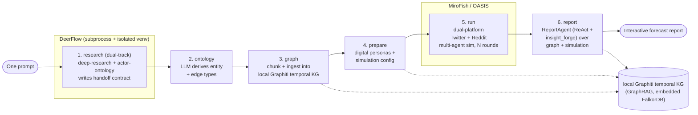

# DeepAgentForecast

**English** | [简体中文](README.zh-CN.md)

> **Type a single question. Get an interactive forecast.**
> DeepAgentForecast auto-researches the web, builds a high-fidelity parallel world, runs a multi-agent population simulation, and produces an interactive forecast report — all from one prompt.

DeepAgentForecast is an autonomous **"one prompt → forecast"** engine. You give it a question about the future; it researches the open web, distills what it learns into a temporal knowledge graph, populates a simulated society of LLM-driven personas, runs that society forward in time, and then synthesizes everything into a sectioned, evidence-grounded forecast report you can read and explore in your browser. The whole journey — research, graph, simulation, report — happens behind a single combined dashboard with a live, stage-by-stage view of the work in progress.

---

## Quickstart

```bash
git clone https://github.com/linroger/DeepAgentForecast.git
cd DeepAgentForecast
./setup.sh        # interactive: picks your LLM provider + installs everything
npm run doctor    # verify the environment is ready (seconds)
npm run dev       # backend :5001 + frontend :3000
```

Then open **<http://localhost:3000/research>**, type a question, and click **Run research + simulate + forecast**.

**There is no graph database to host.** The temporal knowledge graph runs **locally** on an embedded Graphiti + FalkorDB (no account, no Docker, no API key). The only credential you need is **one LLM**: either a local `claude` / `codex` CLI login (zero keys), or an API key for one of the hosted providers (`openai`, `kimi`, `minimax`, `deepseek`, `qwen`, `glm`). `setup.sh` walks you through picking one and live-tests the key.

See [Requirements](#requirements) and [Getting started](#getting-started) for the full walkthrough, and [Configuration (`.env`)](#configuration-env) for every knob.

---

## Demo

🔗 **[Live demo site](https://linroger.github.io/DeepAgentForecast/)** (English + 中文) — walk through **every stage** of real end-to-end runs: the deep-research console log, the research dossier with actors & sources, the generated ontology, an interactive knowledge graph, the simulated Twitter/Reddit forum, and the final forecast (Modern Mercantilism × AI 2026–2031, storage semiconductors 2027–2028, global cloud computing 2030, US AI race 2030, global EV industry 2035, Russia–Ukraine endgame, global semiconductors 2030, global memory chips 2030, China energy storage 2035, US–Iran war endgame 2026).

One prompt — *"Who wins the US AI race by 2030?"* — taken from question to interactive forecast (research → knowledge graph → 40-round population simulation → report):


▶ **[Watch the full demo video (47s, MP4)](docs/media/demo.mp4)**

### Latest run — The Collision Decade: Modern Mercantilism × AI, 2026–2031

The newest featured run answers a Bridgewater-style challenge brief in full, end to end: a deep-mode English research pass on the collision of modern mercantilism and AI, a 14-actor dossier of the principals (US executive, China, EU, Nvidia, TSMC, the hyperscalers, the Fed …) with typed, valenced relationships, an **80-persona dual-platform simulation**, and a 3-part forecast brief containing **13 binary forecasts** — each with a probability and objective resolution criteria — and **4 probability-weighted scenarios**.

🔗 **[Explore it live](https://linroger.github.io/DeepAgentForecast/demo.html?run=collision-decade-2031)**

### Showcase run — global semiconductors through 2030

An earlier showcase run: a deep-mode research pass on the full semiconductor value chain (memory / HBM / logic / foundry across 17 named companies), a 285-node knowledge graph, **115 personas** over **40 dual-platform rounds**, and a sectioned forecast report.

▶ **[Watch the semiconductor run walkthrough (42s at 4× speed, MP4)](docs/media/demo-semiconductors.mp4)** · 🔗 **[Explore it live](https://linroger.github.io/DeepAgentForecast/demo.html?run=semiconductors-2030)**

| | |
|---|---|
|  <br/>*Stage 1 — the deep-research console: every search, fetch and write of the multi-pass protocol* |  <br/>*The finished research dossier — an evidence-grounded deep dive on the 2030 semiconductor industry* |
|  <br/>*Key actors extracted from research — CEOs, analysts and companies with researched stances & influence* |  <br/>*The cited web sources backing the dossier's claims* |
|  <br/>*The 285-entity knowledge graph with its 10 generated entity types* |  <br/>*Simulation complete — 115 personas, 40/40 rounds, the full Twitter feed* |
|  <br/>*The final forecast with navigable table of contents* | |

### Screenshots

| | |
|---|---|
|  <br/>*Stage 4 — the temporal knowledge graph built from the research dossier* |  <br/>*The research dossier tab — every claim grounded in cited web sources* |
|  <br/>*Digital personas generated for each real-world actor (researched stance & influence)* |  <br/>*The live simulation console streaming agent actions in real time* |
|  <br/>*Inspecting a graph entity mid-simulation* |  <br/>*The simulated Twitter/Reddit feed at round 20/40* |
|  <br/>*Emergent discussion threads between agent personas* |  <br/>*Post & agent detail panel at round 33/40 (88% through the pipeline)* |

---

## What it does

Given one natural-language prediction question (for example, *"Will product X reach mainstream adoption within 18 months?"*), DeepAgentForecast:

1. **Researches the web autonomously (dual-track)** — two research workflows run **concurrently**: a broad *deep-research* pass that writes an evidence-graded dossier, and an *actor-ontology* pass that profiles the real key actors in depth — their roles, values, beliefs, incentives, resources, and their directed, typed, **valenced** relationships — while demoting mere reporters/outlets/sources to context rather than actors.
2. **Builds a parallel world** — the research is distilled into a temporal knowledge graph with a **tiered, behaviorally-rich ontology**, and a digital persona is generated for each **key actor** (decision-makers and stakeholders), ranked by salience rather than raw connectivity.
3. **Simulates a population** — hundreds of LLM personas interact across a simulated Twitter and Reddit for a configurable number of rounds, producing emergent social dynamics around the question.
4. **Forecasts and reports** — a report agent retrieves from both the knowledge graph and the simulation and writes an interactive, sectioned forecast report.

Everything is observable in real time: a live research console, the rendered dossier, the knowledge graph, the simulated social feed, and the final forecast all live in one dashboard.

---

## Architecture overview

DeepAgentForecast chains **two engines** through a **shared temporal knowledge graph** and a **report agent**, all surfaced by a single Vue frontend.

| Component | Role |
|---|---|
| **DeerFlow** | **DeerFlow 2.0**, a LangGraph-based super-agent harness: web search + full-text fetch, multi-angle research. Runs in its **own subprocess and isolated venv**, executing two research skills **concurrently** — `deep-research` (a broad evidence dossier) and `actor-ontology-research` (an actor-centric, ontology-ready dossier of the key cast and their relationships). |
| **MiroFish / OASIS** | A multi-agent social-simulation engine (built on CAMEL-AI's OASIS). Spins up hundreds of LLM personas interacting on a simulated **Twitter + Reddit**. |
| **Local Graphiti KG** | A **temporal knowledge graph (GraphRAG)** that glues the two engines together — the open-source [Graphiti](https://github.com/getzep/graphiti) engine (`graphiti-core==0.29.2`, the same engine Zep Cloud was built on) running **locally on an embedded FalkorDB** (the `falkordblite` package — no Docker, no server process, no account, **no API key**). The dossier is ingested here; entities and relations are extracted locally via your configured `LLM_PROVIDER` (so it works even with the no-key CLI providers), and vector embeddings are computed locally by a sentence-transformers multilingual model. |
| **ReportAgent** | A **ReAct loop** with an `insight_forge` tool that performs tool-augmented retrieval over the graph **and** the simulation, then writes the final forecast report. |
| **Frontend** | A Vue 3 + Vite single combined dashboard with a sticky 6-stage timeline and tabs for each phase. Bilingual (English + 中文). |

### The 6-stage pipeline

A **pipeline** is one prompt run. Each run flows through six stages:

```
            ┌────────────────────────────────────────────────────────────────────────┐
  one       │                          DeepAgentForecast                            │
 prompt ───▶│                                                                          │
            │  ┌───────────┐ ┌──────────┐ ┌────────┐ ┌─────────┐ ┌─────┐ ┌────────┐   │
            │  │ 1 RESEARCH│▶│2 ONTOLOGY│▶│3 GRAPH │▶│4 PREPARE│▶│5 RUN│▶│6 REPORT│   │
            │  └─────┬─────┘ └────┬─────┘ └───┬────┘ └────┬────┘ └──┬──┘ └───┬────┘   │
            │   DeerFlow      LLM derives   local KG   personas   OASIS    ReportAgent │
            │   (subprocess)  entity/edge   ingest +   + sim cfg  dual-    (ReAct +    │
            │   → dossier     types         extract    (env agent)platform insight_forge)│
            │        │            │            │           │         │          │       │
            │        └─ local Graphiti temporal KG (GraphRAG, embedded FalkorDB) throughout ┘ │
            └────────────────────────────────────────────────────────────────────────┘
                                                                                  │
                                                                                  ▼
                                                                       interactive forecast
```



**Stage by stage:**

1. **research (dual-track)** — DeerFlow runs in its own subprocess (its own Python venv) and runs **two research workflows at once**, writing a **file-based handoff contract**:
   - `research_report.md` — the broad *deep-research* dossier (Track A; augments the graph, ontology, and situation context)
   - `actor_dossier.md` — the *actor-ontology* dossier (Track B): the ranked cast with roles, values, beliefs, incentives, resources, and their directed/typed/valenced relationships
   - `actors.json` — the structured cast + relationships extracted from both (the actor dossier is the **primary** source; the report augments it)
   - `sources.json` · `prediction_requirement.txt` · `timeline.json` · `meta.json` · `research_progress.log`
2. **ontology** — an LLM derives **entity types + edge types** from the dossiers and the prediction question, tagging each entity with an **archetype + simulation tier** (so reporters, outlets, and abstract concepts become graph *context* rather than actors) and each edge with a **family + valence** (so allies, rivals, suppliers, and backers are distinguished, not collapsed together).
3. **graph** — both dossiers are **chunked and ingested** into a local Graphiti temporal knowledge graph (GraphRAG) on an embedded FalkorDB; entities and relations are extracted locally via your configured `LLM_PROVIDER`, and vector embeddings are computed locally by a sentence-transformers model — no cloud service or API key involved.
4. **prepare** — **digital personas** are generated for the **key actors only** (tier-1 decision-makers and tier-2 stakeholders — minor entities stay as graph context), ranked by **salience** rather than raw graph degree, each carrying its **behavioral DNA** (values, beliefs, incentives, resources) and its researched ally/rival/supplier/backer network; an "environment agent" sets the rounds and timing.
5. **run** — OASIS runs a **dual-platform (Twitter + Reddit)** multi-agent simulation for *N* rounds; personas post, comment, and like, and social dynamics emerge.
6. **report** — the **ReportAgent** (a ReAct loop with the `insight_forge` tool) retrieves from the graph + simulation and writes a **sectioned forecast report**.

---

## Features

- **One prompt → full forecast.** A single question drives the entire research → simulation → report pipeline end to end.
- **Autonomous deep research.** Multi-angle web search and full-text fetch, distilled into a structured dossier with actors and sources. At `deep` depth, DeerFlow runs a staged multi-pass protocol: source mapping, primary-evidence sweep, actor/incentive analysis, contradiction/risk testing, forecast-input synthesis, then final long-form synthesis.
- **Research-grounded personas.** The structured actor dossier (`actors.json`: role, stance, influence, memory per real-world actor) seeds the ontology, **the agent personas, the per-agent stance/influence config, and the simulation's initial posts** — agents start from researched facts, not LLM guesses.
- **Temporal knowledge graph (GraphRAG).** The research is ingested into a **local** Graphiti knowledge graph (embedded FalkorDB, no API key), where entities and relations are extracted locally — via your configured `LLM_PROVIDER` plus local sentence-transformers embeddings — and made queryable.
- **Multi-agent population simulation.** Hundreds of LLM personas interact on a simulated Twitter + Reddit; emergent dynamics inform the forecast.
- **Tool-augmented forecast synthesis.** A ReAct ReportAgent retrieves across both the graph and the simulation before writing.
- **Single combined dashboard.** Live log, dossier, knowledge graph, simulation feed, and forecast — all in one view with a sticky 6-stage timeline.
- **Runtime-switchable LLM providers.** Switch between local CLIs and hosted APIs from the Settings menu; the switch applies to new runs. A built-in **Test connection** button verifies an API key (or a local CLI) in one click before you commit to it.
- **Cancellable runs.** A running pipeline can be aborted from the UI at any stage — the research subprocess group is killed and the OASIS simulation is stopped, so a cancelled run stops burning quota immediately.
- **Resumable runs.** A failed or cancelled pipeline can be resumed in place (**Resume** button, or `POST /api/research/<id>/resume`). Completed stages are reused — an already-written research dossier, ontology, knowledge graph, or finished simulation is never paid for twice; the pipeline restarts from the stage that broke.
- **Fail-fast preflight.** `npm run doctor` checks the whole environment in seconds, and `POST /research/run` validates keys/credentials/checkout before any spend.
- **Bilingual UI.** English + 中文, toggled from the Settings menu.
- **Run history.** A drawer lists past pipeline runs for quick review.
- **Resilient by design.** Error guards, a tool-free synthesis net, depth-aware research watchdog with report salvage, per-section graceful degradation, atomic state writes, and orphan reconciliation (including stranded research processes) across restarts.

---

## Requirements

| Requirement | Notes |
|---|---|
| **Node.js ≥ 20.19** | For the frontend (Vue 3 + Vite 7). |
| **Python 3.11 – 3.12** | For the backend — the `camel-ai`/`camel-oasis` simulation stack targets ≤ 3.12, so the venv is **pinned to 3.12** (`backend/.python-version` + `uv sync --python 3.12`). A 3.13/3.14 default interpreter would break the install. |
| **Python 3.12** | DeerFlow's deep-research engine runs in its **own, separate venv**. |
| **uv** | The Python package manager used for both venvs. Install: `curl -LsSf https://astral.sh/uv/install.sh \| sh` |
| **git** | Needed only for the optional upstream-clone fallback; by default `setup.sh` seeds the DeerFlow research engine from the vendored `deer-flow-2.0.0/` build. |
| **Knowledge graph** | Runs **locally** via the open-source Graphiti engine on an embedded FalkorDB — **no account, no API key, no Docker**. The local graph DB and a multilingual sentence-transformers embedding model (~470MB, downloaded once on first graph build) are installed by `setup.sh` / `uv sync`. |
| **An LLM** | By default the local `claude` or `codex` CLI (no API key). The OpenAI-compatible API providers (`openai`, `kimi`, `minimax`, `deepseek`, `qwen`, `glm`) need `LLM_API_KEY`. The same provider also performs local graph entity/relation extraction. |

---

## Getting started

Three steps: **install → configure → run**. DeerFlow lives in `deer-flow/` **inside this repo** (assembled by `setup.sh` from the vendored 2.0 build or a pinned clone, gitignored) so its LangChain/LangGraph dependencies stay isolated from the backend; it runs in its own venv at `deer-flow/backend/.venv`.

### 1. Install

**Option A — `setup.sh` (recommended).** One script automates the entire installation:

```bash
./setup.sh
```

It checks prerequisites, then walks you through an **interactive provider picker**: choose between the local `claude` / `codex` CLIs (zero config, no API key — the detected CLI is pre-selected as the default) and six hosted API providers (OpenAI-compatible / Kimi / MiniMax / DeepSeek / Qwen / GLM). If you pick an API provider it prompts for your **API key** (silent input, never echoed) and **live-tests it** with a one-token completion so a typo'd key fails in seconds, not 40 minutes into a research run. It then scaffolds `.env` from `.env.example`, installs the root + frontend npm deps, builds the backend venv (**pinned to Python 3.12**, including the local Graphiti graph stack), then **assembles DeerFlow automatically**: it seeds `deer-flow/` from the vendored 2.0 build `deer-flow-2.0.0/` (falling back to a pinned shallow clone from <https://github.com/bytedance/deer-flow> if that vendor dir is absent, gitignored), **trims it to runtime essentials** (`backend/`, `skills/`, `config.yaml` — the upstream web frontend, docs, docker and CI are dead weight here), applies the **bridge overlay** from `deerflow_bridge/` (the `deerflow_research.py` driver, the `patches/models/*.py` + middleware patches, the overhauled source-tiering deep-research skill, and `config.yaml`), and builds DeerFlow's isolated venv on Python 3.12. Re-running it is idempotent and safe.

Override the defaults via env vars if needed: `DEERFLOW_DIR` (location), `DEERFLOW_REPO` (clone URL), `DEERFLOW_REF` (pinned commit; set `=main` to track HEAD), `SETUP_NONINTERACTIVE=1` (skip the picker and auto-detect — what CI / piped runs do automatically). These are read by `setup.sh` from the shell environment (they are not `.env` keys), e.g. `DEERFLOW_REF=main ./setup.sh`. Re-runs are idempotent: the picker defaults to your current `.env` provider, so pressing Enter never clobbers an existing configuration.

**Option B — manual setup** (the equivalent steps by hand):

```bash
# 1. Install Node deps (root + frontend) and the backend venv (Python 3.12 pinned)
npm run setup:all

# 2. Seed the DeerFlow research engine into the repo root from the vendored 2.0 build
cp -R deer-flow-2.0.0 deer-flow
# Fallback if the vendor dir is absent (git required):
#   git clone --depth 1 https://github.com/bytedance/deer-flow deer-flow

# 3. Apply the bridge overlay from deerflow_bridge/
cp deerflow_bridge/deerflow_research.py deer-flow/deerflow_research.py
cp deerflow_bridge/patches/models/*.py  deer-flow/backend/packages/harness/deerflow/models/
cp deerflow_bridge/patches/middlewares/*.py deer-flow/backend/packages/harness/deerflow/agents/middlewares/
cp deerflow_bridge/skills/deep-research/SKILL.md deer-flow/skills/public/deep-research/SKILL.md
cp deerflow_bridge/config.yaml          deer-flow/config.yaml      # only if absent

# 4. Build DeerFlow's isolated research venv (DeerFlow 2.0 pins Python 3.12)
UV_PROJECT_ENVIRONMENT=deer-flow/backend/.venv \
  uv sync --project deer-flow/backend --python 3.12
```

### 2. Configure

If you picked a hosted provider, set its **API key** in `.env` — see the [Configuration](#configuration-env) reference below. (The knowledge graph runs locally with no key, and the `claude` / `codex` CLIs need no key either — just make sure you are logged in, e.g. run `claude` once.)

Then verify everything is wired up — **the doctor checks your whole environment in seconds** (tool versions, both venvs, the DeerFlow overlay, credentials for the providers you selected):

```bash
npm run doctor
```

Fix any ✗ items it reports and re-run until it prints `All checks passed`.

### 3. Run

```bash
npm run dev        # backend on :5001 + frontend on :3000
```

Open **<http://localhost:3000/research>**, type your question, and click **Run research + simulate + forecast**. The backend pre-flights your configuration at launch time — misconfiguration is reported in seconds, not after a 40-minute research run.

| Service | URL |
|---|---|
| Frontend (Vue 3 + Vite) | <http://localhost:3000> (proxies `/api` → `5001`) |
| Backend (Flask) | <http://localhost:5001> |

---

## Model providers

The LLM provider is **switchable at runtime** via the Settings menu (it can also be set in `.env`, or via the `/api/settings/llm` endpoint). A provider switch applies to **new runs**.

The **report + simulation** stages are driven by `LLM_PROVIDER` (8 values):

| Provider | Description | API key? |
|---|---|---|
| **`claude-cli`** *(default)* | Uses the local `claude` CLI / Claude Code subscription. | No key |
| **`codex-cli`** | Uses the local `codex` CLI / Codex (ChatGPT) subscription. | No key |
| **`openai`** | Any OpenAI-compatible API. | Needs `LLM_API_KEY`, `LLM_BASE_URL`, `LLM_MODEL_NAME` |
| **`kimi`** | Kimi-for-coding (`api.kimi.com/coding`; OpenAI-compatible + coding-agent User-Agent gateway). | Needs `LLM_API_KEY` |
| **`minimax`** | MiniMax-M3 (`https://api.minimaxi.com/v1`; a reasoning model). | Needs `LLM_API_KEY` |
| **`deepseek`** | DeepSeek (`https://api.deepseek.com/v1`, default model `deepseek-chat`; the **research** stage uses the flagship `deepseek-v4-pro`, million-token context). | Needs `LLM_API_KEY` |
| **`qwen`** | Qwen (`https://dashscope-intl.aliyuncs.com/compatible-mode/v1`, default model `qwen-plus`; the **research** stage uses the flagship `qwen3.7-max`, million-token context). | Needs `LLM_API_KEY` |
| **`glm`** | GLM-4.6 (`https://api.z.ai/api/paas/v4`, model `glm-4.6`). | Needs `LLM_API_KEY` |

`openai`, `kimi`, `minimax`, `deepseek`, `qwen`, and `glm` are all OpenAI-compatible API providers needing `LLM_API_KEY`; `kimi`, `minimax`, `deepseek`, `qwen`, and `glm` ship sensible default `LLM_BASE_URL` / `LLM_MODEL_NAME`, so you only set `LLM_API_KEY`.

The **deep-research** stage is driven separately by `DEERFLOW_MODEL` (7 options):

| Research model | Notes |
|---|---|
| **`claude`** *(default)* | Uses Claude Code OAuth — no API key. `openai` maps to this stanza. |
| **`codex`** | Codex (ChatGPT) OAuth — no API key. Auto-selected when only the `codex` CLI is installed. |
| **`kimi`** | Kimi-for-coding. Needs `KIMI_API_KEY`. Auto-mirrored when you switch to the kimi provider in Settings. |
| **`minimax`** | Needs `MINIMAX_API_KEY`. |
| **`deepseek`** | Needs `DEEPSEEK_API_KEY`. |
| **`qwen`** | Needs `DASHSCOPE_API_KEY`. |
| **`glm`** | Needs `ZHIPUAI_API_KEY`. |

> **Note on the research stage:** the research stage is configured independently from `LLM_PROVIDER` via `DEERFLOW_MODEL`. Its per-provider key is mirrored for deer-flow (e.g. `KIMI_API_KEY`, `MINIMAX_API_KEY`, `DEEPSEEK_API_KEY`, `DASHSCOPE_API_KEY`, `ZHIPUAI_API_KEY`) and is only needed when you actually run `DEERFLOW_MODEL` on that provider. The default `claude` uses Claude Code OAuth (no API key). Both `POST /api/research/run` and `deerflow_research.py` pre-flight the selected model's credentials and fail fast with an actionable message.

### How to switch

- **Settings menu** — open the Settings menu in the frontend and pick a provider (and, if needed, supply key / base URL / model). This is the easiest path. A **Test connection** button verifies the configuration *before* you apply it: API providers get a real one-token completion against their endpoint (catching invalid keys, wrong base URLs and bad model names with a precise reason — 401 invalid key, 404 wrong endpoint/model, 429 quota), CLI providers get a PATH + version check. Nothing is persisted by a test.
- **`setup.sh`** — re-run it any time for the interactive picker (defaults to your current provider).
- **`.env`** — set `LLM_PROVIDER` (and provider credentials) before starting. See the reference below.
- **API** — `POST /api/settings/llm` with `{provider, api_key?, base_url?, model?}` to switch at runtime. Read the current setting with `GET /api/settings/llm`; test a candidate configuration without persisting it with `POST /api/settings/llm/test` (same body).

---

## Configuration (`.env`)

Create a `.env` file at the project root (`setup.sh` scaffolds it from `.env.example`).

```bash
LLM_PROVIDER=claude-cli      # claude-cli | codex-cli | openai | kimi | minimax | deepseek | qwen | glm
# No knowledge-graph API key is needed — the graph runs locally (see GRAPH_* below).

# openai / kimi / minimax / deepseek / qwen / glm only:
LLM_API_KEY=...
LLM_BASE_URL=...             # kimi/minimax/deepseek/qwen/glm ship a sensible default
LLM_MODEL_NAME=...           # kimi/minimax/deepseek/qwen/glm ship a sensible default

# DeerFlow deep research (optional — all have sensible defaults):
DEERFLOW_DIR=...                 # path to the deer-flow checkout (default: ./deer-flow)
DEERFLOW_PYTHON=...              # python interpreter for DeerFlow's venv (auto-detected)
DEERFLOW_MODEL=...               # claude | minimax | deepseek | qwen | glm | codex | kimi
DEERFLOW_RESEARCH_DEPTH=...      # quick | standard | deep
DEERFLOW_RESEARCH_LANGUAGE=...   # research output language (default Chinese)
DEERFLOW_RESEARCH_TIMEOUT=...    # research watchdog override; unset = depth-aware
                                 #   (quick 900s / standard 2400s / deep 10800s)

# DeerFlow per-provider keys (only when DEERFLOW_MODEL runs on that provider):
KIMI_API_KEY=...                 # DEERFLOW_MODEL=kimi
MINIMAX_API_KEY=...              # DEERFLOW_MODEL=minimax
DEEPSEEK_API_KEY=...             # DEERFLOW_MODEL=deepseek
DASHSCOPE_API_KEY=...            # DEERFLOW_MODEL=qwen
ZHIPUAI_API_KEY=...              # DEERFLOW_MODEL=glm

# Local knowledge graph (optional — all have sensible defaults):
GRAPH_BACKEND=auto               # auto (→ embedded FalkorDB via falkordblite) | falkordblite | kuzu | falkordb
GRAPHITI_DATA_DIR=...            # where the local graph DB persists (default: backend/uploads/graphiti_db)
GRAPHITI_EMBED_MODEL=paraphrase-multilingual-MiniLM-L12-v2  # local sentence-transformers model (EN + 中文)
GRAPHITI_EMBED_DIM=384           # embedding dimension; must match GRAPHITI_EMBED_MODEL
GRAPHITI_RERANKER=rrf            # rrf (default) | bge (local cross-encoder)
FALKORDB_HOST=...                # point at an external FalkorDB server instead of embedded
FALKORDB_PORT=...                #   (only when GRAPH_BACKEND=falkordb)

# Tuning (optional):
OASIS_SEMAPHORE=30               # concurrent LLM calls for API providers during simulation
OASIS_CLI_SEMAPHORE=3            # concurrent LLM calls for CLI providers
ZEP_MAX_RETRIES=4                 # retry budget for transient local-graph read errors
ZEP_RATE_LIMIT_MAX_SLEEP_SECONDS=90  # max backoff between those retries
FLASK_DEBUG=false                # dev only: exposes the Werkzeug debugger + reloader
```

> `DEERFLOW_REPO` / `DEERFLOW_REF` are **shell** env vars read by `setup.sh` at install time (e.g. `DEERFLOW_REF=main ./setup.sh`), not `.env` keys.

| Variable | Required | Purpose |
|---|---|---|
| `LLM_PROVIDER` | Yes | Selects the active provider. One of `claude-cli`, `codex-cli`, `openai`, `kimi`, `minimax`, `deepseek`, `qwen`, `glm`. Also drives local graph entity/relation extraction. |
| `LLM_API_KEY` | openai/kimi/minimax/deepseek/qwen/glm | API key for the hosted provider. |
| `LLM_BASE_URL` | openai/kimi/minimax/deepseek/qwen/glm | Base URL for the OpenAI-compatible endpoint (kimi/minimax/deepseek/qwen/glm default it). |
| `LLM_MODEL_NAME` | openai/kimi/minimax/deepseek/qwen/glm | Model name to request (kimi/minimax/deepseek/qwen/glm default it). |
| `GRAPH_BACKEND` | No | Local graph DB backend (default `auto` → embedded FalkorDB via `falkordblite`). Other values: `falkordblite`, `kuzu`, `falkordb`. |
| `GRAPHITI_DATA_DIR` | No | Directory where the local graph DB persists (default: `backend/uploads/graphiti_db`). |
| `GRAPHITI_EMBED_MODEL` | No | Local sentence-transformers embedding model (default `paraphrase-multilingual-MiniLM-L12-v2`, handles EN + 中文; ~470MB, downloaded once on first graph build, then cached). |
| `GRAPHITI_EMBED_DIM` | No | Embedding dimension (default `384`). Must match `GRAPHITI_EMBED_MODEL`. |
| `GRAPHITI_RERANKER` | No | Search reranker: `rrf` (default) or `bge` (a local cross-encoder). |
| `FALKORDB_HOST` / `FALKORDB_PORT` | No | Point at an **external** FalkorDB server instead of the embedded one (used with `GRAPH_BACKEND=falkordb`). |
| `DEERFLOW_DIR` | No | Location of the `deer-flow` checkout (default: `./deer-flow` inside the repo). |
| `DEERFLOW_PYTHON` | No | Python interpreter for DeerFlow's isolated venv (auto-detects `deer-flow/backend/.venv`). |
| `DEERFLOW_MODEL` | No | Research model: `claude`, `minimax`, `deepseek`, `qwen`, `glm`, `codex`, or `kimi`. |
| `KIMI_API_KEY` | DEERFLOW_MODEL=kimi | DeerFlow research key when running Kimi-for-coding. |
| `MINIMAX_API_KEY` | DEERFLOW_MODEL=minimax | DeerFlow research key when running MiniMax. |
| `DEEPSEEK_API_KEY` | DEERFLOW_MODEL=deepseek | DeerFlow research key when running DeepSeek. |
| `DASHSCOPE_API_KEY` | DEERFLOW_MODEL=qwen | DeerFlow research key when running Qwen. |
| `ZHIPUAI_API_KEY` | DEERFLOW_MODEL=glm | DeerFlow research key when running GLM. |
| `DEERFLOW_RESEARCH_DEPTH` | No | Depth of the research stage: `quick` / `standard` / `deep`. `deep` runs multiple scoped research passes before final synthesis. |
| `DEERFLOW_RESEARCH_LANGUAGE` | No | Language of the research output. |
| `DEERFLOW_RESEARCH_TIMEOUT` | No | Research watchdog override (seconds). Unset = depth-aware: quick 900 / standard 2400 / deep 10800. If the report was already written when the watchdog fires, the run is salvaged instead of discarded. |
| `OASIS_SEMAPHORE` / `OASIS_CLI_SEMAPHORE` | No | Concurrent LLM-call cap during simulation (API providers / CLI providers). In dual-platform parallel runs each platform gets half, so the cap is the true global in-flight limit. |
| `ZEP_MAX_RETRIES` / `ZEP_RATE_LIMIT_MAX_SLEEP_SECONDS` | No | Retry budget and maximum backoff for **transient local-graph read errors**. The graph runs locally now, so there are no rate limits or 429s — these knobs only smooth over occasional transient read failures. Defaults are `4` and `90`. |
| `LLM_CLI_USE_API_KEY` | No | `claude-cli` strips a stray `ANTHROPIC_API_KEY` from the subprocess env by default (it would silently switch billing from your subscription to the API). Set `true` to keep it. |
| `FLASK_DEBUG` | No | Dev only (default `false`): enables the Werkzeug debugger + auto-reloader (the reloader kills in-flight pipelines). |

---

## API surface

The backend is a **Flask** app at `http://localhost:5001`. All endpoints are under `/api`.

### Research

| Method | Endpoint | Description |
|---|---|---|
| `POST` | `/research/run` | Start a pipeline. Body: `{prompt, mode(full\|research_only), depth(quick\|standard\|deep), max_rounds?, project_name?}` → `{pipeline_id}`. Pre-flights the whole configuration (local graph backend importable, provider credentials, DeerFlow checkout) and returns an actionable `400` instead of failing mid-run. |
| `POST` | `/research/<id>/cancel` | **Cancel a running pipeline** — kills the research subprocess group / stops the OASIS simulation; other stages exit at the next checkpoint. |
| `POST` | `/research/<id>/resume` | **Resume a failed/cancelled pipeline** — reuses completed stages (research dossier, ontology, graph, finished simulation) and restarts from the stage that failed. Pre-flights the configuration first. |
| `DELETE` | `/research/<id>` | **Delete a finished run record** (including its handoff artifacts). Running pipelines must be cancelled first (`409`). |
| `POST` | `/research/clean` | **Bulk-delete failed/cancelled runs.** Body: `{statuses?: ["failed","cancelled"]}`; `running`/`completed` are never touched. |
| `GET` | `/research/status/<id>` | Current status of a pipeline run (terminal states: `completed` / `failed` / `cancelled`). |
| `GET` | `/research/list` | List pipeline runs. |
| `GET` | `/research/<id>/dossier` | The rendered research dossier. |
| `GET` | `/research/<id>/progress` | Live research progress (DeerFlow console). |

### Graph

| Method | Endpoint | Description |
|---|---|---|
| `GET` | `/graph/data/<graph_id>` | Knowledge graph data → `{nodes, edges}`. |

### Simulation

| Method | Endpoint | Description |
|---|---|---|
| `GET` | `/simulation/<sim_id>/profiles/realtime?platform=` | Real-time persona profiles (filterable by platform). |
| `GET` | `/simulation/<sim_id>/posts?platform=` | Simulated posts (filterable by platform). |
| `GET` | `/simulation/<sim_id>/agent-stats` | Aggregate agent statistics. |

### Report

| Method | Endpoint | Description |
|---|---|---|
| `GET` | `/report/<report_id>` | The forecast report → `{markdown_content, ...}`. |

### Settings

| Method | Endpoint | Description |
|---|---|---|
| `GET` | `/settings/llm` | Current LLM provider settings. |
| `POST` | `/settings/llm` | Switch provider at runtime. Body: `{provider, api_key?, base_url?, model?}`. Applies to **new runs**. |
| `POST` | `/settings/llm/test` | Test a provider configuration **without persisting it** (same body). API providers: a real one-token completion (returns ok/latency/model, or the failure reason — 401 invalid key, 404 wrong endpoint/model, 429 quota). CLI providers: PATH + version check. |

---

## The combined frontend dashboard

The frontend is **Vue 3 + Vite** at `http://localhost:3000` (it proxies `/api` to the backend on `5001`). The main view is **`/research`** — a single combined dashboard containing:

- A **prompt input** with run parameters.
- A **sticky 6-stage timeline** tracking research → ontology → graph → prepare → run → report.
- A **run-history drawer** for past runs.
- A **Settings menu** (model provider with one-click **Test connection**, + EN/中文 language toggle).

The dashboard's tabs:

| Tab | What it shows |
|---|---|
| **Live log** | The DeerFlow research console, streaming in real time. |
| **Dossier** | The rendered research dossier (markdown) plus actor cards and sources. |
| **Knowledge graph** | The temporal knowledge graph rendered as a d3 force graph. |
| **Simulation** | Personas plus the simulated Twitter/Reddit feed and live stats. |
| **Forecast** | The rendered, sectioned forecast report. |

The entire UI is **bilingual** (English + 中文).

---

## Notable engineering

- **File-based handoff contract over a subprocess.** The DeerFlow ↔ backend bridge is a file-based handoff contract executed in a subprocess, keeping DeerFlow's LangChain/LangGraph dependencies fully isolated from the backend.
- **Structured actor seeding end-to-end.** DeerFlow's `actors.json` (role / stance / influence / memory per researched actor) flows through every downstream stage: it biases the ontology, is matched by name to graph entities to ground each persona's stance and memory, drives per-agent `stance` / `influence_weight` in the simulation config, and lets initial posts be authored *by the actual researched actor* (`poster_name` matching) instead of a type-matched stand-in.
- **Research error guard.** An error guard prevents an LLM-error or degraded message from being mistaken for a real research report — it fails fast, so no contamination flows downstream.
- **Tool-free "synthesis net".** If the research agent exhausts its step budget on tool calls before writing, or hits a provider **structural** error on the final write, the report is synthesized directly from the gathered (checkpointed) research via a clean single-turn call.
- **Per-section graceful degradation.** In the ReportAgent, a single section's LLM error becomes a placeholder while the rest of the report still produces a partial result.
- **Robust state management.** Atomic state writes, process-group cleanup, and orphan reconciliation across restarts keep runs consistent.

---

## Architecture & recent enhancements

The six-stage pipeline above is the skeleton; recent releases hardened every joint of it. The changes below are architectural rather than incremental — most of them change what the system *refuses to do* (fake success, fabricate narrative, hedge forecasts) as much as what it can do. The backend suite now runs **528+ tests**.

### Pipeline hardening — no false success

- **Completion health gate.** A pipeline only reports `completed` when every stage's deliverables actually exist and pass validation — a run that limps to the end without a real simulation or report can no longer masquerade as a success.
- **Quote-provenance wall.** Quoted material in the report must trace back to actual research or simulation artifacts; unattributable quotes are rejected rather than passed through.
- **Honest simulation accounting.** Run summaries separate **organic** agent actions from **seed** actions and count rounds-with-activity, so a "hollow" simulation (agents present but silent) is detected and flagged instead of inflating the numbers.
- **Anti-fabrication.** The ReportAgent never narrativizes a dead simulation: if the sim produced no organic signal, the report says so and reasons from research alone, rather than inventing "the agents converged on…" prose.
- **Per-section retry with early-abort.** Failed report sections are retried with backoff; systemic failure aborts the report early instead of burning quota on a doomed run.
- **Deliverable-validated report reuse.** On resume, a previously written report is only reused after its deliverables re-validate — a half-written or placeholder report is regenerated, not trusted.

### Simulation realism

- **Actor-cast discipline (new).** Every forecast is distilled to a hard cap of **≤20 main actors** — only entities whose decisions or actions causally affect the outcome make the cast; reporters, outlets, and other media are demoted to *sources* rather than actors. The cap (`ACTOR_CAST_MAX`, default 20) runs end-to-end through research extraction, ontology, personas, and the simulation roster, with optional non-LLM programmatic "audience" filler via `SIM_AUDIENCE_AGENTS` — cutting simulation cost roughly **4×** while concentrating LLM spend on the actual decision-makers.
- **Dossier-grounded seed posts.** Initial posts are synthesized from the researched actor dossier (each actor opens on a researched hot topic with its researched stance), so agents never wake up to an empty feed — the root cause of hollow sims.
- **World-state briefing.** A compact world-state brief (situation, timeline, contested claims) is injected into every agent's system prompt each round, keeping the population grounded in the researched world rather than drifting into generic chatter.
- **Heterogeneous personas.** Eight distinct analytical frameworks are deterministically distributed across the persona population, so disagreement is structural — the epistemic diversity that makes wisdom-of-crowds aggregation meaningful.
- **Runtime controls.** A configurable simulated start hour, a model-free recommender-system default (no extra LLM calls inside the recsys loop), and flag-gated mid-simulation checkpoint/resume for long runs.

### Forecast quality

- **Binary-forecast contract.** Part 1 of every report must carry **10+ binary forecasts**, each a single sentence with a probability and objective resolution criteria (metric · threshold · date · source) — enforced structurally, not stylistically.
- **Contrarian reframing + conviction gate.** Each forecast is stress-tested against its strongest counter-case, and hedged probabilities (everything ~50%) are pushed back toward genuine conviction.
- **Simulation-signal integration.** Organic simulation dynamics feed into forecast probabilities as an explicit adjustment with stated direction and rationale.
- **Prose ↔ `forecast.json` consistency audit.** The machine-readable forecast object and the written report are cross-checked so a number can't say 82% while the prose argues 60%.
- **Bridgewater-style 3-part skeleton.** Part 1 (forecast table) / Part 2 (framework & holistic synthesis) / Part 3 (analytical appendix) — the structure of the featured Collision Decade run.
- **Prediction-market grounding (new).** During research, implied probabilities are pulled from **Polymarket's public Gamma API** (no API key required) and injected as calibration anchors; the snapshot is capped per event for topic diversity, and the final brief reports forecast-vs-market divergence, so every disagreement with the market is deliberate and argued.

### Provider architecture

**MiniMax-M3 primary with `claude-cli` fallback**, wrapped in circuit breakers for both **422 content-filter** rejections and **429 quota** exhaustion: a provider that starts failing structurally is benched and traffic fails over (S9) instead of poisoning the run. CLI providers run with hook isolation so a user's local Claude/Codex hooks can't interfere with pipeline subprocess calls.

### Knowledge graph

The local Graphiti + FalkorDB graph gained **causal edges** (typed cause→effect relations extracted alongside the standard ontology), **multi-hop causal traversal** (causal-path and n-hop-subgraph queries plus cascade tracing for the ReportAgent), **centrality priors** that feed actor salience ranking in persona selection, **semantic query compaction** to keep graph-search calls inside token budgets, and a **dead-letter replay** queue so failed ingest episodes are retried rather than silently dropped.

---

## DRF-2: next-generation architecture (preview)

The `deerflow2-redesign` branch carries **DRF-2**, a ground-up rebuild of the orchestration layer. The redesign verdict (full analysis in [`REDESIGN.md`](REDESIGN.md)): rebuild around the **DeerFlow 2.0 super-agent harness** — everything *knowledge-shaped* becomes harness primitives (the research / ontology / simulation-design / forecast methodology ports as **skills**; the four pipeline stages become **custom sub-agents** with **per-stage model routing** — MiniMax-M3 for cheap stages, claude-cli for strong ones), while the two *heavy engines* stay outside the harness: the **knowledge graph** (Graphiti + FalkorDB) and the **OASIS simulation** are exposed *to* the harness as external **MCP servers**. The deterministic machinery that must never be LLM-mediated — health gates (research quality floor, hollow-sim gate, binary conviction gate), schema-versioned resume, artifact manifests, and multi-seed **ensemble** fan-out — lives in a thin **Pipeline Driver** (`drf2/driver/`).

**Status, honestly:** the scaffold is complete (skills, engines, driver, config — the backend suite now collects **756 tests**, including the DRF-2 drift guards), but **no live end-to-end shakedown has been run through the harness yet**. Until DRF-2 passes the same deliverable gates on a live run, **the legacy pipeline documented in this README remains the working system.** To try the preview, see [`drf2/README.md`](drf2/README.md) (or run `SETUP_DRF2=1 ./setup.sh` for the optional dependency install plus a command cheatsheet).

---

## Project layout

```
DeepAgentForecast/
├── backend/                 # Flask API (port 5001) — pipeline orchestration,
│   │                        #   graph ingest, simulation, ReportAgent. uv-managed,
│   └── .python-version      #   pinned to Python 3.12 (camel-ai stack targets ≤3.12).
├── frontend/                # Vue 3 + Vite dashboard (port 3000), bilingual EN/中文.
├── deerflow_bridge/         # Bridge overlay applied onto the cloned deer-flow:
│   ├── deerflow_research.py #   research driver / entry point (→ deer-flow/ root).
│   ├── patches/models/      #   provider patches (claude OAuth fix, Keychain loader,
│   │                        #     patched_minimax → MiniMax "name" fix).
│   └── config.yaml          #   deer-flow model config (copied only if absent).
├── docs/                    # GitHub Pages demo site + media assets (docs/media/).
├── scripts/doctor.sh        # `npm run doctor` — environment health check.
├── setup.sh                 # Quick-start: interactive provider picker + key test,
│                            #   assembles deer-flow, installs everything, applies overlay.
├── .env                     # LLM_PROVIDER, local graph (GRAPH_*) + provider + DeerFlow config.
├── package.json             # `setup:all`, `doctor` and `dev` scripts.
└── deer-flow/               # DeerFlow research engine — assembled by setup.sh,
    └── backend/.venv/       #   gitignored; isolated LangGraph venv (Python 3.12).
```

> DeerFlow lives **inside the repo** but is gitignored — your clone stays a single folder and `git status` stays clean. `setup.sh` seeds it from the vendored 2.0 build `deer-flow-2.0.0/` (falling back to a pinned shallow clone if that vendor dir is absent — git required only then), trims it to the runtime essentials (`backend/`, `skills/`, `config.yaml`), applies the `deerflow_bridge/` overlay (driver + patches + the overhauled deep-research skill + `config.yaml`), and builds its venv with:
> `UV_PROJECT_ENVIRONMENT=deer-flow/backend/.venv uv sync --project deer-flow/backend --python 3.12`

---

## Troubleshooting

**First move: run `npm run doctor`.** It diagnoses the most common problems (missing venvs, wrong Python, missing overlay, placeholder keys, missing CLI logins) with the exact fix command for each.

| Symptom | Likely cause / fix |
|---|---|
| **`POST /research/run` returns a preflight error list** | That's the fail-fast check working — each bullet names the missing piece (local graph backend, provider key, CLI login, DeerFlow checkout) and how to fix it. Nothing was spent. |
| **Graph stage fails: local graph backend not installed / not importable** | The knowledge graph runs locally via Graphiti on an embedded FalkorDB, installed by the backend venv. Run `./setup.sh` (or `( cd backend && uv sync --python 3.12 )`) to install it. The first graph build also downloads the multilingual sentence-transformers embedding model (~470MB, cached afterwards), so the very first run is slower; subsequent runs reuse the cache. |
| **First graph build is slow / appears to hang downloading a model** | On the first graph build the local embedding model (`GRAPHITI_EMBED_MODEL`, default `paraphrase-multilingual-MiniLM-L12-v2`, ~470MB) is downloaded once and cached. Let it finish; later runs skip the download. Behind a firewall, pre-cache the model or point `GRAPHITI_EMBED_MODEL` at a locally available one (and set `GRAPHITI_EMBED_DIM` to match). |
| **Backend install fails (camel-ai / tiktoken build errors)** | Your default Python is 3.13+. The backend venv must be on **3.11–3.12**: `( cd backend && uv sync --python 3.12 )` — `setup.sh` and `backend/.python-version` already pin this. |
| **Research stage runs on Claude even though I picked another provider** | The research stage is configured separately via `DEERFLOW_MODEL` (`claude` *(default)*, `minimax`, `deepseek`, `qwen`, `glm`, `codex`, `kimi`), not by `LLM_PROVIDER`. Only `openai` maps to the `claude` stanza. Set `DEERFLOW_MODEL` (and its key, e.g. `MINIMAX_API_KEY`) to run research on a different model. |
| **DeerFlow / research stage fails to start** | `setup.sh` assembles `deer-flow/` into the repo (seeded from the vendored `deer-flow-2.0.0/` build, or a pinned shallow clone if that vendor dir is absent — git required only then) and applies the `deerflow_bridge/` overlay. Ensure its venv is built with Python 3.12: `UV_PROJECT_ENVIRONMENT=deer-flow/backend/.venv uv sync --project deer-flow/backend --python 3.12`. Re-running `setup.sh` is idempotent; to update the engine, delete `deer-flow/` and re-run `./setup.sh`. Optionally set `DEERFLOW_DIR` / `DEERFLOW_PYTHON` (or `DEERFLOW_REPO` / `DEERFLOW_REF` for `setup.sh`). |
| **No API key but hosted provider selected** | `openai`, `kimi`, `minimax`, `deepseek`, `qwen`, and `glm` need `LLM_API_KEY` (with `LLM_BASE_URL` / `LLM_MODEL_NAME`; `kimi`/`minimax`/`deepseek`/`qwen`/`glm` default those). For no-key operation use `claude-cli` or `codex-cli`. |
| **`claude-cli` returns 401 / bills the API instead of my subscription** | A stray `ANTHROPIC_API_KEY` in your environment. It is stripped from the CLI subprocess automatically; run `claude` once to refresh the OAuth login. (Set `LLM_CLI_USE_API_KEY=true` if you *want* API-key billing.) |
| **Provider switch didn't take effect** | The runtime switch applies to **new runs** only. Start a fresh pipeline after switching. |
| **Frontend can't reach the API** | The frontend proxies `/api` → `5001`. Confirm the backend is running on port 5001 (`npm run dev` starts both). The UI shows a "Lost connection" banner if the backend stops responding mid-run. |
| **Research stage times out** | The watchdog is depth-aware (quick 900s / standard 2400s / deep 10800s). Deep mode intentionally runs multiple research passes, so it is slower; override with `DEERFLOW_RESEARCH_TIMEOUT` or reduce research `depth`. If the report was already written when the watchdog fired, the run salvages it and continues. |
| **Deep research logs `[FORCED STOP] Tool web_search called N times` from pass 2 onward** | Upstream DeerFlow accumulates per-tool call counts across all turns of a thread, starving later research passes. Re-run `./setup.sh` to apply the bridge middleware patch (per-run counter resets) and pick up the research-grade `web_search`/`web_fetch` limits in `deerflow_bridge/config.yaml` (if you keep your own `deer-flow/config.yaml`, merge the `loop_detection.tool_freq_overrides` stanza by hand). |
| **Need to stop a long run** | Click **Cancel** in the run header (or `POST /api/research/<id>/cancel`). Research/simulation subprocesses are terminated immediately. |
| **A run failed (or was cancelled) midway** | Click **Resume** in the run header (or `POST /api/research/<id>/resume`). Completed stages are reused — a finished research dossier, graph, or simulation is never re-run — and the pipeline restarts from the stage that broke. This also covers runs interrupted by a backend restart. |
| **A report section shows a placeholder** | Per-section graceful degradation: one section's LLM error becomes a placeholder while the rest of the report is still produced. Re-run if needed. |

---

## Acknowledgments

- **[OASIS](https://github.com/camel-ai/oasis)** (CAMEL-AI) powers the multi-agent social simulation engine — sincere thanks to the CAMEL-AI team for their open-source work.
- **[DeerFlow](https://github.com/bytedance/deer-flow)** (ByteDance) powers the deep-research stage.
- **[Graphiti](https://github.com/getzep/graphiti)** (the open-source temporal knowledge-graph engine) powers the local GraphRAG knowledge graph, running embedded with no cloud service or API key.
- Built on **[MiroFish](https://github.com/666ghj/MiroFish)**, the original population-simulation prediction engine.

## License

[AGPL-3.0](LICENSE)
