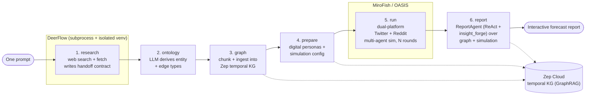

# DeepResearchForecast

> **Type a single question. Get an interactive forecast.**
> DeepResearchForecast auto-researches the web, builds a high-fidelity parallel world, runs a multi-agent population simulation, and produces an interactive forecast report — all from one prompt.

DeepResearchForecast is an autonomous **"one prompt → forecast"** engine. You give it a question about the future; it researches the open web, distills what it learns into a temporal knowledge graph, populates a simulated society of LLM-driven personas, runs that society forward in time, and then synthesizes everything into a sectioned, evidence-grounded forecast report you can read and explore in your browser. The whole journey — research, graph, simulation, report — happens behind a single combined dashboard with a live, stage-by-stage view of the work in progress.

---

## What it does

Given one natural-language prediction question (for example, *"Will product X reach mainstream adoption within 18 months?"*), DeepResearchForecast:

1. **Researches the web autonomously** — a deep-research super-agent performs multi-angle web search and full-text fetching, then writes a structured research dossier with the actors, sources, and the precise prediction requirement.
2. **Builds a parallel world** — the dossier is converted into a temporal knowledge graph, and one digital persona is generated per key entity in that graph.
3. **Simulates a population** — hundreds of LLM personas interact across a simulated Twitter and Reddit for a configurable number of rounds, producing emergent social dynamics around the question.
4. **Forecasts and reports** — a report agent retrieves from both the knowledge graph and the simulation and writes an interactive, sectioned forecast report.

Everything is observable in real time: a live research console, the rendered dossier, the knowledge graph, the simulated social feed, and the final forecast all live in one dashboard.

---

## Architecture overview

DeepResearchForecast chains **two engines** through a **shared temporal knowledge graph** and a **report agent**, all surfaced by a single Vue frontend.

| Component | Role |
|---|---|
| **DeerFlow** | A LangGraph-based deep-research "super agent": web search + full-text fetch, multi-angle research, writes a structured research dossier. Runs in its **own subprocess and isolated Python venv**. |
| **MiroFish / OASIS** | A multi-agent social-simulation engine (built on CAMEL-AI's OASIS). Spins up hundreds of LLM personas interacting on a simulated **Twitter + Reddit**. |
| **Zep Cloud** | A **temporal knowledge graph (GraphRAG)** that glues the two engines together. The dossier is ingested here; entities and relations are extracted server-side. |
| **ReportAgent** | A **ReAct loop** with an `insight_forge` tool that performs tool-augmented retrieval over the graph **and** the simulation, then writes the final forecast report. |
| **Frontend** | A Vue 3 + Vite single combined dashboard with a sticky 6-stage timeline and tabs for each phase. Bilingual (English + 中文). |

### The 6-stage pipeline

A **pipeline** is one prompt run. Each run flows through six stages:

```
            ┌────────────────────────────────────────────────────────────────────────┐
  one       │                          DeepResearchForecast                            │
 prompt ───▶│                                                                          │
            │  ┌───────────┐ ┌──────────┐ ┌────────┐ ┌─────────┐ ┌─────┐ ┌────────┐   │
            │  │ 1 RESEARCH│▶│2 ONTOLOGY│▶│3 GRAPH │▶│4 PREPARE│▶│5 RUN│▶│6 REPORT│   │
            │  └─────┬─────┘ └────┬─────┘ └───┬────┘ └────┬────┘ └──┬──┘ └───┬────┘   │
            │   DeerFlow      LLM derives   Zep KG     personas   OASIS    ReportAgent │
            │   (subprocess)  entity/edge   ingest +   + sim cfg  dual-    (ReAct +    │
            │   → dossier     types         extract    (env agent)platform insight_forge)│
            │        │            │            │           │         │          │       │
            │        └─ Zep Cloud temporal knowledge graph (GraphRAG) shared throughout ┘ │
            └────────────────────────────────────────────────────────────────────────┘
                                                                                  │
                                                                                  ▼
                                                                       interactive forecast
```



**Stage by stage:**

1. **research** — DeerFlow runs in its own subprocess (its own Python venv), researches the web, and writes a **file-based handoff contract**:
   - `research_report.md` — the structured research dossier
   - `actors.json` — the key actors
   - `sources.json` — the cited sources
   - `prediction_requirement.txt` — the precise prediction question
   - `meta.json` — run metadata
   - `research_progress.log` — the live research console log
2. **ontology** — an LLM derives **entity types + edge types** from the dossier and the prediction question.
3. **graph** — the dossier is **chunked and ingested** into a Zep temporal knowledge graph (GraphRAG); entities and relations are extracted server-side.
4. **prepare** — **digital personas** (one per key graph entity) and the **simulation config** are generated; an "environment agent" sets the rounds and timing.
5. **run** — OASIS runs a **dual-platform (Twitter + Reddit)** multi-agent simulation for *N* rounds; personas post, comment, and like, and social dynamics emerge.
6. **report** — the **ReportAgent** (a ReAct loop with the `insight_forge` tool) retrieves from the graph + simulation and writes a **sectioned forecast report**.

---

## Features

- **One prompt → full forecast.** A single question drives the entire research → simulation → report pipeline end to end.
- **Autonomous deep research.** Multi-angle web search and full-text fetch, distilled into a structured dossier with actors and sources.
- **Temporal knowledge graph (GraphRAG).** The research is ingested into Zep Cloud, where entities and relations are extracted and made queryable.
- **Multi-agent population simulation.** Hundreds of LLM personas interact on a simulated Twitter + Reddit; emergent dynamics inform the forecast.
- **Tool-augmented forecast synthesis.** A ReAct ReportAgent retrieves across both the graph and the simulation before writing.
- **Single combined dashboard.** Live log, dossier, knowledge graph, simulation feed, and forecast — all in one view with a sticky 6-stage timeline.
- **Runtime-switchable LLM providers.** Switch between local CLIs and hosted APIs from the Settings menu; the switch applies to new runs.
- **Bilingual UI.** English + 中文, toggled from the Settings menu.
- **Run history.** A drawer lists past pipeline runs for quick review.
- **Resilient by design.** Error guards, a tool-free synthesis net, per-section graceful degradation, atomic state writes, and orphan reconciliation across restarts.

---

## Requirements

| Requirement | Notes |
|---|---|
| **Node.js 18+** | For the frontend (Vue 3 + Vite). |
| **Python ≥ 3.11** | For the backend. |
| **Python ≥ 3.12 (3.13 recommended)** | DeerFlow's deep-research engine needs Python ≥ 3.12. |
| **uv** | The Python package manager used for both backend and DeerFlow. |
| **Zep Cloud API key** | **Always required** (the free tier works). Get one at <https://app.getzep.com/>. |
| **An LLM** | By default the local `claude` or `codex` CLI (no API key). Only `openai`, `kimi`, and `minimax` need an API key. |

---

## Quick start

DeerFlow lives in a **sibling directory** named `deer-flow` so its LangChain/LangGraph dependencies stay isolated from the backend. It runs in its own venv at `deer-flow/backend/.venv` (Python ≥ 3.12).

### Option A — `setup.sh` (recommended)

A quick-start script automates the entire installation **and auto-detects the model provider**.

```bash
./setup.sh
```

`setup.sh` installs the root, frontend, backend, and DeerFlow dependencies, detects which LLM provider is available, and gets you ready to run.

### Option B — manual setup

```bash
# 1. Install all dependencies (root + frontend + backend)
npm run setup:all          # backend deps are installed via `uv sync`

# 2. Build DeerFlow's isolated research venv (Python ≥ 3.12; 3.13 recommended)
UV_PROJECT_ENVIRONMENT=deer-flow/backend/.venv \
  uv sync --project deer-flow/backend --python 3.13

# 3. Configure your environment (see .env reference below)
#    Set ZEP_API_KEY (always required) and LLM_PROVIDER.

# 4. Run both servers (backend on 5001 + frontend on 3000)
npm run dev
```

Then open **<http://localhost:3000/research>**.

| Service | URL |
|---|---|
| Frontend (Vue 3 + Vite) | <http://localhost:3000> (proxies `/api` → `5001`) |
| Backend (Flask) | <http://localhost:5001> |

---

## Model providers

The LLM provider is **switchable at runtime** via the Settings menu (it can also be set in `.env`, or via the `/api/settings/llm` endpoint). A provider switch applies to **new runs**.

| Provider | Description | API key? |
|---|---|---|
| **`claude-cli`** *(default)* | Uses the local `claude` CLI / Claude Code subscription. | No key |
| **`codex-cli`** | Uses the local `codex` CLI / Codex subscription. | No key |
| **`openai`** | Any OpenAI-compatible API. | Needs `LLM_API_KEY`, `LLM_BASE_URL`, `LLM_MODEL_NAME` |
| **`kimi`** | Kimi-for-coding (OpenAI-compatible + coding-agent User-Agent gateway). | Yes |
| **`minimax`** | MiniMax-M3 code plan (`api.minimaxi.com`; ~1M-token context, up to 512K output; a reasoning model). | Yes |

> **Note on the research stage:** DeerFlow's deep-research stage currently supports only **`claude`** and **`minimax`** research models. If another provider is selected, the **research** stage falls back to Claude, while the **simulation** and **report** stages use your selected provider.

### How to switch

- **Settings menu** — open the Settings menu in the frontend and pick a provider (and, if needed, supply key / base URL / model). This is the easiest path.
- **`.env`** — set `LLM_PROVIDER` (and provider credentials) before starting. See the reference below.
- **API** — `POST /api/settings/llm` with `{provider, api_key?, base_url?, model?}` to switch at runtime. Read the current setting with `GET /api/settings/llm`.

---

## Configuration (`.env`)

Create a `.env` file at the project root.

```bash
LLM_PROVIDER=claude-cli      # claude-cli | codex-cli | openai | kimi | minimax
ZEP_API_KEY=...              # required (free tier works)

# openai / kimi / minimax only:
LLM_API_KEY=...
LLM_BASE_URL=...
LLM_MODEL_NAME=...

# DeerFlow deep research (optional — all have sensible defaults):
DEERFLOW_DIR=...                 # path to the deer-flow sibling directory
DEERFLOW_PYTHON=...              # python interpreter for DeerFlow's venv
DEERFLOW_MODEL=...               # claude | minimax
DEERFLOW_RESEARCH_DEPTH=...      # research depth
DEERFLOW_RESEARCH_LANGUAGE=...   # research output language
DEERFLOW_RESEARCH_TIMEOUT=...    # research stage timeout
```

| Variable | Required | Purpose |
|---|---|---|
| `LLM_PROVIDER` | Yes | Selects the active provider. One of `claude-cli`, `codex-cli`, `openai`, `kimi`, `minimax`. |
| `ZEP_API_KEY` | **Always** | Zep Cloud API key for the temporal knowledge graph. |
| `LLM_API_KEY` | openai/kimi/minimax | API key for the hosted provider. |
| `LLM_BASE_URL` | openai/kimi/minimax | Base URL for the OpenAI-compatible endpoint. |
| `LLM_MODEL_NAME` | openai/kimi/minimax | Model name to request. |
| `DEERFLOW_DIR` | No | Location of the `deer-flow` sibling directory. |
| `DEERFLOW_PYTHON` | No | Python interpreter for DeerFlow's isolated venv. |
| `DEERFLOW_MODEL` | No | Research model: `claude` or `minimax`. |
| `DEERFLOW_RESEARCH_DEPTH` | No | Depth of the research stage. |
| `DEERFLOW_RESEARCH_LANGUAGE` | No | Language of the research output. |
| `DEERFLOW_RESEARCH_TIMEOUT` | No | Timeout for the research stage. |

---

## API surface

The backend is a **Flask** app at `http://localhost:5001`. All endpoints are under `/api`.

### Research

| Method | Endpoint | Description |
|---|---|---|
| `POST` | `/research/run` | Start a pipeline. Body: `{prompt, mode(full\|research_only), depth(quick\|standard\|deep), max_rounds?}` → `{pipeline_id}`. |
| `GET` | `/research/status/<id>` | Current status of a pipeline run. |
| `GET` | `/research/list` | List pipeline runs. |
| `GET` | `/research/<id>/dossier` | The rendered research dossier. |
| `GET` | `/research/<id>/progress` | Live research progress (DeerFlow console). |

### Graph

| Method | Endpoint | Description |
|---|---|---|
| `GET` | `/graph/data/<graph_id>` | Knowledge graph data → `{nodes, edges}`. |

### Simulation

| Method | Endpoint | Description |
|---|---|---|
| `GET` | `/simulation/<sim_id>/profiles/realtime?platform=` | Real-time persona profiles (filterable by platform). |
| `GET` | `/simulation/<sim_id>/posts?platform=` | Simulated posts (filterable by platform). |
| `GET` | `/simulation/<sim_id>/agent-stats` | Aggregate agent statistics. |

### Report

| Method | Endpoint | Description |
|---|---|---|
| `GET` | `/report/<report_id>` | The forecast report → `{markdown_content, ...}`. |

### Settings

| Method | Endpoint | Description |
|---|---|---|
| `GET` | `/settings/llm` | Current LLM provider settings. |
| `POST` | `/settings/llm` | Switch provider at runtime. Body: `{provider, api_key?, base_url?, model?}`. Applies to **new runs**. |

---

## The combined frontend dashboard

The frontend is **Vue 3 + Vite** at `http://localhost:3000` (it proxies `/api` to the backend on `5001`). The main view is **`/research`** — a single combined dashboard containing:

- A **prompt input** with run parameters.
- A **sticky 6-stage timeline** tracking research → ontology → graph → prepare → run → report.
- A **run-history drawer** for past runs.
- A **Settings menu** (model provider + EN/中文 language toggle).

The dashboard's tabs:

| Tab | What it shows |
|---|---|
| **Live log** | The DeerFlow research console, streaming in real time. |
| **Dossier** | The rendered research dossier (markdown) plus actor cards and sources. |
| **Knowledge graph** | The temporal knowledge graph rendered as a d3 force graph. |
| **Simulation** | Personas plus the simulated Twitter/Reddit feed and live stats. |
| **Forecast** | The rendered, sectioned forecast report. |

The entire UI is **bilingual** (English + 中文).

---

## Notable engineering

- **File-based handoff contract over a subprocess.** The DeerFlow ↔ backend bridge is a file-based handoff contract executed in a subprocess, keeping DeerFlow's LangChain/LangGraph dependencies fully isolated from the backend.
- **Research error guard.** An error guard prevents an LLM-error or degraded message from being mistaken for a real research report — it fails fast, so no contamination flows downstream.
- **Tool-free "synthesis net".** If the research agent exhausts its step budget on tool calls before writing, or hits a provider **structural** error on the final write, the report is synthesized directly from the gathered (checkpointed) research via a clean single-turn call.
- **Per-section graceful degradation.** In the ReportAgent, a single section's LLM error becomes a placeholder while the rest of the report still produces a partial result.
- **Robust state management.** Atomic state writes, process-group cleanup, and orphan reconciliation across restarts keep runs consistent.

---

## Project layout

```
DeepResearchForecast/
├── backend/                 # Flask API (port 5001) — pipeline orchestration,
│                            #   graph ingest, simulation, ReportAgent. uv-managed.
├── frontend/                # Vue 3 + Vite dashboard (port 3000), bilingual EN/中文.
├── deer-flow/               # SIBLING engine: LangGraph deep-research super agent.
│   └── backend/
│       └── .venv/           # Isolated Python ≥ 3.12 venv (deps isolated from backend).
├── setup.sh                 # Quick-start: installs everything, auto-detects provider.
├── .env                     # LLM_PROVIDER, ZEP_API_KEY, provider + DeerFlow config.
└── package.json             # `setup:all` and `dev` scripts (run backend + frontend).
```

> DeerFlow is a **sibling directory** to keep its dependency tree isolated from the backend. Build its venv with:
> `UV_PROJECT_ENVIRONMENT=deer-flow/backend/.venv uv sync --project deer-flow/backend --python 3.13`

---

## Troubleshooting

| Symptom | Likely cause / fix |
|---|---|
| **Missing / invalid `ZEP_API_KEY`** | The Zep Cloud key is **always required** (graph stage). Set `ZEP_API_KEY` in `.env`; the free tier works. Get one at <https://app.getzep.com/>. |
| **Research stage runs on Claude even though I picked another provider** | Expected. DeerFlow's deep-research stage supports only `claude` and `minimax`; other providers fall back to Claude for research while simulation/report use your selection. |
| **DeerFlow / research stage fails to start** | Ensure the `deer-flow` sibling venv is built with Python ≥ 3.12 (3.13 recommended): `UV_PROJECT_ENVIRONMENT=deer-flow/backend/.venv uv sync --project deer-flow/backend --python 3.13`. Optionally set `DEERFLOW_DIR` / `DEERFLOW_PYTHON`. |
| **No API key but hosted provider selected** | `openai`, `kimi`, and `minimax` need `LLM_API_KEY` (and `LLM_BASE_URL`, `LLM_MODEL_NAME`). For no-key operation use `claude-cli` or `codex-cli`. |
| **Provider switch didn't take effect** | The runtime switch applies to **new runs** only. Start a fresh pipeline after switching. |
| **Frontend can't reach the API** | The frontend proxies `/api` → `5001`. Confirm the backend is running on port 5001 (`npm run dev` starts both). |
| **Research stage times out** | Increase `DEERFLOW_RESEARCH_TIMEOUT`, or reduce research `depth` (`quick` / `standard` / `deep`). |
| **A report section shows a placeholder** | Per-section graceful degradation: one section's LLM error becomes a placeholder while the rest of the report is still produced. Re-run if needed. |
