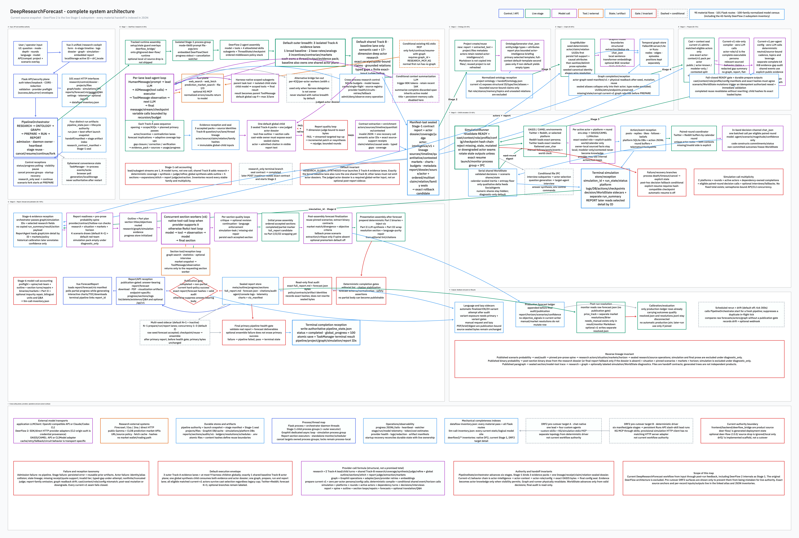
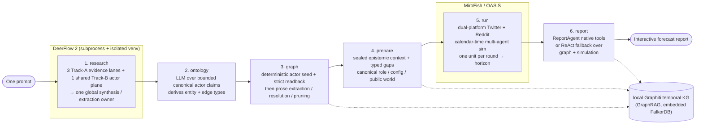

# DeepAgentForecast

**English** | [简体中文](README.zh-CN.md)

[](https://deepwiki.com/linroger/DeepAgentForecast)

> 📖 **Documentation:** [whole-system architecture atlas](docs/architecture/DEEPRESEARCHFORECAST_SYSTEM_ATLAS.md) · [editable whole-system tldraw map](docs/architecture/deepresearchforecast-system-architecture.tldr) · [actor-intelligence architecture](docs/architecture/ACTOR_INTELLIGENCE_ARCHITECTURE.md) · [all model-call families](docs/architecture/llm-call-inventory.json) · [all dataflows and Flask interfaces](docs/architecture/dataflow-inventory.json) · [DeerFlow 2 Stage-1 deep dive](docs/architecture/deerflow2/DEERFLOW_2_ARCHITECTURE.md) · [DeepWiki](https://deepwiki.com/linroger/DeepAgentForecast).

> **Type a single question. Get an interactive forecast.**
> DeepAgentForecast auto-researches the web, builds a high-fidelity parallel world, runs a multi-agent population simulation, and produces an interactive forecast report — all from one prompt.

DeepAgentForecast is an autonomous **"one prompt → forecast"** engine. You give it a question about the future; it researches the open web, distills what it learns into a temporal knowledge graph, populates a simulated society of LLM-driven personas, runs that society forward in time, and then synthesizes everything into a sectioned, evidence-grounded forecast report you can read and explore in your browser. The whole journey — research, graph, simulation, report — happens behind a single combined dashboard with a live, stage-by-stage view of the work in progress.

---

## Quickstart

```bash
git clone https://github.com/linroger/DeepAgentForecast.git
cd DeepAgentForecast
./setup.sh        # interactive: picks your LLM provider + installs everything
npm run doctor    # check basic prerequisites and imports (seconds)
npm start         # backend :5001 + frontend :3000; stream logs + stage marks
```

Then open **<http://localhost:3000/research>**, type a question, and click **Run research + simulate + forecast**.

**There is no graph database to host.** The temporal knowledge graph runs **locally** on an embedded Graphiti + FalkorDB (no account, no Docker, no API key). The only credential you need is **one LLM**: either a local `claude` / `codex` CLI login (zero keys), or an API key for one of the hosted providers (`openai`, `kimi`, `minimax`, `deepseek`, `qwen`, `glm`). `setup.sh` walks you through picking one and live-tests the key.

See [Requirements](#requirements) and [Getting started](#getting-started) for the full walkthrough, and [Configuration (`.env`)](#configuration-env) for every knob.

---

## Demo

🔗 **[Live demo site](https://linroger.github.io/DeepAgentForecast/)** (English + 中文) — walk through **every stage** of real end-to-end runs: the deep-research console log, the research dossier with actors & sources, the generated ontology, an interactive knowledge graph, the simulated Twitter/Reddit forum, and the final forecast (Modern Mercantilism × AI 2026–2031, storage semiconductors 2027–2028, global cloud computing 2030, US AI race 2030, global EV industry 2035, Russia–Ukraine endgame, global semiconductors 2030, global memory chips 2030, China energy storage 2035, US–Iran war endgame 2026).

One prompt — *"Who wins the US AI race by 2030?"* — taken from question to interactive forecast (research → knowledge graph → 40-round population simulation → report):


▶ **[Watch the full demo video (47s, MP4)](docs/media/demo.mp4)**

### Latest run — The Collision Decade: Modern Mercantilism × AI, 2026–2031

The newest featured run answers a Bridgewater-style challenge brief in full, end to end: a deep-mode English research pass on the collision of modern mercantilism and AI, a 14-actor dossier of the principals (US executive, China, EU, Nvidia, TSMC, the hyperscalers, the Fed …) with typed, valenced relationships, an **80-persona dual-platform simulation**, and a 3-part forecast brief containing **13 binary forecasts** — each with a probability and objective resolution criteria — and **4 probability-weighted scenarios**.

🔗 **[Explore it live](https://linroger.github.io/DeepAgentForecast/demo.html?run=collision-decade-2031)**

### Showcase run — global semiconductors through 2030

An earlier showcase run: a deep-mode research pass on the full semiconductor value chain (memory / HBM / logic / foundry across 17 named companies), a 285-node knowledge graph, **115 personas** over **40 dual-platform rounds**, and a sectioned forecast report.

▶ **[Watch the semiconductor run walkthrough (42s at 4× speed, MP4)](docs/media/demo-semiconductors.mp4)** · 🔗 **[Explore it live](https://linroger.github.io/DeepAgentForecast/demo.html?run=semiconductors-2030)**

| | |
|---|---|
|  <br/>*Stage 1 — the deep-research console: every search, fetch and write of the multi-pass protocol* |  <br/>*The finished research dossier — an evidence-grounded deep dive on the 2030 semiconductor industry* |
|  <br/>*Key actors extracted from research — CEOs, analysts and companies with researched stances & influence* |  <br/>*The cited web sources backing the dossier's claims* |
|  <br/>*The 285-entity knowledge graph with its 10 generated entity types* |  <br/>*Simulation complete — 115 personas, 40/40 rounds, the full Twitter feed* |
|  <br/>*The final forecast with navigable table of contents* | |

### Screenshots

| | |
|---|---|
|  <br/>*Stage 4 — the temporal knowledge graph built from the research dossier* |  <br/>*The research dossier tab — every claim grounded in cited web sources* |
|  <br/>*Actor profiles in the UI; current v1 compiles each executable role deterministically from sealed, source-bound evidence* |  <br/>*The live simulation console streaming agent actions in real time* |
|  <br/>*Inspecting a graph entity mid-simulation* |  <br/>*The simulated Twitter/Reddit feed at round 20/40* |
|  <br/>*Emergent discussion threads between agent personas* |  <br/>*Post & agent detail panel at round 33/40 (88% through the pipeline)* |

---

## What it does

Given one natural-language prediction question (for example, *"Will product X reach mainstream adoption within 18 months?"*), DeepAgentForecast:

1. **Researches the web and every material actor autonomously at scale** — the current default runs **three isolated, multi-angle Track-A evidence lanes in parallel** (base evidence · base rates and analogs · incentives / contrarian / markets) and exactly **one shared Track-B actor-intelligence plane** in the broad baseline lane. Track B researches each Tier-1/2 actor across 17 source- and time-bound dimensions—history, values, incentives, motivations, capabilities, constraints, revealed preferences/aversions, alliances, competitors, decision rights/triggers, current actions, future plans, investments, track record, likely actions, red lines, and knowledge state—then passes a checksum-bound dossier into the one global report/extraction namespace. Each Track-A lane follows a staged multi-pass protocol with parallel middle phases and one breadth plane at a time: harness-native scoped subagents by default (global cap 9, at most 3 per lane), or the retained bridge fan-out when harness delegation is not the owner. Deep synthesis targets a **15–22K-word dossier**, with S1–S4 source tiering, triangulation, Polymarket calibration, a ten-dimension actor judge, and a deterministic actor × dimension coverage audit.
2. **Builds a parallel world** — the research is distilled into a temporal knowledge graph with a **tiered, behaviorally-rich ontology**. For current v1, every eligible matched Tier-1/2 actor receives a deterministic, source-bound runtime role and configuration; graph salience cannot truncate that sealed research roster or substitute an unmatched entity.
3. **Simulates the future unfolding in calendar time** — the forecast **horizon is extracted from your question** ("by 2030", "next 18 months", "2035年底" …) and the span from the research as-of date to that horizon is divided into rounds of **one even calendar unit each** (day / week / half-month / month / quarter / half-year), so the round count **scales with the horizon** (a 2035 question gets more rounds than a 2029 one) and the unit always fits the question — *"by 2030"* → 18 quarterly rounds, *"3 weeks"* → 21 daily rounds. Each round, the LLM personas act as their real-world actors would **over that entire period** — decisions, announcements, alliances, strategic patience — under a per-round **world clock**; researched real-world events fire in the round containing their actual date, and a **world state** evolves between rounds (calendar-scaled inertia + a base-rate entropy floor), feeding a qualitative "what changed last period" digest back to the agents. An optional **multi-seed sensitivity sidecar** re-runs simulation + report and writes `ensemble_forecast.json` without rewriting the sealed primary forecast.
4. **Forecasts and reports** — a report agent retrieves from both the knowledge graph and the simulation and writes an interactive, sectioned forecast report with **embedded forecast-data charts** (interactive Plotly HTML + PNG pairs: scenario probabilities, binary-forecast dot plots, metric trajectories, model-vs-market), **resolution-equivalent Polymarket anchoring where an accepted exact/near match exists**, and one-click **PDF export**.

Everything is observable in real time: a live research console, the rendered dossier, the knowledge graph, the simulated social feed, and the final forecast all live in one dashboard.

---

## Architecture overview

DeepAgentForecast is a local six-stage application, not a standalone research agent. Vue and Flask admit a run; `PipelineOrchestrator` advances **research → ontology → graph → prepare → run → report**; durable state and manifest hashes control reuse; Graphiti stores the temporal knowledge graph; OASIS/CAMEL runs the social simulation; and `ReportAgent` plus the publication gate produce the final forecast. **DeerFlow 2 is the complete Stage-1 research subsystem inside that workflow.**



The [whole-system architecture atlas](docs/architecture/DEEPRESEARCHFORECAST_SYSTEM_ATLAS.md) traces every input, output, process/thread boundary, stage transition, pass, reception, durable store, failure/retry branch, publication sidecar, and post-run loop. Its [tldraw canvas](docs/architecture/deepresearchforecast-system-architecture.tldr), [SVG](docs/architecture/deepresearchforecast-system-architecture.svg), [95-flow/101-route inventory](docs/architecture/dataflow-inventory.json), and normalized [100-family model-call census](docs/architecture/llm-call-inventory.json) are the mechanically checkable companions.

Within Stage 1, DeerFlow 2 assembles a LangChain agent from a model, tools, skills, subagents, thread state, sandbox/MCP capabilities, and an ordered middleware policy stack. Every research turn is a dynamic **model → tool → reception → model** loop with checkpointed state and streamed events. The original DeerFlow 1.x graph is not part of this map.

The repository has three DeerFlow-2-facing layers. Their status is intentionally explicit:

| Layer | Purpose | Status |
|---|---|---|
| `deer-flow-2.0.0/` | Optional local-only DeerFlow 2.0 source drop used as a fresh-assembly seed when separately present | **Ignored local reference**; an ordinary clone falls back to upstream commit `799bef6d…`, which predates the audited public `v2.0.0` tag |
| `deerflow_bridge/` → `deer-flow/` | Tracked research driver/config/tools/skills/patches assembled into an isolated runtime | **Current live Stage-1 path** |
| `drf2/` | Custom agents and skills, KG/simulation MCP servers, plus a deterministic Runs API driver | **Optional, gated, pre-cutover** |


The [full DeerFlow 2.0 architecture atlas](docs/architecture/deerflow2/DEERFLOW_2_ARCHITECTURE.md) traces every entry surface, middleware hook, model-call family, tool/subagent/MCP/sandbox boundary, stream event, checkpoint, Stage-1 pass, artifact handoff, and DRF2 target contract with source links. The underlying canvas is editable in [tldraw](docs/architecture/deerflow2/deerflow2-architecture.tldr); [SVG](docs/architecture/deerflow2/deerflow2-architecture.svg), [PNG](docs/architecture/deerflow2/deerflow2-architecture.png), [LLM-call JSON](docs/architecture/deerflow2/deerflow2-call-inventory.json), and [interface JSON](docs/architecture/deerflow2/deerflow2-interface-inventory.json) are also available.

### DeerFlow 2 inside Stage 1

The current Stage-1 subprocess uses the **embedded `DeerFlowClient`**, while the native gateway/Runs API is an implemented DeerFlow 2 surface and the transport selected by the pre-cutover deterministic DRF2 driver.

```text
current:  Flask orchestrator → isolated subprocess lane(s) → embedded DeerFlowClient
          → lead model 1..N ↔ tools 0..N
          → optional child agent loops + conditional context summarization
          → evidence packs → global synthesis/judge/extraction → sealed research contract

native:   client → FastAPI thread/run service → RunManager/worker
          → the same lead-agent assembly → checkpoint/store/journal → SSE replay/end

target A: chat-native lead + four custom agents ↔ KG/simulation stdio MCP
          (pre-cutover)

target B: deterministic driver → persistent Runs API slash-skill lead runs
          → KG MCP through skills; provisional simulation HTTP client has no matching server adapter (pre-cutover)
```

Native DeerFlow 2 can also generate titles and long-term memory. The active research bridge disables title generation because a headless one-shot title is never displayed and would spend an otherwise unused LLM call; it disables persistent memory to prevent cross-run contamination and background model calls. Context summarization remains active but conditional: it triggers at 80K tokens, retains the latest 16K tokens, summarizes the complete discarded span, and inherits the active run model when no summary model is named. There is no truthful fixed provider-call count: each lead or subagent pass is itself an agent loop, and synthesis sections, judges, recovery, markets, retries, outer lanes, and resume state add conditional calls.

The rest of the live system receives DeerFlow’s sealed Stage-1 contract:

| Component | Role |
|---|---|
| **DeerFlow 2.0 Stage 1** | Three isolated Track-A evidence-only lanes plus exactly one shared baseline Track-B actor plane by default, followed by one global synthesis/judge/extraction owner. Track B produces a source-bound actor dossier and accountable 17-dimension coverage ledger; manifest v3 seals it with the evidence lanes before global synthesis. Four skills—`deep-research`, `actor-ontology-research`, `prediction-markets`, and `forecast-visuals`—are deployed and allowlisted, then activated per workflow. |
| **MiroFish / OASIS** | A multi-agent social-simulation engine built on CAMEL-AI's OASIS. A current `actor-intelligence/v1` run preserves every eligible matched Tier-1/2 actor regardless of the legacy cap, compiles one deterministic role per actor, and serializes it into simulated **Twitter + Reddit**; optional programmatic audience fillers are added only when explicitly configured. |
| **Local Graphiti KG** | A **temporal knowledge graph (GraphRAG)** that glues the two engines together — the open-source [Graphiti](https://github.com/getzep/graphiti) engine (`graphiti-core==0.29.2`, the same engine Zep Cloud was built on) running **locally on an embedded FalkorDB** (the `falkordblite` package — no Docker, no server process, no account, **no API key**). The dossier is ingested here; entities and relations are extracted locally via your configured `LLM_PROVIDER` (so it works even with the no-key CLI providers), and vector embeddings are computed locally by a sentence-transformers multilingual model. |
| **ReportAgent** | A tool-augmented section loop: capable providers use native function/tool calls, while unsupported providers use the ReAct text fallback. Its `insight_forge` path retrieves over the graph and explicitly labeled simulation diagnostics before the final forecast report is sealed. |
| **Frontend** | A Vue 3 + Vite single combined dashboard with a sticky 6-stage timeline and tabs for each phase. Bilingual (English + 中文). |

One current MCP boundary is conditional: on fork/continue/resume-with-graph, when `state.graph_id` exists and `RESEARCH_MCP_KG=true`, the orchestrator exposes that existing backend KG to the Stage-1 DeerFlow 2 child over stdio MCP. Normal first runs have no graph yet, so the boundary is absent. This current read/query feedback path is distinct from the broader pre-cutover DRF2 KG + simulation MCP design.

### Actor-realism authority chain

Actor realism is a sealed cross-stage data path, not a longer persona prompt. The current contract is:

| Boundary | Current-v1 authority and reception rule |
|---|---|
| **Stage 1 research and extraction** | Exactly one shared Track-B plane researches every Tier-1/2 actor across the same ordered 17 dimensions: identity/history; values/worldview; incentives; motivations; capabilities; constraints; operational preferences, likes, and dislikes; alliances; opponents/competitors; decision rights/process/triggers; current actions; future plans; investments/capital allocation; track record; likely actions; red lines; and knowledge state. Claims must carry time, epistemic status, confidence, dependencies, contradictions, qualifiers, and exact fetched-source support. Unsupported cells become typed gaps rather than invented facts. The actor dossier is also evidence for the global research report, so actor plans, incentives, actions, and investments inform both downstream reporting and simulation. |
| **Stage 1 parent reception** | The parent recomputes search-result receipts, exact quote/span/content hashes, deterministic claim IDs, and five behavior-ready families—identity/history; incentives/motivations/values; capabilities/constraints; actions/plans/investments; and decision/likely-actions/red-lines—plus dossier coverage, actor roster/order, and report/dossier/source/lineage hashes. A current pinned `actor-intelligence/v1` run fails before ONTOLOGY or GRAPH if any receipt, claim, family, coverage, report, dossier, roster, or lineage seal does not close. |
| **Stage 2 ontology** | The ontology LLM receives a bounded canonical projection of actor IDs, aliases, tier, and sealed receipt-bound claims. Current-v1 actors cannot fall back to legacy flat `role`, `stance`, `brief`, or topic fields. |
| **Stage 3 graph** | Before prose ingestion, `actor-graph-seed-manifest/v1` deterministically fixes canonical actor/type/alias nodes, relationships, UUIDs, claim hashes, and causal attributes. A strict physical `actor-graph-seed-readback/v1` is checked after seeding and again after prose extraction, entity resolution, pruning, or graph reuse. Prose may enrich the graph but cannot silently replace the canonical actor identities or sealed relationships. |
| **Stage 4 context and configuration** | One `actor-context/v1` pack per selected actor separates shared public evidence, documented evidence *about* the actor, actor beliefs/knowledge, public contested evidence, analyst inference, unknowns, and a six-field typed gap audit (`reason`, `attempted_queries`, `receipt_ids`, `result_ids`, `attempt_count`, `exhausted`). Canonical actor configuration is generated deterministically only from the sealed behavior projection; the public world contains only explicitly public, source-bound evidence. Analyst inference and gap audit data remain sealed for accountability but do not become actor knowledge or behavioral config tokens. |
| **Stage 4→5 runtime bytes** | `actor-role/v2` is the sole behavioral profile authority. Twitter receives that role in `user_char` with only the documented newline normalization; Reddit stores it in `persona`, while legacy demographic fields are empty loader placeholders. The effective Reddit model system message is a deterministic role-only wrapper plus only the optional sealed `world_brief` and calendar vocabulary from `simulation_config.json`. The parent runner revalidates the role, context, cast, profile, and `simulation-config-manifest/v1` seals; the child repeats the config/profile checks, rebuilds the effective Reddit message, and attests its final bytes before the first model action. |
| **Calls and compatibility** | The hardening after Track B adds **no new LLM call families** beyond the audited census: claim/receipt/lineage/family/report reception, ontology projection, graph seed/readback, context selection, role compilation, public-world/config projection, and all seals are deterministic. It deepens the existing Track-B research/completion/synthesis/judge families; current canonical configuration also skips the legacy activity-config LLM batch. Invocation counts within agent loops remain data-dependent. Runs admitted with the pinned v1 policy fail closed; explicitly disabled or pre-policy runs keep their documented legacy path, and legacy `actor-role/v1` is exact-byte reuse only—never silently recompiled or upgraded. The native gateway and both `drf2/` topologies remain pre-cutover. |

### Current live 6-stage pipeline

A **pipeline** is one prompt run. Each run flows through six stages:

```
            ┌────────────────────────────────────────────────────────────────────────┐
  one       │                          DeepAgentForecast                            │
 prompt ───▶│                                                                          │
            │  ┌───────────┐ ┌──────────┐ ┌────────┐ ┌─────────┐ ┌─────┐ ┌────────┐   │
            │  │ 1 RESEARCH│▶│2 ONTOLOGY│▶│3 GRAPH │▶│4 PREPARE│▶│5 RUN│▶│6 REPORT│   │
            │  └─────┬─────┘ └────┬─────┘ └───┬────┘ └────┬────┘ └──┬──┘ └───┬────┘   │
            │   DeerFlow      LLM derives   local KG   personas   OASIS    ReportAgent │
            │   (subprocess)  entity/edge   ingest +   + sim cfg  dual-    (native tool │
            │   → contract    types         extract    (env agent)platform / ReAct)     │
            │        │            │            │           │         │          │       │
            │        └─ local Graphiti temporal KG (GraphRAG, embedded FalkorDB) throughout ┘ │
            └────────────────────────────────────────────────────────────────────────┘
                                                                                  │
                                                                                  ▼
                                                                       interactive forecast
```



### The full workflow, in granular detail

Every box below is a real code path — stage entry conditions, per-stage internals, quality gates, and the durable artifacts each step reads and writes. Solid arrows are the happy path; the judge FAIL edge and the dotted state/KG edges are the recovery and persistence paths. See the current-source [whole-system architecture atlas](docs/architecture/DEEPRESEARCHFORECAST_SYSTEM_ATLAS.md) for the complete map, status qualifications, and `file:line` references.

```mermaid
flowchart TD
    U([User prompt]) --> API["POST /api/research/run<br/>preflight checks → pipe_&lt;id&gt; + task<br/>daemon thread · 30s heartbeat · resume/fork/cancel"]
    API --> SYNC

    subgraph S1["STAGE 1 · RESEARCH (0–30%) — DeerFlow subprocesses, isolated venv"]
        SYNC["Runtime skill + bridge sync<br/>SHA-256 vs deployed deer-flow/ (fail-closed)"] --> EPOCH
        EPOCH["Tool-budget epoch (SQLite ledger)<br/>attempts 1800 · searches 900 · fetches 450<br/>max 3 epochs per pipeline"] --> LANES
        subgraph LANES["3 parallel evidence-only lanes (angle-specialized)"]
            direction LR
            L1["Track 1 · base evidence<br/>Track A + shared Track-B actor plane"]
            L2["Track 2 · base rates & analogs"]
            L3["Track 3 · incentives · contrarian · markets"]
        end
        LANES --> LOOP["Per-lane Track-A deep loop<br/>opening → scope → 3 scoped phases in parallel → forecast implications<br/>+ one breadth plane: harness subagents (global cap 9; default ≤3/lane)<br/>OR bridge per-KIQ fan-out (width ≤8)<br/>+ adaptive gap passes (plateau stop)<br/>tools: web_search · web_fetch (cached) · prediction_market_search"]
        L1 --> ACTOR["Shared Track B<br/>actor landscape → cast-wide 17-dimension completion<br/>→ dossier synthesis → 10-dimension judge/refine<br/>→ deterministic source-bound coverage audit"]
        LOOP --> PACKS["3 evidence_pack.md + sources.json pairs<br/>+ one actor dossier / coverage / optional judge<br/>sealed into evidence_synthesis_manifest.json v3"]
        ACTOR --> PACKS
        PACKS --> GS["Global synthesis subprocess<br/>outline → multi-part sections → merge<br/>≤ 2 attempts · synthesis-only recovery on resume"]
        GS --> JUDGE{"7-dimension report judge<br/>byte-bound scorecard"}
        JUDGE -- PASS --> EXTRACT["One structured extraction owner<br/>actors.json with actor-intelligence/v1 · timeline.json<br/>quantitative.json · contested.json · markets · charts/"]
        JUDGE -- FAIL --> GS
        EXTRACT --> CONTRACT["Research contract promotion<br/>manifest-last · rollback-capable<br/>research_report.md sealed"]
    end

    CONTRACT --> ONT
    subgraph S2["STAGE 2 · ONTOLOGY (30–40%)"]
        ONT["LLM derives entity + edge types from a bounded<br/>canonical actor-ID + sealed-claim projection<br/>archetype/tier per entity · family/valence per edge → ontology.json"]
    end
    ONT --> GB
    subgraph S3["STAGE 3 · GRAPH (40–60%) — local Graphiti temporal KG"]
        GB["actor-graph-seed-manifest/v1<br/>deterministic actor/type/alias/relationship UUIDs + attributes"] --> GR["strict physical readback<br/>after seed and after every mutation/reuse"]
        GR --> GI["Selected prose chunks → batched Graphiti episodes<br/>configured-provider extraction + local MiniLM embeddings<br/>embedded FalkorDB (no server, no key)"]
        GI --> GP["optional communities (default off)<br/>→ entity resolution → pruning (≤ 400 nodes)<br/>→ revalidate seed contract → graph_priors.json"]
    end
    GP --> CAST
    subgraph S4["STAGE 4 · PREPARE (60–72%)"]
        CAST["Current-v1 cast: every eligible matched Tier-1/2 actor<br/>legacy cap cannot drop a researched actor<br/>actor-context/v1: epistemic split + typed gaps + seals"] --> PERS["actor-role/v2 is sole behavioral authority<br/>17-dimension evidence, plans, investments<br/>+ source-bound public relationships"]
        PERS --> SIMCFG["canonical-only deterministic simulation_config.json<br/>source-bound public world + temporal_config<br/>overlay/WorldState mutation → authorized reseal"]
    end
    SIMCFG --> OASIS
    subgraph S5["STAGE 5 · RUN (72–92%) — OASIS subprocess"]
        OASIS["Dual-platform Twitter + Reddit simulation<br/>Twitter user_char + Reddit final system bytes reattested<br/>1 round = 1 calendar unit (day … half-year)<br/>world clock · dated events · world-state deltas"] --> RS["Durable simulation directory + simulation_id<br/>platform/actions/decision/WorldState artifacts<br/>run_summary.json is a separate diagnostic/API aggregate"]
    end
    RS -->|simulation_id| RX
    subgraph S6["STAGE 6 · REPORT (92–100%)"]
        RX["Report admission + evidence/market context"] --> SPINE["Pre-prose scenario spine<br/>K draws (default 1) + default self-critique<br/>diagnostic_only excludes simulation from probability inputs"]
        SPINE --> RA["Outline + ReportAgent section loop<br/>native calls when supported; ReAct fallback<br/>critique/revision/repair · graph + labeled sim diagnostics"]
        RA --> ASM0["Initial accepted-section assembly"]
        ASM0 --> FX["Forecast finalization<br/>reuse pinned scenarios, or prose fallback if absent<br/>create binary contracts + probability draws<br/>model-assisted market review → deterministic validation"]
        FX --> PRESENT["Presentation assembly<br/>Part I binaries + deterministic visualization<br/>Part II synthesis + Part III + resolution/language sweep"]
        PRESENT --> GATES["editorial lint → citations → read-only hard audit<br/>→ sealed full_report.md + forecast.json + charts<br/>→ automatic eligible language-variant attempt"]
        GATES -.->|N_FORECAST_SEEDS > 1| ENS["Optional seed sensitivity lanes<br/>re-run prepare→run→report per seed<br/>→ ensemble_forecast.json sidecar"]
        GATES --> HEALTH{"Primary deliverable health gate"}
        ENS -.->|sidecar result| HEALTH
        HEALTH --> DONE(["PipelineState completed · progress 100<br/>TaskManager terminal result + report_id"])
    end

    GATES --> PUB{"Publication gate<br/>exact report/forecast/audit hashes"}
    PUB --> OUT(["Answer-bearing report / forecast / viz APIs<br/>interactive report · Markdown · charts"])
    PUB -.->|on demand| DERIV["Lazy PDF · executive brief · digest<br/>content-addressed and publication-bound"]

    KG[("Graphiti temporal KG<br/>embedded FalkorDB")]
    GB -.seeds.-> KG
    GI -.ingests.-> KG
    PERS -.reads.-> KG
    RA -.insight_forge.-> KG

    STATE[("pipeline_state.json · run.json<br/>handoff/manifest.json (SHA-256)<br/>resume-by-artifact · orphan reconcile")]
    S1 -.checkpoints.-> STATE
    S3 -.-> STATE
    S5 -.-> STATE
    S6 -.-> STATE
    DONE -.->|terminal| STATE
```



**Stage by stage:**

1. **research (multi-angle, actor-deep, manifest-routed, at scale)** — the default orchestrator fans out **three Track-A evidence-only subprocesses** (base evidence · base rates and analogs · incentives / contrarian / markets). The broad baseline lane also owns exactly **one shared Track-B actor plane**; the other lanes cannot emit a competing dossier. Track B performs a landscape pass, a cast-wide completion pass over all 17 `actor-intelligence/v1` dimensions, tool-free dossier synthesis, a ten-dimension judge/refine loop, and a deterministic fetched-source-bound coverage audit. Manifest v3 seals the three evidence/source packs together with that one dossier, its coverage sidecar, baseline sources, and optional judge before a fresh child performs the only global outline, multi-part synthesis, report judge, structured extraction, market reconciliation, chart finalization, and contract promotion. Harness subagents and bridge fan-out remain alternative breadth planes. Deep synthesis targets **15–22K words**; live **Polymarket** priors remain calibration anchors. The file-based handoff contract can contain:
   - `research_report.md` — the broad *deep-research* dossier (Track A; augments the graph, ontology, and situation context)
   - `actor_dossier.md` · `actor_dossier_coverage.json` · optional `actor_dossier_judge.json` — the shared Track-B ranked cast, 17-dimension accountability ledger, and byte-bound quality decision
   - `actors.json` — the unified extracted cast and relationships, deterministically normalized to `actor-intelligence/v1` with claim-level source/time/epistemic fields, explicit gaps, aggregate coverage, and final report/dossier/source/actor-roster hashes
   - `sources.json` · `prediction_requirement.txt` · `timeline.json` · `meta.json` · `research_progress.log` · `market_price_history.json` (90-day Polymarket price series for anchored markets)
2. **ontology** — an LLM derives **entity types + edge types** from the sealed research material, the prediction question, and a bounded current-v1 projection containing only canonical actor IDs/aliases/tiers and receipt-bound claims. It tags each entity with an **archetype + simulation tier** (so reporters, outlets, and abstract concepts become graph *context* rather than actors) and each edge with a **family + valence**. Flat legacy role/stance/brief fields are not an alternate current-v1 input.
3. **graph** — the workflow first turns structured actor intelligence into an `actor-graph-seed-manifest/v1`: deterministic canonical actor/type/alias nodes and source-bound relationships with stable UUIDs, claim hashes, valence/polarity/sign, strength/grade, validity windows, and lag. It physically seeds that plan and requires a strict `actor-graph-seed-readback/v1`; the same contract is rechecked after prose extraction, entity resolution, pruning, and reuse. Selected prose is then chunked and ingested into local Graphiti, but cannot overwrite canonical actor identity. `GRAPH_CHUNK_SOURCE=dossier_only` uses `actor_dossier.md` when present and otherwise the sealed report; `both` ingests both. FalkorDB storage and sentence-transformer embeddings are local; Graphiti extraction reuses `LLM_PROVIDER`.
4. **prepare** — a current `actor-intelligence/v1` run retains **every eligible matched Tier-1/2 actor**, irrespective of `ACTOR_CAST_MAX`; unmatched graph entities and generic fallbacks are rejected. Before any executable role is compiled, a sealed `actor-context/v1` pack separates public situation evidence, documented facts about the actor, actor knowledge/beliefs, public contested evidence, analyst inference, unknowns, and the typed research-gap audit. Current-v1 roles and per-agent configuration are deterministic and use only the sealed canonical behavior projection plus explicitly public source-bound world facts; no persona/config LLM is called and no flat role/stance/influence/memory/incentive fallback is allowed. `actor-role/v2` is the sole behavioral profile authority. Twitter's `user_char` is that role with newline normalization; Reddit's `persona` is that role, with empty demographic loader placeholders. `simulation-config-manifest/v1` closes the exact config bytes and all cast/context/role/profile bindings. If the orchestrator then applies an authorized scenario overlay or WorldState seed, it does so idempotently, rebuilds the seal, and immediately validates it before RUN. A completed read-only reuse validates the existing state-bound seal without rewriting or resealing it. The child also hashes the exact bytes it loads after seal validation, closing the check/use gap. The timeline is derived deterministically from the horizon.
5. **run** — OASIS runs a **dual-platform (Twitter + Reddit)** multi-agent simulation in **calendar time**. Immediately before the first action, the parent runner and child process revalidate the cast, context, role, profile, and configuration seals. Twitter consumes the sealed `user_char`. Reddit's actual model system message is deterministically rebuilt from the role-only wrapper plus only the sealed optional world brief and calendar vocabulary, then its final bytes are attested. Each round is one even calendar unit between the research as-of date and the horizon—*"by 2030"* → 18 quarterly rounds, *"by 2035"* → 19 half-year rounds. Dated events fire in their true rounds, principal actors act every round, and an in-band world-state trajectory evolves without exposing numeric shares to agents. Legacy news-cycle mode remains available through `SIM_TEMPORAL_MODE=hours`.
6. **report** — the **ReportAgent** uses native function/tool calls on capable providers and a ReAct text fallback elsewhere; its `insight_forge` path retrieves from the graph and simulation diagnostics before writing a **sectioned forecast report**. The output uses a Bridgewater-style 3-part skeleton (binary-forecast table · framework synthesis · appendix), **exact/near resolution-equivalent Polymarket matching** with a 10pp-divergence rationale rule for accepted anchors, a deterministic **visualization layer** (interactive Plotly charts as HTML + PNG pairs, matplotlib fallback), and one-click **PDF export**. Chart slots are **forecast-data-first**: scenario probabilities, binary-forecast dot plots, model-vs-market divergence, research-extracted metric trajectories (cost curves, deployment paths), event timelines, and the actor network — pipeline-meta diagnostics (source-mix, influence proxies, contested-claim weights) are **opt-in only** and never displace forecast charts. If `N_FORECAST_SEEDS>1`, extra prepare→run→report lanes produce a separate `ensemble_forecast.json` sensitivity sidecar after the primary report; sealed primary report/forecast/audit bytes are not rewritten.

---

## Features

- **One prompt → full forecast.** A single question drives the entire research → simulation → report pipeline end to end.
- **Autonomous deep research at scale.** Three **parallel multi-angle Track-A lanes** run web search and full-text fetch and publish sealed evidence packs into one global synthesis namespace. At `deep` depth, DeerFlow runs a staged multi-pass protocol (source mapping, primary-evidence sweep, actor/incentive analysis, contradiction/risk testing, forecast-input synthesis, final long-form synthesis), one bounded breadth plane (harness subagents by default, or the bridge fan-out), a **research judge→refine loop**, universal **S1–S4 source tiering** + triangulation top-up, and a **multi-part parallel synthesis** that assembles **15–22K-word dossiers**.
- **Prediction-market grounding (Polymarket).** During research, implied probabilities are pulled **keyless** from Polymarket's public **Gamma + CLOB** APIs via LLM **market-shaped queries** with a **relevance gate**, injected as pre-research **calibration anchors**. At report time, each binary is evaluated for an exact/near resolution-equivalent market match; only accepted matches receive a `market_anchor` and the 10pp-divergence rationale rule. Anchored forecasts can use **dual-time requoting** (research-time vs. now, with Δ) and **90-day price-history** charts; unavailable or unsuitable markets degrade safely without a forced anchor.
- **Deterministic report visualization + PDF.** A no-LLM visualization layer renders **interactive Plotly charts** (HTML + PNG pairs, matplotlib fallback) and embeds them in the report — default slots carry forecast data only (scenario probabilities, binary dot plot, model-vs-market dumbbell, metric trajectories, forecast revisions, timeline, actor network, world-state trajectory, market price history); pipeline-meta diagnostics are opt-in. A **PDF export** (pandoc / XeLaTeX, CJK-safe) is available on demand.
- **Multi-seed sensitivity sidecar & adaptive context.** When explicitly enabled, extra simulation + report lanes are pooled into `ensemble_forecast.json`; the audited primary forecast is unchanged. Context slices (prior sections, personas, world brief) are **budgeted to the provider's context window**.
- **Skills on the DeerFlow harness.** Four skills — `deep-research`, `actor-ontology-research`, `prediction-markets`, and `forecast-visuals` — are deployed and allowlisted on the DeerFlow 2.0 super-agent harness, then activated according to the workflow; not every lane invokes every skill.
- **Deep actor intelligence → sealed runtime roles.** The structured `actor-intelligence/v1` contract covers 17 dimensions per real-world actor with claim receipts, exact source spans, time, epistemic status, confidence, dependencies, contradictions, qualifiers, behavior-family coverage, and typed gaps. The same plans, investments, incentives, current actions, capabilities, constraints, alliances, competitors, likely actions, and red lines inform the research report and each actor's relevant sealed context. PREPARE preserves public/documented/known/inferred/contested/unknown boundaries, compiles `actor-role/v2` as the sole behavior authority, derives canonical-only configuration and public-world context, and seals both the platform profile fields and Reddit's final effective system message. These downstream gates are deterministic and add no LLM call families. See the [actor-intelligence architecture](docs/architecture/ACTOR_INTELLIGENCE_ARCHITECTURE.md).
- **Temporal knowledge graph (GraphRAG).** The research is ingested into a **local** Graphiti knowledge graph (embedded FalkorDB, no API key), where entities and relations are extracted locally — via your configured `LLM_PROVIDER` plus local sentence-transformers embeddings — and made queryable.
- **Calendar-temporal simulation (the future in real time units).** The forecast horizon is auto-extracted from the prompt (explicit dates, "end of 2030", "next 18 months", bare years — EN + 中文), and a deterministic timeline module divides the as-of→horizon span into rounds of one even calendar unit (day / week / half-month / month / quarter / half-year), targeting ~16 rounds: more distant horizons get more rounds, and an explicit round cap **coarsens the unit instead of truncating the forecast period**. Each round carries a world clock, dated event injection, principal-actor cadence, and an evolving world-state trajectory with a base-rate entropy floor.
- **Multi-agent population simulation.** The checked-in current-v1 path admits every eligible matched Tier-1/2 research actor and no audience fillers by default; the legacy `ACTOR_CAST_MAX=20` does not truncate the canonical roster. Each exact role is reused across simulated Twitter + Reddit. Each round is one calendar unit, and emergent dynamics are retained as explicitly labeled diagnostics rather than direct probability adjustments.
- **Tool-augmented forecast synthesis.** ReportAgent uses native tool calls where supported and a ReAct fallback elsewhere to retrieve across the graph and labeled simulation diagnostics before writing.
- **Single combined dashboard.** Live log, dossier, knowledge graph, simulation feed, and forecast — all in one view with a sticky 6-stage timeline.
- **Runtime-switchable LLM providers.** Switch between local CLIs and hosted APIs from the Settings menu; the switch applies to new runs. A built-in **Test connection** button verifies an API key (or a local CLI) in one click before you commit to it.
- **Cancellable runs.** A running pipeline can be aborted from the UI at any stage — the research subprocess group is killed and the OASIS simulation is stopped, so a cancelled run stops burning quota immediately.
- **Resumable runs.** A failed or cancelled pipeline can be resumed in place (**Resume** button, or `POST /api/research/<id>/resume`). Previously completed stages are reused only after their manifest hashes, schemas, identities and stage-specific health checks revalidate; invalid or corrupt deliverables are regenerated, and an explicit `force` request can reconsider terminal work. Otherwise the pipeline restarts from the first stage that still needs work.
- **Fail-fast preflight.** `npm run doctor` checks basic file/directory presence, imports, and provider prerequisites in seconds, and `POST /api/research/run` validates keys/credentials/checkout before any spend.
- **Bilingual UI.** English + 中文, toggled from the Settings menu.
- **Run history.** A drawer lists past pipeline runs for quick review.
- **Resilient by design.** Error guards, a tool-free synthesis net, depth-aware research watchdog with report salvage, per-section graceful degradation, atomic state writes, and orphan reconciliation (including stranded research processes) across restarts.

---

## Requirements

| Requirement | Notes |
|---|---|
| **Node.js ≥ 20.19** | For the frontend (Vue 3 + Vite 7). |
| **Python 3.12** | For the backend — `backend/pyproject.toml` requires ≥3.12 while the `camel-ai`/`camel-oasis` stack constrains the upper end, so the venv is pinned exactly to **3.12** (`backend/.python-version` + `uv sync --python 3.12`). |
| **Python 3.12** | DeerFlow's deep-research engine runs in its **own, separate venv**. |
| **uv** | The Python package manager used for both venvs. Install: `curl -LsSf https://astral.sh/uv/install.sh \| sh` |
| **git** | Required for an ordinary clone so `setup.sh` can fetch the pinned DeerFlow upstream revision. It is unnecessary only when an assembled runtime or a separately supplied local `deer-flow-2.0.0/` drop already exists. |
| **Knowledge graph** | Runs **locally** via the open-source Graphiti engine on an embedded FalkorDB — **no account, no API key, no Docker**. The local graph DB and a multilingual sentence-transformers embedding model (~470MB, downloaded once on first graph build) are installed by `setup.sh` / `uv sync`. |
| **An LLM** | By default the local `claude` or `codex` CLI (no API key). The OpenAI-compatible API providers (`openai`, `kimi`, `minimax`, `deepseek`, `qwen`, `glm`) need `LLM_API_KEY`. The same provider also performs local graph entity/relation extraction. |

---

## Getting started

Three steps: **install → configure → run**. DeerFlow lives in the generated, gitignored `deer-flow/` directory **inside this repo**, so its LangChain/LangGraph dependencies stay isolated from the backend; `setup.sh` assembles it from a separately present local 2.0 source drop or, for an ordinary clone, the pinned upstream revision. It runs in its own venv at `deer-flow/backend/.venv`.

### 1. Install

**Option A — `setup.sh` (recommended).** One script automates the entire installation:

```bash
./setup.sh
```

It checks prerequisites, then walks you through an **interactive provider picker**: choose between the local `claude` / `codex` CLIs (zero config, no API key — the detected CLI is pre-selected as the default) and six hosted API providers (OpenAI-compatible / Kimi / MiniMax / DeepSeek / Qwen / GLM). If you pick an API provider it prompts for your **API key** (silent input, never echoed) and **live-tests it** with a one-token completion so a typo'd key fails in seconds, not 40 minutes into a research run. It then scaffolds `.env` from `.env.example`, installs the root + frontend npm deps, builds the backend venv (**pinned to Python 3.12**, including the local Graphiti graph stack), then **assembles DeerFlow automatically**: if a separately supplied local `deer-flow-2.0.0/` source drop is present, setup uses it; an ordinary clone instead fetches the pinned revision from <https://github.com/bytedance/deer-flow>. Setup trims the base, applies the tracked bridge code/tools/skills/middleware overlays, and builds DeerFlow's isolated venv on Python 3.12. A rerun retains both the existing base and an existing `deer-flow/config.yaml` while refreshing the applicable tracked code/skill/patch layer and environment; it does not silently replace the base or config.

Override the defaults via env vars if needed: `DEERFLOW_DIR` (location), `DEERFLOW_REPO` (clone URL), `DEERFLOW_REF` (pinned commit; set `=main` to track HEAD), `SETUP_NONINTERACTIVE=1` (skip the picker and auto-detect — what CI / piped runs do automatically). These are read by `setup.sh` from the shell environment (they are not `.env` keys), e.g. `DEERFLOW_REF=main ./setup.sh`. Re-runs are idempotent: the picker defaults to your current `.env` provider, so pressing Enter never clobbers an existing configuration.

**Manual assembly:** use `setup.sh` as the executable specification. The integration is more than copying the driver and one skill: it installs the bridge tools, authoritative skill bundle, runtime verifier, provider/model adaptations, and middleware safety overlays. A short copy-only recipe is not equivalent to the assembled runtime. Read [`setup.sh`](setup.sh) and the [assembly section of the DeerFlow 2 atlas](docs/architecture/deerflow2/DEERFLOW_2_ARCHITECTURE.md#2-the-three-deerflow-2-layers-in-this-repository) when packaging a custom environment.

### 2. Configure

If you picked a hosted provider, set its **API key** in `.env` — see the [Configuration](#configuration-env) reference below. (The knowledge graph runs locally with no key, and the `claude` / `codex` CLIs need no key either — just make sure the selected CLI is logged in, e.g. run `claude` or `codex` once.)

Then verify the **current assembled pipeline** — tool versions, both venvs, the DeerFlow overlay, and credentials for the providers you selected:

```bash
npm run doctor
```

Fix any ✗ items it reports and re-run until it prints `All checks passed`. The doctor is a prerequisite/presence check for the current `deer-flow/` path; it does not prove overlay freshness or driver/config parity, and it does not certify a live DRF2 Runs API/MCP cutover.

### 3. Run

```bash
npm start          # backend on :5001 + frontend on :3000; live logs + stage marks
```

Open **<http://localhost:3000/research>**, type your question, and click **Run research + simulate + forecast**. The backend pre-flights your configuration at launch time — misconfiguration is reported in seconds, not after a 40-minute research run.

`npm start` keeps the services detached for durability but follows both service logs in the current terminal and prints concise `▶/✓/✕` marks as each durable workflow stage changes. Pressing **Ctrl-C stops only the stream**; use `npm stop` to stop the services. Use `npm start -- --detach` when you want readiness checks without an attached log stream. `npm run dev` remains available as the conventional foreground development launcher.

| Service | URL |
|---|---|
| Frontend (Vue 3 + Vite) | <http://localhost:3000> (proxies `/api` → `5001`) |
| Backend (Flask) | <http://localhost:5001> |

---

## Model providers

The LLM provider is **switchable at runtime** via the Settings menu (it can also be set in `.env`, or via the `/api/settings/llm` endpoint). A provider switch applies to **new runs**.

The **report + simulation** stages are driven by `LLM_PROVIDER` (8 values):

| Provider | Description | API key? |
|---|---|---|
| **`claude-cli`** *(default)* | Uses the local `claude` CLI / Claude Code subscription. | No key |
| **`codex-cli`** | Uses the local `codex` CLI / Codex (ChatGPT) subscription. | No key |
| **`openai`** | Any OpenAI-compatible API. | Needs `LLM_API_KEY`, `LLM_BASE_URL`, `LLM_MODEL_NAME` |
| **`kimi`** | Kimi-for-coding (`api.kimi.com/coding`; OpenAI-compatible + coding-agent User-Agent gateway). | Needs `LLM_API_KEY` |
| **`minimax`** | MiniMax-M3 (`https://api.minimaxi.com/v1`; a reasoning model). | Needs `LLM_API_KEY` |
| **`deepseek`** | DeepSeek (`https://api.deepseek.com/v1`, default model `deepseek-chat`; the **research** stage uses the flagship `deepseek-v4-pro`, million-token context). | Needs `LLM_API_KEY` |
| **`qwen`** | Qwen (`https://dashscope-intl.aliyuncs.com/compatible-mode/v1`, default model `qwen-plus`; the **research** stage uses the flagship `qwen3.7-max`, million-token context). | Needs `LLM_API_KEY` |
| **`glm`** | GLM-4.6 (`https://api.z.ai/api/paas/v4`, model `glm-4.6`). | Needs `LLM_API_KEY` |

`openai`, `kimi`, `minimax`, `deepseek`, `qwen`, and `glm` are all OpenAI-compatible API providers needing `LLM_API_KEY`; `kimi`, `minimax`, `deepseek`, `qwen`, and `glm` ship sensible default `LLM_BASE_URL` / `LLM_MODEL_NAME`, so you only set `LLM_API_KEY`.

The **deep-research** stage is driven separately by `DEERFLOW_MODEL` (8 options):

| Research model | Notes |
|---|---|
| **`claude`** *(default)* | Uses Claude Code OAuth — no API key. `openai` maps to this stanza. |
| **`codex`** | Codex (ChatGPT) OAuth — no API key. Auto-selected when only the `codex` CLI is installed. |
| **`kimi`** | Kimi-for-coding. Needs `KIMI_API_KEY`. Auto-mirrored when you switch to the kimi provider in Settings. |
| **`minimax`** | Needs `MINIMAX_API_KEY`. |
| **`deepseek`** | Needs `DEEPSEEK_API_KEY`. |
| **`qwen`** | Needs `DASHSCOPE_API_KEY`. |
| **`glm`** | Needs `ZHIPUAI_API_KEY`. |
| **`antigravity`** | Local OpenAI-compatible VibeProxy route; uses the configured local proxy and a placeholder key, so no provider API-key environment variable is required. |

> **Note on the research stage:** the research stage is configured independently from `LLM_PROVIDER` via `DEERFLOW_MODEL`. Its per-provider key is mirrored for deer-flow (e.g. `KIMI_API_KEY`, `MINIMAX_API_KEY`, `DEEPSEEK_API_KEY`, `DASHSCOPE_API_KEY`, `ZHIPUAI_API_KEY`) and is only needed when you actually run `DEERFLOW_MODEL` on that provider. The default `claude` uses Claude Code OAuth; `antigravity` uses the configured local proxy; neither needs a provider API-key environment variable. Both `POST /api/research/run` and `deerflow_research.py` pre-flight the selected model's prerequisites and fail fast with an actionable message.

### How to switch

- **Settings menu** — open the Settings menu in the frontend and pick a provider (and, if needed, supply key / base URL / model). This is the easiest path. A **Test connection** button verifies the configuration *before* you apply it: API providers get a real one-token completion against their endpoint (catching invalid keys, wrong base URLs and bad model names with a precise reason — 401 invalid key, 404 wrong endpoint/model, 429 quota), CLI providers get a PATH + version check. Nothing is persisted by a test.
- **`setup.sh`** — re-run it any time for the interactive picker (defaults to your current provider).
- **`.env`** — set `LLM_PROVIDER` (and provider credentials) before starting. See the reference below.
- **API** — `POST /api/settings/llm` with `{provider, api_key?, base_url?, model?}` to switch at runtime. Read the current setting with `GET /api/settings/llm`; test a candidate configuration without persisting it with `POST /api/settings/llm/test` (same body).

---

## Configuration (`.env`)

Create a `.env` file at the project root (`setup.sh` scaffolds it from `.env.example`).

### Key configuration

Most behavior knobs have degrade-safe defaults. After `setup.sh` has assembled the runtimes/dependencies and the selected providers are installed and authenticated, only the applicable provider credentials or configuration may need to be supplied in `.env`. These are the ~15 knobs most worth knowing; the exhaustive list lives in [`.env.example`](.env.example).

| Knob | Default | Purpose |
|---|---|---|
| `LLM_PROVIDER` | `claude-cli` | Active provider for the report + simulation stages (also drives local graph extraction). |
| `DEERFLOW_MODEL` | `claude` | Model for the deep-research stage (configured independently from `LLM_PROVIDER`). |
| `DEERFLOW_RESEARCH_DEPTH` | `deep` | `quick` / `standard` / `deep`; `deep` runs the full multi-pass protocol. |
| `RESEARCH_PARALLEL_TRACKS` | `3` | Parallel multi-angle Track-A evidence lanes (base evidence / base rates / incentives-markets). |
| `RESEARCH_GLOBAL_SYNTHESIS` | `true` | With more than one lane, seal three evidence packs and the single baseline actor dossier into manifest v3, then run one fresh global synthesis/judge/extraction child. |
| `DEERFLOW_DUAL_TRACK` | `true` | Enable the shared Track-B actor plane. In the default three-lane topology it runs exactly once in the broad baseline lane, not once per evidence angle. |
| `RESEARCH_MULTIPART_SYNTHESIS` | *(empty → deep-only)* | Outline → parallel section writing → stitch → length gate, for 15–22K-word dossiers. |
| `RESEARCH_FANOUT_WIDTH` | `8` | Max retained bridge per-KIQ/per-actor fanout width; suppressed while harness delegation owns the breadth plane. |
| `DEERFLOW_SUBAGENTS` / `RESEARCH_GLOBAL_SUBAGENT_CAP` | `true` / `9` | Enable harness scoped workers under one global cap; three default lanes derive at most three child workers each. |
| `RESEARCH_MCP_KG` | `true` | Expose an existing backend graph to fork/continue/resume research via stdio MCP; no-op on a first run with no `graph_id`. |
| `FIRECRAWL_API_KEY` | *(empty)* | **Recommended.** With a [Firecrawl](https://firecrawl.dev) key, `web_fetch` uses Firecrawl v2 `/scrape` as the **primary** extractor (managed, JS-rendering; anonymous Jina becomes the fallback) and `web_search` uses v2 `/search` as its backend when no `SERPER_API_KEY`/`TAVILY_API_KEY` is set (replacing keyless DDG). Empty → previous Jina/DDG behavior. Spend controls: `RESEARCH_FIRECRAWL_SEARCH_LIMIT` (default 5) caps billed results per search, `RESEARCH_FIRECRAWL_MAX_AGE_SECONDS` (default 172800) serves unchanged pages from Firecrawl's cache instead of a fresh billed scrape, and `RESEARCH_FIRECRAWL_MAX_FETCH_CALLS_PER_PROCESS`/`RESEARCH_FIRECRAWL_MAX_SEARCH_CALLS_PER_PROCESS` (400/300) hard-cap billed calls per research subprocess. |
| `PREDICTION_MARKETS_ENABLED` | `true` | Pull keyless Polymarket priors and inject them as calibration anchors. |
| `FORECAST_MARKET_ANCHORING` | `true` | Run a bounded model-assisted exact/near resolution-equivalence review, then deterministically validate IDs/ranks and construct anchors; remove failed or unvalidated matches, and apply the 10pp-divergence rationale rule only to accepted anchors. |
| `REPORT_VISUALIZER` | `true` | Render forecast-data charts (Plotly HTML + PNG pairs, matplotlib fallback) into `reports/{id}/charts/` + `viz_manifest.json`. Pipeline-meta diagnostics (source-mix, influence proxies) are opt-in and off by default. |
| `REPORT_PDF_EXPORT` | `true` | Enable the `/pdf` endpoint (pandoc + XeLaTeX, CJK-safe). |
| `REPORT_OUTPUT_LANGUAGE` | *(empty → auto-detect)* | Force the report's language (e.g. `English` / `Chinese`); otherwise detected from the brief. |
| `SIM_TEMPORAL_MODE` | `calendar` | Calendar-temporal simulation: each round = one even calendar unit between the research as-of date and the prompt's forecast horizon; `hours` restores the legacy news-cycle mode. |
| `SIM_CALENDAR_TARGET_MAX_ROUNDS` | `36` | Soft round budget for calendar unit selection (~16 rounds targeted, hard cap 48; an explicit `max_rounds` coarsens the unit, never truncates the horizon). |
| `N_FORECAST_SEEDS` | `1` | Multi-seed sensitivity is off by default; values above 1 run `N-1` additional prepare→run→report lanes and write a separate `ensemble_forecast.json` without changing the sealed primary forecast. Raw seed forecasts are accepted before per-seed publication checks, so this remains experimental. |
| `ADAPTIVE_CONTEXT` | `true` | Budget context slices to the provider's context window (large windows carry full prior context). |
| `ACTOR_CAST_MAX` | `20` | Compatibility cap for unversioned/legacy dossiers. A current `actor-intelligence/v1` cast ignores this cap and retains every eligible matched Tier-1/2 actor; unmatched graph entities and generic substitutes remain excluded. |
| `OASIS_SEMAPHORE` | `24` | Concurrent LLM calls during simulation for API providers (`OASIS_CLI_SEMAPHORE`, default `8`, for CLIs). |

The reference table below documents each knob group in full.

```bash
LLM_PROVIDER=claude-cli      # claude-cli | codex-cli | openai | kimi | minimax | deepseek | qwen | glm
# No knowledge-graph API key is needed — the graph runs locally (see GRAPH_* below).

# openai / kimi / minimax / deepseek / qwen / glm only:
LLM_API_KEY=...
LLM_BASE_URL=...             # kimi/minimax/deepseek/qwen/glm ship a sensible default
LLM_MODEL_NAME=...           # kimi/minimax/deepseek/qwen/glm ship a sensible default

# DeerFlow deep research (optional — all have sensible defaults):
DEERFLOW_DIR=...                 # path to the deer-flow checkout (default: ./deer-flow)
DEERFLOW_PYTHON=...              # python interpreter for DeerFlow's venv (auto-detected)
DEERFLOW_MODEL=...               # claude | minimax | deepseek | qwen | glm | codex | kimi | antigravity
DEERFLOW_RESEARCH_DEPTH=...      # quick | standard | deep
DEERFLOW_RESEARCH_LANGUAGE=...   # empty by default: auto-detect from the brief; set Chinese/English to force
DEERFLOW_RESEARCH_TIMEOUT=...    # research watchdog override; unset = depth-aware
                                 #   (quick 900s / standard 7200s / deep 21600s;
                                 #    ×1.5 when dual-track, subagents, or bridge fan-out is enabled)

# DeerFlow per-provider keys (only when DEERFLOW_MODEL runs on that provider):
KIMI_API_KEY=...                 # DEERFLOW_MODEL=kimi
MINIMAX_API_KEY=...              # DEERFLOW_MODEL=minimax
DEEPSEEK_API_KEY=...             # DEERFLOW_MODEL=deepseek
DASHSCOPE_API_KEY=...            # DEERFLOW_MODEL=qwen
ZHIPUAI_API_KEY=...              # DEERFLOW_MODEL=glm

# Local knowledge graph (optional — all have sensible defaults):
GRAPH_BACKEND=auto               # auto (→ embedded FalkorDB via falkordblite) | falkordblite | kuzu | falkordb
GRAPHITI_DATA_DIR=...            # where the local graph DB persists (default: backend/uploads/graphiti_db)
GRAPHITI_EMBED_MODEL=paraphrase-multilingual-MiniLM-L12-v2  # local sentence-transformers model (EN + 中文)
GRAPHITI_EMBED_DIM=384           # embedding dimension; must match GRAPHITI_EMBED_MODEL
GRAPHITI_RERANKER=rrf            # rrf (default) | bge (local cross-encoder)
FALKORDB_HOST=...                # point at an external FalkorDB server instead of embedded
FALKORDB_PORT=...                #   (only when GRAPH_BACKEND=falkordb)

# Tuning (optional):
OASIS_SEMAPHORE=24               # concurrent LLM calls for API providers during simulation
OASIS_CLI_SEMAPHORE=8            # concurrent LLM calls for CLI providers
ZEP_MAX_RETRIES=2                 # retry budget for transient local-graph read errors
ZEP_RATE_LIMIT_MAX_SLEEP_SECONDS=90  # max backoff between those retries
FLASK_DEBUG=false                # dev only: exposes the Werkzeug debugger + reloader
```

> `DEERFLOW_REPO` / `DEERFLOW_REF` are **shell** env vars read by `setup.sh` at install time (e.g. `DEERFLOW_REF=main ./setup.sh`), not `.env` keys.

| Variable | Required | Purpose |
|---|---|---|
| `LLM_PROVIDER` | Yes | Selects the active provider. One of `claude-cli`, `codex-cli`, `openai`, `kimi`, `minimax`, `deepseek`, `qwen`, `glm`. Also drives local graph entity/relation extraction. |
| `LLM_API_KEY` | openai/kimi/minimax/deepseek/qwen/glm | API key for the hosted provider. |
| `LLM_BASE_URL` | openai/kimi/minimax/deepseek/qwen/glm | Base URL for the OpenAI-compatible endpoint (kimi/minimax/deepseek/qwen/glm default it). |
| `LLM_MODEL_NAME` | openai/kimi/minimax/deepseek/qwen/glm | Model name to request (kimi/minimax/deepseek/qwen/glm default it). |
| `GRAPH_BACKEND` | No | Local graph DB backend (default `auto` → embedded FalkorDB via `falkordblite`). Other values: `falkordblite`, `kuzu`, `falkordb`. |
| `GRAPHITI_DATA_DIR` | No | Directory where the local graph DB persists (default: `backend/uploads/graphiti_db`). |
| `GRAPHITI_EMBED_MODEL` | No | Local sentence-transformers embedding model (default `paraphrase-multilingual-MiniLM-L12-v2`, handles EN + 中文; ~470MB, downloaded once on first graph build, then cached). |
| `GRAPHITI_EMBED_DIM` | No | Embedding dimension (default `384`). Must match `GRAPHITI_EMBED_MODEL`. |
| `GRAPHITI_RERANKER` | No | Search reranker: `rrf` (default) or `bge` (a local cross-encoder). |
| `FALKORDB_HOST` / `FALKORDB_PORT` | No | Point at an **external** FalkorDB server instead of the embedded one (used with `GRAPH_BACKEND=falkordb`). |
| `DEERFLOW_DIR` | No | Location of the `deer-flow` checkout (default: `./deer-flow` inside the repo). |
| `DEERFLOW_PYTHON` | No | Python interpreter for DeerFlow's isolated venv (auto-detects `deer-flow/backend/.venv`). |
| `DEERFLOW_MODEL` | No | Research model: `claude`, `minimax`, `deepseek`, `qwen`, `glm`, `codex`, `kimi`, or `antigravity`. |
| `KIMI_API_KEY` | DEERFLOW_MODEL=kimi | DeerFlow research key when running Kimi-for-coding. |
| `MINIMAX_API_KEY` | DEERFLOW_MODEL=minimax | DeerFlow research key when running MiniMax. |
| `DEEPSEEK_API_KEY` | DEERFLOW_MODEL=deepseek | DeerFlow research key when running DeepSeek. |
| `DASHSCOPE_API_KEY` | DEERFLOW_MODEL=qwen | DeerFlow research key when running Qwen. |
| `ZHIPUAI_API_KEY` | DEERFLOW_MODEL=glm | DeerFlow research key when running GLM. |
| `DEERFLOW_RESEARCH_DEPTH` | No | Depth of the research stage: `quick` / `standard` / `deep`. `deep` runs multiple scoped research passes before final synthesis. |
| `DEERFLOW_RESEARCH_LANGUAGE` | No | Language of the research output. |
| `DEERFLOW_RESEARCH_TIMEOUT` | No | Research watchdog override (seconds). Unset = depth-aware base budget: quick 900 / standard 7200 / deep 21600, multiplied by 1.5 when dual-track, subagents, or bridge fan-out is enabled. If the report was already written when the watchdog fires, the run is salvaged instead of discarded. |
| `OASIS_SEMAPHORE` / `OASIS_CLI_SEMAPHORE` | No | Concurrent LLM-call cap during simulation (API providers / CLI providers). In dual-platform parallel runs each platform gets half, so the cap is the true global in-flight limit. |
| `ZEP_MAX_RETRIES` / `ZEP_RATE_LIMIT_MAX_SLEEP_SECONDS` | No | Retry budget and maximum backoff for **transient local-graph read errors**. The graph runs locally now, so there are no rate limits or 429s — these knobs only smooth over occasional transient read failures. Defaults are `2` and `90`. |
| `LLM_CLI_USE_API_KEY` | No | `claude-cli` strips a stray `ANTHROPIC_API_KEY` from the subprocess env by default (it would silently switch billing from your subscription to the API). Set `true` to keep it. |
| `FLASK_DEBUG` | No | Dev only (default `false`): enables the Werkzeug debugger + auto-reloader (the reloader kills in-flight pipelines). |

---

## API surface

The backend is a **Flask** app at `http://localhost:5001`. Product API endpoints are under `/api`; the unauthenticated service health probe is `GET /health`.

### Research

| Method | Endpoint | Description |
|---|---|---|
| `POST` | `/research/run` | Start a pipeline. Body: `{prompt, mode(full\|research_only), depth(quick\|standard\|deep), max_rounds?, project_name?, language?, research_language?, model?}` → `{pipeline_id}`. `language` is canonical; `research_language` is an accepted compatibility alias. `model` is a per-run DeerFlow override. The route pre-flights the whole configuration and returns an actionable `400` instead of failing mid-run. |
| `POST` | `/research/<id>/cancel` | **Cancel a running pipeline** — kills the research subprocess group / stops the OASIS simulation; other stages exit at the next checkpoint. |
| `POST` | `/research/<id>/resume` | **Resume a failed/cancelled pipeline** — pre-flights configuration, revalidates completed-stage manifests/health, reuses only healthy deliverables, and restarts from the first stage that still needs work. |
| `DELETE` | `/research/<id>` | **Delete a finished run record** (including its handoff artifacts). Running pipelines must be cancelled first (`409`). |
| `POST` | `/research/clean` | **Bulk-delete failed/cancelled runs.** Body: `{statuses?: ["failed","cancelled"]}`; `running`/`completed` are never touched. |
| `GET` | `/research/status/<id>` | Current status of a pipeline run (terminal states: `completed` / `failed` / `cancelled`). |
| `GET` | `/research/list` | List pipeline runs. |
| `GET` | `/research/<id>/dossier` | The rendered research dossier. |
| `GET` | `/research/<id>/progress` | Live research progress (DeerFlow console). |

### Graph

| Method | Endpoint | Description |
|---|---|---|
| `GET` | `/graph/data/<graph_id>` | Knowledge graph data → `{nodes, edges}`. |

### Simulation

| Method | Endpoint | Description |
|---|---|---|
| `GET` | `/simulation/<sim_id>/profiles/realtime?platform=` | Real-time persona profiles (filterable by platform). |
| `GET` | `/simulation/<sim_id>/posts?platform=` | Simulated posts (filterable by platform). |
| `GET` | `/simulation/<sim_id>/agent-stats` | Aggregate agent statistics. |

### Report

| Method | Endpoint | Description |
|---|---|---|
| `GET` | `/report/<report_id>` | Report metadata, translation state and publication status; `markdown_content` is present only when the current report is publishable, otherwise it is blank with gate reasons. |
| `GET` | `/report/<report_id>/download` | Download the report as **Markdown** (`full_report.md`). |
| `GET` | `/report/<report_id>/full_report.<lang>.md` | Download a generated language-variant Markdown sidecar. |
| `POST` | `/report/<report_id>/translations/<lang>` | Start or deduplicate a publication-gated translation task. |
| `GET` | `/report/<report_id>/translations/<lang>/status` | Read durable translation/audit state and live task progress. |
| `GET` | `/report/<report_id>/pdf` | Publication-bound **PDF export** via pandoc + XeLaTeX (CJK-safe, `--toc`; PyMuPDF fallback), content-addressed over Markdown, audits, citations, charts, fonts and renderer settings. Disabled or failed builds return `503`; missing reports return `404`. |
| `GET` | `/report/<report_id>/charts/<file>` | Serve a publication-gated visualization asset with an allowed `.png`, `.svg`, `.jpg`, `.jpeg`, `.gif`, `.webp`, or `.html` suffix. Directory-traversal-safe. |
| `GET` | `/report/<report_id>/viz-manifest` | The **visualization manifest** → `[{path, type, source, caption, placement_hint}]` (empty list when no charts were rendered). |

### Export & visualization

The report stage emits, alongside `full_report.md`, a **charts/** folder (interactive Plotly `.html` + `.png` pairs) and a **`viz_manifest.json`** describing each artifact. The primary report is written in the selected output language and kept single-language by a purity sweep. With the default `REPORT_BILINGUAL=true`, an eligible finalized English/Chinese primary automatically attempts the opposite-language `full_report.<lang>.md` sidecar after the primary audit, even when that primary audit is not publishable. Variant exposure still requires both the primary and variant publication gates. The later manual generation endpoint is stricter and requires a publishable primary; retrieval returns only an audited, publication-bound sidecar. Markdown and PDF reads can select an available language variant. Chart generation, injection, PDF export, and bilingual generation remain separately configurable.

### Settings

| Method | Endpoint | Description |
|---|---|---|
| `GET` | `/settings/llm` | Current LLM provider settings. |
| `POST` | `/settings/llm` | Switch provider at runtime. Body: `{provider, api_key?, base_url?, model?}`. Applies to **new runs**. |
| `POST` | `/settings/llm/test` | Test a provider configuration **without persisting it** (same body). API providers: a real one-token completion (returns ok/latency/model, or the failure reason — 401 invalid key, 404 wrong endpoint/model, 429 quota). CLI providers: PATH + version check. |

---

## The combined frontend dashboard

The frontend is **Vue 3 + Vite** at `http://localhost:3000` (it proxies `/api` to the backend on `5001`). The main view is **`/research`** — a single combined dashboard containing:

- A **prompt input** with run parameters.
- A **sticky 6-stage timeline** tracking research → ontology → graph → prepare → run → report.
- A **run-history drawer** for past runs.
- A **Settings menu** (model provider with one-click **Test connection**, + EN/中文 language toggle).

The dashboard's tabs:

| Tab | What it shows |
|---|---|
| **Live log** | The DeerFlow research console, streaming in real time. |
| **Dossier** | The rendered research dossier (markdown) plus actor cards and sources. |
| **Knowledge graph** | The temporal knowledge graph rendered as a d3 force graph. |
| **Simulation** | Personas plus the simulated Twitter/Reddit feed and live stats. |
| **Forecast** | The rendered, sectioned forecast report. |

The entire UI is **bilingual** (English + 中文).

---

## Notable engineering

- **File-based handoff contract over a subprocess.** The DeerFlow ↔ backend bridge is a file-based handoff contract executed in a subprocess, keeping DeerFlow's LangChain/LangGraph dependencies fully isolated from the backend.
- **Structured actor intelligence end to end.** DeerFlow 2's final `actors.json` carries `actor-intelligence/v1`: 17 source/time/epistemic dimensions, explicit gaps and producer hashes. Ontology receives a bounded projection while the graph and PREPARE retain the canonical artifact. PREPARE creates hash-bound `actor-context/v1` packs, a sanitized `actor-role/v2`, a bounded config projection, and platform role manifests. The runner validates the cast, report, actors, context, role fragment, full profile field and platform manifest immediately before launch; deleting state or setting counts to zero cannot downgrade researched roles to generic personas. Sealed legacy `actor-role/v1` remains resumable only through its exact-byte, no-context compatibility path.
- **Research error guard.** An error guard prevents an LLM-error or degraded message from being mistaken for a real research report — it fails fast, so no contamination flows downstream.
- **Tool-free "synthesis net".** If the research agent exhausts its step budget on tool calls before writing, or hits a provider **structural** error on the final write, the report is synthesized directly from the gathered (checkpointed) research via a clean single-turn call.
- **Per-section graceful degradation.** In the ReportAgent, a single section's LLM error becomes a placeholder while the rest of the report still produces a partial result.
- **Robust state management.** Atomic state writes, process-group cleanup, and orphan reconciliation across restarts keep runs consistent.

---

## Architecture & recent enhancements

The six-stage pipeline above is the skeleton; recent releases both hardened every joint of it **and** scaled the research + report stages up by a step-change. The changes below are architectural rather than incremental — some change what the system *refuses to do* (fake success, fabricate narrative, hedge forecasts), others multiply what it can do (15–22K-word dossiers, parallel research, embedded charts, market anchoring). The backend suite now runs **1074 tests**.

### Deep research at scale

- **Multi-part parallel synthesis.** Instead of a single completion (whose length is the physical ceiling on a dossier), the synthesis stage derives an outline, writes the sections **in parallel** (each with keyword-sharded context), stitches them deterministically, and enforces one 15–22K-word dossier envelope plus a shared output-token ledger across outline, section attempts, retries, expansions, and summary (`RESEARCH_MULTIPART_SYNTHESIS`, `RESEARCH_SYNTHESIS_MIN_WORDS`, `RESEARCH_SYNTHESIS_MAX_WORDS`). Deep synthesis fails closed rather than promoting concatenated pass notes.
- **Parallel evidence, shared actor intelligence.** The default orchestrator runs **three** evidence-only Track-A subprocesses at once—base evidence, base rates/analogs, and incentives/contrarian/markets—while the broad baseline lane alone runs Track B. It seals three evidence packs plus one source-bound actor dossier into manifest v3 and starts one fresh global synthesis/judge/extraction child (`RESEARCH_GLOBAL_SYNTHESIS=true`); it does **not** merge three publishable reports or three competing casts. The older full-report merge is a compatibility path when global synthesis is disabled.
- **One bounded breadth plane.** After the opening scope pass, harness-native scoped subagents are the default breadth mechanism; the bridge's per-KIQ/per-actor fan-out (`RESEARCH_DEEP_FANOUT`, `RESEARCH_FANOUT_WIDTH`, maximum width 8) is suppressed while harness delegation owns that plane. Three default outer lanes share a global subagent cap of 9, deriving at most 3 child workers per lane; deep protocol phases 2–4 may also run in parallel (`RESEARCH_PARALLEL_PHASES`).
- **Two independent judge→refine gates.** The shared Track-B dossier runs its own ten-dimension judge plus mandatory deterministic source-bound cast × 17-dimension audit before global synthesis; the unified Track-A report then runs its separate report judge/refine loop. An explicit final actor `FAIL` or failed coverage audit cannot seed the report or simulation (`RESEARCH_REPORT_JUDGE`, `ACTOR_DOSSIER_JUDGE`).
- **Universal source tiering + triangulation.** Every fetched source gets an S1–S4 tier (a baseline tier when the domain table and model both miss), and the top single-sourced load-bearing claims get a dedicated triangulation pass before final synthesis (`RESEARCH_UNIVERSAL_TIERING`, `RESEARCH_TRIANGULATION_TOPUP`).

### Prediction-market grounding (Polymarket, keyless)

- **Keyless Gamma + CLOB.** Implied probabilities are pulled from Polymarket's public **Gamma** API and **CLOB** price-history endpoint with **no API key**; every network failure is degrade-safe (one log line, then skip) (`PREDICTION_MARKETS_ENABLED`).
- **LLM market-shaped queries + relevance gate.** Search phrases are generated by the LLM from the actual forecast (not naive keyword slicing), and candidate markets are **relevance-scored** and gated so off-topic markets are dropped rather than ranked by volume alone (`PREDICTION_MARKETS_MIN_RELEVANCE`).
- **Pre-research priors → eligible forecast anchoring.** A market snapshot is injected into research as calibration anchors; at report time each binary undergoes a bounded model-assisted exact/near resolution-equivalence review, followed by deterministic ID/rank validation and anchor construction. Failed or unvalidated matches are removed before final output. Accepted matches carry a rich `market_anchor`, and an anchored model-vs-market gap **> 10pp** must cite the market or argue the divergence (`FORECAST_MARKET_ANCHORING`, `FORECAST_MARKET_DIVERGENCE_REVISION`). No market, disabled flags, relevance/matching failure, loose-only matches, or network failure leave the binary unanchored rather than fabricating comparability.
- **Dual-time requoting + price history.** Snapshots are re-quoted at report time (research-price → now, with Δ) (`PREDICTION_MARKETS_REQUOTE`), and a **90-day price-history** series is fetched for anchored markets and rendered as a chart (`PREDICTION_MARKETS_PRICE_HISTORY`).

### Report visualization, PDF & language

- **Deterministic visualization layer.** `report_visualizer.py` renders **interactive Plotly charts** (HTML + kaleido PNG pairs, matplotlib fallback) with **no LLM calls**, writing `reports/{id}/charts/` + `viz_manifest.json`; charts are injected into `full_report.md`'s Visual Annex (`REPORT_VISUALIZER`, `REPORT_VIZ_*`, `REPORT_VISUALIZATIONS`). Default slots carry **forecast data only**: scenario probabilities (with ensemble error bands), binary-forecast dot plot, model-vs-market divergence, research-extracted **metric trajectories** (cost curves, deployment paths), forecast revisions across published vintages, event timeline, actor network, world-state trajectory, and market price history. Pipeline-meta diagnostics — source-mix sunburst, influence/salience proxies, contested-claim weights, keyword tornados — are **demoted to opt-in** so they can never displace forecast charts.
- **PDF export.** `GET /api/report/{id}/pdf` builds a publication-bound PDF via **pandoc + XeLaTeX** (chart paths absolutized, `CJKmainfont=PingFang SC`, `--toc`; PyMuPDF fallback). Reuse is content-addressed across Markdown, audit, citations, charts, fonts, and renderer configuration rather than report mtime alone (`REPORT_PDF_EXPORT`).
- **Native-language reporting (EN ↔ ZH).** The report is written natively in the brief's language — auto-detected, or forced via `REPORT_OUTPUT_LANGUAGE` — and a post-write **language-purity sweep** inline-translates stray CJK/non-CJK fragments so the deliverable stays in one language (`REPORT_LANGUAGE_PURITY`). The dashboard UI and the demo site are bilingual (English + 中文).

### Multi-seed sensitivity & context budgeting

- **Parallel seed sensitivity sidecar.** With `N_FORECAST_SEEDS > 1`, the same knowledge graph is used by `N-1` extra prepare→simulation→report lanes. Valid raw outputs are pooled into a separate `ensemble_forecast.json`; the sealed primary report, forecast, charts, and audit are not rewritten. Extra lanes run with bounded concurrency 1–3 (default 2) over isolated simulation directories, after the primary report and before the final primary pipeline-health gate (`N_FORECAST_SEEDS`, `ENSEMBLE_SEED_CONCURRENCY`).
- **Adaptive context budgeting.** Context slices (prior sections, personas, world brief) are sized to the active provider's context window — large windows (MiniMax 512K, DeepSeek 1M) carry full prior context, small windows hold a floor (`ADAPTIVE_CONTEXT`).

### Pipeline hardening — no false success

- **Completion health gate.** A pipeline only reports `completed` when every stage's deliverables actually exist and pass validation — a run that limps to the end without a real simulation or report can no longer masquerade as a success.
- **Quote-provenance wall.** Quoted material in the report must trace back to actual research or simulation artifacts; unattributable quotes are rejected rather than passed through.
- **Honest simulation accounting.** Run summaries separate **organic** agent actions from **seed** actions and count rounds-with-activity, so a "hollow" simulation (agents present but silent) is detected and flagged instead of inflating the numbers.
- **Anti-fabrication.** The ReportAgent never narrativizes a dead simulation: if the sim produced no organic signal, the report says so and reasons from research alone, rather than inventing "the agents converged on…" prose.
- **Per-section retry with early-abort.** Failed report sections are retried with backoff; systemic failure aborts the report early instead of burning quota on a doomed run.
- **Deliverable-validated report reuse.** On resume, a previously written report is only reused after its deliverables re-validate — a half-written or placeholder report is regenerated, not trusted.

### Simulation realism

- **Actor-cast discipline.** Current `actor-intelligence/v1` treats the sealed research roster as identity authority: every eligible matched Tier-1/2 actor survives selection even when `ACTOR_CAST_MAX` is `0`, tiny, default, or very large; unmatched graph entities, non-simulation actors, and generic persona substitutes cannot enter. The configurable cap and all-blocked fallback remain only for the explicitly unversioned compatibility path. Optional non-LLM audience filler remains separately configured and is off by default.
- **Evidence-grounded seed posts with bounded fallback.** Shared event/topic generation in a current-v1 run can see only explicitly public, source-bound world evidence; it cannot consume raw report/graph prose, actor-local knowledge, analyst inference, contested/unknown rows, or the private gap audit. Legacy/unversioned runs retain the older LLM/fallback behavior. Hollow-run detection remains the final guardrail rather than a guarantee that every actor posts.
- **Epistemically bounded world briefing.** Each actor receives the exact sealed role plus only explicitly public world/calendar context. Owner-local sourced facts stay with their owner; another actor's private knowledge, modeler-only inference, contested/unknown evidence, raw report/graph text, research queries, and receipt IDs are never promoted into shared runtime knowledge.
- **Evidence-grounded persona design.** Each researched actor receives an eight-field design—identity, beliefs, incentives, objectives, relations, constraints/red lines, decision style, and rhetoric—derived from that actor's dossier. Cognitive diversity comes from real role differences, not artificial assignment to analytical schools.
- **Runtime controls.** A configurable simulated start hour, a model-free recommender-system default (no extra LLM calls inside the recsys loop), and flag-gated mid-simulation checkpoint/resume for long runs.

### Forecast quality

- **Binary-forecast contract.** Part 1 of every report must carry **10+ binary forecasts**, each a single sentence with a probability and objective resolution criteria (metric · threshold · date · source) — enforced structurally, not stylistically.
- **Contrarian reframing + conviction gate.** The default scenario spine receives a global red-team/self-critique pass; the binary set receives contrarian framing plus a dispersion/conviction gate that pushes an all-~50% distribution toward explicit conviction. This is a set/spine-level control, not a separate strongest-countercase call for every binary.
- **Simulation diagnostics without circular probability authority.** Under the default `SIMULATION_FORECAST_EFFECT=diagnostic_only` policy, simulation and WorldState outputs may inform explicitly labeled analytical prose but are withheld from probability generation. The evidence spine and market-aware forecast path remain probability-authoritative unless a separately validated promotion policy is implemented and enabled.
- **Prose ↔ `forecast.json` consistency audit.** The machine-readable forecast object and the written report are cross-checked so a number can't say 82% while the prose argues 60%.
- **Bridgewater-style 3-part skeleton.** Part 1 (forecast table) / Part 2 (framework & holistic synthesis) / Part 3 (analytical appendix) — the structure of the featured Collision Decade run.
- **Prediction-market grounding.** Eligible forecasts with accepted exact/near resolution-equivalent matches are calibrated against **Polymarket** (keyless Gamma + CLOB) — see [Prediction-market grounding](#prediction-market-grounding-polymarket-keyless) above. The 10pp-divergence rationale rule applies to those anchored forecasts; absent, disabled, unsuitable, or unavailable markets leave a forecast unanchored.

### Provider architecture

Provider selection is configuration-driven. The shipped defaults are `claude-cli` for report/simulation work and `claude` for DeerFlow research; MiniMax-M3 is available but is not the default. Failover is **off unless** `LLM_FALLBACK_PROVIDER` and/or the separate DeerFlow fallback setting is explicitly configured. When enabled, 422 content-filter and 429 quota failures feed circuit-breaker/failover handling instead of silently becoming success. CLI providers run with hook isolation so a user's local Claude/Codex hooks cannot interfere with pipeline subprocess calls.

### Knowledge graph

The local Graphiti + FalkorDB graph gained **causal edges** (typed cause→effect relations extracted alongside the standard ontology), **multi-hop causal traversal** (causal-path and n-hop-subgraph queries plus cascade tracing for the ReportAgent), **centrality priors** that feed actor salience ranking in persona selection, and **semantic query compaction** to keep graph-search calls inside token budgets. Separately, the optional, default-off simulation→graph feedback writer has a dead-letter queue; failed feedback activity writes are retained and can be replayed with the operator script rather than being silently dropped. Ordinary research/Graphiti episode ingestion uses its own bounded retry/accounting path and is not covered by that queue.

---

## DeerFlow 2 integration modes and the DRF2 target

The working pipeline above is **not original DeerFlow**: Stage 1 already uses the DeerFlow 2.0 harness through an embedded client in isolated subprocess lanes. `drf2/` is a broader, optional **pre-cutover** architecture that would move more knowledge-shaped orchestration into native DeerFlow 2 skills, custom agents, the Runs API, and MCP tools while keeping deterministic gates outside the LLM.

The target currently contains two distinct approaches:

| Target approach | Shape | Present-source status |
|---|---|---|
| **Chat-native** | DeerFlow 2 lead + `researcher`, `ontology-builder`, `sim-configurer`, and `forecaster` custom agents; KG and simulation exposed as stdio MCP servers | Configured, but not the authoritative dashboard pipeline |
| **Deterministic driver** | Thin six-stage driver; five skill-driven stages on one persistent Runs API thread; manifests, hashes, gates, resume decisions, stall handling, and sequential multi-seed aggregation outside the model | Offline-tested and pre-cutover; live driver/simulation/KG contracts are incomplete, and the recovery/ensemble gates have documented gaps |

Known cutover boundaries in the current source include a missing `driver.harness.base_url` in the supplied config, an HTTP simulation client versus the implemented stdio MCP simulation surface, no KG tool for graph creation/default selection or ontology application, machine-specific deployment paths, and no live end-to-end proof. The driver also does not persist an in-flight gateway `run_id`, so it cannot reattach after its own process restarts; an empty manifest permits status-only reuse without checking expected files; and sequential ensemble seeds omit the single-run required-`run_summary.json` and binary-conviction gates. `SETUP_DRF2=1 ./setup.sh` installs optional preview dependencies and prints commands; it does not replace the working pipeline. See [`drf2/README.md`](drf2/README.md) and the [source-backed comparison](docs/architecture/deerflow2/DEERFLOW_2_ARCHITECTURE.md#17-drf2-pre-cutover-target-in-detail).

---

## Project layout

```
DeepAgentForecast/
├── backend/                 # Flask API (port 5001) — pipeline orchestration,
│   │                        #   graph ingest, simulation, ReportAgent. uv-managed,
│   └── .python-version      #   pinned to Python 3.12 (camel-ai stack targets ≤3.12).
├── frontend/                # Vue 3 + Vite dashboard (port 3000), bilingual EN/中文.
├── deer-flow-2.0.0/         # Optional local-only/ignored source drop; not shipped by a clone.
├── deerflow_bridge/         # Tracked overlay for the current Stage-1 DeerFlow 2 runtime:
│   ├── deerflow_research.py #   research driver / entry point (→ deer-flow/ root).
│   ├── patches/models/      #   provider patches (claude OAuth fix, Keychain loader,
│   │                        #     patched_minimax → MiniMax "name" fix).
│   ├── skills/              #   research/actor/market/visual methodology bundles.
│   ├── market_tools.py      #   current prediction-market tool boundary.
│   ├── search_tools.py      #   search/fetch integration and provider routing.
│   └── config.yaml          #   deer-flow model config (copied only if absent).
├── deer-flow/               # Generated/gitignored assembled runtime actually imported by Stage 1.
│   └── backend/.venv/       #   isolated LangGraph venv (Python 3.12).
├── drf2/                    # Optional pre-cutover custom-agent/MCP/driver architecture.
├── docs/                    # Demo/media plus source-backed architecture documentation.
│   └── architecture/deerflow2/ # Editable tldraw map, renders, report, call/interface JSON.
│       └── tldraw-generator/   # Pinned tldraw/React/Vite source and structural validator.
├── scripts/doctor.sh        # `npm run doctor` — environment health check.
├── setup.sh                 # Quick-start: interactive provider picker + key test,
│                            #   assembles deer-flow, installs everything, applies overlay.
├── .env                     # LLM_PROVIDER, local graph (GRAPH_*) + provider + DeerFlow config.
└── package.json             # `setup:all`, `doctor` and `dev` scripts.
```

> The generated `deer-flow/` runtime lives **inside the repo** but is gitignored. On a fresh assembly, `setup.sh` uses an optional separately supplied `deer-flow-2.0.0/` source drop when present; an ordinary clone fetches the pinned upstream revision. It then trims the base, applies the `deerflow_bridge/` overlay, and builds its venv. A setup rerun retains the existing runtime base and config while refreshing applicable tracked integration code; upstream/native source, optional local drop, tracked overlay, and assembled runtime are separate authority boundaries.
> `UV_PROJECT_ENVIRONMENT=deer-flow/backend/.venv uv sync --project deer-flow/backend --python 3.12`

---

## Troubleshooting

**First move: run `npm run doctor`.** Its fast, offline pass checks basic directory/file presence, Python imports, and provider prerequisites. It does not prove overlay freshness, exact base provenance, driver/config parity, or live DRF2 Runs API/MCP readiness. Use `npm run doctor -- --deep` for the script's optional live key/model-cache/disk probes.

| Symptom | Likely cause / fix |
|---|---|
| **`POST /api/research/run` returns a preflight error list** | That's the fail-fast check working — each bullet names the missing piece (local graph backend, provider key, CLI login, DeerFlow checkout) and how to fix it. Nothing was spent. |
| **Graph stage fails: local graph backend not installed / not importable** | The knowledge graph runs locally via Graphiti on an embedded FalkorDB, installed by the backend venv. Run `./setup.sh` (or `( cd backend && uv sync --python 3.12 )`) to install it. The first graph build also downloads the multilingual sentence-transformers embedding model (~470MB, cached afterwards), so the very first run is slower; subsequent runs reuse the cache. |
| **First graph build is slow / appears to hang downloading a model** | On the first graph build the local embedding model (`GRAPHITI_EMBED_MODEL`, default `paraphrase-multilingual-MiniLM-L12-v2`, ~470MB) is downloaded once and cached. Let it finish; later runs skip the download. Behind a firewall, pre-cache the model or point `GRAPHITI_EMBED_MODEL` at a locally available one (and set `GRAPHITI_EMBED_DIM` to match). |
| **Backend install fails (camel-ai / tiktoken build errors)** | The backend venv must use **Python 3.12**: `( cd backend && uv sync --python 3.12 )`. `setup.sh`, `backend/pyproject.toml`, and `backend/.python-version` all enforce this exact interpreter contract. |
| **Research stage runs on Claude even though I picked another provider** | Research is configured separately via `DEERFLOW_MODEL`: `claude` *(default)*, `codex`, `minimax`, `deepseek`, `qwen`, `glm`, `kimi`, or `antigravity`. Runtime Settings mirrors each supported `LLM_PROVIDER` to its corresponding research model; the generic `openai` provider maps to the `claude` research stanza. Set `DEERFLOW_MODEL` explicitly (and its provider key when required) for a different research route. Invalid per-run model names are rejected before launch. |
| **DeerFlow / research stage fails to start** | `setup.sh` assembles `deer-flow/` from the pinned upstream revision (or a separately supplied local `deer-flow-2.0.0/` drop) and applies the `deerflow_bridge/` overlay. Ensure its venv is built with Python 3.12: `UV_PROJECT_ENVIRONMENT=deer-flow/backend/.venv uv sync --project deer-flow/backend --python 3.12`. A rerun retains the existing runtime base/config and refreshes applicable tracked integration files. Reacquiring a different base is a separate explicit operation. `DEERFLOW_DIR` / `DEERFLOW_PYTHON` select an existing runtime; `DEERFLOW_REPO` / `DEERFLOW_REF` select a fresh upstream assembly. |
| **No API key but hosted provider selected** | `openai`, `kimi`, `minimax`, `deepseek`, `qwen`, and `glm` need `LLM_API_KEY` (with `LLM_BASE_URL` / `LLM_MODEL_NAME`; `kimi`/`minimax`/`deepseek`/`qwen`/`glm` default those). For no-key operation use `claude-cli` or `codex-cli`. |
| **`claude-cli` returns 401 / bills the API instead of my subscription** | A stray `ANTHROPIC_API_KEY` in your environment. It is stripped from the CLI subprocess automatically; run `claude` once to refresh the OAuth login. (Set `LLM_CLI_USE_API_KEY=true` if you *want* API-key billing.) |
| **Provider switch didn't take effect** | The runtime switch applies to **new runs** only. Start a fresh pipeline after switching. |
| **Frontend can't reach the API** | The frontend proxies `/api` → `5001`. Confirm the backend is running on port 5001 (`npm run dev` starts both). The UI shows a "Lost connection" banner if the backend stops responding mid-run. |
| **Research stage times out** | The watchdog's base budgets are depth-aware (quick 900s / standard 7200s / deep 21600s) and become 1.5× when dual-track, subagents, or bridge fan-out is enabled. Deep mode intentionally runs multiple research passes, so it is slower; override with `DEERFLOW_RESEARCH_TIMEOUT` or reduce research `depth`. If the report was already written when the watchdog fired, the run salvages it and continues. |
| **Deep research logs `[FORCED STOP] Tool web_search called N times` from pass 2 onward** | Upstream DeerFlow accumulates per-tool call counts across all turns of a thread, starving later research passes. Re-run `./setup.sh` to apply the bridge middleware patch (per-run counter resets) and pick up the research-grade `web_search`/`web_fetch` limits in `deerflow_bridge/config.yaml` (if you keep your own `deer-flow/config.yaml`, merge the `loop_detection.tool_freq_overrides` stanza by hand). |
| **Need to stop a long run** | Click **Cancel** in the run header (or `POST /api/research/<id>/cancel`). Research/simulation subprocesses are terminated immediately. |
| **A run failed (or was cancelled) midway** | Click **Resume** in the run header (or `POST /api/research/<id>/resume`). Completed research, graph, simulation and report deliverables are reused only after manifest/hash/schema and stage-health revalidation; invalid or corrupt artifacts are regenerated. The pipeline restarts from the first stage that still needs work, including after an interrupted backend run. |
| **A report section shows a placeholder** | Per-section graceful degradation: one section's LLM error becomes a placeholder while the rest of the report is still produced. Re-run if needed. |

---

## Acknowledgments

- **[OASIS](https://github.com/camel-ai/oasis)** (CAMEL-AI) powers the multi-agent social simulation engine — sincere thanks to the CAMEL-AI team for their open-source work.
- **[DeerFlow](https://github.com/bytedance/deer-flow)** (ByteDance) powers the deep-research stage.
- **[Graphiti](https://github.com/getzep/graphiti)** powers the embedded GraphRAG store with no graph-cloud service or graph key; structured extraction still uses the configured application LLM transport.
- Built on **[MiroFish](https://github.com/666ghj/MiroFish)**, the original population-simulation prediction engine.

## License

[AGPL-3.0](LICENSE)
