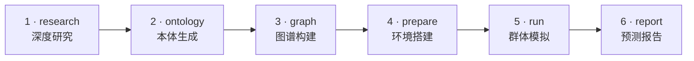

# DeepResearchForecast

> **一句话提问，自动产出预测。**
> 输入一个问题，它会自动联网研究、构建高保真的平行世界、运行多智能体群体模拟，并生成一份可交互的预测报告。

**DeepResearchForecast** 是一个自主的「一句话 → 预测」引擎。你只需键入一个问题，系统便会自动联网调研、把调研成果沉淀为一个高保真的平行数字世界、在其中运行成百上千个 LLM 人格智能体的群体模拟，最后由一个报告 Agent 综合产出一份分章节、可深度交互的预测报告。

---

## 目录

- [它能做什么](#它能做什么)
- [架构总览](#架构总览)
- [六阶段管线](#六阶段管线)
- [功能特性](#功能特性)
- [环境要求](#环境要求)
- [快速开始](#快速开始)
- [模型提供方与切换方式](#模型提供方与切换方式)
- [`.env` 配置参考](#env-配置参考)
- [API 一览](#api-一览)
- [前端统一面板](#前端统一面板)
- [关键工程要点](#关键工程要点)
- [项目结构](#项目结构)
- [故障排查](#故障排查)

---

## 它能做什么

把一个开放性问题（例如「2035 年电动车市场会怎样演化？」）交给 DeepResearchForecast，它会：

- **自动联网研究**：用一个深度研究「超级智能体」搜索全网、抓取全文、从多角度展开调研，并写出一份结构化的研究档案（dossier）。
- **构建高保真平行世界**：把研究档案抽象成实体/关系、灌入时序知识图谱（GraphRAG），并据此生成数字人格。
- **运行群体模拟**：在模拟的 Twitter + Reddit 双平台上，让数以百计、各具人格的 LLM 智能体发帖、评论、点赞，让群体动态自然涌现。
- **产出可交互预测报告**：由报告 Agent 在图谱与模拟之上做工具增强的检索，综合写出一份分章节的预测报告。

整条链路由 **一个提示词（one prompt）** 触发，全程自动衔接，无需人工在各阶段之间手动搬运中间产物。

---

## 架构总览

DeepResearchForecast 是一条统一管线，串联两大引擎，并由一张知识图谱与一个报告 Agent 黏合：

- **DeerFlow —— 深度研究引擎**
  基于 LangGraph 的深度研究「超级智能体」：联网搜索 + 全文抓取，多角度研究，写出一份结构化的研究档案。它运行在**独立的子进程与独立的 Python 虚拟环境**中，与后端的依赖隔离。

- **MiroFish / OASIS —— 群体模拟引擎**
  基于 CAMEL-AI 的 **OASIS** 多智能体社会模拟引擎：拉起成百上千个 LLM 人格，在模拟的 Twitter + Reddit 上互动。

- **Zep Cloud 时序知识图谱（GraphRAG）—— 黏合层**
  把研究档案分块灌入 Zep 的时序知识图谱，服务端抽取实体与关系，作为后续人格生成与报告检索的统一记忆底座。

- **ReportAgent —— 报告 Agent**
  一个带 `insight_forge` 工具的 ReAct 循环，对「知识图谱 + 模拟结果」做工具增强的检索，综合写出最终的分章节预测报告。

- **前端 —— 统一仪表盘（Vue 3 + Vite）**
  把提示词输入、参数、六阶段时间线，以及实时日志 / 研究档案 / 知识图谱 / 群体模拟 / 预测报告等标签页，全部收纳进一个组合式仪表盘。

```
                          ┌──────────────────────────────────────────────┐
                          │   前端统一仪表盘  (Vue 3 + Vite, :3000)       │
                          │   提示词 + 参数 · 六阶段时间线 · 多标签页      │
                          └───────────────────────┬──────────────────────┘
                                                  │  /api  (代理到 :5001)
                          ┌───────────────────────▼──────────────────────┐
                          │           后端  (Flask, :5001)                │
                          │           编排六阶段管线                       │
                          └───┬───────────────┬──────────────┬───────────┘
                              │               │              │
              ┌───────────────▼──┐   ┌────────▼────────┐  ┌──▼──────────────┐
              │  DeerFlow         │   │  Zep Cloud      │  │  OASIS           │
              │  深度研究引擎      │   │  时序知识图谱    │  │  群体模拟引擎     │
              │ (独立子进程/venv) │   │  (GraphRAG)     │  │ (Twitter+Reddit) │
              └───────────────────┘   └────────┬────────┘  └──┬──────────────┘
                                               │              │
                                          ┌────▼──────────────▼────┐
                                          │     ReportAgent         │
                                          │  ReAct + insight_forge  │
                                          │  → 分章节预测报告        │
                                          └─────────────────────────┘
```

**端口约定**

| 服务 | 地址 |
|------|------|
| 后端（Flask） | `http://localhost:5001` |
| 前端（Vue 3 + Vite） | `http://localhost:3000`（将 `/api` 代理到 `5001`） |

---

## 六阶段管线

一条「管线（pipeline）」对应一次提示词运行（one prompt run）。整条管线按以下六个阶段顺序执行：



若你的环境暂不支持 Mermaid 渲染，以下 ASCII 流程图等价：

```
 ┌──────────┐   ┌──────────┐   ┌──────────┐   ┌──────────┐   ┌──────────┐   ┌──────────┐
 │ 1 research│ → │2 ontology│ → │ 3 graph  │ → │4 prepare │ → │  5 run   │ → │ 6 report │
 │ 深度研究  │   │ 本体生成 │   │ 图谱构建 │   │ 环境搭建 │   │ 群体模拟 │   │ 预测报告 │
 └──────────┘   └──────────┘   └──────────┘   └──────────┘   └──────────┘   └──────────┘
```

| 阶段 | 名称 | 说明 |
|------|------|------|
| 1 | **research（深度研究）** | DeerFlow 在自己的子进程（独立 Python venv，见下文）中运行，联网研究，并写出一份基于文件的「交接契约」：`research_report.md`、`actors.json`、`sources.json`、`prediction_requirement.txt`、`meta.json`、`research_progress.log`。 |
| 2 | **ontology（本体生成）** | 由 LLM 依据研究档案与预测问题，推导出实体类型（entity types）与关系类型（edge types）。 |
| 3 | **graph（图谱构建）** | 将研究档案分块，灌入 Zep 时序知识图谱（GraphRAG）；实体/关系在服务端被抽取。 |
| 4 | **prepare（环境搭建）** | 为每个关键图谱实体生成一位数字人格，并由一个「环境 Agent」生成模拟配置（设定轮数/时序等参数）。 |
| 5 | **run（群体模拟）** | OASIS 运行 N 轮双平台（Twitter + Reddit）多智能体模拟；人格们发帖/评论/点赞，群体动态自然涌现。 |
| 6 | **report（预测报告）** | ReportAgent（一个带 `insight_forge` 工具的 ReAct 循环）从图谱 + 模拟结果中检索，写出一份分章节的预测报告。 |

---

## 功能特性

- **一句话 → 预测的端到端管线**：单个提示词触发六个阶段，自动衔接，无需在阶段间手动搬运中间产物。
- **两种运行模式**：`full`（完整：研究 → 图谱 → 模拟 → 报告）与 `research_only`（仅研究）。
- **可调研究深度**：`quick` / `standard` / `deep`。
- **可调模拟轮数**：轮数越多，群体动态越丰富。
- **双平台社会模拟**：在模拟的 Twitter 与 Reddit 上并行运行多智能体群体。
- **时序知识图谱（GraphRAG）**：以 Zep Cloud 为统一记忆底座，服务端抽取实体与关系。
- **工具增强的报告 Agent**：ReAct 循环 + `insight_forge` 工具，在图谱与模拟之上检索后综合写作。
- **运行时可切换模型提供方**：通过 UI 设置菜单 / `.env` / `/api/settings` 切换，对**新发起的运行**生效。
- **统一仪表盘**：提示词输入、参数、六阶段时间线、多标签页、运行历史抽屉、设置菜单一站式呈现。
- **双语界面**：English + 中文，可在设置菜单一键切换。

---

## 环境要求

| 组件 | 要求 |
|------|------|
| **Node.js** | 18+ |
| **Python** | ≥ 3.11（DeerFlow 研究引擎需要 Python ≥ 3.12，推荐 3.13） |
| **uv** | Python 包管理器（最新版） |
| **Zep Cloud API Key** | **始终必填**（免费额度即可）：<https://app.getzep.com/> |
| **LLM** | 默认使用本机 `claude` 或 `codex` CLI（无需 API Key）；仅 `openai` / `kimi` / `minimax` 需要 API Key |

---

## 快速开始

### 路径一：一键脚本（`setup.sh`，推荐）

项目根目录的 `setup.sh` 会自动完成全部准备工作，并**自动探测本机的模型提供方**：

```bash
./setup.sh
```

该脚本会：

- 检查前置条件（`node>=18`、`npm`、`uv`、`python3`），缺失时只**告警、绝不硬失败**；
- **自动探测模型提供方**：检测到本机 `claude` CLI → `LLM_PROVIDER=claude-cli`、`DEERFLOW_MODEL=claude`；检测到 `codex` CLI → `LLM_PROVIDER=codex-cli`、`DEERFLOW_MODEL=claude`；两者皆无 → 回落到默认 `claude-cli` 并告警；
- 从 `.env.example` 生成 `.env`（**永不覆盖已存在的 `.env`**），并安全地写入探测到的提供方配置；交互式终端下还会提示你粘贴 `ZEP_API_KEY`；
- 安装根目录 + 前端 + 后端依赖（后端用 `uv sync`），并在检测到同级 `deer-flow` 仓库时一并构建其研究引擎 venv。

脚本是幂等的，可安全地重复运行。完成后按提示执行 `npm run dev` 并打开 `http://localhost:3000/research`。

### 路径二：手动安装

#### 1. 配置环境变量

```bash
cp .env.example .env
# 编辑 .env，至少填入 ZEP_API_KEY；LLM 默认走本机 claude-cli，无需 API Key
```

#### 2. 安装依赖

```bash
# 一键安装根目录 + 前端 + 后端依赖（后端使用 uv sync）
npm run setup:all
```

> DeerFlow 位于**同级目录** `deer-flow`，其 langchain/langgraph 依赖与后端隔离，运行在自己的 venv（`deer-flow/backend/.venv`，Python ≥ 3.12）中。如需手动构建该 venv：
>
> ```bash
> UV_PROJECT_ENVIRONMENT=deer-flow/backend/.venv \
>   uv sync --project deer-flow/backend --python 3.13
> ```

#### 3. 启动前后端

```bash
# 同时启动后端（:5001）与前端（:3000）
npm run dev
```

打开浏览器访问：**<http://localhost:3000/research>**

---

## 模型提供方与切换方式

支持的 LLM 提供方（均可在**运行时**切换，切换对**新发起的运行**生效）：

| 提供方 | 说明 | 是否需要 API Key |
|--------|------|------------------|
| **`claude-cli`** | **默认**。使用本机 `claude` CLI / Claude Code 订阅。 | 否 |
| `codex-cli` | 使用本机 `codex` CLI / Codex 订阅。 | 否 |
| `openai` | 任意 OpenAI 兼容 API（需 `LLM_API_KEY`、`LLM_BASE_URL`、`LLM_MODEL_NAME`）。 | 是 |
| `kimi` | Kimi-for-coding（OpenAI 兼容 + coding-agent User-Agent 网关）。 | 是 |
| `minimax` | MiniMax-M3 代码计划（`api.minimaxi.com`；约 1M token 上下文、最高 512K 输出；推理模型）。 | 是 |

> **关于深度研究阶段**：DeerFlow 的深度研究阶段目前仅支持 **`claude`** 与 **`minimax`** 两种研究模型。选择其他提供方时，**研究阶段会回落到 Claude**，而模拟 / 报告阶段仍使用你所选择的提供方。

### 三种切换方式

1. **UI 设置菜单**（推荐）：在 `/research` 页面右上角的「设置」菜单中选择模型提供方（以及 EN / 中文 界面语言）。需要 Key 的提供方可在此填写 Key（及可选的 base URL / model 高级项）。
2. **`.env` 文件**：设置 `LLM_PROVIDER`（及按需设置 `LLM_API_KEY` / `LLM_BASE_URL` / `LLM_MODEL_NAME`）。
3. **`/api/settings` 接口**：`POST /api/settings/llm`，请求体为 `{provider, api_key?, base_url?, model?}`。这是运行时切换，更新进程内配置 + 环境变量（供 DeerFlow 子进程继承）并 upsert 进 `.env`；已在运行中的管线不受影响。

---

## `.env` 配置参考

`.env` 位于项目根目录。完整可选项见 `.env.example`。

```env
# ===== LLM 提供方 =====
# claude-cli | codex-cli | openai | kimi | minimax
LLM_PROVIDER=claude-cli

# ===== Zep 记忆图谱（始终必填）=====
# 免费额度即可支撑简单使用：https://app.getzep.com/
ZEP_API_KEY=...

# ===== 仅 openai / kimi / minimax 提供方需要 =====
# LLM_API_KEY=...
# LLM_BASE_URL=...
# LLM_MODEL_NAME=...

# ===== DeerFlow 深度研究（可选，全部有默认值）=====
# DEERFLOW_DIR=                 # 留空 = <项目根>/../deer-flow（同级目录）
# DEERFLOW_PYTHON=              # 留空 = 自动探测 deer-flow/backend/.venv，再退回 uv run
# DEERFLOW_MODEL=claude         # 研究模型：claude | minimax
# DEERFLOW_RESEARCH_DEPTH=standard
# DEERFLOW_RESEARCH_LANGUAGE=Chinese
# DEERFLOW_RESEARCH_TIMEOUT=2400
```

---

## API 一览

所有接口均挂载于 `/api` 前缀之下。

### 研究 / 管线（`/api/research`）

| 方法 | 路径 | 说明 |
|------|------|------|
| `POST` | `/research/run` | 触发一次运行。请求体 `{prompt, mode(full\|research_only), depth(quick\|standard\|deep), max_rounds?}` → 返回 `{pipeline_id}`。 |
| `GET` | `/research/status/<id>` | 查询管线状态。 |
| `GET` | `/research/list` | 列出历史管线。 |
| `GET` | `/research/<id>/dossier` | 获取研究档案。 |
| `GET` | `/research/<id>/progress` | 获取研究进度日志。 |

### 知识图谱（`/api/graph`）

| 方法 | 路径 | 说明 |
|------|------|------|
| `GET` | `/graph/data/<graph_id>` | 返回图谱数据 `{nodes, edges}`。 |

### 群体模拟（`/api/simulation`）

| 方法 | 路径 | 说明 |
|------|------|------|
| `GET` | `/simulation/<sim_id>/profiles/realtime?platform=` | 实时人格列表（按平台过滤）。 |
| `GET` | `/simulation/<sim_id>/posts?platform=` | 帖子流（按平台过滤）。 |
| `GET` | `/simulation/<sim_id>/agent-stats` | 智能体统计。 |

### 报告（`/api/report`）

| 方法 | 路径 | 说明 |
|------|------|------|
| `GET` | `/report/<report_id>` | 返回报告 `{markdown_content, ...}`。 |

### 设置（`/api/settings`）

| 方法 | 路径 | 说明 |
|------|------|------|
| `GET` | `/settings/llm` | 当前提供方 + 受支持提供方清单。 |
| `POST` | `/settings/llm` | 运行时切换提供方 `{provider, api_key?, base_url?, model?}`（对新发起的运行生效）。 |

---

## 前端统一面板

前端主视图为 `/research`：一个**组合式仪表盘**，把提示词输入 + 参数、一条吸顶的六阶段时间线，以及一组标签页整合在同一页面。此外还有一个运行历史抽屉与一个设置菜单（模型提供方 + EN/中文 语言切换）。界面为双语（English + 中文）。

**标签页：**

| 标签页 | 内容 |
|--------|------|
| **实时日志 · Live log** | DeerFlow 控制台的实时输出。 |
| **研究档案 · Dossier** | 渲染后的 Markdown 研究档案 + 关键行动者卡片 + 来源列表。 |
| **知识图谱 · Knowledge graph** | 基于 d3 的力导向图（force graph）。 |
| **群体模拟 · Simulation** | 人格列表 + Twitter/Reddit 信息流 + 统计。 |
| **预测报告 · Forecast** | 渲染后的预测报告。 |

---

## 关键工程要点

- **基于文件的交接契约**：DeerFlow 与后端之间通过运行在子进程之上的「基于文件的交接契约」通信，实现依赖隔离。
- **研究产物错误守卫**：一道错误守卫会防止「LLM 报错 / 降级提示」被误当作真实研究报告（快速失败，不污染下游）。
- **无工具的「综合兜底网」**：若研究 Agent 在动笔前就把步数预算耗在工具调用上，或在最终写作时遭遇提供方的结构性错误，系统会直接基于已采集（已检查点保存）的研究材料，用一次干净的单轮调用综合产出报告。
- **报告 Agent 逐章优雅降级**：单个章节的 LLM 错误只会变成该章节的占位内容，其余章节仍可产出，得到一份部分完成的报告。
- **健壮的状态与进程治理**：原子化状态写入 + 进程组清理 + 重启后的孤儿进程对账。

---

## 项目结构

```
MiroFish-0.1.2/
├── setup.sh                  # 一键安装 / 快速开始脚本（自动探测模型提供方）
├── package.json              # 根脚本：setup:all / dev / backend / frontend / build
├── .env.example              # 环境变量参考
├── backend/                  # Flask 后端（:5001）
│   ├── run.py
│   └── app/
│       ├── __init__.py       # 蓝图注册（/api/graph、/simulation、/report、/research、/settings）
│       ├── config.py         # 提供方配置与运行时切换
│       ├── api/              # research / graph / simulation / report / settings 路由
│       ├── services/         # 各阶段编排与引擎适配
│       ├── models/
│       └── utils/
├── frontend/                 # Vue 3 + Vite 前端（:3000）
│   └── src/
│       ├── views/            # ResearchView.vue 等
│       ├── components/research/  # StageTimeline / ResearchConsole / DossierViewer
│       │                         # / SimulationView / ForecastReport / SettingsMenu …
│       ├── router/
│       └── i18n.js           # 双语（EN / 中文）
└── （同级目录）deer-flow/    # DeerFlow 深度研究引擎（独立 venv，与后端依赖隔离）
```

---

## 故障排查

| 问题 | 排查方向 |
|------|----------|
| 启动即报缺少 Zep 配置 | `ZEP_API_KEY` 始终必填。检查根目录 `.env` 是否已填入真实 Key（免费额度可在 <https://app.getzep.com/> 申请）。 |
| 研究阶段（stage 1）无法运行 | DeerFlow 需作为 `MiroFish-0.1.2` 的**同级目录** `deer-flow` 存在，且已构建好自己的 venv（Python ≥ 3.12）。重新运行 `./setup.sh`，或设置 `DEERFLOW_DIR` 指向其位置。 |
| 选了 `openai`/`kimi`/`minimax` 却报鉴权失败 | 这些提供方需要 `LLM_API_KEY`（以及按需的 `LLM_BASE_URL` / `LLM_MODEL_NAME`）。可在 `.env`、UI 设置菜单或 `POST /api/settings/llm` 中配置。 |
| 切换了模型提供方但当前运行没变化 | 提供方切换只对**新发起的运行**生效；已在运行中的管线沿用其启动时读取的配置。请重新发起一次运行。 |
| 选了非 Claude/MiniMax 提供方，研究阶段仍走 Claude | 这是预期行为：DeerFlow 深度研究阶段目前仅支持 `claude` 与 `minimax`，其他提供方在研究阶段回落到 Claude，模拟/报告阶段仍用所选提供方。 |
| 后端起来了但前端 `/api` 请求 404 | 确认后端在 `:5001` 运行，且前端开发服务器（`:3000`）已将 `/api` 代理至 `5001`；用 `npm run dev` 同时启动两端最为稳妥。 |
| `uv` / `node` 缺失或版本过旧 | 满足环境要求：Node.js 18+、Python ≥ 3.11（DeerFlow 需 ≥ 3.12，推荐 3.13）、安装最新版 `uv`。`./setup.sh` 会就缺失项给出告警与安装提示。 |
```