# DeepAgentForecast

[English](README.md) | **简体中文**

> **一句话提问，自动产出预测。**
> 输入一个问题，它会自动联网研究、构建高保真的平行世界、运行多智能体群体模拟，并生成一份可交互的预测报告。

**DeepAgentForecast** 是一个自主的「一句话 → 预测」引擎。你只需键入一个问题，系统便会自动联网调研、把调研成果沉淀为一个高保真的平行数字世界、在其中运行成百上千个 LLM 人格智能体的群体模拟，最后由一个报告 Agent 综合产出一份分章节、可深度交互的预测报告。

---

## 快速上手

```bash
git clone https://github.com/linroger/DeepAgentForecast.git
cd DeepAgentForecast
./setup.sh        # 交互式：选择你的 LLM 提供方并一键安装全部依赖
npm run doctor    # 数秒内体检环境是否就绪
npm run dev       # 后端 :5001 + 前端 :3000
```

随后打开 **<http://localhost:3000/research>**，输入问题，点击 **运行研究 + 模拟 + 预测**。

**无需自建图数据库。** 时序知识图谱在**本地**运行（内嵌 Graphiti + FalkorDB —— 无需账号、无需 Docker、无需 API Key）。你唯一需要的凭据是**一个 LLM**：要么使用本地 `claude` / `codex` CLI 登录（零 Key），要么为某个在线提供方（`openai`、`kimi`、`minimax`、`deepseek`、`qwen`、`glm`）填入 API Key。`setup.sh` 会引导你选择并对 Key 做实时校验。

完整步骤见 [环境要求](#环境要求) 与 [快速开始](#快速开始)，每个配置项见 [`.env` 配置参考](#env-配置参考)。

---

## 演示

🔗 **[在线演示站](https://linroger.github.io/DeepAgentForecast/)**（中英双语）—— 走完真实端到端运行的**每一个阶段**：深度研究控制台日志、含行动者与来源的研究档案、生成的本体、可交互知识图谱、模拟的 Twitter/Reddit 论坛，以及最终预测报告（2026–2031 现代重商主义 × AI、2027–2028 存储半导体、2030 全球云计算、2030 美国 AI 竞赛、2035 全球电动汽车产业、俄乌战争终局、2030 全球半导体产业、2030 全球存储芯片、2035 中国储能与电池市场、2026 美伊战争终局）。

一句提示词 —— *“Who wins the US AI race by 2030?”*（谁会在 2030 年赢得美国 AI 竞赛？）—— 从提问到可交互预测的全过程（研究 → 知识图谱 → 40 轮群体模拟 → 报告）：

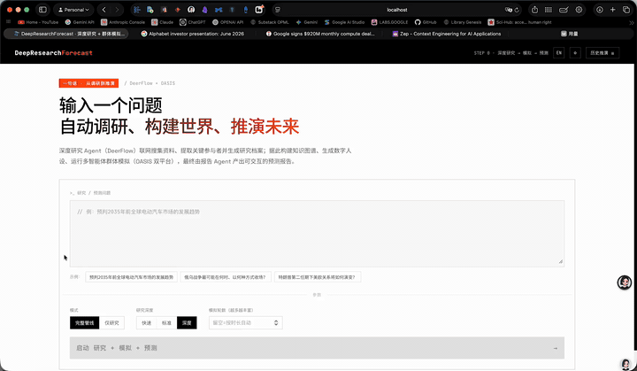

▶ **[观看完整演示视频（47 秒，MP4）](docs/media/demo.mp4)**

### 最新运行 —— 碰撞的十年：现代重商主义 × AI（2026–2031）

最新的特色运行完整回应了一份桥水（Bridgewater）风格的挑战简报：以深度模式对「现代重商主义与 AI 的碰撞」开展英文调研，产出 14 位核心行动者的角色档案（美国行政当局、中国、欧盟、英伟达、台积电、超大规模云厂商、美联储……）及其带类型、带极性的关系网，运行 **80 人格双平台模拟**，最终写出三部分结构的预测简报 —— 含 **13 条二元预测**（每条附概率与客观可裁决的判定标准）与 **4 个带概率权重的情景**。

🔗 **[在线浏览这次运行](https://linroger.github.io/DeepAgentForecast/demo.html?run=collision-decade-2031)**

### 展示运行 —— 2030 年前全球半导体产业

早前的一次展示运行：深度模式调研覆盖半导体全产业链（存储 / HBM / 逻辑 / 代工，17 家具名企业），构建 285 节点知识图谱，**115 个数字人格**进行 **40 轮双平台模拟**，最终产出分章节预测报告。

▶ **[观看半导体运行全程视频（42 秒，4 倍速，MP4）](docs/media/demo-semiconductors.mp4)** · 🔗 **[在线浏览这次运行](https://linroger.github.io/DeepAgentForecast/demo.html?run=semiconductors-2030)**

| | |
|---|---|
| 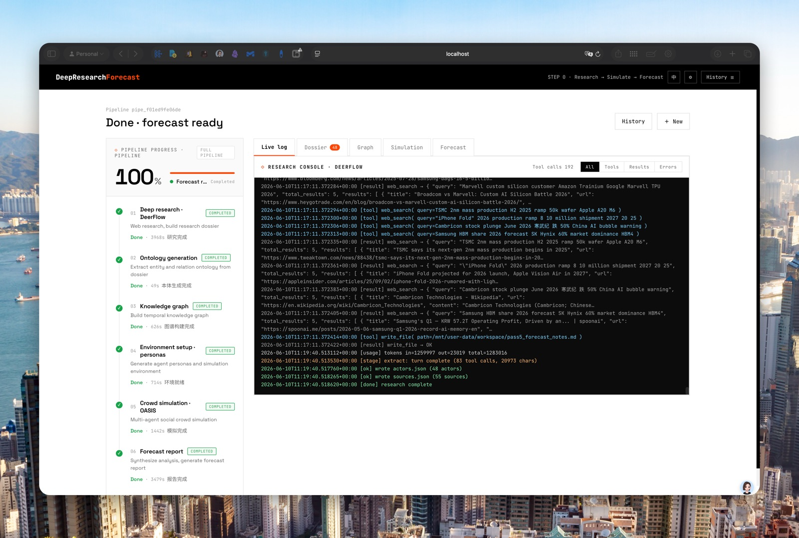 <br/>*阶段 1 —— 深度研究控制台：多轮研究协议中的每一次搜索、抓取与写作* | 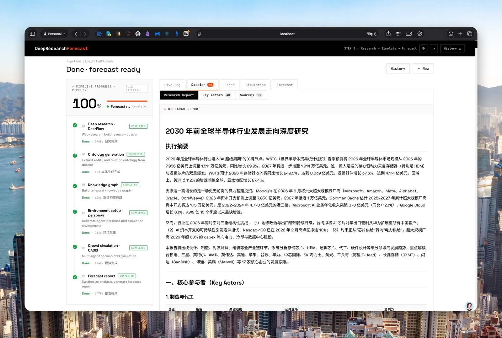 <br/>*完成的研究档案 —— 对 2030 年半导体行业的循证深度研究* |
| 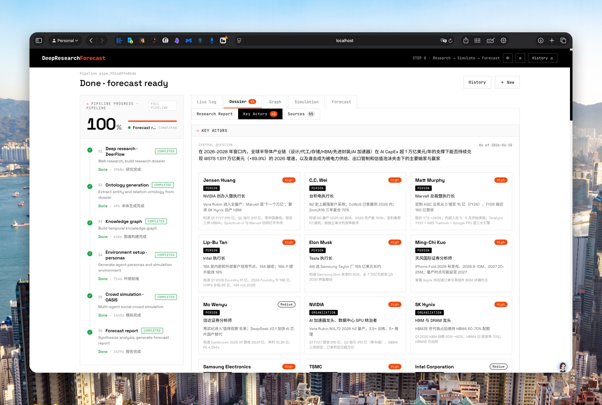 <br/>*调研提取的核心行动者 —— CEO、分析师与企业，立场与影响力均来自调研* | 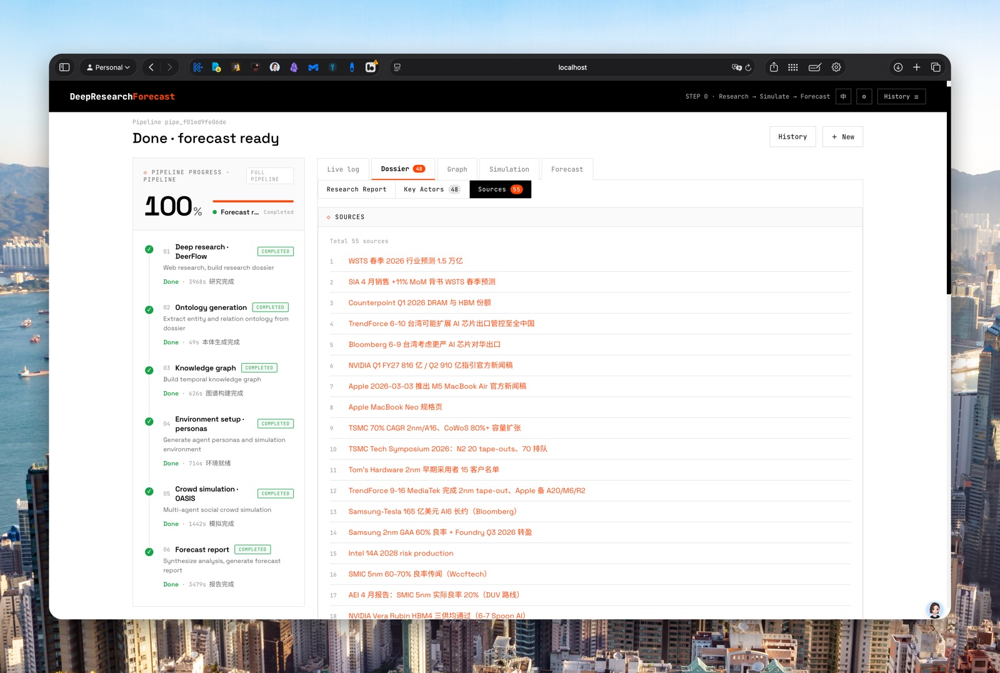 <br/>*支撑档案论断的网络来源引用* |
| 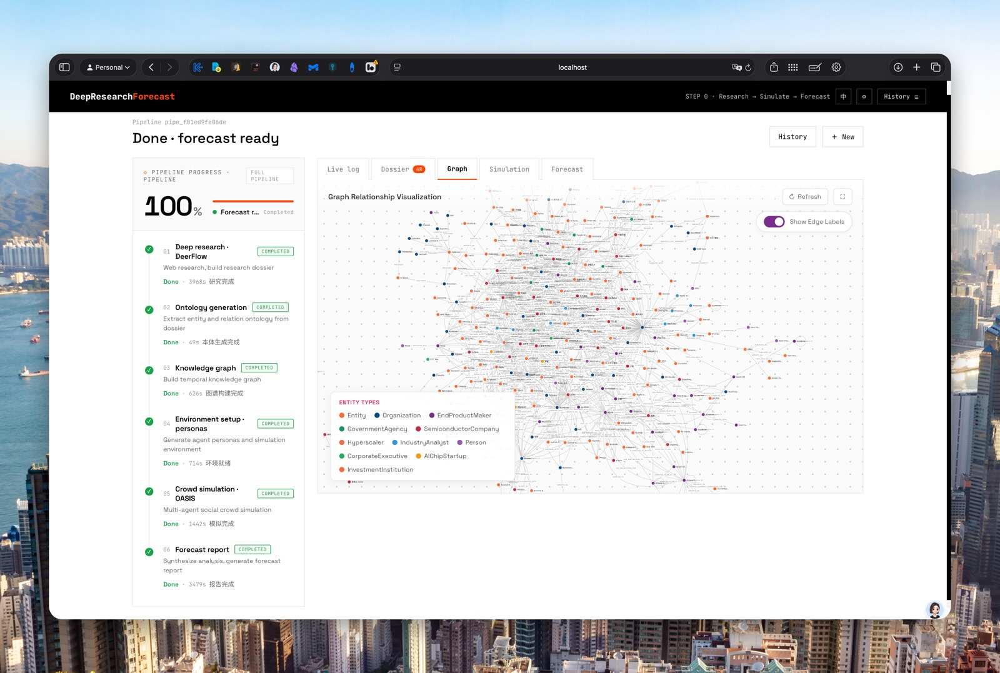 <br/>*285 实体知识图谱与 10 个自动生成的实体类型* | 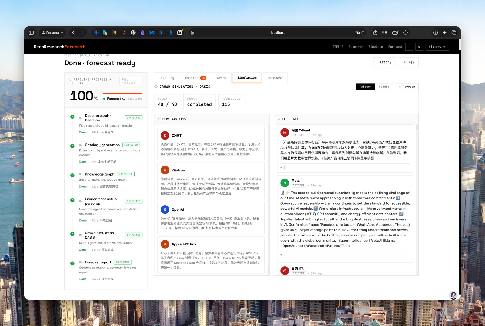 <br/>*模拟完成 —— 115 个人格、40/40 轮，完整 Twitter 信息流* |
| 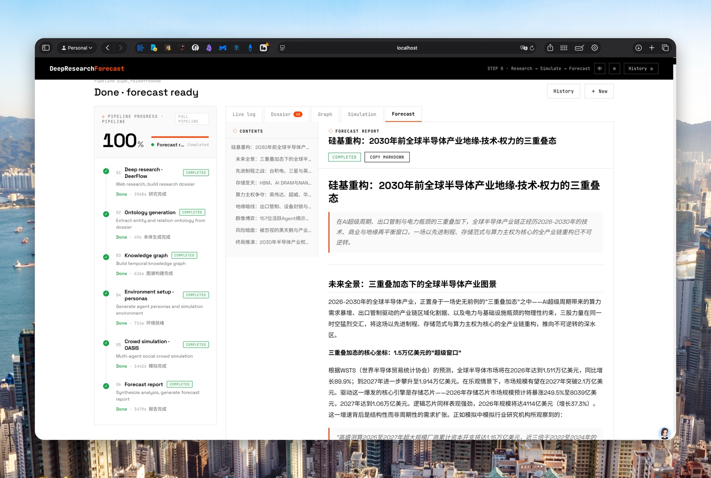 <br/>*带可导航目录的最终预测报告* | |

### 截图

| | |
|---|---|
| 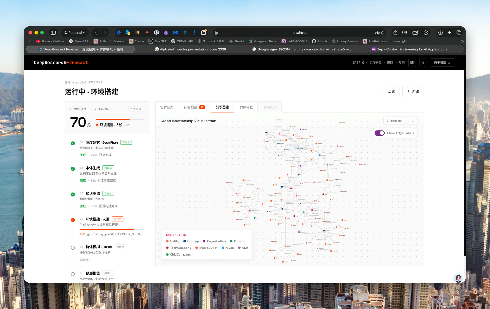 <br/>*阶段 4 —— 基于研究档案构建的时序知识图谱* | 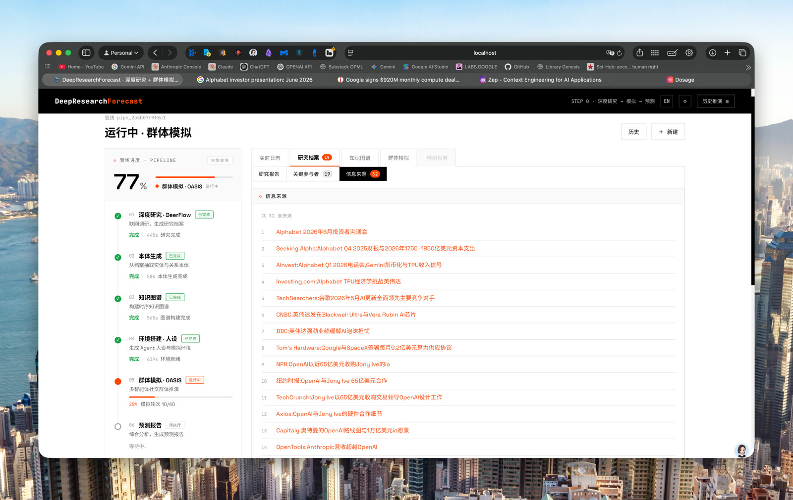 <br/>*研究档案标签页 —— 每条论断都有网络来源引用支撑* |
| 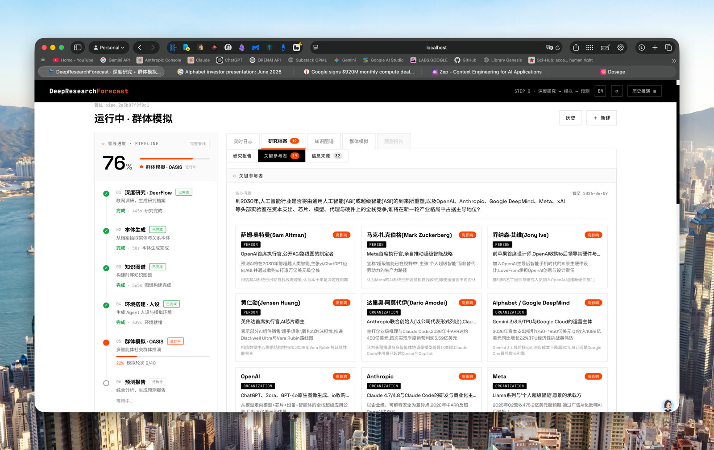 <br/>*为每位真实世界行动者生成的数字人格（立场与影响力均来自调研）* | 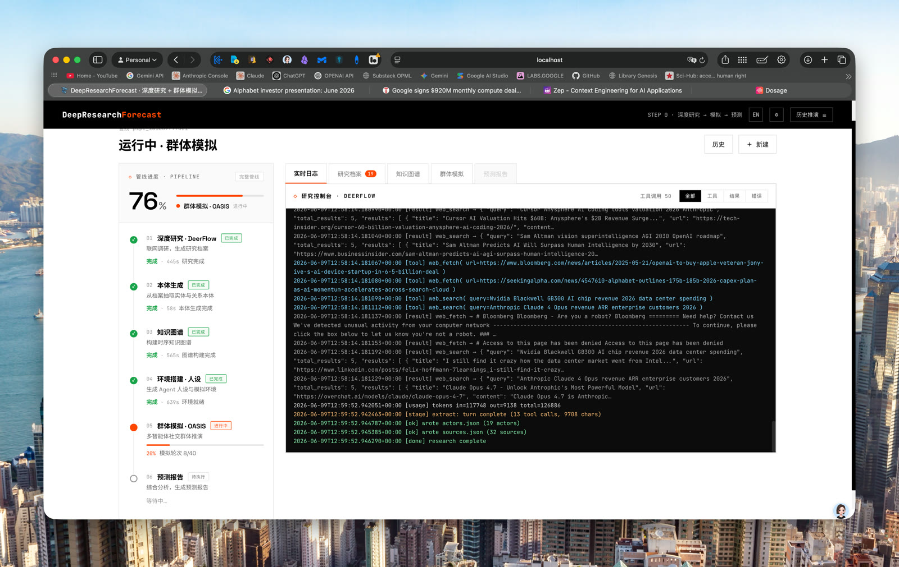 <br/>*实时模拟控制台，流式呈现智能体的每个动作* |
| 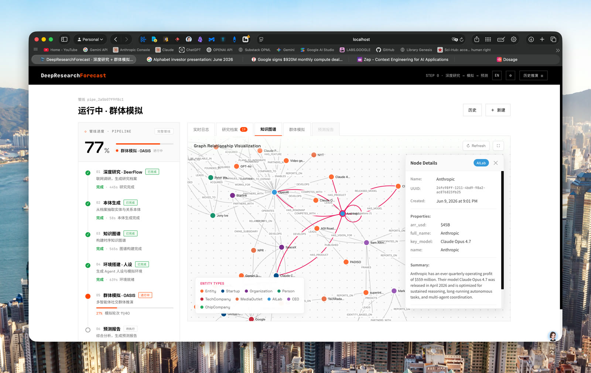 <br/>*模拟进行中查看某个图谱实体的详情* | 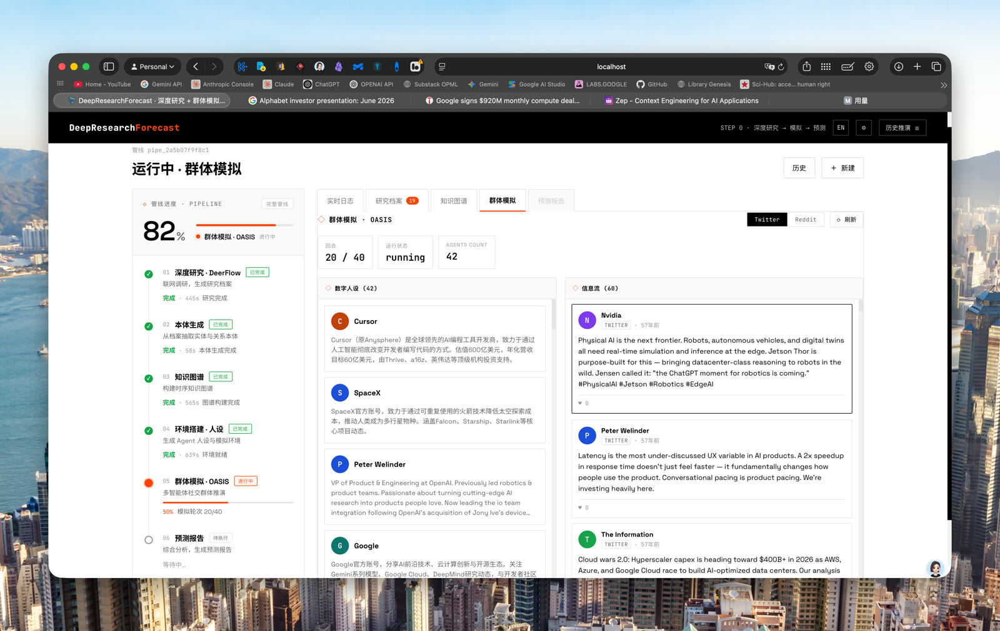 <br/>*第 20/40 轮时的模拟 Twitter/Reddit 信息流* |
| 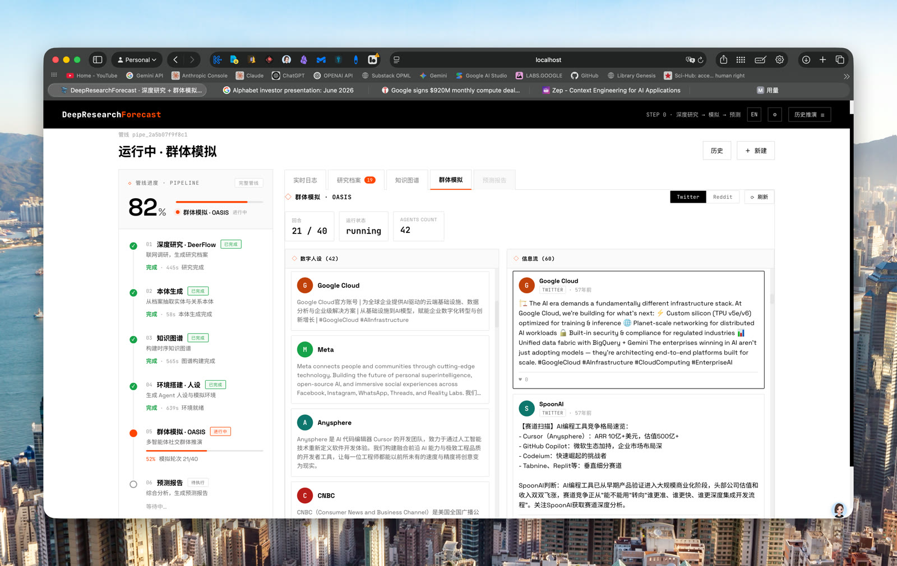 <br/>*智能体人格之间自然涌现的讨论串* | 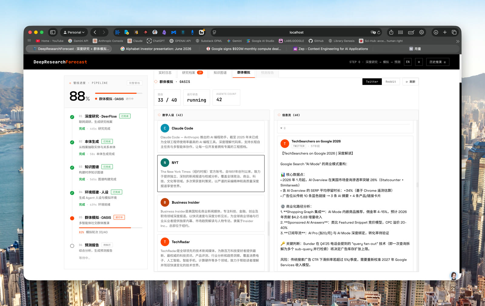 <br/>*第 33/40 轮的帖子与智能体详情面板（管线进度 88%）* |

---

## 目录

- [快速上手](#快速上手)
- [演示](#演示)
- [它能做什么](#它能做什么)
- [架构总览](#架构总览)
- [六阶段管线](#六阶段管线)
- [功能特性](#功能特性)
- [环境要求](#环境要求)
- [快速开始](#快速开始)
- [模型提供方与切换方式](#模型提供方与切换方式)
- [`.env` 配置参考](#env-配置参考)
- [API 一览](#api-一览)
- [前端统一面板](#前端统一面板)
- [关键工程要点](#关键工程要点)
- [架构与最新增强](#架构与最新增强)
- [项目结构](#项目结构)
- [故障排查](#故障排查)
- [致谢](#致谢)
- [许可证](#许可证)

---

## 它能做什么

把一个开放性问题（例如「2035 年电动车市场会怎样演化？」）交给 DeepAgentForecast，它会：

- **自动联网研究（双轨并行）**：两个研究工作流**同时运行** —— 一路「深度研究」写出循证研究档案，一路「角色本体研究」深挖真正的关键行动者：其角色、价值观、信念、动机、资源，以及彼此之间有向、带类型、**带极性（盟友≠对手≠交易方）**的关系；同时把仅被引用的记者/媒体/来源降级为上下文，而非行动者。
- **构建高保真平行世界**：把研究成果蒸馏进一张带**分层、行为画像丰富的本体**的时序知识图谱（GraphRAG），并为每位**关键行动者**（决策者与利益相关方）生成一位数字人格 —— 按显著度（salience）而非单纯连接度排序。
- **运行群体模拟**：在模拟的 Twitter + Reddit 双平台上，让数以百计、各具人格的 LLM 智能体发帖、评论、点赞，让群体动态自然涌现。
- **产出可交互预测报告**：由报告 Agent 在图谱与模拟之上做工具增强的检索，综合写出一份分章节的预测报告。

整条链路由 **一个提示词（one prompt）** 触发，全程自动衔接，无需人工在各阶段之间手动搬运中间产物。

---

## 架构总览

DeepAgentForecast 是一条统一管线，串联两大引擎，并由一张知识图谱与一个报告 Agent 黏合：

- **DeerFlow 2.0 —— 深度研究引擎（双轨）**
  一个基于 LangGraph 的超级智能体框架：联网搜索 + 全文抓取，多角度研究。它运行在**自己的子进程与独立的 Python 虚拟环境**中，与后端依赖隔离，并**同时执行两个研究技能** —— `deep-research`（广覆盖的循证档案）与 `actor-ontology-research`（以行动者为中心、可直接喂给本体生成的角色与关系档案）。

- **MiroFish / OASIS —— 群体模拟引擎**
  基于 CAMEL-AI 的 **OASIS** 多智能体社会模拟引擎：拉起成百上千个 LLM 人格，在模拟的 Twitter + Reddit 上互动。

- **Graphiti 时序知识图谱（GraphRAG）—— 黏合层**
  用开源 **Graphiti**（Zep Cloud 的开源底座）在**嵌入式 FalkorDB** 上本地运行：把研究档案分块灌入时序知识图谱，由你配置的 `LLM_PROVIDER` 在本地抽取实体与关系、由本地 sentence-transformers 多语言模型计算向量嵌入，作为后续人格生成与报告检索的统一记忆底座。无需 Docker、无需服务进程、无需账号、无需 API Key。

- **ReportAgent —— 报告 Agent**
  一个带 `insight_forge` 工具的 ReAct 循环，对「知识图谱 + 模拟结果」做工具增强的检索，综合写出最终的分章节预测报告。

- **前端 —— 统一仪表盘（Vue 3 + Vite）**
  把提示词输入、参数、六阶段时间线，以及实时日志 / 研究档案 / 知识图谱 / 群体模拟 / 预测报告等标签页，全部收纳进一个组合式仪表盘。

```
                          ┌──────────────────────────────────────────────┐
                          │   前端统一仪表盘  (Vue 3 + Vite, :3000)       │
                          │   提示词 + 参数 · 六阶段时间线 · 多标签页      │
                          └───────────────────────┬──────────────────────┘
                                                  │  /api  (代理到 :5001)
                          ┌───────────────────────▼──────────────────────┐
                          │           后端  (Flask, :5001)                │
                          │           编排六阶段管线                       │
                          └───┬───────────────┬──────────────┬───────────┘
                              │               │              │
              ┌───────────────▼──┐   ┌────────▼────────┐  ┌──▼──────────────┐
              │  DeerFlow         │   │  Graphiti       │  │  OASIS           │
              │  深度研究引擎      │   │  时序知识图谱    │  │  群体模拟引擎     │
              │ (独立子进程/venv) │   │ (本地/GraphRAG) │  │ (Twitter+Reddit) │
              └───────────────────┘   └────────┬────────┘  └──┬──────────────┘
                                               │              │
                                          ┌────▼──────────────▼────┐
                                          │     ReportAgent         │
                                          │  ReAct + insight_forge  │
                                          │  → 分章节预测报告        │
                                          └─────────────────────────┘
```

**端口约定**

| 服务 | 地址 |
|------|------|
| 后端（Flask） | `http://localhost:5001` |
| 前端（Vue 3 + Vite） | `http://localhost:3000`（将 `/api` 代理到 `5001`） |

---

## 六阶段管线

一条「管线（pipeline）」对应一次提示词运行（one prompt run）。整条管线按以下六个阶段顺序执行：

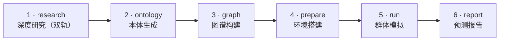

若你的环境暂不支持 Mermaid 渲染，以下 ASCII 流程图等价：

```
 ┌──────────┐   ┌──────────┐   ┌──────────┐   ┌──────────┐   ┌──────────┐   ┌──────────┐
 │ 1 research│ → │2 ontology│ → │ 3 graph  │ → │4 prepare │ → │  5 run   │ → │ 6 report │
 │ 深度研究  │   │ 本体生成 │   │ 图谱构建 │   │ 环境搭建 │   │ 群体模拟 │   │ 预测报告 │
 └──────────┘   └──────────┘   └──────────┘   └──────────┘   └──────────┘   └──────────┘
```

| 阶段 | 名称 | 说明 |
|------|------|------|
| 1 | **research（深度研究 · 双轨）** | DeerFlow 在自己的子进程（独立 Python venv）中**同时运行两个研究工作流**，写出基于文件的「交接契约」：`research_report.md`（Track A 广覆盖深度研究档案，用于增强图谱/本体/局势上下文）、`actor_dossier.md`（Track B 角色本体档案：分层排序的行动者阵容 + 价值观/信念/动机/资源 + 有向带极性的关系网）、`actors.json`（从两者抽取的结构化阵容与关系，**以角色档案为主、研究报告为辅**）、`sources.json`、`prediction_requirement.txt`、`timeline.json`、`meta.json`、`research_progress.log`。 |
| 2 | **ontology（本体生成）** | 由 LLM 依据两份档案与预测问题，推导实体类型与关系类型，并为每个实体打上**原型（archetype）+ 模拟层级（tier）**标签（让记者/媒体/抽象概念成为图谱*上下文*而非行动者），为每条关系打上**族（family）+ 极性（valence）**（盟友、对手、供应商、投资方互不混淆）。 |
| 3 | **graph（图谱构建）** | 将**两份档案**分块灌入本地运行的 Graphiti 时序知识图谱（GraphRAG，嵌入式 FalkorDB）；实体/关系由你配置的本地 LLM 抽取，向量嵌入由本地 sentence-transformers 多语言模型计算。 |
| 4 | **prepare（环境搭建）** | **仅为关键行动者**（第 1 层决策者 + 第 2 层利益相关方，次要实体留作图谱上下文）生成数字人格，按**显著度（salience）**而非单纯邻边数排序；每位人格携带其**行为画像（行为 DNA：价值观/信念/动机/资源）**与调研得来的盟友/对手/供应商/投资方关系网。再由一个「环境 Agent」生成模拟配置（轮数/时序）。 |
| 5 | **run（群体模拟）** | OASIS 运行 N 轮双平台（Twitter + Reddit）多智能体模拟；人格们发帖/评论/点赞，群体动态自然涌现。 |
| 6 | **report（预测报告）** | ReportAgent（一个带 `insight_forge` 工具的 ReAct 循环）从图谱 + 模拟结果中检索，写出一份分章节的预测报告。 |

---

## 功能特性

- **一句话 → 完整预测**：单个问题端到端驱动「研究 → 模拟 → 报告」整条管线，无需在阶段间手动搬运中间产物。
- **自主深度研究**：多角度联网搜索 + 全文抓取，沉淀为带行动者与来源的结构化研究档案。选择 `deep` 深度时，DeerFlow 会执行分阶段多轮协议：来源版图、原始证据、行动者/激励、矛盾/风险、预测输入，再进入最终长文综合。
- **研究档案驱动的人设**：结构化行动者档案（`actors.json`：每位真实世界行动者的角色、立场、影响力、记忆）为本体生成、**智能体人格、每个智能体的立场/影响力配置以及模拟的初始帖子**提供种子 —— 智能体从调研得来的事实出发，而非 LLM 的凭空猜测。
- **时序知识图谱（GraphRAG）**：研究成果灌入本地运行的 Graphiti（嵌入式 FalkorDB），由本地 LLM 抽取实体与关系、本地嵌入模型建索引，可随时检索查询 —— 全程本地、无需云端账号或 API Key。
- **多智能体群体模拟**：数以百计的 LLM 人格在模拟的 Twitter + Reddit 上互动；涌现的群体动态为预测提供输入。
- **工具增强的预测综合**：ReAct ReportAgent 在动笔之前同时检索知识图谱与模拟结果。
- **统一仪表盘**：实时日志、研究档案、知识图谱、模拟信息流与预测报告，全部收纳在一个带吸顶六阶段时间线的视图里。
- **运行时可切换 LLM 提供方**：在设置菜单中即可在本机 CLI 与托管 API 之间切换，对**新发起的运行**生效。内置**「测试连接」**按钮，一键验证 API Key（或本机 CLI）可用后再应用。
- **可取消的运行**：运行中的管线可在任意阶段从 UI 中止 —— 研究子进程组被杀掉、OASIS 模拟被停止，被取消的运行会立即停止消耗配额。
- **可恢复的运行**：失败或被取消的管线可以原地恢复（**继续**按钮，或 `POST /api/research/<id>/resume`）。已完成的阶段会被复用 —— 已写出的研究档案、本体、知识图谱或已完成的模拟不会被重复付费；管线从出错的阶段重新开始。
- **秒级预检（fail-fast）**：`npm run doctor` 几秒内检查完整个环境；`POST /research/run` 会在产生任何花费之前校验 Key / 凭据 / DeerFlow 检出。
- **双语界面**：English + 中文，可在设置菜单一键切换。
- **运行历史**：抽屉中列出历史管线运行，便于快速回看。
- **为韧性而设计**：错误守卫、无工具的综合兜底网、随深度自适应且可抢救报告的研究看门狗、逐章优雅降级、原子化状态写入，以及跨重启的孤儿对账（包括滞留的研究进程）。

---

## 环境要求

| 组件 | 要求 |
|------|------|
| **Node.js ≥ 20.19** | 前端（Vue 3 + Vite 7）需要。 |
| **Python 3.11 – 3.12** | 后端需要 —— `camel-ai`/`camel-oasis` 模拟技术栈仅支持 ≤ 3.12，因此后端 venv **固定使用 3.12**（`backend/.python-version` + `uv sync --python 3.12`）。若系统默认解释器是 3.13/3.14，会直接导致安装失败。 |
| **Python 3.12** | DeerFlow 深度研究引擎运行在**自己独立的 venv** 中（DeerFlow 2.0 固定使用 Python 3.12）。 |
| **uv** | 两套 venv 共用的 Python 包管理器。安装：`curl -LsSf https://astral.sh/uv/install.sh \| sh` |
| **git** | 仅在可选的上游克隆回退路径下需要 —— `setup.sh` 默认从仓库内随附的 `deer-flow-2.0.0/` 源码播种引擎；仅当该目录不存在时才回退到用 git 浅克隆上游。 |
| **知识图谱** | 无需任何账号或 API Key。时序知识图谱由开源 **Graphiti** 在**嵌入式 FalkorDB**（`falkordblite`）上本地运行 —— 无需 Docker、无需服务进程。首次建图会自动下载一次本地嵌入模型（约 470MB）并缓存。 |
| **LLM** | 默认使用本机 `claude` 或 `codex` CLI（无需 API Key）；`openai` / `kimi` / `minimax` / `deepseek` / `qwen` / `glm` 等 OpenAI 兼容 API 提供方需要 `LLM_API_KEY`。建图阶段复用同一个 `LLM_PROVIDER`，连免 Key 的 CLI 提供方也能用。 |

---

## 快速开始

三步走：**安装 → 配置 → 运行**。DeerFlow 位于仓库内的 `deer-flow/` 目录（由 `setup.sh` 从随附的 2.0 源码播种或固定克隆装配而成、已被 gitignore），使其 LangChain/LangGraph 依赖与后端完全隔离；它运行在自己的 venv（`deer-flow/backend/.venv`）里。

### 1. 安装

**路径 A —— `setup.sh`（推荐）**。一个脚本自动完成全部安装：

```bash
./setup.sh
```

它会检查前置条件，然后进入**交互式提供方选择器**：在本机 `claude` / `codex` CLI（零配置、无需 API Key——检测到的 CLI 会被预选为默认项）与六个托管 API 提供方（OpenAI 兼容 / Kimi / MiniMax / DeepSeek / Qwen / GLM）之间选择。选择 API 提供方时会提示你输入 **API Key**（静默输入、绝不回显），并用一次 1-token 补全**实时验证该 Key**——写错的 Key 几秒内即被发现，而不是在研究跑了 40 分钟后才暴露。随后它会从 `.env.example` 生成 `.env`、安装根目录 + 前端 npm 依赖、构建后端 venv（**固定使用 Python 3.12**，其中包含本地知识图谱依赖 `graphiti-core` / `falkordblite` / sentence-transformers），然后**装配 DeerFlow**：**优先从随附的 2.0 源码 `deer-flow-2.0.0/` 播种 `deer-flow/`**（若该目录不存在则回退到从 <https://github.com/bytedance/deer-flow> 固定到一个已知可用提交的浅克隆），并**裁剪到运行所需的最小集合**（`backend/`、`skills/`、`config.yaml`——上游的 Web 前端、文档、docker 与 CI 在本工作流中均用不到），再应用 `deerflow_bridge/` 中的**桥接覆盖层**（`deerflow_research.py` 研究驱动、`patches/models/*.py` 提供方补丁与中间件补丁、经过强化的来源分级 deep-research 技能、`config.yaml`），并在 **Python 3.12** 上构建 DeerFlow 的隔离 venv。脚本幂等，可安全地重复运行。

如需覆盖默认值，可通过环境变量：`DEERFLOW_DIR`（位置）、`DEERFLOW_REPO`（克隆地址）、`DEERFLOW_REF`（固定提交；设为 `=main` 可跟踪 HEAD）、`SETUP_NONINTERACTIVE=1`（跳过选择器、走自动探测——CI / 管道运行会自动如此）。它们由 `setup.sh` 从 **shell 环境**读取（不是 `.env` 配置项），例如 `DEERFLOW_REF=main ./setup.sh`。重复运行是幂等的：选择器默认选中你当前 `.env` 里的提供方，直接回车绝不会覆盖既有配置。

**路径 B —— 手动安装**（与上面等价的手动步骤）：

```bash
# 1. 安装 Node 依赖（根目录 + 前端）与后端 venv（固定 Python 3.12）
npm run setup:all

# 2. 从随附的 DeerFlow 2.0 源码播种研究引擎到仓库内（已被 gitignore）
cp -R deer-flow-2.0.0 deer-flow
# 回退方式（仅当随附目录不存在时，需要 git）：
#   git clone --depth 1 https://github.com/bytedance/deer-flow deer-flow

# 3. 应用 deerflow_bridge/ 桥接覆盖层
cp deerflow_bridge/deerflow_research.py deer-flow/deerflow_research.py
cp deerflow_bridge/patches/models/*.py  deer-flow/backend/packages/harness/deerflow/models/
cp deerflow_bridge/patches/middlewares/*.py deer-flow/backend/packages/harness/deerflow/agents/middlewares/
cp deerflow_bridge/skills/deep-research/SKILL.md deer-flow/skills/public/deep-research/SKILL.md
cp deerflow_bridge/config.yaml          deer-flow/config.yaml      # 仅当其不存在时

# 4. 构建 DeerFlow 的隔离研究 venv（DeerFlow 2.0 固定 Python 3.12）
UV_PROJECT_ENVIRONMENT=deer-flow/backend/.venv \
  uv sync --project deer-flow/backend --python 3.12
```

### 2. 配置

默认配置开箱即用 —— 知识图谱在本地运行，无需任何 Key。仅当选择了托管提供方时，才需在 `.env` 中填入相应的 API Key —— 详见下文的 [`.env` 配置参考](#env-配置参考)。如果使用 `claude` CLI，确保已登录即可（运行一次 `claude`）。

然后做一次体检，确认一切就绪 —— **doctor 几秒钟就能查完整个环境**（工具版本、两套 venv、DeerFlow 覆盖层、所选提供方的凭据）：

```bash
npm run doctor
```

逐项修复它报告的 ✗ 项并重新运行，直到输出 `All checks passed`。

### 3. 运行

```bash
npm run dev        # 后端 :5001 + 前端 :3000
```

打开 **<http://localhost:3000/research>**，输入你的问题，点击 **Run research + simulate + forecast**。后端会在发起运行时对配置做预检（preflight）—— 配置有误会在几秒内被报告，而不是等一场 40 分钟的研究跑完才发现。

---

## 模型提供方与切换方式

报告 + 模拟阶段共支持 8 个 `LLM_PROVIDER` 取值（均可在**运行时**切换，切换对**新发起的运行**生效）：

| 提供方 | 说明 | 是否需要 API Key |
|--------|------|------------------|
| **`claude-cli`** | **默认**。使用本机 `claude` CLI / Claude Code 订阅。 | 否 |
| `codex-cli` | 使用本机 `codex` CLI / Codex（ChatGPT）订阅。 | 否 |
| `openai` | 任意 OpenAI 兼容 API（需 `LLM_API_KEY`、`LLM_BASE_URL`、`LLM_MODEL_NAME`）。 | 是 |
| `kimi` | Kimi-for-coding（`api.kimi.com/coding`；OpenAI 兼容 + coding-agent User-Agent 网关）。 | 是 |
| `minimax` | MiniMax-M3（`https://api.minimaxi.com/v1`；推理模型）。 | 是 |
| `deepseek` | DeepSeek（`https://api.deepseek.com/v1`，默认模型 `deepseek-chat`；**研究阶段**改用旗舰 `deepseek-v4-pro`，百万 token 上下文）。 | 是 |
| `qwen` | Qwen（`https://dashscope-intl.aliyuncs.com/compatible-mode/v1`，默认模型 `qwen-plus`；**研究阶段**改用旗舰 `qwen3.7-max`，百万 token 上下文）。 | 是 |
| `glm` | GLM-4.6（`https://api.z.ai/api/paas/v4`，模型 `glm-4.6`）。 | 是 |

> `openai` / `kimi` / `minimax` / `deepseek` / `qwen` / `glm` 都属于「OpenAI 兼容 API」提供方，均需 `LLM_API_KEY`；其中 `kimi` / `minimax` / `deepseek` / `qwen` / `glm` 已内置合理的默认 `LLM_BASE_URL` / `LLM_MODEL_NAME`，因此通常只需填入 `LLM_API_KEY`。

深度研究阶段由 `DEERFLOW_MODEL` **单独**驱动（7 个取值）：

| 研究模型 | 说明 |
|---|---|
| **`claude`**（默认） | 使用 Claude Code OAuth —— 无需 API Key。`openai` 提供方映射到此配置。 |
| **`codex`** | Codex（ChatGPT）OAuth —— 无需 API Key。本机只装了 `codex` CLI 时自动选用。 |
| **`kimi`** | Kimi-for-coding。需要 `KIMI_API_KEY`。在设置中切换到 kimi 提供方时自动同步。 |
| **`minimax`** | 需要 `MINIMAX_API_KEY`。 |
| **`deepseek`** | 需要 `DEEPSEEK_API_KEY`。 |
| **`qwen`** | 需要 `DASHSCOPE_API_KEY`。 |
| **`glm`** | 需要 `ZHIPUAI_API_KEY`。 |

> **关于深度研究阶段**：研究阶段通过 `DEERFLOW_MODEL` 独立于 `LLM_PROVIDER` 进行配置。它按提供方区分的 Key 会镜像给 deer-flow（如 `KIMI_API_KEY`、`MINIMAX_API_KEY`、`DEEPSEEK_API_KEY`、`DASHSCOPE_API_KEY`、`ZHIPUAI_API_KEY`），且仅当 `DEERFLOW_MODEL` 实际运行在该提供方上时才需要。默认的 `claude` 使用 Claude Code OAuth（无需 API Key）。`POST /api/research/run` 与 `deerflow_research.py` 都会对所选模型的凭据做预检，缺失时快速失败并给出可操作的报错。

### 三种切换方式

1. **UI 设置菜单**（推荐）：在 `/research` 页面右上角的「设置」菜单中选择模型提供方（以及 EN / 中文 界面语言）。需要 Key 的提供方可在此填写 Key（及可选的 base URL / model 高级项）。**「测试连接」**按钮可在应用前先验证配置：API 提供方会向其端点发起一次真实的 1-token 补全（精确报出失败原因——401 Key 无效、404 端点/模型名错误、429 配额耗尽），CLI 提供方则检查 PATH 与版本。测试不会持久化任何配置。
2. **`.env` 文件**：设置 `LLM_PROVIDER`（及按需设置 `LLM_API_KEY` / `LLM_BASE_URL` / `LLM_MODEL_NAME`）。
3. **`/api/settings` 接口**：`POST /api/settings/llm`，请求体为 `{provider, api_key?, base_url?, model?}`。这是运行时切换，更新进程内配置 + 环境变量（供 DeerFlow 子进程继承）并 upsert 进 `.env`；已在运行中的管线不受影响。

---

## `.env` 配置参考

在项目根目录创建 `.env` 文件（`setup.sh` 会从 `.env.example` 自动生成）。

```bash
LLM_PROVIDER=claude-cli      # claude-cli | codex-cli | openai | kimi | minimax | deepseek | qwen | glm

# 仅 openai / kimi / minimax / deepseek / qwen / glm 需要：
LLM_API_KEY=...
LLM_BASE_URL=...             # kimi/minimax/deepseek/qwen/glm 已内置合理默认值
LLM_MODEL_NAME=...           # kimi/minimax/deepseek/qwen/glm 已内置合理默认值

# 本地知识图谱 / Graphiti（可选 —— 全部有合理默认值，开箱即用、无需任何 Key）：
GRAPH_BACKEND=auto               # auto（→ 嵌入式 FalkorDB）| falkordblite | kuzu | falkordb
GRAPHITI_DATA_DIR=...            # 本地图数据持久化目录（默认 backend/uploads/graphiti_db）
GRAPHITI_EMBED_MODEL=...         # 本地嵌入模型（默认 paraphrase-multilingual-MiniLM-L12-v2，384 维，中英文）
GRAPHITI_EMBED_DIM=...           # 嵌入维度（需与模型匹配；默认 384）
GRAPHITI_RERANKER=rrf            # 检索重排：rrf（默认）| bge（本地交叉编码器）
FALKORDB_HOST=...                # 指向外部 FalkorDB 服务时使用（不设则用嵌入式）
FALKORDB_PORT=...                # 同上

# DeerFlow 深度研究（可选 —— 全部有合理默认值）：
DEERFLOW_DIR=...                 # deer-flow 检出目录的路径（默认 ./deer-flow）
DEERFLOW_PYTHON=...              # DeerFlow venv 的 python 解释器（自动探测）
DEERFLOW_MODEL=...               # claude | minimax | deepseek | qwen | glm | codex | kimi
DEERFLOW_RESEARCH_DEPTH=...      # quick | standard | deep
DEERFLOW_RESEARCH_LANGUAGE=...   # 研究产出语言（默认中文）
DEERFLOW_RESEARCH_TIMEOUT=...    # 研究看门狗超时覆盖；不设置 = 随深度自适应
                                 #   （quick 900s / standard 2400s / deep 10800s）

# DeerFlow 按提供方区分的 Key（仅当 DEERFLOW_MODEL 运行在该提供方上时需要）：
KIMI_API_KEY=...                 # DEERFLOW_MODEL=kimi
MINIMAX_API_KEY=...              # DEERFLOW_MODEL=minimax
DEEPSEEK_API_KEY=...             # DEERFLOW_MODEL=deepseek
DASHSCOPE_API_KEY=...            # DEERFLOW_MODEL=qwen
ZHIPUAI_API_KEY=...              # DEERFLOW_MODEL=glm

# 调优（可选）：
OASIS_SEMAPHORE=30               # 模拟期间 API 提供方的 LLM 并发调用上限
OASIS_CLI_SEMAPHORE=3            # CLI 提供方的 LLM 并发调用上限
ZEP_MAX_RETRIES=4                 # 本地图谱读取瞬态错误的重试次数（保留旧变量名）
ZEP_RATE_LIMIT_MAX_SLEEP_SECONDS=90  # 重试之间的最大等待秒数（本地运行不再有限流）
FLASK_DEBUG=false                # 仅限开发：暴露 Werkzeug 调试器 + 自动重载
```

> `DEERFLOW_REPO` / `DEERFLOW_REF` 是 `setup.sh` 在安装时从 **shell** 环境读取的变量（例如 `DEERFLOW_REF=main ./setup.sh`），不是 `.env` 配置项。

| 变量 | 必填 | 用途 |
|---|---|---|
| `LLM_PROVIDER` | 是 | 选择当前生效的提供方。取值之一：`claude-cli`、`codex-cli`、`openai`、`kimi`、`minimax`、`deepseek`、`qwen`、`glm`。建图阶段复用此提供方在本地抽取实体/关系，与具体提供方无关。 |
| `LLM_API_KEY` | openai/kimi/minimax/deepseek/qwen/glm | 托管提供方的 API Key。 |
| `LLM_BASE_URL` | openai/kimi/minimax/deepseek/qwen/glm | OpenAI 兼容端点的 Base URL（kimi/minimax/deepseek/qwen/glm 已内置默认值）。 |
| `LLM_MODEL_NAME` | openai/kimi/minimax/deepseek/qwen/glm | 请求的模型名（kimi/minimax/deepseek/qwen/glm 已内置默认值）。 |
| `GRAPH_BACKEND` | 否 | 本地知识图谱后端。默认 `auto`（→ 嵌入式 FalkorDB，无需 Docker / 服务进程）；其它取值 `falkordblite` / `kuzu` / `falkordb`。 |
| `GRAPHITI_DATA_DIR` | 否 | 本地图数据的持久化目录（默认 `backend/uploads/graphiti_db`）。 |
| `GRAPHITI_EMBED_MODEL` | 否 | 本地 sentence-transformers 嵌入模型（默认 `paraphrase-multilingual-MiniLM-L12-v2`，覆盖中英文；首次建图自动下载约 470MB 并缓存）。 |
| `GRAPHITI_EMBED_DIM` | 否 | 嵌入向量维度（需与 `GRAPHITI_EMBED_MODEL` 匹配；默认 `384`）。 |
| `GRAPHITI_RERANKER` | 否 | 检索结果重排方式：`rrf`（默认，倒数排名融合）或 `bge`（本地交叉编码器）。 |
| `FALKORDB_HOST` / `FALKORDB_PORT` | 否 | 指向外部 FalkorDB 服务（而非嵌入式）时设置；不设置则使用嵌入式 `falkordblite`。 |
| `DEERFLOW_DIR` | 否 | `deer-flow` 检出目录的位置（默认仓库内 `./deer-flow`）。 |
| `DEERFLOW_PYTHON` | 否 | DeerFlow 隔离 venv 的 Python 解释器（自动探测 `deer-flow/backend/.venv`）。 |
| `DEERFLOW_MODEL` | 否 | 研究模型：`claude`、`minimax`、`deepseek`、`qwen`、`glm`、`codex` 或 `kimi`。 |
| `KIMI_API_KEY` | DEERFLOW_MODEL=kimi | 研究阶段运行 Kimi-for-coding 时的 DeerFlow Key。 |
| `MINIMAX_API_KEY` | DEERFLOW_MODEL=minimax | 研究阶段运行 MiniMax 时的 DeerFlow Key。 |
| `DEEPSEEK_API_KEY` | DEERFLOW_MODEL=deepseek | 研究阶段运行 DeepSeek 时的 DeerFlow Key。 |
| `DASHSCOPE_API_KEY` | DEERFLOW_MODEL=qwen | 研究阶段运行 Qwen 时的 DeerFlow Key。 |
| `ZHIPUAI_API_KEY` | DEERFLOW_MODEL=glm | 研究阶段运行 GLM 时的 DeerFlow Key。 |
| `DEERFLOW_RESEARCH_DEPTH` | 否 | 研究阶段的深度：`quick` / `standard` / `deep`。`deep` 会先运行多轮分主题调研，再做最终长文综合。 |
| `DEERFLOW_RESEARCH_LANGUAGE` | 否 | 研究产出的语言。 |
| `DEERFLOW_RESEARCH_TIMEOUT` | 否 | 研究看门狗超时覆盖（秒）。不设置 = 随深度自适应：quick 900 / standard 2400 / deep 10800。若看门狗触发时报告其实已经写完，该次运行会被抢救回来而不是丢弃。 |
| `OASIS_SEMAPHORE` / `OASIS_CLI_SEMAPHORE` | 否 | 模拟期间的 LLM 并发调用上限（API 提供方 / CLI 提供方）。双平台并行运行时每个平台各分一半，因此该上限是真正的全局在途上限。 |
| `ZEP_MAX_RETRIES` / `ZEP_RATE_LIMIT_MAX_SLEEP_SECONDS` | 否 | 本地图谱读取遇到瞬态错误时的重试预算与最大等待秒数（保留旧变量名；本地运行不再有 429 / 限流）。默认分别为 `4` 和 `90`。 |
| `LLM_CLI_USE_API_KEY` | 否 | `claude-cli` 默认会从子进程环境中剥除多余的 `ANTHROPIC_API_KEY`（否则会悄悄把计费从订阅切到 API）。设为 `true` 可保留。 |
| `FLASK_DEBUG` | 否 | 仅限开发（默认 `false`）：开启 Werkzeug 调试器 + 自动重载（重载会杀掉运行中的管线）。 |

---

## API 一览

所有接口均挂载于 `/api` 前缀之下。

### 研究 / 管线（`/api/research`）

| 方法 | 路径 | 说明 |
|------|------|------|
| `POST` | `/research/run` | 触发一次运行。请求体 `{prompt, mode(full\|research_only), depth(quick\|standard\|deep), max_rounds?, project_name?}` → 返回 `{pipeline_id}`。会先对整套配置做预检（本地图谱后端可用性、提供方凭据、DeerFlow 检出），有问题时返回可操作的 `400`，而不是跑到一半才失败。 |
| `POST` | `/research/<id>/cancel` | **取消一条运行中的管线** —— 杀掉研究子进程组 / 停止 OASIS 模拟；其余阶段在下一个检查点退出。 |
| `POST` | `/research/<id>/resume` | **恢复失败/被取消的管线** —— 复用已完成的阶段（研究档案、本体、图谱、已完成的模拟），从失败的阶段重新开始。恢复前会先做配置预检。 |
| `DELETE` | `/research/<id>` | **删除一条已结束的运行记录**（含 handoff 产物）。运行中的管线须先取消（返回 `409`）。 |
| `POST` | `/research/clean` | **批量清理失败/已取消的运行**。请求体 `{statuses?: ["failed","cancelled"]}`；`running`/`completed` 永不触碰。 |
| `GET` | `/research/status/<id>` | 查询管线状态（终态：`completed` / `failed` / `cancelled`）。 |
| `GET` | `/research/list` | 列出历史管线。 |
| `GET` | `/research/<id>/dossier` | 获取研究档案。 |
| `GET` | `/research/<id>/progress` | 获取研究进度日志（DeerFlow 控制台）。 |

### 知识图谱（`/api/graph`）

| 方法 | 路径 | 说明 |
|------|------|------|
| `GET` | `/graph/data/<graph_id>` | 返回图谱数据 `{nodes, edges}`。 |

### 群体模拟（`/api/simulation`）

| 方法 | 路径 | 说明 |
|------|------|------|
| `GET` | `/simulation/<sim_id>/profiles/realtime?platform=` | 实时人格列表（按平台过滤）。 |
| `GET` | `/simulation/<sim_id>/posts?platform=` | 帖子流（按平台过滤）。 |
| `GET` | `/simulation/<sim_id>/agent-stats` | 智能体统计。 |

### 报告（`/api/report`）

| 方法 | 路径 | 说明 |
|------|------|------|
| `GET` | `/report/<report_id>` | 返回报告 `{markdown_content, ...}`。 |

### 设置（`/api/settings`）

| 方法 | 路径 | 说明 |
|------|------|------|
| `GET` | `/settings/llm` | 当前提供方 + 受支持提供方清单。 |
| `POST` | `/settings/llm` | 运行时切换提供方 `{provider, api_key?, base_url?, model?}`（对新发起的运行生效）。 |
| `POST` | `/settings/llm/test` | 测试一个提供方配置（同样的请求体），**不持久化任何配置**。API 提供方：真实的 1-token 补全（返回 ok/延迟/模型，或失败原因——401 Key 无效、404 端点/模型错误、429 配额）。CLI 提供方：PATH + 版本检查。 |

---

## 前端统一面板

前端主视图为 `/research`：一个**组合式仪表盘**，把提示词输入 + 参数、一条吸顶的六阶段时间线，以及一组标签页整合在同一页面。此外还有一个运行历史抽屉与一个设置菜单（模型提供方 + 一键「测试连接」+ EN/中文 语言切换）。界面为双语（English + 中文）。

**标签页：**

| 标签页 | 内容 |
|--------|------|
| **实时日志 · Live log** | DeerFlow 控制台的实时输出。 |
| **研究档案 · Dossier** | 渲染后的 Markdown 研究档案 + 关键行动者卡片 + 来源列表。 |
| **知识图谱 · Knowledge graph** | 基于 d3 的力导向图（force graph）。 |
| **群体模拟 · Simulation** | 人格列表 + Twitter/Reddit 信息流 + 统计。 |
| **预测报告 · Forecast** | 渲染后的预测报告。 |

---

## 关键工程要点

- **基于文件的交接契约**：DeerFlow 与后端之间通过运行在子进程之上的「基于文件的交接契约」通信，实现依赖隔离。
- **结构化行动者信息端到端贯通**：DeerFlow 产出的 `actors.json`（每位被调研行动者的角色 / 立场 / 影响力 / 记忆）流经每一个下游阶段：为本体生成提供倾向、按名字匹配图谱实体为每个人格锚定立场与记忆、驱动模拟配置中每个智能体的 `stance` / `influence_weight`，并让初始帖子由*真实被调研的行动者本人*发出（`poster_name` 匹配），而非按类型匹配的替身。
- **研究产物错误守卫**：一道错误守卫会防止「LLM 报错 / 降级提示」被误当作真实研究报告（快速失败，不污染下游）。
- **无工具的「综合兜底网」**：若研究 Agent 在动笔前就把步数预算耗在工具调用上，或在最终写作时遭遇提供方的结构性错误，系统会直接基于已采集（已检查点保存）的研究材料，用一次干净的单轮调用综合产出报告。
- **报告 Agent 逐章优雅降级**：单个章节的 LLM 错误只会变成该章节的占位内容，其余章节仍可产出，得到一份部分完成的报告。
- **健壮的状态与进程治理**：原子化状态写入 + 进程组清理 + 重启后的孤儿进程对账。

---

## 架构与最新增强

上文的六阶段管线是骨架；近期的版本把它的每一个关节都加固了一遍。以下改动是架构性的而非零敲碎打 —— 其中大多数改变的是系统*拒绝做什么*（伪造成功、编造叙事、对冲预测），而不仅是它能做什么。后端测试套件现已覆盖 **528+ 个测试**。

### 管线加固 —— 杜绝虚假成功

- **完成度健康门**：管线只有在每个阶段的交付物真实存在并通过校验时才会报告 `completed` —— 一次没有真实模拟或报告却勉强跑到终点的运行，再也无法伪装成成功。
- **引用溯源墙**：报告中的引语必须能回溯到真实的调研或模拟产物；无法溯源的引语会被拒绝，而不是照单放行。
- **诚实的模拟记账**：运行摘要将智能体的**自发（organic）**动作与**种子（seed）**动作分开统计，并记录有活动的轮次数，因此「空心」模拟（智能体在场却沉默）会被检测并标记，而不是靠数字注水蒙混过关。
- **反编造**：ReportAgent 绝不为一场死掉的模拟编造叙事：若模拟没有产生自发信号，报告会如实说明并仅基于调研推理，而不是虚构「智能体们逐渐达成共识……」之类的文字。
- **逐章重试 + 提前中止**：失败的报告章节会带退避地重试；系统性失败会让报告提前中止，而不是在注定失败的运行上继续烧配额。
- **经交付物校验的报告复用**：恢复运行时，只有在已写出的报告的交付物重新通过校验后才会被复用 —— 半成品或占位的报告会被重新生成，而不是被盲目信任。

### 模拟真实感

- **主角色阵容纪律（actor-cast discipline，新）**：每次预测都被蒸馏到**不超过 20 个主角色**的硬上限 —— 只有其决策 / 行动会因果性影响预测结果的实体才能进入阵容；记者、媒体与渠道被降级为*信息来源*而非行动者。该上限（`ACTOR_CAST_MAX`，默认 20）贯穿研究抽取、本体、人格与模拟名册全程，并可通过 `SIM_AUDIENCE_AGENTS` 追加免 LLM 的程序化「受众」填充 —— 模拟成本约降至 **1/4**，把 LLM 开销集中在真正的决策者身上。
- **档案驱动的种子帖**：初始帖子由调研得来的行动者档案合成（每位行动者就其被调研出的热点话题、以其被调研出的立场开场），智能体不会再面对空白信息流醒来 —— 这正是空心模拟的根因。
- **世界状态简报**：每一轮都会把一份紧凑的世界状态简报（局势、时间线、争议论断）注入每个智能体的系统提示词，让群体扎根于被调研出的世界，而不是漂移进泛泛而谈。
- **异质化人格设计**：八种截然不同的分析框架被确定性地分布到人格群体中，让分歧成为结构性的 —— 这正是让「群体智慧」聚合有意义的认知多样性。
- **运行时控制**：可配置的模拟起始时刻、免模型的推荐系统默认值（推荐循环内不再产生额外 LLM 调用），以及带开关的模拟中途检查点 / 恢复能力（用于长时间运行）。

### 预测质量

- **二元预测契约**：每份报告的 Part 1 必须包含 **10 条以上二元预测**，每条一句话、附概率与客观判定标准（指标 · 阈值 · 日期 · 数据源）—— 由结构强制约束，而非仅靠文风要求。
- **逆向重构 + 信念门**：每条预测都会被其最强反方论证压力测试；对冲式的概率（所有预测都约 50%）会被推回到真实的信念水平。
- **模拟信号并入概率**：模拟中的自发群体动态作为一项显式调整（写明方向与理由）进入预测概率。
- **正文 ↔ `forecast.json` 一致性审计**：机器可读的预测对象与书面报告会交叉核对，杜绝数字写着 82% 而正文却在论证 60% 的情况。
- **桥水式三部分骨架**：Part 1（预测表）/ Part 2（框架与整体综合）/ Part 3（分析附录）—— 即特色运行「碰撞的十年」所采用的结构。
- **预测市场锚定（新）**：调研阶段会通过 **Oddpool 拉取 Kalshi 与 Polymarket 的市场隐含概率**并注入为校准锚点；最终简报会报告预测与市场的分歧，让每一次与市场的不同意见都是深思熟虑、有论证支撑的。

### 提供方架构

**MiniMax-M3 为主、`claude-cli` 兜底**，并配备针对 **422 内容过滤**拒绝与 **429 配额**耗尽两类错误的熔断器：一旦某个提供方开始出现结构性失败，会被熔断并将流量故障转移（S9），而不是拖垮整次运行。CLI 提供方以钩子隔离方式运行，用户本机的 Claude/Codex 钩子不会干扰管线的子进程调用。

### 知识图谱

本地 Graphiti + FalkorDB 图谱新增了**因果边**（随标准本体一同抽取的带类型因果关系）、**多跳因果遍历**（供 ReportAgent 使用的因果路径 / n 跳子图查询与级联追溯）、**中心性先验**（为人格遴选中的行动者显著度排序提供输入）、**语义查询压缩**（让图检索调用保持在 token 预算之内），以及**死信重放**队列（失败的灌入片段会被重试，而不是被静默丢弃）。

---

## DRF-2：下一代架构（预览）

`deerflow2-redesign` 分支承载着 **DRF-2** —— 对编排层的彻底重建。重设计结论（完整分析见 [`REDESIGN.md`](REDESIGN.md)）：围绕 **DeerFlow 2.0 超级智能体运行时（super-agent harness）** 重建 —— 所有*知识形态*的能力落到 harness 原语上（研究 / 本体 / 模拟设计 / 预测方法论移植为**技能（skills）**；四个管线阶段成为**自定义子智能体**，并支持**按阶段的模型路由** —— 便宜阶段用 MiniMax-M3、强阶段用 claude-cli），而两大*重型引擎*留在 harness 之外：**知识图谱**（Graphiti + FalkorDB）与 **OASIS 模拟**以外部 **MCP 服务器**的形式暴露给 harness 调用。绝不能交给 LLM 裁决的确定性机制 —— 健康门（研究质量下限、空心模拟门、二元信念门）、带 schema 版本的恢复、产物清单、多种子**集成（ensemble）**扇出 —— 全部收敛进一个轻量的**管线驱动器**（`drf2/driver/`）。

**状态如实说明**：脚手架已完成（技能、引擎、驱动器、配置 —— 后端套件现可收集 **756 个测试**，含 DRF-2 漂移守卫测试），但**尚未通过 harness 完成一次端到端的实跑验证**。在 DRF-2 于实跑中通过同一套交付物门槛之前，**本 README 所述的既有管线仍是可用的工作系统**。预览运行方式见 [`drf2/README.md`](drf2/README.md)（或运行 `SETUP_DRF2=1 ./setup.sh` 安装可选依赖并打印命令速查）。

---

## 项目结构

```
DeepAgentForecast/
├── setup.sh                  # 一键安装 / 快速开始脚本（交互式提供方选择 + Key 验证）
├── package.json              # 根脚本：setup:all / dev / backend / frontend / build
├── .env.example              # 环境变量参考
├── backend/                  # Flask 后端（:5001）
│   ├── run.py
│   └── app/
│       ├── __init__.py       # 蓝图注册（/api/graph、/simulation、/report、/research、/settings）
│       ├── config.py         # 提供方配置与运行时切换
│       ├── api/              # research / graph / simulation / report / settings 路由
│       ├── services/         # 各阶段编排与引擎适配
│       ├── models/
│       └── utils/
├── frontend/                 # Vue 3 + Vite 前端（:3000）
│   └── src/
│       ├── views/            # ResearchView.vue 等
│       ├── components/research/  # StageTimeline / ResearchConsole / DossierViewer
│       │                         # / SimulationView / ForecastReport / SettingsMenu …
│       ├── router/
│       └── i18n.js           # 双语（EN / 中文）
├── docs/                     # GitHub Pages 演示站点 + 媒体资产（docs/media/）
└── deer-flow/                # DeerFlow 深度研究引擎（setup.sh 从随附的 2.0 源码播种或固定克隆装配、
                              #   已被 gitignore；独立 venv，与后端依赖隔离）
```

---

## 故障排查

| 问题 | 排查方向 |
|------|----------|
| 图谱构建（stage 3）报本地图谱后端不可用 / 找不到 `graphiti` / `falkordblite` | 知识图谱依赖（`graphiti-core`、`falkordblite`、sentence-transformers）随后端 venv 一起安装。重新运行 `./setup.sh`（或在 `backend/` 下 `uv sync`）即可补齐。注意首次建图会自动下载一次本地嵌入模型（约 470MB），请保证网络与磁盘空间充足并耐心等待。 |
| 图谱构建很慢或卡在下载 | 这通常是首次建图在下载本地嵌入模型（默认 `paraphrase-multilingual-MiniLM-L12-v2`，约 470MB），下载完成后会缓存，后续运行无需再次下载。如需换用更小或更大的模型，设置 `GRAPHITI_EMBED_MODEL` 并相应调整 `GRAPHITI_EMBED_DIM`。 |
| 研究阶段（stage 1）无法运行 | DeerFlow 需存在于仓库内的 `deer-flow/` 目录、已应用 `deerflow_bridge/` 桥接覆盖层、且已构建好自己的 venv（DeerFlow 2.0 固定 Python 3.12）。重新运行 `./setup.sh`（会从随附的 2.0 源码播种或固定克隆装配并应用覆盖层）；如需更新引擎，删除 `deer-flow/` 后重跑 `./setup.sh`。也可设置 `DEERFLOW_DIR` 指向其位置。 |
| 选了需要 Key 的提供方（`openai`/`kimi`/`minimax`/`deepseek`/`qwen`/`glm`）却报鉴权失败 | 这些 OpenAI 兼容提供方需要 `LLM_API_KEY`（以及按需的 `LLM_BASE_URL` / `LLM_MODEL_NAME`）。可在 `.env`、UI 设置菜单或 `POST /api/settings/llm` 中配置。 |
| 切换了模型提供方但当前运行没变化 | 提供方切换只对**新发起的运行**生效；已在运行中的管线沿用其启动时读取的配置。请重新发起一次运行。 |
| 选了不受研究阶段支持的提供方，研究阶段仍走 Claude | 这是预期行为：DeerFlow 深度研究阶段（`DEERFLOW_MODEL`）支持 `claude` / `minimax` / `deepseek` / `qwen` / `glm` / `codex` / `kimi`；不受支持的提供方在研究阶段回落到 Claude，模拟/报告阶段仍用所选提供方。 |
| 后端起来了但前端 `/api` 请求 404 | 确认后端在 `:5001` 运行，且前端开发服务器（`:3000`）已将 `/api` 代理至 `5001`；用 `npm run dev` 同时启动两端最为稳妥。 |
| `git` / `uv` / `node` 缺失或版本过旧 | 满足环境要求：`git`（仅在可选的上游克隆回退路径下需要）、Node.js ≥ 20.19、Python 3.11–3.12（后端）、Python 3.12（DeerFlow 2.0 固定）、安装最新版 `uv`。`./setup.sh` 会就缺失项给出告警与安装提示。 |
| 想停止一次长时间运行 | 点击运行头部的**取消**按钮（或 `POST /api/research/<id>/cancel`）。研究/模拟子进程会被立即终止，停止消耗配额。 |
| 运行中途失败（或被取消） | 点击运行头部的**继续**按钮（或 `POST /api/research/<id>/resume`）。已完成的阶段会被复用 —— 已写出的研究档案、图谱或已完成的模拟不会重跑 —— 管线从出错的阶段重新开始。后端重启导致中断的运行同样适用。 |
| 深度研究从第 2 轮起反复出现 `[FORCED STOP] Tool web_search called N times` | 上游 DeerFlow 的循环检测按线程累计同一工具的调用次数，会饿死后续研究轮次。重新运行 `./setup.sh` 应用桥接中间件补丁（计数按轮次重置），并获取 `deerflow_bridge/config.yaml` 中面向研究的 `web_search`/`web_fetch` 上限（若你维护自己的 `deer-flow/config.yaml`，请手动合并 `loop_detection.tool_freq_overrides` 段）。 |
| 研究阶段超时 | 看门狗按深度分级（quick 900s / standard 2400s / deep 10800s）。deep 模式刻意运行多轮研究因此更慢；可用 `DEERFLOW_RESEARCH_TIMEOUT` 覆盖或调低研究 `depth`。若看门狗触发时报告已写出，本次运行会打捞报告并继续。 |

---

## 致谢

- **[OASIS](https://github.com/camel-ai/oasis)**（CAMEL-AI）驱动多智能体社会模拟引擎 —— 诚挚感谢 CAMEL-AI 团队的开源工作。
- **[DeerFlow](https://github.com/bytedance/deer-flow)**（字节跳动）驱动深度研究阶段。
- **[Graphiti](https://github.com/getzep/graphiti)**（getzep 开源）驱动本地运行的时序知识图谱（GraphRAG）—— 诚挚感谢 Graphiti 团队的开源工作。
- 基于 **[MiroFish](https://github.com/666ghj/MiroFish)** —— 原版群体模拟预测引擎 —— 构建。

## 许可证

[AGPL-3.0](LICENSE)
