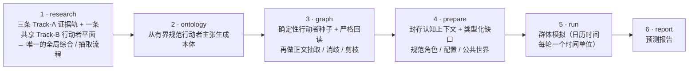

# DeepAgentForecast

[English](README.md) | **简体中文**

[](https://deepwiki.com/linroger/DeepAgentForecast)

> 📖 **文档：**[全系统架构图谱](docs/architecture/DEEPRESEARCHFORECAST_SYSTEM_ATLAS.md) · [可编辑的全系统 tldraw 架构图](docs/architecture/deepresearchforecast-system-architecture.tldr) · [行动者智能架构](docs/architecture/ACTOR_INTELLIGENCE_ARCHITECTURE.md) · [全部模型调用族](docs/architecture/llm-call-inventory.json) · [全部数据流与 Flask 接口](docs/architecture/dataflow-inventory.json) · [DeerFlow 2 Stage-1 深入图谱](docs/architecture/deerflow2/DEERFLOW_2_ARCHITECTURE.md) · [DeepWiki](https://deepwiki.com/linroger/DeepAgentForecast)。

> **一句话提问，自动产出预测。**
> 输入一个问题，它会自动联网研究、构建高保真的平行世界、运行多智能体群体模拟，并生成一份可交互的预测报告。

**DeepAgentForecast** 是一个自主的「一句话 → 预测」引擎。你只需键入一个问题，系统便会自动联网调研、把调研成果沉淀为一个高保真的平行数字世界、让当前 `actor-intelligence/v1` 阵容中的每位合格且身份匹配的 Tier-1/2 行动者进入群体模拟，最后由报告 Agent 综合产出一份分章节、可深度交互的预测报告。

---

## 快速上手

```bash
git clone https://github.com/linroger/DeepAgentForecast.git
cd DeepAgentForecast
./setup.sh        # 交互式：选择你的 LLM 提供方并一键安装全部依赖
npm run doctor    # 数秒内检查基础依赖与导入
npm start         # 后端 :5001 + 前端 :3000；流式日志 + 阶段标记
```

随后打开 **<http://localhost:3000/research>**，输入问题，点击 **运行研究 + 模拟 + 预测**。

**无需自建图数据库。** 时序知识图谱在**本地**运行（内嵌 Graphiti + FalkorDB —— 无需账号、无需 Docker、无需 API Key）。你唯一需要的凭据是**一个 LLM**：要么使用本地 `claude` / `codex` CLI 登录（零 Key），要么为某个在线提供方（`openai`、`kimi`、`minimax`、`deepseek`、`qwen`、`glm`）填入 API Key。`setup.sh` 会引导你选择并对 Key 做实时校验。

完整步骤见 [环境要求](#环境要求) 与 [快速开始](#快速开始)，每个配置项见 [`.env` 配置参考](#env-配置参考)。

---

## 演示

🔗 **[在线演示站](https://linroger.github.io/DeepAgentForecast/)**（中英双语）—— 走完真实端到端运行的**每一个阶段**：深度研究控制台日志、含行动者与来源的研究档案、生成的本体、可交互知识图谱、模拟的 Twitter/Reddit 论坛，以及最终预测报告（2026–2031 现代重商主义 × AI、2027–2028 存储半导体、2030 全球云计算、2030 美国 AI 竞赛、2035 全球电动汽车产业、俄乌战争终局、2030 全球半导体产业、2030 全球存储芯片、2035 中国储能与电池市场、2026 美伊战争终局）。

一句提示词 —— *“Who wins the US AI race by 2030?”*（谁会在 2030 年赢得美国 AI 竞赛？）—— 从提问到可交互预测的全过程（研究 → 知识图谱 → 40 轮群体模拟 → 报告）：


▶ **[观看完整演示视频（47 秒，MP4）](docs/media/demo.mp4)**

### 最新运行 —— 碰撞的十年：现代重商主义 × AI（2026–2031）

最新的特色运行完整回应了一份桥水（Bridgewater）风格的挑战简报：以深度模式对「现代重商主义与 AI 的碰撞」开展英文调研，产出 14 位核心行动者的角色档案（美国行政当局、中国、欧盟、英伟达、台积电、超大规模云厂商、美联储……）及其带类型、带极性的关系网，运行 **80 人格双平台模拟**，最终写出三部分结构的预测简报 —— 含 **13 条二元预测**（每条附概率与客观可裁决的判定标准）与 **4 个带概率权重的情景**。

🔗 **[在线浏览这次运行](https://linroger.github.io/DeepAgentForecast/demo.html?run=collision-decade-2031)**

### 展示运行 —— 2030 年前全球半导体产业

早前的一次展示运行：深度模式调研覆盖半导体全产业链（存储 / HBM / 逻辑 / 代工，17 家具名企业），构建 285 节点知识图谱，**115 个数字人格**进行 **40 轮双平台模拟**，最终产出分章节预测报告。

▶ **[观看半导体运行全程视频（42 秒，4 倍速，MP4）](docs/media/demo-semiconductors.mp4)** · 🔗 **[在线浏览这次运行](https://linroger.github.io/DeepAgentForecast/demo.html?run=semiconductors-2030)**

| | |
|---|---|
|  <br/>*阶段 1 —— 深度研究控制台：多轮研究协议中的每一次搜索、抓取与写作* |  <br/>*完成的研究档案 —— 对 2030 年半导体行业的循证深度研究* |
|  <br/>*调研提取的核心行动者 —— CEO、分析师与企业，立场与影响力均来自调研* |  <br/>*支撑档案论断的网络来源引用* |
|  <br/>*285 实体知识图谱与 10 个自动生成的实体类型* |  <br/>*模拟完成 —— 115 个人格、40/40 轮，完整 Twitter 信息流* |
|  <br/>*带可导航目录的最终预测报告* | |

### 截图

| | |
|---|---|
|  <br/>*阶段 4 —— 基于研究档案构建的时序知识图谱* |  <br/>*研究档案标签页 —— 每条论断都有网络来源引用支撑* |
|  <br/>*界面中的行动者档案；当前 v1 从已封存、来源绑定的证据中确定性编译每个可执行角色* |  <br/>*实时模拟控制台，流式呈现智能体的每个动作* |
|  <br/>*模拟进行中查看某个图谱实体的详情* |  <br/>*第 20/40 轮时的模拟 Twitter/Reddit 信息流* |
|  <br/>*智能体人格之间自然涌现的讨论串* |  <br/>*第 33/40 轮的帖子与智能体详情面板（管线进度 88%）* |

---

## 目录

- [快速上手](#快速上手)
- [演示](#演示)
- [它能做什么](#它能做什么)
- [架构总览](#架构总览)
- [当前实际运行的六阶段管线](#当前实际运行的六阶段管线)
- [功能特性](#功能特性)
- [环境要求](#环境要求)
- [快速开始](#快速开始)
- [模型提供方与切换方式](#模型提供方与切换方式)
- [`.env` 配置参考](#env-配置参考)
- [API 一览](#api-一览)
- [前端统一面板](#前端统一面板)
- [关键工程要点](#关键工程要点)
- [架构与最新增强](#架构与最新增强)
- [DeerFlow 2 集成模式与 DRF2 目标](#deerflow-2-集成模式与-drf2-目标)
- [项目结构](#项目结构)
- [故障排查](#故障排查)
- [致谢](#致谢)
- [许可证](#许可证)

---

## 它能做什么

把一个开放性问题（例如「2035 年电动车市场会怎样演化？」）交给 DeepAgentForecast，它会：

- **自动联网研究每个关键行动者（规模化）**：当前默认路径并行运行**三条相互隔离的 Track-A 多角度 evidence-only 证据轨**（基础证据 · 基率与参照类 · 激励/反面/市场），并只在广义基础轨运行**一条共享的 Track-B 行动者智能平面**。Track B 对每位第 1/2 层行动者研究 17 个带来源与时间边界的维度——历史、价值观、激励、动机、能力、约束、已显露的偏好/厌恶、联盟、竞争者、决策权/触发器、当前行动、未来计划、投资、历史记录、可能行动、红线和知识状态——再把经校验和绑定的角色档案送入唯一的全局报告/抽取命名空间。每条 Track-A 轨执行分阶段多轮协议，并且每次只启用一种广度机制：默认 harness scoped 子代理（三轨共享上限 9，每轨至多 3 个），或在 harness 未接管时启用旧桥接扇出。深度综合目标为 **1.5–2.2 万词**，并带 S1–S4 来源分级、三角验证、Polymarket 校准、十维行动者评审与确定性的「行动者 × 维度」来源覆盖审计。
- **构建高保真平行世界**：把研究成果蒸馏进一张带**分层、行为画像丰富的本体**的时序知识图谱（GraphRAG）。当前 v1 会为所有合格且身份匹配的 Tier-1/2 行动者确定性编译来源绑定的运行时角色与配置；图谱显著度不能截断封存的研究阵容，也不能用不匹配实体替代行动者。
- **以日历时间模拟未来演化**：系统会从你的问题中**自动抽取预测判定日**（「到 2030 年」「未来 18 个月」「2035 年底」……），把研究基准日到判定日之间的时间跨度切分为**每轮一个整日历单位**（日 / 周 / 半月 / 月 / 季度 / 半年）的回合 —— 轮数随判定日**动态伸缩**（问到 2035 的轮数多于问到 2029 的），单位也始终与问题匹配：「到 2030 年」→ 18 个季度轮，「三周内」→ 21 个单日轮。每一轮，LLM 人格都在**世界时钟**下扮演真实行动者**在整个时段内**会做的事 —— 决策、公告、结盟或战略性按兵不动；调研得到的真实事件会在其实际日期所在的回合触发；**世界态**在轮与轮之间演化（日历尺度惯性 + 基率熵底），并把「上一时段发生了什么」的定性摘要回灌给智能体。可选的**多种子敏感性侧车**会重跑模拟+报告并写入 `ensemble_forecast.json`，但不会改写已封存的主预测。
- **产出可交互预测报告**：由报告 Agent 在图谱与模拟之上做工具增强的检索，综合写出一份分章节的预测报告 —— 内嵌**预测数据图表**（交互式 Plotly，HTML + PNG 成对输出：情景概率、二元预测点图、指标轨迹、模型 vs 市场）；只有在找到并接受完全 / 近似判定等价的市场匹配时，预测才会获得 **Polymarket 锚点**；同时支持一键 **PDF 导出**。

整条链路由 **一个提示词（one prompt）** 触发，全程自动衔接，无需人工在各阶段之间手动搬运中间产物。

---

## 架构总览

DeepAgentForecast 是一套本地六阶段应用，而不是一个独立的研究 Agent。Vue 与 Flask 接收运行请求；`PipelineOrchestrator` 依次推进 **research → ontology → graph → prepare → run → report**；持久化状态与 manifest 哈希决定能否复用；Graphiti 保存时序知识图谱；OASIS/CAMEL 运行社会模拟；`ReportAgent` 与发布门共同产出最终预测。**DeerFlow 2 是这条全流程中完整的 Stage-1 研究子系统。**


[全系统架构图谱](docs/architecture/DEEPRESEARCHFORECAST_SYSTEM_ATLAS.md)逐项追踪所有输入、输出、进程/线程边界、阶段迁移、pass、接收方、持久化存储、失败/重试分支、发布侧车与运行后回路。其[可编辑 tldraw 画布](docs/architecture/deepresearchforecast-system-architecture.tldr)、[SVG](docs/architecture/deepresearchforecast-system-architecture.svg)、[95 条数据流 / 101 条路由清单](docs/architecture/dataflow-inventory.json)与归一化的[100 个模型调用族清单](docs/architecture/llm-call-inventory.json)提供可机械验证的配套证据。

在 Stage 1 内部，DeerFlow 2 把模型、工具、技能、子智能体、线程状态、沙箱 / MCP 能力与一条有严格顺序的中间件策略链装配成 LangChain agent。每个研究回合都是动态的 **模型 → 工具 → 接收结果 → 再次调用模型** 循环，并带检查点与流式事件。本架构图不包含 DeerFlow 1.x 的原始研究图。

仓库里有三层与 DeerFlow 2 相关的代码，其运行状态不能混为一谈：

| 层 | 用途 | 状态 |
|---|---|---|
| `deer-flow-2.0.0/` | 用户另行放置时可用的本地 DeerFlow 2.0 源码包，作为全新装配输入 | **已忽略的本地参考**；普通 clone 回退到上游提交 `799bef6d…`，该提交早于本次审计使用的公开 `v2.0.0` 标签 |
| `deerflow_bridge/` → `deer-flow/` | 把受版本控制的研究驱动 / 配置 / 工具 / 技能 / 补丁装配进隔离运行时 | **当前 Stage 1 实际运行路径** |
| `drf2/` | 自定义智能体与技能、KG / 模拟 MCP 服务，以及确定性的 Runs API 驱动器 | **可选、受门控、尚未切换** |


[DeerFlow 2.0 完整架构图谱](docs/architecture/deerflow2/DEERFLOW_2_ARCHITECTURE.md)按源码逐项追踪入口、中间件钩子、所有模型调用族、工具 / 子智能体 / MCP / 沙箱边界、流事件、检查点、Stage-1 每一轮 pass、产物交接与 DRF2 目标契约。底图可直接在 [tldraw](docs/architecture/deerflow2/deerflow2-architecture.tldr) 中编辑；同时提供 [SVG](docs/architecture/deerflow2/deerflow2-architecture.svg)、[PNG](docs/architecture/deerflow2/deerflow2-architecture.png)、[LLM 调用清单 JSON](docs/architecture/deerflow2/deerflow2-call-inventory.json) 与[接口清单 JSON](docs/architecture/deerflow2/deerflow2-interface-inventory.json)。

### Stage 1 内部的 DeerFlow 2 执行模型

当前 Stage 1 子进程走的是**内嵌 `DeerFlowClient`**。原生 Gateway / Runs API 已在 DeerFlow 2 中实现，也是切换前 DRF2 确定性驱动器选定的传输面。

```text
当前：Flask 编排器 → 1..N 个隔离子进程证据轨 → 内嵌 DeerFlowClient
      → 主模型 1..N 次 ↔ 工具 0..N 次
      → 可选子智能体循环 + 条件式上下文摘要
      → 证据包 → 全局综合 / 评审 / 抽取 → 封存的研究契约

原生：客户端 → FastAPI thread/run 服务 → RunManager / worker
      → 同一套主智能体装配 → checkpoint / store / journal → SSE 重放 / end

目标 A：聊天原生主智能体 + 四个自定义智能体 ↔ KG / 模拟 stdio MCP
        （尚未切换）

目标 B：确定性驱动器 → 持久 Runs API 斜杠技能主智能体运行
        → 通过技能访问 KG MCP；暂行模拟 HTTP 客户端尚无匹配服务端适配器（尚未切换）
```

原生 DeerFlow 2 还支持标题生成与长期记忆。当前研究桥接关闭标题生成，是因为无界面的单次研究不会显示标题，多做一次只会产生未使用的 LLM 调用；关闭持久记忆则是为了防止跨运行污染与后台模型调用。上下文摘要仍处于启用状态，但只在上下文达到 8 万 token 时触发：保留最近 1.6 万 token，对被丢弃的完整区段做摘要；未单独指定摘要模型时继承当前运行模型。模型调用次数没有诚实的固定值：每个主智能体或子智能体 pass 本身都是 agent loop，而综合章节、评审、恢复、市场、重试、外层证据轨与恢复位置都会增加条件调用。

DeerFlow 封存 Stage-1 契约后，当前实际运行系统由以下组件继续接收：

| 组件 | 作用 |
|---|---|
| **DeerFlow 2.0 Stage 1** | 默认三条隔离的 Track-A evidence-only 证据轨，加上恰好一条由基础轨拥有的共享 Track-B 行动者平面，之后由唯一的全局综合 / 评审 / 抽取流程接管。Track B 产出来源绑定的行动者档案与可问责的 17 维覆盖台账；manifest v3 在全局综合前把它与三条证据轨一起封存。`deep-research`、`actor-ontology-research`、`prediction-markets` 与 `forecast-visuals` 四个技能按工作流激活。 |
| **MiroFish / OASIS** | 基于 CAMEL-AI OASIS 的群体模拟引擎。当前 `actor-intelligence/v1` 会保留所有合格且身份匹配的 Tier-1/2 行动者，不受旧式上限截断，并为每位行动者确定性编译同一角色到模拟 Twitter + Reddit；只有显式配置时才添加程序化受众填充者。 |
| **本地 Graphiti KG** | 运行在嵌入式 FalkorDB 上的时序知识图谱（GraphRAG）；档案在此灌入，实体 / 关系由配置的 `LLM_PROVIDER` 抽取，向量由本地多语言 sentence-transformers 模型计算。无需 Docker、独立服务或图数据库 Key。 |
| **ReportAgent** | 按章节运行工具增强循环：有能力的提供方使用原生函数/工具调用，其余路径回退 ReAct 文本协议；通过 `insight_forge` 检索图谱与明确标注的模拟诊断，再封存预测报告。 |
| **前端** | Vue 3 + Vite 组合式双语仪表盘，展示六阶段状态、日志与所有阶段产物。 |

当前还有一条条件式 MCP 边界：在 fork / continue / resume-with-graph 路径中，如果已有 `state.graph_id` 且 `RESEARCH_MCP_KG=true`，编排器会通过 stdio MCP 把现有后端 KG 暴露给 Stage-1 DeerFlow 2 子进程。普通首跑此时尚未建图，因此这条边界不存在。它是当前只读/查询反馈路径，不等同于尚未切换的 DRF2「KG + 模拟」MCP 目标设计。

### 行动者真实感的权威链

行动者真实感不是把人格提示词写得更长，而是一条跨阶段封存的数据链。当前契约如下：

| 边界 | 当前 v1 的权威数据与接收规则 |
|---|---|
| **阶段 1：研究与抽取** | 恰好一条共享 Track-B 平面以同一套有序 17 维度深研所有 Tier-1/2 行动者：身份/历史、价值观/世界观、激励、动机、能力、约束、行动偏好与喜恶、联盟、对手/竞争者、决策权/流程/触发器、当前行动、未来计划、投资/资本配置、历史表现、可能行动、红线、知识状态。每条主张必须携带时间、认知状态、置信度、依赖、矛盾、限定条件，以及精确绑定已抓取来源的证据；没有证据的单元格写成类型化缺口，不得编造。行动者档案同时是全局研究报告的证据，因此各行动者的计划、激励、行动与投资会同时进入下游报告与模拟。 |
| **阶段 1：父进程接收** | 父进程重新计算搜索结果收据、精确引文/区间/内容哈希、确定性 claim ID，以及五类行为就绪投影——身份/历史、激励/动机/价值、能力/约束、行动/计划/投资、决策/可能行动/红线——再加上档案覆盖率、行动者阵容/顺序与报告/档案/来源/血缘哈希。对已固定 `actor-intelligence/v1` 策略的当前运行，只要任一收据、主张、行为族、覆盖率、报告、档案、阵容或血缘封印无法闭合，就会在进入 ONTOLOGY / GRAPH 之前失败。 |
| **阶段 2：本体** | 本体 LLM 只接收一份有界的规范投影：行动者 ID、别名、层级，以及已封存、绑定收据的主张。当前 v1 行动者不能回退到旧式扁平 `role`、`stance`、`brief` 或 topic 字段。 |
| **阶段 3：图谱** | 灌入研究正文之前，`actor-graph-seed-manifest/v1` 已确定规范行动者/类型/别名节点、关系、UUID、claim 哈希与因果属性。系统在种子写入后，以及正文抽取、实体消歧、剪枝或图谱复用之后，严格校验物理 `actor-graph-seed-readback/v1`。正文可以丰富图谱，但不能悄然替换规范行动者身份或已封存关系。 |
| **阶段 4：上下文与配置** | 每个入选行动者都有一份 `actor-context/v1`，严格区分共享公开证据、关于行动者的文献证据、行动者自身信念/知识、公开争议证据、分析师推断、未知，以及六字段类型化缺口审计（`reason`、`attempted_queries`、`receipt_ids`、`result_ids`、`attempt_count`、`exhausted`）。规范行动者配置只从已封存的行为投影确定性生成；公共世界只接纳明确公开且绑定来源的证据。分析师推断和缺口审计为问责而封存，但不会变成行动者知识或行为配置 token。 |
| **阶段 4→5：运行时字节** | `actor-role/v2` 是唯一行为档案权威。Twitter 的 `user_char` 等于该角色内容，仅做有文档约定的换行归一化；Reddit 的 `persona` 也是该角色，旧式人口统计字段只是空的加载器占位。真正交给 Reddit 模型的 system message，是确定性的纯角色包装，再加上 `simulation_config.json` 中可选且已封存的 `world_brief` 与日历词汇。父 runner 先重验角色、上下文、阵容、档案与 `simulation-config-manifest/v1` 封印；子进程再复验配置/档案，重建 Reddit 实际消息，并在首次模型行动前证明其最终字节。 |
| **调用与兼容性** | Track B 之后的加固在已审计清单之外**不增加新的 LLM 调用族**：主张/收据/血缘/行为族/报告接收、本体投影、图谱种子/回读、上下文选择、角色编译、公共世界/配置投影与全部封印均为确定性操作。它加深既有 Track-B 研究/补全/综合/评审调用族；当前规范配置还会跳过旧式 activity-config LLM 批调用。agent loop 内的实际调用次数仍由数据决定。按 v1 策略准入的运行 fail closed；显式关闭该策略或策略固定机制出现前的运行保留有文档说明的旧路径，旧 `actor-role/v1` 只能按原字节复用，绝不静默重编译或升级。原生 Gateway 与两个 `drf2/` 拓扑仍处于切换前状态。 |

**端口约定**

| 服务 | 地址 |
|------|------|
| 后端（Flask） | `http://localhost:5001` |
| 前端（Vue 3 + Vite） | `http://localhost:3000`（将 `/api` 代理到 `5001`） |

---

## 当前实际运行的六阶段管线

一条「管线（pipeline）」对应一次提示词运行（one prompt run）。整条管线按以下六个阶段顺序执行：



若你的环境暂不支持 Mermaid 渲染，以下 ASCII 流程图等价：

```
 ┌──────────┐   ┌──────────┐   ┌──────────┐   ┌──────────┐   ┌──────────┐   ┌──────────┐
 │ 1 research│ → │2 ontology│ → │ 3 graph  │ → │4 prepare │ → │  5 run   │ → │ 6 report │
 │ 深度研究  │   │ 本体生成 │   │ 图谱构建 │   │ 环境搭建 │   │ 群体模拟 │   │ 预测报告 │
 └──────────┘   └──────────┘   └──────────┘   └──────────┘   └──────────┘   └──────────┘
```

### 全流程精细视图

下图中的每个方框都对应一条真实代码路径——阶段进入条件、阶段内部步骤、质量门与每一步读写的持久化产物。实线为主路径；judge 的 FAIL 边与虚线的状态/图谱边是恢复与持久化路径。完整拓扑、状态限定与 `file:line` 引用见当前源码版[全系统架构图谱](docs/architecture/DEEPRESEARCHFORECAST_SYSTEM_ATLAS.md)。

```mermaid
flowchart TD
    U([用户提示词]) --> API["POST /api/research/run<br/>预检 → pipe_&lt;id&gt; + 任务<br/>守护线程 · 30 秒心跳 · 恢复/分叉/取消"]
    API --> SYNC

    subgraph S1["阶段 1 · 深度研究（0–30%）— DeerFlow 2 子进程 · 独立 venv"]
        SYNC["运行时技能 + 桥接同步<br/>与已部署 deer-flow/ 做 SHA-256 比对（漂移即拒绝）"] --> EPOCH
        EPOCH["工具预算纪元（SQLite 台账）<br/>尝试 1800 · 搜索 900 · 抓取 450<br/>每条管线至多 3 个纪元"] --> LANES
        subgraph LANES["3 条并行 evidence-only 证据轨（各有专属视角）"]
            direction LR
            L1["轨 1 · 基础证据<br/>Track A + 共享 Track-B 行动者平面"]
            L2["轨 2 · 基率与历史类比"]
            L3["轨 3 · 激励 · 反面 · 市场"]
        end
        LANES --> LOOP["每轨 Track-A 深度循环<br/>开局 → 划界 → 3 个限定阶段并行 → 预测启示<br/>+ 单一广度面：harness 子代理（全局上限 9；默认每轨 ≤3）<br/>或桥接层每 KIQ 扇出（宽度 ≤8）<br/>+ 自适应补缺轮（平台期即停）<br/>工具：web_search · web_fetch（带缓存）· prediction_market_search"]
        L1 --> ACTOR["共享 Track B<br/>行动者版图 → 全阵容 17 维补全<br/>→ 档案综合 → 十维评审/精修<br/>→ 确定性的来源绑定覆盖审计"]
        LOOP --> PACKS["三组 evidence_pack.md + sources.json<br/>+ 一份行动者档案 / 覆盖审计 / 可选评审<br/>封存进 evidence_synthesis_manifest.json v3"]
        ACTOR --> PACKS
        PACKS --> GS["全局综合子进程<br/>大纲 → 多段章节 → 合并<br/>≤ 2 次尝试 · 恢复时仅重跑综合"]
        GS --> JUDGE{"七维报告评审<br/>记分牌与字节绑定"}
        JUDGE -- 通过 --> EXTRACT["唯一的结构化抽取流程<br/>带 actor-intelligence/v1 的 actors.json · timeline.json<br/>quantitative.json · contested.json · 市场 · charts/"]
        JUDGE -- 不通过 --> GS
        EXTRACT --> CONTRACT["研究契约晋升<br/>manifest 最后落盘 · 可回滚<br/>research_report.md 封存"]
    end

    CONTRACT --> ONT
    subgraph S2["阶段 2 · 本体生成（30–40%）"]
        ONT["LLM 从有界的规范行动者 ID + 封存主张投影<br/>推导实体 + 关系类型<br/>实体原型/层级 · 关系族/极性 → ontology.json"]
    end
    ONT --> GB
    subgraph S3["阶段 3 · 图谱构建（40–60%）— 本地 Graphiti 时序知识图谱"]
        GB["actor-graph-seed-manifest/v1<br/>确定性的行动者/类型/别名/关系 UUID + 属性"] --> GR["严格物理回读<br/>种子写入后与每次变更/复用后均校验"]
        GR --> GI["选定正文分块 → 批量 Graphiti 情节<br/>已配置提供方抽取 + 本地 MiniLM 嵌入<br/>嵌入式 FalkorDB（无服务进程、无 Key）"]
        GI --> GP["可选社区检测（默认关闭）<br/>→ 实体消歧 → 剪枝（≤ 400 节点）<br/>→ 重验种子契约 → graph_priors.json"]
    end
    GP --> CAST
    subgraph S4["阶段 4 · 环境搭建（60–72%）"]
        CAST["当前 v1：所有合格且身份匹配的 Tier-1/2 行动者<br/>旧式上限不能丢弃已调研行动者<br/>actor-context/v1：认知切分 + 类型化缺口 + 封印"] --> PERS["actor-role/v2 是唯一行为权威<br/>17 维证据、计划、投资<br/>+ 来源绑定的公开关系"]
        PERS --> SIMCFG["仅用规范数据确定性生成 simulation_config.json<br/>来源绑定的公共世界 + temporal_config<br/>情景/WorldState 变更 → 授权重封印"]
    end
    SIMCFG --> OASIS
    subgraph S5["阶段 5 · 群体模拟（72–92%）— OASIS 子进程"]
        OASIS["Twitter + Reddit 双平台模拟<br/>重验 Twitter user_char 与 Reddit 最终 system 字节<br/>1 轮 = 1 个日历单位（日 … 半年）<br/>世界时钟 · 日期事件 · 世界态增量"] --> RS["持久化模拟目录 + simulation_id<br/>平台/动作/决策/WorldState 工件<br/>run_summary.json 是独立诊断/API 汇总"]
    end
    RS -->|simulation_id| RX
    subgraph S6["阶段 6 · 预测报告（92–100%）"]
        RX["报告准入 + 证据/市场上下文"] --> SPINE["正文前情景概率脊柱<br/>K 次抽样（默认 1）+ 默认自我批判<br/>diagnostic_only 排除模拟概率输入"]
        SPINE --> RA["大纲 + ReportAgent 逐章循环<br/>支持时用原生调用，否则回退 ReAct<br/>批判/修订/修复 · 图谱 + 有标签模拟诊断"]
        RA --> ASM0["首次汇编已接受章节"]
        ASM0 --> FX["预测定稿<br/>复用固定情景；缺失时才从正文回退抽取<br/>创建二元契约 + 概率抽样<br/>模型辅助市场评审 → 确定性验证"]
        FX --> PRESENT["成品装配<br/>Part I 二元表 + 确定性可视化<br/>Part II 综合 + Part III + 判定/语言扫描"]
        PRESENT --> GATES["编辑 lint → 引用 → 只读硬审计<br/>→ 封存 full_report.md + forecast.json + charts<br/>→ 自动尝试符合语言条件的变体"]
        GATES -.->|N_FORECAST_SEEDS > 1| ENS["可选多种子敏感性轨<br/>逐种子重跑 prepare→run→report<br/>→ ensemble_forecast.json 侧车"]
        GATES --> HEALTH{"主交付物健康门"}
        ENS -.->|侧车结果| HEALTH
        HEALTH --> DONE(["PipelineState completed · 进度 100<br/>TaskManager 终态结果 + report_id"])
    end

    GATES --> PUB{"发布门<br/>精确绑定报告/预测/审计哈希"}
    PUB --> OUT(["承载答案的报告 / 预测 / 可视化 API<br/>交互报告 · Markdown · 图表"])
    PUB -.->|按需| DERIV["惰性 PDF · 高管简报 · digest<br/>内容寻址且受发布门约束"]

    KG[("Graphiti 时序知识图谱<br/>嵌入式 FalkorDB")]
    GB -.种子写入.-> KG
    GI -.正文灌入.-> KG
    PERS -.读取.-> KG
    RA -.insight_forge.-> KG

    STATE[("pipeline_state.json · run.json<br/>handoff/manifest.json（SHA-256）<br/>按产物恢复 · 孤儿对账")]
    S1 -.检查点.-> STATE
    S3 -.-> STATE
    S5 -.-> STATE
    S6 -.-> STATE
    DONE -.->|终态| STATE
```



| 阶段 | 名称 | 说明 |
|------|------|------|
| 1 | **research（多角度 · 行动者深研 · manifest 路由 · 规模化）** | 默认编排器扇出**三条 Track-A evidence-only 子进程**（基础证据 · 基率与参照类 · 激励/反面/市场）。广义基础轨同时独占**一条共享 Track-B 行动者平面**；其它轨不得产出竞争档案。Track B 执行动作者版图、全阵容 17 个 `actor-intelligence/v1` 维度补全、免工具档案综合、十维评审/精修与确定性的已抓取来源覆盖审计。manifest v3 把三组证据/来源包和这一份行动者档案、覆盖侧车、基础轨来源与可选评审封存后，再由全新的子进程统一完成唯一的大纲、多段综合、报告评审、结构化抽取、市场对账、图表收尾与契约晋升。其它契约包括 `research_report.md`、`actors.json`、`sources.json`、`prediction_requirement.txt`、`timeline.json`、`meta.json`、`research_progress.log` 与 `market_price_history.json`。 |
| 2 | **ontology（本体生成）** | LLM 依据封存研究材料、预测问题，以及一份只含规范行动者 ID/别名/层级与收据绑定主张的有界当前 v1 投影，推导实体类型和关系类型；每个实体带**原型（archetype）+ 模拟层级（tier）**，每条关系带**族（family）+ 极性（valence）**。旧式扁平 role/stance/brief 字段不是当前 v1 的备用输入。 |
| 3 | **graph（图谱构建）** | 系统先把结构化行动者智能转换为 `actor-graph-seed-manifest/v1`：使用稳定 UUID、claim 哈希、极性/方向/符号、强度/等级、有效期与时滞，确定规范行动者/类型/别名节点及来源绑定关系。物理写入后必须通过严格 `actor-graph-seed-readback/v1`；正文抽取、实体消歧、剪枝与复用后会再次校验同一契约。随后才把选定研究正文分块灌入本地 Graphiti，正文不得覆盖规范行动者身份。`GRAPH_CHUNK_SOURCE=dossier_only` 优先使用 `actor_dossier.md`，不存在时使用封存报告；`both` 才同时灌入。FalkorDB 存储和 sentence-transformers 嵌入在本地完成，Graphiti 抽取复用 `LLM_PROVIDER`。 |
| 4 | **prepare（环境搭建）** | 当前 `actor-intelligence/v1` 会保留**所有合格且身份匹配的 Tier-1/2 行动者**，不受 `ACTOR_CAST_MAX` 影响；不匹配的图节点和通用回退会被拒绝。任何可执行角色编译前，封存的 `actor-context/v1` 都会区分公共局势证据、关于行动者的文献事实、行动者知识/信念、公开争议证据、分析师推断、未知与类型化研究缺口。当前 v1 的角色与每行动者配置均为确定性生成，只使用封存的规范行为投影与明确公开且绑定来源的世界事实；不会调用人格/配置 LLM，也绝不回退到扁平 role/stance/influence/memory/incentive 字段。`actor-role/v2` 是唯一行为档案权威：Twitter `user_char` 是该角色的换行归一化结果；Reddit `persona` 是该角色，人口统计字段为空占位。`simulation-config-manifest/v1` 封住精确配置字节及全部阵容/上下文/角色/档案绑定。若编排器随后应用获授权的情景覆盖或 WorldState 种子，会以幂等方式更新配置、重建封印，并在 RUN 前立即校验。已完成的只读复用会校验现有的状态绑定封印，但不会改写或重封；子进程在封印校验后还会哈希自己真正载入的精确字节，从而关闭校验/使用间隙。时间线由判定日确定性推导。 |
| 5 | **run（群体模拟）** | OASIS 以**日历时间**运行 Twitter + Reddit 双平台模拟。首次行动前，父 runner 与子进程会重验阵容、上下文、角色、档案和配置封印。Twitter 消费已封存 `user_char`；Reddit 真正的模型 system message 由纯角色包装加上配置中可选且已封存的世界简报与日历词汇确定性重建，并再次证明最终字节。每轮对应基准日与判定日之间的一个整日历单位（日 / 周 / 半月 / 月 / 季度 / 半年）——「到 2030 年」→ 18 个季度轮，「到 2035 年」→ 19 个半年轮。真实事件按日期入轮，主角级行动者每轮行动，世界态轨迹逐轮演化且不向智能体暴露数值份额。旧新闻周期模式仍可经 `SIM_TEMPORAL_MODE=hours` 启用。 |
| 6 | **report（预测报告）** | ReportAgent 在提供方支持时使用原生函数/工具调用，其余路径回退 ReAct 文本协议；通过 `insight_forge` 从图谱与模拟诊断中检索，写出分章节预测报告。输出采用桥水式三部分骨架（二元预测表 · 框架综合 · 附录）、**完全 / 近似判定等价的 Polymarket 匹配**（10pp 分歧说明规则仅适用于已接受的锚点）、确定性**可视化层**（交互式 Plotly 图表，HTML + PNG 成对输出，matplotlib 兜底），并支持一键 **PDF 导出**。图表槽位**只放预测数据**：情景概率、二元预测点图、模型 vs 市场分歧、研究抽取的**指标轨迹**（成本曲线、部署路径）、事件时间线与角色网络——来源构成、影响力代理值等**管线元数据图默认关闭、仅可显式开启**，绝不挤占预测图表。若 `N_FORECAST_SEEDS>1`，额外 prepare→run→report 轨在主报告之后生成独立的 `ensemble_forecast.json` 敏感性侧车；主报告、主预测与审计字节不会被改写。 |

---

## 功能特性

- **一句话 → 完整预测**：单个问题端到端驱动「研究 → 模拟 → 报告」整条管线，无需在阶段间手动搬运中间产物。
- **规模化自主深度研究**：**三条并行的多角度 Track-A 证据轨**执行联网搜索与全文抓取，将封存证据包交给一个全局综合命名空间。选择 `deep` 深度时，DeerFlow 会执行分阶段多轮协议（来源版图、原始证据、行动者/激励、矛盾/风险、预测输入、最终长文综合），使用一种有界广度机制（默认 harness 子代理，或桥接扇出）、**研究 judge→refine 环**、通用 **S1–S4 来源分级**与三角验证，再以**多段并行综合**产出 **1.5–2.2 万词**深度档案。
- **预测市场锚定（Polymarket）**：研究阶段通过 LLM 生成的**市场化检索词**+**相关性门控**，从 Polymarket 官方 **Gamma + CLOB** API **无需 Key** 拉取隐含概率，注入为研究前**校准锚点**。报告阶段会逐条评估是否存在完全 / 近似判定等价的市场；只有接受的匹配才写入 `market_anchor` 并应用 10pp 分歧说明规则。已锚定预测可做**双时态重报价**（研究期价 vs 现价 + Δ）并渲染 **90 天价格历史**；没有合适市场或网络失败时会安全降级为不锚定。
- **确定性报告可视化 + PDF**：一个免 LLM 的可视化层渲染**交互式 Plotly 图表**（HTML + PNG 成对输出，matplotlib 兜底）并内嵌进报告——默认槽位只放**预测数据**（情景概率含集成误差带、二元预测点图、模型 vs 市场哑铃、研究抽取的指标轨迹、跨版本预测修订、事件时间线、角色网络、世界态轨迹、市场价格历史），来源构成 sunburst、影响力/显著度代理值等元数据诊断图**默认关闭、仅可显式开启**；可按需 **PDF 导出**（pandoc / XeLaTeX，中文安全）。
- **多种子敏感性侧车 & 自适应上下文**：显式开启后，额外的模拟+报告轨会汇总到 `ensemble_forecast.json`，但不改写已审计的主预测；上下文切片（前序章节、人设、世界简报）会**按提供方上下文窗口预算化**。
- **DeerFlow harness 技能**：四个技能 —— `deep-research`、`actor-ontology-research`、`prediction-markets`、`forecast-visuals` —— 已部署并列入 DeerFlow 2.0 超级智能体 harness 白名单，再按工作流激活；并非每条证据轨都会调用全部技能。
- **行动者深研 → 封存运行时角色**：结构化 `actor-intelligence/v1` 为每位真实世界行动者覆盖 17 个维度，逐条保留 claim 收据、精确来源区间、时间、认知状态、置信度、依赖、矛盾、限定条件、行为族覆盖与类型化缺口。同一批计划、投资、激励、当前行动、能力、约束、联盟、竞争者、可能行动与红线既进入研究报告，也进入该行动者的相关封存上下文。PREPARE 保持「公开 / 文献记录 / 行动者已知 / 推断 / 争议 / 未知」边界，将 `actor-role/v2` 编译为唯一行为权威，只从规范数据生成配置与公共世界，并同时封存平台档案字段及 Reddit 最终生效的 system message。这些下游门控均为确定性操作，不增加 LLM 调用族。详见[行动者智能架构](docs/architecture/ACTOR_INTELLIGENCE_ARCHITECTURE.md)。
- **时序知识图谱（GraphRAG）**：研究成果灌入嵌入式 FalkorDB，向量由本地嵌入模型建立索引；这两部分不需要图数据库云账号或 Key。实体/关系的结构化抽取则复用应用 `LLM_PROVIDER`，可能走本机 CLI，也可能走需要 Key 的托管 API。
- **日历时间模拟（以真实时间单位推演未来）**：预测判定日自动从提示词抽取（显式日期、「2030 年底」、「未来 18 个月」、裸年份 —— 中英文皆可），确定性时间线模块把基准日→判定日的跨度切分为每轮一个整日历单位（日 / 周 / 半月 / 月 / 季度 / 半年）、目标约 16 轮：判定日越远轮数越多；显式轮数上限只会**粗化时间粒度，绝不截断预测期**。每轮携带世界时钟、按日期注入的真实事件、主角级行动节奏，以及带基率熵底的世界态演化轨迹。
- **多智能体群体模拟**：当前 v1 默认准入所有合格且身份匹配的 Tier-1/2 经调研行动者，受众填充数为 0；旧式 `ACTOR_CAST_MAX=20` 不会截断规范阵容。同一精确角色跨模拟 Twitter + Reddit 复用。每轮即一个日历单位，涌现动态作为明确标注的诊断材料保留，而不会直接调整概率。
- **工具增强的预测综合**：ReportAgent 在支持时使用原生工具调用，其余路径回退 ReAct，同时检索知识图谱与带标签的模拟诊断后再撰写报告。
- **统一仪表盘**：实时日志、研究档案、知识图谱、模拟信息流与预测报告，全部收纳在一个带吸顶六阶段时间线的视图里。
- **运行时可切换 LLM 提供方**：在设置菜单中即可在本机 CLI 与托管 API 之间切换，对**新发起的运行**生效。内置**「测试连接」**按钮，一键验证 API Key（或本机 CLI）可用后再应用。
- **可取消的运行**：运行中的管线可在任意阶段从 UI 中止 —— 研究子进程组被杀掉、OASIS 模拟被停止，被取消的运行会立即停止消耗配额。
- **可恢复的运行**：失败或被取消的管线可以原地恢复（**继续**按钮，或 `POST /api/research/<id>/resume`）。已完成阶段只有在 manifest 哈希、schema、身份与该阶段健康检查全部重新通过后才会复用；无效或损坏的交付物会重新生成，显式 `force` 也可重新审视终态工作。其他情况下，管线从第一个仍需处理的阶段继续。
- **秒级预检（fail-fast）**：`npm run doctor` 几秒内检查基础文件 / 目录、导入与提供方前置条件；`POST /api/research/run` 会在产生任何花费之前校验 Key / 凭据 / DeerFlow 检出。
- **双语界面**：English + 中文，可在设置菜单一键切换。
- **运行历史**：抽屉中列出历史管线运行，便于快速回看。
- **为韧性而设计**：错误守卫、无工具的综合兜底网、随深度自适应且可抢救报告的研究看门狗、逐章优雅降级、原子化状态写入，以及跨重启的孤儿对账（包括滞留的研究进程）。

---

## 环境要求

| 组件 | 要求 |
|------|------|
| **Node.js ≥ 20.19** | 前端（Vue 3 + Vite 7）需要。 |
| **Python 3.12** | 后端需要 —— `backend/pyproject.toml` 要求 ≥3.12，而 `camel-ai`/`camel-oasis` 又限制上界，因此后端 venv 精确固定为 **3.12**（`backend/.python-version` + `uv sync --python 3.12`）。 |
| **Python 3.12** | DeerFlow 深度研究引擎运行在**自己独立的 venv** 中（DeerFlow 2.0 固定使用 Python 3.12）。 |
| **uv** | 两套 venv 共用的 Python 包管理器。安装：`curl -LsSf https://astral.sh/uv/install.sh \| sh` |
| **git** | 普通 clone 必需，用于让 `setup.sh` 获取固定的 DeerFlow 上游版本。只有已存在装配运行时，或用户另行放置了本地 `deer-flow-2.0.0/` 源码包时才可不依赖 git。 |
| **知识图谱** | 无需任何账号或 API Key。时序知识图谱由开源 **Graphiti** 在**嵌入式 FalkorDB**（`falkordblite`）上本地运行 —— 无需 Docker、无需服务进程。首次建图会自动下载一次本地嵌入模型（约 470MB）并缓存。 |
| **LLM** | 默认使用本机 `claude` 或 `codex` CLI（无需 API Key）；`openai` / `kimi` / `minimax` / `deepseek` / `qwen` / `glm` 等 OpenAI 兼容 API 提供方需要 `LLM_API_KEY`。建图阶段复用同一个 `LLM_PROVIDER`，连免 Key 的 CLI 提供方也能用。 |

---

## 快速开始

三步走：**安装 → 配置 → 运行**。DeerFlow 位于仓库内由脚本生成且已被 gitignore 的 `deer-flow/` 目录，使 LangChain/LangGraph 依赖与后端隔离。若用户另行放置本地 2.0 源码包，`setup.sh` 可用它装配；普通 clone 则使用固定的上游版本。运行时 venv 位于 `deer-flow/backend/.venv`。

### 1. 安装

**路径 A —— `setup.sh`（推荐）**。一个脚本自动完成全部安装：

```bash
./setup.sh
```

它会检查前置条件，然后进入**交互式提供方选择器**：在本机 `claude` / `codex` CLI（零配置、无需 API Key——检测到的 CLI 会被预选为默认项）与六个托管 API 提供方（OpenAI 兼容 / Kimi / MiniMax / DeepSeek / Qwen / GLM）之间选择。选择 API 提供方时会提示你输入 **API Key**（静默输入、绝不回显），并用一次 1-token 补全**实时验证该 Key**。随后它会生成 `.env`、安装依赖并构建后端 venv，然后自动装配 DeerFlow：若存在用户另行放置的本地 `deer-flow-2.0.0/` 源码包就使用它；普通 clone 则从 <https://github.com/bytedance/deer-flow> 获取固定版本。脚本裁剪基础代码，应用 `deerflow_bridge/` 中受版本控制的代码 / 工具 / 技能 / 中间件覆盖层，并构建隔离 venv。重复运行会保留既有基础代码与 `deer-flow/config.yaml`，同时刷新适用的受版本控制集成代码；它不会静默替换基础代码或配置。

如需覆盖默认值，可通过环境变量：`DEERFLOW_DIR`（位置）、`DEERFLOW_REPO`（克隆地址）、`DEERFLOW_REF`（固定提交；设为 `=main` 可跟踪 HEAD）、`SETUP_NONINTERACTIVE=1`（跳过选择器、走自动探测——CI / 管道运行会自动如此）。它们由 `setup.sh` 从 **shell 环境**读取（不是 `.env` 配置项），例如 `DEERFLOW_REF=main ./setup.sh`。重复运行是幂等的：选择器默认选中你当前 `.env` 里的提供方，直接回车绝不会覆盖既有配置。

**手动装配：**请把 `setup.sh` 当作可执行规范。真实集成不只是复制研究驱动与一个技能，还会安装桥接工具、权威技能包、运行时校验器、模型 / 提供方适配以及中间件安全覆盖层；简短的 `cp` 清单并不等价。自定义打包环境时请阅读 [`setup.sh`](setup.sh) 与 [DeerFlow 2 架构图谱中的装配说明](docs/architecture/deerflow2/DEERFLOW_2_ARCHITECTURE.md#2-the-three-deerflow-2-layers-in-this-repository)。

### 2. 配置

默认配置开箱即用 —— 知识图谱在本地运行，无需任何 Key。仅当选择了托管提供方时，才需在 `.env` 中填入相应的 API Key —— 详见下文的 [`.env` 配置参考](#env-配置参考)。如果使用 `claude` 或 `codex` CLI，确保所选 CLI 已登录即可（分别运行一次 `claude` 或 `codex`）。

然后体检**当前已装配的管线**——工具版本、两套 venv、DeerFlow 覆盖层与所选提供方的凭据：

```bash
npm run doctor
```

逐项修复它报告的 ✗ 项并重新运行，直到输出 `All checks passed`。doctor 只是当前 `deer-flow/` 路径的基础依赖 / 文件存在 / 导入检查；它不证明覆盖层新鲜度或驱动 / 配置一致性，也不代表 DRF2 Runs API / MCP 已完成实跑切换。

### 3. 运行

```bash
npm start          # 后端 :5001 + 前端 :3000；实时日志 + 阶段标记
```

打开 **<http://localhost:3000/research>**，输入你的问题，点击 **Run research + simulate + forecast**。后端会在发起运行时对配置做预检（preflight）—— 配置有误会在几秒内被报告，而不是等一场 40 分钟的研究跑完才发现。

`npm start` 仍以可持久运行的方式启动两个服务，同时在当前终端跟随前后端日志，并在每个持久化工作流阶段变化时输出简洁的 `▶/✓/✕` 标记。按 **Ctrl-C 只停止日志流**；使用 `npm stop` 停止服务。若只需完成就绪检查后立即返回，可运行 `npm start -- --detach`。传统的前台开发启动方式 `npm run dev` 仍然保留。

---

## 模型提供方与切换方式

报告 + 模拟阶段共支持 8 个 `LLM_PROVIDER` 取值（均可在**运行时**切换，切换对**新发起的运行**生效）：

| 提供方 | 说明 | 是否需要 API Key |
|--------|------|------------------|
| **`claude-cli`** | **默认**。使用本机 `claude` CLI / Claude Code 订阅。 | 否 |
| `codex-cli` | 使用本机 `codex` CLI / Codex（ChatGPT）订阅。 | 否 |
| `openai` | 任意 OpenAI 兼容 API（需 `LLM_API_KEY`、`LLM_BASE_URL`、`LLM_MODEL_NAME`）。 | 是 |
| `kimi` | Kimi-for-coding（`api.kimi.com/coding`；OpenAI 兼容 + coding-agent User-Agent 网关）。 | 是 |
| `minimax` | MiniMax-M3（`https://api.minimaxi.com/v1`；推理模型）。 | 是 |
| `deepseek` | DeepSeek（`https://api.deepseek.com/v1`，默认模型 `deepseek-chat`；**研究阶段**改用旗舰 `deepseek-v4-pro`，百万 token 上下文）。 | 是 |
| `qwen` | Qwen（`https://dashscope-intl.aliyuncs.com/compatible-mode/v1`，默认模型 `qwen-plus`；**研究阶段**改用旗舰 `qwen3.7-max`，百万 token 上下文）。 | 是 |
| `glm` | GLM-4.6（`https://api.z.ai/api/paas/v4`，模型 `glm-4.6`）。 | 是 |

> `openai` / `kimi` / `minimax` / `deepseek` / `qwen` / `glm` 都属于「OpenAI 兼容 API」提供方，均需 `LLM_API_KEY`；其中 `kimi` / `minimax` / `deepseek` / `qwen` / `glm` 已内置合理的默认 `LLM_BASE_URL` / `LLM_MODEL_NAME`，因此通常只需填入 `LLM_API_KEY`。

深度研究阶段由 `DEERFLOW_MODEL` **单独**驱动（8 个取值）：

| 研究模型 | 说明 |
|---|---|
| **`claude`**（默认） | 使用 Claude Code OAuth —— 无需 API Key。`openai` 提供方映射到此配置。 |
| **`codex`** | Codex（ChatGPT）OAuth —— 无需 API Key。本机只装了 `codex` CLI 时自动选用。 |
| **`kimi`** | Kimi-for-coding。需要 `KIMI_API_KEY`。在设置中切换到 kimi 提供方时自动同步。 |
| **`minimax`** | 需要 `MINIMAX_API_KEY`。 |
| **`deepseek`** | 需要 `DEEPSEEK_API_KEY`。 |
| **`qwen`** | 需要 `DASHSCOPE_API_KEY`。 |
| **`glm`** | 需要 `ZHIPUAI_API_KEY`。 |
| **`antigravity`** | 本地 OpenAI 兼容 VibeProxy 路由；使用已配置的本地代理与占位 Key，无需提供方 API Key 环境变量。 |

> **关于深度研究阶段**：研究阶段通过 `DEERFLOW_MODEL` 独立于 `LLM_PROVIDER` 进行配置。它按提供方区分的 Key 会镜像给 deer-flow（如 `KIMI_API_KEY`、`MINIMAX_API_KEY`、`DEEPSEEK_API_KEY`、`DASHSCOPE_API_KEY`、`ZHIPUAI_API_KEY`），且仅当 `DEERFLOW_MODEL` 实际运行在该提供方上时才需要。默认 `claude` 使用 Claude Code OAuth；`antigravity` 使用已配置的本地代理；两者都不需要提供方 API Key 环境变量。`POST /api/research/run` 与 `deerflow_research.py` 都会预检所选模型的前置条件，缺失时快速失败并给出可操作的报错。

### 四种切换方式

1. **UI 设置菜单**（推荐）：在 `/research` 页面右上角的「设置」菜单中选择模型提供方（以及 EN / 中文 界面语言）。需要 Key 的提供方可在此填写 Key（及可选的 base URL / model 高级项）。**「测试连接」**按钮可在应用前先验证配置：API 提供方会向其端点发起一次真实的 1-token 补全（精确报出失败原因——401 Key 无效、404 端点/模型名错误、429 配额耗尽），CLI 提供方则检查 PATH 与版本。测试不会持久化任何配置。
2. **`setup.sh`**：随时重新运行交互式选择器；它会把当前提供方作为默认选项。
3. **`.env` 文件**：设置 `LLM_PROVIDER`（及按需设置 `LLM_API_KEY` / `LLM_BASE_URL` / `LLM_MODEL_NAME`）。
4. **API**：`POST /api/settings/llm`，请求体为 `{provider, api_key?, base_url?, model?}`。这是运行时切换，更新进程内配置 + 环境变量（供 DeerFlow 子进程继承）并 upsert 进 `.env`；已在运行中的管线不受影响。可用 `GET /api/settings/llm` 读取当前设置；`POST /api/settings/llm/test` 接受相同请求体，只测试候选配置而**不持久化**。

---

## `.env` 配置参考

在项目根目录创建 `.env` 文件（`setup.sh` 会从 `.env.example` 自动生成）。

### 关键配置

大多数行为旋钮都有 degrade-safe 默认值。先由 `setup.sh` 完成运行时 / 依赖装配，并确保所选提供方已安装且完成认证；此后 `.env` 通常只需补充该提供方适用的凭据或配置。下面是最值得了解的 ~15 个旋钮；完整清单见 [`.env.example`](.env.example)。

| 旋钮 | 默认值 | 用途 |
|---|---|---|
| `LLM_PROVIDER` | `claude-cli` | 报告 + 模拟阶段的当前提供方（也驱动本地图谱抽取）。 |
| `DEERFLOW_MODEL` | `claude` | 深度研究阶段的模型（独立于 `LLM_PROVIDER` 配置）。 |
| `DEERFLOW_RESEARCH_DEPTH` | `deep` | `quick` / `standard` / `deep`；`deep` 跑完整多轮协议。 |
| `RESEARCH_PARALLEL_TRACKS` | `3` | 并行多角度 Track-A 证据轨（基础证据 / 基率 / 激励-市场）。 |
| `RESEARCH_GLOBAL_SYNTHESIS` | `true` | 多于一轨时，把三份 evidence-only 证据包与基础轨唯一的行动者档案一起封存进 manifest v3，再启动一个全新的全局综合 / 评审 / 抽取子进程。 |
| `DEERFLOW_DUAL_TRACK` | `true` | 启用共享 Track-B 行动者平面。在默认三轨拓扑中，它只在广义基础轨运行一次，而不是每个证据角度运行一次。 |
| `RESEARCH_MULTIPART_SYNTHESIS` | *（空 → 仅 deep）* | 大纲 → 并行分节撰写 → 缝合 → 长度门，产出 1.5–2.2 万词档案。 |
| `RESEARCH_FANOUT_WIDTH` | `8` | 旧桥接 per-KIQ/per-actor 扇出宽度上限；harness delegation 接管广度面时被抑制。 |
| `DEERFLOW_SUBAGENTS` / `RESEARCH_GLOBAL_SUBAGENT_CAP` | `true` / `9` | 在一个全局上限下启用 harness scoped workers；默认三轨推导为每轨至多三个子代理。 |
| `RESEARCH_MCP_KG` | `true` | fork / continue / resume 时通过 stdio MCP 暴露已有后端图谱；首跑无 `graph_id` 时无操作。 |
| `FIRECRAWL_API_KEY` | *（空）* | **推荐配置。**配置 [Firecrawl](https://firecrawl.dev) key 后：`web_fetch` 以 Firecrawl v2 `/scrape` 为**主抓**（托管渲染抓取，匿名 Jina 降为回退）；未配 `SERPER_API_KEY`/`TAVILY_API_KEY` 时 `web_search` 以 v2 `/search` 为后端（取代零 key 的社区 DDG）。留空 → 保持原 Jina/DDG 行为。花费护栏：`RESEARCH_FIRECRAWL_SEARCH_LIMIT`（默认 5）钳制单次搜索计费结果条数，`RESEARCH_FIRECRAWL_MAX_AGE_SECONDS`（默认 172800）让未变页面吃 Firecrawl 端缓存而非全新计费抓取，`RESEARCH_FIRECRAWL_MAX_FETCH_CALLS_PER_PROCESS`/`RESEARCH_FIRECRAWL_MAX_SEARCH_CALLS_PER_PROCESS`（400/300）为单研究子进程计费调用硬上限。 |
| `PREDICTION_MARKETS_ENABLED` | `true` | 拉取无 Key 的 Polymarket 先验并注入为校准锚。 |
| `FORECAST_MARKET_ANCHORING` | `true` | 先执行一次有界的模型辅助完全 / 近似判定等价评审，再以确定性代码校验 ID/排序并构造锚点；失败或未验证匹配会被删除，10pp 分歧说明规则只作用于已接受锚点。 |
| `REPORT_VISUALIZER` | `true` | 把预测数据图表（Plotly HTML + PNG 成对输出，matplotlib 兜底）渲染进 `reports/{id}/charts/` + `viz_manifest.json`；来源构成、影响力代理值等管线元数据诊断图默认关闭、仅可显式开启。 |
| `REPORT_PDF_EXPORT` | `true` | 启用 `/pdf` 端点（pandoc + XeLaTeX，中文安全）。 |
| `REPORT_OUTPUT_LANGUAGE` | *（空 → 自动侦测）* | 强制报告语言（如 `English` / `Chinese`）；否则从 brief 侦测。 |
| `SIM_TEMPORAL_MODE` | `calendar` | 日历时间模拟：每轮 = 研究基准日到问题判定日之间的一个整日历单位；`hours` 恢复旧的新闻周期模式。 |
| `SIM_CALENDAR_TARGET_MAX_ROUNDS` | `36` | 日历单位选择的软轮数预算（目标约 16 轮，硬上限 48；显式 `max_rounds` 只粗化粒度、绝不截断判定期）。 |
| `N_FORECAST_SEEDS` | `1` | 多种子敏感性侧车默认关闭；设为大于 1 时会运行 `N-1` 条额外 prepare→run→report 轨，并写独立的 `ensemble_forecast.json`，不改变封存的主预测。各种子的原始预测在各自发布门之前即可被接收，因此仍应视为实验性能力。 |
| `ADAPTIVE_CONTEXT` | `true` | 按提供方上下文窗口预算化上下文切片（大窗口携带全量前文）。 |
| `ACTOR_CAST_MAX` | `20` | 仅供无版本/旧式档案使用的兼容上限。当前 `actor-intelligence/v1` 阵容忽略该上限，并保留所有合格且身份匹配的 Tier-1/2 行动者；不匹配图实体和通用替身仍被排除。 |
| `OASIS_SEMAPHORE` | `24` | 模拟期间 API 提供方的 LLM 并发上限（CLI 用 `OASIS_CLI_SEMAPHORE`，默认 `8`）。 |

下方的参考表按分组完整记录每个旋钮。

```bash
LLM_PROVIDER=claude-cli      # claude-cli | codex-cli | openai | kimi | minimax | deepseek | qwen | glm

# 仅 openai / kimi / minimax / deepseek / qwen / glm 需要：
LLM_API_KEY=...
LLM_BASE_URL=...             # kimi/minimax/deepseek/qwen/glm 已内置合理默认值
LLM_MODEL_NAME=...           # kimi/minimax/deepseek/qwen/glm 已内置合理默认值

# 本地知识图谱 / Graphiti（可选 —— 全部有合理默认值，开箱即用、无需任何 Key）：
GRAPH_BACKEND=auto               # auto（→ 嵌入式 FalkorDB）| falkordblite | kuzu | falkordb
GRAPHITI_DATA_DIR=...            # 本地图数据持久化目录（默认 backend/uploads/graphiti_db）
GRAPHITI_EMBED_MODEL=...         # 本地嵌入模型（默认 paraphrase-multilingual-MiniLM-L12-v2，384 维，中英文）
GRAPHITI_EMBED_DIM=...           # 嵌入维度（需与模型匹配；默认 384）
GRAPHITI_RERANKER=rrf            # 检索重排：rrf（默认）| bge（本地交叉编码器）
FALKORDB_HOST=...                # 指向外部 FalkorDB 服务时使用（不设则用嵌入式）
FALKORDB_PORT=...                # 同上

# DeerFlow 深度研究（可选 —— 全部有合理默认值）：
DEERFLOW_DIR=...                 # deer-flow 检出目录的路径（默认 ./deer-flow）
DEERFLOW_PYTHON=...              # DeerFlow venv 的 python 解释器（自动探测）
DEERFLOW_MODEL=...               # claude | minimax | deepseek | qwen | glm | codex | kimi | antigravity
DEERFLOW_RESEARCH_DEPTH=...      # quick | standard | deep
DEERFLOW_RESEARCH_LANGUAGE=...   # 默认留空：按 brief 自动检测；设 Chinese/English 可强制
DEERFLOW_RESEARCH_TIMEOUT=...    # 研究看门狗超时覆盖；不设置 = 随深度自适应
                                 #   （quick 900s / standard 7200s / deep 21600s；
                                 #    开启双轨、子代理或桥接扇出时 ×1.5）

# DeerFlow 按提供方区分的 Key（仅当 DEERFLOW_MODEL 运行在该提供方上时需要）：
KIMI_API_KEY=...                 # DEERFLOW_MODEL=kimi
MINIMAX_API_KEY=...              # DEERFLOW_MODEL=minimax
DEEPSEEK_API_KEY=...             # DEERFLOW_MODEL=deepseek
DASHSCOPE_API_KEY=...            # DEERFLOW_MODEL=qwen
ZHIPUAI_API_KEY=...              # DEERFLOW_MODEL=glm

# 调优（可选）：
OASIS_SEMAPHORE=24               # 模拟期间 API 提供方的 LLM 并发调用上限
OASIS_CLI_SEMAPHORE=8            # CLI 提供方的 LLM 并发调用上限
ZEP_MAX_RETRIES=2                 # 本地图谱读取瞬态错误的重试次数（保留旧变量名）
ZEP_RATE_LIMIT_MAX_SLEEP_SECONDS=90  # 重试之间的最大等待秒数（本地运行不再有限流）
FLASK_DEBUG=false                # 仅限开发：暴露 Werkzeug 调试器 + 自动重载
```

> `DEERFLOW_REPO` / `DEERFLOW_REF` 是 `setup.sh` 在安装时从 **shell** 环境读取的变量（例如 `DEERFLOW_REF=main ./setup.sh`），不是 `.env` 配置项。

| 变量 | 必填 | 用途 |
|---|---|---|
| `LLM_PROVIDER` | 是 | 选择当前生效的提供方。取值之一：`claude-cli`、`codex-cli`、`openai`、`kimi`、`minimax`、`deepseek`、`qwen`、`glm`。建图阶段复用此提供方在本地抽取实体/关系，与具体提供方无关。 |
| `LLM_API_KEY` | openai/kimi/minimax/deepseek/qwen/glm | 托管提供方的 API Key。 |
| `LLM_BASE_URL` | openai/kimi/minimax/deepseek/qwen/glm | OpenAI 兼容端点的 Base URL（kimi/minimax/deepseek/qwen/glm 已内置默认值）。 |
| `LLM_MODEL_NAME` | openai/kimi/minimax/deepseek/qwen/glm | 请求的模型名（kimi/minimax/deepseek/qwen/glm 已内置默认值）。 |
| `GRAPH_BACKEND` | 否 | 本地知识图谱后端。默认 `auto`（→ 嵌入式 FalkorDB，无需 Docker / 服务进程）；其它取值 `falkordblite` / `kuzu` / `falkordb`。 |
| `GRAPHITI_DATA_DIR` | 否 | 本地图数据的持久化目录（默认 `backend/uploads/graphiti_db`）。 |
| `GRAPHITI_EMBED_MODEL` | 否 | 本地 sentence-transformers 嵌入模型（默认 `paraphrase-multilingual-MiniLM-L12-v2`，覆盖中英文；首次建图自动下载约 470MB 并缓存）。 |
| `GRAPHITI_EMBED_DIM` | 否 | 嵌入向量维度（需与 `GRAPHITI_EMBED_MODEL` 匹配；默认 `384`）。 |
| `GRAPHITI_RERANKER` | 否 | 检索结果重排方式：`rrf`（默认，倒数排名融合）或 `bge`（本地交叉编码器）。 |
| `FALKORDB_HOST` / `FALKORDB_PORT` | 否 | 指向外部 FalkorDB 服务（而非嵌入式）时设置；不设置则使用嵌入式 `falkordblite`。 |
| `DEERFLOW_DIR` | 否 | `deer-flow` 检出目录的位置（默认仓库内 `./deer-flow`）。 |
| `DEERFLOW_PYTHON` | 否 | DeerFlow 隔离 venv 的 Python 解释器（自动探测 `deer-flow/backend/.venv`）。 |
| `DEERFLOW_MODEL` | 否 | 研究模型：`claude`、`minimax`、`deepseek`、`qwen`、`glm`、`codex`、`kimi` 或 `antigravity`。 |
| `KIMI_API_KEY` | DEERFLOW_MODEL=kimi | 研究阶段运行 Kimi-for-coding 时的 DeerFlow Key。 |
| `MINIMAX_API_KEY` | DEERFLOW_MODEL=minimax | 研究阶段运行 MiniMax 时的 DeerFlow Key。 |
| `DEEPSEEK_API_KEY` | DEERFLOW_MODEL=deepseek | 研究阶段运行 DeepSeek 时的 DeerFlow Key。 |
| `DASHSCOPE_API_KEY` | DEERFLOW_MODEL=qwen | 研究阶段运行 Qwen 时的 DeerFlow Key。 |
| `ZHIPUAI_API_KEY` | DEERFLOW_MODEL=glm | 研究阶段运行 GLM 时的 DeerFlow Key。 |
| `DEERFLOW_RESEARCH_DEPTH` | 否 | 研究阶段的深度：`quick` / `standard` / `deep`。`deep` 会先运行多轮分主题调研，再做最终长文综合。 |
| `DEERFLOW_RESEARCH_LANGUAGE` | 否 | 研究产出的语言。 |
| `DEERFLOW_RESEARCH_TIMEOUT` | 否 | 研究看门狗超时覆盖（秒）。不设置时基础预算为 quick 900 / standard 7200 / deep 21600；开启双轨、子代理或桥接扇出时再乘 1.5。若看门狗触发时报告其实已经写完，该次运行会被抢救回来而不是丢弃。 |
| `OASIS_SEMAPHORE` / `OASIS_CLI_SEMAPHORE` | 否 | 模拟期间的 LLM 并发调用上限（API 提供方 / CLI 提供方）。双平台并行运行时每个平台各分一半，因此该上限是真正的全局在途上限。 |
| `ZEP_MAX_RETRIES` / `ZEP_RATE_LIMIT_MAX_SLEEP_SECONDS` | 否 | 本地图谱读取遇到瞬态错误时的重试预算与最大等待秒数（保留旧变量名；本地运行不再有 429 / 限流）。默认分别为 `2` 和 `90`。 |
| `LLM_CLI_USE_API_KEY` | 否 | `claude-cli` 默认会从子进程环境中剥除多余的 `ANTHROPIC_API_KEY`（否则会悄悄把计费从订阅切到 API）。设为 `true` 可保留。 |
| `FLASK_DEBUG` | 否 | 仅限开发（默认 `false`）：开启 Werkzeug 调试器 + 自动重载（重载会杀掉运行中的管线）。 |

---

## API 一览

所有产品 API 接口均挂载于 `/api` 前缀之下；无需鉴权的服务健康探针是 `GET /health`。

### 研究 / 管线（`/api/research`）

| 方法 | 路径 | 说明 |
|------|------|------|
| `POST` | `/research/run` | 触发一次运行。请求体 `{prompt, mode(full\|research_only), depth(quick\|standard\|deep), max_rounds?, project_name?, language?, research_language?, model?}` → `{pipeline_id}`。`language` 是规范字段，`research_language` 是兼容别名；`model` 可逐次覆盖 DeerFlow 模型。路由会先做整套配置预检，有问题时返回可操作的 `400`。 |
| `POST` | `/research/<id>/cancel` | **取消一条运行中的管线** —— 杀掉研究子进程组 / 停止 OASIS 模拟；其余阶段在下一个检查点退出。 |
| `POST` | `/research/<id>/resume` | **恢复失败/被取消的管线** —— 先做配置预检，再重新校验已完成阶段的 manifest / 健康状态，只复用健康交付物，并从第一个仍需处理的阶段继续。 |
| `DELETE` | `/research/<id>` | **删除一条已结束的运行记录**（含 handoff 产物）。运行中的管线须先取消（返回 `409`）。 |
| `POST` | `/research/clean` | **批量清理失败/已取消的运行**。请求体 `{statuses?: ["failed","cancelled"]}`；`running`/`completed` 永不触碰。 |
| `GET` | `/research/status/<id>` | 查询管线状态（终态：`completed` / `failed` / `cancelled`）。 |
| `GET` | `/research/list` | 列出历史管线。 |
| `GET` | `/research/<id>/dossier` | 获取研究档案。 |
| `GET` | `/research/<id>/progress` | 获取研究进度日志（DeerFlow 控制台）。 |

### 知识图谱（`/api/graph`）

| 方法 | 路径 | 说明 |
|------|------|------|
| `GET` | `/graph/data/<graph_id>` | 返回图谱数据 `{nodes, edges}`。 |

### 群体模拟（`/api/simulation`）

| 方法 | 路径 | 说明 |
|------|------|------|
| `GET` | `/simulation/<sim_id>/profiles/realtime?platform=` | 实时人格列表（按平台过滤）。 |
| `GET` | `/simulation/<sim_id>/posts?platform=` | 帖子流（按平台过滤）。 |
| `GET` | `/simulation/<sim_id>/agent-stats` | 智能体统计。 |

### 报告（`/api/report`）

| 方法 | 路径 | 说明 |
|------|------|------|
| `GET` | `/report/<report_id>` | 返回报告元数据、翻译状态与发布状态；只有当前报告可发布时才返回正文，否则 `markdown_content` 为空并附门控原因。 |
| `GET` | `/report/<report_id>/download` | 下载报告 **Markdown**（`full_report.md`）。 |
| `GET` | `/report/<report_id>/full_report.<lang>.md` | 下载已经生成的语言变体 Markdown 侧车。 |
| `POST` | `/report/<report_id>/translations/<lang>` | 启动或复用一项受发布门约束的翻译任务。 |
| `GET` | `/report/<report_id>/translations/<lang>/status` | 读取持久化翻译/审计状态及实时任务进度。 |
| `GET` | `/report/<report_id>/pdf` | 受发布门约束的 **PDF 导出**：经 pandoc + XeLaTeX 构建（中文安全、`--toc`；失败回退 PyMuPDF），以 Markdown、审计、引用、图表、字体与渲染器配置做内容寻址。功能关闭或构建失败返回 `503`；报告不存在返回 `404`。 |
| `GET` | `/report/<report_id>/charts/<file>` | 服务受发布门约束且后缀为 `.png`、`.svg`、`.jpg`、`.jpeg`、`.gif`、`.webp` 或 `.html` 的可视化产物；防目录穿越。 |
| `GET` | `/report/<report_id>/viz-manifest` | **可视化清单** → `[{path, type, source, caption, placement_hint}]`（无图表时返回空列表）。 |

### 导出与可视化

报告阶段会在 `full_report.md` 之外同时产出 **charts/** 目录（交互式 Plotly `.html` + `.png` 成对文件）与描述工件的 **`viz_manifest.json`**。主报告以选定输出语言撰写，并经纯度扫描保持单一语言。在默认 `REPORT_BILINGUAL=true` 下，符合语言条件且已定稿的英文/中文主报告会在主审计之后自动尝试生成另一种语言的 `full_report.<lang>.md` 侧车，即使主审计尚未达到可发布状态也会尝试。变体对外暴露仍要求主报告门和变体门同时通过。后续手动生成端点更严格，要求主报告已经可发布；读取只返回经审计且与发布状态绑定的侧车。Markdown 与 PDF 读取都可选择已有语言变体。图表生成、正文注入、PDF 导出与双语生成仍可分别配置。

### 设置（`/api/settings`）

| 方法 | 路径 | 说明 |
|------|------|------|
| `GET` | `/settings/llm` | 当前提供方 + 受支持提供方清单。 |
| `POST` | `/settings/llm` | 运行时切换提供方 `{provider, api_key?, base_url?, model?}`（对新发起的运行生效）。 |
| `POST` | `/settings/llm/test` | 测试一个提供方配置（同样的请求体），**不持久化任何配置**。API 提供方：真实的 1-token 补全（返回 ok/延迟/模型，或失败原因——401 Key 无效、404 端点/模型错误、429 配额）。CLI 提供方：PATH + 版本检查。 |

---

## 前端统一面板

前端主视图为 `/research`：一个**组合式仪表盘**，把提示词输入 + 参数、一条吸顶的六阶段时间线，以及一组标签页整合在同一页面。此外还有一个运行历史抽屉与一个设置菜单（模型提供方 + 一键「测试连接」+ EN/中文 语言切换）。界面为双语（English + 中文）。

**标签页：**

| 标签页 | 内容 |
|--------|------|
| **实时日志 · Live log** | DeerFlow 控制台的实时输出。 |
| **研究档案 · Dossier** | 渲染后的 Markdown 研究档案 + 关键行动者卡片 + 来源列表。 |
| **知识图谱 · Knowledge graph** | 基于 d3 的力导向图（force graph）。 |
| **群体模拟 · Simulation** | 人格列表 + Twitter/Reddit 信息流 + 统计。 |
| **预测报告 · Forecast** | 渲染后的预测报告。 |

---

## 关键工程要点

- **基于文件的交接契约**：DeerFlow 与后端之间通过运行在子进程之上的「基于文件的交接契约」通信，实现依赖隔离。
- **结构化行动者智能端到端贯通**：DeerFlow 2 的最终 `actors.json` 携带 `actor-intelligence/v1`：17 个带来源/时间/认知状态的维度、明确缺口与生产者哈希。本体只接收有界投影，图谱和 PREPARE 则保留完整权威产物。PREPARE 生成哈希绑定的 `actor-context/v1`、经过消毒的 `actor-role/v2`、有界配置投影与平台角色 manifest。运行器在启动前校验阵容、报告、actors、上下文、角色片段、完整档案字段和平台 manifest；删除状态或把计数伪装为零也不能把已研究角色降级成通用人格。旧 `actor-role/v1` 只能经逐字节、无上下文的封存兼容路径恢复。
- **研究产物错误守卫**：一道错误守卫会防止「LLM 报错 / 降级提示」被误当作真实研究报告（快速失败，不污染下游）。
- **无工具的「综合兜底网」**：若研究 Agent 在动笔前就把步数预算耗在工具调用上，或在最终写作时遭遇提供方的结构性错误，系统会直接基于已采集（已检查点保存）的研究材料，用一次干净的单轮调用综合产出报告。
- **报告 Agent 逐章优雅降级**：单个章节的 LLM 错误只会变成该章节的占位内容，其余章节仍可产出，得到一份部分完成的报告。
- **健壮的状态与进程治理**：原子化状态写入 + 进程组清理 + 重启后的孤儿进程对账。

---

## 架构与最新增强

上文的六阶段管线是骨架；近期的版本既把它的每一个关节都加固了一遍，**又**把研究与报告阶段做了一次阶跃式扩容。以下改动是架构性的而非零敲碎打 —— 有些改变的是系统*拒绝做什么*（伪造成功、编造叙事、对冲预测），有些则成倍放大它能做什么（1.5–2.2 万词档案、并行研究、内嵌图表、市场锚定）。后端测试套件现已覆盖 **1074 个测试**。

### 规模化深度研究

- **多段并行合成**：不再用单次补全（其长度就是档案的物理天花板），合成阶段先推导大纲，**并行**撰写各分节（各带关键词分片上下文），确定性缝合，并在 **1.5–2.2 万词**总档案边界内，为大纲、分节初稿、截断重试、扩写和摘要共用一个输出 token 账本（`RESEARCH_MULTIPART_SYNTHESIS`、`RESEARCH_SYNTHESIS_MIN_WORDS`、`RESEARCH_SYNTHESIS_MAX_WORDS`）。深研合成失败会保留证据并失败关闭，不会把 pass notes 冒充报告。
- **并行证据、共享行动者智能**：默认编排器同时运行**三个 evidence-only Track-A** 研究子进程——基础证据、基率/参照类、激励/反面/市场——并只让广义基础轨运行 Track B。它把三份证据包与一份来源绑定的行动者档案封入 manifest v3，再启动一个全新的全局 synthesis/judge/extraction 子进程（`RESEARCH_GLOBAL_SYNTHESIS=true`）；默认路径既不合并三份可发布报告，也不产生三套竞争阵容。关闭全局综合才进入旧的兼容合并路径。
- **单一有界广度面**：开场 scope pass 后默认由 harness 原生 scoped 子代理承担广度；只要 harness 已接管，桥接层的 per-KIQ/per-actor 扇出（`RESEARCH_DEEP_FANOUT`、`RESEARCH_FANOUT_WIDTH`，宽度至多 8）就会被抑制。默认三条外轨共享全局子代理上限 9，推导为每轨至多 3 个；深度协议 phase 2–4 仍可并行（`RESEARCH_PARALLEL_PHASES`）。
- **两道独立 judge→refine 门**：共享 Track-B 档案先执行十维评审，再通过强制的「阵容 × 17 维」已抓取来源覆盖审计；随后，统一 Track-A 报告再执行自己的报告评审/精修。行动者最终明确 `FAIL` 或覆盖审计失败时，不得为报告或模拟提供种子（`RESEARCH_REPORT_JUDGE`、`ACTOR_DOSSIER_JUDGE`）。
- **通用来源分级 + 三角验证**：每个已抓取来源都拿到 S1–S4 分级（域名表与模型都命不中时给基线分级），最强的单源载重声明在最终合成前跑一次专门的三角验证 pass（`RESEARCH_UNIVERSAL_TIERING`、`RESEARCH_TRIANGULATION_TOPUP`）。

### 预测市场锚定（Polymarket，无需 Key）

- **无 Key 的 Gamma + CLOB**：隐含概率从 Polymarket 官方 **Gamma** API 与 **CLOB** 价格历史端点拉取，**无需 API Key**；任何网络失败都 degrade-safe（一行日志后跳过）（`PREDICTION_MARKETS_ENABLED`）。
- **LLM 市场化检索词 + 相关性门**：检索短语由 LLM 从真实预测生成（而非朴素关键词切片），候选市场经**相关性打分**并门控，把离题市场剔除，而非只按成交量排序（`PREDICTION_MARKETS_MIN_RELEVANCE`）。
- **研究前先验 → 合格预测锚定**：市场快照注入研究作为校准锚；报告阶段会对每条二元预测执行一次有界的模型辅助完全 / 近似判定等价评审，随后由确定性代码校验 ID/排序并构造锚点。失败或未验证的匹配会在最终输出前删除。只有接受的匹配才携带丰富的 `market_anchor`，且已锚定预测的模型 vs 市场差距 **> 10pp** 时必须引用市场或论证分歧（`FORECAST_MARKET_ANCHORING`、`FORECAST_MARKET_DIVERGENCE_REVISION`）。无市场、开关关闭、相关性 / 匹配失败、仅松散匹配或网络故障时保持不锚定，而不会虚构可比性。
- **双时态重报价 + 价格历史**：快照在报告阶段重报价（研究期价 → 现价 + Δ）（`PREDICTION_MARKETS_REQUOTE`），并为被锚定市场抓取 **90 天价格历史**序列渲染成图（`PREDICTION_MARKETS_PRICE_HISTORY`）。

### 报告可视化、PDF 与语言

- **确定性可视化层**：`report_visualizer.py` 渲染**交互式 Plotly 图表**（HTML + kaleido PNG 成对输出，matplotlib 兜底），**不产生任何 LLM 调用**，落 `reports/{id}/charts/` + `viz_manifest.json`；图表注入 `full_report.md` 的 Visual Annex（`REPORT_VISUALIZER`、`REPORT_VIZ_*`、`REPORT_VISUALIZATIONS`）。默认槽位**只放预测数据**：情景概率（含集成误差带）、二元预测点图、模型 vs 市场哑铃、研究抽取的**指标轨迹**（成本曲线、部署路径）、跨版本预测修订、事件时间线、角色网络、世界态轨迹与市场价格历史；来源构成 sunburst、影响力/显著度代理值、争议声量权重、关键词 tornado 等元数据诊断图**一律降级为显式开启**，绝不挤占预测图表槽位。
- **PDF 导出**：`GET /api/report/{id}/pdf` 经 **pandoc + XeLaTeX** 构建受发布门约束的 PDF（图表路径绝对化、`CJKmainfont=PingFang SC`、`--toc`；失败回退 PyMuPDF）。复用键覆盖 Markdown、审计、引用、图表、字体与渲染器配置，不只依赖报告 mtime（`REPORT_PDF_EXPORT`）。
- **原生语言报告（EN ↔ ZH）**：报告以 brief 的语言**原生撰写** —— 自动侦测，或经 `REPORT_OUTPUT_LANGUAGE` 强制 —— 写完后一道**语言纯度扫描**内联翻译零散的 CJK / 非 CJK 片段，使成稿保持单一语言（`REPORT_LANGUAGE_PURITY`）。仪表盘 UI 与演示站均为双语（English + 中文）。

### 多种子敏感性与上下文预算

- **并行种子敏感性侧车**：当 `N_FORECAST_SEEDS > 1` 时，同一知识图谱会供 `N-1` 条额外 prepare→模拟→报告轨使用；有效的原始输出汇总到独立的 `ensemble_forecast.json`，不会改写已封存的主报告、主预测、图表或审计。额外轨在隔离的模拟目录中以 1–3 的有界并发运行（默认 2），时序位于主报告之后、最终主流程健康门之前（`N_FORECAST_SEEDS`、`ENSEMBLE_SEED_CONCURRENCY`）。
- **自适应上下文预算**：上下文切片（前序章节、人设、世界简报）按当前提供方的上下文窗口定尺 —— 大窗口（MiniMax 512K、DeepSeek 1M）携带全量前文，小窗口守下限（`ADAPTIVE_CONTEXT`）。

### 管线加固 —— 杜绝虚假成功

- **完成度健康门**：管线只有在每个阶段的交付物真实存在并通过校验时才会报告 `completed` —— 一次没有真实模拟或报告却勉强跑到终点的运行，再也无法伪装成成功。
- **引用溯源墙**：报告中的引语必须能回溯到真实的调研或模拟产物；无法溯源的引语会被拒绝，而不是照单放行。
- **诚实的模拟记账**：运行摘要将智能体的**自发（organic）**动作与**种子（seed）**动作分开统计，并记录有活动的轮次数，因此「空心」模拟（智能体在场却沉默）会被检测并标记，而不是靠数字注水蒙混过关。
- **反编造**：ReportAgent 绝不为一场死掉的模拟编造叙事：若模拟没有产生自发信号，报告会如实说明并仅基于调研推理，而不是虚构「智能体们逐渐达成共识……」之类的文字。
- **逐章重试 + 提前中止**：失败的报告章节会带退避地重试；系统性失败会让报告提前中止，而不是在注定失败的运行上继续烧配额。
- **经交付物校验的报告复用**：恢复运行时，只有在已写出的报告的交付物重新通过校验后才会被复用 —— 半成品或占位的报告会被重新生成，而不是被盲目信任。

### 模拟真实感

- **主角色阵容纪律（actor-cast discipline）**：当前 `actor-intelligence/v1` 以封存的研究阵容为身份权威；所有合格且身份匹配的 Tier-1/2 行动者都会进入模拟，即使 `ACTOR_CAST_MAX` 为 `0`、很小、默认值或很大也不会被截断。不匹配图实体、非模拟行动者和通用人格替身不得进入。可配置上限与「全被阻挡」回退只保留在明确的无版本兼容路径；免 LLM 受众填充另行配置且默认关闭。
- **证据驱动的种子帖与有界回退**：当前 v1 的共享事件/话题生成只能看到明确公开且绑定来源的世界证据；不得读取原始报告/图谱正文、行动者局部知识、分析师推断、争议/未知行或私有缺口审计。无版本旧路径保留原有 LLM/回退行为。空心运行检测仍是最终护栏，而不是保证每位行动者都会发帖。
- **有认知边界的世界简报**：每位行动者只接收其精确封存角色与明确公开的世界/日历上下文。某行动者的局部来源事实只留给其本人；其他行动者的私有知识、建模者推断、争议/未知证据、原始报告/图谱正文、研究查询与 receipt ID 都不会被提升为共享运行时知识。
- **来源绑定的确定性角色**：当前 v1 直接从可见性许可的规范主张编译 `actor-role/v2` 与每行动者配置，缺证据时保持中性/未知并失败闭合，不再调用旧式八字段人格设计 LLM。旧式无版本档案才保留原兼容提炼路径。
- **运行时控制**：可配置的模拟起始时刻、免模型的推荐系统默认值（推荐循环内不再产生额外 LLM 调用），以及带开关的模拟中途检查点 / 恢复能力（用于长时间运行）。

### 预测质量

- **二元预测契约**：每份报告的 Part 1 必须包含 **10 条以上二元预测**，每条一句话、附概率与客观判定标准（指标 · 阈值 · 日期 · 数据源）—— 由结构强制约束，而非仅靠文风要求。
- **逆向重构 + 信念门**：默认情景主干会接受一次全局红队 / 自我批判；二元预测集合则接受逆向框架与离散度 / 信念门，把全体约 50% 的对冲式分布推向明确判断。这是集合 / 主干级控制，并非对每条二元预测分别调用一次“最强反方”测试。
- **模拟诊断不形成循环概率权威**：默认 `SIMULATION_FORECAST_EFFECT=diagnostic_only` 下，模拟与 WorldState 只能进入明确标注来源的分析文字，不能进入概率生成。除非未来另有经过验证并显式启用的晋升政策，否则证据主干与市场校准的预测路径仍是概率权威。
- **正文 ↔ `forecast.json` 一致性审计**：机器可读的预测对象与书面报告会交叉核对，杜绝数字写着 82% 而正文却在论证 60% 的情况。
- **桥水式三部分骨架**：Part 1（预测表）/ Part 2（框架与整体综合）/ Part 3（分析附录）—— 即特色运行「碰撞的十年」所采用的结构。
- **预测市场锚定**：只有通过完全 / 近似判定等价匹配并被接受的预测，才会对照 **Polymarket**（无 Key 的 Gamma + CLOB）校准 —— 详见上文 [预测市场锚定](#预测市场锚定polymarket无需-key)。10pp 分歧说明规则只适用于这些已锚定预测；市场缺失、关闭、不适用或不可用时，预测保持不锚定。

### 提供方架构

提供方由配置决定。随仓库发布的默认值是：报告/模拟使用 `claude-cli`，DeerFlow 研究使用 `claude`；MiniMax-M3 可选，但不是默认。只有显式设置 `LLM_FALLBACK_PROVIDER` 和/或单独的 DeerFlow fallback 配置后，故障转移才启用。启用后，422 内容过滤与 429 配额失败会进入熔断/故障转移处理，而不会被静默当作成功。CLI 提供方以钩子隔离方式运行，用户本机的 Claude/Codex 钩子不会干扰管线子进程。

### 知识图谱

本地 Graphiti + FalkorDB 图谱新增了**因果边**（随标准本体一同抽取的带类型因果关系）、**多跳因果遍历**（供 ReportAgent 使用的因果路径 / n 跳子图查询与级联追溯）、**中心性先验**（为人格遴选中的行动者显著度排序提供输入）与**语义查询压缩**（让图检索调用保持在 token 预算之内）。此外，默认关闭的「模拟→图谱」反馈写入器带有独立死信队列：失败的反馈活动写入会被保留，并可由运维脚本手动重放。普通研究 / Graphiti 情节灌入使用自己的有界重试与可见记账路径，不属于该死信队列。

---

## DeerFlow 2 集成模式与 DRF2 目标

上文当前实际运行的管线**不是原版 DeerFlow**：Stage 1 已经在隔离子进程证据轨中，通过内嵌客户端使用 DeerFlow 2.0 harness。`drf2/` 是更广泛、可选且**尚未切换**的架构目标：它计划把更多知识形态的编排迁入原生 DeerFlow 2 技能、自定义智能体、Runs API 与 MCP 工具，同时把确定性质量门留在 LLM 之外。

当前源码中同时存在两种不同的目标路径：

| 目标路径 | 形态 | 当前源码状态 |
|---|---|---|
| **对话原生** | DeerFlow 2 lead + `researcher`、`ontology-builder`、`sim-configurer`、`forecaster` 四个自定义智能体；KG 与模拟以 stdio MCP 服务暴露 | 已配置，但不是当前仪表盘的权威管线 |
| **确定性驱动器** | 轻量六阶段驱动器；五个技能驱动阶段共用一个持久 Runs API 线程；manifest、哈希、质量门、恢复决策、卡死处理与顺序多种子聚合均在模型之外确定性执行 | 已离线测试且尚未切换；实跑所需的驱动器 / 模拟 / KG 契约不完整，恢复与集成质量门仍有已记录缺口 |

当前切换边界包括：随附配置缺少 `driver.harness.base_url`；驱动器使用临时 HTTP 模拟客户端，而实现的模拟服务是 stdio MCP；KG 工具面没有建图 / 默认图选择或应用本体的操作；部署配置含本机绝对路径；也没有端到端实跑证据。驱动器还没有持久化正在执行的 gateway `run_id`，因此自身进程重启后无法重连；空 manifest 会允许仅依赖状态的复用，不检查预期文件；顺序集成种子也漏掉了单运行路径的必需 `run_summary.json` 与二元信念质量门。`SETUP_DRF2=1 ./setup.sh` 只安装可选预览依赖并打印命令，不会替换当前工作管线。详见 [`drf2/README.md`](drf2/README.md) 与[基于源码的架构对比](docs/architecture/deerflow2/DEERFLOW_2_ARCHITECTURE.md#17-drf2-pre-cutover-target-in-detail)。

---

## 项目结构

```
DeepAgentForecast/
├── setup.sh                  # 一键安装 / 快速开始脚本（交互式提供方选择 + Key 验证）
├── package.json              # 根脚本：setup:all / dev / backend / frontend / build
├── .env.example              # 环境变量参考
├── backend/                  # Flask 后端（:5001）
│   ├── run.py
│   └── app/
│       ├── __init__.py       # 蓝图注册（/api/graph、/simulation、/report、/research、/settings）
│       ├── config.py         # 提供方配置与运行时切换
│       ├── api/              # research / graph / simulation / report / settings 路由
│       ├── services/         # 各阶段编排与引擎适配
│       ├── models/
│       └── utils/
├── frontend/                 # Vue 3 + Vite 前端（:3000）
│   └── src/
│       ├── views/            # ResearchView.vue 等
│       ├── components/research/  # StageTimeline / ResearchConsole / DossierViewer
│       │                         # / SimulationView / ForecastReport / SettingsMenu …
│       ├── router/
│       └── i18n.js           # 双语（EN / 中文）
├── deer-flow-2.0.0/          # 可选、本地专用、已忽略；普通 clone 不包含
├── deerflow_bridge/          # 当前 Stage-1 DeerFlow 2 的受版本控制覆盖层
│   ├── deerflow_research.py  #   研究驱动 / 入口
│   ├── skills/               #   研究、行动者、本体、市场与图表技能
│   ├── patches/              #   提供方、模型与中间件适配
│   ├── market_tools.py       #   当前预测市场工具边界
│   ├── search_tools.py       #   搜索 / 抓取集成与提供方路由
│   └── config.yaml           #   当前研究运行时配置输入
├── deer-flow/                # setup.sh 生成、gitignored、Stage 1 实际导入的运行时
│   └── backend/.venv/        #   隔离 LangGraph venv（Python 3.12）
├── drf2/                     # 可选、尚未切换的自定义智能体 / MCP / 驱动器架构
├── scripts/doctor.sh         # `npm run doctor` 使用的环境体检脚本
└── docs/                     # 演示 / 媒体以及基于源码的架构文档
    └── architecture/deerflow2/ # tldraw 底图、静态图、报告与调用 / 接口 JSON
        └── tldraw-generator/   # 固定版本的 tldraw/React/Vite 源码与结构校验器
```

> 全新装配时，`setup.sh` 会优先使用用户另行放置的 `deer-flow-2.0.0/`；普通 clone 则获取固定上游版本，随后裁剪并应用 `deerflow_bridge/` 覆盖层。重复运行会保留已有运行时基础代码与配置并刷新适用的受版本控制集成代码，因此上游源码、可选本地源码包、受版本控制覆盖层与装配运行时是不同的权威边界。

---

## 故障排查

**第一步先运行 `npm run doctor`。** 它的快速离线模式检查基础文件 / 目录、Python 导入与提供方前置条件；它不证明覆盖层新鲜度、基础代码精确来源、驱动 / 配置一致性或 DRF2 Runs API / MCP 已具备实跑条件。需要脚本内置的实时 Key、模型缓存与磁盘探测时，可运行 `npm run doctor -- --deep`。

| 问题 | 排查方向 |
|------|----------|
| 图谱构建（stage 3）报本地图谱后端不可用 / 找不到 `graphiti` / `falkordblite` | 知识图谱依赖（`graphiti-core`、`falkordblite`、sentence-transformers）随后端 venv 一起安装。重新运行 `./setup.sh`（或在 `backend/` 下 `uv sync`）即可补齐。注意首次建图会自动下载一次本地嵌入模型（约 470MB），请保证网络与磁盘空间充足并耐心等待。 |
| 图谱构建很慢或卡在下载 | 这通常是首次建图在下载本地嵌入模型（默认 `paraphrase-multilingual-MiniLM-L12-v2`，约 470MB），下载完成后会缓存，后续运行无需再次下载。如需换用更小或更大的模型，设置 `GRAPHITI_EMBED_MODEL` 并相应调整 `GRAPHITI_EMBED_DIM`。 |
| 后端安装因 camel-ai / tiktoken 构建错误而失败 | 后端 venv 必须使用 **Python 3.12**。运行 `( cd backend && uv sync --python 3.12 )`；`setup.sh`、`backend/pyproject.toml` 与 `backend/.python-version` 都执行这一精确解释器契约。 |
| 研究阶段（stage 1）无法运行 | DeerFlow 需存在于仓库内的 `deer-flow/`、已应用 `deerflow_bridge/` 覆盖层并构建独立 Python 3.12 venv。重新运行 `./setup.sh` 会用固定上游版本（或用户另行放置的本地源码包）完成全新装配；若运行时已存在，则保留基础代码 / 配置并刷新适用集成文件。获取不同基础版本属于单独的显式操作。也可用 `DEERFLOW_DIR` 指向既有运行时。 |
| 选了需要 Key 的提供方（`openai`/`kimi`/`minimax`/`deepseek`/`qwen`/`glm`）却报鉴权失败 | 这些 OpenAI 兼容提供方需要 `LLM_API_KEY`（以及按需的 `LLM_BASE_URL` / `LLM_MODEL_NAME`）。可在 `.env`、UI 设置菜单或 `POST /api/settings/llm` 中配置。 |
| `claude-cli` 返回 401，或没有走订阅却产生 API 计费 | 环境中可能残留 `ANTHROPIC_API_KEY`。CLI 子进程会自动移除它；运行一次 `claude` 刷新 OAuth 登录。只有确实要使用 API-Key 计费时才设置 `LLM_CLI_USE_API_KEY=true`。 |
| 切换了模型提供方但当前运行没变化 | 提供方切换只对**新发起的运行**生效；已在运行中的管线沿用其启动时读取的配置。请重新发起一次运行。 |
| 切换提供方后研究阶段仍走 Claude | 研究模型由 `DEERFLOW_MODEL` 单独配置，支持 `claude`（默认）/ `codex` / `minimax` / `deepseek` / `qwen` / `glm` / `kimi` / `antigravity`。运行时 Settings 会把受支持的 `LLM_PROVIDER` 映射到相应研究模型；通用 `openai` 提供方映射到 `claude` 研究 stanza。需要其他研究路由时请显式设置 `DEERFLOW_MODEL` 与所需 Key；逐次运行的非法模型名会在启动前被拒绝。 |
| 后端起来了但前端 `/api` 请求 404 | 确认后端在 `:5001` 运行，且前端开发服务器（`:3000`）已将 `/api` 代理至 `5001`；用 `npm run dev` 同时启动两端最为稳妥。 |
| `git` / `uv` / `node` 缺失或版本过旧 | 满足环境要求：普通 clone 需要 `git` 获取固定 DeerFlow 基础版本，Node.js ≥ 20.19，后端与 DeerFlow 2.0 都使用 Python 3.12，并安装最新版 `uv`。`./setup.sh` 会就缺失项给出告警与安装提示。 |
| 想停止一次长时间运行 | 点击运行头部的**取消**按钮（或 `POST /api/research/<id>/cancel`）。研究/模拟子进程会被立即终止，停止消耗配额。 |
| 运行中途失败（或被取消） | 点击运行头部的**继续**按钮（或 `POST /api/research/<id>/resume`）。已完成的研究、图谱、模拟与报告交付物只有在 manifest / 哈希 / schema 与阶段健康检查重新通过后才会复用；无效或损坏的产物会重新生成。管线从第一个仍需处理的阶段继续，后端中断恢复也遵循同一规则。 |
| 深度研究从第 2 轮起反复出现 `[FORCED STOP] Tool web_search called N times` | 上游 DeerFlow 的循环检测按线程累计同一工具的调用次数，会饿死后续研究轮次。重新运行 `./setup.sh` 应用桥接中间件补丁（计数按轮次重置），并获取 `deerflow_bridge/config.yaml` 中面向研究的 `web_search`/`web_fetch` 上限（若你维护自己的 `deer-flow/config.yaml`，请手动合并 `loop_detection.tool_freq_overrides` 段）。 |
| 研究阶段超时 | 看门狗基础预算按深度分级（quick 900s / standard 7200s / deep 21600s）；开启双轨、子代理或桥接扇出时乘 1.5。deep 模式刻意运行多轮研究因此更慢；可用 `DEERFLOW_RESEARCH_TIMEOUT` 覆盖或调低研究 `depth`。若看门狗触发时报告已写出，本次运行会打捞报告并继续。 |
| 报告某个章节显示占位提示 | 这是逐节降级：单个章节的 LLM 错误会留下明确占位提示，其他章节仍继续生成。需要完整版本时可重新运行。 |

---

## 致谢

- **[OASIS](https://github.com/camel-ai/oasis)**（CAMEL-AI）驱动多智能体社会模拟引擎 —— 诚挚感谢 CAMEL-AI 团队的开源工作。
- **[DeerFlow](https://github.com/bytedance/deer-flow)**（字节跳动）驱动深度研究阶段。
- **[Graphiti](https://github.com/getzep/graphiti)**（getzep 开源）驱动本地运行的时序知识图谱（GraphRAG）—— 诚挚感谢 Graphiti 团队的开源工作。
- 基于 **[MiroFish](https://github.com/666ghj/MiroFish)** —— 原版群体模拟预测引擎 —— 构建。

## 许可证

[AGPL-3.0](LICENSE)
