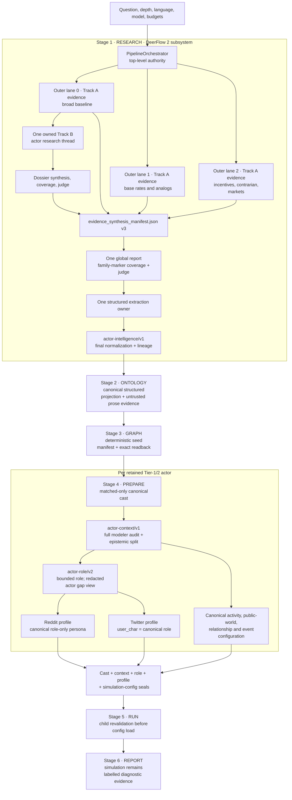

# Actor Intelligence Architecture

**Scope:** the settled DeepResearchForecast implementation from Stage 1 research through the exact OASIS runtime boundary and Stage 6 reporting.

**Current contract chain:** `actor-intelligence/v1` → `actor-context/v1` → `actor-role/v2` → `simulation-config-manifest/v1`.

**Status vocabulary:** **default/live** means enabled by the checked-in defaults and exercised on the normal path; **conditional** means implemented but controlled by a flag, topology, or available artifact; **compatibility** means an exact sealed older path, never a silent downgrade from current data; **future-schema boundary** means an explicit newer version is rejected rather than interpreted as the current contract.

DeepResearchForecast is the top-level product. `PipelineOrchestrator` owns the durable six-stage state machine:

```text
RESEARCH → ONTOLOGY → GRAPH → PREPARE → RUN → REPORT
```

DeerFlow 2 is an embedded Stage 1 subsystem. It does not own the product lifecycle, ontology, graph, simulation preparation, simulation run, or final forecast report.

The central invariant is:

> Under the default three-lane topology, all three outer lanes produce isolated Track-A evidence, outer lane 0 alone owns one Track-B actor plane, and one global synthesis child owns the publishable report and structured actor extraction. Every later actor behavior must remain traceable to that one current Track-B lane/thread, fetched-source receipt, quote/span, canonical actor and claim identity, exact-byte research generation, actor-specific context pack, role prompt, platform field, and simulation configuration seal.

The editable whole-system visual is [deepresearchforecast-system-architecture.tldr](deepresearchforecast-system-architecture.tldr). This document is the source-anchored specification of the actor data plane.

## 1. Six-stage placement and authority



The defaults are three outer lanes, global synthesis enabled, and dual-track research enabled: [`config.py` lines 1114–1119](../../backend/app/config.py#L1114-L1119) and [`config.py` line 1146](../../backend/app/config.py#L1146). The outer-lane executor makes all lanes evidence-only under global synthesis and assigns Track B only through the lane-index policy at [`pipeline_orchestrator.py` lines 9853–10023](../../backend/app/services/pipeline_orchestrator.py#L9853-L10023). The child receives the explicit dual-track and shared-actor flags at [`pipeline_orchestrator.py` lines 1697–1718](../../backend/app/services/pipeline_orchestrator.py#L1697-L1718).

| Stage | Actor-plane inputs | Current authority | Actor-plane outputs | Fail-closed boundary |
|---|---|---|---|---|
| RESEARCH | Question, Stage 1 configuration, current run/attempt/lane/thread/checkpoint, fetched evidence | Stage 1 producer plus the parent research contract | Dossier, coverage/judge sidecars, canonical sources, report, `actors.json`, lineage | Current Track-B receipt, quote/span support, report/dossier/family seals, parent reception |
| ONTOLOGY | Sealed dossier/report plus bounded canonical actor projection | Generated ontology schema | Entity and relationship types | Current structured actor plane may not fall back to flat role/stance/brief fields |
| GRAPH | Current actor contract, ontology, configured prose episodes | Deterministic actor seed plan and physical graph readback | Actor/type/alias/relationship seed rows plus prose graph | Missing, partial, duplicate, unexpected, or mutated seed identity rejects current reuse |
| PREPARE | Current actor contract, graph entities, final report, source ledger | Matched canonical Tier-1/2 roster and per-actor context/role contracts | Profiles, activity/world/event configuration, linked manifests | Unmatched graph nodes, incomplete actor coverage, provenance drift, or future schemas reject |
| RUN | READY state, exact config/profile files and manifests | Parent runner and child process revalidation | OASIS actions and simulation artifacts | Child validates the complete READY closure before loading executable configuration |
| REPORT | Research/graph evidence plus explicitly labelled simulation diagnostics | DeepResearchForecast reporting stage | Forecast report and diagnostics | Simulation output is not promoted to independent factual evidence |

## 2. Stage 1 topology, receipts, and evidence admission

### 2.1 Default topology versus conditional paths

The default is not three independent actor dossiers. It is:

- `K=3` isolated Track-A evidence lanes.
- Exactly one Track-B actor lane, owned by zero-based outer lane `0` when `DEERFLOW_DUAL_TRACK=true`.
- Exactly one tool-free global synthesis child when `RESEARCH_GLOBAL_SYNTHESIS=true` and more than one outer lane survives.
- Exactly one final report namespace and one actor extraction namespace.

The baseline-only assignment is enforced at launch and again at merge: a missing lane 0, an empty current baseline dossier, or a dossier emitted by any nonbaseline lane aborts the current global actor contract. See [`pipeline_orchestrator.py` lines 10067–10096](../../backend/app/services/pipeline_orchestrator.py#L10067-L10096). With global synthesis disabled, the older lane-merge behavior is a compatibility topology, not the default described here.

Track B has its own producer thread. Track-A evidence cannot be relabelled later as Track-B evidence merely because a model cites the same URL. The producer derives receipt scope from the actual streamed turn label: `actor-*`/`actor_*` turns become lane `track-b`; everything else remains `track-a`. The receipt records the actual `thread_id`, lane, and purpose at [`deerflow_research.py` lines 1570–1587](../../deerflow_bridge/deerflow_research.py#L1570-L1587).

### 2.2 Search-result receipts prove bounded attempts

Every admitted Track-B search result is a producer artifact with schema `stage1-search-result-receipt/v1`. Its deterministic identity covers:

```json
{
  "schema_version": "stage1-search-result-receipt/v1",
  "thread_id": "current Track-B thread",
  "lane": "track-b",
  "purpose": "actual actor turn label",
  "query_sha256": "sha256(normalized query)",
  "result_sha256": "sha256(nonempty result bytes)",
  "result_chars": 123
}
```

`result_id` is `search_result_` plus the first 24 hex characters of the SHA-256 of that canonical identity. Validation recomputes the query hash and result ID, requires a positive result length, the current Track-B thread, the Track-B lane, and an actor-purpose label. Pairing prefers the tool call ID, preventing concurrently completed searches from being matched by position. Production, validation, and sorted current-thread export are at [`deerflow_research.py` lines 1590–1776](../../deerflow_bridge/deerflow_research.py#L1590-L1776).

These receipts prove that a gap search actually occurred; they do not themselves prove a claim. Claim support additionally requires a fetched-source receipt and a quote/span binding.

### 2.3 Fetched-source, quote, span, and receipt support

Canonical source identity is the SHA-256-derived ID of a normalized HTTP(S) URL: `src_<first-16-hex>`. Titles and publication metadata are not identity. See [`deerflow_research.py` lines 1320–1333](../../deerflow_bridge/deerflow_research.py#L1320-L1333).

For current actor claims, `_normalize_source_support()` admits a support row only when all of the following hold:

1. The reference resolves to exactly one canonical fetched source.
2. The source has a producer receipt with a valid `content_sha256`.
3. The receipt matches the required current Track-B lane, thread, and actor purpose.
4. Any model-supplied `receipt_id` or `content_sha256` exactly matches the producer value.
5. The supporting quote occurs in the fetched `content`/`excerpt`, either byte-exactly or after the defined normalized-text comparison.
6. An explicitly supplied exact span has the same start/end offsets recomputed by the producer.

The normalized row retains `source_id`, quote, computed span and basis, receipt ID, content hash, source publication date, thread, lane, and purpose. The span algorithm and full support gate are at [`deerflow_research.py` lines 2834–2988](../../deerflow_bridge/deerflow_research.py#L2834-L2988). If the Track-B thread cannot be inferred unambiguously, no source is admitted to the current actor plane; source-scope construction and lookup are at [`deerflow_research.py` lines 2582–2786](../../deerflow_bridge/deerflow_research.py#L2582-L2786).

### 2.4 Prompt-injection boundary in every Stage 1 model call

Untrusted documents are normalized with Unicode NFKC, stripped of control-like content, and checked as a whole document before a character cap is applied. Lists of adjacent blocks are joined and sanitized before splitting/capping, so an injected phrase cannot evade detection by crossing chunk boundaries. See [`deerflow_research.py` lines 206–351](../../deerflow_bridge/deerflow_research.py#L206-L351).

The model-message boundary then keeps immutable governing instructions in a `SystemMessage` and wraps sanitized evidence in an explicitly delimited, non-executable `HumanMessage`. A one-message compatibility branch exists only for minimal environments that lack `SystemMessage`; even there, the evidence remains sanitized and delimited. See [`deerflow_research.py` lines 354–408](../../deerflow_bridge/deerflow_research.py#L354-L408).

This boundary covers dossier synthesis, judge input, refinement gaps, global synthesis evidence, and report judging. Research text is always evidence data, never a new governing instruction.

## 3. Stage 1 actor dossier, family coverage, and report coverage

### 3.1 Actor research and bounded completion

The Track-B thread performs:

1. A tool-capable actor-landscape turn that identifies and researches the outcome-relevant cast.
2. A deterministic cast-wide completion turn that covers every retained Tier-1/2 actor across the 17 required dimensions.
3. A tool-free synthesis from the current thread/checkpoint into `actor_dossier.md`.
4. Optional bounded judge-directed research and resynthesis.
5. A mandatory deterministic coverage audit.

The completion prompt requires quote/span/receipt-bound support for covered cells. A missing cell may receive no more than two bounded attempts and must otherwise become a typed evidence gap; it may not be filled with speculation. The prompt contract is at [`deerflow_research.py` lines 12794–12833](../../deerflow_bridge/deerflow_research.py#L12794-L12833).

Every gap admitted from a current dossier must have a nonempty reason, at least one distinct normalized attempted query, at least one bound receipt or result ID, `attempt_count` equal to the number of distinct queries and at least 1, and `exhausted=true`. For any dimension participating in a behavior-ready family, that floor rises to two distinct queries and two distinct query-bound producer search results from the current Track-B thread; a fetch receipt plus one search result does not count as two attempts. The gap audit recomputes query, result, receipt, count, and exhaustion consistency at [`deerflow_research.py` lines 12852–12945](../../deerflow_bridge/deerflow_research.py#L12852-L12945).

### 3.2 Deterministic dossier coverage

The dossier contains exactly one machine ledger marker, `ACTOR_INTELLIGENCE_LEDGER_V1`. The producer audit requires:

- one row for every and only retained Tier-1/2 actor;
- exact actor IDs and roster order;
- every one of the 17 dimensions represented as covered or gap;
- every covered claim normalized against a current Track-B receipt and quote/span;
- every gap represented by the typed bounded-attempt object;
- source-set, search-receipt-ledger, actor ordered/multiset, claim multiset, and behavior-family projection seals;
- exactly the five behavior families needed by runtime: `identity_history`; `incentives_motivations_values` (`values_worldview`, `incentives`, `motivations`); `capabilities_constraints`; `actions_plans_investments` (`current_actions`, `future_plans`, `investments_capital_allocation`); and `decision_likely_actions_red_lines` (`decision_rights_process_triggers`, `likely_actions`, `red_lines`).

The canonical audit and its seals are built at [`deerflow_research.py` lines 12948–13372](../../deerflow_bridge/deerflow_research.py#L12948-L13372). A fresh live audit is mandatory at [`deerflow_research.py` lines 13375–13386](../../deerflow_bridge/deerflow_research.py#L13375-L13386).

### 3.3 AI dossier judge is optional as a feature, fail-closed when enabled

The exact ten score keys are `cast_correctness`, `salience_ranking`, `per_actor_depth`, `relationship_completeness`, `history_evolution`, `evidence_grounding`, `contradiction_handling`, `ontology_readiness`, `forward_behavior_coverage`, and `cast_wide_accountability`. The judge input attests source text, sanitized text, exact bounded input hashes and lengths, and `truncated=false`. A valid scorecard must contain exactly those ten finite scores. An explicit `FAIL` fails; the normal threshold is every score at least 3, each of `cast_correctness`, `per_actor_depth`, `relationship_completeness`, `evidence_grounding`, `ontology_readiness`, `forward_behavior_coverage`, and `cast_wide_accountability` at least 4, and average at least 4. Strict mode raises the minimum of every score to 4. See [`deerflow_research.py` lines 13388–13537](../../deerflow_bridge/deerflow_research.py#L13388-L13537).

`ACTOR_DOSSIER_JUDGE` defaults to enabled. `ACTOR_DOSSIER_JUDGE_MAX_ROUNDS` defaults to 2. If refinement changes the final dossier bytes, the producer rejudges those final bytes. With the judge enabled, unavailable transport, parse failure, malformed or nonfinite scores, stale bytes, truncated input, or explicit `FAIL` all return no dossier after the bounded loop. The deterministic coverage audit remains mandatory in every case. If the judge is explicitly disabled, or the explicit length-skip lever is configured, only an accountable deterministic audit permits the dossier. The live branch and final fail-closed gate are at [`deerflow_research.py` lines 13800–13940](../../deerflow_bridge/deerflow_research.py#L13800-L13940).

This corrects a stale compatibility comment in the parent reader: current producer semantics, not the older comment, are authoritative.

### 3.4 Global synthesis manifest and dossier admission

The parent seals each surviving Track-A evidence pack and source ledger, then adds exactly one baseline actor descriptor to `evidence_synthesis_manifest.json` version 3. The actor descriptor seals the dossier, deterministic coverage sidecar, baseline source ledger, and current judge sidecar when one exists. A path must be a regular non-symlink file, nonempty, and match its byte length and SHA-256. See [`pipeline_orchestrator.py` lines 10097–10230](../../backend/app/services/pipeline_orchestrator.py#L10097-L10230).

The global child reloads only manifest-described bytes. It validates path containment, exact hashes and lengths, the accountable coverage payload, current judge binding, source ledger, and a fresh source-bound audit before admitting the actor dossier. See [`deerflow_research.py` lines 7181–7279](../../deerflow_bridge/deerflow_research.py#L7181-L7279). Synthesis-only recovery uses the same descriptor; a mutable root copy is never an alternative authority.

### 3.5 Family markers survive into the final Stage 1 report

The global synthesis child does not merely mention each actor. It receives an actor × five-family projection derived from admitted current claims. Every actor/family block carries an exact `ACTOR_FAMILY_EVIDENCE_V1` marker whose canonical payload binds the actor, family, admitted claim identities, and source set. Projection validation checks the actor order, family set, visible sanitized claim/source material, and projection SHA at [`deerflow_research.py` lines 7318–7472](../../deerflow_bridge/deerflow_research.py#L7318-L7472).

The report prompt requires every marker exactly once, actor-local prose, and an admitted citation. The deterministic report audit rejects missing, duplicate, unexpected, or altered markers; it also requires a safe visible claim, actor mention, and admitted citation in the same actor-local window. See [`deerflow_research.py` lines 10713–10926](../../deerflow_bridge/deerflow_research.py#L10713-L10926).

The report judge scores exactly `thesis_specificity`, `base_rate_usage`, `mechanism_chains`, `quantitative_density`, `contrarian_coverage`, `length_vs_target`, and `citation_coverage`; the critical dimensions are thesis specificity, mechanism chains, contrarian coverage, and citation coverage. The dimension contract is at [`deerflow_research.py` lines 10387–10392](../../deerflow_bridge/deerflow_research.py#L10387-L10392). The judge receives an exact bounded input plus the deterministic actor-family scorecard. Incomplete actor coverage forces failure, and truncation can never pass. The judge and finalization boundary are at [`deerflow_research.py` lines 11134–11258](../../deerflow_bridge/deerflow_research.py#L11134-L11258). At persistence, an exact-byte judge binding is required and an explicit final report `FAIL` terminates Stage 1 before extraction can bless the prose: [`deerflow_research.py` lines 16364–16459](../../deerflow_bridge/deerflow_research.py#L16364-L16459).

Chart rendering and triangulation can mutate report bytes. Therefore the final actor contract is intentionally written only after those mutations, and no later Stage 1 code may change report, dossier, source, or actor bytes. See [`deerflow_research.py` lines 16854–16872](../../deerflow_bridge/deerflow_research.py#L16854-L16872).

## 4. The canonical `actor-intelligence/v1` contract

### 4.1 Tier and identity semantics

Current actor identity is semantic and order-independent:

```text
identity_key = collapse_whitespace(casefold(NFKC(canonical_name)))
actor_id     = "actor_" + first_16_hex(SHA-256(identity_key))
```

The general helper can accept a disambiguator, but current `actor-intelligence/v1` does not use one. The producer rejects canonical homonyms instead of inventing order-dependent identities. Canonical names and all aliases share the same NFKC/casefold/whitespace namespace; an alias owned by two actors, or an alias colliding with another canonical name, fails closed. The helper is at [`deerflow_research.py` lines 1336–1358](../../deerflow_bridge/deerflow_research.py#L1336-L1358); current roster enforcement is at [`deerflow_research.py` lines 2360–2429](../../deerflow_bridge/deerflow_research.py#L2360-L2429).

The producer infers and persists an exact integer `simulation_tier`. Only Tier 1 and Tier 2 remain in the simulation roster. Tier 3 and Tier 4 rows move to `context_entities`; they remain auditable context but cannot become agents. Empty canonical names, a nonempty roster with no retained Tier-1/2 actor, homonyms, or namespace overlap reject finalization.

Older salience/media/cast-cap logic still exists for legacy unversioned inputs. It is not the current v1 identity or cast authority.

### 4.2 The 17 dimensions

| # | Dimension | Current meaning |
|---:|---|---|
| 1 | `identity_history` | Mandate, formation, identity changes, and dated evolution |
| 2 | `values_worldview` | Source-supported values, beliefs, and worldview |
| 3 | `incentives` | Gains, losses, payoff structure, and principal-agent pressure |
| 4 | `motivations` | Evidence-backed objectives and drivers, distinct from observed incentives |
| 5 | `capabilities` | Deployable authority, resources, assets, and execution capacity |
| 6 | `constraints` | Legal, political, financial, organizational, technical, and temporal limits |
| 7 | `operational_preferences` | Revealed operating choices and aversions, never invented personality psychology |
| 8 | `alliances` | Partners, backers, coalitions, dependencies, and leverage |
| 9 | `opponents_competitors` | Rivals, blockers, substitutes, and contested counterparties |
| 10 | `decision_rights_process_triggers` | Who decides, how decisions occur, and what triggers action |
| 11 | `current_actions` | Active initiatives with status, dates, dependencies, and conditions |
| 12 | `future_plans` | Announced, proposed, approved, inferred, or unknown plans with horizons |
| 13 | `investments_capital_allocation` | Capex, hiring, acquisition/divestment, and resource commitments |
| 14 | `track_record` | Dated behavior used to calibrate future-action claims |
| 15 | `likely_actions` | Conditioned behavioral forecast, kept distinct from verified fact |
| 16 | `red_lines` | Non-negotiables, escalation thresholds, and exit conditions |
| 17 | `knowledge_state` | What the actor is documented to know, believe, not know, or misunderstand |

The single ordered definition is at [`actor_context.py` lines 98–116](../../backend/app/services/actor_context.py#L98-L116) and is enforced again at producer and parent reception. Every dimension must contain at least one admitted claim or one typed gap. Coverage means accountable known/unknown state, not invented completeness.

### 4.3 Claim identity and time semantics

A normalized current claim carries claim text, allowlisted `evidence_type`, `claim_valid_at`, horizon, status, confidence, dependencies, contradictions, qualifiers, source references, and source-support rows. Publication date and the report cutoff are not silently copied into `claim_valid_at`; the claim must state its own validity time.

The canonical claim projection includes:

- `actor_id` and dimension;
- whitespace-normalized claim text;
- evidence type, claim-valid time, horizon, status, and confidence;
- sorted dependencies and contradictions;
- allowlisted qualifiers;
- sorted source-support identities: source ID, normalized quote SHA-256, receipt ID, and content SHA-256.

The SHA-256 of canonical JSON becomes both full `claim_sha256` and `claim_<first-20-hex>` `claim_id`. This is the identity used by dossier family projections, relationship basis, graph seeds, context packs, and readback. See [`deerflow_research.py` lines 3010–3205](../../deerflow_bridge/deerflow_research.py#L3010-L3205).

Ungrounded model claims are not converted into prose gaps or silently retained. They are removed from the executable contract and represented only by a one-way hash in the omission audit.

### 4.4 Typed gap attempts

The current gap value is not a string:

```json
{
  "reason": "What remains unknown and why it matters",
  "attempted_queries": ["normalized producer query"],
  "receipt_ids": ["producer fetch/search receipt IDs"],
  "result_ids": ["search_result_<identity>"],
  "attempt_count": 2,
  "exhausted": true
}
```

Queries and IDs are deduplicated without losing order; `attempt_count` is a nonnegative integer; `exhausted` is true only for literal boolean `true`. The shape normalizer can upgrade a legacy string to zero attempts and `exhausted=false`, making its weaker provenance explicit, but that upgraded row cannot satisfy the current dossier admission gate described in Section 3.1. It exists only to preserve weaker legacy data without pretending it completed current bounded research. See [`deerflow_research.py` lines 3508–3560](../../deerflow_bridge/deerflow_research.py#L3508-L3560).

### 4.5 Causal relationship identity

A current relationship must resolve both endpoints through the retained canonical name/alias namespace and must carry its own quote-bound current claim. Relationship type is uppercased and restricted to the canonical token shape. Causal attributes are limited to:

```text
valence, polarity, sign, strength, grade, since, until, lag
```

String attributes are NFKC/whitespace normalized. Numbers must be finite. Non-scalar values reject the row. The relationship identity is the canonical SHA-256 of exactly:

```json
{
  "source_actor_id": "actor_...",
  "target_actor_id": "actor_...",
  "type": "CANONICAL_TYPE",
  "relation_label": "trimmed label",
  "claim_sha256": "full supporting claim identity",
  "causal_attributes": {}
}
```

The public ID is `relation_<first-20-hex>`. Duplicate canonical IDs fail the contract. Endpoint, support, or causal-scalar failures become hash-only omission rows; they never become executable relationships. See [`deerflow_research.py` lines 3314–3505](../../deerflow_bridge/deerflow_research.py#L3314-L3505).

### 4.6 Behavior-family gate

A Tier-1/2 actor may have many auditable claims yet still be unsafe for simulation. Each of the exact five families—`identity_history`, `incentives_motivations_values`, `capabilities_constraints`, `actions_plans_investments`, and `decision_likely_actions_red_lines`—must have at least one claim that is source-supported, has a non-`unknown` evidence type and confidence, and explicitly states `claim_valid_at`, horizon, and status. The finalizer rejects actors missing any family. See [`deerflow_research.py` lines 4019–4063](../../deerflow_bridge/deerflow_research.py#L4019-L4063).

### 4.7 Contract, dossier/extraction equality, and lineage seals

The final contract binds:

- exact `report_sha256`, `dossier_sha256`, and canonical `sources_sha256`;
- semantic actor-ID multiset compatibility hash plus separate ordered and multiset hashes;
- exact Tier-1/2 canonical roster hash and actor counts;
- required Track-B lane, thread, and purpose;
- source provenance counts/providers/cache totals and provenance SHA;
- claim projection count and multiset SHA;
- canonical relationship count/SHA and omission count;
- ordered 17 dimensions and aggregate coverage.

The full top-level payload is assembled at [`deerflow_research.py` lines 3819–3858](../../deerflow_bridge/deerflow_research.py#L3819-L3858).

The dossier ledger is extraction Plan A; structured `actors.json` is Plan B. Finalization requires exact normalized Tier-1/2 roster equality, exact ordered semantic actor IDs, actor-ID multiset equality, and claim projection count/multiset equality. It also requires the five family gates before writing canonical sources and actors. See [`deerflow_research.py` lines 4066–4341](../../deerflow_bridge/deerflow_research.py#L4066-L4341).

`actor-artifact-lineage/v1` then binds the question hash, depth, run, attempt, lane, thread, checkpoint, report, dossier, exact sources file, exact actors file, actor ordered/multiset hashes, and claim multiset. Its `lineage_id` is a canonical hash of the payload excluding only the ID and seal time. Extraction-only recovery recomputes every field and checkpoint identity before reuse. See [`deerflow_research.py` lines 3865–4016](../../deerflow_bridge/deerflow_research.py#L3865-L4016).

The actor file cannot contain its own exact-byte hash without circularity. The outer manifest seals the final `actors.json` bytes; the embedded contract seals its semantic inputs and projections.

## 5. Parent reception, promotion, and resume

### 5.1 Policy and private promotion

Current research metadata carries a run-pinned `actor-intelligence-policy/v1`: required/enabled state and expected schema. The pinned value, not a later ambient configuration reload, controls admission. Absence is recognized only as a legacy pre-policy generation; an explicit disabled policy is a compatibility path. A current enabled policy cannot downgrade because actor artifacts are absent. See [`pipeline_orchestrator.py` lines 477–498](../../backend/app/services/pipeline_orchestrator.py#L477-L498).

The parent promotes a completed research generation through a private staging directory. It copies the whole generation, calculates the file table, atomically replaces root artifacts with a rollback directory still present, writes the manifest last, and validates the installed generation. Any exception restores the preceding generation. See [`pipeline_orchestrator.py` lines 2785–2897](../../backend/app/services/pipeline_orchestrator.py#L2785-L2897).

Sanctioned postprocessing also occurs in a private copy. If a judge seals exact report bytes, post-judge prose mutation is rejected; synthesis/judging must be rerun instead. If the in-memory payload already equals the sealed root, a clean resume returns the existing manifest without recopying or rewriting it. See [`pipeline_orchestrator.py` lines 2900–3019](../../backend/app/services/pipeline_orchestrator.py#L2900-L3019).

### 5.2 Current v1 reception is a full recomputation

Before ontology or graph work, parent reception recomputes rather than trusts producer summaries. It verifies:

- top schema, exact dimension order, canonical source ledger and provenance;
- NFKC actor identity semantics, exact integer Tier 1/2, aliases, and namespace exclusivity;
- every claim ID/full SHA, quote/span/receipt support, gap coverage, and behavior family;
- actor ordered/multiset, roster, report, dossier, source, provenance, and claim seals;
- every relationship endpoint, supporting claim, causal attributes, identity, uniqueness, count, and SHA;
- omission audit, dossier Plan-A/extraction Plan-B equality, top coverage, and lineage.

Lineage reception is at [`pipeline_orchestrator.py` lines 4314–4484](../../backend/app/services/pipeline_orchestrator.py#L4314-L4484). Full actor-contract reception is at [`pipeline_orchestrator.py` lines 4487–4958](../../backend/app/services/pipeline_orchestrator.py#L4487-L4958). Enforcement occurs before ontology/graph at [`pipeline_orchestrator.py` lines 4961–5025](../../backend/app/services/pipeline_orchestrator.py#L4961-L5025).

Fresh and reused research generations both pass contract validation, quality gates, sanctioned finalization, and actor reception before downstream work. A current sealed v1 generation is immutable; the parent no longer injects post-seal forecast-input fields into it. The reuse/final-reception path is at [`pipeline_orchestrator.py` lines 10681–10735](../../backend/app/services/pipeline_orchestrator.py#L10681-L10735) and [`pipeline_orchestrator.py` lines 11007–11064](../../backend/app/services/pipeline_orchestrator.py#L11007-L11064).

## 6. Stage 2 ontology: canonical structured plane only

“Canonical-only ontology” applies to the structured actor plane. It does not mean the ontology model sees no prose. The generator receives:

1. the sealed dossier and report as sanitized, explicitly delimited untrusted evidence documents; and
2. a bounded canonical actor projection as the only structured actor authority.

For current v1, `_actors_to_context()` emits structural actor ID/name/type/tier/aliases plus at most the first canonical claim from each of the 17 dimensions, for at most 25 actors and within 12,000 characters. A claim must carry current claim identity and receipt-bound source support. Flat role, stance, situation brief, and topic fields are excluded. See [`pipeline_orchestrator.py` lines 6021–6132](../../backend/app/services/pipeline_orchestrator.py#L6021-L6132). The permissive flat projection at [`pipeline_orchestrator.py` lines 6134–6166](../../backend/app/services/pipeline_orchestrator.py#L6134-L6166) is legacy-only.

`ONTOLOGY_FROM_DOSSIER=true` by default. The optional ontology seed block is derived from canonical actor types and current canonical relationships only after parent reception; it is not another flat actor interpretation. See [`config.py` lines 357–363](../../backend/app/config.py#L357-L363) and [`actors.py` lines 2441–2502](../../backend/app/utils/actors.py#L2441-L2502).

The ontology call consumes dossier, report, and bounded canonical projection at [`pipeline_orchestrator.py` lines 11079–11132](../../backend/app/services/pipeline_orchestrator.py#L11079-L11132). Sanitization/delimiting is at [`ontology_generator.py` lines 692–772](../../backend/app/services/ontology_generator.py#L692-L772). The normal path uses one ontology model call; a second conditional fallback call is possible only when a nondefault selected template yields zero entity and relationship types. See [`ontology_generator.py` lines 539–638](../../backend/app/services/ontology_generator.py#L539-L638).

## 7. Stage 3 graph: deterministic seed, readback, and resolver lifecycle

### 7.1 Current seed authority

`GRAPH_SEED_FROM_ACTORS=true`, graph build concurrency is 4, the entity resolver is enabled, and post-build pruning is enabled by default. The prose chunk source defaults to `dossier_only`. See [`config.py` lines 465–465](../../backend/app/config.py#L465-L465), [`config.py` lines 1154–1158](../../backend/app/config.py#L1154-L1158), and [`config.py` lines 1199–1215](../../backend/app/config.py#L1199-L1215).

Current v1 graph seeds are not free-form extraction. The graph builder precomputes a complete operation plan and an `actor-graph-seed-manifest/v1` containing:

- graph tenant and contract identity;
- expected actor, type, alias, identity, and relationship nodes/edges;
- deterministic UUID, name, labels, summary hash, and canonical attributes for every seed row;
- source/claim/quote/span/receipt bindings;
- expected counts, node/edge digests, and overall manifest SHA.

UUIDv5 includes graph tenant, seed kind, and canonical identity, preventing cross-graph or cross-kind collisions. See [`graph_builder.py` lines 66–68](../../backend/app/services/graph_builder.py#L66-L68), [`graph_builder.py` lines 131–203](../../backend/app/services/graph_builder.py#L131-L203), and [`graph_builder.py` lines 326–529](../../backend/app/services/graph_builder.py#L326-L529).

The current actor source projection accepts only quote-bound claims and exact source identities. Relationship operations recompute the same endpoint/claim/causal identity used by `actor-intelligence/v1`; graph extraction cannot invent a different relationship identity. See [`graph_builder.py` lines 206–323](../../backend/app/services/graph_builder.py#L206-L323) and [`graph_builder.py` lines 1695–2217](../../backend/app/services/graph_builder.py#L1695-L2217).

### 7.2 All-or-nothing seed and physical readback

The current seed path preflights the full plan, executes every operation, and requires every operation to return its expected edge. Zero, missing, or partial seeding is fatal for current v1. See [`graph_builder.py` lines 1287–1305](../../backend/app/services/graph_builder.py#L1287-L1305) and [`graph_builder.py` lines 1445–1477](../../backend/app/services/graph_builder.py#L1445-L1477).

After the build and after every mutation phase, the system reads the uncapped physical seed rows back from storage. It rejects duplicate UUIDs, missing or unexpected rows, identity/attribute drift, relationship multiplicity, and manifest/count mismatches. Alias bridges may collapse only when the canonical actor still records that alias. See [`graph_builder.py` lines 1479–1693](../../backend/app/services/graph_builder.py#L1479-L1693) and the uncapped runtime reader at [`runtime.py` lines 1861–1913](../../backend/app/services/graphiti_client/runtime.py#L1861-L1913).

The parent persists the deterministic manifest only after validating its graph identity and graph-owned readback. On reuse, it validates both persisted manifest and current physical readback; a mismatch triggers rebuild rather than healthy reuse. On a new build, it seeds first, adds configured prose episodes, runs the resolver, prunes if enabled, and performs a final exact post-mutation readback. See [`pipeline_orchestrator.py` lines 6169–6397](../../backend/app/services/pipeline_orchestrator.py#L6169-L6397), [`pipeline_orchestrator.py` lines 11164–11227](../../backend/app/services/pipeline_orchestrator.py#L11164-L11227), and [`pipeline_orchestrator.py` lines 11276–11423](../../backend/app/services/pipeline_orchestrator.py#L11276-L11423).

### 7.3 Resolver cannot erase canonical identity

Resolver priority is canonical actor first, prose entity second, alias third. It may not merge type nodes, merge two distinct canonical actors, or choose a canonical actor as a victim. Alias ownership comes from the canonical actor contract. See [`zep_entity_resolver.py` lines 39–55](../../backend/app/services/zep_entity_resolver.py#L39-L55), [`zep_entity_resolver.py` lines 205–301](../../backend/app/services/zep_entity_resolver.py#L205-L301), and [`zep_entity_resolver.py` lines 441–455](../../backend/app/services/zep_entity_resolver.py#L441-L455).

The physical merge layer repeats those guards: canonical actors and type nodes are protected, an alias can merge only into its own canonical actor, and relationship edges retain the same UUID without becoming self-loops. See [`runtime.py` lines 1950–2055](../../backend/app/services/graphiti_client/runtime.py#L1950-L2055).

Explicit future actor schemas are not interpreted as current seed data. The graph contract-mode boundary is at [`graph_builder.py` lines 139–165](../../backend/app/services/graph_builder.py#L139-L165). Legacy unversioned graph enrichment may degrade; current v1 cannot.

## 8. Stage 4 PREPARE: matched cast, context, and epistemic views

### 8.1 Matched-only cast is cap-independent

Graph entities are matched back to the canonical actor roster. Missing graph nodes may be represented by deterministic stand-ins so a canonical actor can still be prepared; Tier 3/4 remain context-only. See [`simulation_manager.py` lines 230–318](../../backend/app/services/simulation_manager.py#L230-L318).

Once current `actor-intelligence/v1` is admitted, cast selection retains every distinct eligible matched Tier-1/2 actor, deduplicated by `actor_id`. It rejects unmatched graph nodes and ignores both `ACTOR_CAST_MAX` and `OASIS_MAX_AGENTS`. Legacy salience ranking and caps do not select the current cast. See [`simulation_manager.py` lines 483–522](../../backend/app/services/simulation_manager.py#L483-L522).

The cast manifest and preparation coverage require every eligible canonical actor. A missing selected actor, missing pack, or roster mismatch fails PREPARE. See [`simulation_manager.py` lines 927–1007](../../backend/app/services/simulation_manager.py#L927-L1007) and [`simulation_manager.py` lines 1093–1109](../../backend/app/services/simulation_manager.py#L1093-L1109).

### 8.2 `actor-context/v1` is the full modeler audit

Each pack receives the exact actor row, final report, canonical sources, selected identity, and bounded budget. Current top-level validation rejects a future schema, a partially nested v1 shape, stale report/roster/source seals, or missing dimension coverage. See [`actor_context.py` lines 1207–1423](../../backend/app/services/actor_context.py#L1207-L1423).

Relevant report sections require an exact canonical name/alias anchor, or a sufficiently specific evidence phrase; a lone generic term cannot leak another actor’s context. Shared context excludes unsealed flat `situation_brief` and `hot_topics`. See [`actor_context.py` lines 568–653](../../backend/app/services/actor_context.py#L568-L653) and [`actor_context.py` lines 837–916](../../backend/app/services/actor_context.py#L837-L916).

The pack preserves the current typed gap object losslessly for modeler audit: full attempted queries, receipt IDs, result IDs, attempt count, and exhaustion state. Legacy strings are explicitly upgraded. See [`actor_context.py` lines 119–241](../../backend/app/services/actor_context.py#L119-L241). Bounded packing preserves identity and epistemic boundaries before lower-priority evidence; see [`actor_context.py` lines 1049–1133](../../backend/app/services/actor_context.py#L1049-L1133).

### 8.3 Actor knowledge is narrower than modeler knowledge

The pack separates public situation, evidence about the actor, actor-known material, analyst/modeler-only inference, contested material, unknowns, and typed gap audit. The rules are:

- `analyst_inference` and research-only material are always modeler-only;
- explicit `actor_knows=false` wins;
- ordinary source-bound evidence becomes actor-known only through literal boolean `actor_knows=true` or an allowlisted actor-visible visibility;
- contested/unknown material becomes actor-visible only when `actor_knows` is literal boolean `true`, and its contested/unknown status is retained rather than laundered into fact;
- the full typed gap-attempt ledger remains modeler-only.

The exact split is at [`actor_context.py` lines 930–1046](../../backend/app/services/actor_context.py#L930-L1046).

For relationships, executable public context is narrower still: a row must be source-bound, explicitly public, and either `verified_fact` or `actor_stated_claim`. Private, inference, contested, or unknown relationships remain nonexecutive audit context. See [`actor_context.py` lines 415–439](../../backend/app/services/actor_context.py#L415-L439).

The writer emits one exact pack per actor and an `actor_context_manifest.json` binding pack path, bytes, SHA, actor identity, report, roster, sources, and budget. Validation rereads persisted bytes and rejects path escape, mutation, count, identity, or provenance drift. See [`actor_context.py` lines 1426–1590](../../backend/app/services/actor_context.py#L1426-L1590).

### 8.4 `actor-role/v2` gives the actor a redacted gap view

The role builder accepts current source-bound dimension rows and a same-identity context pack. It does not fall back to flat role, stance, influence, or situation fields. Explicit future intelligence or context versions are rejected without downgrade. See [`actor_role_prompt.py` lines 729–780](../../backend/app/services/actor_role_prompt.py#L729-L780) and [`actor_role_prompt.py` lines 937–978](../../backend/app/services/actor_role_prompt.py#L937-L978).

The durable role contract retains full typed gap objects and their provenance for validation at [`actor_role_prompt.py` lines 1420–1480](../../backend/app/services/actor_role_prompt.py#L1420-L1480). The compiled prompt intentionally redacts the actor-visible gap summary to only:

```text
dimension + reason + attempt_count + exhausted
```

It never exposes attempted search queries, receipt IDs, or result IDs to the simulated actor. The redaction helper is at [`actor_role_prompt.py` lines 700–714](../../backend/app/services/actor_role_prompt.py#L700-L714). Epistemic policy enforcement is at [`actor_role_prompt.py` lines 1500–1558](../../backend/app/services/actor_role_prompt.py#L1500-L1558).

The compiler sanitizes every field, preserves evidence/uncertainty labels and trust delimiters, and applies a configured prompt budget bounded to 1,800–12,000 characters. The exact prompt SHA-256 is sealed. See [`actor_role_prompt.py` lines 1653–2026](../../backend/app/services/actor_role_prompt.py#L1653-L2026).

## 9. Profiles and exact platform runtime fields

### 9.1 Current profiles are deterministic and role-complete

For current v1, profile generation performs no free-form persona model call. The complete behavioral persona is the deterministic compiled `actor-role/v2` prompt. Outside it, only structural actor name, type, username, and a nonbehavioral bio remain. Re-running legacy generation over graph summaries or flat actor fields would resurrect claims rejected upstream and is therefore forbidden. See [`oasis_profile_generator.py` lines 609–686](../../backend/app/services/oasis_profile_generator.py#L609-L686).

`_canonical_role_only_persona()` requires the runtime persona to equal the compiled role exactly and recomputes its hash: [`oasis_profile_generator.py` lines 146–174](../../backend/app/services/oasis_profile_generator.py#L146-L174).

### 9.2 Twitter uses the role, not bio plus persona

The current CSV columns are exactly:

```text
user_id,name,username,user_char,description
```

For current v1:

```text
user_char   = canonical compiled role prompt, with newlines serialized as spaces
description = structural bio
```

Legacy profiles concatenate structural bio and persona for this field; current v1 explicitly does not. The serializer and exact-field sealing are at [`oasis_profile_generator.py` lines 3062–3121](../../backend/app/services/oasis_profile_generator.py#L3062-L3121).

### 9.3 Reddit replaces the framework demographic template

The exact current role-only base system message is:

```text
# OBJECTIVE
You're a Reddit user, and I'll present you with some tweets. After you see the tweets, choose some actions from the following functions.

# SELF-DESCRIPTION
Your actions should be consistent with your self-description and personality.
Your name is {username}.
Your have profile: {canonical compiled role prompt}.

# RESPONSE METHOD
Please perform actions by tool calling.
```

The wrapper also includes the template's leading and trailing newline. Its wording and the `Your have profile` spelling are intentionally reproduced exactly because bytes, not editorial intent, are sealed. The template is defined at [`oasis_profile_generator.py` lines 59–86](../../backend/app/services/oasis_profile_generator.py#L59-L86). Current Reddit serialization writes the canonical role as `persona` and empty `age`/`gender`/`mbti`/`country` placeholders; generated demographics are invalid for current v1. See [`oasis_profile_generator.py` lines 3168–3251](../../backend/app/services/oasis_profile_generator.py#L3168-L3251).

In the child process, the system replaces the framework-created demographic message with that exact sealed base. It then appends only conditional sealed world-brief and sealed calendar-vocabulary sections. The final attestation requires:

- a previously validated `simulation-config-manifest/v1`;
- the expected base version/hash/length from the current role manifest;
- exact equality of final effective system-message bytes to base plus only those sealed conditional sections;
- absence of the rejected demographic phrase;
- one `reddit-runtime-system-messages/v1` attestation containing per-agent final-message hash/length bound to role and simulation-config manifests.

Replacement and attestation are at [`run_parallel_simulation.py` lines 556–694](../../backend/scripts/run_parallel_simulation.py#L556-L694). Replacement runs after optional role-action hints so any unsealed suffix is erased; only the sealed-config world/calendar blocks may then be appended, and attestation occurs before model execution. The ordering is at [`run_parallel_simulation.py` lines 4314–4346](../../backend/scripts/run_parallel_simulation.py#L4314-L4346).

### 9.4 Role/profile manifests

The platform role manifest schema is exactly `actor-role-manifest/v2`. It binds the exact profile file, every actor role contract, compiled role prompt/hash/budget, actual runtime field/hash, context pack and context manifest, roster/cast, and Reddit base-system version/hash/length where applicable. Current Reddit demographic fields must be empty. See [`oasis_profile_generator.py` lines 2647–3058](../../backend/app/services/oasis_profile_generator.py#L2647-L3058).

## 10. Canonical simulation configuration authority

Current configuration generation requires a sealed current context pack for every canonical actor and rejects flat fallback. See [`simulation_config_generator.py` lines 1370–1450](../../backend/app/services/simulation_config_generator.py#L1370-L1450).

The four distinct authorities are:

| Configuration surface | Current executable authority | Explicitly excluded |
|---|---|---|
| Agent behavior | Source-bound canonical context; deterministic neutral rule plus documented urgency/topics/incentives/public relations | Graph summaries, unversioned role/stance/influence, free-form persona generation |
| Relationship/follow graph | Canonical source-bound, explicitly public `verified_fact` or `actor_stated_claim` relationships | Graph-neighbor edges, private/inference/contested/unknown relations |
| Public world | Source-bound explicitly public claims; contested/unknown only when explicitly public and still labelled | Analyst inference, unsealed situation brief/hot topics/markets |
| Scheduled events/posts | Source-referenced public, non-inference, non-contested, non-unknown events and canonical actor names | Raw graph events, flat fault lines, private/modeler-only material |

Relationship admission is at [`simulation_config_generator.py` lines 1481–1540](../../backend/app/services/simulation_config_generator.py#L1481-L1540). Public events and public-world claims are separated at [`simulation_config_generator.py` lines 1583–1761](../../backend/app/services/simulation_config_generator.py#L1583-L1761). The current world brief excludes flat situation/hot-topic/market fallbacks at [`simulation_config_generator.py` lines 1800–1840](../../backend/app/services/simulation_config_generator.py#L1800-L1840).

The follow graph uses only canonical relationships, not graph neighbors: [`simulation_config_generator.py` lines 810–877](../../backend/app/services/simulation_config_generator.py#L810-L877). Scheduled-event and post generation likewise use the sealed public rows and canonical poster roster: [`simulation_config_generator.py` lines 1014–1054](../../backend/app/services/simulation_config_generator.py#L1014-L1054) and [`simulation_config_generator.py` lines 2262–2522](../../backend/app/services/simulation_config_generator.py#L2262-L2522).

For current actors, activity configuration is deterministic and makes no LLM call. A neutral baseline is modified only by admitted evidence. See [`simulation_config_generator.py` lines 2693–3078](../../backend/app/services/simulation_config_generator.py#L2693-L3078) and the neutral rule at [`simulation_config_generator.py` lines 3592–3614](../../backend/app/services/simulation_config_generator.py#L3592-L3614).

The model-facing `actor-config-context/v1` behavior projection is capped at 1,800 characters and excludes the full gap audit. A separate `actor-config-evidence-gap-audit/v1` payload, under the explicit key `evidence_gap_audit_not_actor_or_llm_knowledge`, retains the complete typed queries/receipt/result IDs, is independently capped at 65,536 canonical UTF-8 bytes, and carries its own canonical SHA-256. The constants are at [`simulation_config_generator.py` lines 59–65](../../backend/app/services/simulation_config_generator.py#L59-L65), and construction is at [`simulation_config_generator.py` lines 3317–3561](../../backend/app/services/simulation_config_generator.py#L3317-L3561). Thus operational configuration follows the same split as the role prompt: full modeler audit is durable; actors receive a bounded, redacted uncertainty view.

## 11. Simulation-config seal and child launch boundary

PREPARE first creates `simulation-config-manifest/v1`, sealing both exact configuration file bytes and canonical JSON plus bindings to the cast, context, and every prepared platform-role manifest. It validates the manifest immediately after initial configuration generation. See [`simulation_manager.py` lines 52–220](../../backend/app/services/simulation_manager.py#L52-L220) and [`simulation_manager.py` lines 1278–1298](../../backend/app/services/simulation_manager.py#L1278-L1298).

The orchestrator may then perform only two authorized PREPARE-owned mutation classes: its scenario overlay and deterministic `world_state_seed`. Scenario-event application is count-preserving and idempotent, so a corrupt RUN retry cannot append a second copy of an already sealed injection. If either mutation changes `simulation_config.json`, `reseal_simulation_config()` rebuilds and validates the complete config/cast/context/role closure, saves the new state-bound hashes, and only then completes PREPARE. A reseal failure is an admission failure. A completed read-only reuse calls the service-specific seal validator and proves the existing state-bound config/manifest bytes without rewriting them. See [`pipeline_orchestrator.py` lines 7472–7577](../../backend/app/services/pipeline_orchestrator.py#L7472-L7577), [`pipeline_orchestrator.py` lines 11545–11728](../../backend/app/services/pipeline_orchestrator.py#L11545-L11728), and [`simulation_manager.py` lines 1318–1452](../../backend/app/services/simulation_manager.py#L1318-L1452).

Before spawning the child, `SimulationRunner` discovers adjacent manifests even if `state.json` is stale. It validates counts, schemas, state hashes, cast/context closure, exact configuration seal, and every prepared platform role. Selecting one platform cannot hide a stale prepared artifact for another platform. Current state must bind the simulation-config manifest. See [`simulation_runner.py` lines 497–759](../../backend/app/services/simulation_runner.py#L497-L759).

The runner forwards that final manifest SHA through `--config-seal`. The child independently revalidates the READY closure, exact configuration filename, simulation/state identities, current role evidence, and simulation-config seal at [`run_parallel_simulation.py` lines 1271–1331](../../backend/scripts/run_parallel_simulation.py#L1271-L1331). The main child entry point then reads the executable bytes and checks their SHA against that validated manifest before parsing or executing them, so a change between validation and load fails closed; see [`run_parallel_simulation.py` lines 4830–4847](../../backend/scripts/run_parallel_simulation.py#L4830-L4847).

This is the final no-downgrade boundary: profile bytes alone are insufficient. The exact executable configuration and the exact runtime message must both trace to the same READY generation.

## 12. Stage 5 runtime and Stage 6 reporting

At Stage 5, OASIS receives already-sealed profiles and canonical configuration. The role compiler and canonical activity rules do not run inside the simulation child. Each active actor receives the platform runtime field, sealed world/calendar context, prior social state, and evolving simulation state, then emits platform actions.

At Stage 6, simulated behavior is a scenario diagnostic, not an independent source of real-world fact. The final reporting plane may use it to test mechanisms, path dependence, and sensitivity while keeping empirical source claims, actor-stated claims, inference, contested claims, unknowns, and simulation outputs visibly distinct. Stage 1 evidence and its receipts remain the authority for real-world actor claims.

## 13. Model-call formulas

There is no honest fixed provider-call count: one tool-capable logical turn can contain multiple model/tool cycles, retries can switch providers, and a resume can omit already sealed work. The exact structural formulas are therefore expressed in logical-call variables.

Let:

- `K` = number of outer Track-A lanes (`3` by default).
- `Lx` = actual provider calls consumed by tool-capable logical turn `x`; `Lx ≥ 1` and includes its tool loops/retries.
- `R` = successful targeted dossier refinement rounds, `0 ≤ R ≤ 2` by default.
- `J` = dossier judge calls inside the bounded loop, `0` when explicitly disabled/skipped, otherwise at most `2` by default.
- `F` = final post-refinement dossier rejudge, `0` or `1`.
- `S` = global report section-writer calls selected by the outline.
- `X` = bounded thin-section expansion/retry calls.
- `Q` = report judge/refinement/rejudge calls actually taken.
- `E` = structured actor extraction calls, normally `1`, at most `2` with compact recovery.

Then the actor-specific Stage 1 structure is:

```text
C_research_total = sum(k=1..K, C_track_a[k])
                 + dual_track_indicator × C_track_b
                 + global_synthesis_indicator × C_global_report_and_actor_extraction

C_track_b = L_landscape
          + L_completion
          + 1_initial_dossier_synthesis
          + J
          + R × (L_targeted_gap_research + 1_dossier_resynthesis)
          + F

C_global_report_and_actor_extraction =
            1_outline
          + S_section_writers
          + X_expansions_or_retries
          + 1_executive_summary_or_bounded_fallback
          + Q_report_judge_refinement_rejudge
          + E_structured_actor_extraction
```

Deterministic sanitizer, coverage, normalization, identity, manifest, lineage, graph seed/readback, context, role, profile, current activity configuration, and seal operations add **zero** model calls.

For current v1 PREPARE:

```text
C_current_profiles = 0
C_current_activity_config = 0
C_current_context_and_role = 0
C_ontology = 1 + conditional_zero_type_fallback(0 or 1)
C_graph = C_graphiti_prose_episode_extraction(configured dossier/report chunks)
        + 0_deterministic_actor_seed
        + 0_resolver_prune_readback
```

`C_graphiti_prose_episode_extraction` is provider- and chunk-dependent; the exact canonical actor seed itself bypasses prose extraction and performs no model call. Legacy profile/config paths can still use model calls, but they are not part of current v1. Stage 5 remains provider- and schedule-dependent:

```text
C_run = sum over platforms, rounds, and scheduled active actors
        of action-model calls + retries/tool continuations

C_stage_6_report = provider calls selected by the reporting workflow
                 + retries/refinements actually taken
```

The shared baseline Track-B plane prevents multiplying `C_track_b` by default `K=3`.

## 14. Failure semantics

| Failure | Current result |
|---|---|
| Nonbaseline Track-A lane fails | Global evidence may degrade if enough lanes survive; it cannot take over actor ownership |
| Baseline outer lane 0 fails or lacks a fresh dossier | Current global actor-enabled research fails closed |
| A nonbaseline lane emits a dossier | Ownership violation; global merge fails |
| Track-B search receipt has wrong lane/thread/purpose/query/result identity | It cannot satisfy a gap or source-support gate |
| Supporting quote/span or fetched receipt does not recompute | Claim/relationship is omitted; covered dossier cell fails accountability |
| Critical gap claims two attempts without two distinct current query-bound results | Dossier coverage fails |
| Enabled dossier judge is unavailable, malformed, stale, truncated, nonfinite, or `FAIL` | No dossier after bounded refinement; deterministic coverage cannot override it |
| Judge explicitly disabled or configured length-skip used | Dossier proceeds only if deterministic coverage is accountable |
| Family projection or report marker is missing/duplicated/altered | Final report actor coverage fails |
| Final report judge is stale/incomplete/truncated or explicit `FAIL` | Research does not publish/extract as completed |
| Dossier Plan A and extraction Plan B differ in roster/order/claim multiset | Final actor contract fails |
| Homonym, alias overlap, empty name, or no Tier-1/2 actor | Current actor contract fails |
| Relationship endpoint/support/causal scalar invalid | Row is hash-only omission; duplicate canonical relationship ID fails whole contract |
| Parent manifest, lineage, semantic seal, or exact file bytes drift | Research reuse/reception fails before ontology/graph |
| Graph seed missing/partial/duplicated/unexpected after resolver or prune | Current graph build/reuse fails or rebuilds; no partial current seed is accepted |
| Graph node is unmatched to current actor roster | It cannot enter the v1 simulation cast |
| Canonical actor lacks a context pack, role, family, or matched eligible cast row | PREPARE fails; no generic persona substitute |
| Actor/context/role/profile/config/state seal changes | Parent or child rejects launch |
| Reddit effective system message differs from sealed base + allowed sealed appendices | Child rejects runtime attestation |
| Explicit future actor/context/role/graph schema appears | Rejected; never interpreted as current or silently downgraded |

## 15. Default, conditional, compatibility, and future boundaries

| Capability | Status | Exact boundary |
|---|---|---|
| Three isolated Track-A lanes | **Default/live** | `RESEARCH_PARALLEL_TRACKS=3` |
| One lane-0-owned Track-B actor plane | **Default/live** | `DEERFLOW_DUAL_TRACK=true`; only outer lane 0 receives ownership |
| Global synthesis manifest v3 | **Default/live** | One report/extraction child; baseline actor descriptor required |
| Typed Track-B search receipts and quote/span/fetch receipts | **Live for current Track B** | Current lane/thread/purpose and recomputed identities required |
| Deterministic dossier and report coverage | **Live** | Mandatory independent of model judges |
| Dossier AI judge | **Default/live, feature-conditional** | Default enabled; fail-closed when enabled; deterministic-only when explicitly disabled/skipped |
| `actor-intelligence/v1` and lineage | **Default/live for current actor output** | Final boundary occurs after all report/chart mutations |
| Canonical-only structured ontology projection | **Default/live for v1** | Dossier/report still enter as sanitized untrusted prose evidence |
| Deterministic graph seed/readback/resolver/prune | **Default/live** | Current v1 requires complete expected physical state after mutations |
| Matched-only, cap-independent cast | **Default/live for v1** | Every distinct eligible matched Tier-1/2 actor; no unrelated graph node |
| `actor-context/v1` and `actor-role/v2` | **Default/live for fresh v1 PREPARE** | Full modeler audit; redacted actor-facing gaps |
| Role-only Reddit and Twitter runtime fields | **Default/live** | Reddit final system-message attestation; Twitter `user_char=role` |
| Canonical deterministic activity/public-world/events | **Default/live for v1** | No LLM or flat/graph fallback |
| Existing graph feedback during Stage 1 | **Conditional** | Only when a current graph and feedback gate are available |
| Dossier judge disabled or length skip | **Conditional** | Deterministic coverage still mandatory |
| Ontology zero-type second call | **Conditional** | Only for a selected nondefault template that produces no types |
| Older global multi-report merge | **Compatibility** | Global synthesis disabled; not default topology |
| Unversioned sparse actor data | **Compatibility** | Can use legacy projection/caps; cannot claim current seals |
| Sealed `actor-role/v1` resume | **Compatibility** | Exact original manifest/profile/runtime bytes only; no in-place upgrade or context claim |
| Truly no researched role/context artifacts | **Compatibility** | Generic-persona path; any role/context manifest prevents pretending this case applies |
| Explicit future schemas | **Future-schema boundary** | Actor, context, role, and graph consumers reject rather than downgrade |
| `drf2/` gateway/Runs design | **Pre-cutover comparison** | Not the current dashboard/runtime authority |

## 16. Artifact chain

| Artifact | Producer | What it seals or carries | Primary consumer |
|---|---|---|---|
| `actor_dossier.md` | Lane-0 Track B | Full actor prose plus exact ledger marker | Global synthesis and structured extraction |
| `actor_dossier_coverage.json` | Stage 1 deterministic audit | Roster, 17 dimensions, typed gaps, receipts, claims, five families, hashes | Parent manifest, finalizer, report synthesis |
| `actor_dossier_judge.json` | Optional Stage 1 judge | Exact complete dossier-input attestation and quality scores | Producer/manifest admission |
| `evidence_synthesis_manifest.json` v3 | Parent Stage 1 coordinator | All lane packs/sources plus the one baseline actor descriptor | Global synthesis/recovery child |
| `research_report.md` + judge | Global child | Exact actor-family marker coverage and judged prose | Extraction, ontology, context, reporting |
| `actors.json` | Global extraction + deterministic finalizer | Canonical v1 actors, claims, gaps, relations, semantic seals | Parent, ontology, graph, PREPARE |
| `actor_intelligence_lineage.json` | Stage 1 finalizer | Question/run/attempt/lane/thread/checkpoint and exact artifact hashes | Parent/recovery reception |
| `research_contract_manifest.json` | Parent manifest-last promotion | Exact root research generation | Resume and all downstream stages |
| `actor_graph_seed_manifest.json` plus graph-owned readback | Graph builder + graph storage | Exact expected and observed canonical seed state | Graph reuse and PREPARE |
| `actor_cast_manifest.json` | PREPARE | Exact matched current simulation roster | Context/profile/config/runner |
| `actor_context_manifest.json` | Context builder | Exact per-actor full modeler packs and provenance | Role/config/runner |
| `reddit_profiles_roles.json` / `twitter_profiles_roles.json` (`actor-role-manifest/v2`) | Profile generator | Exact role, profile, runtime field, context/cast bindings | Runner and child runtime |
| `simulation_config_manifest.json` | PREPARE | Exact executable config and READY manifest closure | Parent runner, child, Reddit attestation |
| `reddit_runtime_system_messages.json` | Simulation child | Exact effective per-agent final Reddit system-message bytes | Runtime audit/recovery |

## 17. Source index

| Concern | Current source anchor |
|---|---|
| Default Stage 1 topology and baseline ownership | [`pipeline_orchestrator.py` lines 9853–10230](../../backend/app/services/pipeline_orchestrator.py#L9853-L10230) |
| Track-B search/fetch receipt scope | [`deerflow_research.py` lines 1570–1776](../../deerflow_bridge/deerflow_research.py#L1570-L1776) |
| Quote/span/current receipt support | [`deerflow_research.py` lines 2582–2988](../../deerflow_bridge/deerflow_research.py#L2582-L2988) |
| Identity, tiers, aliases | [`deerflow_research.py` lines 1336–1358](../../deerflow_bridge/deerflow_research.py#L1336-L1358), [`deerflow_research.py` lines 2360–2429](../../deerflow_bridge/deerflow_research.py#L2360-L2429) |
| Claim, relationship, and typed-gap identities | [`deerflow_research.py` lines 3010–3560](../../deerflow_bridge/deerflow_research.py#L3010-L3560) |
| Contract and lineage seals | [`deerflow_research.py` lines 3819–4341](../../deerflow_bridge/deerflow_research.py#L3819-L4341) |
| Dossier coverage/judge | [`deerflow_research.py` lines 12794–13940](../../deerflow_bridge/deerflow_research.py#L12794-L13940) |
| Report family coverage and judge | [`deerflow_research.py` lines 7318–7472](../../deerflow_bridge/deerflow_research.py#L7318-L7472), [`deerflow_research.py` lines 10713–11258](../../deerflow_bridge/deerflow_research.py#L10713-L11258) |
| Parent reception/resume | [`pipeline_orchestrator.py` lines 2785–3019](../../backend/app/services/pipeline_orchestrator.py#L2785-L3019), [`pipeline_orchestrator.py` lines 4314–5025](../../backend/app/services/pipeline_orchestrator.py#L4314-L5025) |
| Ontology canonical projection | [`pipeline_orchestrator.py` lines 6021–6166](../../backend/app/services/pipeline_orchestrator.py#L6021-L6166), [`ontology_generator.py` lines 539–772](../../backend/app/services/ontology_generator.py#L539-L772) |
| Deterministic graph seed/readback | [`graph_builder.py` lines 326–529](../../backend/app/services/graph_builder.py#L326-L529), [`graph_builder.py` lines 1287–2217](../../backend/app/services/graph_builder.py#L1287-L2217) |
| Graph resolver/merge guards | [`zep_entity_resolver.py` lines 205–455](../../backend/app/services/zep_entity_resolver.py#L205-L455), [`runtime.py` lines 1861–2055](../../backend/app/services/graphiti_client/runtime.py#L1861-L2055) |
| Matched-only cast | [`simulation_manager.py` lines 230–318](../../backend/app/services/simulation_manager.py#L230-L318), [`simulation_manager.py` lines 483–522](../../backend/app/services/simulation_manager.py#L483-L522) |
| Context full audit and epistemic split | [`actor_context.py` lines 119–241](../../backend/app/services/actor_context.py#L119-L241), [`actor_context.py` lines 930–1590](../../backend/app/services/actor_context.py#L930-L1590) |
| Role redaction and exact prompt | [`actor_role_prompt.py` lines 700–714](../../backend/app/services/actor_role_prompt.py#L700-L714), [`actor_role_prompt.py` lines 1420–2026](../../backend/app/services/actor_role_prompt.py#L1420-L2026) |
| Exact Reddit/Twitter profile fields | [`oasis_profile_generator.py` lines 59–174](../../backend/app/services/oasis_profile_generator.py#L59-L174), [`oasis_profile_generator.py` lines 2647–3251](../../backend/app/services/oasis_profile_generator.py#L2647-L3251) |
| Canonical simulation configuration | [`simulation_config_generator.py` lines 1370–1840](../../backend/app/services/simulation_config_generator.py#L1370-L1840), [`simulation_config_generator.py` lines 2693–3614](../../backend/app/services/simulation_config_generator.py#L2693-L3614) |
| Simulation seal and child attestation | [`simulation_runner.py` lines 497–759](../../backend/app/services/simulation_runner.py#L497-L759), [`run_parallel_simulation.py` lines 556–694](../../backend/scripts/run_parallel_simulation.py#L556-L694), [`run_parallel_simulation.py` lines 4830–4847](../../backend/scripts/run_parallel_simulation.py#L4830-L4847) |
