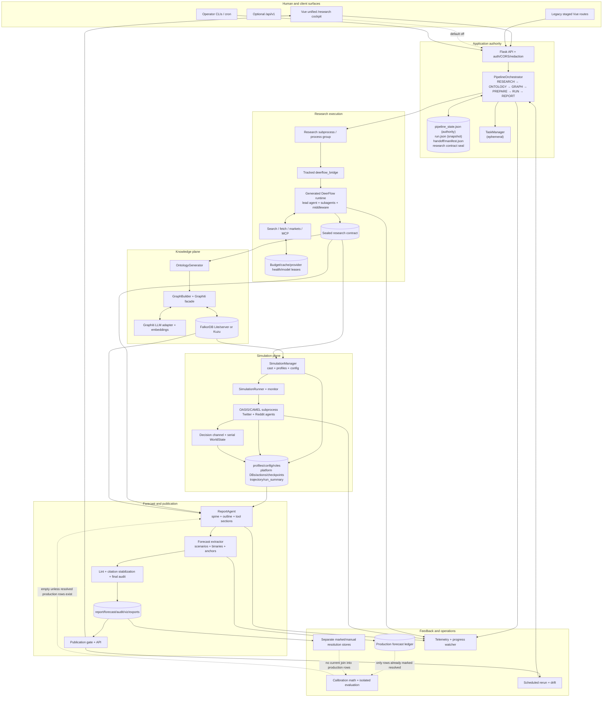

# DeepResearchForecast: whole-system architecture atlas

This document is a current-source reconstruction of the entire checked-in DeepResearchForecast system. It follows a request from the browser or API through admission, DeerFlow 2 research, ontology construction, graph construction, simulation preparation, OASIS execution, report and forecast generation, publication, export, resolution, calibration, and scheduled reruns. It also identifies every checked-in model-facing boundary, every durable store, every thread/subprocess boundary, and every Flask input/output surface.

The snapshot uses commit `fcf7378b2e2fabcfd836fb6e2c512fe153c6727c` as its base and includes the current documented working-tree actor-intelligence contracts. Its live Stage-1 engine is the embedded **DeerFlow 2** harness assembled under `deer-flow/` from a retained or freshly acquired DeerFlow 2 base plus tracked `deerflow_bridge/` overlays. Original DeerFlow 1.x is excluded. Pre-cutover `drf2/` components are labeled separately and are never merged into the current workflow authority.

## How to read “every call” and “every pass”

There is no truthful fixed number of provider requests for one end-to-end run. A run's realized count varies with depth, track count, source gaps, tool use, context summarization, actor count, active agents per round, platforms, report sections, translation units, invalid JSON, provider retries, fallback, and early stopping. This atlas therefore uses two complementary notions:

1. A **static model boundary** is a checked-in source site that dispatches to an LLM, an LLM-owning framework, an embedding model, or a reranker.
2. A **logical invocation** is a semantically distinct prompt/response operation—such as research outline synthesis or forecast premortem—that may share a generic dispatch function with other operations.
3. A **realized provider request** is a runtime network or CLI attempt. The atlas gives the multiplicity formula or stopping condition for each static/logical site.
4. A **pass/reception** is a material producer → transport → payload/state/artifact → receiver boundary. In-memory calls are included when they transfer authority or contract ownership; trivial local variable assignments are not.

The machine-readable companions are the exhaustive indexes:

- [`llm-call-inventory.json`](llm-call-inventory.json), together with the canonical [`deerflow2/deerflow2-call-inventory.json`](deerflow2/deerflow2-call-inventory.json), forms a normalized **100-family** whole-architecture model census: 51 baseline non-research records, five finer logical-operation records, two Stage-1 dispatch helpers, and 42 detailed DeerFlow 2 native/current/pre-cutover families. Inputs, outputs, receivers, persistence, retry/failure behavior and multiplicity are explicit.
- [`dataflow-inventory.json`](dataflow-inventory.json) contains **95** material producer/receiver flows and all **101** Flask routes, each with its input and output contract.
- [`deepresearchforecast-system-architecture.tldr`](deepresearchforecast-system-architecture.tldr) is the primary editable whole-system canvas; [`deepresearchforecast-system-architecture.svg`](deepresearchforecast-system-architecture.svg) and [`deepresearchforecast-system-architecture.png`](deepresearchforecast-system-architecture.png) are its rendered views.
- [`deerflow2/DEERFLOW_2_ARCHITECTURE.md`](deerflow2/DEERFLOW_2_ARCHITECTURE.md), its [editable tldraw](deerflow2/deerflow2-architecture.tldr), 42-call inventory and 68-interface inventory expand the Stage-1/native/pre-cutover subsystem beyond the compression required in a whole-system map.
- [`ACTOR_INTELLIGENCE_ARCHITECTURE.md`](ACTOR_INTELLIGENCE_ARCHITECTURE.md) follows the shared Track-B actor plane through `actor-intelligence/v1`, bounded Stage-2/3 reception, `actor-context/v1`, `actor-role/v2`, exact Reddit/Twitter runtime fields, and pre-launch seals.

## Status and arrow legend

| Mark | Meaning |
|---|---|
| **Live/default** | Canonical current code and active under checked-in defaults when its stage is reached. For a registered command or route, this means exposed under defaults—not invoked during every pipeline. |
| **Live/conditional** | Current code reached only for a selected mode, platform, artifact condition, or optional user action. |
| **Config-gated** | Implemented current code, but disabled or inactive under current defaults. |
| **Manual/compatibility** | A callable legacy, debug, operator, or compatibility surface outside the unified `/research` flow. |
| **Ephemeral** | Browser or in-process convenience state; not authoritative after restart. |
| **Generated runtime** | Gitignored `deer-flow/`, the code actually imported by current Stage 1; not a second product authority. |
| **Local reference/input** | Optional, gitignored `deer-flow-2.0.0/` source drop used only when separately present; not shipped by a normal clone. |
| **Pre-cutover** | DRF2 scaffold checked into the repository but explicitly not the current live authority. |
| Solid request arrow | Synchronous request/response or in-process call. |
| Artifact arrow | File/database/manifest handoff that survives process restart. |
| Poll/monitor arrow | Asynchronous observation of durable state or subprocess output. |
| Loop arrow | Tool/model iteration, retry, refinement, resolution, calibration, or rerun feedback. |

---

## 1. Architecture at a glance

The canonical product is a local Vue/Flask application whose durable workflow authority is `PipelineState` plus the orchestrator's artifact manifests. A single admitted pipeline normally advances through six ordered stages:

```text
RESEARCH (0–30%)
    → ONTOLOGY (30–40%)
    → GRAPH (40–60%)
    → PREPARE (60–72%)
    → RUN (72–92%)
    → REPORT (92–100%)
```

The exact stage constants and progress allocation are in `backend/app/services/pipeline_orchestrator.py:77-95`. The application surfaces and authority boundaries are:

| Plane | Current owner | Principal inputs | Principal outputs |
|---|---|---|---|
| Human/client | `frontend/` Vue views and API clients | Unified UI: query, mode, depth, rounds, language and model; compatibility/API surfaces additionally expose scenario actions | Pipeline IDs, progress, dossier, graph/simulation views, report and forecast |
| HTTP/security | Flask app and five default blueprints | JSON, path/query parameters, multipart uploads; loopback or `X-API-Token` | `{success,data,error}` JSON, safe artifacts and downloads |
| Workflow authority | `PipelineOrchestrator`, `PipelineManager`, `PipelineState` | Run command and durable prior state | Six stage transitions, artifact lineage, failure/cancel/resume state |
| Research | Embedded DeerFlow 2 through tracked `deerflow_bridge/` and generated `deer-flow/` | Prediction question, depth/language/model, source policy and budgets | Three Track-A evidence packs, one shared baseline Track-B actor dossier/coverage plane, one unified report, normalized actor intelligence, sources, timeline, quantitative/contested evidence, markets and charts |
| Knowledge | `OntologyGenerator`, `GraphBuilder`, Graphiti facade/runtime | Sealed research contract and ontology | Typed nodes, edges, episodes, optional communities and graph search |
| Simulation | `SimulationManager`, `SimulationRunner`, OASIS/CAMEL subprocess | Graph, actors, profiles, config, seed/round/calendar policy | Platform DBs/actions, world-state/decision artifacts, run summary |
| Forecast/publication | `ReportAgent`, `forecast_extractor`, report API | Research/graph/simulation evidence and pinned safety policy | Final Markdown, structured forecast, audit, visualizations, exports |
| Feedback/operations | Forecast ledger, monitor, scheduler, evaluation scripts, telemetry | Forecasts, outcomes, market observations, schedules | Raw forecast rows, separate resolution scores, drift, evaluation and operational evidence; production calibration join remains open |

The tracked product source surfaces are `frontend/`, `backend/`, and `deerflow_bridge/`. Stage 1 imports the generated, gitignored `deer-flow/` runtime. A fresh runtime is seeded either from an optional local-only `deer-flow-2.0.0/` source drop, when separately present, or from the ordinary-clone fallback commit `799bef6d…`; that fallback predates the audited public v2.0.0 commit `7e7f041…`. Setup retains an existing generated base instead of silently reacquiring it, then refreshes tracked overlays. Neither the local drop nor the generated deployment is an independent product implementation, and a retained base's exact provenance cannot be inferred from the directory name alone (`.gitignore:81-93`; `setup.sh:483-703`; `deerflow_bridge/README.md:18-60`; `pipeline_orchestrator.py:758-859,1018-1032`).

### Whole-system topology



### Canonical request sequence

```mermaid
sequenceDiagram
  autonumber
  actor U as User
  participant V as Vue ResearchView
  participant API as Flask /api/research
  participant O as PipelineOrchestrator
  participant D as Durable pipeline store
  participant R as DeerFlow research process
  participant K as Ontology + Graphiti
  participant S as SimulationManager/Runner
  participant OA as OASIS/CAMEL
  participant RA as ReportAgent/ForecastExtractor
  participant P as Publication API

  U->>V: prompt + mode + depth + rounds + language + model
  V->>API: POST /run exactly once
  API->>API: validate + provider/system preflight
  API->>O: start(options)
  O->>D: create PipelineState + six stages + safety pin
  O-->>API: pipeline_id + task_id
  API-->>V: accepted
  loop visible and nonterminal
    V->>API: GET status and progress
    API->>D: read durable state/events
    API-->>V: aggregate snapshot/tail
  end
  O->>R: subprocess(prompt file, model, depth, output dir)
  par Track-A lane 1: base evidence
    R->>R: launch isolated evidence-only child
    R-->>R: evidence pack + source ledger + usage/hash
  and Track-A lane 2: base rates and analogs
    R->>R: launch isolated evidence-only child
    R-->>R: evidence pack + source ledger + usage/hash
  and Track-A lane 3: incentives, contrarian and markets
    R->>R: launch isolated evidence-only child
    R-->>R: evidence pack + source ledger + usage/hash
  and shared Track-B actor plane in broad baseline lane
    R->>R: actor landscape + cast-wide 17-dimension completion
    R->>R: receipt-bound search/fetch + typed gap-attempt ledger
    R->>R: dossier synthesis + 10-dimension judge/refine
    R-->>R: source/receipt/family coverage + dossier/judge hashes
  end
  R->>R: validate lanes + shared actor owner; seal manifest v3
  R->>R: launch fresh manifest-bound, tool-free global child
  R-->>R: outline → sections → stitch candidate
  R->>R: judge/refine + exact actor/family prose gate → structured extraction
  R-->>O: candidate research artifacts
  O->>D: promote contract; write manifest last
  O->>O: independently recompute actor/source/receipt/claim/relationship/lineage seals
  O->>K: admitted report + actor-intelligence/v1 + shared dossier → ontology
  K->>K: strict deterministic actor seed manifest + physical readback
  K->>K: prose episodes + resolve/prune → repeat exact seed readback
  K-->>D: project, ontology, graph identity/artifacts
  O->>S: prepare(graph + sealed actors/report/dossier, options)
  S->>S: actor-context/v1 → actor-role/v2 → role-only platform fields
  S->>S: public-world projection + behavior config + separate typed gap audit
  S-->>D: cast/context/profile/role/config seals + READY
  O->>S: start(simulation_id)
  S->>OA: seal-bound subprocess; direct child revalidates config closure
  OA->>OA: replace + attest canonical Reddit final system-message bytes
  OA->>OA: Twitter consumes exact newline-normalized role-only user_char
  OA-->>S: platform DB/actions/checkpoints
  OA->>OA: decision channel + WorldState per paired round
  S-->>D: simulation_id + durable simulation files/status
  O->>RA: graph/simulation IDs + selected direct research/context fields
  RA->>K: retrieve graph evidence/tools by graph ID
  RA->>S: retrieve simulation files by simulation ID
  RA->>RA: load markets/current prices + ambient/pinned config
  RA->>RA: pre-prose probability spine → outline/tool sections → initial assembly
  RA->>RA: forecast finalization → presentation assembly → lint/citations → read-only audit
  RA->>RA: automatically attempt eligible opposite-language sidecar
  RA-->>D: report/forecast/audit/viz artifacts
  O->>D: terminal health + completed pipeline
  V->>P: GET report/forecast/viz
  P->>D: publication gate over sealed bytes
  P-->>V: publishable content or suppressed body + gate state
  V-->>U: final report and forecast
```

---

## 2. Processes, threads, events, and authority

The Flask development server binds to `127.0.0.1:5001` by default (`backend/run.py:25-52`). The app factory configures CORS, production orphan reconciliation, access control, redacted request logging, traceback stripping, default blueprints, optional v1 routes, and `/health` (`backend/app/__init__.py:22-153`). Loopback API traffic is admitted locally. Non-loopback `/api/*` traffic requires `X-API-Token` (`backend/app/__init__.py:83-106`).

The system is intentionally not a single call stack. It crosses these execution boundaries:

| Boundary | Created by | Receives | Emits / stopping signal |
|---|---|---|---|
| Flask request thread | Threaded Flask server | HTTP request | JSON/file response; never owns long work |
| Pipeline daemon thread | `start`, `resume`, `continue`, or scenario fork | Pipeline ID/options and shared cancel event | Six-stage progress, durable state, terminal status |
| Heartbeat thread | Active pipeline | Owner/run identity | Heartbeat approximately every 30 seconds and telemetry flush (`pipeline_orchestrator.py:6564-6603`) |
| Research subprocess group | Research stage runner | Secure prompt file and CLI arguments | Progress events and research candidate artifacts; SIGTERM to the verified group on cancellation |
| Research cancel watcher | Research stage | Pipeline `threading.Event` | Terminates research process group (`pipeline_orchestrator.py:1551-1605`) |
| Research track executor | Parallel research coordinator | Default three track jobs | Independent subprocess results consumed by one global synthesis |
| Graph asyncio thread | Graphiti runtime | Synchronous facade calls | Async Graphiti results under per-graph locks (`graphiti_client/runtime.py:164-225`) |
| Simulation subprocess group | `SimulationRunner.start` | Prepared config, profile/role files, seed/round/resume environment | OASIS action streams, DBs, checkpoints, world artifacts and terminal event |
| Simulation monitor thread | `SimulationRunner` | Process, action offsets and platform state | `run_state.json`, progress callbacks, terminal classification (`simulation_runner.py:823-958`) |
| In-band paired-round coordinator | Simulation process | Twitter/Reddit round buffers | One serial shared WorldState transition per paired round |
| File-IPC command loop | Persistent simulation process | Interview/env commands | Response files and optional telemetry |
| Translation daemon thread | Translation API | Publication-gated translation request | Language-variant artifacts and durable status |
| PDF process/toolchain | Export API | Sealed bytes and dependency hashes | Cached PDF and output manifest under locks |
| Scheduler daemon/watcher | Standalone scheduler CLI | Due schedules and new pipeline IDs | New runs, drift comparisons and optional webhook |
| Multi-seed executor | Optional ensemble coordinator | Additional deterministic seeds | Extra prepare/run/report lanes and ensemble sidecar |

### Durable versus ephemeral authority

`PipelineState` is the current durable control record. It contains the pipeline lifecycle, current stage, all stage states, project/graph/simulation/report identifiers, options, timestamps, errors, artifact paths, and pinned safety-policy metadata (`pipeline_orchestrator.py:212-330`). Its canonical files are created and atomically maintained under:

```text
uploads/pipelines/<pipeline_id>/pipeline_state.json
uploads/pipelines/<pipeline_id>/run.json
uploads/pipelines/<pipeline_id>/handoff/
uploads/pipelines/<pipeline_id>/handoff/manifest.json
```

These paths and atomic operations are defined in `pipeline_orchestrator.py:338-407`. `TaskManager` is only an in-process convenience map (`backend/app/models/task.py:54-170`); its absence after restart does not erase a pipeline. Browser `localStorage` remembers the active ID but has no authority over server state. Report translation task objects and some graph/preparation task maps are also ephemeral accelerators around durable files.

The manifest makes stage reuse content-sensitive. For each registered artifact, the orchestrator records the logical name, path, producing stage, size, SHA-256, and schema result (`pipeline_orchestrator.py:6124-6176`). Resume uses the manifest plus stage-specific health checks. Old pre-manifest runs have an existence-based compatibility path, but current artifacts use hashes and schemas (`pipeline_orchestrator.py:6189-6235`).

---

## 3. Entry surfaces and complete HTTP I/O

The application registers these default prefixes:

```text
/api/research    unified pipeline and research-contract lifecycle
/api/graph       project, ontology, graph build/read/GC lifecycle
/api/simulation  simulation creation/preparation/run/read/interview lifecycle
/api/report      report generation/read/progressive publication/export/chat/tools
/api/settings    LLM settings and non-persistent connectivity test
```

`/api/v1` is registered only when `API_V1_ENABLED=true`; the checked-in default is false (`backend/app/__init__.py:133-146`, `backend/app/config.py:372-373`). The full exact list of 101 routes, inputs, outputs, status classifications, and owning line is in `dataflow-inventory.json` under `http_interfaces`. The following is the textual map of every route family.

### Research routes: 17 inputs/outputs

| Operation | Inputs | Output / reception |
|---|---|---|
| `POST /api/research/run` | Prompt, mode, project name, depth, rounds, language and optional model/options | Validated/preflighted `pipeline_id`, `task_id`, mode and initial status. It is non-idempotent and the frontend does not auto-retry it. |
| `POST /<id>/cancel` | Pipeline ID | Shared cancellation intent received by research process watcher, stage checkpoints, or simulation stop. |
| `POST /<id>/resume` | ID, optional `force` | Same durable lineage resumed at the first non-reusable boundary. |
| `POST /<id>/continue` | Completed `research_only` ID | Same pipeline changes to full mode and begins ontology without rerunning research. |
| `POST /<id>/scenario` | Label, overrides, events, `as_of` | New pipeline ID sharing base research/ontology/graph lineage, beginning at prepare. |
| `DELETE /<id>` | Terminated pipeline, optional dependency policy | Managed state/artifact deletion result or a live/dependency conflict. |
| `POST /clean` | Optional failed/cancelled status selection | Batch cleanup counts and IDs. |
| `GET /status/<id>` | Pipeline ID | Direct durable aggregate state with no-cache headers. |
| `GET /list` | Optional listing filters | Recent pipeline summaries. |
| `GET /preflight` | Provider/model/environment context | Readiness result without a run. |
| `GET /<id>/dossier` | Pipeline ID | Sealed report, actors, sources, timeline, quantitative/contested evidence, markets and charts. |
| `POST /<id>/dossier/translations/<lang>` | ID, target language, optional retry | Accepted/deduplicated translation. |
| `GET /<id>/dossier/translations/<lang>` | ID and language | Translation Markdown plus audit/status. |
| `GET /<id>/dossier/pdf` | ID and optional language | Research PDF built with the shared template. |
| `PUT /<id>/dossier` | State-eligible ID and replacement report/actors | Validated atomic human edit; allowed only before dependent graph use under the endpoint's state rules. |
| `GET /<id>/artifact/<name>` | ID and allowlisted logical name | Safe parsed JSON or text/file artifact. |
| `GET /<id>/progress` | ID, `scope=tail|full`, limits | Exact full or bounded tail progress; oversized full reads are rejected. |

The implementation is `backend/app/api/research.py:43-825`.

### Graph routes: 14 inputs/outputs

The graph surface exposes project get/list/delete/reset, multipart ontology generation, asynchronous graph build, task get/list, whole graph data, node neighborhood, node detail, edge detail, stale-graph GC, and explicit graph deletion. Build and task endpoints support the legacy staged UI; graph data and detail endpoints are also current report/UI retrieval surfaces. Exact routes are `backend/app/api/graph.py:35-725` and the machine inventory.

### Simulation routes: 31 inputs/outputs

The simulation surface contains three graph-entity reads; simulation create, async prepare and prepare-status; simulation get/list/history; final and realtime profile/config reads and downloads; direct profile generation; start/stop; aggregate and detailed run status; action/timeline/agent-stat/post/comment reads; single, batch and all-agent interviews; interview history; live environment status; and live environment close. The simulation route bodies ultimately receive or emit the contracts described in Sections 8 and 9 below. Exact definitions are `backend/app/api/simulation.py:47-2740`.

### Report routes: 29 inputs/outputs

The report surface contains an independent compatibility generation task and task-status read; report/forecast/by-simulation/list reads; Markdown and translated Markdown downloads; translation start/status; report PDF, executive brief Markdown/PDF and digest; chart and visualization manifest reads; deletion; report Q&A; generation progress, complete sections, incremental partial sections and single-section reads; report-existence check; agent and console log snapshots plus stream-compatible full snapshots; and debug graph search/statistics tools. All report/forecast/export body reads pass through the publication rules appropriate to the endpoint. Exact definitions are `backend/app/api/report.py:78-1904`.

### Settings and optional v1 routes: 9 inputs/outputs

Settings exposes safe current LLM configuration, configuration update, and an explicitly non-persistent provider probe (`backend/app/api/settings.py:25-187`). The optional v1 surface exposes stable run, status, list, dossier, publication-gated forecast, and manual resolution endpoints (`backend/app/api/sdk.py:76-356`). No checked-in `sdk/` client package exists; the Flask v1 blueprint is the server contract.

### Response, auth, and error reception

The shared frontend Axios client unwraps the backend's `{success, data, error}` envelope; downloads and image assets use direct URLs (`frontend/src/api/index.js:4-86`). The backend strips production tracebacks, redacts sensitive request fields in logs, and applies one access gate across `/api/*`. A route receives invalid input as a 4xx response, a resource conflict as a state-appropriate error, and unexpected service failure as a sanitized server error. Long-running mutations return identifiers and move work to a thread/subprocess; they do not hold the HTTP connection for the entire pipeline.

---

## 4. Canonical lifecycle, step by step

This is the full live/default path in execution order. Conditional branches are named where they occur.

1. The user opens `/research`, owned by `ResearchView.vue`. The unified flow keeps its completed forecast embedded on that page; `/report/:reportId` is a separate direct/legacy report route (`frontend/src/router/index.js:10-50`; `ResearchView.vue:181-182,402-405`).
2. The current unified form collects the forecasting question, run mode, research depth, simulation rounds, language, and optional model. It has no `project_name` control, although the backend/API accepts that optional field (`ResearchView.vue:45-119,408-421`; `frontend/src/api/research.js:20`; `backend/app/api/research.py:43`).
3. The API client sends exactly one `POST /api/research/run`. It deliberately does not generically retry this non-idempotent command (`frontend/src/api/research.js:20-34`).
4. Flask applies CORS/access/redaction/error policy, parses JSON, validates the prompt/mode/depth/language/dossier constraints, and runs shared provider/system preflight (`backend/app/api/research.py:35-119`).
5. Admission rejects before state creation if validation or preflight fails. The client receives a sanitized error and no pipeline ID.
6. On success, `PipelineOrchestrator.start` allocates `pipe_<...>` and task IDs, creates six `StageState` records, pins current workflow-safety metadata, writes authoritative `pipeline_state.json`, creates a cancellation event, and starts a daemon pipeline thread. It does not write `run.json` (`pipeline_orchestrator.py:4400-4456`).
7. The daemon's `_run` entry later writes the best-effort `run.json` launch snapshot, initializes telemetry and starts the heartbeat; Flask immediately returns the IDs and initial status. The browser stores the active pipeline ID in `localStorage` and starts an adaptive poll generation (`pipeline_orchestrator.py:6607-6620,7912-7917`).
8. The browser first requests full progress, then bounded tails. It pauses polling while the document is hidden and ignores responses from obsolete generation tokens (`ResearchView.vue:460-690`; `liveProgress.js:1-96`).
9. The pipeline thread enters `RESEARCH`, sets stage/global progress, heartbeat and message, and persists the transition.
10. The research runner verifies/synchronizes the tracked bridge into the generated DeerFlow runtime if stale.
11. It writes the long prompt to a mode-`0600` temporary file so content is neither an oversized argv value nor exposed in the process list.
12. It launches the bridge as a new process group, passes output directory/model/depth/language/thread/resume flags, streams progress, and runs a cancel watcher (`pipeline_orchestrator.py:1326-1812`).
13. Under current defaults, the outer coordinator launches **three angle-specific, evidence-only Track-A lanes** in a bounded executor and assigns exactly one shared Track-B actor plane to the broad baseline lane (`pipeline_orchestrator.py:5164-5169,9966-10029`; `config.py:1114-1146`). Each lane owns a thread, candidate directory and source/evidence ledger; only baseline may own the actor dossier. A run-pinned `actor-intelligence-policy/v1` records whether that plane is required, so an ambient configuration reload cannot silently change current-run admission (`pipeline_orchestrator.py:477-498`).
14. Each child constructs an embedded DeerFlow 2 `DeerFlowClient` and lead-agent graph. No native gateway HTTP/SSE hop sits between the bridge and the graph. Deep mode runs an opening pass, planned phases and bounded adaptive gap/coverage/verification passes (`deerflow_research.py:7869-8685`).
15. A streamed lead turn can call search, fetch, public prediction-market or conditionally configured MCP tools. It can also delegate through DeerFlow 2's native task/subagent loop. Each tool or child result returns as a model-visible observation and can trigger another lead-model turn.
16. Harness-native child delegation and retained bridge per-KIQ/per-actor fan-out are alternative breadth owners, not additive defaults. With three outer lanes, the global native-child cap of nine derives at most three concurrent children per lane; the provider-facing default concurrency envelope is therefore three leads plus at most nine children, not a fixed call total.
17. Search returns normalized metadata; fetch applies URL/source policy, cache, single-flight, network budget, content hashing, search-result receipts and fallback. All three Track-A lanes stop after their evidence packs and source ledgers. In parallel, baseline Track B runs an actor-landscape loop, a scheduled cast-wide completion loop across all 17 dimensions, tool-free dossier synthesis, a ten-dimension judge/refine loop and deterministic coverage (`deerflow_research.py:12820-13388,13625-13923`). A covered claim must resolve to a fetched Track-B source and carry exact quote/span, receipt ID and content hash. A gap is the six-field object `reason`, `attempted_queries`, `receipt_ids`, `result_ids`, `attempt_count`, `exhausted`; every admitted gap needs a real bound attempt and `exhausted=true`, while any dimension used by one of the five behavior-ready families requires two distinct queries and two distinct bound search results (`deerflow_research.py:12852-13375`).
18. The backend requires a current accountable baseline dossier, rejects any nonbaseline dossier, and seals accepted lane evidence plus exactly one actor descriptor into `evidence_synthesis_manifest.json` version 3. The descriptor byte- and hash-binds the dossier, coverage audit, baseline source ledger and current-attempt judge when one is declared (`pipeline_orchestrator.py:10066-10227`).
19. One fresh child receives the sealed synthesis manifest with subagents and dual-track behavior disabled. It verifies every actor descriptor path/byte/hash, reparses the baseline source ledger, canonicalizes the Track-B search-result receipts and reruns the full coverage audit exactly (`deerflow_research.py:7181-7290`). It then gives every Tier-1/2 actor a bounded, fair 17-dimension block plus a sealed representative claim for each exact behavior-ready family: `identity_history`, `incentives_motivations_values`, `capabilities_constraints`, `actions_plans_investments`, and `decision_likely_actions_red_lines`. The final global report must reproduce each exact actor/family marker once, the sealed claim as visible prose and an admitted citation in the same actor-local neighborhood; keywords or hidden comments cannot pass (`deerflow_research.py:7294-7665,10713-10955`). This tool-free global child is a synthesis/reception boundary, not a fourth evidence lane.
20. Global synthesis selects multipart mode for large contexts: one outline call, one call per section, optional thin/truncated-section expansions, one summary/stitch call and deterministic cross-section deduplication. Small/failed multipart contexts use a single-call synthesis (`deerflow_research.py:2473-4512`).
21. The global research report is judged against a seven-dimension contract. A failed scorecard can launch a targeted streamed top-up, an incremental section patch or full resynthesis, and a rejudge. Accepted report bytes must match their scorecard identity (`deerflow_research.py:6876-7755`).
22. Only a global report that passes its own seven-dimension byte-bound judge **and** the exact actor/family visible-prose/citation audit reaches the strict tool-free structured extractor. The accepted report, shared actor dossier and market context produce `actors.json`, sources, timeline, quantitative facts and contested claims. Invalid/incomplete extraction can invoke one smaller recovery call; unparseable candidates are preserved as explicit failure evidence. This is the only cast extraction owner in the default topology (`deerflow_research.py:10713-11224`).
23. If market enrichment is active, the bridge derives short market queries, calls public read-only Gamma/CLOB APIs, scores candidate relevance, fetches price history and writes market artifacts. It never uses a wallet (`deerflow_research.py:9149-10299`; `prediction_markets.py:5-11,314-395`). Deterministic visualization converts validated data to chart specifications, datasets and rendered assets.
24. After all report/market/chart mutations, one deterministic finalizer rebuilds the final `actor-intelligence/v1` object from the persisted report, dossier, sources and current extraction (`deerflow_research.py:4066-4342,16863-16879`). It rejects roster/order/multiset or claim-projection disagreement between dossier and extraction; source-less claims; missing behavior families; duplicate relationships; and relationships whose causal identity differs across `valence`, `polarity`, `sign`, `strength`, `grade`, `since`, `until` or `lag`. It writes exact contract hashes plus `actor_intelligence_lineage.json` (`actor-artifact-lineage/v1`), binding question/depth, run/attempt/lane/thread/checkpoint identity and report/dossier/source/actor bytes (`deerflow_research.py:3052-3195,3314-3569,3878-4015`).
25. The orchestrator validates the complete candidate—including shared dossier/coverage/judge and actor-lineage sidecars—promotes the accepted generation into the canonical handoff, retains rollback material where configured, and writes `research_contract_manifest.json` last. Before a full run can leave RESEARCH, the parent independently recomputes the one Track-B thread, admitted fetched-source and search-receipt sets, semantic actor/claim/family seals, relationship causal identities, exact artifact bytes and complete lineage. Current required runs fail closed before ontology/graph on any mismatch; an explicitly disabled pinned policy and a pre-policy legacy run remain distinct compatibility paths (`pipeline_orchestrator.py:3558-3666,4138-5025,11035-11064`).
26. If `mode=research_only`, the pipeline seals the research contract and terminates successfully here. A later `continue` starts Step 27 without rerunning research (`pipeline_orchestrator.py:8240-8251`).
27. Only after the parent actor-reception gate passes does the `ONTOLOGY` stage create or reuse a project, load the sealed research report and actors, and invoke `OntologyGenerator`. For a newly created project, the report becomes `extracted_text.txt` and a metadata entry in `project.files`; it is not copied into `files/`. An already existing project is not refreshed from the new report before ontology generation (`pipeline_orchestrator.py:11035-11135`; `project.py:133-178,279-283`).
28. Ontology generation asks for structured entity/edge types and attributes. If and only if a non-default selected template normalizes to an empty `entity_types` list, one second **full-context** call reruns the same documents under the default `social_opinion` template; normalized ontology is written to both project state and `handoff/ontology.json` (`ontology_generator.py:520-675`).
29. The `GRAPH` stage checks whether an existing graph is state-, manifest-, and health-valid. An invalid or missing graph is built; a valid one is reused (`pipeline_orchestrator.py:8335-8373`).
30. `GraphBuilder` first preflights the complete current-v1 actor/type/alias/relationship write plan. It deterministically derives every node/edge UUID and an `actor-graph-seed-manifest/v1` containing the admitted source-contract hashes, exact required attributes/provenance, per-kind counts, and canonical node/edge hashes. It then performs every direct write before prose; zero, partial, missing or duplicate writes fail closed (`graph_builder.py:242-529,1445-1477,1695-2230`; `pipeline_orchestrator.py:6350-6400,11276-11310`). Prose chunk selection is replacement-based: the default `GRAPH_CHUNK_SOURCE=dossier_only` uses the dossier when present, otherwise falls back to the sealed report; `both` is required to ingest both sources (`config.py:465`; `pipeline_orchestrator.py:11234-11267`).
31. Graphiti asks the application LLM adapter to extract/deduplicate structured entities and facts and the local sentence-transformer adapter to embed uncached text. Synchronous callers cross a dedicated background asyncio loop.
32. Graph data is written to FalkorDB server, embedded FalkorDB Lite, or Kuzu according to configuration. UI positions are kept separately under the Graphiti data directory (`graphiti_client/runtime.py:113-336`).
33. Immediately after direct seeding, the parent asks the graph service to physically read back every deterministic UUID, label, summary/fact hash and required attribute; unexpected or duplicate seed UUIDs are errors. Alias nodes may be collapsed only if the canonical actor preserves the alias. The strict manifest is persisted as `actor_graph_seed_manifest.json`. After Graphiti prose extraction and the conditional community, default-on resolution and default-on pruning mutators, the same immutable manifest/readback check runs again; it also runs before graph reuse, where mismatch forces rebuild (`graph_builder.py:1479-1693`; `pipeline_orchestrator.py:6216-6347,11169-11198,11296-11423`).
34. The graph ID is stored on the project/pipeline; graph-stage artifacts and hashes are recorded.
35. The `PREPARE` stage calls `SimulationManager.prepare_simulation` with project, graph, the admitted report/dossier and normalized actors. The manager reconciles graph entities to the selected canonical roster and writes `actor_cast_manifest.json` (`pipeline_orchestrator.py:11545-11635`; `simulation_manager.py:950-1307`).
36. Before any profile or configuration model boundary, the manager writes one bounded `actor-context/v1` pack per selected actor. Each pack is bound to exact report/actors/roster hashes, includes actor-relevant report sections and source-bound structured rows, preserves complete claims atomically under the behavior budget, and keeps all current six-field gaps losslessly in a modeler-only audit map. Only literal `actor_knows=true` or an allowlisted actor-known visibility grants knowledge; public/documented evidence, analyst inference, contested/unknown material and research-attempt metadata remain separately labelled. Exact per-actor bytes are reread and sealed through `actor_context_manifest.json` (`actor_context.py:26-68,160-370,953-1165,1299-1590`).
37. For canonical `actor-intelligence/v1`, `OasisProfileGenerator` branches **before** legacy entity/graph prompting and makes no free-form persona call. It deterministically compiles `actor-role/v2` from the same-identity pack; legacy flat description/role/goals/memory/persona fields cannot re-enter. Evidence-gap reason/count/exhaustion may be summarized as uncertainty, but attempted queries and receipt/result IDs stay modeler-only (`actor_role_prompt.py:700-878,937-1613,1653-2010`; `oasis_profile_generator.py:609-729`). The complete compiled role is Reddit `persona`; Twitter `user_char` is that same role with newlines mapped to spaces, while `bio`/`description` is structural display metadata only. `bio + persona` survives solely in the unversioned compatibility path (`oasis_profile_generator.py:2647-2790,3062-3121,3150-3251`).
38. `SimulationConfigGenerator` derives canonical activity settings by deterministic rule rather than sending the canonical actor batch to the LLM. Each agent receives an allowlisted, epistemically labelled `actor-config-context/v1` **behavior** projection capped at 1,800 characters. The complete typed gap map is stored separately as `actor-config-evidence-gap-audit/v1`, capped/sealed at 65,536 bytes and explicitly excluded from actor/LLM knowledge and behavior (`simulation_config_generator.py:2693-3045,3317-3561`). Shared `world_brief` content is likewise restricted to explicitly public, source-bound current claims; analyst inference and raw legacy situation/market fields cannot become common knowledge in a v1 run (`simulation_config_generator.py:1649-1761,1800-1840`). Other temporal, seed, round, event, platform and model components are then assembled into `simulation_config.json`.
39. `SimulationManager` validates equal cast/context/role coverage and exact profile/runtime bytes, writes `simulation_config_manifest.json` (`simulation-config-manifest/v1`) over the config plus cast, context and enabled-platform role-manifest fingerprints, immediately validates it and persists both hashes in `state.json` before `READY` (`simulation_manager.py:52-214,1240-1307`).
40. A scenario overlay and/or calendar/decision `world_state_seed` are authorized outer-PREPARE mutations after the manager returns. Scenario-event application is count-preserving and idempotent across a corrupt-RUN retry. If either mutation changes `simulation_config.json`, the orchestrator calls `reseal_simulation_config`, which rebuilds and immediately revalidates the complete config/cast/context/role closure and persists the new hashes before PREPARE completion. Completed read-only reuse first validates the existing state-bound seal but does not rewrite or reseal it (`pipeline_orchestrator.py:7472-7577,11545-11728`; `simulation_manager.py:1318-1452`).
41. The `RUN` stage calls `SimulationRunner.start`. The runner checks READY state, manifest integrity, checkpoint/config compatibility, platform selection, seed and round/calendar authority.
42. Unless explicit resume is valid and enabled, stale run artifacts are rotated before a fresh run. Current automatic simulation resume is off; explicit resume validates config/checkpoint hashes (`simulation_runner.py:1100-1190`).
43. The runner writes `run_state.json`, opens `simulation.log`, and starts `run_parallel_simulation.py` in a new process session with the simulation directory as working directory. It passes the validated manifest hash as `--config-seal`; the direct child rereads `state.json`, rediscovers current role evidence and revalidates the same config/cast/context/role closure. It then hashes the exact second-read bytes against the validated config SHA before parsing them, closing the validation/load check-use gap. Current roles cannot downgrade by deleting the state binding or using a differently named config (`simulation_runner.py:497-668,900-920`; `run_parallel_simulation.py:1256-1331,4830-4847`).
44. The subprocess creates Twitter, Reddit, or both OASIS environments and CAMEL SocialAgents using the prepared roles/model adapter. For canonical Reddit it replaces OASIS's demographic template with the exact `canonical-reddit-system-message/v1` wrapper around username and the role-only prompt, then appends only the sealed public-world and calendar blocks, verifies the final effective bytes before `env.reset`/model execution and writes `reddit_runtime_system_messages.json` bound to the config and role-manifest hashes (`oasis_profile_generator.py:59-86`; `run_parallel_simulation.py:556-694,4314-4346`). Twitter has no analogous full-system-message replacement artifact: its exact checked-in current boundary is the role-only, newline-normalized CSV `user_char`. The script injects manual initial posts/follows/events where configured.
45. Each live platform round selects active agents and passes `LLMAction` objects to `env.step`. OASIS/CAMEL supplies each agent's persona, memory, platform state and action/tool schema to its model. Returned actions mutate the platform database.
46. The script extracts actual actions from the platform trace/database and appends normalized action JSONL. Failed individual rounds are recorded as zero-action rounds; repeated same-class failures eventually hard-fail to avoid consuming model budget against a dead environment.
47. With the current calendar/in-band channel defaults, Twitter and Reddit round buffers are paired. A unique actor roster and both action contexts are sent through one decision-channel `chat_json` call for that paired round.
48. The decision model returns only `{agent_id, scenario, magnitude, confidence}` records. Commitments are constructed deterministically; the model does not return commitment prose or rationale. Accounting distinguishes `committed`, `abstained`, `silent`, `failed` and `missing` outcomes (`infeasible` is reserved). Only committed decisions advance the shared serial `WorldState`; all non-committed outcomes preserve their status and freeze movement. The projection is explicitly `elicited_model_projection`.
49. World-state trajectory, decisions and a digest are written. The next period can receive the prior projected delta as context. Under the current safety pin, simulation probabilities are diagnostic-only, not an independent observed likelihood.
50. While the process is alive, file-based IPC can deliver single/batch interviews and environment commands. Command and response files form the process boundary (`simulation_ipc.py:30-250`).
51. The runner monitor polls action/process/platform state roughly every two seconds, updates `run_state.json`, sends progress to the orchestrator, and distinguishes completed, stopped and failed termination. Platform `simulation_end` events are authoritative for completion; the process may intentionally remain alive for interview-command mode. Process exit before all required platform end events is failure (`simulation_runner.py:823-1033`).
52. The post-hoc decision channel runs only when the script-level `_inband_traj_written` flag is false. It does not inspect an existing in-band file for partial/incomplete content before deciding to skip fallback (`run_parallel_simulation.py:2988-3026,4715-4767`).
53. At terminal success, a deterministic summarizer reads actions and derived agent statistics/timeline/top posts, run-state coverage/error fields, platform LLM health, dynamics/config metadata and optional communities, then writes atomic `run_summary.json`. It does **not** read decision or WorldState artifacts into that aggregate (`simulation_runner.py:1834-1850,1919-1987,2023-2082`).
54. The orchestrator records the `simulation_id` and durable simulation artifacts, then enters `REPORT`. The canonical stage handoff is identity plus durable storage—not a copied run-summary/result/action payload.
55. Report admission performs a small LLM readiness call. It creates `ReportAgent` with graph and simulation IDs, the original question, situation brief, actors, sources, research report, scenario label, optional base-simulation ID, quantitative/contested/timeline evidence and structural graph priors. No `run_summary`, simulation-result or action payload is passed to the constructor. The agent later retrieves graph and selected simulation detail through tools/services by ID and loads market/current-price material plus ambient or pinned policy/config through its managers (`pipeline_orchestrator.py:9083-9109`; `report_agent.py:1450-1470`; `zep_tools.py:2457-2499`).
56. The agent builds its evidence/market context and derives a probability spine **before prose**: the scenario-spine operation normally makes one draw because `REPORT_SPINE_SELFCONSISTENCY_K=1`, then runs the default structured self-critique. The premortem site exists but is default-off. Under `diagnostic_only`, the simulation signal pack is explicitly empty at this probability boundary (`report_agent.py:2764-2892`).
57. An outline `chat_json` call returns the ordered report plan. The section scheduler generates each section using native provider tools when supported/enabled, otherwise a textual ReAct loop.
58. In a native tool round the model emits zero or more graph/search/statistics/interview calls; the executor returns observations as the next model message. Native-tool transport failure degrades to ReAct because native tools have no CLI fallback.
59. In ReAct the model emits a textual action, the agent parses/executes it, appends the observation, and repeats until final content or an iteration cap. One finalization call is available if the loop has observations but no acceptable final text.
60. Each section can receive critique, revision, truncation continuation, target-language enforcement, simulation-leakage correction, and missing-slot repair. Every persisted section updates progress so the frontend can render partial output.
61. `ReportManager.assemble_full_report` orders the accepted sections into an initial prose candidate and marks complete/partial section state. Part I/II/III presentation wrapping has not happened yet (`report_agent.py:10355-10372`).
62. Forecast finalization reuses the pinned scenarios, or only if the spine is absent falls back to post-hoc scenario extraction/critique from the assembled prose. It then creates binary contracts and probability draws from the research dossier (or final-report fallback if the dossier is absent), situation, pinned scenarios, markets and horizon. A bounded model-assisted exact/near market-equivalence review is followed by deterministic ID/rank validation, anchor construction and reconciliation; unvalidated matches are removed. Simulation-derived effects remain diagnostic under the current pin (`report_agent.py:10373-10381`; `forecast_extractor.py:1683-1800,2217-2379`).
63. Presentation assembly prepends deterministic Part I binary forecasts, injects deterministic visualizations, obtains Part II through its dedicated synthesis call, wraps the detailed sections as Part III, appends the resolution section and runs language-purity repair (`report_agent.py:10382-10418`).
64. Deterministic editorial lint then citation stabilization check and finalize the exact publishable Markdown (`report_agent.py:10419-10438`).
65. The final audit reads the exact final Markdown and forecast bytes, verifies current hard-policy/contract conditions and records hashes. The audit does not rewrite the sealed bytes (`report_agent.py:7340-7544,10439-10445`).
66. With `REPORT_BILINGUAL=true`, an eligible finalized English/Chinese primary automatically attempts the opposite-language sidecar **after** that audit even if the primary audit failed. The sidecar never rewrites the primary. Exposure still requires both primary and variant gates; the later manual generation API requires a publishable primary (`report_agent.py:6355-6685,10447-10455,10988-10991,11171-11205`).
67. The finalizer persists Markdown, forecast, metadata, outline, progress, sections, citations, audit, language-variant metadata, visualizations, logs and telemetry under `uploads/reports/<report_id>/`.
68. The publication gate requires completed/non-partial state, current hard-policy success, exact artifact hashes, structured contracts and a valid final audit (`report_agent.py:11171-11334`). APIs suppress report/forecast content when the gate does not accept it (`api/report.py:24-55`).
69. After the primary `REPORT` stage completes, the optional multi-seed sensitivity sidecar may run. The orchestrator then calls `_enforce_pipeline_health` over the primary report and forecast deliverables; only a passing primary health check sets `PipelineState.status=completed`, sets `global_progress=100`, atomically saves `pipeline_state.json`, and completes the same-process `TaskManager` result. An optional ensemble failure is recorded but does not erase otherwise valid primary success (`pipeline_orchestrator.py:9126-9155`).
70. The unified browser stays on `/research` and embeds `ForecastReport` when a report ID becomes available; it loads report, structured forecast and visualization manifest there. Separate legacy report routes still exist. During generation the embedded component polls partial sections approximately every three seconds (`ResearchView.vue:181-182,402-405`; `ForecastReport.vue:302-373,839-894`).
71. Forecast finalization appends a raw production-ledger row **before** final report audit/publication. That row has no objective-signal metadata and can precede a later publication failure or duplicate raw report. Evaluation/golden rows use a separate ledger, but publication and production-ledger admission are not one atomic gate.
72. PDF, executive brief and digest are lazy, publication-gated API derivatives. Other post-run sidecars monitor market resolution, write separate manual/market resolution records, calculate calibration from rows that actually carry resolved outcomes, or schedule a fresh rerun. The manual `resolved.json`, market `resolutions.jsonl` and production `ledger.jsonl` are disconnected stores; neither resolution path mutates the production row, so the advertised automatic production-calibration feedback loop is not closed in current code. None of these sidecars rewrites the sealed primary report bytes.

---

## 5. Stage 1 — research architecture in minute detail

### 5.1 Inputs and admission contract

Research receives the original question/prediction requirement, depth (`quick`, `standard`, or deep-style behavior), output language, provider/model selection, run/thread identity, output directory, cancellation/resume state and optional evidence-only/extract-only/synthesis-manifest modes. The orchestrator also supplies configuration controlling parallel tracks, global synthesis, native-subagent caps, the mutually exclusive bridge-fanout plane, optional existing-KG MCP, source budgets, checkpoints and quality gates (`pipeline_orchestrator.py:9966-10029,10681-10843`; `config.py:1090-1165`). With the current defaults, `DEERFLOW_DUAL_TRACK=true` is pinned at admission and admits Track B only in the broad baseline outer lane. The other two lanes remain Track-A-only, and the later global child is tool-free and does not rerun Track B (`pipeline_orchestrator.py:477-498,5164-5169,10015-10022`).

The bridge writes the requirement and progress stream early, before the expensive work. That makes the research process externally observable even if construction or provider setup fails (`deerflow_research.py:1668-1696,10660-10712`). The subprocess is isolated in a process group so cancellation can stop descendants rather than only the parent Python process. Its client is the **embedded DeerFlow 2 harness**; the native FastAPI gateway, Runs API and SSE journal are not in the current Stage-1 request path.

### 5.2 Outer tracks and inner agent graph

There are two different kinds of parallelism and they should not be conflated:

- **Outer research tracks** are independent bridge subprocess/jobs launched by the backend coordinator. The current default is three evidence-only Track-A angles. Each has its own output directory, lead thread, evidence pack and source ledger; the broad baseline lane additionally owns the one shared Track-B thread/artifact plane.
- **Inner DeerFlow 2 delegation** is the task tool and child-agent loop inside one embedded harness process. The default global child cap is nine; with three outer lanes the orchestrator derives a maximum of three admitted native children per lane. A provider-facing concurrency envelope of 12 means three leads plus at most nine children, not 12 total calls.
- **Retained bridge fan-out** is a different per-KIQ/per-actor worker mechanism. It is suppressed when harness-native delegation owns breadth unless stacking is explicitly allowed. The two mechanisms are not added together under defaults (`deerflow_research.py:1731-1800`).

One default Track-A evidence lane follows:

```text
opening streamed turn
  → derive KIQs
  → native scoped child task(s), or bridge worker fan-out when native delegation is not owner
  → receive child/worker ToolMessages and evidence notes
  → planned deep phases
  → adaptive source-coverage top-up(s)
  → gap-closing / verification / drift correction pass(es)
  → evidence_pack.md + sources/usage/progress
```

The baseline-only shared Track-B path follows:

```text
actor-landscape streamed loop
  → cast-wide actor-intelligence completion streamed loop
  → producer-owned fetched-source + search-result-receipt ledgers
  → tool-free dossier synthesis
  → ten-dimension dossier judge
  → 0..2 targeted gap-research/resynthesis rounds
  → optional final-byte rejudge
  → deterministic quote/receipt-bound actor × 17-dimension + five-family audit
  → actor_dossier.md + coverage/search receipts + current judge sidecar
```

The separate default global child follows:

```text
sealed evidence_synthesis_manifest.json v3
  → verify one actor descriptor + fresh source/search-receipt audit
  → inject fair 17-dimension blocks + five sealed family claims per actor
  → tool-free outline
  → bounded parallel section writers
  → optional thin/truncated-section expansion
  → executive summary / stitch + deterministic deduplication
  → research-report judge + exact visible actor/family/citation gate
  → optional targeted top-up + patch/resynthesis + rejudge
  → structured extraction + optional recovery
  → actor-intelligence/v1 + actor-artifact-lineage/v1 finalization
  → parent recomputation + validated manifest-last Stage-1 handoff
```

Every streamed turn is a model/tool loop, not one completion. `_leased_client_stream` calls `client.stream` with a `recursion_limit` (`deerflow_research.py:1773-1781`). The lead model can ask for search/fetch/market/MCP tools; each observation becomes another message; native child task results re-enter the parent as ToolMessages. The exact count is bounded by recursion, admitted children/workers, research/model/network budgets and early stopping.

### 5.2.1 Active DeerFlow 2 middleware policy

The current bridge keeps context summarization enabled but conditional. At 80K tokens it retains the most recent 16K tokens, summarizes the **complete** discarded span and inherits the active run model when no separate summary model is configured. Native title generation is disabled because the headless Stage-1 title has no consumer. Persistent long-term-memory injection/update is disabled to prevent cross-run state and background calls. The exact native model, middleware, tool, subagent, checkpoint and stream contracts are expanded in [`deerflow2/DEERFLOW_2_ARCHITECTURE.md`](deerflow2/DEERFLOW_2_ARCHITECTURE.md).

### 5.2.2 Conditional existing-graph feedback

On fork, continue or resume-with-graph, if durable state already has a `graph_id` and `RESEARCH_MCP_KG=true`, the orchestrator injects the existing backend KG as a stdio MCP extension. Track-A lead/subagent loops can query it through normal tool dispatch. A first run has no graph yet, so this edge is absent. The manifest-driven global synthesis branch is tool-free and does not call the KG MCP. Simulation tool schemas may be present in an extension namespace, but current Stage 1 does not inject the simulation identity needed to make them an active feedback path (`pipeline_orchestrator.py:1374-1548`).

### 5.3 Search, fetch, source and budget reception

The search layer normalizes configured providers such as Firecrawl, Exa and Jina. The fetch layer validates URLs, applies domain/tier policy, performs cache/single-flight admission, records negative results, hashes content and can use explicit direct HTTP fallback (`search_tools.py:324-575`; `cached_fetch.py:425-825`).

`research_budget.py` is a SQLite-backed cross-process control plane for atomic attempt/network admission, fetched-source identity, provider-health circuits and model leases (`research_budget.py:1-12,109-188,260-324,620-758,870-940,1254-1488`). Its receiver is not the final report; it controls whether a requested operation is allowed. The agent receives a structured denial/control result when it is not, allowing it to stop or choose a different evidence path rather than hanging.

The material source lineage is:

```text
model-generated query
  → search provider result {title,url,snippet,...}
  → URL validation/source policy
  → fetch provider/direct HTTP
  → content + URL/content hash + provider metadata
  → fetched-source registry/evidence block
  → synthesis section/citation namespace
  → sources.json and references
```

### 5.4 Synthesis, judge and extraction

Large evidence contexts use multipart synthesis. One call produces an outline; evidence blocks and citations are routed to each section; section calls run with bounded concurrency; thin sections may be expanded; a final summary/stitch call provides the integrative lead; deterministic paragraph-shingle deduplication removes cross-section repetition (`deerflow_research.py:2473-3919`). Structural multipart failure returns an empty sentinel to the caller, which uses a single-call synthesis instead of pretending a partial assembly is complete.

The actor and report quality gates are separate. Track B's ten-dimension judge checks cast correctness, salience, per-actor depth, relationships, history, grounding, contradictions, ontology readiness, forward behavior and cast-wide accountability. With the judge enabled, only an exact-byte, complete, finite, non-truncated `PASS` may continue; transport/parse failure, stale input binding and explicit `FAIL` all reject the dossier after bounded refinement. A deliberately disabled judge or the explicit length-based latency skip can use the mandatory deterministic audit alone, but neither bypasses it (`deerflow_research.py:13579-13923`). The audit requires one substantive Tier-1/2 profile per ledger actor, all 17 cells, at least one non-gap dimension, five behavior-ready evidence families, quote/receipt-bound covered claims and real typed gap attempts; the global report later adds its independent seven-dimension judge plus exact actor/family visible-prose/citation gate (`deerflow_research.py:12852-13388,10713-10955`).

Structured extraction is another model call after prose quality. It asks for the machine contract rather than treating free-form prose as a safe schema. Deterministic parsers repair fences/truncation where possible, reject schema echoes/incomplete output, and can make one recovery extraction. The final artifact set is promoted only after validation.

### 5.5 Research outputs and consumers

| Artifact | Producer | Immediate receiver | Later receiver |
|---|---|---|---|
| `research_report.md` | Evidence synthesis + judge | Contract promoter | Project text, graph episodes, ReportAgent |
| `actor_dossier.md` | Shared baseline Track-B synthesis + judge | Manifest-v3 actor descriptor | Global synthesis, ontology, graph and prepare |
| `actor_dossier_coverage.json` | Deterministic source-bound actor × 17-dimension audit | Manifest-v3 actor descriptor | Admission/recovery/integrity validation |
| `actor_dossier_judge.json` | Optional ten-dimension actor judge | Manifest-v3 actor descriptor when present | Admission and audit |
| `actors.json` | Unified structured extraction followed by deterministic `actor-intelligence/v1` normalization/final hashes | Contract validator | Ontology, GraphBuilder and SimulationManager |
| `actor_intelligence_lineage.json` | Final actor contract sealer | Parent actor reception + research manifest | Resume, extraction and cross-artifact identity validation |
| `sources.json` | Fetched-source merge/extractor | Citation/source validator | ReportAgent, UI, audit |
| `timeline.json` | Structured extractor | Contract validator | Simulation temporal config and report |
| `quantitative.json` | Extractor + deterministic reconciliation | Chart renderer/validator | Report evidence and forecast |
| `contested.json` | Extractor + triangulation audit | Contract validator | Report uncertainty/evidence spine |
| `prediction_markets.json` | Public market collection + relevance gate | Research/report context | Forecast anchoring and monitor |
| `market_price_history.json` | CLOB price-history fetch | Forecast/report context | Resolution/drift analysis |
| `prediction_market_candidates.jsonl` | Market search | Relevance/diagnostics | Audit/replay |
| `research_budget.json` | Budget exporter | Orchestrator/operator | Health/telemetry |
| `charts.json`, `charts/`, `datasets/` | Deterministic renderer | Dossier/report UI | Report visualizer/export |
| `research_contract_manifest.json` | Promoter, written last | Ontology stage | Resume/reuse/integrity logic |

The canonical registry is `pipeline_orchestrator.py:2467-2501` and the final bridge writes occur under `deerflow_research.py:15384-16879`. The `/dossier` API name denotes the whole sealed research handoff. A current full run whose pinned actor policy is required needs the dossier, coverage, current extraction, lineage and final actor contract. An explicitly disabled policy and a pre-policy legacy run retain their separate compatibility semantics rather than being reinterpreted by ambient settings.

---

## 6. Stage 2 — ontology architecture

Ontology is a contract conversion boundary. Its input is the sealed research prose plus normalized actors; its output is a domain ontology suitable for Graphiti and later simulation/report interpretation.

1. The orchestrator creates or reuses a project.
2. For a newly created project, the manager writes `project.json` and `extracted_text.txt`; it records `research_report.md` in `project.files` metadata but does not copy that Markdown into the project `files/` directory. A reused project is not refreshed before ontology generation (`pipeline_orchestrator.py:8257-8274`; `project.py:133-178,279-283`).
3. `OntologyGenerator` constructs an explicit JSON prompt for entity types, edge types and attributes.
4. It calls application `chat_json` at `backend/app/services/ontology_generator.py:597`.
5. If a non-default selected template yields no normalized entity types, it sends one second request at line 622 using the default `social_opinion` template and the same full document/context inputs. This is not a reduced-context retry.
6. Deterministic normalization/validation produces the ontology.
7. The ontology is stored on `Project.ontology` and copied to `handoff/ontology.json`.
8. The artifact recorder hashes it and the graph stage receives the project/ontology identity.

The two model sites and their full retry expansion are records `llm.ontology.primary_generation` and the historically named `llm.ontology.reduced_context_fallback` in the model inventory; that stable second ID is explicitly documented as a default-template full-context pass rather than a reduced-context call.

---

## 7. Stage 3 — Graphiti knowledge plane

### 7.1 Facade and runtime

The local Graphiti client presents a Zep-compatible synchronous facade to existing Flask/simulation/report callers (`graphiti_client/client.py:1-86`). A process-global runtime owns a background asyncio event loop and per-graph caches/locks (`graphiti_client/runtime.py:164-225`). Backend selection is configuration-driven:

- configured `FALKORDB_HOST` → FalkorDB server;
- otherwise embedded FalkorDB Lite using a local `falkor.db`;
- Kuzu selection → graph-specific local Kuzu database;
- graph data defaults under `uploads/graphiti_db` (`runtime.py:113-125,260-336`; `config.py:943-969`).

UI layout positions are a separate filesystem artifact; they are presentation state, not graph truth.

### 7.2 Build sequence

`GraphBuilder` translates ontology types, but current-v1 actor seeding begins with a stricter contract. It admits only source-bound canonical actor claims, assigns deterministic identity to every actor, alias, claim and relationship, preserves the relationship causal tuple (`valence`, `polarity`, `sign`, `strength`, `grade`, `since`, `until`, `lag`), and preflights one complete write plan. From that plan it derives every node/edge UUID and an `actor-graph-seed-manifest/v1` bound to the research actor contract, source/coverage/dossier/roster inputs, exact required attributes and provenance, per-kind counts, and canonical node/edge hashes (`graph_builder.py:66-78,242-529,1695-2230`).

Actor seeding and prose ingestion are different boundaries. The strict direct writer must complete the entire plan before any prose episode is admitted; zero, partial, missing or duplicate writes fail closed. The parent then performs a physical readback of every deterministic UUID, label, summary/fact hash and required attribute. Unexpected or duplicate seed UUIDs are errors, and an alias may collapse only when its canonical actor preserves it. Only after this readback does selected prose enter as Graphiti episodes and trigger dependency-owned extraction/deduplication prompts (`graph_builder.py:1445-1693`; `pipeline_orchestrator.py:6216-6400,11276-11310`). Prose-source selection is replacement-based: default `GRAPH_CHUNK_SOURCE=dossier_only` selects the dossier when present and otherwise falls back to the sealed report; only explicit `both` ingests both (`config.py:465`; `pipeline_orchestrator.py:11234-11267`).

Graphiti itself determines how many extraction and deduplication prompts an episode or maintenance operation needs. Those prompts cross `AppGraphitiLLMClient._generate_response` at `llm_adapter.py:139-246`. Small/medium model-size requests can use the application's fast tier. The adapter adds a two-temperature schema-echo correction loop; application `chat_json` adds one parse resend; application `chat` adds provider retry/fallback; Graphiti adds an outer retry. The nested theoretical upper bound is documented in the inventory, but the normal successful path is a single provider response per Graphiti logical prompt.

The configured graph-build width is four. A process-global asyncio loop and per-graph mutation lock serializes each batch against external same-graph readers/writers while allowing independent graphs to proceed; inside the locked batch, the default four episode operations run concurrently, and timed-out work is cancelled so the lock unwinds (`graphiti_client/runtime.py:164-233,811-869`; `config.py:1158`). Community creation is conditional and default-off; entity resolution and pruning are default-on. After those mutators, the parent repeats the immutable seed-manifest/readback check. The same check runs before graph reuse; a mismatch rejects reuse and forces a rebuild rather than allowing a graph whose curated identities drifted (`config.py:1184,1200,1215`; `pipeline_orchestrator.py:11169-11198,11311-11423`).

Uncached graph text crosses the local sentence-transformer `model.encode` boundary at `embedder.py:277`; normalized vectors are cached in memory and optionally SQLite. A configured cross-encoder can rerank retrieval candidates; the default is a no-op cross-encoder, so it is labeled config-gated.

### 7.3 Outputs and reception

The durable graph contains nodes, edges, episodes, attributes, timestamps, communities when enabled, and retrieval indexes. Consumers are:

- the graph API and graph visualization;
- the prepare stage's actor/evidence retrieval;
- the report agent's search/statistics tools;
- reuse/health checks;
- optional structural priors.

The orchestrator records graph ID, `actor_graph_seed_manifest.json`, its physical readback evidence and optional `communities.json`. A prior graph is skipped only after pipeline state, artifact manifest, graph health and the exact persisted seed manifest/readback agree (`pipeline_orchestrator.py:6216-6400,11169-11423`).

---

## 8. Stage 4 — simulation preparation

Preparation converts sealed evidence identities into executable agent identities without relaxing their provenance or knowledge boundaries. `SimulationManager.prepare_simulation` owns cast/context/role/profile/config construction and the initial READY seal. The outer orchestrator owns authorized scenario/calendar/world-seed mutations and must reseal the same closure before PREPARE completes; its reuse path must validate an existing state-bound seal without rewriting it (`simulation_manager.py:950-1452`; `pipeline_orchestrator.py:11545-11728`).

### Inputs

- project and graph IDs;
- ontology and graph actor entities;
- sealed normalized `actors.json` with mandatory current-v1 producer/report/roster/coverage and lineage bindings, plus the shared actor dossier and admitted source/coverage artifacts;
- question/requirement;
- platform/round/depth/model options;
- deterministic seed and temporal policy;
- scenario overlay, if this is a fork, is held by the outer orchestrator rather than passed into `SimulationManager.prepare`;
- graph/world-state configuration.

### Ordered processing

1. Graph actors and sealed normalized research actors are reconciled into one curated roster with stable IDs; dossier evidence may help selection but cannot replace or rename the canonical structured actor contract.
2. `actor_cast_manifest.json` captures exact roster identity and later prevents cross-actor or profile drift (`simulation_manager.py:950-1220`).
3. Before any profile or configuration model boundary, `build_actor_context_artifacts()` validates `actor-intelligence/v1`, exact report/actors/roster hashes and actor coverage. It selects actor-relevant source-bound rows, preserves complete claims atomically under the behavior budget and stores every current gap losslessly as the exact six-field object `reason`, `attempted_queries`, `receipt_ids`, `result_ids`, `attempt_count`, `exhausted` (`actor_context.py:26-68,160-370,1299-1590`).
4. The context compiler maintains an explicit epistemic split. Only literal `actor_knows=true` or an allowlisted actor-known visibility grants actor access. Public/documented evidence remains distinct from actor knowledge; analyst inference is modeler-only; contested/unknown evidence retains its uncertainty; and research-attempt queries/receipt IDs/result IDs never become actor knowledge (`actor_context.py:953-1165`). Exact per-actor bytes are reread and sealed through `actor_context_manifest.json`.
5. For canonical `actor-intelligence/v1`, `OasisProfileGenerator` branches before the legacy entity/graph prompt, makes **zero persona model calls**, and deterministically compiles one `actor-role/v2` per actor from the same-identity pack. Current compilation consumes only source-bound canonical dimensions and cannot import legacy flat description/role/goals/memory/persona shortcuts. Gap reason/count/exhaustion may appear in uncertainty prose; attempted queries and receipt/result IDs remain modeler-only (`actor_role_prompt.py:700-878,937-1613,1653-2010`; `oasis_profile_generator.py:609-729`).
6. Platform serialization preserves that exact role. Reddit's profile `persona` is the role-only prompt and its age/gender/MBTI/country fields remain empty placeholders rather than synthetic demographic authority. Twitter's `user_char` is the same complete role with newlines mapped to spaces; `bio`/`description` remains structural display metadata. The older `bio + persona` construction is confined to the unversioned compatibility path. Per-platform role manifests bind actor identity, exact full runtime field, profile bytes, context/cast manifests and report/actors/dossier/source/roster hashes (`oasis_profile_generator.py:2647-2790,3062-3121,3150-3251`).
7. Canonical activity configuration is deterministic, so the current actor batch makes **zero activity-config model calls**. Each actor receives an allowlisted, epistemically labelled `actor-config-context/v1` behavior projection capped at 1,800 characters. The complete typed gap map is stored separately as `actor-config-evidence-gap-audit/v1`, capped and sealed at 65,536 bytes; it does not consume the behavior budget and is never actor/LLM knowledge (`simulation_config_generator.py:59-65,2693-3045,3317-3561`).
8. Shared `world_brief` rows are restricted to explicitly public, source-bound current claims. Analyst inference, private/unknown evidence and raw legacy situation/market fields cannot silently become common knowledge. The generator then assembles rounds, seed, temporal/calendar data, initial posts/follows, scheduled events, platform/model settings, decision-channel seed scenarios and graph references; other logical model families remain conditional according to their own inputs (`simulation_config_generator.py:1649-1761,1800-1840`).
9. The manager validates equal cast/context/role coverage and exact profile/runtime bytes, writes `simulation_config_manifest.json` (`simulation-config-manifest/v1`) over `simulation_config.json` plus cast, context and enabled-platform role-manifest fingerprints, immediately rereads/validates that closure, and stores both hashes in `state.json` before READY (`simulation_manager.py:52-214,1240-1307`).
10. A scenario overlay and/or calendar/decision `world_state_seed` may mutate the config after the manager returns. Reapplying an overlay reconstructs the requested multiplicity of scenario events instead of appending duplicates. The orchestrator records whether an authorized mutation changed the file and calls `reseal_simulation_config`; resealing rebuilds and immediately validates the full config/cast/context/role closure and persists the new hashes before PREPARE completion. Completed read-only reuse validates the existing state-bound seal and does not rewrite or reseal it (`pipeline_orchestrator.py:7472-7577,11545-11728`; `simulation_manager.py:1318-1452`).

### Outputs

```text
uploads/simulations/<simulation_id>/
  state.json
  actor_cast_manifest.json
  actor_context_manifest.json
  actor_context/<actor_id>.json
  twitter_profiles.csv
  reddit_profiles.json
  twitter_profiles_roles.json
  reddit_profiles_roles.json
  simulation_config.json
  simulation_config_manifest.json
  ...preparation progress/telemetry...
```

The orchestrator records the profiles (`personas`), cast, actor-context manifest, platform role manifests, sealed simulation config/manifest and final READY state as the cross-stage PREPARE handoff. The run stage receives the simulation ID plus the persisted config-seal identity rather than trusting a mutable filename alone.

---

## 9. Stage 5 — OASIS/CAMEL simulation

### 9.1 Runner admission and launch

`SimulationRunner.start` rediscovers actor-context and platform-role manifests even if prepared state claims zero roles, then validates prepared-state counts, cast/context/profile/role hashes, exact runtime fragments, config-manifest/config hashes, platform selection, checkpoints, rounds/calendar semantics and seed (`simulation_runner.py:497-668`). A sealed legacy `actor-role/v1` can resume only by validating its original runtime fragment without v2 recompilation and without claiming v1 actor context; current v2 artifacts cannot downgrade through that branch. The runner then writes `run_state.json`, opens a log and launches a new-session subprocess with the simulation directory as its working directory. It passes the validated manifest fingerprint as `--config-seal`; the direct child rereads `state.json`, rediscovers current role evidence, requires the canonical `simulation_config.json` name, revalidates the same config/cast/context/role closure and verifies that the exact bytes it subsequently loads still match the sealed config SHA (`simulation_runner.py:900-920`; `run_parallel_simulation.py:1256-1331,4830-4847`).

Current important defaults are:

- calendar mode active for the configured temporal path;
- checkpointing available, automatic simulation resume off;
- decision channel enabled;
- in-band paired-round decision processing enabled;
- simulation forecast effect `diagnostic_only`;
- graph feedback disabled;
- typed graph feedback disabled;
- interview feedback disabled;
- OASIS CLI semaphore 8 and API semaphore 24 (`backend/app/config.py:998-1022,1287-1293,1385-1398`).

### 9.2 Agent-model boundary

Canonical actor identity reaches the two OASIS loaders through different exact runtime fields:

- **Twitter:** the behavioral boundary is the CSV `user_char`, equal to the complete sealed `actor-role/v2` prompt with every CR/LF replaced by a space. `description` is the structural `bio` display field and is not concatenated into current-v1 behavior. There is no current full Twitter system-message replacement/attestation artifact beyond the sealed profile and role-manifest bytes (`oasis_profile_generator.py:3062-3121`).
- **Reddit:** the JSON `persona` is the complete role-only prompt; demographic fields are empty loader placeholders. After OASIS creates each agent, the child replaces—rather than appends to—OASIS's demographic template with the following base body, including one leading LF before `# OBJECTIVE` and one trailing LF after the final sentence (`oasis_profile_generator.py:59-86`; `run_parallel_simulation.py:556-629`):

```text
# OBJECTIVE
You're a Reddit user, and I'll present you with some tweets. After you see the tweets, choose some actions from the following functions.

# SELF-DESCRIPTION
Your actions should be consistent with your self-description and personality.
Your name is {username}.
Your have profile: {actor-role/v2 prompt}.

# RESPONSE METHOD
Please perform actions by tool calling.
```

Only the sealed public `world_brief` and, in calendar mode, the sealed action-vocabulary block may follow that base. Immediately before `env.reset` or any actor model execution, the child compares the complete effective bytes with that deterministic composition, rejects any demographic suffix or mismatch and writes `reddit_runtime_system_messages.json` containing per-actor final hashes bound to both the validated simulation-config manifest and Reddit role manifest (`run_parallel_simulation.py:630-694,4314-4346`).

The canonical platform loops are `run_twitter_simulation` and `run_reddit_simulation` in `backend/scripts/run_parallel_simulation.py:3547-4715`. For an active round:

1. The scheduler chooses active actors; inactive/dead rounds are still recorded.
2. Dynamic affect/context and, in calendar mode, current period/event/prior-world-delta context are injected.
3. The script builds `{agent: LLMAction()}`.
4. `env.step` passes those agents to OASIS/CAMEL.
5. CAMEL uses an OpenAI-compatible provider model or the checked-in `CLIModel` adapter for Claude/Codex CLI (`backend/app/utils/oasis_llm.py:258-599`).
6. A SocialAgent may need more than one provider completion if its dependency-owned action/tool loop does so; therefore `active_agents × rounds × platforms` is a lower-order call-count driver, not an exact equality.
7. Selected tool/action results mutate the platform database.
8. The script extracts actual action rows, appends normalized JSONL and updates metrics/checkpoints.

Manual `env.step` calls inject initial posts/follows, scheduled events, engagement samples and interviews. Those manual action sites do not all call a model. `ManualAction(INTERVIEW)` is the notable model-facing manual boundary because the target agent generates an interview response (`run_parallel_simulation.py:838,971,998`).

### 9.3 Provider and fallback paths

OpenAI-compatible providers are constructed through CAMEL. When `SIM_LLM_FALLBACK` is enabled, a checked-in guard can catch a failed CAMEL completion and route the same messages/tools through the application LLM fallback chain (`oasis_llm.py:326-350`). CLI providers adapt application `LLMClient.chat`/`chat_json` results to CAMEL's OpenAI-shaped response. Thus simulation calls can be metered at the application layer for CLI/fallback paths while normal CAMEL direct-provider calls are owned by the dependency adapter.

### 9.4 Decision channel and WorldState

The social platforms and the forecast state are deliberately separate layers. After paired Twitter/Reddit rounds deliver their action buffers:

1. Actions are normalized into context for a unique actor roster.
2. `_elicit_round_decisions` sends one batched JSON request (`decision_channel.py:247`).
3. The response contains only per-actor `scenario`, `magnitude` and `confidence` beside `agent_id`.
4. Deterministic code constructs commitments and labels accounting as `committed`, `abstained`, `silent`, `failed` or `missing` (`infeasible` is reserved); there is no model-returned rationale.
5. Committed decisions enter one serial `WorldState.step`; every non-committed outcome freezes and preserves its explicit status rather than inventing movement.
6. The state transition uses inertia/entropy/calendar parameters and records projections.
7. The next social round receives only a qualitative prior-period delta/context block. Numeric scenario shares remain outside SocialAgent prompts, so agents do not see the forecast distribution and mechanically herd toward it.
8. `world_state_trajectory.json`, `decisions.jsonl` and `world_digest.jsonl` become report inputs. The in-band result does not duplicate all post-hoc top-level validity/forecast-effect fields; its nested outcome carries the accounting/status detail. Because `ReportAgent` checks the legacy top-level validity-warning shape, an invalid in-band outcome is not surfaced through that particular warning branch even though its nested accounting remains present.

The output label is `elicited_model_projection`. Under the current policy pin its effect is diagnostic; it can inform narrative and sensitivity analysis but does not masquerade as an independent empirical probability (`decision_channel.py:535-775`; `worldstate.py:81-304`).

### 9.5 Run failure, cancellation and completion reception

The monitor receives new action rows and process/platform lifecycle approximately every two seconds. Required platform `simulation_end` events are authoritative for completion and can mark the run complete while the child intentionally remains alive for command/interview mode; process exit before those required platform-end events is failure. Cancellation calls runner stop and terminates the managed lifecycle. A failed single round is recorded and skipped; a configured count of consecutive same-class failures hard-fails. Explicit resume validates checkpoint and config identity; a non-resume run rotates stale outputs (`simulation_runner.py:823-1190`).

The terminal summarizer reads actions and derives agent statistics, timeline volume and top posts; it also reads run-state coverage/error fields, platform LLM health, dynamics/config metadata and optional communities before atomically producing `run_summary.json` (`simulation_runner.py:1834-1850,1919-1987,2023-2082`). It does not read decision/WorldState sidecars and it is not passed into the ReportAgent constructor. The report receives `simulation_id` and retrieves selected detailed simulation data through services; the summary remains a distinct health/reuse/API diagnostic artifact.

---

## 10. Stage 6 — report, forecast, audit, and publication

### 10.1 Inputs

The orchestrator constructs `ReportAgent` with graph and simulation IDs, the original question, situation brief, actors, sources, research report, scenario label, optional base-simulation ID, quantitative facts, contested claims, timeline and structural graph priors (`pipeline_orchestrator.py:9083-9109`; `report_agent.py:1450-1470`). No run-summary, result or action payload is copied into the constructor. The agent subsequently retrieves graph and selected simulation detail through tools/services using the IDs and loads market/current-price material plus ambient or pinned policy/config context through its own managers (`zep_tools.py:2457-2499`). Historical resolved-production calibration is read later during structured-forecast finalization; when rows exist, it annotates `historical_calibration` and `confidence_rationale` after the scenario spine has already been derived. It is not a pinned-probability input (`report_agent.py:2764-2856,3086-3112`).

### 10.2 Evidence spine and section graph

The report evidence spine normalizes source-backed research, graph facts, simulation diagnostic observations, market data and base rates for report prose and tool work. Under the checked-in `diagnostic_only` policy, the probability spine is derived separately **before prose** from research actor forecast inputs, the situation brief, market pack, horizon/as-of context and other non-simulation inputs; `_derive_and_pin_forecast_spine` explicitly empties the simulation signal pack. A forecast-spine self-consistency operation runs `K` draws; current `K=1` (`config.py:313`; `report_agent.py:2779-2889`). The resulting structured spine feeds the probability contract and keeps scenario names/probabilities/rationales coherent with later prose. Only if that spine is disabled, fails or is empty does the fallback structured extractor parse final report prose. Historical calibration, if any, is appended later to confidence metadata and does not alter this spine.

One JSON outline call establishes section ordering and requirements (`report_agent.py:8843`). Section work is bounded by `REPORT_SECTION_CONCURRENCY=6` (`config.py:1436`). For each section:

```text
section plan + evidence
  → native tool loop, when provider supports tools
       model → tool calls → graph/search/statistics/interview → observations → model
    OR ReAct fallback
       model → textual action → tool → observation → model
  → final section
  → critique
  → optional revision
  → optional continuation/language/slot/leakage repair
  → section_NN.md + progress
```

Native tool calls use the OpenAI `tools=` interface and have their own three-attempt retry loop. They cannot fail over to CLI because CLI has no compatible native-tool schema. The section caller catches that failure and moves to ReAct, where every model turn uses the standard application chat retry/fallback chain (`llm_client.py:568-675`; `report_agent.py:9454-9908`).

### 10.3 Forecast construction

Forecast generation is not one call. Its distinct logical operations are:

- final report → structured scenario forecast (`forecast_extractor.py:991`);
- market-anchor alignment when eligible (`:1771`);
- material market-divergence adjudication (`:1839`);
- binary probability draws (`:2612`);
- forecast-spine self-consistency draws (`:2875`);
- optional structured self-critique (`:3364`);
- optional premortem (`:3494`).

Deterministic code then normalizes probability sums/ranges, scenario and binary contracts, resolution criteria, citations and market relations. It reconciles diagnostic simulation material without letting the current `diagnostic_only` setting become causal probability authority (`forecast_extractor.py:646-720,2285-2725`).

### 10.4 Report repairs and translation calls

The report model sites also include market relevance, simulation-leakage rewrite, batched translation of deterministically detected language-impurity fragments plus a per-fragment fallback, missing prose-slot primary/fallback repair, translation per unit, Part II synthesis, section critique/revision/continuation/language enforcement and report Q&A. Each appears separately in `llm-call-inventory.json`; they are not hidden behind a single “ReportAgent call” label.

Translation is a sidecar operation over sealed source bytes. With checked-in `REPORT_BILINGUAL=true`, an eligible finalized English/Chinese primary automatically attempts the opposite-language variant after the primary audit even when that audit did not make the primary publishable. Exposure of the variant still requires both primary and variant publication gates. A later manual generation API is stricter and requires a publishable primary; retrieval returns only the audited, publication-bound sidecar. Language eligibility and provider availability remain conditions, so “enabled” does not guarantee a variant exists. Units can run with concurrency 4. Deterministic language-purity checks detect residue; `_translate_impurity_segments` first requests batched replacements and falls back to one chat call per unresolved fragment before deterministic revalidation. The source report is not replaced by the translated variant (`report_agent.py:4919-5059,6050-6685,10447-10455,10988-10991,11171-11205`; `config.py:668-670`).

### 10.5 Lint, citation, final audit and gate

After assembly, deterministic lint and citation stabilization produce an exact final Markdown candidate. The final audit reads that Markdown and serialized forecast, checks required contracts/policy/artifact identities and records hashes; it is read-only over the final bytes (`report_agent.py:7340-7544,10421-10445`).

The report directory can contain:

```text
uploads/reports/<report_id>/
  meta.json
  outline.json / progress.json
  sections/ or section_NN.md
  full_report.md
  forecast.json
  citations / reference metadata
  final audit / lint metadata
  agent and console logs
  telemetry
  charts/ and viz_manifest.json
  full_report.<lang>.md + translation sidecars       (conditional)
  report PDF + output manifest                      (conditional)
  exec_brief[.<lang>].md/.pdf and digest.md          (conditional)
  price_track.jsonl / monitor_report.md              (post-publication)
  resolved.json                                      (optional v1 manual resolution)
```

Publication requires a completed, non-partial report, current hard-policy success, exact artifact hashes, valid structured contracts and final audit (`report_agent.py:11171-11334`). The API's shared serialization gate suppresses body/forecast content when those conditions do not hold (`api/report.py:24-55`). Progressive section APIs are observation surfaces while generation is active, not proof that the final report is published.

---

## 11. Complete model-call architecture

### 11.1 Normalized 100-family census

The exhaustive census is the normalized union of [`llm-call-inventory.json`](llm-call-inventory.json) and [`deerflow2/deerflow2-call-inventory.json`](deerflow2/deerflow2-call-inventory.json). It contains 100 families:

| Stage/family | Records | What is included |
|---|---:|---|
| Cross-cutting application wrappers | 2 | `chat` and `chat_json`; native tools appears in report because it is report-only in current code |
| Stage-1 dispatch helpers | 2 | Embedded DeerFlow 2 stream dispatch and the bridge's direct tool-free model dispatch |
| Native DeerFlow 2 | 8 | Lead loop, context summary, title, memory update, subagent loop, skill scan, suggestions and opaque tool-owned calls |
| Current Stage-1 bridge | 25 | Track-A passes/children/fanout, the shared baseline Track-B actor research/completion/synthesis/judge/refine path, global synthesis, report judging/refinement, extraction/recovery, markets, reconciliation and drift correction |
| DRF2 pre-cutover | 9 | Four chat-native custom-agent loops and five deterministic-driver harness-run families |
| Ontology | 2 | Primary ontology generation and the conditional default-template second pass |
| Graph | 3 | Graphiti structured extraction, local embeddings and optional cross-encoder |
| Prepare | 6 | Static family inventory: persona and batched-activity families remain for legacy/compatibility routing but canonical `actor-intelligence/v1` executes neither; the shared config dispatcher plus horizon, hours-mode time and event/topic/seed families retain their conditional sites |
| Run | 7 | Twitter/Reddit SocialAgent boundaries, interviews, CAMEL fallback, CLI text/JSON adapter and decision channel |
| Run/report interview planning | 4 | Subquery decomposition, actor selection, question generation and interview synthesis |
| Report | 22 | Preflight, separate report-time market query/scoring, evidence/repair/translation/outline/section tool loops/finalization/Q&A operations |
| Forecast | 7 | Structured scenarios, market alignment/divergence, binaries, spine, critique and premortem |
| Operations/evaluation | 3 | Settings/preflight probes and opt-in live report judge |

`llm-call-inventory.json.call_sites` contains 79 backwards-compatible whole-pipeline lookup/detail records. Twenty-one broad research summaries overlap the 42-family DeerFlow 2 detail and are excluded from the normalized union; mechanically adding 79 and 42 would double-count them. The machine-readable `normalized_census` object records the exact 51 + 5 + 2 + 42 construction and every included ID.

### 11.2 Retry and multiplicity equations

Let:

- `A=3` be application `chat` primary attempts;
- `F=3` be application fallback-client attempts when a fallback is configured;
- `J=2` be `chat_json` sends when the first response cannot be repaired/parsed;
- `T=3` be native-tool transport attempts;
- `R` be a DeerFlow turn's model recursion/tool-loop count;
- `Q` be admitted scoped subagents/KIQ workers;
- `P` be planned/adaptive research passes actually run after resume/early-stop;
- `S` be research synthesis sections;
- `G` be Graphiti logical extraction/dedup requests;
- `E` be Graphiti outer retry attempts (documented by the adapter as 4);
- `C` be curated cast size;
- `N_p(r)` be active OASIS agents on platform `p` in round `r`;
- `I_oasis(a,r,p)` be dependency-owned completions used by one active agent decision (at least one when a decision is attempted, possibly more with tools);
- `H` be report outline sections;
- `I_h` be native/ReAct tool iterations for report section `h`;
- `U` be translation units;
- `K` be forecast-spine self-consistency draws (default 1);
- `B` be binary contracts/draw batches.

Then the application-level maximum for one ordinary `chat` invocation is `A + F = 6` attempts, or zero on cache hit. One `chat_json` logical invocation can reach `J × (A + F) = 12` application-level attempts. SDK-internal retries are outside this application count.

Graphiti's theoretical nested application maximum is approximately:

```text
G × E × 2 schema-echo temperatures × J × (A + F)
```

This is an upper-bound structure, not the normal count; successful Graphiti operations normally stop at the first valid result.

A default deep-research stage has the form:

```text
3 × [Track-A evidence-lane streamed lead turns (R)
     + admitted native child loops or alternative bridge worker streams]
+ one shared baseline Track-B plane
    [actor landscape loop + cast-wide 17-dimension completion loop
     + initial dossier synthesis + actor judge(s)
     + 0..2 targeted gap-research/resynthesis rounds
     + optional final-byte rejudge]
+ one tool-free global path [1 outline + S section calls + expansions + 1 summary/stitch
                             + report judge/rejudges + refine streams/patches
                             + extraction + optional recovery]
+ conditional market query/relevance calls
+ conditional N3 context-summary calls after 80K tokens
+ 0 title calls under current Stage-1 policy
+ 0 persistent-memory update calls under current Stage-1 policy
+ 0 deterministic actor coverage/normalization/hash calls
```

The outer orchestrator multiplies independent evidence-lane work by the actual admitted track count, then adds one global synthesis path. It does not treat global synthesis as a fourth research track, and the 3-lead/9-child/12-stream numbers describe maximum concurrent ownership under defaults rather than realized provider-call totals.

The family census records reachable call sites, not a promise that every schema path invokes them. Canonical-v1 PREPARE model work is:

```text
0 persona operations
+ 0 activity-configuration batch calls
+ I_horizon when deterministic horizon extraction misses
+ I_hours_time_config only in hours mode
+ 1 event/topic/seed configuration operation
+ any other explicitly conditional configuration operations
```

Canonical actor roles and activity settings are deterministic, source-contract-bound projections. The older unversioned/legacy path can still realize:

```text
C persona operations
+ ceil(C / 15) activity-configuration batches
```

On that compatibility path, each persona operation can make caller-level retries before deterministic fallback, and each caller-level `chat` can itself expand through the application retry/fallback transport. The simulation-config dispatcher similarly owns local JSON repair/retry. Therefore the unchanged six Prepare families describe static topology, while realized current-v1 provider requests contain zero persona and zero actor-activity calls.

Simulation's model count is data-dependent:

```text
Σ platforms p Σ rounds r Σ active agents a I_oasis(a,r,p)
+ decision-channel calls for paired valid rounds
+ interviews
+ optional CAMEL fallback calls
```

Report model work is approximately:

```text
1 provider preflight
+ K forecast-spine draws
+ 1 outline
+ Σ sections h (I_h tool turns + optional finalization + critique + optional revision/repair)
+ Part II synthesis
+ structured forecast + B binary draws
+ conditional market/critique/premortem calls
+ U translation-unit calls + impurity repairs (default-enabled opposite-language attempt for eligible finalized EN/ZH primaries after audit, even if not publishable; later manual generation requires a publishable primary)
+ 1 or 2 Q&A calls per manual chat request
```

Multi-seed configuration above one repeats prepare, run and report for each additional seed, but the checked-in/default width is one.

### 11.3 Provider transports and outputs

Application `LLMClient` supports OpenAI-compatible APIs and Claude/Codex CLI transports. `chat` cleans text, records exact or estimated token use, supports cache and run budgets, trips 422/429 circuits, retries transient failure and can use an explicitly configured provider/model fallback (`llm_client.py:344-504`). `chat_json` requests a JSON object, performs local extraction/repair, and lowers temperature for one resend (`:505-555`).

DeerFlow's tool-free path uses `create_chat_model(..., thinking_enabled=False)` and can bind output tokens. The provider SDK owns its bounded retries; the bridge owns one explicit fallback model and a process-local cooldown that redirects later parallel calls after an eligible primary failure (`deerflow_research.py:3508-3638`).

The full input, output, receiver, persistence and multiplicity text for every site is intentionally kept in JSON so it can be validated against source without scraping prose.

---

## 12. Durable store atlas

`Config.UPLOAD_FOLDER` is the root for most managed runtime data (`backend/app/config.py:977-980`).

| Store | Contents | Producers | Receivers / authority |
|---|---|---|---|
| `uploads/pipelines/<id>/pipeline_state.json` | Lifecycle, stages, IDs, options, owner/heartbeat, artifact pointers and health | Pipeline manager/orchestrator | **Lifecycle authority** for status, resume, recovery and lineage |
| `uploads/pipelines/<id>/run.json` | Best-effort launch snapshot written after the daemon starts | Start path | Operator metadata only; not lifecycle authority |
| `uploads/pipelines/<id>/handoff/manifest.json` and stage artifacts | Hash-indexed cross-stage outputs, ontology, graph priors and ensemble sidecars | Six stages/artifact recorder | Reuse validator and downstream stage inputs |
| `uploads/pipelines/<id>/handoff/research_contract_manifest.json` | Exact Stage-1 producer generation, report/judge binding and sanctioned research artifacts | Research contract promoter | DeerFlow 2 handoff seal; distinct from the whole-pipeline artifact manifest |
| `uploads/pipelines/<id>/handoff/actor_intelligence_lineage.json` | `actor-artifact-lineage/v1`: question/depth/run/attempt/lane/thread/checkpoint identity plus exact actor/dossier/coverage/judge/source artifact hashes and seals | Final Stage-1 actor-contract sealer | Parent reception, resume and cross-artifact identity validation |
| `uploads/pipelines/<id>/handoff/actor_graph_seed_manifest.json` | `actor-graph-seed-manifest/v1`: deterministic actor/alias/claim/relationship UUIDs, attributes, provenance, counts and canonical hashes | GraphBuilder + graph-stage validator | Physical readback before prose, after graph mutators and before reuse |
| `uploads/research_model_leases.sqlite3` | Cross-process provider/model leases | Research admission/workers | Parallel research capacity control |
| Bridge cache/budget DB | Source cache, attempts, fetched-source rows, negative results and provider health | Search/fetch/budget layer | Research tools and telemetry |
| `uploads/projects/<id>/` | Project record, source files, extracted text and ontology | Project/Ontology stage | Graph stage and legacy project UI |
| `uploads/graphiti_db/` or external graph | Nodes, edges, episodes, indexes and optional communities | Graphiti | Graph API, prepare and report tools |
| Graph embedding cache | Text hash → dense vector | Local embedder | Graph ingestion/retrieval |
| Graph layout files | Node UI positions | Graph UI/layout service | Frontend only; not graph authority |
| `uploads/simulations/<id>/state.json` | Prepared simulation lifecycle plus exact simulation-config and config-manifest hashes | SimulationManager/orchestrator resealer | Runner and direct-child admission |
| `uploads/simulations/<id>/run_state.json` | Process/run progress and terminal state | Runner/monitor | Pipeline and run-status API |
| Simulation directory | Cast/context/profile/role files, `simulation_config.json`, `simulation_config_manifest.json`, logs, platform DB/action JSONL, checkpoints, decision/world/IPC/health/run summary and canonical Reddit final-message attestations | Prepare/run process | Runner/direct-child admission, report, UI and diagnostics |
| `uploads/reports/<id>/` | Report, forecast, audit, citations, sections, logs, viz, translations and exports | ReportAgent/export services | Publication API/frontend/monitor |
| `_forecast_ledger/ledger.jsonl` | Append-only raw scenario forecast rows, written before the final publication gate | Report finalizer | Calibration functions only when rows already contain `resolved=true`; current resolution paths do not mutate these rows |
| `_evaluation_ledger/` | Golden/evaluation rows | Evaluation scripts | Evaluation only; excluded from production calibration |
| `_forecast_ledger/resolutions.jsonl` | Separate binary market-resolution/Brier observations | Resolution monitor | Market Brier summaries; not joined back into production scenario rows |
| `uploads/schedules/<id>/schedule.json` | Schedule options, run history and drift history | Scheduler CLI/daemon | Future scheduler ticks |
| `reports/<id>/resolved.json` | Manual outcome and score | Optional v1 resolve | Optional v1 forecast response |
| `.env` | Selected provider/model/base URL and other durable operator settings | Setup/settings API | New processes/runs after reload; credential-bearing and outside architecture artifacts |
| Browser `localStorage` | Active pipeline ID plus `drf_locale` | ResearchView/i18n | UI recovery and locale only; ephemeral and non-authoritative |
| `TaskManager` | Live task/progress convenience | Threads/routes | Same-process response only; ephemeral; some routes wrap durable work with it |

---

## 13. Frontend reception and rendering

The frontend exposes two ways to drive the same backend:

1. The unified `/research` cockpit starts and observes the full pipeline.
2. Legacy staged routes expose upload/project, graph construction, simulation preparation/run and report creation separately (`frontend/src/router/index.js:10-50`).

The unified form submits exactly `prompt`, `mode`, `depth`, `max_rounds`, `language` and `model`; it has no `project_name` field and no scenario-fork editor (`ResearchView.vue:45-119,408-421`). During a run it stores the active pipeline identity locally, reads server truth through status/progress, merges exact/tail revisions, and presents cancel, resume and research-only→full continue controls. The forecast remains an embedded tab inside `/research`; completion does not navigate to `/report/:id` (`ResearchView.vue:123-180,379-405,429-715`). Generation-based polling prevents a slow response for a prior run from overwriting the active run.

`ForecastReport.vue` first fetches report metadata. A complete publishable body triggers forecast and visualization reads. An incomplete report enters progressive-section polling and reconciles later with the authoritative terminal report (`ForecastReport.vue:302-374,832-897`; `frontend/src/api/report.js:5-132`). The frontend never turns a partial section snapshot into a publication seal by itself.

The legacy flow keeps a pending upload in an in-memory store and passes project, graph, task, simulation and report IDs across views (`pendingUpload.js:1-31`; `Home.vue:120-205`; `MainView.vue:230-340`; `SimulationRunView.vue:80-192`; `ReportView.vue:70-170`). Those routes are useful compatibility surfaces but do not replace `PipelineState` authority.

The shared Axios interceptor removes the Axios transport wrapper and returns the backend's application envelope, not the envelope's `data` member (`frontend/src/api/index.js:25-37`). Most consumers therefore receive `{success,data,...}` and explicitly read `res.data`; direct file/image links bypass Axios. Endpoint payloads are not globally uniform, so the exact request, status and response contracts remain enumerated route by route in `dataflow-inventory.json` rather than being represented as one invented universal schema.

Backend authentication is source-address sensitive. `/health`, non-API paths and loopback callers are admitted without a token; a non-loopback `/api/*` caller is rejected unless `APP_API_TOKEN` is configured and the request carries `X-API-Token` (`backend/app/__init__.py:83-106`). The checked-in SPA does not inject this header, so its supported path is loopback/same-origin unless a trusted reverse proxy supplies authentication. The warning text in `backend/run.py:45-48` still says only mutation routes are exposed, but the actual gate covers every `/api/*` request.

### 13.1 Observed current contract seams

These are current-source observations, included so the map does not imply a contract that the code does not yet provide:

1. `DossierViewer` reads dossier translation results through `res.data.data`, but the Axios interceptor already returned the application envelope and the API puts the payload at `res.data`. Both initial status and start-result unwrapping therefore fall through to empty defaults (`DossierViewer.vue:512-561`; `api/research.py:514-581`).
2. The settings UI's help/card metadata labels Kimi research as `claude`, but `save()` sends the provider choice and delegates persistence to backend `Config.apply_provider`, whose provider metadata correctly selects and persists `DEERFLOW_MODEL=kimi`. This seam is user-facing misinformation, not incorrect runtime routing (`SettingsMenu.vue:23-24,38,109-121,173-189`; `backend/app/config.py:809-827,846-906`).
3. Edit-and-continue atomically overwrites `research_report.md`/`actors.json` and immediately starts ontology, but the edit route does not regenerate `research_contract_manifest.json`; continue validates only the presence of a nonempty report and reuses it (`DossierViewer.vue:312-324`; `api/research.py:638-696`; `pipeline_orchestrator.py:4691-4754`). The bytes consumed downstream can therefore differ from the prior Stage-1 seal.
4. A scenario fork intentionally points `state.handoff_dir` at its base pipeline, but dossier/translation/PDF routes reconstruct a directory from the fork ID instead of reading that state pointer. Those routes return missing artifacts for a fork even while prepare/report correctly reuse the base handoff (`pipeline_orchestrator.py:4757-4813`; `api/research.py:350-355,521-526,557-562`).
5. `TaskManager.list_tasks()` already returns dictionaries; `GET /api/graph/tasks` calls `to_dict()` on each one and therefore raises when the list is nonempty (`models/task.py:164-170`; `api/graph.py:552-563`).

Report and dossier translation also have intentionally different worker contracts. Report translation uses a cross-process file lease, `TaskManager`, durable status sidecars and startup-aware reconciliation (`report_agent.py:10919-11169`; `api/report.py:605-686`). Dossier translation uses a process-local `(pipeline_id,lang)` in-flight set and a daemon thread plus disk status; it deduplicates within one process but has no cross-process lease or restart reconciliation (`api/research.py:403-581`). Long-running work is therefore not universally asynchronous: ontology generation and direct profile-generation endpoints can also execute synchronously, while pipeline, graph-build, prepare, run, report and translation surfaces use their own task/polling patterns.

---

## 14. External dependency boundaries

| Dependency | Outbound input | Inbound output | Boundary policy |
|---|---|---|---|
| Application LLM API or Claude/Codex CLI | Role messages, prompts, optional JSON/tool schema, token/temperature/model | Text, JSON, tool calls, usage/error | `LLMClient` retry/fallback/circuit/cache/budget; used by ontology, graph adapter, prepare, parts of simulation and report |
| Embedded DeerFlow 2 model clients | Harness messages, optional native tools, model/runtime settings | Stream events, tool calls, structured/text output, usage/error | Provider SDK/direct HTTP plus bridge fallback/cooldown; CLI-origin credentials are provenance, not a DeerFlow CLI transport |
| Firecrawl/Exa/Jina/direct web | Search query or validated URL | Result metadata or fetched content | Source policy, cache, single-flight, network budget, hashes and telemetry |
| Public Polymarket Gamma/CLOB | Query, market ID/token and history interval | Candidate metadata, prices/history/resolution | Read-only, wallet-free, relevance-gated |
| Graphiti | Ontology, episodes, actor seeds and retrieval queries | Structured extraction requests, nodes/edges/episodes/search | App LLM/embedding adapters and configured graph backend |
| FalkorDB/FalkorDB Lite/Kuzu | Graph mutations/queries | Graph results | Per-graph runtime/cache/lock; local or external configured persistence |
| OASIS/CAMEL | Profiles/config, `LLMAction`, manual actions and model settings | Platform actions, DB state, interview results | Subprocess/process group, checkpoints, monitor and fallback adapter |
| Current existing-KG MCP | Structured graph read/query call over stdio on fork/continue/resume-with-graph | Graph result or explicit failure | Conditional on an existing `graph_id` and `RESEARCH_MCP_KG`; absent on a first run and unused by the tool-free global synthesis child |
| Pre-cutover DRF2 extensions | Custom-agent KG/simulation stdio calls, or deterministic driver requests | Structured result, harness run events or explicit failure | Two checked-in but non-current topologies; the deterministic simulation HTTP client has no matching server adapter in this repository |
| PDF toolchain | Sealed Markdown/assets/template | PDF or renderer error | Publication gate, content-addressed cache and process/file locks |
| Optional webhook | Schedule/drift payload | HTTP success/failure | Standalone scheduler only; default scheduler off |

---

## 15. Failure, retry, cancellation, resume, and recovery

### Provider/model failure

- Application chat retries transient errors up to three times, records quota/content-filter circuits, and can try a configured fallback provider. Deterministic auth failure stops retries early.
- `chat_json` locally repairs and, if still invalid, resends once at lower temperature.
- Native tool calls retry up to three times but cannot use a CLI fallback; ReportAgent receives the error and moves to ReAct.
- DeerFlow tool-free calls rely on provider SDK bounded retry, then one explicit configured model fallback for eligible failure; a process-local circuit redirects later parallel calls during cooldown.
- A DeerFlow streamed turn receives tool/control/budget failures as observations and can stop/degrade under its recursion and budget guards.
- Graphiti adds outer retries around an adapter with schema-echo correction.
- OASIS individual round failure is recorded and skipped; repeated same-class failures hard-fail. Optional CAMEL fallback routes through the application client.

### Cancellation reception

The API serializes the lifecycle mutation and sets the live pipeline's `threading.Event` (`pipeline_orchestrator.py:4459-4493`). The research watcher terminates the process group; parallel research observes the shared cancellation state; simulation stop terminates the managed run; ontology/graph/prepare/report check cancellation at progress boundaries; the terminal handler writes cancelled stage/pipeline/task state rather than completion (`pipeline_orchestrator.py:9157-9169`).

### Resume and reuse

Resume never creates a second thread for an already-live pipeline. It can reclaim an orphaned running state, reset the failed current stage, or—under `force`—reconsider a completed terminal stage. Stage-1 checkpoint v2 binds the prior thread, question, depth, run/attempt/lane identity, completed pass set, fetched-source count, gap state and checkpoint ID; mismatch starts clean. A resumed outer attempt forwards the prior attempt identity separately from its new budget epoch, and the final `actor-artifact-lineage/v1` must bind the promoted bytes back to that admitted lineage (`pipeline_orchestrator.py:2307-2409,4314-4485`). Completed stages are reused only when their manifest/hash/schema and service-specific health checks pass. Graph reuse additionally requires exact current-v1 seed-manifest physical readback. Completed PREPARE reuse independently validates its state-bound config/manifest seal without rewriting it; a mismatch rebuilds PREPARE and invalidates the old RUN identity. A legacy state without the current safety object reconstructs a compatible pin before execution (`pipeline_orchestrator.py:4584-4688,6216-6400,11169-11198,11545-11577`).

`continue` is narrower: it changes a completed `research_only` run to full and starts at ontology. A scenario fork is different again: it creates a new lineage, reuses base research/ontology/graph, and starts at prepare.

### Startup orphan recovery

Production startup scans durable running states, owner/heartbeat evidence and process/port identity (`pipeline_orchestrator.py:4117-4395`). It can salvage completion only when the report stage is complete, the full report is nonempty and the structured forecast is valid (`:4217-4250`). Otherwise it may terminate a verified orphan research process group and mark the run failed/recoverable. Command-line ownership is checked before a process group is signaled (`:4323-4347`).

---

## 16. Publication, resolution, calibration, evaluation, and rerun loops

### Production forecast ledger

When enabled under current defaults, structured-forecast finalization first writes `forecast.json` and then appends a production row containing report identity, horizon/resolution date, scenarios, confidence and `resolved=false` (`report_agent.py:3086-3112`; `forecast_ledger.py:65-109`). The append occurs before the later final report audit and publication-status gate. The current caller does not pass `objective_signals`, even though the generic append function can accept them, and there is no report-ID idempotency check; a retry can therefore leave a raw row for a report that later fails publication or append the same report more than once. Evaluation rows are physically and logically separated from production calibration (`forecast_ledger.py:37-61,112-184`).

### Market resolution monitor

`backend/scripts/resolution_monitor.py` is standalone/manual/cron, not started by Flask. It directly reads `forecast.json` without consulting `publication_status`, requotes anchored binaries through public market APIs, appends `price_track.jsonl`, writes idempotent binary market resolutions/Brier observations to `resolutions.jsonl`, and writes `monitor_report.md` (`resolution_monitor.py:1-25,183-608`). Expired non-market predictions appear in the returned result and Markdown as `needs_manual`; there is no durable manual-resolution queue. Current monitor defaults select ten recent reports, no extra lookback and a 0.05 mover threshold (`config.py:269-274`).

### Manual v1 resolution

When the default-off v1 blueprint is enabled, `POST /api/v1/resolve/<report_id>` first applies the publication gate, accepts a known outcome, scores the forecast and atomically writes `resolved.json`; `GET /api/v1/forecast/<report_id>` can include that record (`api/sdk.py:238-356`). This file, the production scenario ledger and the market-resolution ledger are separate contracts with separate consumers. The v1 endpoint does not update the matching production row's `resolved`/`outcome` fields.

### Calibration and evaluation

The calibration and one-parameter recalibration functions correctly consume only production rows that already carry `resolved=true` and an outcome (`forecast_ledger.py:232-310`; `backtest.py:188-237`). However, neither current resolution path joins its outcome back into those rows: manual resolution writes per-report `resolved.json`, while market resolution writes binary observations to `resolutions.jsonl`. Thus the code has three functional pieces—raw forecast admission, outcome capture, and calibration math—but no current production join that closes them into an automatic learning loop. `golden_eval.py` performs offline Brier/log-score/ECE evaluation in its isolated evaluation store. `eval_forecast_quality.py` has an opt-in live LLM prose judge; default CI does not make that call.

### Scheduled rerun and drift

`scheduled_rerun.py` is a standalone CLI/optional daemon, disabled by default; when enabled its configured tick is 300 seconds (`config.py:421-429`; `scheduled_rerun.py:122-131,569-605`). A schedule stores prompt, interval, options, max runs and prior IDs. A due tick calls the same `PipelineOrchestrator.start`, watches terminal state, directly loads the prior/new `forecast.json` files without a publication-status check, compares scenarios/probabilities plus actors/communities, records drift and can notify a webhook (`scheduled_rerun.py:157-295,303-780`). It starts a fresh pipeline, and its in-flight check prevents a second due tick from duplicating the schedule's active run.

### Multi-seed sidecar

With the checked-in/default seed width of one, no extra lane runs. If configured above one, `_maybe_run_seed_ensemble` schedules `N-1` additional prepare→run→report lanes with concurrency bounded to 1–3 (default 2), pins the primary scenario names/criteria, checkpoints each seed and reuses completed seed reports whose raw `forecast.json` can be read. It does not apply each seed's publication gate before accepting that raw forecast into aggregation. The aggregate is written only as `ensemble_forecast.json` beside the handoff and primary report; it does not rewrite sealed primary Markdown, forecast, charts or audit. This sidecar step occurs after the primary report stage is marked complete but before the orchestrator's final primary pipeline-health gate (`pipeline_orchestrator.py:4964-5195,9126-9144`).

---

## 17. Current defaults that materially change the map

| Setting | Snapshot value | Architectural consequence |
|---|---:|---|
| `N_FORECAST_SEEDS` / report multi-seed width | `1` | Canonical run has one prepare/run/report lane; ensemble is inactive. |
| `ENSEMBLE_SEED_CONCURRENCY` | `2` | Bounds extra lanes only if width > 1. |
| `REPORT_SPINE_SELFCONSISTENCY_K` | `1` | One forecast-spine draw by default. |
| `REPORT_BILINGUAL` | `true` | Eligible finalized English/Chinese primaries automatically attempt the opposite-language sidecar after audit even if the primary is not publishable; variant exposure needs both gates, and manual generation requires a publishable primary. |
| `API_V1_ENABLED` | `false` | `/api/v1` is not registered. |
| `MODEL_COMPARISON_ENABLED` | `false` | No default model-comparison branch. |
| `EVAL_ENABLED` | `false` | Live evaluation is not part of the canonical pipeline. |
| `SCHEDULER_ENABLED` | `false` | Scheduler must be started/operator-invoked separately. |
| `PARALLEL_PROFILE_COUNT` | `16` | Bounds profile generation only for OpenAI-compatible HTTP providers. CLI providers are hard-limited to 3; with checked-in `LLM_PROVIDER=claude-cli`, the effective default profile width is 3. |
| `REPORT_TRANSLATION_CONCURRENCY` | `4` | Bounds translation units for the default-enabled eligible sidecar attempt and manual requests. |
| `OASIS_CLI_SEMAPHORE` | `8` | Bounds CLI-model simulation concurrency. |
| `OASIS_SEMAPHORE` | `24` | Bounds API-model simulation concurrency. |
| DeerFlow subagents | `true` | Inner delegation is available. Under the three-lane default, the global child cap of nine derives at most three native children per lane; bridge fan-out is suppressed while native delegation owns breadth. |
| Research parallel tracks | `3` | Outer coordinator launches three angle-specific, evidence-only Track-A lanes. |
| Global synthesis | `true` | Lane evidence is sealed into a manifest consumed by one fresh tool-free synthesis/judge/extraction child; this child is not a fourth evidence lane. |
| Shared actor/evidence capability | `true` | Exactly the broad baseline outer lane runs Track B under the default three-lane/global-synthesis path. The other two outer lanes and the global child do not. Manifest v3 requires the resulting shared actor descriptor. |
| Graph build concurrency | `4` | Bounds concurrent graph build work. |
| Graphiti max coroutines | `16` | Bounds Graphiti async work. |
| Graph LLM pool / embedding pool | `64 / 4` | Separates provider I/O capacity from local embedding capacity. |
| Decision channel | `true` | Model-elicited decision layer runs under its conditions. |
| In-band decision processing | `true` | Paired rounds feed WorldState during the run. |
| Simulation forecast effect | `diagnostic_only` | Simulation cannot become empirical probability authority by default. |
| Simulation graph feedback | `false` | No default writeback from simulation into graph. |
| Typed graph feedback | `false` | No typed simulation feedback edge path. |
| Interview feedback | `false` | Interviews are not an automatic forecast feedback lane. |
| Report native tools | `true` | Capable providers use native tools; others/failures use ReAct. |
| Report section concurrency | `6` | Bounds section workers. |
| Report publish/final audit | enabled | Final artifacts must cross audit and publication gates. |

Sources are `backend/app/config.py:281-317,372-429,458-465,670,943-1022,1090-1165,1281-1294,1385-1436`.

---

## 18. Current, generated, and pre-cutover architecture

### Current live product

`frontend/`, `backend/` and tracked `deerflow_bridge/` are the canonical product source surfaces. `deer-flow/` is the generated deployed DeerFlow 2 runtime used by Stage 1. The optional local-only `deer-flow-2.0.0/` source drop is not shipped and is not a product authority. Runtime upload/log/cache trees are data, not additional applications.

### DRF2 pre-cutover

`drf2/` contains two distinct pre-cutover DeerFlow 2 topologies:

1. The **chat-native topology** uses a lead plus four custom agents and exposes KG and simulation engines through stdio MCP.
2. The **deterministic topology** owns a six-stage file/manifest state machine and submits research, ontology, graph, prepare and report as slash-skill Runs API jobs on one persistent native thread. Its run stage expects a provisional/TODO HTTP simulation client, but the only implemented simulation service in this tree is stdio FastMCP; no matching HTTP server adapter exists.

Neither topology has demonstrated a live end-to-end cutover. The checked-in driver also lacks `driver.harness.base_url`; its KG surface lacks creation/default/ontology operations; an in-flight harness run ID is not persisted for reattachment; status-only reuse can accept an empty artifact manifest; and its sequential ensemble omits the single-run `run_summary.json` and binary-conviction gates (`drf2/config/config.yaml:207-422`; `drf2/config/extensions_config.json:1-40`; `drf2/driver/pipeline.py:166-336`; `drf2/driver/harness_client.py:56-295`; `drf2/README.md:151-173`). It is mapped as implementation evidence and migration context, never as current authority.

The native DeerFlow 2 gateway is likewise an available subsystem surface rather than the current Stage-1 transport. Broad `body.config` forwarding can override the effective configurable thread ID and recursion limit; process-local `RunManager` admission keys the path thread rather than the effective checkpoint namespace; `POST /runs/wait` creates a run and later reads final state by the path thread; run-record restart durability depends on the configured store and can fall back to process-local memory; and uncaught timeout exceptions are classified as `error` even though a timeout enum exists. These boundaries are expanded, source by source, in the DeerFlow 2 subsystem atlas.

### Current run-pinned workflow safety policy

Current admission pins safety/config metadata that is consumed by resume, decision/WorldState, report and forecast paths. Under checked-in defaults simulation forecast effect is diagnostic-only, graph feedback is off, invalid decision outcomes freeze WorldState and report publication remains exact-hash gated (`config.py:281-317,1281-1294,1388-1398`; `pipeline_orchestrator.py:4400-4455,4584-4688`; `worldstate.py:45-67,255-304`; `decision_channel.py:720-764`; `report_agent.py:2370-2387,2779-2797`; `forecast_extractor.py:2529-2536`). This is live behavior, not a separate architecture plane.

---

## 19. Reverse lineage: from output back to origins

### Published scenario probability

```text
GET /api/report/<id>/forecast
  ← publication gate accepted report/forecast/audit hashes
  ← forecast.json normalized scenario/binary contracts
  ← structured forecast + spine/binary/anchor/critique model operations
  ← default pre-prose _forecast_spine
  ← research actor forecast inputs + situation brief + market pack + horizon/as-of
  ← sealed research contract and source evidence
  ← original question, source fetches and research model/tool operations
```

This is the checked-in default lineage. Final report prose, `run_summary.json`, OASIS actions and WorldState projections are **not** probability ancestors under `diagnostic_only`; they remain on the report-prose diagnostic lineage below. If the pre-prose spine is disabled, fails or is empty, a separate fallback can extract a structured forecast from final report prose, and that fallback lineage is recorded as such. Market prices carry public market identity/history; source assertions carry the research source registry/citations; final report and forecast bytes carry audit hashes.

### Published binary probability

```text
GET /api/report/<id>/forecast binary_forecasts[]
  ← publication gate accepted report/forecast/audit hashes
  ← deterministic binary reconciliation and accepted market-anchor validation
  ← post-section binary contract/probability draw
  ← research-dossier slice, or final-report fallback only when that dossier is absent
  + situation brief + pinned scenarios + eligible markets + horizon-year rule
  ← sealed research/source operations and report-stage context assembly
```

The binary draw creates a batch of contracts after the initial prose assembly; it is not merely one call per already-existing binary and it is not the same operation as the pre-prose scenario-spine draw. Pinned scenarios constrain it, but binary probabilities do not simply inherit the scenario probabilities. Under `diagnostic_only`, simulation is excluded from this draw as well; only the separately promoted `legacy_prompt` policy admits simulation context (`forecast_extractor.py:2529-2628`).

### Published paragraph

```text
full_report.md paragraph
  ← section_NN.md after critique/revision/repair
  ← section model/tool trace
  ← graph/search/statistics/interview observations + evidence spine
  ← Graphiti/research/simulation stores
  ← source/actor/action/model-producing boundary
```

Agent/console logs and section progress explain the generation path. Citation stabilization links claims to the final source namespace. The final audit fingerprints the exact persisted bytes, preventing a later edit from inheriting the old audit unnoticed.

### Research actor used in simulation

```text
OASIS SocialAgent profile
  ← Reddit: attested final canonical system-message bytes
       [role-only base + optional sealed public-world/calendar blocks]
     OR Twitter: exact newline-normalized role-only CSV user_char
  ← platform role manifest + simulation-config-manifest/v1 + direct-child config-seal validation
  ← deterministic actor-role/v2 + sealed actor-context/v1 epistemic projection
  ← actor_cast_manifest + context manifest + exact report/actors/dossier/source/roster hashes
  ← graph actor entity whose deterministic UUID/attributes pass actor-graph-seed-manifest/v1 readback
  ← canonical actor-intelligence/v1 + actor-artifact-lineage/v1
  ← finalizer-normalized claims and causal relationship identities
  ← exact fetched Track-B source/search receipts, quote/span/content hashes, typed gaps and five family gates
  ← shared baseline Track-B landscape/completion/synthesis/judge/audit under the pinned admission policy
```

The parent orchestrator is the cross-stage authority at each seam: it independently recomputes Track-B source/search-receipt sets, semantic actor/claim/family seals, causal identities, exact artifact bytes and lineage before ontology; GraphBuilder then proves the curated identities exist physically before and after prose/mutators; PREPARE preserves typed gaps while projecting only authorized knowledge; and runner plus direct child prove the executable fields still belong to the sealed config closure. Canonical v1 has no persona-generation hop and no `bio + persona` behavioral composition. Those are explicitly legacy compatibility paths, not ancestors of a current actor.

---

## 20. Source map and exact companion indexes

The most important current-source anchors are:

| Concern | Source |
|---|---|
| Flask assembly/security/blueprints | `backend/app/__init__.py:22-153`, `backend/run.py:25-56` |
| Pipeline state and manager | `backend/app/services/pipeline_orchestrator.py:77-407` |
| Start/cancel/resume/continue/fork | `pipeline_orchestrator.py:4400-4821` |
| Artifact manifest/reuse | `pipeline_orchestrator.py:6216-6400` plus stage-specific manifest validators |
| Research checkpoint/parallel tracks/pinned actor policy | `pipeline_orchestrator.py:477-498,2307-2409,5164-5169,9966-10227` |
| Track-B producer gates/finalizer | `deerflow_bridge/deerflow_research.py:2514-4342,7181-7665,10713-10955,12820-13923,15384-16879` |
| Parent actor reception/lineage authority | `pipeline_orchestrator.py:3558-5025,11035-11064` |
| Search/fetch/budget | `deerflow_bridge/search_tools.py:324-575`, `cached_fetch.py:425-825`, `research_budget.py:109-188,620-940,1254-1488` |
| Ontology | `backend/app/services/ontology_generator.py:520-675` |
| Graph seed/manifest/readback and prose runtime | `graph_builder.py:66-78,242-529,1445-2230`, `pipeline_orchestrator.py:6216-6400,11169-11423`, `graphiti_client/runtime.py:113-336` |
| Typed actor context and role compilation | `actor_context.py:26-68,160-370,953-1165,1299-1590`, `actor_role_prompt.py:700-878,937-2010` |
| Simulation prepare/config seal | `simulation_manager.py:52-214,950-1452`, `oasis_profile_generator.py:59-86,609-729,2647-3251`, `simulation_config_generator.py:1649-1840,2693-3045,3317-3561` |
| Simulation runner/direct child/platform runtime | `simulation_runner.py:497-668,823-1190`, `backend/scripts/run_parallel_simulation.py:556-694,1256-1331,3547-4847` |
| OASIS model adapters | `backend/app/utils/oasis_llm.py:258-599` |
| Decision/WorldState | `decision_channel.py:213-775`, `worldstate.py:45-304` |
| Report agent | `report_agent.py:2370-3112,4572-6680,7340-10776,11171-12310` |
| Forecast extraction | `forecast_extractor.py:646-1025,1720-1880,2285-3525` |
| Ledger/resolution/rerun | `forecast_ledger.py:22-410`, `resolution_monitor.py:1-704`, `scheduled_rerun.py:157-780` |
| Frontend unified flow | `ResearchView.vue:408-751`, `ForecastReport.vue:302-374,832-897`, `frontend/src/api/research.js:20-226` |

For exact enumeration rather than narrative compression:

- Query `llm-call-inventory.json` by `stage`, `status`, `kind`, `source` or `id`.
- Query `dataflow-inventory.json` by `plane` or `status` for material passes.
- Query `dataflow-inventory.json.http_interfaces` by method/path for every Flask input and output.
- Open `deepresearchforecast-system-architecture.tldr` in tldraw to pan across control, DeerFlow 2 research, knowledge, simulation, publication, feedback and pre-cutover lanes; use the SVG/PNG for static review.

This separation is deliberate: the prose explains how the system behaves, while the inventories make “every site” and “every interface” mechanically countable and reviewable.
