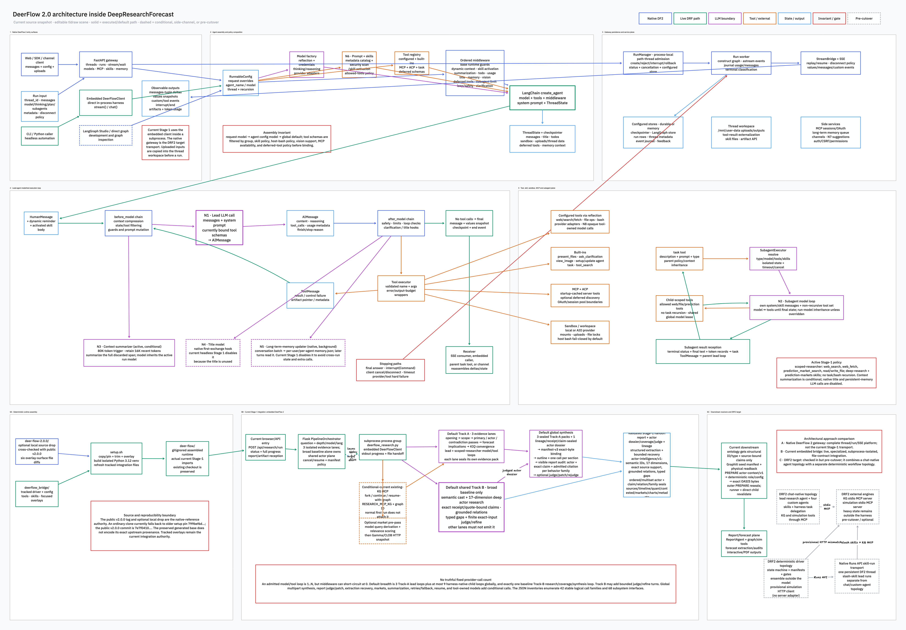

# DeerFlow 2.0 architecture inside DeepAgentForecast

**Source snapshot:** repository commit `fcf7378b2e2fabcfd836fb6e2c512fe153c6727c` plus the current documented working-tree actor-intelligence contracts, inspected 2026-07-22

**Native provenance used for this atlas:** public DeerFlow tag [`v2.0.0`](https://github.com/bytedance/deer-flow/tree/7e7f0410797693cf882594555ba414e0361d4c6f), cross-checked against this workspace's ignored local source drop

**Clean-clone fallback:** `setup.sh` currently pins older DeerFlow 2 commit [`799bef6d…`](https://github.com/bytedance/deer-flow/tree/799bef6d9dbc3a2cb37ce8177eeeabe2a33d8971) when the local drop is absent; it is not byte-equivalent to the audited `v2.0.0` source

**Scope:** DeerFlow 2.0 itself, the live DeepAgentForecast Stage-1 integration, and the optional pre-cutover `drf2/` target

**Excluded:** DeerFlow v1/original
**Method:** current-source reconstruction. Runtime facts below link to the implementation that establishes them.

This document answers four different questions that are easy to conflate:

1. What is the native DeerFlow 2 runtime architecture?
2. Which parts of that architecture does DeepAgentForecast execute today?
3. What crosses every boundary—request fields, messages, model calls, tool calls, events, files, checkpoints, and durable artifacts?
4. How do the live integration and the two `drf2/` target approaches differ?

The editable diagram is [`deerflow2-architecture.tldr`](deerflow2-architecture.tldr). Static exports are [`deerflow2-architecture.svg`](deerflow2-architecture.svg) and [`deerflow2-architecture.png`](deerflow2-architecture.png). The exhaustive machine-readable companion inventories are [`deerflow2-call-inventory.json`](deerflow2-call-inventory.json) and [`deerflow2-interface-inventory.json`](deerflow2-interface-inventory.json). The downstream actor contracts are expanded in the whole-system [`ACTOR_INTELLIGENCE_ARCHITECTURE.md`](../ACTOR_INTELLIGENCE_ARCHITECTURE.md).



## 1. The central finding: the live research runtime is already DeerFlow 2

There is no DeerFlow v1/original runtime in the inspected Stage-1 path. The local source drop and assembled runtime both identify themselves as DeerFlow 2.0. The upstream README describes 2.0 as a ground-up rewrite that shares no code with v1 ([upstream README, lines 12–17](https://github.com/bytedance/deer-flow/blob/7e7f0410797693cf882594555ba414e0361d4c6f/README.md#L12-L17)). “Current live integration” and “DRF2 target” therefore do **not** mean “v1 versus v2.” They mean two different ways of integrating the DeerFlow 2 harness:

- **Current integration:** DeerFlow 2 is the specialized Stage-1 research engine inside an existing deterministic six-stage pipeline.
- **DRF2 targets:** two separate pre-cutover options are present: a chat-native lead/custom-agent topology over KG and simulation stdio MCP, and a deterministic driver that submits slash-skill lead runs through the native Runs API, reaches KG through skills/MCP, and still uses provisional simulation HTTP. Neither has cut over.

### Status and authority legend

| Label | Meaning | Source authority |
|---|---|---|
| **Native DeerFlow 2** | A capability implemented by public upstream DeerFlow 2.0 and verified against the local source drop | upstream `v2.0.0`; local `deer-flow-2.0.0/` when present. The older clean-clone fallback is a separate base revision. |
| **Live / assembled** | A path used by the current Stage-1 runtime | generated `deer-flow/`, with tracked integration inputs in `deerflow_bridge/` |
| **Conditional** | Implemented, but enabled only by configuration, request context, model capability, or runtime threshold | cited native or bridge source |
| **Pre-cutover** | Implemented or scaffolded under `drf2/`, but not the authoritative live pipeline | `drf2/` and its offline tests |
| **Deterministic** | No LLM call occurs at that step | cited Python/shell implementation |

## 2. The three DeerFlow 2 layers in this repository

The repository contains three related layers, not three independent products.

### 2.1 `deer-flow-2.0.0/`: optional local reference and fresh-assembly input

This workspace contains `deer-flow-2.0.0/` as a **local-only, gitignored source drop**. It is not shipped by an ordinary clone of this repository. When present, `setup.sh` copies it to seed a fresh active runtime. Otherwise setup clones `DEERFLOW_REF`, whose default is currently `799bef6d9dbc3a2cb37ce8177eeeabe2a33d8971`, not the later public `v2.0.0` tag at `7e7f041…`. The source and fallback selection live in [`setup.sh`, lines 483–568](../../../setup.sh#L483-L568).

The local drop was compared to public DeerFlow [`v2.0.0` at `7e7f041…`](https://github.com/bytedance/deer-flow/tree/7e7f0410797693cf882594555ba414e0361d4c6f): of 638 common backend files, 632 are byte-identical. The six differences are the subagent-concurrency/inheritance overlay surface (`agents/factory.py`, `lead_agent/agent.py`, `subagent_limit_middleware.py`, `client.py`, `subagents_config.py`, and `subagents/executor.py`). Public native-source links in this report therefore point to the immutable upstream tag; current overlay differences point to the tracked scripts under `deerflow_bridge/patches/`. The local drop is an inspection/assembly source, not a separately running production service.

The fallback pin and `v2.0.0` are materially different: a direct backend comparison spans 243 files and roughly 26.6K added lines between the two revisions ([upstream comparison](https://github.com/bytedance/deer-flow/compare/799bef6d9dbc3a2cb37ce8177eeeabe2a33d8971...7e7f0410797693cf882594555ba414e0361d4c6f)). This atlas therefore does **not** imply that a clean clone's native base is identical to `v2.0.0`. It maps native `v2.0.0` from the immutable public tag/local drop, maps current Stage-1 behavior from the assembled runtime plus tracked overlays, and calls the fallback-pin gap out as a reproducibility risk. Updating that pin is an installation decision outside this documentation-only task.

### 2.2 `deerflow_bridge/` + generated `deer-flow/`: current live Stage-1 runtime

`deerflow_bridge/` owns the tracked integration inputs: the headless research driver, provider/search/market tools, budget and cache code, four research-facing skills, configuration, and compatibility/safety overlays. Setup copies or transforms those inputs into the generated, gitignored `deer-flow/` runtime ([overlay assembly, `setup.sh` lines 571–704](../../../setup.sh#L571-L704)).

The generated `deer-flow/` directory is the code that the current Stage-1 subprocess imports. Setup reruns refresh the tracked overlay but deliberately retain an already assembled DeerFlow base rather than reacquiring it ([base-retention branch, `setup.sh` lines 506–518](../../../setup.sh#L506-L518)). Consequently:

- upstream `v2.0.0`, verified against the optional local drop, establishes native DeerFlow 2 design;
- the generated tree establishes exact current execution;
- the tracked bridge establishes the repository-owned specialization applied to that execution.

At this snapshot, the tracked bridge driver and config are byte-identical to their deployed copies. The wider generated base is not byte-identical to the optional local drop, and setup does not write an immutable provenance record for an already retained base. The two directories must not be described as interchangeable checkouts, and the generated base's exact origin must not be inferred solely from the `deer-flow/` directory name.

### 2.3 `drf2/`: optional, gated, pre-cutover redesign

`drf2/` contains another integration design: DeerFlow 2 custom agents and skills, KG and simulation MCP servers, and a deterministic driver that owns gates, manifests, resume, and ensembles. Its own README identifies it as a pre-cutover scaffold and records no live end-to-end harness proof ([`drf2/README.md`, lines 1–7](../../../drf2/README.md#L1-L7) and [151–173](../../../drf2/README.md#L151-L173)). `SETUP_DRF2=1` only installs optional dependencies and exposes preview commands; it does not replace the live Stage-1 path ([`setup.sh`, lines 730–803](../../../setup.sh#L730-L803)).

## 3. Architectural approaches compared

| Approach | Orchestration owner | DeerFlow 2 role | Engine boundary | State and recovery owner | Status |
|---|---|---|---|---|---|
| **Native DeerFlow 2 gateway** | FastAPI gateway + `RunManager` + LangGraph | General thread/run super-agent platform | Tools, MCP/ACP, sandbox, skills, subagents inside the harness | Native checkpointer, run store, journal, stream bridge, thread workspace | Implemented upstream; native surface, not current Stage-1 transport |
| **Current embedded bridge** | Flask `PipelineOrchestrator` | Stage-1 research engine inside isolated subprocess lanes | Later ontology, KG, simulation, and report stages remain backend-owned | Backend stage state + sealed file contracts; DeerFlow checkpoints inside each bridge process | **Live** |
| **DRF2 chat-native target** | DeerFlow 2 lead plus four custom agents | Routes knowledge-shaped work through native agents/skills | KG and simulation intended as stdio MCP servers | Harness thread plus external engine stores | Configured, pre-cutover |
| **DRF2 deterministic driver target** | Thin external six-stage driver | Executes skill-driven stages on one persistent native thread | Simulation currently invoked outside the harness; KG intended through MCP | Driver manifests, hashes, gates, timeouts, reuse/resume decisions, and sequential ensemble aggregation, with documented empty-manifest, in-flight recovery, and ensemble-gate gaps | Offline-tested, incomplete live wiring |

The current integration favors process isolation, deterministic backend control, explicit artifact promotion, and stage-level recovery. The target approaches expose more of DeerFlow 2’s native thread, skill, custom-agent, and MCP model. The source currently contains both a chat-native and a driver-native target; they are distinct orchestration topologies, not two views of one proven execution path.

## 4. Native DeerFlow 2 entry surfaces

DeerFlow 2 has three meaningful invocation surfaces.

### 4.1 Gateway / Runs API

The normal interactive deployment starts a FastAPI gateway and frontend. The gateway exposes threads, runs, streaming, models, skills, MCP, uploads, artifacts, memory, and feedback. A frontend or SDK run submits a `RunCreateRequest` containing:

- assistant/custom-agent selection;
- input message dictionaries or a LangGraph `Command`;
- metadata and broadly forwarded `RunnableConfig` overrides;
- DeerFlow context: model, thinking, plan mode, subagents, and reasoning effort;
- checkpoint and interrupt controls;
- requested stream modes and subgraph behavior;
- disconnect and multitask strategy.

The request schema is defined in [`thread_runs.py`, lines 37–57](https://github.com/bytedance/deer-flow/blob/7e7f0410797693cf882594555ba414e0361d4c6f/backend/app/gateway/routers/thread_runs.py#L37-L57). The service validates thread ownership, input/message shape, explicitly requested model context, authenticated user context, and run concurrency before handing the run to the runtime manager. It does **not** comprehensively allowlist `body.config`: arbitrary top-level `RunnableConfig` values can replace defaults such as `recursion_limit`, and `body.config.configurable.thread_id` overwrites the path-derived thread ID because it is merged after the server default. The newer `body.config.context` branch rewrites `thread_id` server-side, and authenticated `user_id` is stamped server-side, but the configurable branch remains a trust-boundary seam ([config merge, `services.py` lines 128–166 and 233–261](https://github.com/bytedance/deer-flow/blob/7e7f0410797693cf882594555ba414e0361d4c6f/backend/app/gateway/services.py#L128-L166); [run admission, lines 294–428](https://github.com/bytedance/deer-flow/blob/7e7f0410797693cf882594555ba414e0361d4c6f/backend/app/gateway/services.py#L294-L428)).

The schema is broader than the current execution path. `assistant_id`, `input`, `command`, `metadata`, `config`, `context`, interrupt nodes, stream modes/subgraphs, `on_disconnect`, and the supported concurrency strategies flow into `start_run`. `webhook`, `checkpoint_id`, inline `checkpoint`, `stream_resumable`, `on_completion`, `after_seconds`, `if_not_exists`, and `feedback_keys` are declared request fields, but the current `start_run` implementation does not consume them. `multitask_strategy="enqueue"` is schema-valid, but the manager implements only `reject`, `interrupt`, and `rollback`; enqueue returns HTTP 501 rather than queueing ([service admission, lines 294–436](https://github.com/bytedance/deer-flow/blob/7e7f0410797693cf882594555ba414e0361d4c6f/backend/app/gateway/services.py#L294-L436); [manager strategy boundary, lines 543–629](https://github.com/bytedance/deer-flow/blob/7e7f0410797693cf882594555ba414e0361d4c6f/backend/packages/harness/deerflow/runtime/runs/manager.py#L543-L629)). This distinction is part of the input map: schema presence does not imply runtime effect.

`POST /api/threads/{thread_id}/runs/wait` is not a waiter for an existing run. It creates a run, waits for its terminal record, and then reads final graph state using the **path** thread ID ([`thread_runs.py`, lines 178–202](https://github.com/bytedance/deer-flow/blob/7e7f0410797693cf882594555ba414e0361d4c6f/backend/app/gateway/routers/thread_runs.py#L178-L202)). Execution still uses the effective merged config. Consequently, the configurable-thread override seam can make the worker checkpoint namespace B while this response reads namespace A. Existing-run get/join/stream/cancel operations are separate routes.

The browser-facing route is a streaming run endpoint under `/api/threads/{thread_id}/runs/stream`. The frontend submits messages and context, then receives LangGraph stream modes and custom events. In a packaged deployment, nginx rewrites the frontend’s `/api/langgraph` prefix to the gateway’s `/api` surface.

### 4.2 Embedded `DeerFlowClient`

The Python SDK bypasses HTTP. `DeerFlowClient` resolves configuration, creates the same lead graph, and calls `agent.stream(..., stream_mode=["values", "messages", "custom"])`. It converts raw graph tuples into typed Python events and can offer a higher-level `chat()` collector ([agent assembly, `client.py` lines 221–278](https://github.com/bytedance/deer-flow/blob/7e7f0410797693cf882594555ba414e0361d4c6f/backend/packages/harness/deerflow/client.py#L221-L278); [stream and reception, lines 515–738](https://github.com/bytedance/deer-flow/blob/7e7f0410797693cf882594555ba414e0361d4c6f/backend/packages/harness/deerflow/client.py#L515-L738)).

This is the current Stage-1 integration surface. Each research subprocess constructs one embedded client. A Track-A run uses its main thread ID. Under the default three-lane topology, the broad baseline subprocess also admits the one shared Track-B workflow on a separate `-actor` thread ID; the other two lanes do not. No HTTP gateway is interposed between the bridge and the agent graph.

### 4.3 LangGraph Studio / direct graph surface

The native backend also declares a LangGraph graph surface in `backend/langgraph.json`. It is useful for studio and graph-native development, but it is neither the current Flask-to-bridge transport nor the implemented DRF2 Runs API driver.

## 5. Native request lifecycle, one boundary at a time

### 5.1 Gateway admission

1. The caller sends a thread-scoped run request.
2. Message dictionaries are converted into LangChain messages while preserving IDs, roles, `additional_kwargs`, and upload metadata. Invalid inputs fail before model execution.
3. The service resolves authenticated user/thread ownership and validates a requested model against the configured catalog.
4. It starts with a recursion-limit and path-thread default, then merges client `body.config`, whitelisted DeerFlow `body.context`, authenticated user identity, request metadata, and trace context. The path thread is server-wins only in the `config.context` form; in the legacy `config.configurable` form a caller-supplied `thread_id` currently wins. Other arbitrary top-level config keys can also replace defaults.
5. The process-local `RunManager` applies the requested concurrency policy **by path thread ID**. It can reject an overlap, interrupt the current run while preserving its newest checkpoint, or roll back to the captured pre-run snapshot ([`manager.py`, lines 543–629](https://github.com/bytedance/deer-flow/blob/7e7f0410797693cf882594555ba414e0361d4c6f/backend/packages/harness/deerflow/runtime/runs/manager.py#L543-L629)). This is not a distributed lock, and distinct path threads can still alias one effective checkpoint namespace through the config seam.
6. A `RunRecord` is written to the configured run store before it becomes externally visible. Failure to write removes the in-memory record rather than advertising an unrecorded run ([`manager.py`, lines 225–266 and 357–400](https://github.com/bytedance/deer-flow/blob/7e7f0410797693cf882594555ba414e0361d4c6f/backend/packages/harness/deerflow/runtime/runs/manager.py#L225-L266)). Restart durability is conditional: without a database session factory, dependency wiring selects process-local `MemoryRunStore` ([`deps.py`, lines 188–198](https://github.com/bytedance/deer-flow/blob/7e7f0410797693cf882594555ba414e0361d4c6f/backend/app/gateway/deps.py#L188-L198)).

### 5.2 Worker construction and execution

`run_agent` is the native execution envelope ([`worker.py`, lines 124–438](https://github.com/bytedance/deer-flow/blob/7e7f0410797693cf882594555ba414e0361d4c6f/backend/packages/harness/deerflow/runtime/runs/worker.py#L124-L438)):

1. transition pending → running;
2. capture the pre-run checkpoint for rollback;
3. publish run metadata;
4. install request, tracing, user, agent, cancellation, and journaling context;
5. resolve checkpointer and LangGraph store;
6. construct the lead agent graph;
7. attach `interrupt_before` / `interrupt_after` nodes;
8. translate requested public stream modes into LangGraph modes;
9. execute `agent.astream(...)`;
10. serialize each chunk and publish it to the stream bridge;
11. classify normal completion, explicit cancellation, provider fallback, or error; a generic LangGraph `interrupt_before`/`interrupt_after` can be serialized and checkpointed, but a normally returning interrupted graph is currently recorded as run `success`, not `interrupted`; uncaught timeout exceptions are recorded as `error`—the enum declares `timeout`, but this worker does not assign it;
12. in `finally`, flush journal/token data, copy a generated title from checkpoint state to thread metadata, persist terminal status, publish `end`, and retain the stream buffer for 60 seconds.

### 5.3 Reception

The receiver can be an SSE client, create-and-wait caller, embedded Python iterator, channel integration, or the parent agent waiting on a `task` tool. It receives a combination of:

- `messages-tuple`: token/text/reasoning/tool-call deltas;
- `values`: full state snapshots after graph steps;
- `updates`: node-local state changes;
- `custom`: task, token, audit, and middleware events;
- `metadata`, heartbeat, interrupt, error, and `end` envelopes.

An SSE client may reconnect with `Last-Event-ID`. The in-memory bridge retains at most 256 events per run, supports late subscribers, emits 15-second heartbeats, and separates stream delivery from graph execution ([`memory.py`, lines 17–132](https://github.com/bytedance/deer-flow/blob/7e7f0410797693cf882594555ba414e0361d4c6f/backend/packages/harness/deerflow/runtime/stream_bridge/memory.py#L17-L132)). The bridge is process-local; a Redis implementation is not present in this snapshot.

## 6. How the lead agent is assembled

### 6.1 Model resolution

The logical model catalog describes provider class, provider model ID, Responses API/output mode, vision support, thinking support, reasoning effort, and provider-specific extras ([`model_config.py`, lines 4–51](https://github.com/bytedance/deer-flow/blob/7e7f0410797693cf882594555ba414e0361d4c6f/backend/packages/harness/deerflow/config/model_config.py#L4-L51)). `create_chat_model` dynamically imports the configured provider class and applies thinking/reasoning/provider compatibility rules ([`factory.py`, lines 82–110 and 126–204](https://github.com/bytedance/deer-flow/blob/7e7f0410797693cf882594555ba414e0361d4c6f/backend/packages/harness/deerflow/models/factory.py#L82-L110)).

Native inference transport is provider SDK or direct HTTP, not a local CLI subprocess. The Claude provider may load Claude Code CLI-origin OAuth credentials but invokes `ChatAnthropic` ([`claude_provider.py`, lines 28–145](https://github.com/bytedance/deer-flow/blob/7e7f0410797693cf882594555ba414e0361d4c6f/backend/packages/harness/deerflow/models/claude_provider.py#L28-L145)); the Codex provider may [load Codex CLI-origin credentials](https://github.com/bytedance/deer-flow/blob/7e7f0410797693cf882594555ba414e0361d4c6f/backend/packages/harness/deerflow/models/openai_codex_provider.py#L92-L107) but [calls the Codex Responses endpoint directly](https://github.com/bytedance/deer-flow/blob/7e7f0410797693cf882594555ba414e0361d4c6f/backend/packages/harness/deerflow/models/openai_codex_provider.py#L205-L255). Credential provenance and inference transport are separate boundaries.

At the lead layer, model precedence is:

```text
request override → selected custom-agent model → global configured default
```

An invalid requested model is logged and falls back to the first configured model. Unsupported thinking is disabled before construction ([model resolution, `lead_agent/agent.py` lines 64–76](https://github.com/bytedance/deer-flow/blob/7e7f0410797693cf882594555ba414e0361d4c6f/backend/packages/harness/deerflow/agents/lead_agent/agent.py#L64-L76); [thinking gate, lines 432–441](https://github.com/bytedance/deer-flow/blob/7e7f0410797693cf882594555ba414e0361d4c6f/backend/packages/harness/deerflow/agents/lead_agent/agent.py#L432-L441)).

### 6.2 Prompt construction

The lead prompt is the composition of:

1. static DeerFlow 2 system instructions;
2. optional custom-agent/SOUL instructions;
3. enabled skill metadata—name, description, category, and path, not the full bodies;
4. tool-use and sandbox instructions appropriate to the registered capabilities;
5. hidden per-turn context injected by middleware: date, memory, uploads, and slash-activated skill body;
6. checkpointed conversation messages.

Static assembly is implemented in [`prompt.py`, lines 757–813](https://github.com/bytedance/deer-flow/blob/7e7f0410797693cf882594555ba414e0361d4c6f/backend/packages/harness/deerflow/agents/lead_agent/prompt.py#L757-L813); metadata-only skill disclosure is in [`prompt.py`, lines 608–674](https://github.com/bytedance/deer-flow/blob/7e7f0410797693cf882594555ba414e0361d4c6f/backend/packages/harness/deerflow/agents/lead_agent/prompt.py#L608-L674).

### 6.3 Tool registry and precedence

Tool implementations are collected in this order:

```text
configured tools → native built-ins → MCP tools → ACP tools
```

Later name collisions are skipped, so earlier definitions win. Configured groups, host-bash policy, skill `allowed-tools`, model vision capability, subagent enablement, extension availability, and deferred-tool policy can all remove schemas before the model sees them ([`tools.py`, lines 44–176](https://github.com/bytedance/deer-flow/blob/7e7f0410797693cf882594555ba414e0361d4c6f/backend/packages/harness/deerflow/tools/tools.py#L44-L176); [`tool_policy.py`, lines 13–44](https://github.com/bytedance/deer-flow/blob/7e7f0410797693cf882594555ba414e0361d4c6f/backend/packages/harness/deerflow/skills/tool_policy.py#L13-L44)).

Conditional built-ins include `task`, `view_image`, `skill_manage`, `ask_clarification`, `present_files`, and `tool_search`. The `ToolNode` retains implementations, while middleware controls which schemas are visible and callable on a particular model turn.

### 6.4 Exact middleware construction order

Middleware order is semantically important because wrappers nest and state transformations feed later hooks. The current lead-agent builder constructs:

1. tool-output budget;
2. thread data;
3. uploads, for lead-agent mode;
4. sandbox acquisition/state;
5. dangling tool-call repair;
6. LLM retry/circuit-breaker handling;
7. optional guardrail;
8. sandbox audit;
9. tool-error conversion;
10. dynamic date and memory context;
11. slash-skill activation;
12. optional history summarization;
13. optional todo support;
14. token usage;
15. title generation;
16. long-term-memory capture;
17. optional image viewing;
18. optional deferred-tool filtering;
19. optional subagent limit;
20. optional loop detection;
21. custom middleware;
22. optional provider-safety termination;
23. clarification, deliberately last.

The shared base chain is defined in [`tool_error_handling_middleware.py`, lines 129–249](https://github.com/bytedance/deer-flow/blob/7e7f0410797693cf882594555ba414e0361d4c6f/backend/packages/harness/deerflow/agents/middlewares/tool_error_handling_middleware.py#L129-L249); lead additions are composed in [`lead_agent/agent.py`, lines 270–377](https://github.com/bytedance/deer-flow/blob/7e7f0410797693cf882594555ba414e0361d4c6f/backend/packages/harness/deerflow/agents/lead_agent/agent.py#L270-L377).

For `before_model` hooks, list order is execution order. For `after_model` and around-call wrappers, nesting means the effective reception order can be reversed: the last wrapper entered can receive the return first. The architectural invariant is therefore not merely “23 plugins exist”; it is that each model/tool pass is transformed on entry and its result is observed through a nested policy stack on return.

### 6.5 Thread state

`ThreadState` extends message state with:

- sandbox ID;
- physical thread/workspace/upload/output paths;
- title;
- presented artifact paths;
- todo items;
- upload metadata;
- viewed-image cache;
- deferred-tool promotion state, scoped by immutable catalog hash.

Reducers deduplicate artifacts, reject conflicting sandbox IDs, and invalidate promoted schemas when their catalog hash changes ([`thread_state.py`, lines 21–119](https://github.com/bytedance/deer-flow/blob/7e7f0410797693cf882594555ba414e0361d4c6f/backend/packages/harness/deerflow/agents/thread_state.py#L21-L119)).

## 7. The lead model/tool loop

DeerFlow 2 does not encode its lead workflow as a hand-written research state machine. It builds a middleware-governed LangChain `create_agent` graph ([`lead_agent/agent.py`, lines 402–540](https://github.com/bytedance/deer-flow/blob/7e7f0410797693cf882594555ba414e0361d4c6f/backend/packages/harness/deerflow/agents/lead_agent/agent.py#L402-L540)). A single logical turn proceeds as follows:

1. A `HumanMessage` enters checkpointed thread state.
2. `before_model` middleware repairs context, injects dynamic reminders and activated skill content, summarizes if needed, filters tools, and enforces policy.
3. The lead model receives the system prompt, transformed message list, and currently bound tool schemas.
4. The provider returns an `AIMessage` with content/reasoning, zero or more tool calls, usage metadata, and a finish reason.
5. `after_model` middleware records usage/title/memory signals and applies safety, loop, todo, subagent, and clarification policy.
6. If executable tool calls remain, the tool node validates name and arguments and invokes the implementation through tool wrappers.
7. A normal result or converted failure becomes a `ToolMessage`; a control-flow tool can return `Command`.
8. State reducers append the reception, and the model is called again with the new observation.
9. The loop stops when the model returns no executable tool call, clarification routes directly to `END`, a configured interrupt fires, cancellation occurs, or an unrecovered failure is classified terminal.

This produces the fundamental multiplicity:

```text
one admitted request = 0..N lead-model calls separated by 0..N tool executions
```

Ordinary model/tool work uses at least one model call, but middleware can short-circuit before the lead model—for example an invalid or disallowed slash skill returns an AI failure immediately. The number is otherwise dynamic, bounded by recursion limit, subagent concurrency, loop detection, tool/provider budgets, timeouts, and cancellation—not by a fixed call count in the bridge.

### Failure reception

The LLM wrapper retries transient HTTP, connection, busy, timeout, and stream-stall failures with backoff and `Retry-After` support. Auth/quota classes are not blindly retried, and a shared circuit breaker fails fast while open ([`llm_error_handling_middleware.py`, lines 27–98, 101–226, and 296–398](https://github.com/bytedance/deer-flow/blob/7e7f0410797693cf882594555ba414e0361d4c6f/backend/packages/harness/deerflow/agents/middlewares/llm_error_handling_middleware.py#L27-L98)).

After retry exhaustion, the wrapper returns a marked fallback `AIMessage`. The worker recognizes the marker and persists the run as `error`, even if the graph itself reached an ordinary end. This preserves the difference between “the graph stopped” and “the requested model work succeeded” ([`worker.py`, lines 316–365 and 566–640](https://github.com/bytedance/deer-flow/blob/7e7f0410797693cf882594555ba414e0361d4c6f/backend/packages/harness/deerflow/runtime/runs/worker.py#L316-L365)).

## 8. Every native DeerFlow 2 LLM call family

The detailed JSON inventory records triggers, exact inputs/outputs, receivers, persistence, multiplicity, and anchors. The complete native set is:

| ID | Call family | Trigger | Input → output | Receiver / persistence | Multiplicity |
|---|---|---|---|---|---|
| N1 | Lead-agent model loop | Every model node reached in a user turn | system + transformed history + visible tool schemas → `AIMessage` text/reasoning/tool calls/usage | next middleware/tool step, stream, checkpointer | `0..N` per request; ordinary admitted loop `1..N`; retries conditional |
| N2 | Subagent model loop | Lead executes `task` | task prompt + child system/skills + child-visible tools → child AI/tool loop and final text/status | task `ToolMessage` returned to parent | `0..N` tasks; each task `1..N` calls |
| N3 | Summarization model | history crosses configured threshold | complete selected discard span → summary text; active bridge inherits the run model and preserves evidence-ledger fields | hidden named summary `HumanMessage` replaces old span | conditional, may repeat over a long thread |
| N4 | Title model | first complete exchange while title is empty | first user/assistant exchange → short title | `ThreadState.title`, then thread metadata | at most once per thread; local fallback exists |
| N5 | Long-term-memory updater | debounced completed exchange or immediate pre-summary capture | existing memory + conversation + correction hints → structured facts/summaries/removals | per-user/per-agent memory storage | conditional/background; coalesced by key |
| N6 | Skill security scanner | custom skill/support-file write or archive install | file content + policy prompt → `allow`, `warn`, or `block` JSON | skill mutation gate/history | once per scanned file; fail-closed |
| N7 | Follow-up suggestions | separate suggestions endpoint when enabled | recent conversation → JSON string array | HTTP response only | one per request; malformed/error → empty list |
| N8 | Tool-owned model calls | an external MCP/ACP/configured tool internally uses a model | opaque to DeerFlow core | tool-owned receiver, then `ToolMessage` | unknowable at harness boundary |

Source anchors: lead construction and invocation ([`agent.py`, lines 402–540](https://github.com/bytedance/deer-flow/blob/7e7f0410797693cf882594555ba414e0361d4c6f/backend/packages/harness/deerflow/agents/lead_agent/agent.py#L402-L540)); summarization ([`summarization_middleware.py`, lines 120–252](https://github.com/bytedance/deer-flow/blob/7e7f0410797693cf882594555ba414e0361d4c6f/backend/packages/harness/deerflow/agents/middlewares/summarization_middleware.py#L120-L252)); title ([`title_middleware.py`, lines 69–180](https://github.com/bytedance/deer-flow/blob/7e7f0410797693cf882594555ba414e0361d4c6f/backend/packages/harness/deerflow/agents/middlewares/title_middleware.py#L69-L180)); memory updater ([`updater.py`, lines 380–684](https://github.com/bytedance/deer-flow/blob/7e7f0410797693cf882594555ba414e0361d4c6f/backend/packages/harness/deerflow/agents/memory/updater.py#L380-L684)); skill scanner ([`security_scanner.py`, lines 70–109](https://github.com/bytedance/deer-flow/blob/7e7f0410797693cf882594555ba414e0361d4c6f/backend/packages/harness/deerflow/skills/security_scanner.py#L70-L109)); suggestions ([`suggestions.py`, lines 141–186](https://github.com/bytedance/deer-flow/blob/7e7f0410797693cf882594555ba414e0361d4c6f/backend/app/gateway/routers/suggestions.py#L141-L186)).

Deferred tool discovery, MCP discovery/execution, upload processing, clarification, artifact serving, built-in allowlist checks, checkpointing, and stream serialization do not themselves call an LLM.

## 9. Tool, skill, MCP, sandbox, upload, and artifact planes

### 9.1 Deferred MCP tools

When deferred search is enabled, MCP-tagged schemas are withheld from the first model call. The model initially sees `tool_search`:

1. model calls `tool_search(query)`;
2. deterministic search matches exact `select:`, required `+term`, regular expression, or substring criteria, returning at most five schemas;
3. the tool returns schemas plus `Command(update={promoted: {catalog_hash, names}})`;
4. the next model pass sees only promoted deferred schemas;
5. a direct call to an unpromoted implementation is blocked;
6. catalog-hash changes invalidate old promotions.

See [`tool_search.py`, lines 53–103 and 130–201](https://github.com/bytedance/deer-flow/blob/7e7f0410797693cf882594555ba414e0361d4c6f/backend/packages/harness/deerflow/tools/builtins/tool_search.py#L53-L103) and [`deferred_tool_filter_middleware.py`, lines 29–112](https://github.com/bytedance/deer-flow/blob/7e7f0410797693cf882594555ba414e0361d4c6f/backend/packages/harness/deerflow/agents/middlewares/deferred_tool_filter_middleware.py#L29-L112).

### 9.2 Tool result budgeting

Tool exceptions are converted to `ToolMessage(status="error")`; LangGraph control-flow signals are re-raised. Normal outputs above 12,000 characters are externalized under `/mnt/user-data/outputs/.tool-results/`, and the model receives a head/tail preview plus a read path. If persistence fails, outputs above 30,000 characters are truncated. `read_file` is exempt so reading an externalized result cannot externalize itself again ([`tool_output_budget_middleware.py`, lines 325–454 and 565–643](https://github.com/bytedance/deer-flow/blob/7e7f0410797693cf882594555ba414e0361d4c6f/backend/packages/harness/deerflow/agents/middlewares/tool_output_budget_middleware.py#L325-L454)).

### 9.3 MCP discovery and execution

MCP configuration supports stdio, SSE, and streamable HTTP. Configuration resolution is explicit path → environment → caller project → legacy location. Invalid JSON or top-level schema raises during configuration loading; disabled or malformed individual server entries can instead be logged and omitted, and discovery/setup failure can degrade to an empty tool list ([`extensions_config.py`, lines 89–209](https://github.com/bytedance/deer-flow/blob/7e7f0410797693cf882594555ba414e0361d4c6f/backend/packages/harness/deerflow/config/extensions_config.py#L89-L209); [`mcp/client.py`, lines 49–68](https://github.com/bytedance/deer-flow/blob/7e7f0410797693cf882594555ba414e0361d4c6f/backend/packages/harness/deerflow/mcp/client.py#L49-L68); [`mcp/tools.py`, lines 630–653](https://github.com/bytedance/deer-flow/blob/7e7f0410797693cf882594555ba414e0361d4c6f/backend/packages/harness/deerflow/mcp/tools.py#L630-L653)).

The complete pass is:

```text
extensions configuration
→ server validation and optional OAuth/interceptors
→ MultiServerMCPClient discovery
→ server-prefixed, MCP-tagged LangChain tools
→ mtime cache
→ skill policy
→ optional deferred catalog/promotion
→ lead tool call
→ scoped MCP session
→ server call_tool
→ MCP text/image/resource/structuredContent conversion
→ LangChain ToolMessage + artifact
→ next lead-model pass
```

Stdio sessions are scoped by `user_id:thread_id`, use the thread workspace as cwd, and are pooled by `(server, scope)` with LRU/coalesced opening semantics. HTTP/SSE sessions remain adapter-managed. Tool content is converted to LangChain content blocks; `structuredContent` becomes the artifact; MCP errors become `ToolException` ([`session_pool.py`, lines 47–196 and 342–455](https://github.com/bytedance/deer-flow/blob/7e7f0410797693cf882594555ba414e0361d4c6f/backend/packages/harness/deerflow/mcp/session_pool.py#L47-L196); [`mcp/tools.py`, lines 291–653](https://github.com/bytedance/deer-flow/blob/7e7f0410797693cf882594555ba414e0361d4c6f/backend/packages/harness/deerflow/mcp/tools.py#L291-L653)).

### 9.4 Skills

Skills use progressive disclosure:

1. enabled skill metadata enters the system prompt;
2. the model selects a relevant skill from name/description;
3. it calls `read_file` on `/mnt/skills/.../SKILL.md`;
4. the full instructions arrive as an ordinary tool result and become conversation context.

Slash activation takes a different path. `/skill-name` is resolved before the model call, the full body is safely read, XML-escaped, and injected as a hidden `HumanMessage` immediately before the user message. An unknown, disabled, or disallowed activation returns an AI failure without invoking the lead model ([`skill_activation_middleware.py`, lines 98–289](https://github.com/bytedance/deer-flow/blob/7e7f0410797693cf882594555ba414e0361d4c6f/backend/packages/harness/deerflow/agents/middlewares/skill_activation_middleware.py#L98-L289)).

Custom skill writes are serialized, scanned, atomically replaced, and recorded in JSONL history. Archive installation rejects traversal, **skips** symlink entries, caps expansion, validates frontmatter/name, scans `SKILL.md` plus qualifying support text/executables one file at a time, and stages before replacement ([`installer.py`, lines 33–196](https://github.com/bytedance/deer-flow/blob/7e7f0410797693cf882594555ba414e0361d4c6f/backend/packages/harness/deerflow/skills/installer.py#L33-L196)).

### 9.5 Sandbox and file tools

Thread middleware derives user-isolated physical and virtual paths. Sandbox acquisition is lazy; the first sandbox-backed tool acquires a local or AIO sandbox, and a `Command` persists its ID into graph state. Release means “return/reuse” for these providers, not necessarily “destroy” ([`sandbox/middleware.py`, lines 27–217](https://github.com/bytedance/deer-flow/blob/7e7f0410797693cf882594555ba414e0361d4c6f/backend/packages/harness/deerflow/sandbox/middleware.py#L27-L217)).

The local provider maps thread workspace/uploads/outputs into `/mnt/user-data`, mounts skills read-only, and caches by thread. Host `bash` is fail-closed unless explicitly enabled. Path checks reject traversal, unsafe cwd, file URLs, and arbitrary host paths ([`local_sandbox_provider.py`, lines 34–345](https://github.com/bytedance/deer-flow/blob/7e7f0410797693cf882594555ba414e0361d4c6f/backend/packages/harness/deerflow/sandbox/local/local_sandbox_provider.py#L34-L345); [`sandbox/tools.py`, lines 631–1038](https://github.com/bytedance/deer-flow/blob/7e7f0410797693cf882594555ba414e0361d4c6f/backend/packages/harness/deerflow/sandbox/tools.py#L631-L1038)).

The file/shell tool surface includes `bash`, `ls`, `glob`, `grep`, `read_file`, `write_file`, and `str_replace`, with bounded output/read/write behavior ([`sandbox/tools.py`, lines 1395–1907](https://github.com/bytedance/deer-flow/blob/7e7f0410797693cf882594555ba414e0361d4c6f/backend/packages/harness/deerflow/sandbox/tools.py#L1395-L1907)).

### 9.6 Upload and artifact reception

The native upload API accepts multipart files under `/api/threads/{thread_id}/uploads`, with default request/file/aggregate limits. It validates thread ownership and safe names, writes without following symlinks, optionally converts supported documents to Markdown, adjusts sandbox readability, and copies into remote sandboxes when the provider cannot mount thread data ([`uploads.py`, lines 213–346](https://github.com/bytedance/deer-flow/blob/7e7f0410797693cf882594555ba414e0361d4c6f/backend/app/gateway/routers/uploads.py#L213-L346)).

Before the model runs, upload middleware validates current attachments, discovers historical files, extracts converted previews/outlines, and prepends an `<uploaded_files>` context block while preserving original message metadata ([`uploads_middleware.py`, lines 151–312](https://github.com/bytedance/deer-flow/blob/7e7f0410797693cf882594555ba414e0361d4c6f/backend/packages/harness/deerflow/agents/middlewares/uploads_middleware.py#L151-L312)).

`present_files(paths)` verifies that each virtual path is beneath the outputs directory and merges it into `ThreadState.artifacts`; the tool does **not** check that the target already exists or is a regular file before state mutation. Authenticated artifact GET later resolves the path and forces active HTML/XHTML/SVG content to download rather than inline execution ([`present_file_tool.py`, lines 33–120](https://github.com/bytedance/deer-flow/blob/7e7f0410797693cf882594555ba414e0361d4c6f/backend/packages/harness/deerflow/tools/builtins/present_file_tool.py#L33-L120); [`artifacts.py`, lines 99–202](https://github.com/bytedance/deer-flow/blob/7e7f0410797693cf882594555ba414e0361d4c6f/backend/app/gateway/routers/artifacts.py#L99-L202)).

## 10. Subagents

The `task` tool creates an isolated child graph, not a new OS process:

1. lead emits `task(description, prompt, subagent_type)`;
2. the tool copies thread, sandbox, user, trace, model, and cancellation context;
3. registry resolution selects a built-in or custom child and resolves child model → parent model → global default;
4. parent and child skill allowlists are intersected;
5. tools are resolved with `subagent_enabled=false`, preventing recursive task spawning;
6. the child receives full enabled skill bodies as system context and the task as one human message;
7. its `values` stream is consumed internally until completed, failed, cancelled, or timed out;
8. the last unique AI text and structured status become the parent task result;
9. that result is appended as a `ToolMessage`, allowing the lead loop to continue.

The child has no checkpointer, but shares the parent’s thread paths and sandbox. Built-in `general-purpose` excludes `task`, clarification, and artifact presentation; built-in `bash` is hidden when host bash is disallowed ([native task lifecycle, `task_tool.py` lines 187–447](https://github.com/bytedance/deer-flow/blob/7e7f0410797693cf882594555ba414e0361d4c6f/backend/packages/harness/deerflow/tools/builtins/task_tool.py#L187-L447); [native child executor, lines 278–718](https://github.com/bytedance/deer-flow/blob/7e7f0410797693cf882594555ba414e0361d4c6f/backend/packages/harness/deerflow/subagents/executor.py#L278-L718)). The current bridge overlay changes the parent and scheduler concurrency boundary from upstream’s narrower default to a shared, configuration-driven clamp of 1–8 ([`apply_subagent_overlays.py`, lines 1–184](../../../deerflow_bridge/patches/apply_subagent_overlays.py#L1-L184)).

## 11. Clarification, HITL, interruption, cancel, and rollback

`ask_clarification` is intercepted by middleware before ordinary tool execution. The middleware writes a stable `ToolMessage` and returns `Command(..., goto=END)`. The current run ends; the user’s answer normally arrives as a new human turn. It is not a suspended `interrupt()` inside the tool ([`clarification_middleware.py`, lines 25–200](https://github.com/bytedance/deer-flow/blob/7e7f0410797693cf882594555ba414e0361d4c6f/backend/packages/harness/deerflow/agents/middlewares/clarification_middleware.py#L25-L200)).

Generic LangGraph HITL is separate:

- request-level `interrupt_before` / `interrupt_after` attach to graph nodes;
- `command.resume` becomes LangGraph `Command(resume=...)`;
- state GET exposes tasks and checkpoint;
- state POST can merge human-supplied channel values into a new checkpoint;
- interrupt cancellation preserves the newest checkpoint;
- rollback restores the exact pre-run snapshot.

Interrupt content survives in checkpoint/value events and can be resumed with a later `Command(resume=...)`. The current worker does not, however, translate a normally returned graph interrupt into `RunStatus.interrupted`; absent explicit cancellation it records the run as `success`. Consumers must inspect checkpoint/task/event content rather than using run status alone to detect a paused graph. These paths are implemented across [`services.py`, lines 398–428](https://github.com/bytedance/deer-flow/blob/7e7f0410797693cf882594555ba414e0361d4c6f/backend/app/gateway/services.py#L398-L428), [`worker.py`, lines 276–280 and 308–385](https://github.com/bytedance/deer-flow/blob/7e7f0410797693cf882594555ba414e0361d4c6f/backend/packages/harness/deerflow/runtime/runs/worker.py#L276-L280), and the thread/run routers.

## 12. Persistence and memory planes

Different data has different authority and lifetime:

| Plane | Data | Durability |
|---|---|---|
| LangGraph checkpointer | messages, title, todos, uploads, sandbox ID, artifacts, deferred promotions | memory, SQLite, or PostgreSQL depending on config |
| LangGraph store | cross-step/store data exposed to the graph | memory, SQLite, or PostgreSQL depending on config |
| Run store | run identity, status, counts, timing, metadata | optional durable store |
| Run journal/event store | human/model/tool/middleware/token events | optional durable JSONL/database store |
| Stream bridge | recent serialized events, subscribers, heartbeat/end | process memory, bounded; 60-second post-run retention |
| Thread filesystem | workspace, uploads, outputs, externalized tool results, skill files | host/user-thread storage; bind-mounted or synchronized |
| Long-term memory | per-user/per-agent facts and summaries | separate JSON storage, atomic replacement |
| DeepAgentForecast Stage-1 contract | dossier, structured extracts, source ledger, judge, charts, metadata, hashes | backend run directory with staging and manifest-last promotion |

Native gateway dependencies reconcile configured persistence and create compatible checkpointer/store backends in [`deps.py`, lines 144–236](https://github.com/bytedance/deer-flow/blob/7e7f0410797693cf882594555ba414e0361d4c6f/backend/app/gateway/deps.py#L144-L236).

Long-term memory is a side channel rather than LangGraph message state. Completed exchanges are debounced by `(thread, user, agent)`; a new pending item replaces and merges flags for that key. The updater asks a model for structured summaries/facts/removals, validates and merges them, and atomically saves per-user/per-agent JSON. Dynamic context reads a bounded memory rendering on a later turn ([`memory/queue.py`, lines 28–233](https://github.com/bytedance/deer-flow/blob/7e7f0410797693cf882594555ba414e0361d4c6f/backend/packages/harness/deerflow/agents/memory/queue.py#L28-L233); [`memory/updater.py`, lines 281–684](https://github.com/bytedance/deer-flow/blob/7e7f0410797693cf882594555ba414e0361d4c6f/backend/packages/harness/deerflow/agents/memory/updater.py#L281-L684); [`dynamic_context_middleware.py`, lines 88–232](https://github.com/bytedance/deer-flow/blob/7e7f0410797693cf882594555ba414e0361d4c6f/backend/packages/harness/deerflow/agents/middlewares/dynamic_context_middleware.py#L88-L232)).

## 13. Current live DeepAgentForecast integration

### 13.1 External API and backend acceptance

The actual launch endpoint is:

```text
POST /api/research/run
```

The request accepts `prompt`, `mode`, `project_name`, `depth`, `max_rounds`, `language`, `research_language`, and `model`. The API validates/preflights and returns a `pipeline_id`, task ID, mode, and initial status ([`backend/app/api/research.py`, lines 43–119](../../../backend/app/api/research.py#L43-L119)).

`PipelineOrchestrator` creates a `pipe_*` identity, task-manager record, six stage records, persisted options/state, and a daemon execution thread ([`pipeline_orchestrator.py`, lines 4400–4456](../../../backend/app/services/pipeline_orchestrator.py#L4400-L4456)). Stage 1 first checks for a reusable sealed contract or synthesis-only recovery before collecting evidence again.

### 13.2 Process boundary

For a new evidence run, the backend:

1. synchronizes/verifies the tracked bridge and skill bundle;
2. writes the user prompt to an owner-readable private file;
3. builds bridge CLI arguments;
4. launches `deer-flow/deerflow_research.py` with `deer-flow/backend/.venv/bin/python`;
5. uses `deer-flow/` as cwd;
6. merges stdout/stderr into the parent progress receiver;
7. monitors cancellation, timeout, heartbeat, and output freshness;
8. accepts salvage only under explicit freshness and size rules.

The runner boundary is in [`pipeline_orchestrator.py`, lines 1326–1766](../../../backend/app/services/pipeline_orchestrator.py#L1326-L1766). The bridge CLI accepts direct prompt or prompt file, output directory, model, depth, language, subagent flag, resume, extract-only, evidence-only, and synthesis-manifest inputs ([`deerflow_research.py`, lines 10660–10693](../../../deerflow_bridge/deerflow_research.py#L10660-L10693)).

The bridge atomically writes `prediction_requirement.txt`, verifies the deployed skill bundle, then constructs an embedded `DeerFlowClient` with the selected model, thinking enabled, optional subagents, and the allowed skills `deep-research`, `actor-ontology-research`, `prediction-markets`, and `forecast-visuals` ([`deerflow_research.py`, lines 10695–10765 and 10947–10971](../../../deerflow_bridge/deerflow_research.py#L10695-L10765)).

### 13.3 Outer lanes, the default global path, and the shared Track-B actor plane

The default deep configuration enables three outer evidence lanes. Each lane is an isolated subprocess with a distinct research angle:

1. baseline/current evidence;
2. base rates and historical analogs;
3. incentives, contrarian evidence, and markets.

Track A is broad evidence research. `RESEARCH_GLOBAL_SYNTHESIS=true` makes all three outer subprocesses evidence-only **for Track A**, but it does not suppress the separate actor plane. At run admission the parent pins `actor-intelligence-policy/v1`: a pinned `required=true` run must produce the complete current contract, pinned `false` is an explicit disablement, and absence of the policy identifies a pre-policy legacy run rather than inheriting today's ambient setting ([policy capture](../../../backend/app/services/pipeline_orchestrator.py#L477-L498)). With the default `DEERFLOW_DUAL_TRACK=true`, `research_dual_track_for_outer_lane()` assigns Track B only to zero-based lane 0, the broad baseline. Lanes 1 and 2 cannot emit competing dossiers, and the later global child does not rerun Track B. The default topology remains **three Track-A evidence packs + one shared baseline Track-B dossier + one global report/extraction owner** ([assignment helper](../../../backend/app/services/pipeline_orchestrator.py#L5164-L5169); [current lane use](../../../backend/app/services/pipeline_orchestrator.py#L10015-L10022)).

The shared Track-B thread runs two tool-capable logical agent loops before synthesis. The landscape loop identifies and force-ranks material actors. A scheduled cast-wide completion loop revisits every Tier-1/2 actor across all 17 `actor-intelligence/v1` dimensions and all five exact behavior-ready families: `identity_history`, `incentives_motivations_values`, `capabilities_constraints`, `actions_plans_investments`, and `decision_likely_actions_red_lines`. Preferences must be evidenced repeated choices rather than invented psychology ([schema and family contract](../../../deerflow_bridge/deerflow_research.py#L2514-L2552); [current Track-B execution](../../../deerflow_bridge/deerflow_research.py#L12820-L13923)).

A covered current claim is not merely a citation-shaped string. It must resolve to the admitted Track-B fetched-source ledger and carry an exact quote/span, receipt ID and content hash; the producer also preserves canonical source/claim identity and the causal relationship tuple `valence`, `polarity`, `sign`, `strength`, `grade`, `since`, `until`, `lag`. Unsupported material becomes the exact six-field gap object `reason`, `attempted_queries`, `receipt_ids`, `result_ids`, `attempt_count`, `exhausted`. Every admitted gap needs at least one real query/result receipt bound to the current thread and `exhausted=true`. A dimension feeding any behavior-ready family is stricter: at least two distinct queries, two attempts and two bound search results are required before a gap is accepted ([claim/source/causal normalization](../../../deerflow_bridge/deerflow_research.py#L2582-L3569); [gap and dossier audits](../../../deerflow_bridge/deerflow_research.py#L12852-L13375)).

The bridge then makes one tool-free dossier-synthesis call, followed by a ten-dimension judge and up to two targeted gap-research/resynthesis rounds by default. If refinement changes the final bytes, it performs a final-byte rejudge. When the judge is enabled, the gate is fail-closed: unavailable transport, malformed or non-finite output, stale byte binding, truncation and explicit `FAIL` all reject the final dossier after the bounded rounds. Only a deliberately disabled judge or the explicit length-based latency skip can rely on the deterministic audit alone, and neither can bypass that audit. The audit requires one substantive Tier-1/2 profile per ledger actor, all 17 cells, quote/receipt-bound covered claims, real typed gap attempts, at least one non-gap dimension and all five behavior-ready families ([deterministic dossier audit](../../../deerflow_bridge/deerflow_research.py#L12852-L13388); [current judge/refinement gate](../../../deerflow_bridge/deerflow_research.py#L13579-L13923)).

After lanes finish, global synthesis is fail-closed on shared ownership. Baseline must have a current dossier with current `meta.json`, question/workflow flags, exact actor/source/coverage set equality and expected bytes/hashes; a nonbaseline dossier is an error. `evidence_synthesis_manifest.json` version 3 contains exactly one actor descriptor binding `actor_dossier.md`, `actor_dossier_coverage.json`, baseline `sources.json`, and optional `actor_dossier_judge.json`. The global child verifies the exact paths, byte sizes and hashes, reconstructs the admitted source and search-receipt sets, reruns coverage and projects the dossier into five explicit family blocks before synthesis. Synthesis-only recovery accepts only that sealed descriptor and never rereads a mutable root dossier ([bridge manifest verifier and family projection](../../../deerflow_bridge/deerflow_research.py#L7181-L7665); [parent manifest assembly](../../../backend/app/services/pipeline_orchestrator.py#L10066-L10227)).

The final report gate is separate from dossier admission. Each required actor and each of the five family markers must appear exactly once in visible prose with an actor mention, a substantive family claim and a colocated admitted citation; keywords or hidden comments do not satisfy it ([global actor/family report gate](../../../deerflow_bridge/deerflow_research.py#L10713-L10955)). After report/market/chart mutations, the actor finalizer rebuilds the exact current contract, canonicalizes claims and causal identities, and writes `actor_intelligence_lineage.json` (`actor-artifact-lineage/v1`) over question/depth/run/attempt/lane/thread/checkpoint identity and artifact hashes ([finalizer and lineage](../../../deerflow_bridge/deerflow_research.py#L3878-L4342)).

The bridge is not the final cross-stage authority. Before ontology, the parent independently reconstructs the sole current Track-B thread; recomputes admitted fetched-source/search-receipt sets, semantic actor/claim/family seals, relationship causal identities, exact dossier/coverage/judge/source/actors bytes and the lineage closure; and fails closed on any mismatch ([parent reception](../../../backend/app/services/pipeline_orchestrator.py#L3558-L5025); [stage gate](../../../backend/app/services/pipeline_orchestrator.py#L11035-L11064)). Stage-1 checkpoint v2 separately binds thread, question, depth, run/attempt/lane, completed passes, fetched-source count, gaps and checkpoint ID. Resume forwards prior-attempt identity separately from the new budget epoch; identity mismatch starts clean rather than attaching new output to an unrelated checkpoint ([checkpoint/resume contract](../../../backend/app/services/pipeline_orchestrator.py#L2307-L2409)).

Breadth also has one owner at a time. Harness-native scoped-researcher delegation suppresses the retained bridge per-KIQ/per-actor fan-out rather than multiplying it. With three default outer workers, the global subagent cap of 9 and per-track cap of 5 derive at most three harness children per lane and a default provider-facing model envelope of 12 (three leads plus nine children). If harness delegation is unavailable/disabled, the bridge fan-out can use its configured width, currently up to eight ([cap derivation, `pipeline_orchestrator.py` lines 2811–2863 and 7213–7231](../../../backend/app/services/pipeline_orchestrator.py#L2811-L2863); [single-breadth-plane guard, `deerflow_research.py` lines 8101–8117](../../../deerflow_bridge/deerflow_research.py#L8101-L8117)).

Global synthesis may retry without rerunning evidence or actor research only from the sealed version-3 manifest. It remains the one owner of outline, section writing, report judging/refinement and structured extraction.

### 13.4 One Track-A deep pass

The deep protocol is not the native DeerFlow graph topology; it is bridge logic expressed as successive DeerFlow 2 turns. Its named phases are:

1. opening/background pass;
2. scope and key-intelligence-question pass;
3. primary evidence;
4. actors and incentives;
5. contradictions and risks;
6. forecast implications;
7. conditional gap closure, triangulation, or refinement.

The middle phases may run in parallel on isolated threads. Their compact outputs are later injected into the main thread before final implications and KIQ convergence. Each “pass” is itself a DeerFlow agent loop, so a phase does not equal one provider call.

`run_streamed_turn` receives embedded stream events and reconstructs assistant deltas, tool calls, tool results, usage, provider/model failures, malformed calls, budget denials, and degenerate-loop signals ([`deerflow_research.py`, lines 6255–6355](../../../deerflow_bridge/deerflow_research.py#L6255-L6355)). The append-only research progress log is mirrored to stdout, becoming the backend’s live Stage-1 reception surface ([`deerflow_research.py`, lines 1668–1690](../../../deerflow_bridge/deerflow_research.py#L1668-L1690)).

### 13.5 Active Stage-1 DeerFlow policy

The active integration intentionally differs from a default native interactive deployment:

- the embedded client is used instead of the gateway;
- the selected research skills are whitelisted;
- scoped researchers receive a narrower web/market/file tool set;
- recursive `task`/bash capability is suppressed for scoped workers;
- context summarization remains conditional at an 80,000-token trigger and preserves a 16,000-token recent tail;
- native title generation is disabled because headless one-shot titles are never displayed and would add an unused model call;
- persistent long-term memory is disabled to avoid cross-run contamination and background memory-model calls;
- cross-process model leases bound concurrency without holding a slot during tool I/O.

The tracked lead overlay makes the N3 call inherit the selected **run model** whenever `summarization.model_name` is null; it does not silently fall back to the first globally configured provider. It also forwards `trim_tokens_to_summarize: null` as an explicit value, which tells the summarizer to receive the complete discarded span instead of a library-default tail. The forecast-specific summary prompt preserves KIQs, claims, dates, source URLs/tiers, actors, relationships, base rates, contradictions, markets, quantitative series, gaps, and next actions ([bridge policy, `config.yaml` lines 1279–1385](../../../deerflow_bridge/config.yaml#L1279-L1385); [tracked routing/retention overlay, `apply_lead_agent_overlays.py` lines 8–88](../../../deerflow_bridge/patches/apply_lead_agent_overlays.py#L8-L88)). Thus native call families N4 and N5 exist in DeerFlow 2, but do not execute in the current Stage-1 policy; N3 executes only when its threshold is crossed.

The embedded-subagent overlay also changes a material reception boundary. It passes the client’s exact `AppConfig` into runtime context; resolves child `model: inherit` from the active configurable model when trace metadata is absent; wraps the child lifecycle in the application-wide lease; and converts provider fallback messages, typed blocked outcomes, or all-budget-denied evidence work into `FAILED` rather than a misleading successful task result ([`apply_subagent_overlays.py`, lines 1–184](../../../deerflow_bridge/patches/apply_subagent_overlays.py#L1-L184)).

### 13.6 Conditional current KG feedback through MCP

The live Stage-1 bridge has one conditional MCP feedback boundary that is separate from the pre-cutover DRF2 design. When a fork, continue, or resume already has `state.graph_id`, `RESEARCH_MCP_KG=true`, and a deployed `extensions_config.json`, the orchestrator passes `DEER_FLOW_EXTENSIONS_CONFIG_PATH` plus `DRF_MCP_KG_GRAPH_ID` to research children and also places them in the global-synthesis child's environment. DeerFlow 2 Track-A agent turns can start the registered stdio extension server and expose `kg_search`, `kg_trace_cascade`, `kg_entity_summary`, `kg_get_entities`, `kg_centrality_priors`, and `kg_graph_statistics` as ordinary MCP tools; results return through `ToolMessage` reception into that Track-A lead loop. The synthesis-manifest branch itself uses direct tool-free outline/section/judge calls, so it does **not** consume KG MCP tools even though the environment is present ([configuration gate, `config.py` lines 501–505](../../../backend/app/config.py#L501-L505); [environment wiring, `pipeline_orchestrator.py` lines 1374–1377 and 1534–1546](../../../backend/app/services/pipeline_orchestrator.py#L1374-L1377); [tool-free global branch, `deerflow_research.py` lines 11041–11141](../../../deerflow_bridge/deerflow_research.py#L11041-L11141); [extension registration](../../../deerflow_bridge/extensions_config.json)).

The extension file also registers simulation tools, but this current gate injects a graph ID, not a simulation ID. Those simulation tools are therefore only a safe/degrading exposed namespace here, not a usable Stage-1 simulation feedback path. On a normal first run Stage 1 precedes graph construction, so `state.graph_id` is empty and the entire extension boundary is absent. This is why the current conditional KG feedback must not be conflated with the DRF2 target's intended KG **and** long-running simulation MCP engine topology.

## 14. Every live bridge LLM call family

The table uses the exact stable IDs from the machine-readable JSON companion, so there is no second numbering scheme to reconcile. Native harness loops and middleware calls remain the N-family calls described in Section 8: every streamed bridge turn can contain repeated N1 lead calls, N2 subagent loops when enabled, and conditional N3 context summaries.

| Stable JSON ID | Call family | Model input | Model output / receiver | Multiplicity / condition |
|---|---|---|---|---|
| `bridge.prediction_market_query_derivation` | Market-query derivation | question or final report forecasts + market-search contract | normalized queries → deterministic Gamma/CLOB retrieval | normally `0..2`: pre-pass and post-report refresh |
| `bridge.prediction_market_relevance_scoring` | Market relevance gate | question/forecast + candidate market metadata | relevance scores and selected markets → calibration/artifacts | `0..N`; no candidates means no call; horizon-degradation batches can add calls |
| `bridge.track_a_opening_agent_turn` | Track-A opening/background turn | question, depth/language, skill context, prior market block | evidence narrative + tool trace → Track-A checkpoint | one logical loop per unfinished lane |
| `bridge.track_a_fixed_phase_agent_turns` | Scheduled fixed phases | compact opening/scope + one phase assignment | primary/actor/contradiction/implication evidence → compact phase reports | `0..P`; middle phases may run concurrently; each is a multi-call loop |
| `bridge.track_a_bridge_fanout_worker_turns` | Retained bridge fanout workers | KIQ/actor assignment + opening context | scoped evidence notes → fanout collector | conditional; only when harness-native delegation is not the breadth owner |
| `bridge.track_a_fanout_absorption_turn` | Fanout/phase absorption | isolated worker outputs + current main-thread state | model-mediated merged findings → main checkpoint | zero when direct injection suffices; otherwise one per absorption boundary |
| `bridge.track_a_adaptive_gap_closure_turns` | Adaptive gap closure | coverage gaps, ledger, prior outputs | fresh evidence → next coverage audit | `0..N`, bounded by coverage rounds, budgets, evidence yield, and plateau stop |
| `bridge.track_a_report_refinement_research_turn` | Evidence-oriented report refinement | failed judge gaps + current evidence | additional research trace/evidence → report mutation controller | normally zero or one under the default mutation budget |
| `bridge.track_a_triangulation_verification_turn` | High-impact claim triangulation | capped single-origin claims + source ledger | independent corroboration/contradiction → patch controller | zero or one deep-mode logical loop |
| `bridge.track_b_actor_research_turn` | Shared Track-B actor-landscape research | forecast question + actor/role brief + ontology skill and allowed tools | force-ranked cast evidence/tool trace → completion/synthesis | one logical loop in the baseline lane when Track B is admitted; each loop can contain repeated lead/child calls |
| `bridge.track_b_actor_intelligence_completion_turn` | Cast-wide actor-intelligence completion | candidate Tier-1/2 cast + prior thread evidence + 17-dimension/source/time/receipt contract | quote/span/receipt-bound coverage notes or six-field gaps → dossier synthesis | one scheduled logical loop after landscape research; required output still has to satisfy the deterministic source/attempt/family gate, so an unaccounted completion failure cannot be promoted |
| `bridge.track_b_gap_research_turns` | Track-B targeted gap research | failed actor judge/audit gaps + current dossier evidence and receipt ledger | focused queries/results with fresh receipts → resynthesis | zero on pass; otherwise bounded, default at most two rounds; family-critical gaps require two distinct query/result attempts |
| `bridge.actor_dossier_synthesis` | Actor-dossier synthesis | compact Track-B evidence | direct, single-model, tool-free call under the lease → dossier candidate | one initial plus one after each successful Track-B gap round; no explicit fallback circuit |
| `bridge.actor_dossier_judge` | Actor-dossier judge | capped dossier candidate (up to 200,000 characters), ten-dimension rubric and deterministic coverage signal | exact-byte, complete, finite PASS/FAIL/gaps → Track-B controller | one before each permitted refinement decision and a final-byte rejudge after mutation; while enabled, unavailable/malformed/stale/truncated/non-finite output or final FAIL rejects; only explicit disablement or length-skip uses deterministic audit alone |
| `bridge.multipart_synthesis_outline` | Multipart outline | sealed evidence pack/manifest + synthesis contract | validated/rebalanced outline → section scheduler | one per multipart attempt; deterministic fallback if malformed |
| `bridge.multipart_synthesis_section_writers` | Parallel section writers | assigned section + routed evidence + global contract | section prose → deterministic assembler | one per section; each may add one truncation retry |
| `bridge.multipart_synthesis_section_expansion` | Thin-report expansion | short stitched report + selected section/evidence | additional prose → assembler | zero when floor met; otherwise up to two expansion calls, each with one possible truncation retry |
| `bridge.multipart_synthesis_executive_summary` | Executive summary/front matter | final stitched body + question/contract | summary → final assembly | one per multipart attempt, with at most one truncation retry |
| `bridge.single_call_report_synthesis` | Single-call/fallback synthesis | evidence pack + full report brief | complete candidate → report gate | at most one when selected or when a structurally failed multipart path permits fallback |
| `bridge.research_report_judge` | Report judge/rejudge | exact candidate bytes + seven-dimension rubric | scorecard, PASS/FAIL, gaps, byte binding → quality gate | only deep mode or a synthesis-manifest path; initial plus bounded rejudges |
| `bridge.incremental_report_patch` | Bounded report patch | candidate + judge/triangulation gaps + routed evidence | replacement prose → byte-bound candidate | conditional, normally one per permitted mutation |
| `bridge.structured_extraction_primary` | Structured artifact extraction | sealed unified report, shared actor dossier, markets, schema and cast constraints | actors/sources/timeline/quantitative/contested/forecast JSON → validators/writers | one per extraction execution; skipped under `--no-actors` |
| `bridge.structured_extraction_recovery` | Compact extraction recovery | malformed/truncated primary result + compact schema | repaired JSON → validators | zero or one immediately after eligible primary failure |
| `bridge.orchestrator_parallel_track_opening_reconciliation` | Compatibility-path opening reconciliation | at least two merged full reports/executive summaries | unified opening and conflict framing → deterministic merge | zero in default global-synthesis mode; at most one when global synthesis is disabled |
| `bridge.checkpoint_drift_correction_turn` | Defensive checkpoint re-anchoring | compact reminder of question, contract, and active pass | acknowledged/re-anchored state → Track-A scheduler | zero normally; bounded fallback only when injected context is not visible |

Direct/tool-free model invocation and model-lease handling are centered around [`deerflow_research.py`, lines 3526–3636](../../../deerflow_bridge/deerflow_research.py#L3526-L3636). The bridge does **not** use an honest fixed provider-call total. A run’s count depends on outer lanes, KIQs, actor scope, agent-loop tool iterations, subagents, synthesis section count, truncation/expansion, judge/refine decisions, extraction recovery, markets, summarization, retries, provider fallback, and resume position.

The deterministic portions—ledger maintenance, citation/source-tier audits, evidence stitching, hashing, manifest promotion, checkpoint I/O, budget accounting, Gamma/CLOB HTTP retrieval, charts, watchdogs, and backend gates—must not be counted as LLM calls.

## 15. Stage-1 output and promotion contract

Bridge outputs can include:

- `research_report.md`;
- `prediction_requirement.txt`;
- `evidence_pack.md`;
- `actor_dossier.md`, `actor_dossier_coverage.json`, and optional `actor_dossier_judge.json` from the shared baseline Track-B plane;
- `actors.json`, finalized as `actor-intelligence/v1` with exact report/dossier/source/actor-roster hashes and aggregate coverage;
- `actor_intelligence_lineage.json`, finalized as `actor-artifact-lineage/v1` with question/depth/run/attempt/lane/thread/checkpoint identity and exact artifact seals;
- `sources.json`;
- `timeline.json`;
- `quantitative.json`;
- `contested.json`;
- `prediction_markets.json`;
- `market_price_history.json`;
- `research_report_judge.json`;
- `research_progress.log`;
- `meta.json`;
- `charts.json` and chart files;
- checkpoint state and evidence-synthesis manifests.

The backend defines the sanctioned contract rather than recursively trusting every file a subprocess wrote. Current required admission includes dossier, coverage, normalized actors and lineage, plus the exact source/search-receipt evidence those artifacts claim; an explicitly disabled pinned policy and a pre-policy legacy run retain distinct compatibility semantics rather than borrowing current-v1 authority.

After the last report/chart mutation, the deterministic actor finalizer rebuilds rather than merely blesses the candidate. It assigns stable canonical actor IDs; normalizes all 17 dimensions; validates quote/span/receipt/content-hash source identity and exact six-field gaps; enforces all five behavior-ready families; rejects dossier/extraction roster, order, multiset or claim-projection disagreement; and canonicalizes relationship identity across `valence`, `polarity`, `sign`, `strength`, `grade`, `since`, `until`, and `lag`. It hashes the exact final report, dossier, source ledger and actor roster, writes the lineage sidecar, then lets the outer research manifest seal the exact final `actors.json` bytes without a circular self-hash ([normalization and causal identity](../../../deerflow_bridge/deerflow_research.py#L3052-L3569); [finalizer and lineage](../../../deerflow_bridge/deerflow_research.py#L3878-L4342); [final write sites](../../../deerflow_bridge/deerflow_research.py#L15384-L16879)).

On subprocess completion, the backend:

1. receives artifact paths and telemetry;
2. audits report/judge exact-byte binding;
3. reconstructs the sole admitted Track-B thread and canonical fetched-source/search-receipt sets;
4. recomputes semantic actor, claim, family and relationship-causal seals without discarding valid variants or provenance;
5. validates the actor lineage against question/depth/run/attempt/lane/thread/checkpoint identity and exact sidecar bytes;
6. injects deterministic forecast inputs;
7. validates path containment, filename allowlists, sizes, hashes, report minimums and complete current-policy artifact presence;
8. rejects unmanifested artifacts, stale actor sidecars, traversal and any producer/parent reconstruction mismatch;
9. copies into private staging and promotes only the accepted generation;
10. writes `research_contract_manifest.json` last and rejects later mutation;
11. applies the parent actor-reception gate before Stage 1 can hand the contract to ontology.

The current parent reception is implemented in [`pipeline_orchestrator.py`, lines 3558–5025](../../../backend/app/services/pipeline_orchestrator.py#L3558-L5025), with final stage enforcement at [lines 11035–11064](../../../backend/app/services/pipeline_orchestrator.py#L11035-L11064).

## 16. Downstream receivers

DeerFlow 2 ends at the Stage-1 contract in the live design. The receivers are deterministic backend stages and later LLM subsystems:

1. **Ontology:** starts only after the parent actor-reception gate independently validates current-policy artifacts, source/search receipts, causal identities and lineage; it derives entity/edge types and actor semantics from that sealed research contract.
2. **Graph:** preflights a deterministic current-v1 actor/alias/claim/relationship write plan and persists `actor-graph-seed-manifest/v1`. It physically reads back every expected UUID, label, summary/fact hash, attribute and provenance before prose; repeats that immutable check after the conditional community and default-on resolution/pruning mutators; and repeats it before reuse, where mismatch forces rebuild. The default prose mode is `dossier_only`, with report fallback only when the dossier is absent; explicit `both` is additive ([seed plan and readback](../../../backend/app/services/graph_builder.py#L242-L529); [strict writer/readback](../../../backend/app/services/graph_builder.py#L1445-L2230); [parent graph gate](../../../backend/app/services/pipeline_orchestrator.py#L6216-L6400)).
3. **Prepare:** verifies the same actor/report/roster identity and writes one bounded `actor-context/v1` pack per actor. It preserves current six-field gaps losslessly in a modeler-only map, grants actor knowledge only through literal `actor_knows=true` or allowlisted actor-known visibility, and keeps analyst inference, uncertainty and research-attempt IDs outside actor knowledge ([typed context](../../../backend/app/services/actor_context.py#L160-L370); [epistemic projection](../../../backend/app/services/actor_context.py#L953-L1165)).
4. **Role/profile/config construction:** canonical `actor-intelligence/v1` branches before legacy persona prompting and makes zero persona calls; the deterministic `actor-role/v2` is the sole behavioral authority. Canonical activity configuration likewise makes zero actor-batch calls. Its `actor-config-context/v1` behavior projection is capped at 1,800 characters, while the complete typed gap map is separately sealed as `actor-config-evidence-gap-audit/v1` up to 65,536 bytes and never exposed as actor/LLM knowledge. Shared world context admits only explicitly public, source-bound current claims ([role branch](../../../backend/app/services/oasis_profile_generator.py#L609-L729); [config projection/audit](../../../backend/app/services/simulation_config_generator.py#L3317-L3561); [public world](../../../backend/app/services/simulation_config_generator.py#L1649-L1840)).
5. **Config seal and Run:** the manager writes and immediately validates `simulation-config-manifest/v1` over config, cast, context and enabled-platform role manifests before READY. Authorized scenario/world-seed mutations are resealed before PREPARE completes. The runner passes the exact manifest hash as `--config-seal`; the direct child revalidates the same closure before loading config, so a renamed or downgraded current-role config cannot enter OASIS ([manager seal/reseal](../../../backend/app/services/simulation_manager.py#L52-L214); [direct-child validation](../../../backend/scripts/run_parallel_simulation.py#L1262-L1322)).
6. **Exact platform identity:** Twitter `user_char` is the complete role-only prompt with newlines mapped to spaces; its `description` remains structural display metadata. Reddit `persona` is role-only and demographic fields are empty placeholders. After OASIS loads Reddit, the child replaces the demographic template with `canonical-reddit-system-message/v1`, appends only sealed public-world/calendar blocks, attests the complete effective bytes before `env.reset`/model execution and writes `reddit_runtime_system_messages.json` bound to config and role manifests. The old `bio + persona` composition exists only in the unversioned compatibility path ([profile serialization](../../../backend/app/services/oasis_profile_generator.py#L3062-L3251); [Reddit replacement/attestation](../../../backend/scripts/run_parallel_simulation.py#L556-L694)).
7. **Report:** retrieves graph and simulation evidence, produces forecasts, audits them, and renders interactive/static output.
8. **Frontend/API:** receives stage status, logs, artifacts, graph/simulation views, and final report/export paths.

For a canonical Reddit actor, the replaced base has the following body, with one leading LF before `# OBJECTIVE` and one trailing LF after the final sentence:

```text
# OBJECTIVE
You're a Reddit user, and I'll present you with some tweets. After you see the tweets, choose some actions from the following functions.

# SELF-DESCRIPTION
Your actions should be consistent with your self-description and personality.
Your name is {username}.
Your have profile: {actor-role/v2 prompt}.

# RESPONSE METHOD
Please perform actions by tool calling.
```

The attested final value is exactly that base, optionally followed by the sealed `# WORLD BRIEF（共同世界背景）` block and then the sealed calendar action vocabulary. Any other suffix, including OASIS's demographic prose, fails before model execution ([base constructor](../../../backend/app/services/oasis_profile_generator.py#L59-L86); [final attestation](../../../backend/scripts/run_parallel_simulation.py#L630-L694)).

Those stages are summarized here only to show reception of the DeerFlow contract. Their internal model-call inventory belongs to the whole-system atlas rather than to the DeerFlow 2 runtime itself.

## 17. DRF2 pre-cutover target in detail

### 17.1 Harness-native configuration

`drf2/config/config.yaml` defines model routes, configured tools, deferred tool search, title/summarization behavior, disabled memory, SQLite/JSONL persistence, seven methodology skills, and four custom agents:

- `researcher`;
- `ontology-builder`;
- `sim-configurer`;
- `forecaster`.

See [`config.yaml`, lines 15–176 and 214–441](../../../drf2/config/config.yaml#L15-L176). `extensions_config.json` declares stdio MCP servers for the KG and simulation engines ([`extensions_config.json`, lines 1–44](../../../drf2/config/extensions_config.json#L1-L44)). This is the **chat-native** target topology: the lead can select custom agents and tools within the harness.

### 17.2 Deterministic driver

The separate driver owns the six-stage state machine `research → ontology → graph → prepare → run → report` ([`state.py`, lines 24–99](../../../drf2/driver/state.py#L24-L99)). Knowledge-shaped stages invoke slash-activated skills on one persistent DeerFlow thread. The driver owns manifests, hash verification, gates, reuse/resume decisions, simulation stall handling, **sequential** per-seed simulation/report execution, partial-seed degradation, and deterministic log-odds aggregation ([`pipeline.py`, lines 1–55 and 167–336](../../../drf2/driver/pipeline.py#L1-L55); [`ensemble.py`, lines 93–126](../../../drf2/driver/ensemble.py#L93-L126); [`manifest.py`, lines 53–138](../../../drf2/driver/manifest.py#L53-L138)).

The implemented **gateway** transport:

1. creates or reuses one DeerFlow thread;
2. posts a user message to `/api/threads/{thread}/runs`;
3. sets `on_disconnect=continue`;
4. rejects overlapping writes;
5. polls the run resource;
6. cancels on driver timeout;
7. resolves output artifacts from the thread workspace.

See [`harness_client.py`, lines 1–18 and 94–142](../../../drf2/driver/harness_client.py#L1-L18). Polling a durable run store tolerates a gateway restart while the driver process remains alive, but the driver does not persist the in-flight `run_id`; a driver-process restart cannot reattach to that run and a saved `running` stage currently re-enters an invalid `running → running` transition. An embedded-client transport is an explicit cutover TODO, not another working driver surface.

The driver also contains an `HttpSimEngine`, but its URL contract is explicitly marked expected/TODO-for-cutover rather than implemented server wiring ([`harness_client.py`, lines 193–210](../../../drf2/driver/harness_client.py#L193-L210)). The simulation server actually present in this tree is a stdio FastMCP service ([`simulation/server.py`, lines 1–68](../../../drf2/engines/simulation/server.py#L1-L68)), and `extensions_config.json` registers that MCP surface for chat-native harness use ([`extensions_config.json`, lines 20–32](../../../drf2/config/extensions_config.json#L20-L32)). The two transports do not currently meet.

### 17.3 External engines

The KG server is a stdio FastMCP facade over Graphiti/FalkorDB and exposes add episode, search, entities, edges, causal paths, n-hop subgraph, cascade, and centrality ([`kg/server.py`, lines 1–169](../../../drf2/engines/kg/server.py#L1-L169); [`kg/tools.py`, lines 152–402](../../../drf2/engines/kg/tools.py#L152-L402)).

The simulation server is a restart-tolerant, disk-backed job service exposing start, status, results, stop, and interview operations. `sim_start` returns after creating a background job rather than waiting for the full simulation ([`simulation/server.py`, lines 1–18 and 60–208](../../../drf2/engines/simulation/server.py#L1-L18); [`jobs.py`, lines 95–190](../../../drf2/engines/simulation/jobs.py#L95-L190)).

### 17.4 Current cutover status

The following are present-source status boundaries, not speculative recommendations:

- `drf2/config/config.yaml` has no `driver.harness.base_url`, although the driver CLI requires it.
- the deterministic driver’s provisional simulation transport is HTTP, while the implemented simulation engine surface is stdio MCP;
- the KG MCP tools do not expose graph creation/default selection or ontology application;
- the skill text mentions episode-status polling, but no `kg_episode_status` tool exists;
- chat-native and deterministic-driver orchestration are separate approaches;
- an empty/missing manifest entry set makes a completed stage reusable by status alone without checking expected paths; recorded manifest mismatches do force a rebuild;
- ensemble seeds execute sequentially, and the ensemble path applies simulation issues plus the deliverable gate but omits the single-run required `run_summary.json` check and binary-conviction gate;
- the driver cannot recover an in-flight run after its own process restart because it does not persist the gateway run ID;
- DRF2 simulation-design skill time semantics differ from the live horizon-aware calendar-round implementation;
- driver tests use fakes and explicitly avoid live network, subprocess, and LLM execution ([`test_drf2_driver.py`, lines 1–7 and 423–655](../../../backend/tests/test_drf2_driver.py#L1-L7));
- configured deployment paths include machine-specific absolute paths;
- `scripts/doctor.sh` checks basic directory/file presence, imports, and provider prerequisites for the assembled path; it does not prove overlay freshness, full driver/config parity, or DRF2 readiness.

Therefore `drf2/` is accurately described as **optional, gated, and pre-cutover**. Its code is useful architecture, but it is not the runtime behind the current dashboard.

## 18. End-to-end input/output map

The interface inventory provides field-level detail. The main passes are:

| Boundary | Inputs | Outputs | Receiver | Transport / durability |
|---|---|---|---|---|
| User → current backend | prompt, mode, project, depth, rounds, languages, model | pipeline/task identity and status | browser/API client | HTTP + backend state |
| Backend → bridge | private prompt file, CLI flags, config/model/depth/language, budgets, cancellation/resume, output directory | stdout progress, exit classification, artifact paths/telemetry | `PipelineOrchestrator` | subprocess process group + files |
| Bridge → embedded client | thread ID, messages, model/thinking/subagent config, skill allowlist | typed values/messages/custom events | `run_streamed_turn` | in-process iterator + DeerFlow checkpoint state |
| Lead → model | system/custom prompt, transformed thread messages, visible tool schemas | `AIMessage` content/reasoning/tool calls/usage | middleware and tool node | provider stream/API + checkpoint |
| Lead → tool | validated name/arguments and runtime context | `ToolMessage` or `Command` | state reducer then lead model | in process, sandbox, MCP, ACP, or external HTTP |
| Parent → subagent | task description/prompt/type + inherited context | terminal text/status/usage | parent task tool call | in-process child graph |
| Existing backend KG → current Stage 1 | existing `graph_id`, extension config, MCP tool name/arguments | KG search/cascade/entity/statistics result or structured error | current Track-A lead loop | conditional stdio MCP; only fork/continue/resume-with-graph, normally absent on first run; the tool-free global-synthesis branch does not consume it |
| Bridge lanes → global synthesis | three evidence packs/source ledgers plus one exact shared actor dossier/coverage/baseline-source/search-receipt/optional-judge descriptor | five-family-projected dossier context, unified report candidate, report judge and structured extracts | producer finalizer then backend reception | exact paths/bytes/hashes + manifest v3 |
| Stage-1 producer → parent reception | final report/dossier/coverage/judge/sources/actors plus `actor-artifact-lineage/v1` | independently recomputed source/search-receipt sets, semantic actor/claim/family/causal seals and exact artifact closure | ontology admission gate | `research_contract_manifest.json` written last after private staging/promotion |
| Stage 1 → ontology | unified research report, accepted current-v1 actors, shared dossier, sources, timeline, quantitative, contested, markets and metadata | ontology inputs/stage readiness | ontology stage | parent-gated backend handoff, hash- and lineage-validated |
| Stage 1 → graph | source-bound actors/claims/causal relationships + sealed dossier/report selection | deterministic seed plan/UUIDs, `actor-graph-seed-manifest/v1`, physical readback then Graphiti episodes | graph mutators, reuse gate, PREPARE/report | manifest/readback before prose, after mutators and before reuse |
| Stage 1 → PREPARE actor compiler | exact final report, canonical actors, dossier/source/coverage identity and selected cast | lossless typed context/gap audit, deterministic actor-role/v2, role-only profiles, public-world/config projections and config seal | runner/direct child | cast/context/role/config manifests with exact fingerprints |
| PREPARE → OASIS child | canonical config path + `--config-seal`, state fingerprints, sealed profiles/roles | revalidated config closure; exact Twitter `user_char`; attested Reddit final system hashes | SocialAgent model boundary | direct-child validation before config load + `reddit_runtime_system_messages.json` |
| DRF2 driver → gateway | persistent thread ID, skill-activated prompt, run policy | run identity/status/artifact paths | deterministic driver | HTTP Runs API, pre-cutover |
| Harness → KG/simulation MCP | tool name/arguments + scoped session/context | content blocks, structured artifact, job IDs/status/results | lead/custom agent | stdio MCP, pre-cutover |

## 19. Counting calls without inventing precision

For a current research run, a structural—not numeric—formula is:

```text
total provider calls =
  Σ outer evidence lanes (
      Σ streamed Track-A passes (1..N lead calls + 0..N child-loop calls)
      + conditional context summaries
  )
  + one shared baseline Track-B plane when enabled:
      actor-landscape loop + cast-wide 17-dimension completion loop
      + initial dossier synthesis + actor judge(s)
      + 0..2 targeted gap-research/resynthesis rounds
      + optional final-byte rejudge
  + global outline
  + Σ sections (primary + optional retry + optional expansion)
  + optional executive summary or fallback synthesis
  + report judge/refine/patch/rejudge
  + extraction + optional recovery
  + optional pre/post market query and relevance calls
  + provider retries/fallback attempts
```

The source/search-receipt audit, actor coverage/family/report gates, actor-intelligence normalizer, causal-identity and lineage seals, parent reception, graph seed/readback, typed context packs, role compiler and runner/direct-child seals add zero LLM calls. Canonical `actor-intelligence/v1` also adds **zero persona calls and zero activity-config batch calls** downstream; those two static Prepare call families remain reachable only through legacy/compatibility routing. This does not change the DeerFlow census: its native/current/pre-cutover topology remains exactly 42 call families. Resume can remove entire terms by reusing correctly bound evidence or completed artifacts. A tool call can add no provider call, one later lead call, or an opaque number of tool-owned calls. Any documentation that gives a fixed total without a specific run’s event journal, bridge telemetry, configuration and resume position is not describing this architecture accurately.

## 20. Source index

| Concern | Primary implementation |
|---|---|
| Native run admission and streaming | [`gateway/services.py`](https://github.com/bytedance/deer-flow/blob/7e7f0410797693cf882594555ba414e0361d4c6f/backend/app/gateway/services.py), [`thread_runs.py`](https://github.com/bytedance/deer-flow/blob/7e7f0410797693cf882594555ba414e0361d4c6f/backend/app/gateway/routers/thread_runs.py) |
| Run manager and worker | [`runtime/runs/manager.py`](https://github.com/bytedance/deer-flow/blob/7e7f0410797693cf882594555ba414e0361d4c6f/backend/packages/harness/deerflow/runtime/runs/manager.py), [`runtime/runs/worker.py`](https://github.com/bytedance/deer-flow/blob/7e7f0410797693cf882594555ba414e0361d4c6f/backend/packages/harness/deerflow/runtime/runs/worker.py) |
| Embedded client | [`client.py`](https://github.com/bytedance/deer-flow/blob/7e7f0410797693cf882594555ba414e0361d4c6f/backend/packages/harness/deerflow/client.py) |
| Lead agent, prompt, state | [`lead_agent/agent.py`](https://github.com/bytedance/deer-flow/blob/7e7f0410797693cf882594555ba414e0361d4c6f/backend/packages/harness/deerflow/agents/lead_agent/agent.py), [`lead_agent/prompt.py`](https://github.com/bytedance/deer-flow/blob/7e7f0410797693cf882594555ba414e0361d4c6f/backend/packages/harness/deerflow/agents/lead_agent/prompt.py), [`thread_state.py`](https://github.com/bytedance/deer-flow/blob/7e7f0410797693cf882594555ba414e0361d4c6f/backend/packages/harness/deerflow/agents/thread_state.py) |
| Tools, skills, MCP | [`tools/tools.py`](https://github.com/bytedance/deer-flow/blob/7e7f0410797693cf882594555ba414e0361d4c6f/backend/packages/harness/deerflow/tools/tools.py), [`skills/`](https://github.com/bytedance/deer-flow/blob/7e7f0410797693cf882594555ba414e0361d4c6f/backend/packages/harness/deerflow/skills), [`mcp/`](https://github.com/bytedance/deer-flow/blob/7e7f0410797693cf882594555ba414e0361d4c6f/backend/packages/harness/deerflow/mcp) |
| Sandbox, uploads, artifacts | [`sandbox/`](https://github.com/bytedance/deer-flow/blob/7e7f0410797693cf882594555ba414e0361d4c6f/backend/packages/harness/deerflow/sandbox), [`uploads.py`](https://github.com/bytedance/deer-flow/blob/7e7f0410797693cf882594555ba414e0361d4c6f/backend/app/gateway/routers/uploads.py), [`artifacts.py`](https://github.com/bytedance/deer-flow/blob/7e7f0410797693cf882594555ba414e0361d4c6f/backend/app/gateway/routers/artifacts.py) |
| Native memory and persistence | [`agents/memory/`](https://github.com/bytedance/deer-flow/blob/7e7f0410797693cf882594555ba414e0361d4c6f/backend/packages/harness/deerflow/agents/memory), [`gateway/deps.py`](https://github.com/bytedance/deer-flow/blob/7e7f0410797693cf882594555ba414e0361d4c6f/backend/app/gateway/deps.py) |
| Current runtime assembly | [`setup.sh`](../../../setup.sh), [`deerflow_bridge/`](../../../deerflow_bridge) |
| Current Track-B claims/gaps/families/judge/finalizer | [`deerflow_research.py`, lines 2514–4342](../../../deerflow_bridge/deerflow_research.py#L2514-L4342), [7181–7665](../../../deerflow_bridge/deerflow_research.py#L7181-L7665), [10713–10955](../../../deerflow_bridge/deerflow_research.py#L10713-L10955), [12820–13923](../../../deerflow_bridge/deerflow_research.py#L12820-L13923) |
| Current backend policy/checkpoint/reception | [`pipeline_orchestrator.py`, lines 477–498](../../../backend/app/services/pipeline_orchestrator.py#L477-L498), [2307–2409](../../../backend/app/services/pipeline_orchestrator.py#L2307-L2409), [3558–5025](../../../backend/app/services/pipeline_orchestrator.py#L3558-L5025), [11035–11064](../../../backend/app/services/pipeline_orchestrator.py#L11035-L11064) |
| Current graph seed/readback | [`graph_builder.py`, lines 242–529](../../../backend/app/services/graph_builder.py#L242-L529), [1445–2230](../../../backend/app/services/graph_builder.py#L1445-L2230), [`pipeline_orchestrator.py`, lines 6216–6400](../../../backend/app/services/pipeline_orchestrator.py#L6216-L6400) |
| Current typed PREPARE/runtime seals | [`actor_context.py`](../../../backend/app/services/actor_context.py), [`oasis_profile_generator.py`](../../../backend/app/services/oasis_profile_generator.py), [`simulation_manager.py`](../../../backend/app/services/simulation_manager.py), [`run_parallel_simulation.py`](../../../backend/scripts/run_parallel_simulation.py) |
| DRF2 target | [`drf2/README.md`](../../../drf2/README.md), [`drf2/driver/`](../../../drf2/driver), [`drf2/engines/`](../../../drf2/engines), [`drf2/config/`](../../../drf2/config) |

## 21. Diagram reproduction

The tldraw scene is generated from [`tldraw-generator/src/main.jsx`](tldraw-generator/src/main.jsx), with exact package versions pinned in [`tldraw-generator/package-lock.json`](tldraw-generator/package-lock.json). From the generator directory:

```bash
npm install
npm run render
# in a second terminal, after opening the renderer once:
npm run validate
```

Open `http://127.0.0.1:4178/` once. The browser creates the editable scene through the tldraw SDK, binds both ends of every connector to its component shapes, exports the official `.tldr` JSON blob plus SVG/PNG, and writes the outputs one directory above through the local Vite export endpoint. [`render-metadata.json`](render-metadata.json) records generator, declared/exported shape counts, arrow/binding counts, and render dimensions. The validator rejects duplicate shape IDs, missing or non-shape endpoints, arrows without exactly one start and one end binding, schema-invalid `.tldr` data, or PNG/metadata dimension drift.
