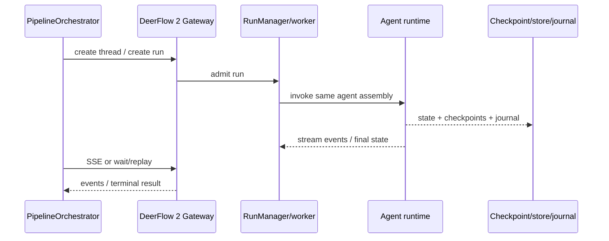
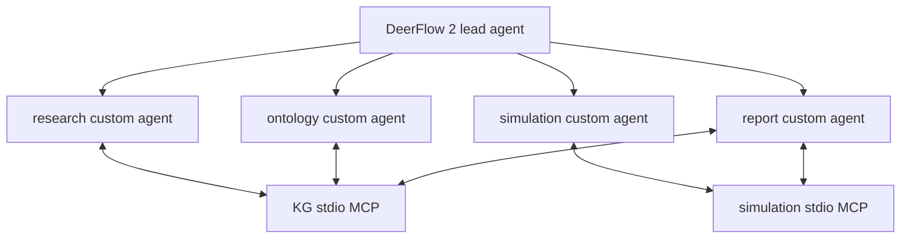
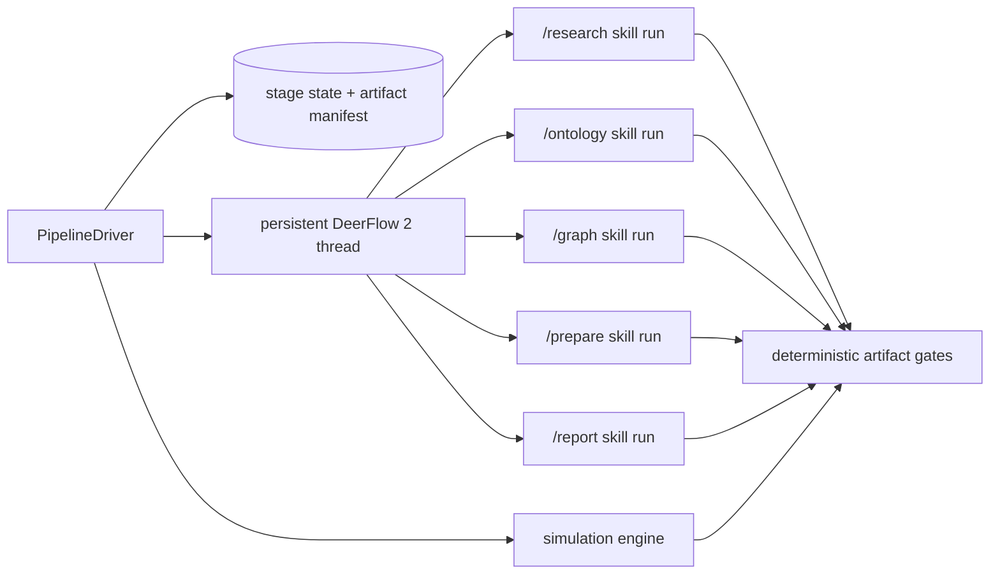

# Architectural approaches for DeepResearchForecast and DeerFlow 2

## Research question and scope

This note compares the architectural approaches that are actually present in the repository or directly available through the bundled DeerFlow 2 runtime:

1. the **current live DeepResearchForecast six-stage workflow**, with embedded DeerFlow 2 inside Stage 1;
2. the **native DeerFlow 2 Gateway / Threads / Runs API** as an alternative Stage-1 transport and persistence surface;
3. the pre-cutover **DRF2 chat-native custom-agent topology** with KG and simulation MCP engines;
4. the pre-cutover **DRF2 deterministic driver topology** that submits slash-skill runs to a persistent DeerFlow 2 thread; and
5. a possible future **durable workflow-engine or service-split topology**, included only as a comparison boundary.

The original DeerFlow 1.x architecture is outside scope. The current Stage-1 implementation is DeerFlow 2, and this comparison does not use the original research graph as a proxy for it.

## Executive conclusion

The repository does not contain one architecture called “DeerFlow integration.” It contains one live product topology and three materially different DeerFlow 2 execution topologies:

- **Live:** Flask and `PipelineOrchestrator` own the six-stage workflow. Stage 1 starts isolated processes that use an embedded `DeerFlowClient`. Three evidence-only Track-A lanes produce sealed evidence packs; the broad baseline lane also owns exactly one shared Track-B actor-intelligence plane; and one fresh tool-free child performs the only global synthesis, report judging and structured extraction.
- **Native DeerFlow 2:** an HTTP gateway can own thread/run admission, checkpointing, streaming and replay for the same agent assembly. This is a transport and run-lifecycle alternative, not a replacement for the other five DeepResearchForecast stages.
- **DRF2 chat-native:** one lead and four custom agents collaborate through skills and stdio MCP engines. This is an agent-team topology in which the harness owns more semantic sequencing.
- **DRF2 deterministic:** a conventional driver owns the six stages and uses persistent native Runs API jobs as bounded stage workers. This is a workflow topology in which the driver, not the chat agent, owns sequencing.

Only the first topology has current end-to-end product authority. The native gateway is implemented but is not the current Stage-1 transport. Both DRF2 topologies are checked-in pre-cutover scaffolds with useful components and explicit gaps; they must not be presented as if they already run the product.

The central architectural choice is therefore not “old DeerFlow versus DeerFlow 2.” DeerFlow 2 is already live. The real choice is **where authority lives**:

- in the current Flask/file-backed orchestrator;
- in the native DeerFlow 2 run service for Stage 1;
- in a chat-native agent team;
- in a deterministic external driver; or
- in a future durable workflow engine.

## Shared facts and invariants

Any approach must preserve the current cross-stage contract:

```text
question/options
  → research contract
  → ontology
  → temporal graph
  → actor cast + personas + simulation config
  → OASIS platform actions + WorldState diagnostics
  → report + structured forecast + audit
  → publication/API/export and optional post-run sidecars
```

The current system also establishes several non-negotiable authority boundaries:

- `pipeline_state.json` is lifecycle authority; `run.json`, the whole-pipeline handoff manifest and the Stage-1 research seal are distinct records.
- Candidate research files are not reusable merely because they exist. The research contract manifest binds exact report, evidence, judge and structured-artifact identities.
- The Stage-1 default is three isolated evidence-only Track-A lanes, exactly one shared baseline Track-B actor plane, and one global synthesis/judge/extraction child. Manifest v3 binds the actor dossier, deterministic source-bound coverage audit, baseline source ledger and optional actor judge with the three lane packs.
- Current actor outputs must carry a top-level `actor-intelligence/v1` report/roster/coverage contract. That authority continues through the canonical ontology projection, deterministic actor graph seed manifest and physical readback, bounded `actor-context/v1`, canonical-only simulation configuration, sanitized `actor-role/v2`, exact platform profile fields, Reddit's attested final model-system bytes, and runner/child-side context/role/profile/cast/config seals. Legacy role v1 is compatibility-only and exact-byte verified; it is not silently recompiled or used as a downgrade path.
- Harness-native child agents and bridge-level KIQ/actor fan-out are alternative breadth planes; they are not stacked by default.
- Graphiti episode extraction is data-dependent. One graph build can expand into many framework-owned model operations.
- The simulation model boundary scales with active actors, rounds, platforms and dependency-owned action turns. The decision channel adds one batched call per eligible paired round.
- Report generation is a graph of outline, tool-loop, section, critique, repair, forecast, market and optional translation/Q&A calls—not one “report call.”
- Publication is an exact-artifact gate. Progressive sections and a raw `forecast.json` are not, by themselves, a published result.

These invariants are mapped in `docs/architecture/DEEPRESEARCHFORECAST_SYSTEM_ATLAS.md`; exact calls and passes are enumerated in the companion JSON inventories.

### Settled actor-realism authority chain

The actor-realism design is deliberately end to end. More detailed research is useful only if every receiver can prove which claims it accepted, preserve the distinction between analyst evidence and actor knowledge, and attest the exact bytes supplied to the simulation model.

| Step | Input → output | Admission, reception, and authority rule |
|---|---|---|
| **1. One shared Track B** | Question, as-of date, horizon, fetched sources and search-result receipts → actor dossier, coverage ledger and structured `actor-intelligence/v1` | The broad baseline lane owns the only Track-B plane. It performs landscape research, cast-wide completion, dossier synthesis, a ten-dimension judge/refine loop and a deterministic coverage audit. Each Tier-1/2 actor is evaluated across the same ordered 17 dimensions: identity/history; values/worldview; incentives; motivations; capabilities; constraints; operational preferences, likes and dislikes; alliances; opponents/competitors; decision rights/process/triggers; current actions; future plans; investments/capital allocation; track record; likely actions; red lines; and knowledge state. The dossier is also available to the global report synthesis, so future plans, incentives, actions and investments inform both the research report and simulation. |
| **2. Claims, receipts, families and seals** | Exact quote/span/content support plus time/epistemic fields → deterministic claim IDs and a sealed actor contract | Every grounded claim binds the fetched source, producer-owned Track-B thread/lane/purpose, search-result receipt, exact supporting quote and span, content SHA-256, validity date/horizon, status, confidence, dependencies, contradictions and qualifiers. Unsupported dimensions are explicit typed gaps. The producer and parent independently close claim hashes and five behavior-ready families—identity/history; incentives/motivations/values; capabilities/constraints; actions/plans/investments; and decision/likely-actions/red-lines—plus coverage counts, actor order/multiset, source/receipt sets, report bytes, dossier bytes and the attempt/lane/thread/checkpoint lineage. A current pinned v1 run cannot enter ONTOLOGY or GRAPH if any seal fails. |
| **3. Canonical ontology projection** | Sealed actor contract → bounded ontology context | The ontology LLM sees canonical actor IDs, aliases, tier and a bounded receipt-bound claim projection. Current-v1 reception excludes legacy flat role, stance, brief and topic fields. This preserves actor identity without turning the complete dossier into unbounded prompt context. |
| **4. Deterministic graph identity** | Structured actors/relationships → `actor-graph-seed-manifest/v1` → physical graph → `actor-graph-seed-readback/v1` | The dry plan and write path share the same deterministic UUID, label, summary/fact hash and causal-attribute projection. Canonical actor, type and alias nodes plus source-bound relationships are seeded before prose. Strict physical readback runs after the seed and after Graphiti prose extraction, resolution, pruning and reuse. Alias resolution may collapse an alias into its own canonical actor, but prose or generic entities cannot replace canonical actor identities or mutate sealed relationship endpoints/attributes. |
| **5. Per-actor epistemic context** | Sealed actor contract + relevant report/graph facts → `actor-context/v1` pack and manifest | Each selected actor receives only relevant evidence, separated into shared public situation evidence; documented evidence about the actor; actor beliefs/knowledge; actor-visible contested evidence; analyst inference; contested/unknown material not automatically known; and a typed gap audit. A current gap has exactly `reason`, `attempted_queries`, `receipt_ids`, `result_ids`, `attempt_count`, and `exhausted`. The audit remains provenance, not actor knowledge. Only source-bound, explicitly public verified facts or actor-stated claims can become hard runtime relationships. |
| **6. Canonical configuration and public world** | Sealed behavior projection + hard-public evidence → deterministic actor activity config, `world_brief`, `simulation_config.json`, and `simulation-config-manifest/v1` | Current-v1 actors may not fall back to flat role/stance/influence/memory/incentive fields. Their activity configuration is rule-generated from the sealed behavior projection. The shared world contains only explicitly public, source-bound canonical evidence; analyst inference is omitted, while publicly contested material retains its uncertainty. The typed gap audit is separately sealed and excluded from behavior/config model tokens. The config manifest closes the exact config bytes, simulation identity and actor-context/cast/role-manifest bindings. |
| **7. Exact platform role and child attestation** | `actor-role/v2` + sealed config → OASIS Twitter and Reddit model inputs | `actor-role/v2` is the sole behavioral profile authority. Twitter `user_char` is the role text with the defined newline-to-space normalization. Reddit `persona` is the role text; age, gender, MBTI and country are empty compatibility placeholders rather than generated behavioral authority. The actual Reddit system message is a deterministic role-only wrapper plus only the optional sealed `world_brief` and calendar vocabulary. The parent recompiles and validates context/role/cast/profile/config bindings; the child repeats its direct config/profile checks, rebuilds the effective Reddit message and attests the final system-message bytes before the first model action. |

**Model-call effect:** this settled chain adds no logical LLM-call families beyond the audited 100-family census. Deeper actor evidence is produced inside the existing Track-B research, completion, synthesis, judge and bounded refinement families. Claim/receipt/lineage/family/report reception, the ontology projection, graph planning/readback, context selection, role compilation, canonical public-world/config projection and all seals are deterministic. For a canonical run, PREPARE also skips the legacy activity-configuration LLM batch and generates that configuration by rule. “No new call families” does not imply a fixed invocation count: DeerFlow and OASIS agent loops remain data-, retry-, actor-, round- and platform-dependent.

**Compatibility boundary:** admission pins whether Track-B v1 is required. A newly admitted current-v1 run fails closed rather than degrading to flat actor data. Runs with an explicitly disabled pinned policy, and pre-policy runs that have no such pin, keep the documented legacy/no-actor path. An older `actor-role/v1` may be reused only with exact-byte validation; it is never recompiled, upgraded or represented as current-v1 provenance. The native DeerFlow gateway and both `drf2/` designs remain pre-cutover and must reproduce this complete chain before claiming parity.

## Approach A — current modular monolith with embedded DeerFlow 2

### Topology



```mermaid
flowchart LR
    UI["Vue /research"] --> API["Flask API"]
    API --> O["PipelineOrchestrator"]
    O --> R["Stage 1 process group"]
    R --> E["Embedded DeerFlowClient"]
    E --> L["3 evidence-only Track-A lanes"]
    L --> B["1 shared baseline Track-B actor plane"]
    L --> G["manifest v3"]
    B --> G
    G --> X["1 global synthesis / extraction child"]
    X --> C["sealed report + actor-intelligence/v1<br/>claim / receipt / lineage / family seals"]
    C --> T["canonical ontology projection"]
    T --> K["deterministic graph seed manifest<br/>+ strict physical readback"]
    K --> P["epistemic context → canonical config / public world<br/>→ exact role + final-system bytes → run → report"]
    O <--> S[("pipeline_state + manifests")]
```

The current system is an evolutionary modular monolith with subprocess capability boundaries. Flask owns product APIs and security. `PipelineOrchestrator` owns stage advancement, recovery, cancellation, lineage and final health. Stage 1 is isolated in a separate environment and process group, but it does not call a DeerFlow gateway. It instantiates the agent runtime directly and receives stream/progress events plus files.

### Strengths

- It is the only approach connected to the full Vue → Flask → research → graph → simulation → report path.
- The orchestrator understands domain-specific reuse: a report file, graph ID or simulation directory is not reused until stage-specific health, schema and hash checks pass.
- Cancellation can target owned research and simulation process groups.
- The file contracts are inspectable and survive application restarts.
- The current Stage-1 coordinator adds product-specific controls that native DeerFlow does not know about: three outer angle lanes, one baseline-only actor plane, shared provider leases, research budget epochs, source registries, source-bound actor coverage, manifest-v3 global evidence sealing and promotion into the DeepResearchForecast handoff.
- Its downstream actor boundary is unusually strong for a local modular monolith: canonical ontology projection, deterministic graph identity/readback, actor-specific relevance selection, epistemic separation, typed gaps, canonical-only config/public-world assembly, recursive sanitization, exact platform-field serialization, final Reddit system-message attestation and all provenance hashes are deterministic and independently rechecked before model execution.
- It supports workstation deployment without another always-on service.

### Costs and risks

- Advancement is owned by process-local threads and locks around file-backed state. Recovery must reconcile durable files with live process ownership rather than replay one durable event history.
- `TaskManager`, browser state and several worker registries are process-local conveniences with contracts that differ from durable state.
- The system carries more than one task pattern: synchronous endpoints, daemon threads, background tasks, child process groups and standalone monitor/scheduler scripts.
- Some current endpoints reconstruct paths instead of following the pipeline's handoff pointer, creating fork-specific seams.
- Stage-1 runtime assembly is split between tracked overlays and a generated deployment tree. The stale guard makes this safe enough to operate, but it increases provenance and packaging complexity.
- Actor depth is expensive and scales with cast size, evidence gaps, judge refinements and later persona/simulation work. The shared baseline plane removes the previous temptation to multiply actor research by every evidence angle, but the remaining actor contract is intentionally fail-closed and can stop a run whose dossier/report/provenance is incomplete.

### Best fit

This topology is best for the current local product because it minimizes services and retains domain-specific control over expensive stages. It remains the baseline against which any cutover must prove parity.

## Approach B — native DeerFlow 2 Gateway / Threads / Runs API

### Topology



Native DeerFlow 2 exposes threads and runs through FastAPI. A `RunManager` admits work, a worker invokes the same agent assembly, checkpoint/store/journal components persist execution state, and clients can receive live events or replay terminal history. This changes the Stage-1 transport from an embedded library call in an owned process to a service-mediated run.

### What improves

- Thread and run identity become explicit protocol objects rather than only bridge process arguments.
- Streaming, waiting and replay use one native interface.
- A worker/service boundary can isolate DeerFlow dependency and memory behavior from Flask.
- Checkpoints and stores can support longer-lived native threads and reattachment when configured durably.
- The deterministic DRF2 driver can use the same interface for slash-skill stage jobs.

### What does not change automatically

- The gateway does not own DeepResearchForecast's ontology, graph, prepare, OASIS or report state unless the product explicitly delegates them.
- It does not create the three-lane evidence manifest, source ledger or whole-pipeline artifact contract by itself.
- Native thread persistence is not synonymous with cross-service workflow authority.
- Moving one agent call behind HTTP does not reduce the number of model turns or change the lead/subagent/tool loop.

### Current seams

The source audit found several gateway details that matter before using it as an authority surface:

- request `body.config` can override the effective configurable thread ID and recursion limit;
- process-local admission keys use the path thread while checkpoint state can use an overridden effective namespace;
- `/runs/wait` creates a run and later reads final state through the path thread;
- run-record restart durability depends on the configured store and can fall back to process memory; and
- an uncaught timeout is classified through the generic error path even though a timeout status exists.

These do not make the gateway unusable. They mean that the product must define which thread ID is authoritative, how a run ID is persisted, how restart reattachment is proven and how timeouts map into the pipeline state machine.

### Best fit

The gateway is best treated as a **Stage-1 execution service** when process isolation, native replay or remote workers are worth the deployment cost. It is not, by itself, a whole-product architecture.

## Approach C — DRF2 chat-native custom-agent team with MCP engines

### Topology



The chat-native DRF2 topology configures a lead plus four custom agents and exposes KG and simulation capabilities over stdio MCP. Skills and agent descriptions tell the lead which specialist to invoke. The conversation/harness becomes the coordinating context, and MCP services isolate domain engines.

### Strengths

- Specialization is visible: research, ontology, simulation and reporting have separate prompts, tools and skill allowlists.
- stdio MCP gives the KG and simulation engines explicit process boundaries with typed tool calls.
- A human can use the lead interactively, inspect intermediate reasoning and redirect a run.
- The topology naturally supports exploratory workflows whose next step depends on discovered evidence.

### Risks

- Workflow order can become an emergent property of the lead prompt rather than a deterministic state machine.
- Long-lived conversation context can mix stage evidence, recovery instructions and prior run material unless namespaces are rigorously scoped.
- “The agent called the specialist” is not enough to prove artifact completeness, idempotency or exact-byte reuse.
- Interactive flexibility conflicts with the current product's requirement that a resumed stage reuse only a validated manifest and never silently repeat expensive work.
- Agent count does not guarantee independent evidence. Specialists sharing the same source material and model may produce correlated outputs.

### Current status

The agent/skill and MCP definitions are implemented, but this topology is not wired as the current `/research` path and has no demonstrated end-to-end parity with the live six-stage pipeline. It should therefore be described as a pre-cutover interactive topology, not the production system.

### Best fit

This approach fits analyst-in-the-loop exploration, debugging and bounded specialist delegation. It is weaker as the sole authority for a deterministic, resumable, expensive six-stage product run unless paired with an external state machine and artifact gates.

## Approach D — DRF2 deterministic driver with persistent Runs API jobs

### Topology



The deterministic DRF2 driver keeps sequencing in ordinary code. It submits bounded slash-skill runs to one persistent DeerFlow 2 thread, reads required artifacts directly, verifies hashes and applies deterministic health gates. This is architecturally different from the chat-native topology even though both use the same harness components.

### Strengths

- Stage order and stopping conditions are explicit in code.
- Required/optional artifact sets and content hashes are machine-checkable.
- Gates read artifacts and engine state directly instead of asking an LLM whether a stage succeeded.
- A persistent native thread can retain relevant context while the driver still owns workflow order.
- The driver/engine separation is a promising test boundary.

### Current gaps

- No live end-to-end product cutover has been demonstrated.
- The checked-in harness configuration lacks the driver's required `base_url` value.
- The deterministic run stage uses a provisional simulation HTTP client, but the repository implements the simulation extension as stdio FastMCP; there is no matching HTTP server adapter.
- The KG interface lacks creation/default/ontology operations needed for full parity.
- The driver does not persist an in-flight native run ID for restart reattachment.
- Status-only reuse can accept a stage with an empty artifact manifest.
- Its sequential ensemble path omits some gates and artifacts used by a single live run, including `run_summary.json` and binary-conviction checks.

### Best fit

This is the strongest DRF2 topology for a future deterministic cutover because it keeps model workers bounded by code-owned stages and deterministic artifact gates. It still needs transport completion, product integration, recovery semantics and parity evidence before it can replace the live orchestrator.

## Approach E — future durable workflow engine or service split

A future design could put run/attempt/timer/event state in a database-backed workflow engine and execute research, graph, simulation and reporting as independently deployable workers. Such an engine would improve durable timers, leases, retry histories and horizontally scalable queues.

That capability is not implemented as current authority here, and splitting by directory would be premature. DeepResearchForecast's hardest boundaries are semantic: exact research seals, graph identity, simulation validity, report publication and outcome stores. Turning those implicit contracts into network calls before stabilizing them would create a distributed monolith with more failure modes.

This approach becomes appropriate only when operating evidence shows that one workstation/process is insufficient, multiple teams need independent deployment, or queue/lease/timer requirements exceed the current controller. Even then, complete runs need one advancement authority; two controllers must never co-advance the same pipeline.

## Comparative matrix

| Criterion | Live embedded DF2 | Native DF2 gateway | DRF2 chat-native | DRF2 deterministic | Future workflow engine |
|---|---|---|---|---|---|
| Current product authority | **Yes** | No | No | No | No |
| Scope | Whole six-stage product | Stage-1 run service | Agent-team workflow | Whole-pipeline driver scaffold | Whole-pipeline control plane |
| Sequencing owner | `PipelineOrchestrator` | Product + gateway run lifecycle | Lead agent/prompt | `PipelineDriver` | Durable workflow definition |
| Stage-1 transport | Embedded client in owned process | HTTP/SSE Threads/Runs | Harness chat/custom agents | Runs API slash-skill jobs | Worker/activity protocol |
| Durable identity | File state + manifests | Native threads/runs/checkpoints, store-dependent | Harness thread plus produced files | Driver state/manifest + native thread | Database/workflow history |
| Determinism of stage order | High | High at product level | Lower unless externally constrained | **High** | **High** |
| Interactive flexibility | Medium | Medium-high | **High** | Medium | Medium |
| Current domain gates | **Broadest** | Agent-run gates only | Partial/skill-defined | Deterministic scaffold gates | Must be rebuilt |
| Actor-intelligence continuity | **17-D receipt-bound dossier → claim/family/lineage seals → canonical ontology → graph manifest/readback → epistemic context/gaps → canonical config/public world → exact role/final-system bytes** | Not provided by native gateway alone | Skill/prompt-defined, no parity proof | Must be added to driver gates | Must be designed |
| Restart/reattach maturity here | Mature reconciliation, not event replay | Store/config dependent; seams noted | Not demonstrated | In-flight run ID gap | Not implemented |
| Deployment complexity | **Lowest** | Additional service/store | Harness + MCP processes | Driver + gateway + engines | Highest |
| End-to-end evidence | **Present** | Stage subsystem only | Absent | Absent | Absent |
| Best current role | Production executor | Optional Stage-1 service | Interactive specialist topology | Cutover candidate/pattern source | Deferred scale option |

## Decision implications

1. Documentation must lead with the current whole-system architecture, not with a standalone DeerFlow diagram. DeerFlow 2 is an embedded Stage-1 subsystem inside a larger product.
2. “Use native DeerFlow 2” must name the exact topology: embedded client, gateway run, chat-native custom agents or deterministic driver. These have different authority and recovery semantics.
3. A Stage-1 gateway migration can be evaluated independently from a whole-pipeline DRF2 cutover. It should preserve the three-lane + one-shared-actor-plane + manifest-v3 global-synthesis contract and return the same sealed handoff.
4. The chat-native and deterministic DRF2 designs should not be merged in diagrams. One makes the lead agent the semantic coordinator; the other deliberately keeps orchestration in code.
5. A cutover claim requires scenario-level evidence: one real pipeline must survive launch, stream, cancellation, restart/reattach, artifact verification, all six gates, publication and replay without the live controller doing hidden work.
6. Model-call counts cannot be compared by counting boxes. The embedded, gateway and custom-agent topologies all contain variable agent loops; the relevant comparison is admission, concurrency, retry, context and artifact authority.
7. Actor parity means preserving the whole reception chain—not copying a richer prompt. A replacement must prove claim/receipt/lineage/family/report seals, canonical ontology projection, deterministic graph readback, per-actor epistemic packs and typed gaps, canonical-only config/public world, and exact platform/final-system bytes without adding a shadow LLM transformation.

## Cutover proof checklist

Before any non-current topology is described as live, it should demonstrate:

- exact configuration and runtime provenance;
- a persisted pipeline ID, native thread ID and in-flight run ID;
- one authoritative mapping between path thread, checkpoint namespace and product pipeline;
- reconnectable streaming or replay after client/process restart;
- cancellation that stops the owned model/tool work;
- the default three evidence-only Track-A lanes, exactly one shared baseline Track-B actor plane and one global synthesis child, or an explicitly approved replacement contract;
- a byte-identical, manifest-last Stage-1 handoff with all required structured outputs;
- mandatory 17-dimension actor-intelligence claim/receipt/lineage/family/report/roster/source/coverage bindings, with typed gaps rather than invented completion;
- a bounded canonical ontology projection and deterministic actor graph seed manifest plus strict physical readback after seed, mutation and reuse;
- per-actor epistemic context packs, canonical-only config/public world, exact Reddit `persona` and Twitter `user_char`, attested Reddit final system-message bytes, byte-verified context/role/profile/cast/config seals, and no current-v1 downgrade path;
- no additional actor-rewrite LLM family between the sealed research contract and OASIS; deterministic ontology, graph, prepare, run and report gates;
- a simulation transport whose client and server protocols match;
- publication-status enforcement over exact report/forecast/audit hashes; and
- clean separation between current runs and pre-cutover/shadow runs.

## Source map

- [`pipeline_orchestrator.py` stage/dimension constants](../../backend/app/services/pipeline_orchestrator.py#L86-L145), [pinned actor policy](../../backend/app/services/pipeline_orchestrator.py#L477-L498), [Track-B receipt reception](../../backend/app/services/pipeline_orchestrator.py#L3515-L3665), [dossier/lineage/final actor reception](../../backend/app/services/pipeline_orchestrator.py#L4138-L5025), [one-lane Track-B ownership](../../backend/app/services/pipeline_orchestrator.py#L5164-L5170), [canonical ontology projection](../../backend/app/services/pipeline_orchestrator.py#L6021-L6132), [graph seed/reception helpers](../../backend/app/services/pipeline_orchestrator.py#L6216-L6397), and the [live six-stage executor](../../backend/app/services/pipeline_orchestrator.py#L10666-L12135) — current whole-product and actor-contract authority.
- [`deerflow_research.py` dimensions and behavior families](../../deerflow_bridge/deerflow_research.py#L2515-L2560), [claim identity](../../deerflow_bridge/deerflow_research.py#L3052-L3070), [final v1 contract persistence](../../deerflow_bridge/deerflow_research.py#L4066-L4235), [source-bound coverage audit](../../deerflow_bridge/deerflow_research.py#L12948-L13372), and [Track-B research/completion/synthesis/judge loop](../../deerflow_bridge/deerflow_research.py#L13625-L13890) — Stage-1 producer side.
- [`graph_builder.py` manifest/readback schemas and causal attributes](../../backend/app/services/graph_builder.py#L66-L128), [deterministic dry manifest](../../backend/app/services/graph_builder.py#L326-L529), and [physical seed/readback/plan](../../backend/app/services/graph_builder.py#L1445-L2176) — canonical graph identity.
- [`zep_entity_resolver.py` canonical-seed priority](../../backend/app/services/zep_entity_resolver.py#L36-L55), [merge exclusions](../../backend/app/services/zep_entity_resolver.py#L233-L417), and [`GraphitiRuntime` physical readback/merge defense](../../backend/app/services/graphiti_client/runtime.py#L1861-L2105) — prose, generic nodes, and alias resolution cannot overwrite canonical actors or sealed relationship identity.
- [`actor_context.py` lossless typed gaps](../../backend/app/services/actor_context.py#L119-L370), [epistemic separation](../../backend/app/services/actor_context.py#L953-L1045), and [pack/manifest validation](../../backend/app/services/actor_context.py#L1299-L1590) — per-actor evidence reception.
- [`simulation_config_generator.py` canonical pack gate](../../backend/app/services/simulation_config_generator.py#L1397-L1450), [canonical public world](../../backend/app/services/simulation_config_generator.py#L1649-L1840), [deterministic-vs-legacy config dispatch](../../backend/app/services/simulation_config_generator.py#L2690-L2955), and [behavior/config projections](../../backend/app/services/simulation_config_generator.py#L3317-L3614) — no flat-field fallback and no canonical config LLM call.
- [`oasis_profile_generator.py` Reddit role wrapper](../../backend/app/services/oasis_profile_generator.py#L59-L86), [sole canonical role field](../../backend/app/services/oasis_profile_generator.py#L146-L214), and [role manifest plus Twitter/Reddit serialization](../../backend/app/services/oasis_profile_generator.py#L2643-L3214); [`simulation_manager.py` config seal](../../backend/app/services/simulation_manager.py#L52-L221); [`simulation_runner.py` prelaunch validation](../../backend/app/services/simulation_runner.py#L497-L725); and [`run_parallel_simulation.py` child-side Reddit enforcement/attestation](../../backend/scripts/run_parallel_simulation.py#L556-L700) plus [direct child config-seal validation](../../backend/scripts/run_parallel_simulation.py#L1262-L1322) — exact model-input closure.
- [Actor-intelligence architecture](../architecture/ACTOR_INTELLIGENCE_ARCHITECTURE.md), [whole-system atlas](../architecture/DEEPRESEARCHFORECAST_SYSTEM_ATLAS.md), [whole-system call census](../architecture/llm-call-inventory.json), and [42-family DeerFlow 2 inventory](../architecture/deerflow2/deerflow2-call-inventory.json) — complete diagrams, status matrix and call accounting.
- [`drf2/config/config.yaml`](../../drf2/config/config.yaml), [`extensions_config.json`](../../drf2/config/extensions_config.json#L1-L40), [`PipelineDriver`](../../drf2/driver/pipeline.py#L45-L336), [Runs API client](../../drf2/driver/harness_client.py#L56-L295), [deterministic gates](../../drf2/driver/gates.py#L1-L225), and [`drf2/README.md`](../../drf2/README.md#L1-L173) — chat-native and deterministic pre-cutover designs and known gaps.

## Final comparison

The current architecture is not “the original DeerFlow system.” It is a DeepResearchForecast-controlled six-stage application whose Stage 1 already embeds DeerFlow 2. The native gateway offers a stronger Stage-1 service boundary; the chat-native DRF2 topology offers interactive multi-agent coordination; the deterministic DRF2 topology offers the clearest future code-owned cutover shape. They solve different problems and have different readiness levels.

For present-tense documentation, the correct architecture is the live modular monolith plus embedded DeerFlow 2 Stage 1. The other approaches belong in a clearly labeled comparison and pre-cutover plane until they produce end-to-end parity evidence.
