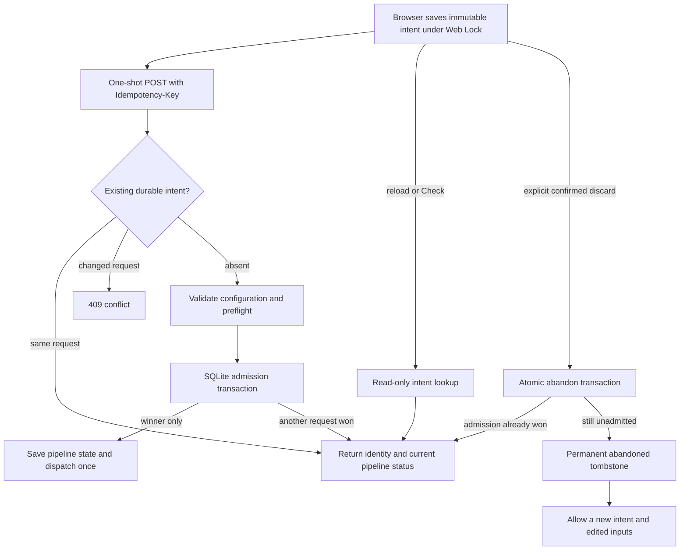

# ASTRA-03: durable launch admission

Implemented on the isolated `codex/astra-workflow-review-2026-09-07` branch. This slice prevents accidental duplicate **keyed initial launches** when a response is lost, the browser reloads, or clients submit concurrently. It also provides a safe way to discard an unadmitted request with invalid inputs. The production checkout and live providers were not changed.

## Connected behavior

`ResearchView` uses `createLaunchIntentController` to capture an immutable payload and cryptographic UUID in localStorage under a Web Lock before calling `runPipeline`. The API normalizes the caller's inputs and looks up that identity before current model availability or preflight checks. New admissions go through `PipelineOrchestrator.start_idempotent`, which commits the identity and initial state snapshot in SQLite before creating a task, saving pipeline state, and starting the initial worker.

The ledger is `Config.PIPELINE_DATA_DIR/launch_intents.sqlite3`, outside individual pipeline directories. A unique hashed key and canonical request hash determine admission; prompt equality alone is not identity. Separate threads and backend processes contend through the same SQLite transaction. Only its winner receives a dispatch opportunity. The pipeline JSON remains the current execution authority; the ledger records the original admission and dispatch history.



The browser keeps admitted identities until an explicit New action. An unresolved transport error keeps the saved payload and offers Check, exact Retry, and confirmed Discard. A generic 400 or a lookup 404 is never treated as proof that another request did not admit the key. The discard endpoint atomically writes an abandonment tombstone only if admission has not won; a delayed POST can never dispatch that retired key. An already-admitted pipeline is returned unchanged.

An interrupted dispatch retains its identity. The UI can explicitly open a readable saved run, and an intentional new run requires confirmation naming the uncertain prior pipeline. A stale tab cannot replace or remove a newer shared intent. Deleting a viewed pipeline returns to setup while retaining its launch identity.

## API contract

| Operation | Behavior |
|---|---|
| `POST /api/research/run`, `Idempotency-Key: <key>` | Admit a new key after preflight, replay an existing identical request, or return its permanent abandoned tombstone. |
| `GET /api/research/launch-intents/<key>` | Read current admission information; never dispatch, resume, or initialize an absent ledger. Unknown keys return 404. |
| `POST /api/research/launch-intents/<key>/abandon` | Explicitly prohibit an unadmitted key from dispatching, or return an existing admission unchanged. It does not cancel/delete existing work. |
| Legacy unkeyed `POST /api/research/run` | Preserves the existing start contract. It remains non-idempotent and must not be automatically retried. |

Keys contain 16–128 URL-safe letters, digits, underscores, or hyphens. Browser-generated keys are UUIDs. Successful responses contain `pipeline_id`, `task_id`, `mode`, `status`, `launch_status`, `replayed`, and `recovery_required`. Abandoned tombstones have null pipeline/task/mode, `status: cancelled`, `launch_status: abandoned`, and `recovery_required: false`.

`launch_status` records `admitted`, `dispatching`, `dispatched`, `failed`, or `abandoned`; `unavailable` is a response projection when pipeline JSON is missing, corrupt, or incompatible. `status` comes from the current pipeline JSON where readable. Historical dispatch uncertainty remains visible even after an explicit resume, so `recovery_required` must not be interpreted as proof that the current pipeline is stopped or incomplete. The UI's Open saved run action inspects current execution state.

Changed canonical requests return 409 with `launch_intent_conflict`. Storage problems return 503 with `launch_intent_unavailable`, without falling back to an unkeyed launch. Invalid keys/inputs return 400. Canonical fields are prompt, mode, project_name, depth, max_rounds, language, and model; unknown fields are ignored as before. Omitted depth/model/language remain unset in request identity rather than incorporating mutable server defaults. `language: auto` is distinct from omission, and the existing `research_language` alias is accepted.

## Verification

- **134 backend tests passed** across launch storage, HTTP integration, lifecycle isolation, infrastructure, and orchestrator regressions.
- **105 frontend Node tests passed**, including 19 launch-controller regressions.
- Production Vite build, changed-file Ruff, browser harness syntax, and diff whitespace checks passed.
- Real Chromium acceptance used a loopback fixture with no provider/backend proxy. It verified lost-response reload recovery with one launch POST before and after reload, cross-tab identity sharing, deliberate New, stale-tab rejection, mobile overflow, deterministic rejection retirement, lost-discard-response recovery, explicit access to interrupted launches, and focused confirmation containing the existing pipeline ID. No page errors occurred; expected injected HTTP/network failures appeared in the console.
- Independent review reproduced and resolved rejected-input and interrupted-launch UI dead ends, and identified a delayed-thread startup ambiguity. The initial worker now checks persisted task identity before entering work, preventing a delayed initial thread from following a same-process resume that already replaced its task.

Machine-readable results and source hashes are in [astra-launch-verification.json](astra-launch-verification.json). The SQLite-only characterization is in [astra-launch-benchmark.json](astra-launch-benchmark.json); its observed admission/lookup latency excludes pipeline file writes, HTTP, and providers and does not establish an end-to-end speedup. Screenshots are retained under `docs/research/astra-launch/`.

## Reproduce offline

Use the repository root as the working directory. Dependencies used in this session came from the existing original checkout; no dependency lockfile or original source was changed.

```sh
DRF_TEST_PROCESS=1 /Users/rogerlin/Downloads/DeepResearchForecast/backend/.venv/bin/python -m pytest \
  backend/tests/test_launch_intents.py backend/tests/test_launch_intent_api.py \
  backend/tests/test_runtime_lifecycle_isolation.py backend/tests/test_audit_fixes_infra.py \
  backend/tests/test_wave9_orchestrator.py -q
npm --prefix frontend run test:unit
npm --prefix frontend run build
```

For browser acceptance, run the isolated fixture in a separate terminal and stop it with Ctrl-C afterward. It binds only `127.0.0.1:18743`, mutates only its own in-memory test records, and serves the selected build directory.

```sh
python3 backend/tests/fixtures/astra_launch_qa_server.py --directory frontend/dist
```

With Node/npx and the Playwright CLI skill available, run:

```sh
mkdir -p output/playwright
python3 - <<'PY'
import subprocess
from pathlib import Path
cli = str(Path.home() / '.codex/skills/playwright/scripts/playwright_cli.sh')
subprocess.run([cli, '-s=astra-launch', 'open', 'http://127.0.0.1:18743'], check=True)
try:
    code = Path('frontend/tests/manual/astra-launch.playwright.js').read_text()
    subprocess.run([cli, '-s=astra-launch', 'run-code', code], check=True)
finally:
    subprocess.run([cli, '-s=astra-launch', 'close'], check=False)
PY
```

The harness verifies both the exact fixture origin and a fixture-specific health marker before every localStorage reset. It blocks page requests to other origins. This is an isolated acceptance scenario, not a test against the running product backend.

## Limits and follow-up boundaries

1. The guarantee is at-most-once initial dispatch per durable key. It is not a general exactly-once execution guarantee or a distributed lock for every resume/continue operation.
2. If interruption occurs after SQLite admission but before `pipeline_state.json` is saved, the identity and initial snapshot survive. Existing `/resume` still requires pipeline JSON; this slice does not automatically materialize missing state. A future explicit recovery operation requires separate design and verification. Current replay retains the identity and refuses to start replacement work.
3. Preserve the ledger alongside pipeline backups. Intent and abandonment records do not expire and survive ordinary per-pipeline deletion. Removing or rolling back the ledger independently destroys the admission history needed for this guarantee; retention integration belongs with ASTRA-17.
4. The new browser path requires durable localStorage, Web Locks, and cryptographic UUID support on HTTPS or localhost. Unsupported coordination/storage fails before launch rather than silently weakening the guarantee. The original dirty checkout's separate UI cleanup has not been merged or tested by this slice.
5. Implementation is local and undeployed. No paid request, saved-run execution, service restart, credential change, or production performance measurement occurred. GitHub publication remains blocked by the previously rejected authentication.

ASTRA-01/02/03 are now verified offline. The hourly improvement loop continues with ASTRA-04, durable usage accounting and cumulative budget enforcement. Seventeen recommendations remain; this result does not establish overall optimality.
