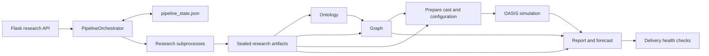

# Orchestration and cross-stage architecture

Source baseline: `ec29ab1d4b9a74ae9f0bea1b4644e4582a3a4d6f` in the original checkout. This report describes the current implementation and labels proposals separately. The separate ASTRA branch is examined in `history-reuse.md`; findings already fixed there are integration work, not missing implementations.

## Runtime authority

The live application is a Flask application whose research API invokes `PipelineOrchestrator`. The orchestrator owns a background thread per pipeline, stage transitions, lifecycle controls, provider-outage handling, research subprocesses, preparation, simulation polling, report generation, and final delivery checks. `TaskManager` projects progress; it does not replace the durable pipeline record.

`PipelineState` carries pipeline/project/graph/simulation/report identities, owner PID and boot ID, heartbeat, current stage, options, artifact links, and individual `StageState` records. `PipelineManager` writes `uploads/pipelines/<id>/pipeline_state.json` atomically under a process-local per-pipeline lock. Schema migration preserves older states and detects versions newer than the current application. See `backend/app/services/pipeline_orchestrator.py:659`, `:682`, `:831`, `:916`, and `:1107`.

The persistence model is already more than a simple sequence of function calls. Removing the coordinator without preserving its cancellation, interrupted publication, shared handoff, and reuse rules would remove working behavior.

## Lifecycle and identity

| Operation | Behavior and source | Architectural consequence |
|---|---|---|
| Start | `PipelineOrchestrator.start`, line 7540, captures actor and safety policies, saves state, then launches a daemon thread. | Admission and execution are separate failure windows. Existing ASTRA launch-intent work must be reconciled before redesigning admission. |
| Resume | `resume`, line 7727, retains pipeline identity, allocates a new task, resets the failed stage, and re-enters `_run` from the beginning. | Resume correctness depends on each stage's reuse decision, not only `current_stage`. |
| Continue | `continue_to_full`, line 7834, promotes research-only state and makes downstream stages pending. | Stage adapters must support existing research-only artifacts. |
| Fork | `fork`, line 7900, shares the base project, graph, and handoff but creates new simulation/report work. | Regeneration needs explicit ownership and copy-on-write; a fork must not overwrite the base's evidence or derived state. |
| Cancel | `cancel`, line 7602, signals the thread and terminates research process groups or simulation work. | Cancellation is a control signal that must propagate through adapters and checkpoints. |
| Orphan recovery | `reconcile_orphans`, line 7257, uses owner/heartbeat and existing report health. | An absent in-memory thread alone is insufficient evidence that durable work is dead. |

`resolve_handoff_dir`, line 859, is already a shared-handoff resolver with path containment. Replacing it with `<pipeline_id>/handoff` would regress scenario artifact access.

## Current stage flow

### Research

`_run` begins at line 11499. Research reuse first checks the existence and minimum size of the report, then the research contract's integrity and quality. A valid evidence-synthesis manifest can recover global synthesis without repeating evidence gathering. A legacy completed stage follows the older artifact-manifest path. These are deliberately distinct admission rules.

The ordinary path selects parallel evidence tracks or a single track. Research concurrency, lane ownership, budget epoch, prompt hash, checkpoint identity, and attempt identity cross the subprocess boundary. `_run_parallel_research_tracks` starts at line 10681; `_run_research_synthesis_recovery` starts at line 10462; `DeerFlowResearchRunner._run_attempt` starts at line 2002. The runner writes prompts to a private temporary file, builds the child environment, streams progress and usage, enforces timeouts/cancellation, and checks the returned artifact.

`_sync_deerflow_bridge_if_stale`, line 1325, is **not a read-only preflight**: it copies tracked bridge files and applies overlays into the deployed DeerFlow tree. The codebase study must not invoke it against the active deployment. The implementation plan should eventually separate deployment validation from pipeline execution while retaining the current safety checks.

The parent performs allowed postprocessing and publishes a manifest-last research generation with `_finalize_research_contract`, line 3354. For full runs, `_enforce_actor_intelligence_reception`, line 5415, checks the required actor plane before RESEARCH completes. Actor evidence is not just prose: reception verifies schema, claim/source identity, support, sealing, and lineage.

### Ontology

At line 11916 the coordinator reuses an existing project's ontology when present; otherwise it creates a project, stores extracted report text, passes actor dossier plus report and actor context to `OntologyGenerator`, stores the resulting schema in the project, and writes `handoff/ontology.json`. The richer ontology is retained rather than reducing it to only entity and edge types.

In this baseline, existing ontology presence is the admission condition and artifact publication is best-effort. The ASTRA branch adds a cached-ontology integrity fence. Neither mere existence nor an output checksum proves that the ontology was produced from the **current** report, dossier, actors, question, and generation policy. Full input binding and safe downstream invalidation are separate requirements.

### Graph

At line 11998, graph reuse combines stage status, graph identity, artifact checks, sealed actor-seed readback, and a nonempty entity check. Reuse re-registers ontology in process memory. Rebuild creates a new graph, sanitizes and chunks the selected report/dossier inputs, seeds structured actors and relationships, adds text episodes, waits for processing, and computes optional communities, aliases, pruning, and priors.

The actor seed contract is checked after seeding and again after mutating graph operations. Those checks must survive any ingestion optimization. The existing configurable chunk source and deterministic actor seeding mean that “add structured actor ingestion” would duplicate existing functionality; the opportunity is to measure and avoid residual redundant extraction while retaining evidence coverage.

Derived graph files have heterogeneous publication rules. Several are written only when results are nonempty (`communities.json`, `entity_merges.json`, `graph_priors.json`, structural priors). A changed graph can therefore leave an old file at the same handoff path unless invalidation explicitly handles empty new results. This is a source-level hazard, not a newly run failure reproduction.

### Prepare

At line 12342, PREPARE reuse checks a completed stage, existing simulation, artifact manifest, and sealed simulation config. A rebuild creates a new simulation and generates cast, profiles, agent context/roles, events, calendar configuration, and scenario inputs using the current report and actor artifacts. The actual round limit and research language are propagated.

Scenario overlays and world-state seeds mutate configuration **before** the final reseal and `_complete_stage`. Completed simulation reuse checks are deliberately performed before mutation so that a healthy run's exact consumed config is preserved.

The PREPARE reuse predicate does not directly require that the existing simulation belongs to the graph that the GRAPH stage just selected or rebuilt. A unified upstream fingerprint should cover this missing cross-stage relationship. Input validation must precede updates to completed-stage bookkeeping.

### Run

At line 12549, RUN reuse is conditioned on PREPARE reuse, matching simulation identity/status, artifact checks, and recorded completion. A disk recovery route can recognize a completed simulation even when the pipeline stage bit was lost. Fresh execution starts the parallel OASIS subprocess and polls rounds with cancellation and a separate stall watchdog.

Completion requires more than process exit or a status enum: the coordinator publishes `run_summary.json` and requires completion evidence for the enabled platforms. It imports child usage on both normal and failure paths. Simulation feedback into the observed graph is governed by the pinned safety policy, and is disabled by default. Preserve this epistemic boundary throughout the rearchitecture.

### Report

At line 12794, REPORT discovers a candidate by report ID or simulation ID, checks deliverable health and registered artifacts, or creates a new report ID before generation. The primary constructor receives actors, sources, research report, situation brief, scenario/base context, quantitative data, contested claims, timeline, and graph priors. The seed-ensemble constructor at line 8488 does not carry the same structured research arguments. The report specialist reviews API and chat paths as well.

The REPORT artifact specification at line 9176 registers visualization metadata when enabled. It does not enumerate the core final report and forecast as ordinary stage-manifest entries. Health checks provide additional coverage, but do not equal an input-bound report-generation contract. Core delivery identity and publication should be explicit before adding reusable section checkpoints.

`_maybe_run_seed_ensemble`, line 8149, runs after the primary report. Final health evaluation is the actual completion gate; `_run` then marks the pipeline complete. A generation key must include seed ensemble/checkpoint provenance, and report publication must account for post-generation ensemble updates.

## Integrity, freshness, and publication are different checks

`_validate_reuse`, line 9418, verifies registered output paths, bytes, hashes, and lightweight schema against the current stage identity. Missing manifests and missing optional entries intentionally use legacy compatibility. `_reuse_ok`, line 9507, rejects unexpected validation exceptions.

These checks answer whether an artifact is consistent with its registration. They do not consistently answer whether all upstream inputs still match the inputs that produced it. `_complete_stage`, line 8629, marks completion and tries artifact registration while swallowing registration failures. `_record_stage_artifacts`, line 9323, may refresh a registration from current bytes. A new design needs an immutable generation receipt and an explicit legacy classification so a failed modern publication cannot quietly become an unverified legacy artifact.

## Proposed extraction order

1. Reconcile proven ASTRA improvements, preserving their tests and source ownership.
2. Introduce a pure dependency/reuse planner operating on existing state and artifacts. Its first mode explains decisions without executing or mutating anything.
3. Bind ontology and PREPARE to effective input generations. Persist owned invalidation before regeneration; retain old generations and fork ownership.
4. Extract the research runner and contract reception into cohesive modules while retaining existing import facades. Avoid changing algorithms during this move.
5. Centralize final report context assembly across primary, seed, API, and chat paths; then add input-bound report publication/checkpoints.
6. Extract stage execution adapters only after characterization tests pin their behavior. Keep one top-level state owner.

See the root `PLANS.md` for ordered implementation slices and acceptance scenarios. These are proposals; no runtime implementation has been performed in this study.

## Review coverage

`pipeline_orchestrator.py` received complete AST enumeration and selected-function behavioral review, including the main six-stage execution path, start/resume/fork/continue, runner boundaries, artifact specs, reuse, completion, report construction, and deployment sync. Some large actor-reception and merge helper families were inspected structurally and through their call boundaries, not line by line. All 13,101 lines are in the hashed inventory; exhaustive semantic review is not claimed. Other specialist reports cover the called implementations.
